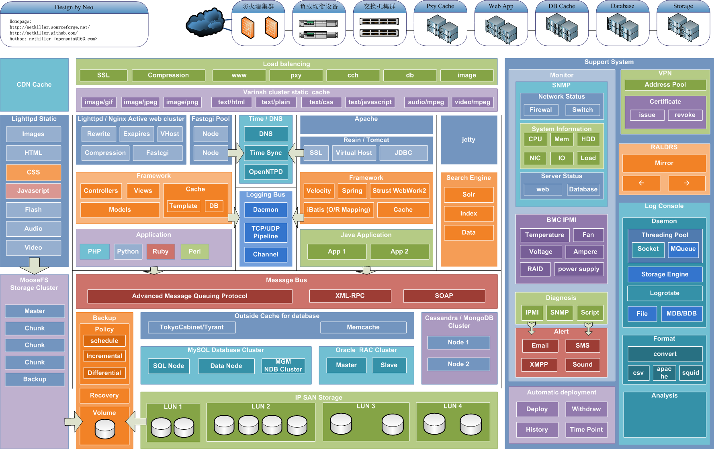
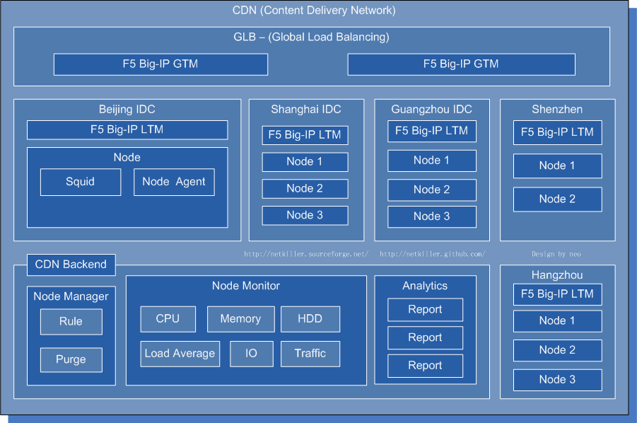

# 部分 I. Multi-dimension Architecture

## Design and implementation of a website solution with step by step

## 第 1 章 Architecture Overview

Overall structure

## CDN (Content Delivery Network)

I analyzed CDN realization principle, look at the picture below.

## 第 2 章 Enterprise Architecture

## 仓库管理系统（warehouse management system）