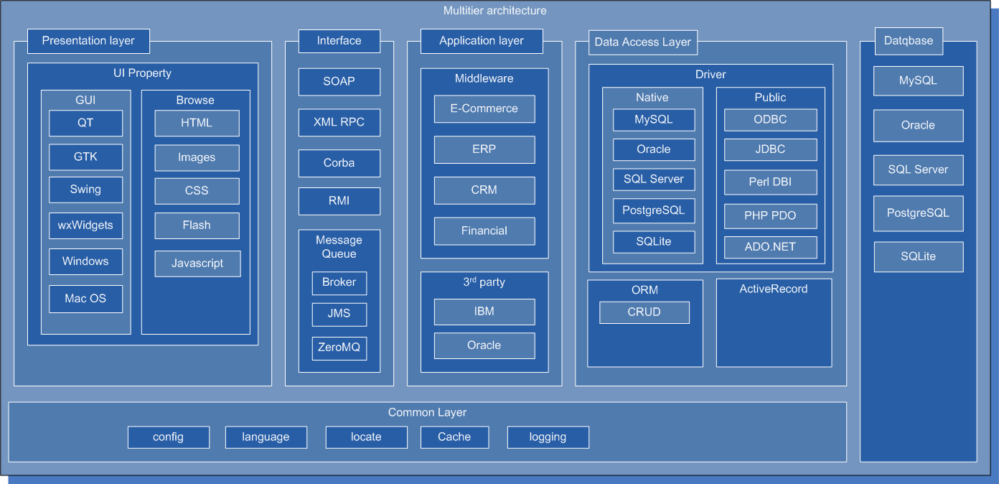
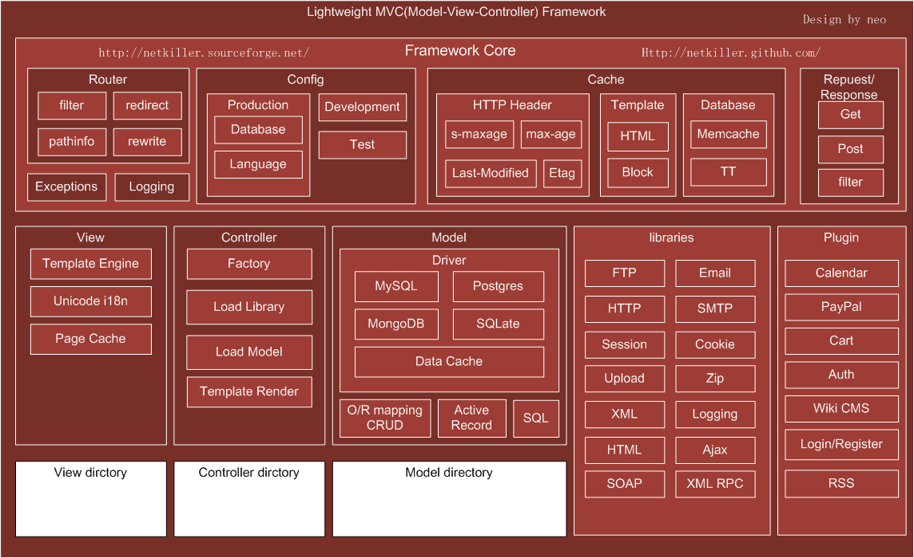
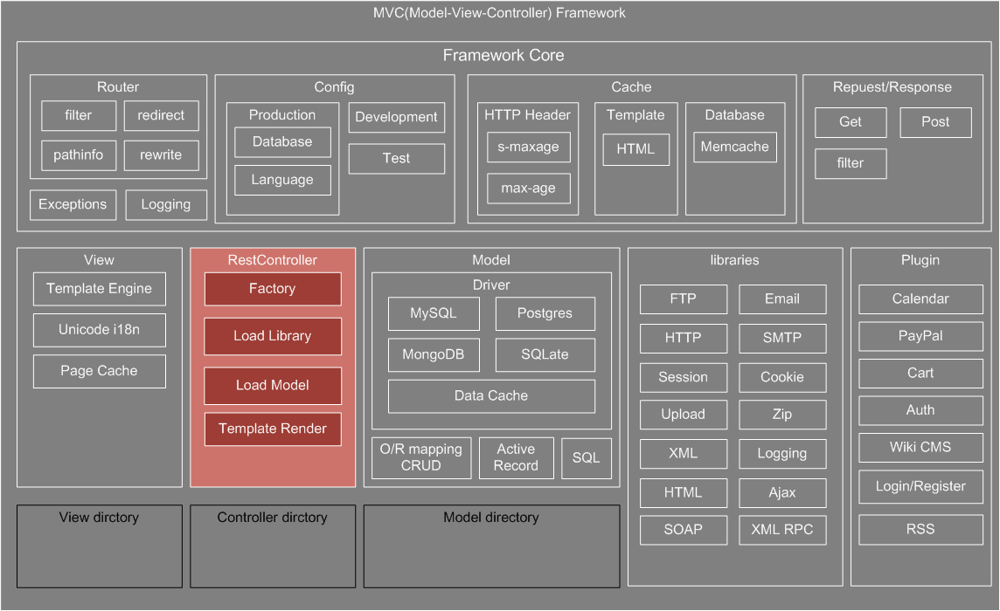
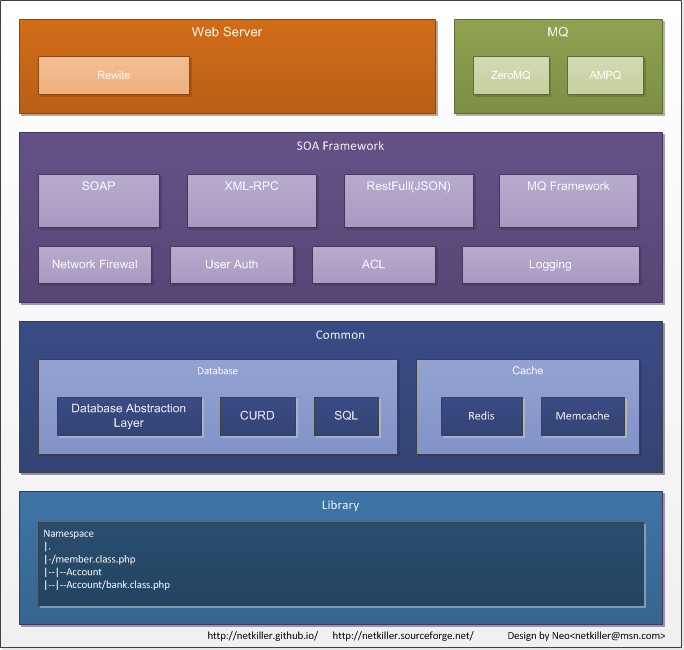
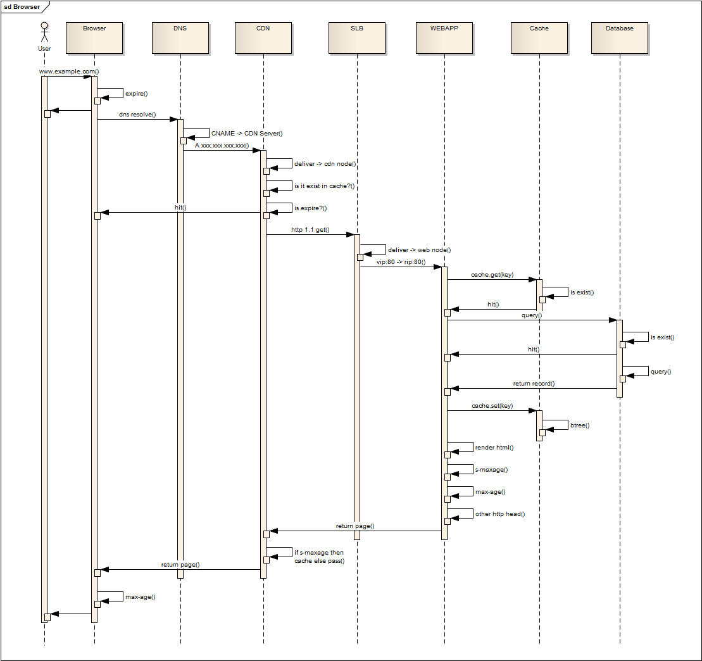
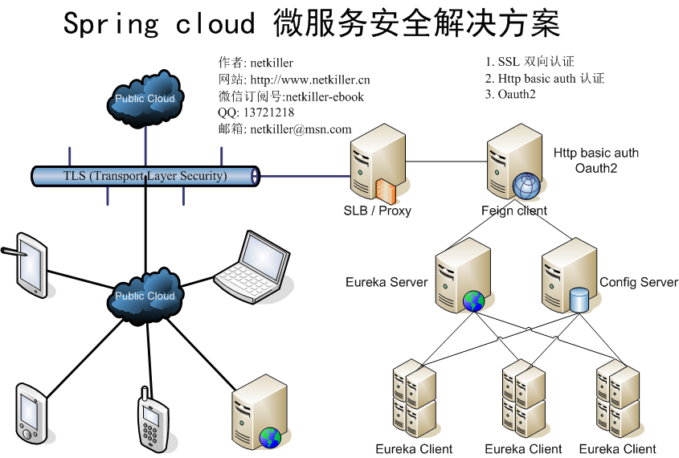

# 部分 III. Software architecture (软件架构)

## 第 13 章 Project

## 开源模式

我在 IT 行业干了 12 年，做过大大小小的公司不少，项目管理上有乱来的，有 ISO 国际化的，先进的 CMMI 过程的，还有开源方式的。 我比较趋向开源模式，最近几年一直在外企背景的本地公司，开发模式采用开源模式的企业应用模式。 近年来开源模式有颠覆传统商业模式趋势，很多公司开始寻求开源盈利模式，IBM，Oracle 是非常成功的，Sun 反映不及时，受到冲击最大。 具有代表行的开源盈利模式是 MySQL, Redhat。

开源模式，没有那么多条条款款限制，比较灵活，反应速度快速。并且适合任何规模的项目，小到几个人，大到上千人。 其特点为拥有 3-5 名核心维护人员，参与开发的人员 10 人-40 人之间，采用 SVN 进行代码管理，通过 maillist/irc 进行开发交流，有明确的开发计划和日程。

开源没有严格等级的组织架构，团队领导仅仅是组织/协调工作，合并代码。 开发人员比较分散，可能两地，三地，甚至更多参与开发。并且同时进行开发，多个模块向前推进。来完成一项伟大的工程。 成员有什么好想法，就发布在 mailing list 上，大家讨论，确认下来，你就可以开始开发。 如果与大家不同意你的 idea，你可以产生一个项目分支。

这种模式对参与人员能力要求比较高，要求能独立完成任务，有创意，自觉性强，团队合作意识强，。

开源模式也有它的缺点，不能一概照搬，如果照搬开源模式，显而易见人力成本太高了。 因为开源成员都是精英及大师黑客，一个开源项目团队就像海军陆战，单兵作战以一抵十，团队作战所向披靡。 而且黑客的个性很强，企业不一般不需要员工有个性和创造力，这不便于管理。只要按需求做，不出错误就是好员工。

目前国内企业仍是以高级工程师为核心带领年轻的程序员或应届毕业生方式进行项目开发。

我不得不说中国人很爱跟风，接受能力最快。什么技术流行我们就用什么，最新的技术应用都在中国，你会发现我们的技术是最先进。更本不等市场验证。

在国内企业中你会发现很多眼花缭乱的术语，技术及软件全部用在项目中，向 UML, Visio, Project, Rose, FreeMind, ER-Win, ISO, CMM, GB...

你会发现我们太先进了，Project 管理项目，Subversion/VSS/ClearCase 控制版本，UML 建模，我们用 ER-Win/Power Design 设计数据库，我们文档用 CMM 格式，MVC 开发框架，ORM 操作数据库，我们用 Load Runner 测试，我们用 QQ/MSN 沟通。 我们在按着别人的思想，别人定义的标准，帮别人验证他们想法是正确的。如果失败了，就推到重来。

我们的外国客户，还在用 ssh 登录 vim/emacs 开发，还再用 CVS 还是命令行的，Trac/Wiki 管理开发资源，开发文档就是一个简单功能说明，在邮件列表上沟通

...

## 开发语言及平台

语言只是一个工具，一种实现我们需要的工具，每种每言都有它的优点和缺点和，在不同领域发挥各自的长处，并且都有它存在的意义。

语言不段地发展，市场决定它们是生存还是没落走向死亡。只有最活越，生命力强的语言才能生存下来。.net 与 java 后面是强大的财团做后盾，大量被捆绑的客户支持他，并有完备的客服，从商业角度选择它是没有错误的。

但不要拘泥与语言，使用你最熟悉的语言,选择你最擅长的数据库和操作系统。

目前大型网站都不会单一选择一种语言和数据库，一种操作系统。例如:

*   淘宝，前端展示页面采用 php,后台管理采用 java...
*   Yahoo，主要使用 php 开发，但搜索引擎采用 java...
*   Ticketmaster，前端展示采用 perl 开发，后台管理 java, 前台展示数据库采用 mysql,会员数据库采用 oracle

像 php/perl/python 这种动态语言，开发速度快，周期端，对服务器性能要求低，出错率低，他们的设计这希望它能尽量使代码运行下去， 而不是抛出异常，终止执行或崩溃。而行对于开发者要求门槛比较低。 php 无论怎么开发都不会使 web server 崩溃。而 Java 则不同，很容易崩溃。

Java 我认为 java 是个非常不错的语言，错在 JVM 上。这是一个垃圾的解释器，效率极差。不加优化的，把所有东东全部 load 进内存。采用 java 技术，开发成本相当高，对开发人员要求很高，而且需要一个稳定的团队。国内资深 java 开发人员大多转向管理层。 只有细心的人才能驾驭 Java，否则不能保证软件质量，我在工作中发现 php 团队开发的代码质量明显比 java 高，bug 数量上比 Java 代码的 bug 少很多。 我个人认为少于 5 年工作经验程序员很难写出一流的 Java 程序。 Java 架构最不能容忍的是有时不得不 restart 才能生效。而写的很烂程序你不得不采用 restart 来保证系统正常。

.net 不是很熟悉，.net 开发环境最好，速度比 java 快，只要有钱，全用正版，选择微软的产品很不错。很多 linux 爱好者鄙视 M$, 对 windows 系统很有很大偏见，偏激。 window 系统很稳定，并非像网上传的那样不堪一击，很多引起 windows 崩溃的原因是硬件问题。我在工作中发现国产服务器在板卡接口上做工不过关。 没有镀金或防氧化处理，导致内存丢失，cpu 丢失，RAID 丢失... 等等引起系统崩溃。但 linux 系统确能运行下去，不过一旦重启，将不能恢复。

### 分层架构

#### 中间件 Middleware

[`en.wikipedia.org/wiki/Middleware`](http://en.wikipedia.org/wiki/Middleware)

|  |

很多人谈到 java 就会涉及到三层架构即：web 容器 -> application server 应用服务器，中间件 ->数据库

三层架构其实不是什么新鲜东西，J2EE 仅仅是对象请求代理体系结构的一种，任何语言都能实现三层架构。中间件不是 Java 专利

*   编译执行的语言基本都支持 Corba

*   python 则有 Zope，Zope 是一个很成功 App Server。足以比肩 J2EE. python 也支持 corba 库，我尝试过 python -> corba -> PostgreSQL.但性能不佳。

php/perl 一样可做到,采用 SOAP，XML-RPC 等技术,可以实现部分功能。但我们可以在架构上做些改变。

总之，不要拘泥于三层架构，仅仅是实现方式的一种。没有最合理，也没有最好的，根据你的需求作出调整，最终是看结果，而不是实现过程。

#### 分层

中间件的概念

```

         /--> app server ---\
web ---> ---> app server ----> Database
         \--> app server ---/

```

php 分层

```

                 /--> web server ---\
load balance ---> --> web server ----> -> Database
                 \--> web server ---/

                 /--> web server ---\                   /--> app server ---\
load balance ---> --> web server ----> -- SOAP/XMLRPC--> --> app server ----> Database
                 \--> web server ---/				    \--> app server ---/

```

你可以采用复核型架构，我曾经就做过这样的项目 php -> soap -> .net framework

```

                 /--> module ---\
apache ---> php ----> module ----> MySQL Database
                 \--> module ---> soap ---> IIS ---> DCOM ---> C# script  ---> SQL Server
                  \-> module ---> tomcat ---> jasper report ---> Oracle

```

我们系统有一个需求是，在 php 中创建 word,excel 文档，编辑文档，比较文档..., 我们需要调用 office.dll 实现

同时我们有一个报表系统，是通过 jasper report 实现的

另外 fastcgi

```

			    .--> fastcgi process ---.
			   /                         \
web server ---> ---> fastcgi process -----> Database
			   \                         /
			    `--> fastcgi process----'

```

### Web 2.0

商业炒作产物，对于纯高技术的人来说，虚头

### 云计算

云计算还是个概念，但在云计算大潮中，不支持云计算，显得没有技术含量。

被网络炒得“神乎其神”。起初我误以为是分布式计算的下一代，后来发现和分布式计算根本两个不同的东西。与网格计算/分布式计算扯不上边。

"云计算"这个词已经被泛滥使用，

比较靠谱是亚马逊 EC2 其实就是一堆 Xen 虚拟机, Dell 说他的刀片服务器是云计算，Vmware 也说是云计算，Oracle 说他的 VirtualBox 是云计算，说 ZFS 是云存储。我也说不清楚，自己斟酌。

#### 云计算的三种服务模式

IaaS,PaaS,SaaS

### 跨平台

没有真正的跨平台语言，所谓跨平台都是忽悠人。

只要提供不同平台的编译器加条件编译，即可实现跨平台。或提供不同平台的解释器，也可一实现跨平台。

例如大家都很看中 Java 的跨平台，但想一下，这个“跨平台”是要打引号的，实际上这个跨平台准确的说是跨 Sun 提供的标准 JVM 平台，而非 OS 平台。只要某个 JVM 支持某个 OS，你的程序才可以跨过去。如果 JVM 不支持这个 OS 平台，Sorry，你的程序不可能跨过去。 不信你去 java.sun.com 下载 jre 你会发现仅仅提供四个平台版本 Linux,Mac OS X,Solaris,Windows

很多 OS 都不支持 Java。如 FreeBSD 就不支持 Java,必须使用 Linux glib 运行 Java，效率很低,IBM 用的是 IBM 自己开发 JVM 至于他和 Sun Java 有什么关系，可能是授权。

只要能让你的程序翻译成 JVM 字节码，你的程序就可运行在 JVM 上。如：

php 通过 Quercus(http://quercus.caucho.com/)把 PHP 文件编译成.java 文件,让后 javac 编译成 class 文件后在一些 JavaEE 应用容器中运行 PHP 程序

Jython 可以将 Python 编译成 java 文件

JRuby 可以将 Ruby 编译成 java 文件

虚拟机并非只有 JVM，还有 Parrot, Perl6 就是在 Parrot 虚拟机上实现的。

另外开发一种新语言也并非难事，只要你有时间精力投入我想不出 3 年，就可以打造一门新语言。

开发新语言也并非难事，只要你有时间精力投入我想不出 3 年，就可以打造一门新语言。

### 编译语言比脚本语言安全

错！

编译不能保证代码安全，仅仅能保证你的代码不被人使用。

但目前中国人力成本相当的便宜，重新实现你的功能逻辑并非难事。所以只要你的网站上线，在很短的时间内就可以出现很多山寨版。

编译流行的原因是为了解决微机的速度以及存储问题，随着微机处理器技术突破，你根本不用担心速度问题。中型机与大型机领域脚本语言站多数。

### 封装重用

重用可以减轻劳动，但过分重用，会牵一发动全身。

尤其对于二次开发者不熟悉你的系统，导致修改一个 bug，又产生新的 bug。

另外模板也不宜拆分的过于零碎。模本的组装，需要很多时间并很消耗你的资源。

### 相关的工具

#### 开发工具

Mozilla Firefox 及扩展

*   Web Developer

*   Firebug 调试必备工具

*   YSlow 性能分析工具

*   Live HTTP Headers 相当于 HTTP Sniffer 嗅探器，可以跟踪 HTTP 协议头，调试 cache 时比较有用。

*   IE Tab 用于 IE/Firefox 之间切换

*   FoxClocks 如果开发工作跨时区，这个很有用

*   Foxmarks Bookmark Synchronizer/Weave 将开发资源放入书签，同时在开发团队中保持同步

*   Fasterfox 可以一显示页面载入时间，方便页面优化. 如果安装了 YSlow 可以不装这个插件。

*   FireFTP

*   Adblock Plus

*   flash block

*   Chat Zilla

*   Super DragAndGo

开发工具

*   visual studio 不必多说

*   eclipse 出身于 Java 但他不单单是 Java 开发工具，目前他已经是一个通用的语言 IDE，我一直用 eclipse 写 PHP,Python,Perl 还有 Docbook XML

*   TortoiseSVN 版本控制工具.

*   WinMerge 文件差异比较与合并 , Beyond Compare 我用过最好的比较合并工具。

## 第 14 章 Design pattern (设计模式)

常用设计模式包括

```
Singleton 单件模式
Abstract Factory 抽象工厂模式
Builder 生成器模式
Factory Method 工厂方法模式
Prototype 原型模式
Adapter 适配器模式
Bridge 桥接模式
Composite 组合模式
Decorator 装饰模式
Facade 外观模式
Flyweight 享元模式
Proxy 代理模式
Template Method 模板方法
Command 命令模式
Interpreter 解释器模式
Mediator 中介者模式
Iterator 迭代器模式
Observer 观察者模式
Chain Of Responsibility 职责链模式
Memento 备忘录模式
State 状态模式
Strategy 策略模式
Visitor 访问者模式

```

## Singleton 单件模式

```

<?php
class Cache {

	private $cache = array();
	public function __construct(){}
	public function set($key,$value){
		if(!empty($key)){
			$this->cache[$key] = $value;
		}
	}
	public function get($key){
		if(array_key_exists($key, $this->cache)){
			print($this->cache[$key]);
		}
	}

}

```

```

<?php
class Cache {

	private static $instance;
	private $cache = array();
	private function __construct(){}
	public static function getInstance() {
		if(empty( self::$instance )){
			self::$instance = new Cache();
		}
		return self::$instance;
	}
	public function set($key,$value){
		if(!empty($key)){
			$this->cache[$key] = $value;
		}
	}
	public function get($key){
		if(array_key_exists($key, $this->cache)){
			print($this->cache[$key]);
		}
	}

}

$db = Cache::getInstance();
$db->set('name','netkiller');
$db->get('name');
print("\r\n");

$db1 = Cache::getInstance();
$db1->get('name');
$db1->set('age','30');
print("\r\n");

$db2 = Cache::getInstance();
$db2->get('name');
$db2->get('age');
print("\r\n");

unset($db1);

$db->set('name','neo');
$db->get('age');
$db2->get('name');
print("\r\n");

print("---------------------------\r\n");
// private function __construct(){}
//$db3 = new Cache();
//$db3->set('name','netkiller');

//$db1 = new Cache()
//$db1->get('name');

```

## 第 15 章 AOP（Aspect Oriented Programming)

```

<?php

interface Account{
	public function hello($str);
}

class Demo implements Account{
	public function __construct(){}
	public function hello($str = ""){
		echo 'Hello: '.$str;
	}
	public function __destruct(){}
}

class Aop
{
    private $instance;

    public function __construct($instance){
        $this->instance = $instance;
    }
    public function __call($method, $argument){
        if(! method_exists($this->instance, $method)){
            throw new Exception('Undefine function: ' . $method);
        }

        /* 此处加入 before 代码 */

        $callBack = array($this->instance, $method);
        $return = call_user_func_array($callBack, $argument);

        /* 此处加入 after 代码 */

        return $return;
	}
}

class Factory
{
	public function __construct(){}
    public function getInstance(){
        return new Aop(new Demo());
    }
}

try
{
    $factory = Factory::getInstance();
	$factory->hello('world');
}
catch(Exception $e)
{
    echo 'Caught exception: ',  $e->getMessage();
}

```

## 第 16 章 Framework Design

## 开发框架 Framework

选择一个好的开发框架，很重要。不过大部分框架都针对于软件开发，而我们要的是轻量级，适合高负载，灵活的框架。

框架的分类

*   本地框架 HMVC，MTV
*   远程框架 SOA/REST
*   混合框架

上面框架可以满足我们绝大多数需求，如 URL 定义，Session/Cookie 管理，多语言国际化，数据库访问等等。

Java 和.Net 我没有太多的经验，php 我有 10+年经验，我在各种框架之间做比较发现 CodeIgniter 框架比较适合我们的需求。

框架是没有 100%完美的，你仍需要对它进行二次开发。如果你有充足的时间，针对自身系统系统的特点设计一个更适合您网站的框架，这是最好的选择。

设计一个框架需要用到很多知识，需要有丰富的经验。目前主流框架都是基于 MVC 设计思想，要设计一个框架你必须了解 MVC (Model-View-Controller) 参考：http://www.itisedu.com/phrase/200604231324325.html

开发一个框架包括那些重点呢，下面我把一些要点一一列出，然后一个个地突破，我这里使用 php 为例子，上面我已经说过语言只是工具，所以学习是设计思想，不要拘泥于语言：

*   JS 封装（javascript）

*   模板（template）

*   url

*   session/cookie

*   语言包（language package）

*   编码（unicode）

*   数据库访问（database OR Mapping）

*   权限（Permission）

如果重新开发一个框架，我认为太现实，我的建议使用现有 pear 库，搭建一个 MVC 框架。例如：

*   Model（pear db）

*   View（smarty template）

*   Controller (pathinfo)

### HMVC

*   Python web2py

*   Php CakePHP,Zend,CodeIgniter

*   Perl Catalyst

*   Java Struts,Spring MVC

*   ruby on rails

### REST

*   Python Pylons

*   ruby on rails

### SNA (Shared Nothing Architecture)

### 其他

*   Python Django 是一个 MTV 框架

*   .Net Framework

## MVC Framework Design (设计 MVC 框架)



### HMVC Framework

等我有时间在补充

## REST

|  |

### RESTful JSON API

跨域

### Ajax 与 RESTful 跨域

允许所有域请求

```
server {
    listen       80;
    server_name  inf.netkiller.cn;

    charset utf-8;
    access_log  /var/log/nginx/inf.netkiller.com.access.log  main;
    error_log  /var/log/nginx/inf.netkiller.com.error.log;

    add_header Access-Control-Allow-Origin *;
    add_header Access-Control-Allow-Headers Content-Type,Origin;
    add_header Access-Control-Allow-Methods GET,OPTIONS;

	...
	...
}

```

允许特定的域请求

```
add_header Access-Control-Allow-Origin http://www.netkiller.com;

```

## Service-oriented architecture (SOA)



SOA 与 REST 很多相同之处，目前 SOA 主要是基于 SOAP 实现，也有基于 MQ 的实现。而 REST 只限于 HTTP POST/GET/PUT/DELETE 等等。

我个人比较喜欢机遇 TCP 的 SOA 实现，不喜欢 SOAP 大量 XML 传输。

### SOAP 实现

这里提供一个简单的机遇 SOAP 实现的 SOA 框架

index.php 入口文件

```

<?php
define ('CONFIG_DIR', '../config/');
define ('LIBRARY_DIR', '../library/');
define ('DEBUG', false);
//define ('DEBUG', ture);

require_once(CONFIG_DIR. 'default.php');
$remote_addr = $_SERVER['REMOTE_ADDR'];
if(!in_array($remote_addr, $firewall)) {
	printf("Permission denied: %s", $remote_addr);
	exit(0);
}

$request_uri = $_SERVER['REQUEST_URI'];
$classspath = LIBRARY_DIR.strtolower($request_uri)  . '.class.php';
if( is_file($classspath) ){
	require_once($classspath);
}else{
	die("Cannot loading interface!");
}

$class = ucfirst(substr($request_uri, strrpos($request_uri, '/')+1));
if( DEBUG ){
		printf("%s<br>",$class);
}

if (class_exists($class)) {
    $server = new SoapServer(null, array('uri' => "http://webservice.example.com"));
	$server->setClass($class);
	$server->handle();
}else{
	die('Object isnot exist.');
}

```

接口文件

```

<?php
require_once('common.class.php');

class Members extends Common{
	private $dbh = null;
	public function __construct() {
		parent::__construct();
		$this->dbh = new Database('slave');
	}
	public function getAllByUsernameAndMobile($username,$mobile){
		$result = array();
		if(empty($username) or empty($mobile)){
			return($result);
		}
		$sql = "SELECT username, chinese_name, sex FROM members m, members_digest md WHERE m.id = md.id and m.username= :username and md.mobile = md5( :mobile );";
		$stmt = $this->dbh->prepare($sql);
		$stmt->bindValue(':username', $username);
		$stmt->bindValue(':mobile', $mobile);
		$stmt->execute();
		$result = $stmt->fetch(PDO::FETCH_ASSOC);
		return($result);
	}
	public function getAllByLimit($limit,$offset)
	{
		$sql = "SELECT username FROM members limit ".$limit.",".$offset;
		$stmt = $this->dbh->query($sql);
		while ($row = $stmt->fetch()) {
			//printf("%s\r\n", $row['username']);
			$result[] = $row['username'];
		}
		return $result;
	}
	function __destruct() {
       $this->dbh = null;
   }
}

```

客户端调用实例

```

<?php

$options = array('uri' => "http://webservice.example.com",
                'location'=>'http://webservice.example.com/members',
				 'compression' => 'SOAP_COMPRESSION_ACCEPT | SOAP_COMPRESSION_GZIP',
				'login'=>'neo',
				'password'=>'chen',
                'trace'=>true
				);
$client = new SoapClient(null, $options);

try {

	print_r($client->getAllByUsernameAndMobile('280600086','13113668890'));
	print_r($client->getAllByLimit(20,20));

}
catch (Exception $e)
{
    echo 'Caught exception: ',  $e->getMessage(), "\n";
}

```

Nginx 虚拟主机配置文件 /etc/nginx/conf.d/webservice.example.com.conf

```

server {
    listen       80;
    server_name  webservice.example.com;

    charset utf-8;
    access_log  /var/log/nginx/webservice.example.com.access.log  main;
    auth_basic            "Login";
    auth_basic_user_file  htpasswd;

    location / {
        root   /www/example.com/webservice.example.com/htdocs;
        index  index.html index.php;
		if ($request_filename !~ (js|css|images|robots/.txt|.*\.html|index/.php) ) {
	            rewrite ^/(.*)$ /index.php/$1 last;
		    break;
		}
    }

    error_page   500 502 503 504  /50x.html;
    location = /50x.html {
        root   /usr/share/nginx/html;
    }

    location ~ /index.php/ {
        root           /www/example.com/webservice.example.com/htdocs;
        fastcgi_pass   127.0.0.1:9000;
        fastcgi_index  index.php;
        fastcgi_param  SCRIPT_FILENAME  /www/example.com/webservice.example.com/htdocs$fastcgi_script_name;
        include        fastcgi_params;
    }

}

```

每增加一个功能需求，在 library 中创建一个 Class 文件即可。

index.php 有 IP 过滤功能，禁止非法 IP 访问

客户端采用压缩传输，节省 xml 传输开销

Nginx 设置了 HTTP 认证，防止他人探测，另外提示你还可以采用双向 SSL 认证。

### MQ 实现

## Dispatcher MVC 核心分发器

### URL 设计

一个大型网站，对于 URL 规划我认为非常重要，这也是为什么我把它单列出来的原因。

当前网站上使用的 URL 虚虚实实已经不单单是划分目录空间功能，它与程序配合使用，实现复杂的逻辑功能。在应用程序开发框架组成中占有重要的地位。

### 注意

无论什么文件系统，每个目录下容纳的子目录和文件是有限制的，并且内容过多会影响文件索引速度，所以合理地划分目录空间很重要

下面是 URL 实例仅供参考，稍后我会详细解释他们这样设计的目的是什么和实现方法。

*   http://sina.allyes.com/main/adfclick?db=sina&bid=120294,154641,159584&cid=0,0,0&sid=146767&advid=2618&camid=19961&show=ignore&url=http://web.topxue.com/gj/bdxm/

*   http://news.sina.com.cn/c/2008-05-22/172315597145.shtml

*   http://example.org/bbs/thread-1003872-1-1.html

*   http://example.org/news/2008/05/22/1004862.shtml

*   http://example.org/uk/en/action,ProductDetailShow_productId,51

*   http://example.com/forums/viewforum/59/

*   http://example.com/forums/viewthread/80165/

*   http://trac.example.com/cgi-bin/trac.cgi/ticket/1286

目录设计，以下为真实目录，你在 URL 看到其它路径都是不存在的。它们是用于 rewrite 或 pathinfo 的。

*   images

*   framework

*   model

*   view

*   controller

*   language

*   config

*   logs

#### URL 作为 MVC 的 Controller

例子 1

http://example.com/guestbook/view/59/

相当于

http://example.com/<controller>/<action>/<id>/

```
class Guestbook extend Controller{
	public function index(){
	}
	public function view($id =1){
	}
	public function add(){}
	public function remove($id){
	}
}

```

一般采用 pathinfo 技术实现上述功能

#### URL 伪静态化，用于 SEO 优化

http://example.com/guestbook/view/59.html

相当于

http://example.com/guestbook.php?action=view&id=59

一般使用 Rewrite 技术实现

### Dispatcher 的实现方式

```

$action  = $_REQUEST['action'];
$libname = $_REQUEST['lib'];
$special = new Advertize ($libname,$action);
if(method_exists($special, $action)) {
    $special->$action();
}else{
    $special->index();
}

```

## Plugin & Hook 设计与实现

插件系统分为：

插件管理平台

插件探测

插件注册

插件调用

插件注销

### 插件管理平台

### 插件管理平台

```

<?php
final class Plugin{
	private $plugins 	= null;
	private $directory 	= 'plugins';
	private $path		= null;
	public function __construct(){
		$this->path = $this->directory.'/';
	}
	public function autoload(){
		$interfaces = scandir($this->directory);
		unset($interfaces[0]);
		unset($interfaces[1]);
		foreach($interfaces as $interface)
		{
			//load all of the plugins
			$file =  $this->path . $interface;
			if (@file_exists($file))
			{
				include_once($file);
				$class =  basename($interface, ".php");
				if (class_exists($class))
				{
					$this->$class = new $class($this);
					$vars = get_class_vars($class);
					$entity['name'] 			= $vars['name'];
					$entity['description'] 	= $vars['description'];
					$entity['author'] 		= $vars['author'];
					$entity['class'] 		= $class;
					$entity['methods'] 		= get_class_methods($class);

					$this->plugins[$class] = $entity;
				}
			}
		}

	}
	public function load($plugin){
		$file = $this->path . $plugin . '.php';
		if (@file_exists($file))
		{
			include_once($file);
			$class = $plugin;
			if (class_exists($class))
			{
				$this->$class = new $class($this);
				$vars = get_class_vars($class);
				$entity['name'] 			= $vars['name'];
				$entity['description'] 	= $vars['description'];
				$entity['author'] 		= $vars['author'];
				$entity['class'] 		= $class;
				$entity['methods'] 		= get_class_methods($class);

				$this->plugins[$class] = $entity;
			}
		}
	}
	public function show(){
		print_r($this->plugins);
	}
}

```

### 接口定义

```

<?php
interface iPlugin
{
	public function test();
}

```

### 插件

```

<?php
final class demo implements iPlugin{
	public static $author 		= 'Neo Chen<openunix@163.com>';
	public static $name = 'Demo';
	public static $description = 'Demo Simple';
	public function __construct(){

	}
	public function test(){
		echo 'Hello world!!!';
	}
}

```

### 测试

```

<?php
function __autoload($class_name) {
    require_once('library/'.$class_name . '.php');
}

//include_once('library/Plugin.php');
$plugin = new Plugin();
echo '=============================';
$plugin->load('demo');
$plugin->demo->test();
echo '=============================';
$plugin->autoload();
$plugin->show();

```

## Interface

### Application Interface

### 访问接口协议

```
机遇 http 的实现方式有下面几种。
http 协议传统 post/get 方式
soap 简单对象访问协议
xmlrpc 机遇 xml 的协议
json 近年来兴起的一种数据序列化传输方法
http 无状态协议，不能保证连接 100%有效性。http 方式受限制与浏览器，对于并发控制，超时时间，通信数据长度都有严格的限制。
例如：一般浏览器运行超时时间都是 30 秒或 60 秒，当你通过 http 方式访问接口时，你的程序因运行超过 30 秒被浏览器强行中断；另外当你提交的数据超过浏览器限制长度时也会返回错误。
结局上述问题方法是将借口独立出一台服务器，单独设置超时时间等配制
http 方式有诸多缺陷，当仍被广泛使用，他的特点是容易开发，开发人员不需要额外学习，如 post/get 方式
http 方式的优势是它可以携带 Cookie/Session
TCP/UDP Socket 方式
TCP 这是唯能保证不间断时时传输手段，开发难度很高，目前 web 开发人员中能写出高效的多线程 socket 程序的人很少。
其中涉及很多知识，例如：进程，线程，锁，列队，进程间通信，共享内存，以及信号处理等等；没有 10 年功力很难写出安全，稳定，高效，可扩展的程序
UDP 能够发送大数据包

```

### 接口性能问题

```
必须考虑接口最大会话数
处理请求后到返回数据所花费的时间
接口应该支持负载均衡，通过增加节点数量，快速扩展；同时添加与撤除节点不会影响接口的通信（包括节点硬件故障）；同时接口应该具备健康状态检查功能。

```

### 接口安全问题

来源 IP 控制，即黑白名单，获取 IP 地址需要考虑 X Forward for

IP 计数器，单位时间内 IP 访问次数达到阀值，就提示稍后连接

用户名密码认证与访问权限

动态验证码

证书加密

md5/sha1 数字摘要 校验

SSL / TSL 证书加密

#### 访问权限

接口访问权限应该具备功能

颗粒度精确到每个操作方法

## Javascript Framework

javascript 是面向过程的，只要请引用.js 文件即可访问他的方法（function），并且传统方式会定义很多全局变量。如果大量使用 javascript 难免会出现变量覆盖，或 function 同名。

所以我们要将 javascript 封装成 class，另一点我们也需要面向对象支持。下面是几个常用的 JS 开发框架（javascript framework）。

*   prototype

*   jQuery

*   mootools

*   script.aculo.us

*   Dojo

*   MochiKit

*   rico

Javascript GUI

*   ExtJS

*   qooxdoo

### Minify JS

最小化 js 文件

#### jsmin

http://crockford.com/javascript/jsmin

```

jsmin <fulljslint.js >jslint.js

```

#### yuicompressor

http://developer.yahoo.com/yui/compressor/

```

Usage: java -jar yuicompressor-x.y.z.jar [options] [input file]

```

#### shrinksafe

http://dojotoolkit.org/docs/shrinksafe

## 模板(template)

模板最早是在 cgi 程序中广泛应用，cgi 是动态页面的第一代，同期还有 NSAPI,ISAPI,第二代是 fastcgi,asp,php,ColdFusion...第三代是.net 与 java。

模板的特点：

*   模板可以分离代码和页面

*   模板能够改善页面结构

*   模板可实现页面重用

*   模板可以区块化，如同搭积木

*   设计人员不需要关心代码

*   实现主题

模板有很多优点，但它也会增加系统开销，不过我们可以通过 cache 来解决这个问题。

常用模板引擎：

*   PHP: smarty template

*   Perl: TT template

*   Python：Cheetah

### HTML 页面优化

页面减肥

```

{strip}
<html>
....<head>
........<title>Title</title>
....</head>
....<body>
........<h1>Hello world</h1>
........<div class="">
............Test
........</div>
....</body>
</html>
{/strip}

```

Smarty 的{strip}可以删除页面中的空格，Tab 符以及回车换行符

## Session/Cookie

为什么我要在这里提 Session 和 Cookie，这也大型站点必须要处理问题。

### Session

在集群环境中与单服务器是不一样的，集群组成可分为调度服务器和节点，节点数量不定，单个节点安装有 web 服务器，用户每次访问网站调度服务器随机分配一个节点给该用户， 举一个例子：用户在网站上看新闻，点击第一个连接被分配到 node 1 上去，当他看完这条新闻并单击下一条时，可能被分配到其它节点上，这里刚才建立的 session 在 node 1 上， 它就会因失去 session 而必须重新登录。

所以我们要同步所有节点上的 Session, 另外如果能用 Cookie 代替 Session 的地方尽量使用 Cookie。

### Session 共享

解决方案：

1.  不用 Session，使用 Cookie 取而代之

2.  共享 Session，放到数据库中，放到 Memcache 中

PHP Session 很有解决方案：

查看 PHP 手册 Session Extensions 章节，重写 Session 逻辑。

共享 Session 用 Memcache，在 php.ini 中配置即可

```
session.save_handler = memcache
session.save_path = tcp://127.0.0.1:10001

```

### Cookie

Cookie 我这里提到 cookie 是可以实现“单点登录”功能。

一个网站可能不指一组集群系统，如 news.example.org, bbs.example.org, blog.example.org 要实现在一处登录即可在其它站点上同时也处于登录状态，就要用到 Cookie 来实现。

#### Cookie 安全

Cookie 存储在用户端，Cookie 数据极易伪造。下面提供几个方案。

*   在 Cookie 数据上加干扰词

*   在反向代理上做手脚

*   负载均衡设备都提供 Cookie 保护功能

#### cookie-free domains

#### P3P

header('P3P: CP="CURa ADMa DEVa PSAo PSDo OUR BUS UNI PUR INT DEM STA PRE COM NAV OTC NOI DSP COR"');

```

<?php
header('P3P: CP="CURa ADMa DEVa PSAo PSDo OUR BUS UNI PUR INT DEM STA PRE COM NAV OTC NOI DSP COR"');
setcookie("test", $_GET['id'], time()+3600, "/", ".a.com");
?>

```

## 国际化 Locale database。

在开始具体介绍之前，需要先介绍几个术语：

*   i18n: 就是 internationalization, 国际化,由于首字母"i"和末尾字母"n"间有 18 个字符，所以简称 i18n. internationalization 指为了使应用程序能适应不同的语言和地区间的变化而不作系统性的变化所采取的设计措施。

*   l10n: 就是 localization, 本地化，由于首字母"l"和末尾字母"n"间有 10 个字母，所以简称 l10n. localization 指为了使应用软件能够在某一特定语言环境或地区使用而加入本地特殊化部件和翻译后文本的过程。

*   locale: 简单来说是指语言和区域进行特殊组合的一个标志，如：en-us, zh-cn, zh-tw

l10n 有很多历史遗留问题，l10n 目前已经被 i18n 取代。

我自己曾经使用过下面四种方式实现语言包

1.  定义一个数组

2.  使用数据库

3.  使用文件

4.  使用数据结构

### Unicode

相比几年前，目前各种语言对 UTF-8 支持都比较好。

在 BBS 上常常看到一些网友抱怨 UTF-8 出现“乱码”问题，让我们看看都有哪些地方涉及编码问题。

用户输入法->IDE 开发环境,浏览器->web 容器->数据库

任何一个环节出现问题有可能出现问题

*   首先是输入法，早期输入法可能是 GB2312 或 GBK。

*   其次是 IDE 开发环境，当你创建一个空文件时，它的已经具备某种编码，一般外国开发工具默认是 acsii，这一点我认为 Dreamware 做的最好，可以随时切换编码。

*   浏览器现在基本不用担心

*   web 容器 apache 2.x 对 unicode 支持很好，tomcat 本身机器码就是 unicode。

*   数据库问题也不大，PostgreSQL 相比 MySQL 对 Unicode 支持也早，也比较好。MySQL 这方面有点复杂。

### 提示

如果你不考虑使用 Unicode 并且想支持繁体和简体中文，你可以使用 GBK，但我建议你使用 GB18030。

Unicode 不是最好的选择，它占用三个字节，数据量较大，选择适合你的编码，如果你是英文网站，请使用 ISO-8859-1，如果是简体中文，请使用 GB2312

### 繁简转换

方案 1: User -> Squid ->Web Server

修改 squid 源码，加入 iconv(big5,gb2312,html page)

```
e.g.1 user (gb.example.org) -> Squid (big5->gb2312) -> web server
e.g.2 user (big5.example.org) -> Squid (gb2312->big5) -> web server

```

## 数据库访问

早期 php 访问数据库的做法是写一个连接文件，include 包含进来，然后在页面使用 sql 操作函数，返回结果。

*   CRUD (create, read, update and delete)

*   Active Record

*   OR Mapping

另外设计一个框架是还要考虑，切割表，分库。

### CRUD

### Active Record

### OR Mapping

## Cache

Cache 大体分为两种，一种是文件 Cache,另一种是内存 Cache。按应用划分，可以分为页面 Cache 和局部 Cache

### 页面缓存

页面缓存有三种实现方式：

1.  反向代理

2.  HTTP Header

3.  Template 层

页面 cache 的原理是推送 HTTP 协议头，修改网页过期时间。

### 局部缓存

局部 cache 是可以将数组，序列化对象，字符串等等，分别 cache，并设置 ttl 值（生存时间）

数据库与应用程序之间加一层 Cache,性能将会大幅提升。

我们一般会把 Cache 封装为一个 Class (类)，并且支持多种 Cache API.如：Apc Cache,Xcache, Memcache...

Cache 操作很简单，添加，更新，删除，状态几种操作，其中添加与更新可以共用一个方法。

## Single sign-on (SSO) 单点登录

提供一站式登录，即一旦在*.domain.com 任何位置登录后， 全域均不需要在重新登录

解决方案：

1.  登录 cookie 的 host 使用 domain.com 不要使用 www.docmain.com

2.  子域名通过 rewrite 实现,即 bbs.domain.com = www.domain.com/bbs

## 搜索引擎

## Synchronous/Asynchronous

举几个例子

synchronous (同步)

1.  用户登录

2.  商品价格与相关计算

asynchronous(异步)

1.  批量操作建议使用异步方式

2.  消息广播操作

用户注册，发帖与评论。采用同步或异步均可，还要看你的具体情况而且。

## Message Queuing

Message Queuing 有 synchronous (同步)/asynchronous(异步) 之分，不同场景适合不同的处理方式。

[RabbitMQ](http://www.rabbitmq.com/)

[ZeroMQ](http://www.zeromq.org/)

[Apache ActiveMQ](http://activemq.apache.org/)

## Hash

## Sharding 垂直/水平切割

### 面向服务

### 面向数据库

## 日志系统

开源的日志系统，包括 facebook 的 scribe，apache 的 chukwa，linkedin 的 kafka 和 cloudera 的 flume 等

```
Scribe：https://github.com/facebook/scribe
Chukwa：http://incubator.apache.org/chukwa/
Kafka：http://sna-projects.com/kafka/
Flume：https://github.com/cloudera/flume/

```

## Cache

### CDN (Content Delivery Network) 与反向代理



与 CDN 有关的开发工作

#### CDN 接口 API

CDN 内容更新，一般厂商会提供一个 SOAP 接口，你可以通过接口刷新你的内容。但接口有限制，不能随意使用，一般是多少秒可以刷新一次，或者一天可以刷新几次

#### 方向代理页面过期处理

方向代理一般都支持 PURGE 协议，Squid,Varnish 等等向管理端口发送 PURGE 即可是使用页面刷新

```
PURGE http://netkiller.github.net/index.html

```

有些方向代理如：Varnish 可以使用正则表达式

同时这些代理服务器都承受管理命令

squid: squidclient

varnish: varnishadm

#### 内容版本化

例如这样的 URL

```
http://images.example.com/logo.gif
http://images.example.com/product.jpg

```

我们可以通过 Rewrite 或 PATHINFO 等技术做为静态化。例如首次版本

```
http://images.example.com/logo.1.gif		=> logo.gif
http://images.example.com/product.1.jpg		=> product.jpg

```

原图发生变化后，版本递增

```
http://images.example.com/logo.2.gif		=> logo.gif
http://images.example.com/product.2.jpg		=> product.jpg

```

就的 URL 将丢弃

```
http://images.example.com/logo.1.gif
http://images.example.com/product.1.jpg

```

CDN 就回源去下面的 URL，并且取到的是新图

```
http://images.example.com/logo.2.gif
http://images.example.com/product.2.jpg

```

### HTTP Cache

Cache-Control

```
max-age
max-age 格式写为：max-age=n，n 是以秒为单位, 这个值是告知客户端 GMT + N 后页面过期，缓存服务器在 s-maxage 值为空的时候也会使用这个参数的值。

s-maxage
s-maxage 的格式跟 max-age 一样，只不过他是给缓存服务器使用的。

must-revalidate
这个参数用来告知客户端和缓存服务器，在 GET 请求的时候必须与源服务器验证实体是否为最新版本。

Cache-Control:max-age=1200,s-maxage=3600

```

```
Last-Modified
这个参数提供了实体最近一次被修改的时间。这个名字起得不错，当实体被修改了之后，这个参数也就会被修改.

```

ETag

```
ETag
ETag 是根据内容生成的一段 hash 字符串，采用信息摘要算法，保证每一个页面有一个唯一字串。

```

expires

expires 是 HTTP 1.0 中定义的，已经不能满足用户的需要在 HTTP 1.1 加入了 max-age，建议使用 max-age 替代 expires

```
指令					含义
public				可以在任何地方缓存
private				只能被浏览器缓存
no-cache			不能在任何地方缓存
must-revalidate		缓存必须检查更新版本
proxy-revalidate	代理缓存必须检查更新版本
max-age				内容能够被缓存的时期，以秒表示
s-maxage			覆盖共享缓存的 max-age 设置

```

在 Squid, Varnish, Apache, Lighttpd, Nginx 中都可是实现 HTTP Cache-Control 推送，每次修改都需要重新加载，不太灵活。

```
ExpiresActive On
ExpiresByType image/gif "access plus 1 month"
ExpiresByType image/png "access plus 1 month"
ExpiresByType image/jpeg "access plus 1 month"
ExpiresByType text/css "access plus 1 month"
ExpiresByType text/javascript "access plus 1 month"
ExpiresByType application/x-javascript "access plus 1 month"
ExpiresByType application/x-shockwave-flash "access plus 1 month"

server.modules = (
...
"mod_expire",
...
)

$HTTP["url"] =~ "^/images/" {
expire.url = ( "" => "access 30 days" )
}

```

我喜欢自己控制 TTL 时间，且每个页面单独设置，可以随时调整设置。

#### 在程序中灵活操作 Cache-Control

在 MVC 框架中每个控制器下的方法都可以单独操作 Cache

```
Class blog extend Controller{
	blog(){
		header('Cache-Control: max-age=28800');
	}
	list(){
		header('Cache-Control: max-age=3600');
	}
	details(){
		header('Cache-Control: max-age=160');
	}
}

```

你还可以封装到 Controller 中

```
Class blog extend Controller{
	blog(){
		this->cache('28800');
	}
	list(){
		this->cache('3600');
	}
	details(){
		this->cache('160');
	}
}

```

#### 非程序文件缓存处理

首先做一个 Rewrite 让程序接管所有图片请求

```
url.rewrite = ( "^/(.+)" => "/index.php/$1" )

```

然后程序通过 PATHINFO 取出图片 URL

```
http://images.example.com/your/dir/test.jpg => http://images.example.com/index.php/your/dir/test.jpg

```

程序取出 /your/dir/test.jpg 设置 Content-type 并输出二进制流

详细参考

```

<?php
    // Test image.
    $images = '/test/foo.png';

    $headers = apache_request_headers();

    if (isset($headers['If-Modified-Since']) && (strtotime($headers['If-Modified-Since']) == filemtime($images))) {
        header('Last-Modified: '.gmdate('D, d M Y H:i:s', filemtime($images)).' GMT', true, 304);
    } else {
        header('Content-Type: image/png');
        print file_get_contents($fn);
		if (file_exists($images)) {
			header('Last-Modified: '.gmdate('D, d M Y H:i:s', filemtime($images)).' GMT', true, 200);
			header("Cache-Control: max-age=3600, must-revalidate");
			header('Content-Length: '.filesize($images));
			header('Content-type: ' .mime_content_type($images));
			flush();
			readfile($images);
			exit;
		}
    }

```

javascript 文件也可以使用类似方法处理

```

	private function js($file){
		if (file_exists($file)) {
			header("Cache-Control: max-age=3600, must-revalidate");
			header('Content-type: text/javascript');
			flush();
			readfile($file);
			exit;
		}
	}

```

### Cache 生存时间

你不必一开始加费劲心机去考虑这个值，当网站运行一段时间后，利用玩站流量数据作为参考，一步一地尝试调整。

## i18n 国际化

### 数组方式

这种方式流行于 PHP 语言，下面是一个例子

例 16.1. php language package

```

<?php
	$language['hello_world'] = 'hello world !!!'
?>

```

### 数据库方式

数据库方式包括

1.  其他非关系型收据库 (Berkeley DB)

2.  对象/关系型收据库 ORDBMS （mysql）

Berkeley DB 是一个不错的选择，而且相对关系型数据库比较有优势。因为关系型数据库子并发数有限，连接资源很宝贵。

例 16.2. sql table language package

```

select id,key,value from language where country = 'zh-cn' and key = 'hello_world';

```

### 文件文件

例如.ini 文件

```

news=新闻
top10=前十位

```

### Gettext

The gettext functions implement an NLS (Native Language Support) API which can be used to internationalize your PHP applications. Please see the gettext documentation for your system for a thorough explanation of these functions or view the docs at » http://www.gnu.org/software/gettext/manual/gettext.html.

### 数据结构

数据结构方式主要包括

1.  哈希表 hash table

2.  类 class

3.  字典 dict

4.  图 map

### 提示

可能会用到序列化

## RSS / ATom

### Atom

[`www.atomenabled.org/`](http://www.atomenabled.org/)

## Logging 日志

### 日志的格式

### 日志存贮

#### 本地存储

#### 远程存储

### Log4cpp/Log4j/Log2PHP

### Remote Syslog

syslog

```
syslogd
----------------------
main {
	fork(){
		socket()

		threading{
			while buffer() {
				queue.add()
			}
		}

		socket.close()
	}
}

storage_engine
----------------------
main(){
		queue()
		format()
		save()
}

save(){
	open()
	write()
	close()
}

```

## Search

### 搜索结果静态化

每个搜索关键字都应该有一个惟一的 URL，例如

```

https://www.google.com.hk/search?sourceid=chrome&ie=UTF-8&q=netkiller&sei=9v-QT_q1L6SZiAel2bGnBA&gbv=2
https://www.google.com.hk/search?aq=f&sourceid=chrome&ie=UTF-8&q=neo
https://www.google.com.hk/search?sourceid=chrome&ie=UTF-8&q=bg7nyt

```

每搜索一次新的关键字就会产生一条唯一的 URL，这样就可以实现反向代理缓存，甚者通过 HTTP 头，实现浏览器段的缓存。

### SEO Module

#### robots.txt

```

<meta name="robots" content="noarchive">

```

例 16.3. example robots.txt

http://www.google.com/robots.txt

```
User-agent: *
Disallow: /search
Disallow: /groups
Disallow: /images
Disallow: /catalogs
Disallow: /catalogues
Disallow: /news
Allow: /news/directory
Disallow: /nwshp
Disallow: /setnewsprefs?
Disallow: /index.html?
Disallow: /?
Disallow: /addurl/image?
Disallow: /pagead/
Disallow: /relpage/
Disallow: /relcontent
Disallow: /imgres
Disallow: /imglanding
Disallow: /keyword/
Disallow: /u/
Disallow: /univ/
Disallow: /cobrand
Disallow: /custom
Disallow: /advanced_group_search
Disallow: /googlesite
Disallow: /preferencessection
Disallow: /setprefs
Disallow: /swr
Disallow: /url
Disallow: /default
Disallow: /m?
Disallow: /m/?
Disallow: /m/blogs?
Disallow: /m/ig
Disallow: /m/images?
Disallow: /m/local?
Disallow: /m/movies?
Disallow: /m/news?
Disallow: /m/news/i?
Disallow: /m/place?
Disallow: /m/setnewsprefs?
Disallow: /m/search?
Disallow: /m/swmloptin?
Disallow: /m/trends
Disallow: /wml?
Disallow: /wml/?
Disallow: /wml/search?
Disallow: /xhtml?
Disallow: /xhtml/?
Disallow: /xhtml/search?
Disallow: /xml?
Disallow: /imode?
Disallow: /imode/?
Disallow: /imode/search?
Disallow: /jsky?
Disallow: /jsky/?
Disallow: /jsky/search?
Disallow: /pda?
Disallow: /pda/?
Disallow: /pda/search?
Disallow: /sprint_xhtml
Disallow: /sprint_wml
Disallow: /pqa
Disallow: /palm
Disallow: /gwt/
Disallow: /purchases
Disallow: /hws
Disallow: /bsd?
Disallow: /linux?
Disallow: /mac?
Disallow: /microsoft?
Disallow: /unclesam?
Disallow: /answers/search?q=
Disallow: /local?
Disallow: /local_url
Disallow: /froogle?
Disallow: /products?
Disallow: /products/
Disallow: /froogle_
Disallow: /product_
Disallow: /products_
Disallow: /print
Disallow: /books
Disallow: /bkshp?q=
Allow: /booksrightsholders
Disallow: /patents?
Disallow: /patents/
Allow: /patents/about
Disallow: /scholar
Disallow: /complete
Disallow: /sponsoredlinks
Disallow: /videosearch?
Disallow: /videopreview?
Disallow: /videoprograminfo?
Disallow: /maps?
Disallow: /mapstt?
Disallow: /mapslt?
Disallow: /maps/stk/
Disallow: /maps/br?
Disallow: /mapabcpoi?
Disallow: /maphp?
Disallow: /places/
Disallow: /maps/place
Disallow: /help/maps/streetview/partners/welcome/
Disallow: /lochp?
Disallow: /center
Disallow: /ie?
Disallow: /sms/demo?
Disallow: /katrina?
Disallow: /blogsearch?
Disallow: /blogsearch/
Disallow: /blogsearch_feeds
Disallow: /advanced_blog_search
Disallow: /reader/
Allow: /reader/play
Disallow: /uds/
Disallow: /chart?
Disallow: /transit?
Disallow: /mbd?
Disallow: /extern_js/
Disallow: /calendar/feeds/
Disallow: /calendar/ical/
Disallow: /cl2/feeds/
Disallow: /cl2/ical/
Disallow: /coop/directory
Disallow: /coop/manage
Disallow: /trends?
Disallow: /trends/music?
Disallow: /trends/hottrends?
Disallow: /trends/viz?
Disallow: /notebook/search?
Disallow: /musica
Disallow: /musicad
Disallow: /musicas
Disallow: /musicl
Disallow: /musics
Disallow: /musicsearch
Disallow: /musicsp
Disallow: /musiclp
Disallow: /browsersync
Disallow: /call
Disallow: /archivesearch?
Disallow: /archivesearch/url
Disallow: /archivesearch/advanced_search
Disallow: /base/search?
Disallow: /base/reportbadoffer
Disallow: /base/s2
Disallow: /urchin_test/
Disallow: /movies?
Disallow: /codesearch?
Disallow: /codesearch/feeds/search?
Disallow: /wapsearch?
Disallow: /safebrowsing
Allow: /safebrowsing/diagnostic
Allow: /safebrowsing/report_error/
Allow: /safebrowsing/report_phish/
Disallow: /reviews/search?
Disallow: /orkut/albums
Disallow: /jsapi
Disallow: /views?
Disallow: /c/
Disallow: /cbk
Disallow: /recharge/dashboard/car
Disallow: /recharge/dashboard/static/
Disallow: /translate_a/
Disallow: /translate_c
Disallow: /translate_f
Disallow: /translate_static/
Disallow: /translate_suggestion
Disallow: /profiles/me
Allow: /profiles
Disallow: /s2/profiles/me
Allow: /s2/profiles
Allow: /s2/photos
Allow: /s2/static
Disallow: /s2
Disallow: /transconsole/portal/
Disallow: /gcc/
Disallow: /aclk
Disallow: /cse?
Disallow: /cse/panel
Disallow: /cse/manage
Disallow: /tbproxy/
Disallow: /comparisonads/
Disallow: /imesync/
Disallow: /shenghuo/search?
Disallow: /support/forum/search?
Disallow: /reviews/polls/
Disallow: /hosted/images/
Disallow: /hosted/life/
Disallow: /ppob/?
Disallow: /ppob?
Disallow: /ig/add?
Disallow: /adwordsresellers
Disallow: /accounts/o8
Allow: /accounts/o8/id
Disallow: /topicsearch?q=
Disallow: /xfx7/
Disallow: /squared/api
Disallow: /squared/search
Disallow: /squared/table
Disallow: /toolkit/
Allow: /toolkit/*.html
Disallow: /qnasearch?
Disallow: /errors/
Disallow: /app/updates
Disallow: /sidewiki/entry/
Disallow: /quality_form?
Disallow: /labs/popgadget/search
Disallow: /buzz/post
Sitemap: http://www.gstatic.com/s2/sitemaps/profiles-sitemap.xml
Sitemap: http://www.google.com/hostednews/sitemap_index.xml
Sitemap: http://www.google.com/ventures/sitemap_ventures.xml
Sitemap: http://www.google.com/sitemaps_webmasters.xml
Sitemap: http://www.gstatic.com/trends/websites/sitemaps/sitemapindex.xml
Sitemap: http://www.gstatic.com/dictionary/static/sitemaps/sitemap_index.xml

```

##### Sitemap in robots.txt

```
User-agent: *
Allow: *
Disallow: /management/
Sitemap: http://netkiller.sourceforge.net/sitemaps.xml.gz			

```

#### sitemaps

[`www.sitemaps.org/`](http://www.sitemaps.org/)

sitemap.xml

## 微服务安全解决方案

|  |

### Restful 安全问提

Restful 的通信安全有很多中解决方案,例如

1.  HTTP Basic Auth 认证

2.  Cooke / Session 认证

3.  Token 认证

4.  Oauth / OpenID

等等，每一种方案都很成熟，这里不依依解释，如果不了解，请去搜索引擎查找相关资料。这里我谈谈在实施微服务项目中的心得，首先项目采用 Spring cloud 方案，Spring cloud 有自己的 RestController 控制器，我们需要遵循他的规范开发，这就限制了很多传统的认证加密方法不能应用到 Spring cloud 中。

例如传统 restful 使用 POST 方式提交，POST 数据格式如下：

```

name=Neo&age=23&md5=xxxxxxx

```

然后做 token 校验。

而 Spring cloud 使用 raw 格式的数据做 POST 提交，例如

```
@RequestMapping(value = "/member/create", method = RequestMethod.POST)  
public void create(@RequestBody Member member)

```

我们不想在 Spring 框架上做额外的改动，又想解决信息的安全问题。

### 第一个阶段采用 HTTP Basic Auth

这个方案简单，实施起来最为方便，因为项目比较紧急，所以就采用了这个方案，这个方案既可以在运维方处理，也可以在开发方处理，对于 Spring boot 只需引入 Spring Security 简单配置，立即生效。

实现方式请参考：[Spring boot with Spring security](http://www.netkiller.cn/java/spring/boot/security.html)

### 第二阶段 HTTP Basic Auth + SSL

上面的方案适合在防火墙内部的服务器间通信，如果跨机房或者在广域网上就不在安全了，通过嗅探器抓包，包括 http basic auth 的用户和密码，以及接口数据没有安全可言。 为 Web 服务器增加 SSL 证书，可以解决信息安全问提。

证书可以使用 CA 机构颁发的证书，也可以自己生成证书。

证书可以配置在 Web 服务器上如 Nginx， 实现方式请参考：[`www.netkiller.cn/www/nginx/conf.html#http2`](http://www.netkiller.cn/www/nginx/conf.html#http2)《Netkiller Web 手札》

也可以配置在 Spring boot 中， 实现方式请参考：[Spring boot with HTTPS SSL](http://www.netkiller.cn/java/spring/boot/https.html)

这个方案可以满足绝大部分用户的需求。

### 第三阶段 Oauth

由于需要为手机端提供 restful 服务，之前的方式已经不能满足我们的需求，之前的方式更适合提供私有服务，不适合提供公共服务。所谓私有服务是指它的使用范围限制在企业内部，或者事业部间共享服务，总的来说可以通过防火墙控制服务区域。

对于公共服务 OpenID/Oauth 更适合，我们不关心用户地理位，终端设备的情况。实现方式请参考：[Spring boot with Oauth2](http://www.netkiller.cn/java/spring/boot/oauth2.html)

### 第三阶段，终极版诞生，SSL 使用双向认证

1.  SSL 双向认证

2.  HTTP Basic Auth 认证

3.  Oauth2 认证

这是我们最终的方案，双向认证是服务器与客户端两端都需要证书才能通信。

```

App(IOS/Android) -->  SSL 双向认证 --> SLB/Proxy --> Feign Client 		

```

## debug

生产环境不允许有任何调试输出，包括程序错误，这些信息应该写入 error.log， 我们可以在网站放置一个调试入口，

```
if(isset ($_GET['debug'])){

}else{

}

```

## 性能优化

### 尽量使用单引号

尽量使用单引号，迫不得已才使用双引号，因为双引号会处理转义字符。

## 第 17 章 信息安全

SQL 注入，OS 命令注入，缓冲溢出、跨站脚本、缺少验证、缺少认证、使用硬编码证书、敏感数据忘记加密、不受限制上传文件类型、依赖不可信的输入、用不必要的高级权限执行任务、跨站请求伪造....

## CSRF（Cross-site request forgery）跨站请求伪造

### CSRF（Cross-site request forgery），中文名称：跨站请求伪造，也被称为：one click attack/session riding，缩写为：CSRF/XSRF

## Session 撰改演示

这是一个计数器的例子

```

<?php
session_start();

if(isset($_SESSION['count'])){
	$_SESSION['count']++;
}else{
	$_SESSION['count'] = 1;
}
print($_SESSION['count']);

```

首先在 IE 浏览器上访问该文件，查看目前计数器数值。

现在开始演示如果更改用户的 Session 数据

通过 Firebug 等工具，查看 PHPSESSID 的值，例如我的是 75ff0dd6a0824a2b607777b58c27f78a

```
cat /tmp/sess_75ff0dd6a0824a2b607777b58c27f78a
count|i:100;

```

将 count|i:100; 改为 count|i:1000; 再次去浏览器刷新看看现在计数器的数值是多少。

通过这种方法可以实现，提升权限，绕过登录等等。

由于 session 存储在 tmp 目录下，一旦网站被注入就来带安全隐患

## 用户注册与登录安全

用户注册与登录除了使用图片验证外，还应该记录来源 IP，同时限制用户使用自动注册工具

## 目录文件与权限

### 读写权限

Apache 进程所有者: nobody

程序所有者: www

apache 可以读取程序并运行，但 apache 无法改写代码，/tmp 等特殊目录可以写入操作

重置权限命令

```
chown www:www -R /www
chown nobody:nobody -R /www/www.example.com/tmp

find /www/ -type d -exec chmod 755 {} \;
find /www/ -type f -exec chmod 644 {} \;
chmod 744 -R /www/www.example.com/tmp

```

### 访问权限

屏蔽访问权限

```

<Directory>
<DirectoryMatch>
<Files>
<FilesMatch>
<Location>
<LocationMatch>

```

并不是所有目录和文件都需要提供给用户的，例如早期 PHP 项目中没有使用框架，常常有 include, config 等等目录需要屏蔽

例 17.1. Example for ECSHOP

```

<VirtualHost *:80>
    ServerAdmin webmaster@example.com
    DocumentRoot /www/www.example.com/
    ServerName www.example.com
    ServerAlias example.com
    DirectoryIndex index.html index.php
    CustomLog "|/srv/httpd/bin/rotatelogs /www/logs/www.example.com/access.%Y-%m-%d.log 86400 480" combined

    <Location /data/>
	    Order allow,deny
	    Deny from all
    </Location>
    <Location /images/upload/>
            Order allow,deny
            Deny from all
    </Location>
    <Location /temp/>
            Order allow,deny
            Deny from all
    </Location>
    <Location /includes/>
            Order allow,deny
            Deny from all
    </Location>
    <Location /library/>
            Order allow,deny
            Deny from all
    </Location>
    <Location /plugin/>
            Order allow,deny
            Deny from all
    </Location>

    <Directory /www/www.example.com/images/>
        <Files *.php>
            Order allow,deny
            Deny from all
        </Files>
    </Directory>
    <Directory /www/www.example.com/js/>
        <Files *.php>
            Order allow,deny
            Deny from all
        </Files>
    </Directory>

    <Directory /www/www.example.com/themes/>
        <Files *.php>
	    Order allow,deny
	    Deny from all
        </Files>
    </Directory>

</VirtualHost>

```

## 密码安全

虽然 md5 摘要算法作为密码仍不能保证安全。我一般采用加入干扰词的方法避免被猜中

password = md5/sha1(password + salt)

## 注入检查

我们需要在框架的 URL(PATHINFO)对象中加入检查功能

```
/news/%d.html		只能匹配数字 ID /news/123.html 合法,如果/news/abc.html 非法
/login/%s.html 		只能匹配字符串	/login/neo.html
/product/[0-9/a-z].html		可以配置数字已经字符

```

post 数据还有上传文件也做同样检查

这里仅仅给你一个思路，实现起来也并不难

## 防止恶意刷新与重复提交

在开发中会经常会遇到这样的需求，例如投票模块，要防止恶意刷票，下面来介绍几种解决方按：

```
1、来源 IP / MAC 地址限制
      这个是使用最多也是最广泛的方式，通过获取访问用户的来源 IP 地址，来限制在一段时间内所能使用的票数。
经常用电脑的老手是很容易绕出这种限制的。PPP/PPPoE 拨号用户，可以通过断线重拨来更换 IP 地址；
 		每个网络位置会有一个全球唯一的 MAC 位址。所以我们也可以根据 MAC 地址限制用户访问

2、Cookies / Session 验证
      这种方式用的也比较多，清除浏览器 Cookies，就可以很容易的绕过这种限制了
	  关闭浏览器，Session 就会被销毁；客户端禁用 Cookie，Session 也会失效；

4、验证码,包括图像，语音，电话，邮件以及回答问题
	首先说图片验证码，有些变态的网站，大家可以看到用户的注册、登录、回复、发帖等等，都会使用验证码，但是这种方式会让用户有时感觉很恶心，随着 OCR（Optical Character Recognition，光学字符识别）技术的成熟，图片验证码已经不再安全，识别率可能达到 90%以上甚至 100%
	语音有播放方式和电话方式，听喇叭中读取字符，然后输入验证码。不要以为这是最安全的，语音是一种波形，通过 DSP(Digital Signal Processing，数字信号处理)技术很容易识别
	手机短信与电子邮件，不多说了

	回答问题
	如果没有足够海量的题库，很快问题的内容和答案就会被收集。反而让正常投票的用户，觉得投票很恶心、麻烦，产生厌恶心理。渐渐的也被我们抛弃了。

5、注册用户可能投票模块
	游客不能参与，必须注册了账户才能进行投票，并且限制新注册用户，在一段时间内不能参与投票。

6、随机投票地址
	让每一个访问页面的用户得到一个随机唯一的 KEY 可能通过 UUID/GUID 生成，通过这个 KEY，生成一个投票地址，该地址只能访问一次，使用过后便作废。

总结：很快就会有新的应对方式。我们只能通过上面几种方案的组合方式，增加用户刷新难度，让用户在无法在短期内实现应对方案，你没想出一种新方式。

```

## 屏蔽出错信息

### 屏蔽 php 出错信息

```

; Error handling and logging ;
; 出错控制和登记 ;
;;;;;;;;;;;;;;;;;;;;;;;;;;;;;;
; 错误报告是按位的。或者将数字加起来得到想要的错误报告等级。
; E_ALL - 所有的错误和警告
; E_ERROR - 致命性运行时错
; E_WARNING - 运行时警告（非致命性错）
; E_PARSE - 编译时解析错误
; E_NOTICE - 运行时提醒(这些经常是是你的代码的 bug 引起的，
;也可能是有意的行为造成的。(如：基于未初始化的变量自动初始化为一个
;空字符串的事实而使用一个未初始化的变量)

; E_CORE_ERROR - 发生于 PHP 启动时初始化过程中的致命错误
; E_CORE_WARNING - 发生于 PHP 启动时初始化过程中的警告(非致命性错)
; E_COMPILE_ERROR - 编译时致命性错
; E_COMPILE_WARNING - 编译时警告(非致命性错)
; E_USER_ERROR - 用户产生的出错消息
; E_USER_WARNING - 用户产生的警告消息
; E_USER_NOTICE - 用户产生的提醒消息
; 例子:
; error_reporting = E_ALL & ~E_NOTICE ; 显示所有的错误，除了提醒
; error_reporting = E_COMPILE_ERROR|E_ERROR|E_CORE_ERROR ; 仅显示错误
error_reporting = E_ALL & ~E_NOTICE ; 显示所有的错误，除了提醒
display_errors = On ; 显示出错误信息(作为输出的一部分)
; 在最终发布的 web 站点上，强烈建议你关掉这个特性，并使用
; 错误日志代替（参看下面）。
; 在最终发布的 web 站点继续让 display_errors 有效可能
; 暴露一些有关安全的信息，例如你的 web 服务上的文件路径、
; 你的数据库规划或别的信息。
display_startup_errors = Off ; 甚至当 display_erroes 打开了，发生于 PHP 的启动的步骤中
; 的错误也不会被显示。
; 强烈建议保持使 display_startup_errors 关闭，
; 除了在改错过程中。
log_errors = Off ; 在日志文件里记录错误（服务器指定的日志，stderr 标准错误输出，或 error_log(下面的））
; 正如上面说明的那样，强烈建议你在最终发布的 web 站点以日志记录错误
; 取代直接错误输出。

track_errors = Off ; 保存最近一个 错误/警告 消息于变量 $php_errormsg (boolean)
;error_prepend_string = "<font color=ff0000>;" ; 于错误信息前输出的字符串
;error_append_string = "</font>;" ; 于错误信息后输出的字符串
;error_log = filename ; 记录错误日志于指定文件
;error_log = syslog ; 记录错误日志于系统日志 syslog (NT 下的事件日志, Windows 95 下无效)
warn_plus_overloading = Off ; 当将‘+’用于字符串时警告

这项去掉
; E_WARNING - 运行时警告（非致命性错）

```

## 第 18 章 序列化