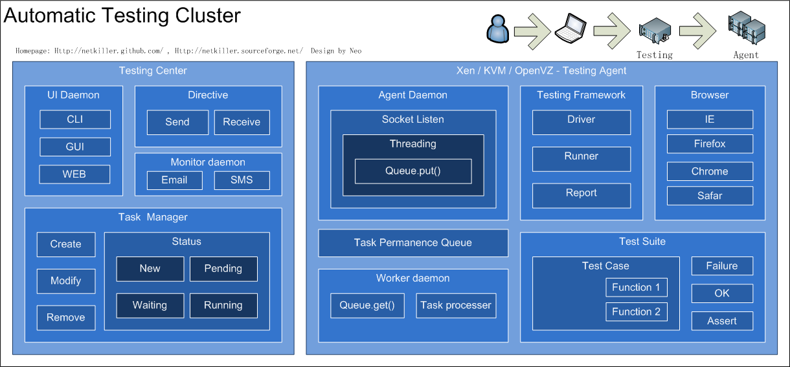

# 部分 IV. Testing

## 第 19 章 Automatic Testing

## Cluster Testing

|  |

## 静态内容并发测试

apache 自带 ab 测试命令

## 动态内容测试

简单动态内容展示，可以 apache 自带 ab 测试命令

## 业务逻辑并发能力

如测试一定时间内，系统能承受多少笔交易

对于简单的业务逻辑测试可以使用 curl 模拟，在使用多线程进行压力