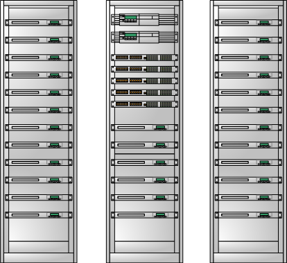
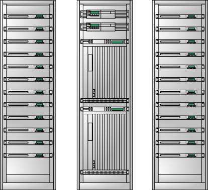

# 部分 V. 硬件篇

## 网络设备与服务器硬件相关

## 第 20 章 网线怎样连接才合理

## 单个硬件防火墙方案

One Firewall + One 3Layer Switch

IDC 给你两条 WLAN 网线，一条是 Active 激活状态，如果这条网线出现中断，将自动切换到第二条网线上。

如果你直接将网线插到防火墙上，就意味着第二条备用线路你无法使用。我想出一个方案，如下图

```
=================================
Design by Neo chan
Homepage: http://netkiller.sf.net
=================================

Internet    ____________________________________________
  |  |     /                                            |
  v  v    v                                             |
+---------------------------------------------------+   |
|[1] [3] [5] [7] [] [] [] [] [] [] [] []     Switch |   |
|[2] [4] [6] [8] [] [] [] [] [] [] [] []  [SFP][SFP]|   |
+---------------------------------------------------+   |
  |         ____________________________________________/
  v        /
+---------------------------------------------------+
| [Wan]  [LAN]   [DMZ]                     Firewall |
|                                         [Console] |
+---------------------------------------------------+

Vlan 2
------------------
G0/0/1-4

Port
------------------
G0/0/1 		Internet Active Line
G0/0/3 		Internet Stand by Line
G0/0/4 		Debug, Mirror or Other

G0/0/2 		Firewal Outside
G0/0/5 		Firewal Inside

G0/0/6-24	Server

```

### Switch

设置 G0/0/1 至 G0/0/4 为一个 vlan，将两条 WLAN 网线分别插入 1，3 两个口

2 口连接防火墙 Outside 口，

4 口用于平时调试使用，可以直接插电脑等设备，

### Firewall

防火墙 Inside 口连接到交换机 5 口

其他口连接服务器即可

## 双防火墙方案

## 第 21 章 Network Traffic

数不清的用户在访问你的服务器

带宽与服务器可以随时增加，但也有限

瓶颈无处不在

```

user -> \                                     /--1G--> | server |
user ->  |--1G--> [Firewal] --1G--> [Switch] ----1G--> | server |
user -> /                                     \--1G--> | server |

```

## bandwidth

主流网络设备带宽均为 1G，目前来看 10G 仍不普及，仅在存储领域封闭使用，价格非常昂贵

firewall (1G) - switch (Forwarding bandwidth / 1G) - server (NIC 1G)

### firewall

怎么能提高带宽呢？

首先是防火墙，这个设备非常重要。 100M 基本淘汰，10G 防火墙尚未普及，1G 带宽如果不够怎么办？答案是买 2 个，3 个...

为什么不买 10G 的。在下面会谈到会话数，你一看就明白了。10G 防火墙会话数不是 1G 防火墙会话数的十倍。

### switch

目前主流交换机 Cisco WS-C2960G-48TC-L，48 个 RJ45 口与 2 或 4 个 SFP 光纤口均为 1G 带宽

一般中小企业 1 台交换机足够，再上一个台阶超过 40 台服务器，就会有出现多台交换机互连问题，使用以太网口与 SFP 光纤口的带宽是一样的，唯一区别是传输距离。

每个交换机后面都对应几十台服务器，每个服务器 1G 网卡，如果这些服务器满负荷传输，交换机与交换机间数据传输就会带来瓶颈。

通过端口聚合可以解决交换机间数据传输瓶颈，另种方式是交换机堆叠。

```
          +----------+                          +----------+
          |          |gi0/0/1            gi0/0/1|          |
          | Switch A +--------------------------+ Switch B |
          |          +--------------------------+          |
          |          |gi0/0/2            gi0/0/2|          |
          +----------+                          +----------+

```

比如你有 5 个机柜，将交换机放置到 3 号机柜，处于中间位置，所有交换机放入该机柜，然后堆叠，从中心机柜向两侧分线



对于不大不小的企业，直接采购 IDC 箱式交换机



#### 聚合端口

```
Example 1 : host to host at double speed

          +----------+                          +----------+
          |          |eth0                  eth0|          |
          | Host A   +--------------------------+  Host B  |
          |          +--------------------------+          |
          |          |eth1                  eth1|          |
          +----------+                          +----------+

  On each host :
     # modprobe bonding miimon=100
     # ifconfig bond0 addr
     # ifenslave bond0 eth0 eth1

Example 2 : host to switch at double speed

          +----------+                          +----------+
          |          |eth0                 port1|          |
          | Host A   +--------------------------+  switch  |
          |          +--------------------------+          |
          |          |eth1                 port2|          |
          +----------+                          +----------+

  On host A :                             On the switch :
     # modprobe bonding miimon=100           # set up a trunk on port1
     # ifconfig bond0 addr                     and port2
     # ifenslave bond0 eth0 eth1

Example 3: High Availability in a Multiple Switch Topology
               |                                     |
               |port3                           port3|
         +-----+----+                          +-----+----+
         |          |port2       ISL      port2|          |
         | switch A +--------------------------+ switch B |
         |          |                          |          |
         +-----+----+                          +-----++---+
               |port1                           port1|
               |             +-------+               |
               +-------------+ host1 +---------------+
                        eth0 +-------+ eth1

Example 4: Maximum Throughput in a Multiple Switch Topology

Multiple switches may be utilized to optimize for throughput
when they are configured in parallel as part of an isolated network
between two or more systems, for example:

                      +-----------+
                      |  Host A   |
                      +-+---+---+-+
                        |   |   |
               +--------+   |   +---------+
               |            |             |
        +------+---+  +-----+----+  +-----+----+
        | Switch A |  | Switch B |  | Switch C |
        +------+---+  +-----+----+  +-----+----+
               |            |             |
               +--------+   |   +---------+
                        |   |   |
                      +-+---+---+-+
                      |  Host B   |
                      +-----------+

Example 5: Using multiple host and multiple switches to build a "no single
point of failure" solution.

                |                                     |
                |port3                           port3|
          +-----+----+                          +-----+----+
          |          |port7       ISL      port7|          |
          | switch A +--------------------------+ switch B |
          |          +--------------------------+          |
          |          |port8                port8|          |
          +----++----+                          +-----++---+
          port2||port1                           port1||port2
               ||             +-------+               ||
               |+-------------+ host1 +---------------+|
               |         eth0 +-------+ eth1           |
               |                                       |
               |              +-------+                |
               +--------------+ host2 +----------------+
                         eth0 +-------+ eth1

```

### Server

目前主流服务都配备 2 到 4 个网口，像 IBM / HP / DELL 等品牌服务器你无需关心网卡问题.

这里主要是针对自行安装或使用 PC 服务器的用户，因为很多 PC 服务器使用 Realtak 网卡。那么 Realtak 与 Broadcom 的 NetXtreme 有什么不同？

建议你安装一个 windows 系统在服务器上，然后看看网卡驱动属性。Realtak 仅仅提供基本网络功能，QOS 质量访问服务由驱动程序提供（软 QOS）而 NetXtreme 提供非常丰富的功能，并且都是硬件实现。

话题回到带宽上，linux 支持 bonding 网卡，可以帮你解决服务器网络通信带宽问题，bonding 还可以解决网卡故障转移，传输流量负载均衡等等。

在我的《Netkiller Linux 手札》中你可以找到具体的设置方法。

## Session

firewall (nat session) - switch (Forwarding bandwidth) - os (ulimit,sysctl) - application (httpd,vsftpd,tomcat ...)

会话数，国人俗称并发数。当你的带宽没有满，但 tcp 不能建立连接，这时你就要考虑会话数了。

### firewall

购买防火墙的时候主要有两个指标，一是会话数，二是带宽，三是配备模块。售前工程师都会交代清楚。

例如 Cisco ASA 5550 会话数 65 万，2 个 1G 接口，可选 IPS 模块等等...

使用下面命令可以查看当前会话数

```
show conn count

```

### Server

Linux 影响会话数的的参数与配置文件

/etc/security/limits.conf , /etc/security/limits.d

nofile - max number of open files 在 POSIX 系统中硬件，管道，Socket 均被看作是一个设备，如硬盘是块设备，显示器是字符设备，操作这些设备均使用 c 的 open 函数，被算作打开一个文件。所有设备都是如此，加上 web 服务器还要读取很多 HTML 文件，系统对 nofile 开销是非常巨大的。

nproc - max number of processes 目前多线程是主流，使用多线程技术这个参数可以不关心。像 Oracle,PostgreSQL, Apache prefork,你就需要关心这个参数

/etc/sysctl.conf , /etc/sysctl.d/

net.ipv4.ip_local_port_range = 1024 65500 可用端口范围

tcp 协议当你尝试主动与服务器建立连接，如：telnet 172.16.0.1 80,本地会开启一个大于 1024 小于 65500 的端口

client: localhost:1025 --- 172.16.0.1:80 server

以上参数要综合你的 CPU 处理能力，内存空间，硬盘 IO 等等，才能配置出合理数值

配置过大（小马拉大车），超出你的服务器处理能力，导致服务器无响应，最终只能重启

配置过小（大马拉小车），你的服务器长时间处于空间状态，CPU，内存没有得到合理使用

在我的《Netkiller Linux 手札》中你可以找到具体的设置方法。

### application

连接数受限与 limits 与 sysctl

apache : httpd/conf/extra/httpd-mpm.conf

```

<IfModule mpm_worker_module>
    ServerLimit         16
    ThreadLimit         256
    StartServers        8
    MaxClients          4096
    MinSpareThreads     64
    MaxSpareThreads     256
    ThreadsPerChild     256
    MaxRequestsPerChild 10000
</IfModule>

```

mysql : /etc/my.cnf

```

[mysqld]
max_connections=250

```

不依依列举，有兴趣看我的系列文档。

## IO

IO (Input/Output) 输入/输出，在国内被泛指硬盘 IO，没办法这里也不例外，也被指为硬盘 IO

影响 IO 的几个参数：

硬盘转速与硬盘速率

RAID 卡速率

以 Dell 为例，去官网查看一下 http://www.dell.com/content/topics/topic.aspx/global/products/pvaul/topics/en/us/raid_controller?c=us&l=en&cs=555

PERC H700 Integrated / Adapter: 6Gb/s SAS

SAS 硬盘接口 3Gbps，理论读写速度 300MB/S，实际情况没有这么理想。

RAID0 / RAID10 是提高 IO 最有效的手段，但是你从上面数据计算。6 块 SAS 硬盘做 Raid 0 传输速率可以达到 18Gb/s，但 RAID 卡 H700 只能达到 6Gb/s，整体带宽并没有提高。

这样做的意义是在 Raid 带宽与硬盘速度不变的情况下，读写所花费的时间减少了，提高了列队处理速度，减少 IO 排队。

IO 的问题就是 IO 排队等待问题，而不是传输带宽不够用

### 分布 IO

在经济紧张的情况下，可以使用多块独立硬盘分布 IO，每块硬件分别做独立存储，比如数据库可以采用这种方案：可以一块硬盘存数据，一块硬盘做索引，另一块做日志等等，禁止交叉。

在经济允许的情况下，你可以配置多个 RAID 卡，外挂 DAS。或者采用集群加分布式文件系统方案

### FC SAN

8Gb Fibre Channel

我曾经测试过本地硬盘（146G 15RPM * 8 做 RAID10）

### iSCSI / FCoE

http://zh.wikipedia.org/wiki/ISCSI

iSCSI 可以提供 1GB，10GB 数据传输，传输介质可以选择双绞线或者光纤

FCoE 通过以太网传输 FC 协议，与 iSCSI 有很多相似之处

### InfiniBand 或 RDMA

提供 10Gbps ~ 120Gbps 的 IO 速度

http://en.wikipedia.org/wiki/InfiniBand

http://www.infinibandta.org/

## 第 22 章 Distributed File System(簇文件系统)

我吧分布式文件系统分为三类，聚合文件系统，全局文件系统，负载均衡文件系统。

除了 gfs 其他文件系统都是建立在本地文件系统之上的网络文件系统。

几乎所有 DFS 都能通过 fuse mount 到本地，但有些 DFS mount 后性能不佳。

还有一个与分布式文件系统密切相关的，就是块设备，块设备不是文件系统，可以称为裸设备。

## 聚合文件系统

以 NFS, glusterfs 为代表，其特点是 server 独立运行，Server 与 Server 间没有通信，然后访问者将其聚合组织并规划目录，为 client 提供数据共享。

glusterfs 可以实现 Mirror 与 Strip 等更复杂的组合，但全由 client 完成，server 之间没有交互。

```

+-------------------------+        +-----------------------+
| Client                  |       /| Images Data           |
+-------------------------+      / +-----------------------+
| /mnt                    |     /  +-----------------------+     +--------------------+
| /mnt/images             |<----  /| Include Data          |     | Design by neo chen |
| /mnt/include            |<------ +-----------------------+     +--------------------+
| /mnt/lib                | ...    netkiller.github.com
| /mnt/data               | ...    +-----------------------+
| /mnt/data/backup        |<-------| Backup Data           |
+-------------------------+        +-----------------------+

```

## 全局文件系统

如 gfs，它可以提供 server 间文件系统协商，同步元数据等等。常规文件系统只能用于本地硬盘，如果两个服务器同时 mount iscsi 存储，会出现 A 服务器写入后，B 服务器无法看到 A 刚刚写入的数据，如果两台同时写入数据，会损坏文件系统。

```

		    +--------------------------------+
		    | Server Load Balancing          |
		    +--------------------------------+
		                    |
		                    V
--------------------- 1Gbps Ethernet ---------------------
            |                                |
            |        netkiller.sf.net        |
            V                                V
+------------------------+        +-----------------------+
| Server Master          |        | Server Master / Slave |
+------------------------+        +-----------------------+
| /u01                   |        | /u01                  |     +--------------------+
| /u02                   |        | /u02                  |     | Design by neo chen |
| /u03                   |        | /u03                  |     +--------------------+
+------------------------+        +-----------------------+
          |   |                             |   |
          V   V                             V   V
--------------------- 10Gbps Ethernet ---------------------
                           |  |
                           V  V
              +----------------------------+
              | IP SAN - ISCSI target      |
              +----------------------------+
              | LUN0 | LUN1 | LUN2 | ...   |
              +----------------------------+

```

## 负载均衡文件系统

这种文件系统通常至少有三部分组成，存储节点，访问节点，管理节点。不同的系统叫法不同，但其原理相同。

存储节点,负责数据存储，数据通过 hash 散列

访问节点，用户通过该节点访问数据，做数据上传下载。访问方式分为点对点与三角方式

管理节点，服务数据 Mirror,Strip 等，元数据同步等等...

点到点系统只提供一个访问入口，如：MooseFS

```

          +--------------------------------+
          | User                           |
          +--------------------------------+
          | mount ip_address => /mnt/test  |
          +--------------------------------+
                          |
                          V
------------------ 1Gbps Ethernet ---------------------
         |                                   |
         V                                   V
+-------------------------+       +----------------------+
| Manager Node            |       | Access node          |
+-------------------------+       +----------------------+
| Mirror | Strip |  ...   |       | Index                |
+-------------------------+       +----------------------+
		 |
		 V
--------------------- 1Gbps Ethernet ---------------------
         |                                     |
         |            netkiller.sf.net         |
         V                                     V
+---------------------+              +--------------------+
| Data Node           |              | Date Node          |
+---------------------+              +--------------------+
| 01 02 03 ...    10  |              | 01 02 03 ...    10 |     +--------------------+
| 0A 0B 0C ...    0F  |<-- Mirror -->| 0A 0B 0C ...    0F |     | Design by neo chen |
| FA FB FC ...    FF  |              | FA FB FC ...    FF |     +--------------------+
+---------------------+              +--------------------+

```

```
三角链路
```

```

          +--------------------------------+
          | Server Load Balancing          |
          +--------------------------------+
                          |
                          V
------------------ 1Gbps Ethernet ----------------------------------
         |                               |                  |
         V                               V                  V
+-------------------------+       +-------------+    +-------------+
| Manager Node            |       | Access Node |    | Access Node |
+-------------------------+       +-------------+    +-------------+
| Mirror | Strip |  ...   |       | Index       |    | Index       |
+-------------------------+       +-------------+    +-------------+
		 |
		 V
--------------------- 1Gbps Ethernet ---------------------
         |                                     |
         |            netkiller.sf.net         |
         V                                     V
+---------------------+              +--------------------+
| Data Node           |              | Date Node          |
+---------------------+              +--------------------+
| 01 02 03 ...    10  |              | 01 02 03 ...    10 |     +--------------------+
| 0A 0B 0C ...    0F  |<-- Mirror -->| 0A 0B 0C ...    0F |     | Design by neo chen |
| FA FB FC ...    FF  |              | FA FB FC ...    FF |     +--------------------+
+---------------------+              +--------------------+

```

这种文件系统的特点是，当用户访问文件系统时，首先访问管理节点，管理节点会返回一个数据地址，用户再从访问节点的地址取得数据。

以 MogileFS 为代表

某些系统甚至直接使用反向代理或者 WEB 服务器作为访问节点。这种系统非常适合多媒体数据存储。通过负载均衡可能实现横向与纵向灵活扩展

## 网络块设备

本地文件系统是建立在块设备之上的。使用块设备，首先配置好块设备，然后你就可以把它当成物理硬盘一样对待，在块设备上分区，格式化。

以 DRBD,nbd-server 为代表，网络块设备可以保证两块物理硬盘的数据同步，常用语 HA 集群

```

Linux Server A                   Linux Server B
----------------                 -----------------
File System                      File System
Block Device    <--------------> Block Device

```

更多细节参考 http://netkiller.github.com/storage/

## 第 23 章 Server

## TPC

[`www.tpc.org/`](http://www.tpc.org/)

Transaction Processing Performance Council

1.  TPC-C：是在线事务处理(OLTP)的基准程序

2.  TPC-D：是决策支持(Decision Support) 的基准程序

3.  TPC-E：作为大型企业(Enterprise)信息服务的基准程序

4.  TPC-H：DecisionSupportforAdHocQueries 基于特定查询的决策支持

5.  TPC-W：Webe-Commerce（互联网及电子商务）

6.  TPC-R：DecisionSupportforBusinessReporting（基于商业报告的决策支持）

## IOPS (Input/Output Operations Per Second, pronounced i-ops)

[`www.storageperformance.org/home/`](http://www.storageperformance.org/home/)

## rPerf

http://www-03.ibm.com/systems/power/hardware/notices/rperf.html

```

服务器所需要的 rPerf 值=SUM(NU * TX * CS/PP) / MC

NU:高峰时并发的用户数

TX:高峰时每个用户的交易数量

CS:在 rPerf=1 的服务器上，每个交易所需要的 CPU 秒

PP:高峰持续的时间

MC:最大的 CPU 利用率（推荐< 70%）

下面举例说明如何计算所需的 rPerf 值，假定某公司的情况如下：

业务高峰时间：  10:00-11:00=1Hour=3600 秒

交易类型：      无复杂查询的简单应用

相对交易类型，用户数目分布:轻的=2000,   一般=50,   重的=5

在高峰时，每个用户的交易数量：

   轻的=120 交易/用户

   一般=60 交易/用户

   重的=15 交易/用户

对于 rPerf=1 的服务器，每个交易响应的 CPU 秒

   轻的=1

   一般=3

   重的=15

最大的 CPU 利用率：60%

根据上述公式，可推算出不同交易类型所对应的 rPerf 值。

轻的交易：NU*TX*CS/PP=2000*120*1/3600=66.0

一般交易：NU*TX*CS/PP=50*60*3/3600=2.5

重的交易：NU*TX*CS/PP=5*15*15/3600=0.3

所需的总的 rPerf/MC=(66.0+2.5+0.3)/0.7=98.3 rPerf

```

## 磁盘规划

这里主要讲怎样划分磁盘更合理，要遵循操作系统与数据隔离，尽量避免操作系统与数据区共享空间，

### 物理隔离

操作系统与数据库放在不同的硬盘上

### 硬件逻辑卷隔离

通过 RAID 卡所带的功能，划分两个逻辑卷，然后将操作系统与数据分别安装在 不同的逻辑卷上。

## 网卡

### 网口规划

#### 内外隔离

双网卡方案,一般服务器会提供至少 2 块网卡。 使用两个交换机，一个交换机连接接防火墙，另一个交换机独立不接入 Internet

```

+------------+    +--------------+    /---> [eth0 Server A eth1] <---\    +--------------+    /---> [eth0 Server C]
| Firewall   |--->| Switch - WAN |---> ---> [eth0 Server B eth1] <--- <---| Switch - LAN |---> ---> [eth0 Server D]
+------------+    +--------------+    \---> [eth0 Server C eth1] <---/    +--------------+    \---> [eth0 Server E]

```

Internet 用户从防火墙进入，只能访问 WAN 交换机上的服务器，WAN 上一般是 WEB 服务器，WEB 服务器通过 LAN 交换机访问数据库，Memcache 等服务器

这样既有效利用了网络 IO，有能有效隔离不需要暴露在公网上的服务器还可以降低成本， WAN 可以使用 100M 交换机，LAN 可以使用 1G 交换机，因为内部数据传输远远大于外部。

另外 WAN 与 LAN 也可以使用 VLAN 实现

#### 负载均衡

eth0 与 eth1 做 bonding, eth2 与 3 做 bonding, 然后内外隔离

```

+--------------+    /---> [eth0/1 Server A eth2/3] <---\    +--------------+
| Switch - WAN |---> ---> [eth0/1 Server B eth2/3] <--- <---| Switch - LAN |
+--------------+    \---> [eth0/1 Server C eth2/3] <---/    +--------------+

```

#### 交叉互联

在交换机端口有限的情况可以采用交叉互联。

交叉线连接与通过交换机连接二者差异：

A 与 B 两个服务器举例：

1.  交叉线连接 A 与 B 两个服务器，A 发数据包，B 接收数据包，如果接受方在接收包过程中出现异常（毫秒级），可能会堵塞，数据包会重新发包。交换机存储转发，仍然会接收数据放到背板缓存中，建立连接后交换机会处理一切。

2.  A 服务器出现故障宕机，A 网卡灯不亮，那么 B 服务器的网卡将检测，认为没有插网线，B 网卡灯也是不亮状态。而通过交换机 B 网卡仍然工作

### 常见网络适配器品牌

Broadcom NetXtreme II Gigabit Ethernet Driver bnx2 v2.0.8-rh (Oct 11, 2010)

Emulex OneConnect 10Gbps NIC

Intel 10 Gigabit AT2 Server Adapter (E10G41AT2)

### 1G 千兆以太网产品

目前服务器 1G 网卡市场 90%都被 Broadcom NetXtreme 占领，不仅仅限于服务器网卡，Cisco 的设备中用的也是 Broadcom NetXtreme 芯片

### 10G 万兆以太网产品

万兆以太网标准很多，有 10000BAST-T(使用双绞线连接)，还有 SFP+(850nm 光纤连接)

Dell 有通过 6 类线连接的万兆交换机 8024，服务器端 Dell 给用户配的是 Intel 万兆网卡，使用方法与千兆一样。

笔者有两个刀笼（刀片服务器），刀笼配置万兆模块通过 4 条 10G SFP+ 连接到 8024，然后服务器使用 6 类双绞线，通过 Intel 网卡连接 8024。

光纤万兆网卡与千兆网卡使用上并无不同。如果指示灯不亮，请调换 RX/TX 光纤跳线

```
# dmesg | grep Emulex
Copyright(c) 2004-2009 Emulex.  All rights reserved.
be2net 0000:18:00.0: eth0 - Emulex OneConnect 10Gbps NIC
be2net 0000:18:00.1: eth1 - Emulex OneConnect 10Gbps NIC

```

笔者使用过 Emulex/Intel 在 Linux 上无需驱动，光纤交换机 Cisco 4507 的万兆模块是 Broadcom NetXtreme 芯片的.

### 提示

无论是外形还是接口，万兆以太网与 FC(Fibre Channel) HBA 卡很难区分，且卡上没有任何印刷文字提示，购买千万小心不要买错，最好与厂商反复确认。另外光纤交换机与 FC 交换机也容易混淆，我建议你网卡用 Cisco 交换机，存储用博科交换机

## Fibre Channel HBA 卡

常用 HBA 卡

QLogic QLE2562 - PCI-Express Dual Channel 8Gb Fibre Channel HBA

Emulex LightPulse Fibre Channel SCSI driver 8.2.0.87.1p

HBA 卡使用 SFP+光纤模块，LC-LC 光纤跳线

## iDRAC / iLO / IMM

远程管理卡