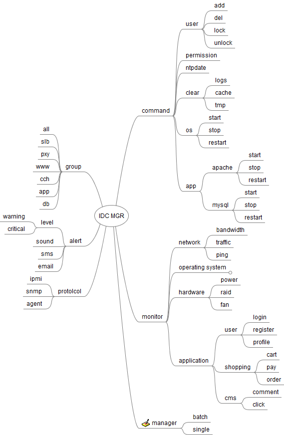
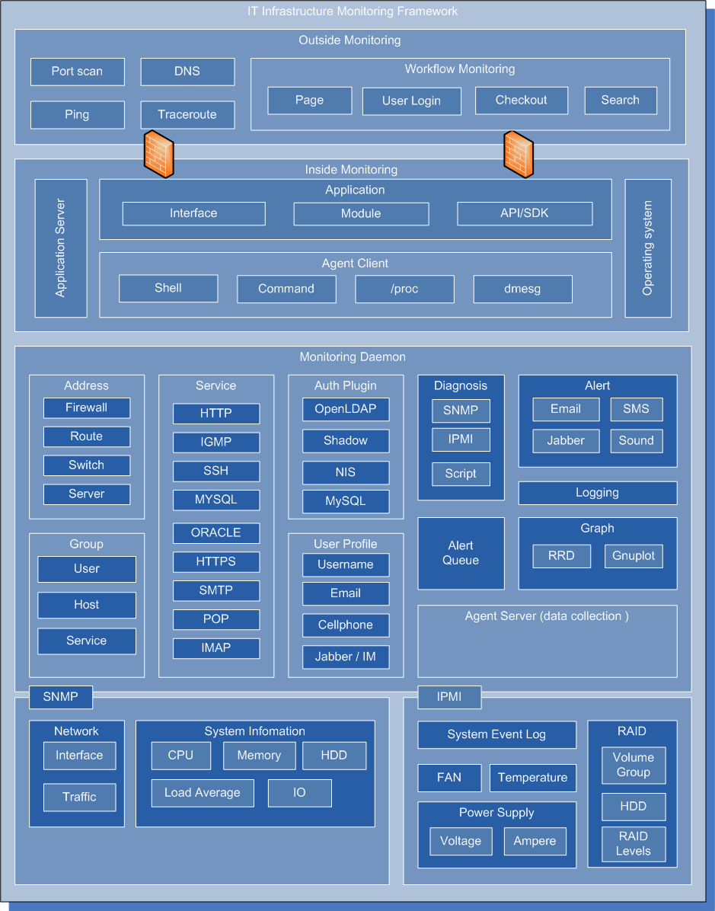
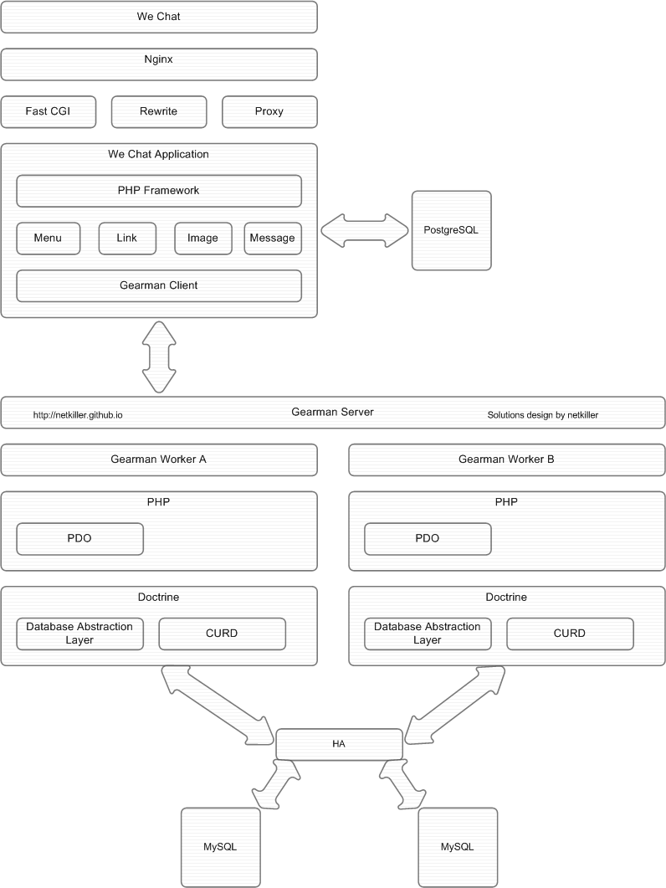
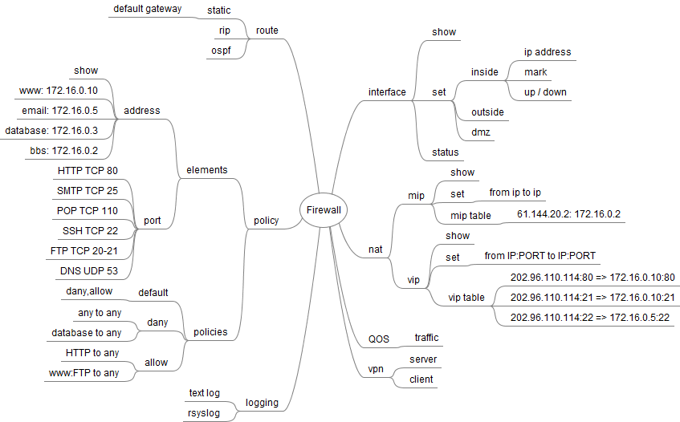
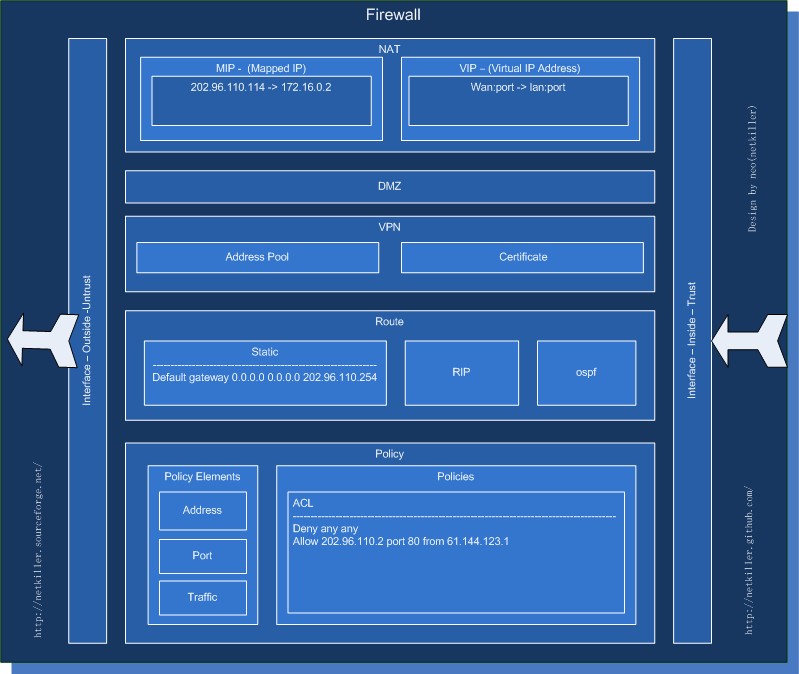
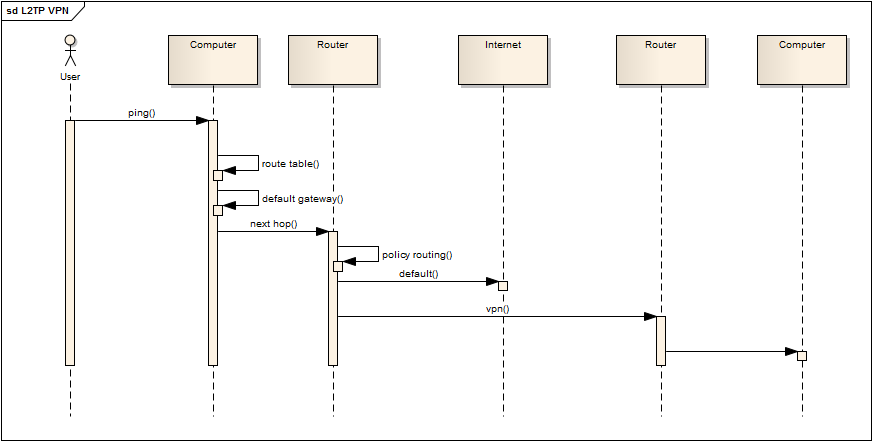
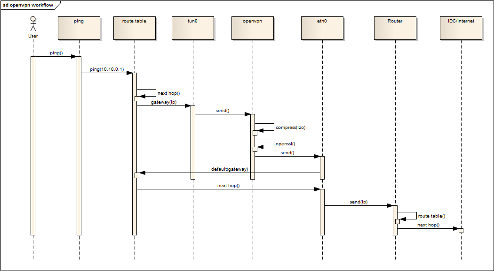
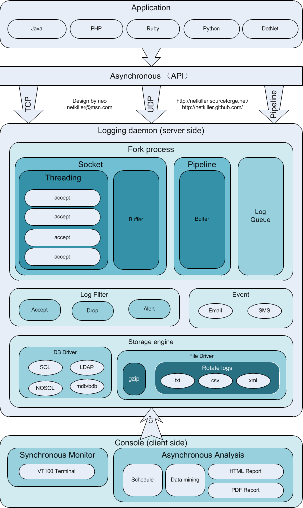

# 部分 VI. 设计与解决方案

## 第 24 章 Monitor solution

|  |

|  |

## 网络监控

### 流量监控

### 交换机监控

## 集群监控

在线人数

每个节点的负载情况

## 操作系统监控需求

### CPU 相关监控

*   负载监控

*   使用率监控

### 磁盘相关监控

*   容量监控

*   IO 监控

### 内存相关监控

*   容量监控

*   交换分区监控

### 网络监控

*   流量监控

*   TCP 状态监控

### 权限监控

*   用户登录监控

*   穷举密码监控

*   防火墙规则监控

### 进程相关监控

*   僵尸进程监控

### 时间同步监控

### 文件系统与系统日志监控

*   文件目录监控，如理在在指定目录创建目录或者创建文件将发出报警，主要用于防止挂马攻击。

*   磁盘设备监控，服务器上冲入新的磁盘设备发出报警，例如用户在服务器的 USB 口上冲入 U 盘。

*   监控系统日志监控，日志中出现特定的关键字发布警报。

## 服务监控

### Nginx 监控

Web 服务器进程监控

Web 服务器端口监控

Web 服务器状态监控

SSL 证书监控，证书是否过期，证书连是否完整。

状态监控指标：

```

* 活动连接数
* 完成连接数
* 等待连接数

```

### Redis 监控

Redis 进程监控

Redis 端口监控

Redis 状态监控

监控指标要求

```

CPU 使用率
内存使用率
客户短连接数
从服务器连接数
Key 数量监控
过期 key 数量
命令处理数量
订阅频道数量

```

### Rabbit 监控

RabbitMQ 监控指标

*   客户端连接数据

*   队列数量

*   队列内存开销

*   exchanges 数量监控

### Elasticsearch 监控

Elasticsearch 监控指标

### 数据库监控需求

MySQL 线程数

MySQL Slow 日志

MySQL 节点

#### 数据库监控指标

*   SQL 查询缓存监控

*   数据库线程数监控

## 网站安全与预警机制

## 网络监控

### 网络监控我认为也可以叫做 3 层监控

### DNS 解析監控

ns 记录监控

A 记录监控

MX 记录监控

主从 DNS 同步监控

### 路由監控

```
				HSRP/VRRP 網関監控

```

### 流量監控

### 会话数监控

会话数是指 NAT 建立地址转换链数量，你要考虑你的网络是流量密集型，还是会话密集型。有时可能你的带宽并没有用完，但你的防火墙、路由器会话数已经用光，这样会导致网络出现断续情况，网速非常慢。所以会话数要纳入监控范围。

防火墙会话数监控

## 内容监控

### 内容监控主要 WEB 应用监控

## DHCP

### DHCP Server

S3600 SI 没有 DHCP Server，只有 EI 版本提供，狗日的 H3C(fuck h3c)

## Routing

### 策略路由

案例一

取消策略路由

这个案例是基于源的策略路由

案例二

案例二是一个基于目的的测略路由

## routing-table

## Example

例 24.1. dhcp vlan rip

## 监控方法

### 人工监控

### 机器监控

## 第 25 章 Backup

|  |

|  |

例 25.1. Backup program

the following is a backup program to implement my ideas in the above diagram. I have not finished yet.

```

#!/usr/bin/env python3
#/bin/env python3
#-*- coding: utf-8 -*-
##############################################
# Home  : http://netkiller.sf.net
# Author: Neo <openunix@163.com>
##############################################

try:
    import logging, configparser
    import threading
    from optparse import OptionParser, OptionGroup
    import os,io,sys
except ImportError as err:
    print("Error: %s" %(err))

class Runtime(threading.Thread):
    def __init__(self, logging):
        threading.Thread.__init__(self)
        self.logging = logging
        sys.stdin = open('stdin.log', 'r')
        sys.stdout = open('stdout.log', 'w')
        sys.stderr = open('stderr.log', 'w')
    def command(self,cmd):
        commands = {
            'rsync': 'rsync -auzvP',
            'sftp' : 'sftp',
            'scp' : 'scp -r',
            'cp' : 'cp -r'
        }
        return commands[cmd]
    def policy(self,policy):
        policies = {
            'full': 'rsync -az',
            'mirror': 'rsync -auz --delete',
            'differential': 'rsync -auz --delete',
            'incremental': 'rsync -auz',
            'clone': 'dd',
            'copy.cp': 'cp -au',
            'copy.cp.backup': "cp  --suffix=$(date '+.%Y-%m-%d.%H:%M:%S') "
            'copy.scp': 'scp -a',
            'mirror.ftp': 'wget -m',
            'mirror.http': 'wget -m',
            'archive.zip': 'zip',
            'archive.7zip': '7zip',
            'archive.cpio': 'cpio',
            'archive.tar': 'tar zcvf',
            'snapshot': ''
        }
        return policies[policy]
    def execute(self,cfg):
        print( self.policy('mirror'))
        #command = self.command(cfg['cmd'])
        command = self.policy(cfg['policy']) + ' ' + cfg['source'] + ' ' + cfg['target'] + ' >> stdout.log'
        self.logging.debug(command)
        os.system(command)
class Task():
    def __init__(self, logging):
        self.logging = logging
        self.config = configparser.SafeConfigParser()
        cfg='task.cfg'
        self.config.read(cfg)
    def list(self):
        for section in self.config.sections():
            print(section)
    def new(self):
        pass
    def remove(self):
        pass
    def change(self):
        pass
    def run(self, section):
        try:
            #print(cfg)
            cfg = self.config.items(section)
            r = Runtime(self.logging)
            r.execute(dict(cfg))
        except configparser.NoSectionError as err:
            print(err)
    def show(self, section):
        for item in self.config.items(section):
            #k,v = item
            print("%s: %s" %(item))
    def get(self,section):
        return self.config.items(section)
class Schedule():
    def __init__(self, logging):
        self.logging = logging
        self.config = configparser.SafeConfigParser()
        cfg='schedule.cfg'
        self.config.read(cfg)
    def list(self):
        for section in self.config.sections():
            print(section)
    def show(self, section):
        for item in self.config.items(section):
            print("%s: %s" %(item))
    def new(self):
        pass
    def remove(self):
        pass
    def change(self):
        system('backup.cron')
    def status(self):
        pass
    def run(self, section):
        threads = []
        t = Task(self.logging)
        #t.run(task)
        for task,status in self.config.items(section):
            if status :
                cfg = t.get(task)
                r  = Runtime(dict(cfg))
                r.setName('Thread-' + task)
                threads.append(r)
        for t in threads:
            #print(t.getName())
            self.logging.info(t.getName())
            t.start()
            t.join()
class Volume():
    pass
class Backup():
    def __init__(self):
        self.config = {}
        #self.config['logfile'] = 'backup.log'

        usage = "usage: %prog [options] arg1 arg2"
        self.parser = OptionParser(usage)
        self.parser.add_option("-f", "--file", dest="filename",
                  help="write report to FILE", metavar="FILE")
        self.parser.add_option("-q", "--quiet",
                  action="store_false", dest="verbose", default=True,
                  help="don't print status messages to stdout")
        self.parser.add_option('','--config', dest="config", help='Read configuration options from file.', default='backup.cfg')

        group = OptionGroup(self.parser, "arg1",
                    "arg1: task | schedule")
        self.parser.add_option_group(group)
        group = OptionGroup(self.parser, 'arg2', 'arg2: list | new | remove | show')
        self.parser.add_option_group(group)

        self.parser.add_option('-v','--version',action='store_true', help='print version number')
        self.parser.add_option('-d','--daemon', dest='daemon', action='store_true', help='run as daemon')
        self.parser.add_option('','--logfile', help='logs file.', default='backup.log')

        (options, args) = self.parser.parse_args()
        self.configure(options)

        try:
            logging.basicConfig(level=logging.NOTSET,
                    format='%(asctime)s %(levelname)-8s %(message)s',
                    datefmt='%Y-%m-%d %H:%M:%S',
                    filename=self.config['environment']['logfile'],
                    filemode='a')
            self.logging = logging.getLogger()
        except AttributeError as err:
            print("Error: %s %s" %(err, self.config['environment']['logfile']))
            sys.exit(2)
        pass

    def configure(self,options):
        if options.config:
            cpr = configparser.SafeConfigParser()
            cpr.read(options.config)
            for sect in cpr.sections():
                self.config[sect] = dict(cpr.items(sect))
                #for (key,value) in cpr.items(sect):
                #    self.config[key] = value
        #print(self.config)

    def task(self, args):
        try:
            t = Task(self.logging)
            if len(args) <= 1:
                t.list()
            elif args[1] == 'list':
                t.list()
            elif args[1] == 'run':
                if len(args) == 3:
                    t.run(args[2])
                else:
                    t.list()
            elif args[1] == 'show':
                if len(args) == 3:
                    t.show(args[2])
                else:
                    t.list()
            else:
                t.list()
        except IOError as err:
            print(err)
        except configparser.NoSectionError as err:
            t.list()
            print(err)
            self.logging.error(err)
    def schedule(self,args):
        try:
            s = Schedule(self.logging)
            if len(args) <= 1:
                s.list()
            elif args[1] == 'list':
                s.list()
            elif args[1] == 'show':
                if len(args) == 3:
                    s.show(args[2])
                else:
                    s.list()
            elif args[1] == 'run':
                if len(args) == 3:
                    s.run(args[2])
                else:
                    s.list()
            else:
                s.list()
        except configparser.NoSectionError as err:
            s.list()
            self.logging.error(err)
            print(err)
    def usage(self):
        self.parser.print_help()

    def main(self):
        (options, args) = self.parser.parse_args()
        if options.daemon:
            pid = os.fork()
            if pid > 0:
                self.logging.info('daemon is ok')
                sys.exit(0)
        if not args:
            self.usage()
        elif args[0] == 'task':
            self.task(args)
            self.logging.debug('Task')
        elif args[0] == 'schedule':
            self.schedule(args)
            self.logging.debug('Schedule')
        else:
            print('')
if __name__ == '__main__':
    try:
        backup = Backup()
        backup.main()
    except KeyboardInterrupt:
        print ("Crtl+C Pressed. Shutting down.")

```

## help

### Task

list task

```
$ backup task list
www
database
test
test1
test2

```

show task

```
$ backup task show www
policy: mirror
source: /www/www.example.dev/*
target: /tmp/www
exclude: .svn
include: *

```

run task

```
$ backup task run www

```

### Schedule

the backup program has four schedule task, actually you can add more.

```
$ ./backup schedule list
hourly
daily
weekly
monthly

$ ./backup schedule show hourly
www: True
mrtg: True

$ ./backup schedule run hourly

```

### Crontab

crontab -l

```
17 *    * * *   test -x /srv/sbin/backup || ( backup schedule run hourly )
25 6    * * *   test -x /srv/sbin/backup || ( backup schedule run daily )
47 6    * * 7   test -x /srv/sbin/backup || ( backup schedule run weekly )
52 6    1 * *   test -x /srv/sbin/backup || ( backup schedule run monthly )

# m h  dom mon dow   command
*/30 * * * * /srv/sbin/backup task run www

```

## 配置文件备份

### Firewall and Switch

Tftp

### Server

## 第 26 章 支付平台方案

## 方案

### 商户方案

商户方案 .

|  |

### 银行方案

银行接口方案.

|  |

## 支付接口

|  |

支付接口需要考虑

接口安全

1.  软件防火墙，包括 IP 限制，单位时间内 IP 访问次数限制

2.  key 证书，采用非对称加密

3.  md5 校验，防止伪造内容提交

WEB 服务器安全

1.  SSL 证书

2.  IP 限制

3.  目录访问权限

操作系统安全

## 支付派台后台

## 第 27 章 电子商务网站

## Product

```

class Product():
    attribute = []
    def __init__(self, name = None):
        if name :
            self.name = name
        else:
            self.name = "Unknown"
        self.description = "None"
        self.price = 0
    def getName(self):
        return self.name
    def getDescription(self):
        return self.description

class Attribute():
    def __init__(self,product, attr):
        self.product = product
        self.product.attribute.append(attr)

class Color():
    def __init__(self):
        pass
    def Red(self):
        return {'color': 'red'}
    def Blue(self):
        return {'color': 'blue'}

class Size():
    def __init__(self):
        pass
    def Small(self):
        return {'size': 'small'}
    def Big(self):
        return {'site': 'big'}

```

## Cart & Checkout

```

class Cart:
    def __init__(self):
        self.products = []
    def add(self, obj):
        self.products.append(obj)
    def notify(self):
        for obj in self.products:
            obj.notify(len(self.products))
    def price(self):
        for obj in self.products:
            print(obj.price)

class Checkout():
    def __init__(self,cart):
        self.cart = cart
        self.products = self.cart.products
        self.totals = 0
        self.accounting()
    def total(self):
        print(self.totals)
        return (self.totals)
    def accounting(self):
        for obj in self.products:
            self.totals = self.totals + obj.price
    def bill(self):
        pass

class Shipping():
    def __init__(self,checkout,ship):
        self.ship = ship
        checkout.totals = checkout.totals + ship.getCost()
    def cost(self):
        print(self.ship.getCost())

class UPS():
    def __init__(self):
        self.cost = 15.2
    def getCost(self):
        return self.cost

class FedEx(Shipping):
    def __init__(self):
        self.cost = 10
    def getCost(self):
        return self.cost

class Payment():
    def __init__(self, checkout):
        pass
    def payable(self):
        pass
    def tax(self):
        pass

```

### 物流配送插件设计

```

                         +-------------+     +-----------------------+
User -> Goods -> Cart -> | Delivery    |  -> | Promotions components | -> Checkout
                         +-------------+     +-----------------------+
                         | rule A      |     | Promotion rule 1      |
                         | rule B      |     | Promotion rule 2      |
                         | rule C      |     | Promotion rule 3      |
                         | rule D      |     | Promotion rule 4      |
                         | rule E      |     | Promotion rule 5      |
                         +-------------+     +-----------------------+

```

数据库设计

```

 +--------------+
 | shipping     |
 +--------------+
 | id           |o---+
 | name         |    |
 | ...          |    |
 +--------------+    |    +----------------------+
                     |    | shipping_rule        |
 +--------------+    |    +----------------------+
 | zone         |    |    | id                   |
 +--------------+    +--->| shipping_id          |
 | id           |o------->| zone_id              |
 | name         |         | plugin               |
 |              |         | ...                  |
 +--------------+         +----------------------+

 +--------------+
 | delivery     |
 +--------------+
 | id           |
 | user_id      |o------>
 | address_id   |o------>
 +--------------+

```

## 促销优惠组件设计

设计思想是，在购物车结算前匹配促销规则计算出最终优惠金额

```

                                     +-----------------------+
User -> Goods -> Cart -> Delivery -> | Promotions components | -> Checkout
                                     +-----------------------+
                                     | Promotion rule 1      |
                                     | Promotion rule 2      |
                                     | Promotion rule 3      |
                                     | Promotion rule 4      |
                                     | Promotion rule 5      |
                                     +-----------------------+

```

数据库设计

```

 +--------------+
 | goods        |
 +--------------+
 | id           |o---+
 | ...          |    |
 | ...          |    |
 +--------------+    |    +----------------------+
                     |    | goods_promotion_rule |
 +--------------+    |    +----------------------+
 | promotion    |    |    | id                   |
 +--------------+    +--->| goods_id             |
 | id           |o------->| promotion_id         |
 | name         |         | ...                  |
 | plugin       |         | ...                  |
 +--------------+         +----------------------+

```

goods_promotion_rule 负责将商品与促销规则关系建立起来

promotion 是促销脚本，我方案是使用 lua 编写促销脚本，plugin 用于存储 lua 文件地址

这样做的好处是不用因为促销规则改变而重新修改程序，单独制作 lua 脚本即可，

以上仅仅提供一个思路，你还可以建立一个 goods_promotion_group 将促销商品分组，然后再与 goods_promotion_rule 建立关系。

另外在购物车中会同时出现多种促销规则，也是要考虑的。

## 第 28 章 微信公众平台

## 微信公众平台原理

设置方法: 高级功能 > 开发模式

```
URL：http://wechat.example.com/test.php
Token：a85f0785254000cd942efsef

```

原理，当用户添加公众号后，发送文本，语音等等消息，微信就会将内容 Post 的你的 URL，然后读取返回的 XML 内容



## 微信公众平台通常提供的服务模式

通常做法是问答交互方式，

```
问：天气
答：今天天气白天 20 度，晚上 19 度，东南风。

问：附近商场
答：茂业 500 米， 天虹 100 米

```

提供菜单选择方式。

```
[1] 天气
[2] 周边信息
[3] 电影院
[4]	饮食
[5] 新闻焦点

当选玩家输入 4 系统回复

[31] 肯德基
[32] 麦当劳
[33] 必胜客

玩家输入 31 系统回复

[311] XXXXXXXXXXXXXXXX

选玩家输入 5 系统回复
[51] 北京 P2.5XXXXX
[52] 深圳推出 XXXX 政策
[52] 奥巴马 XXXXXX

选玩家输入 52 系统回复

XXXXXXXXXXXXXXXXXXXX
图片
XXXXXXXXXXXXXXXXXXXX
XXXXXXXXXXXXXXXXXXXX
XXXXXXXXXXXXXXXXXXXX
XXXXXXXXXXXXXXXXXXXX
XXXXXXXXXXXXXXXXXXXX

```

## 微信公众平台开发

我看到网上很多人做法都是这样实现的

```
if input = '天气' {
	...
} else if(input = '饮食'){
	...
} else if(xxx){
....
} ....
....

switch (input){
	case '天气':
		xxxx
	case '饮食':
		xxxx
	case xxxx
		xxxxx
		...
		...
	default:
		xxxx
}

```

稍微高级的做法是，定义一个数组，或者一个 hashmap,或者使用数据库实现 key,value 定义。然后判断 keyword 是否存在，如果存在就处理 key 所对应的 value。

这样的做法会导致后期，极难维护，可读性极差，增加一个需求，就增加一段代码，新的代码会影响整个程序。国内开发者很喜欢使用 if 来拼接一个 sql 语句，这是坑爹的写法。

下面谈谈我思路，我将采用传统的 MVC 模式，

```
微信  ---post xml---> 入口 URL
                      |
                      V
              +----------------+
              | Router         |     这里是路由映射，用户输入 keyword 映射到 controller 上，
              +----------------+
                      |
                      V
              +----------------+
              | Controller     |     Controller 会加载请求的 class 做一系列处理，包括数据模型处理，视图渲染，
              +----------------+
                      |
                      V
+--------------- Application -------------------+
| class xxx | class xxx | class xxx | class xxx |
+-----------------------------------------------+
                      |
                      V
               +--------------+
               | Model        |     处理数据
               +--------------+
                      |
                      V
               +--------------+
               | View         |     最后呈现 xml。 微信会通过返回的 xml 将消息推送给用户
               +--------------+

```

任务处理图，程序应该有一个入口，多个出口，而不是层层循环，层层判断。一半来说 for/if/while 等等 超过三层，程序阅读就会非常困难。

```

                               .---> 终结
                              /                        .-->  终结
                             /            .--> 终结               /
                            /            /           /
微信 ---> Post XML ---> 接口程序 --------------------------------------------->  - 终结
                            \      \            \
                             \      `---> 终结               \
                              \                   `--->  终结
                               `--->  终结

```

实现菜单结构

```

<menu>
	<menuitem>
		<item>[1] 天气 </item>
		<controller></controller>
	<menuitem>
	<menuitem>
		<item>[2] 新闻 </item>
		<controller></controller>
	<menuitem>
	<menuitem>
		<item>[3] 饮食 </item>
		<submenu>
			<menuitem>
				<item>[31] 肯德基 </item>
				<controller></controller>
			</menuitem>
			<menuitem>
				<item>[32] 麦当劳 </item>
				<controller></controller>
			</menuitem>
		</submenu>
	<menuitem>
</menu>

```

XML 不太灵活，下面是数据库方案

```
CREATE TABLE menu
(
  id serial NOT NULL,
  mid integer, -- mid 字段
  menuitem character varying NOT NULL, -- menuitem 字段
  controller character varying, -- 映射控制器
  submenu_id integer, -- 子菜单 ID
  status boolean DEFAULT true, -- 启用，禁用状态
  ctime timestamp without time zone DEFAULT now(), -- 创建时间
  mtime timestamp without time zone DEFAULT now(), -- 修改时间
  CONSTRAINT id PRIMARY KEY (id),
  CONSTRAINT submenu_id FOREIGN KEY (submenu_id)
      REFERENCES menu (mid) MATCH SIMPLE
      ON UPDATE RESTRICT ON DELETE RESTRICT,
  CONSTRAINT mid UNIQUE (mid)
)
WITH (
  OIDS=FALSE
);
ALTER TABLE menu
  OWNER TO dba;
COMMENT ON TABLE menu
  IS 'menu table';
COMMENT ON COLUMN menu.mid IS 'mid 字段';
COMMENT ON COLUMN menu.menuitem IS 'menuitem 字段';
COMMENT ON COLUMN menu.controller IS '映射控制器';
COMMENT ON COLUMN menu.submenu_id IS '子菜单 ID';
COMMENT ON COLUMN menu.status IS '启用，禁用状态';
COMMENT ON COLUMN menu.ctime IS '创建时间';
COMMENT ON COLUMN menu.mtime IS '修改时间';

```

数据

```
INSERT INTO "menu" ("mid", "menuitem", "controller", "submenu_id", "status") VALUES (1, '天气', 'weather', NULL, true);
INSERT INTO "menu" ("mid", "menuitem", "controller", "submenu_id", "status") VALUES (2, '新闻焦点', NULL, NULL, true);
INSERT INTO "menu" ("mid", "menuitem", "controller", "submenu_id", "status") VALUES (21, '国内新闻', 'news/1', 2, true);
INSERT INTO "menu" ("mid", "menuitem", "controller", "submenu_id", "status") VALUES (22, '国际新闻', 'news/2', 2, true);

```

这里 id 字段可有可无，实际上 mid 可以设置为主键，考虑到中国人习惯性才增加了 id. submenu_id 外键指向了 mid 而没有指向 id. 因为 id 是 serial 会顺序增加，会使整个菜单排序混乱。这样有也缺点，就是菜单项不能超过十个。

接下来实现路由到控制器的分发。

```
关注：显示菜单
[1] 天气
[2] 新闻焦点

发送：1
取出 weather, 实例化 weather 类 执行 index() 方法。 返回天气预报
$weather = new Weather()

发送：2
[21] 国内新闻
[22] 国际新闻

发送：21
实例化 news 类，构造方法参数指定为 1 返回国内新闻列表
$news = new News(1);

```

当 submenu_id 为 NULL　时表示他有子菜单，如果非 NULL 就取 controller 参数。

接下来要做的就是需求增加，只需要在 menu 表中增加一个记录，然后开发对应的 controller. 有一些不使用的项目随时可以将 status 设置为禁用状态

## 第 29 章 DIY Firewall & VPN

If you do not have enough money to buy a firewall, I'll tell you how to do a one.

Iptables + TC + Openvpn / PPTP | L2TP

## Firewall

|  |

|  |

## 3 Layer VPN

|  |

## 7 Layer VPN

|  |

## 第 30 章 日志

|  |

## 第 31 章 Web Service Security

```

<?php
/* 
* =====================================
* Website: http://netkiller.github.com
* Author: neo <netkiller@msn.com>
* Email: netkiller@msn.com
* =====================================
*/

class Logging {
	protected $file;
	public function __construct($logfile = "/tmp/debug.log"){
		$this->file = fopen($logfile,"a+");
	}
	public function __destruct() {
        //fclose($this->file);
    }
	public function close() {
        fclose($this->file);
    }
	private function write($msg){
			fwrite($this->file,date('Y-m-d H:i:s').' '.$msg."\r\n");
	}
	public function info($msg){
		$this->write(__FUNCTION__.' '.$msg);
	}
	public function warning($msg){
		$this->write(__FUNCTION__.' '.$msg);
	}
	public function error($msg){
		$this->write(__FUNCTION__.' '.$msg);
	}
	public function debug($msg){
		$this->write(__FUNCTION__.' '.$msg);
	}

}

class Permission{
	protected $_PERMISSION = array();

	public function __construct($login){
		$test = 
		array(
			'neo' => array(
				'News'=> array(
					'add' => 'Y',
					'remove' => 'N',
					'update' => 'Y'
					),
				'RSS'=> array(
					'add' => 'Y',
					'remove' => 'N',
					'update' => 'Y'
					)
				),
			'jam' => array(
				'News'=> array(
					'add' => 'Y',
					'remove' => 'N',
					'update' => 'Y'
					),
				'RSS'=> array(
					'add' => 'Y',
					'remove' => 'N',
					'update' => 'Y'
					)
				)				
		);
		//print_r($test);
		$this->load($test[$login]);
	}
	public function load($arr){
		$this->_PERMISSION = $arr;
	}

	public function is_allowed($class, $fun){
		$class 	= trim($class);
		$fun 	= trim($fun);
		//echo $class, $fun;
		//print_r($this->_PERMISSION);
		if(array_key_exists($class,$this->_PERMISSION)){
			if(array_key_exists($fun,$this->_PERMISSION[$class])){
				if($this->_PERMISSION[$class][$fun] == 'Y') return true;
				//return in_array("Y",$this->_PERMISSION[$class][$fun]);
			}
		}
		return false;
	}
	public function is_denied($class, $fun){
		return (!$this->is_allowed($class, $fun));
	}	
	public function scan(){
		return true;
	}
}

class News extends Permission{

	private $logging;
	public function __construct(){
		parent::__construct('neo');
		$this->logging = new Logging('/tmp/news.log');
	}
	public function __destruct() {
		$this->logging->debug('news->get permission denied!!!');
		$this->logging->close();
    }
	public function add(){
		if(!$this->is_allowed(__CLASS__,__FUNCTION__)) return;
		print("Allowed!!! \r\n");
		$this->logging->info('news->add ok');
	}
	public function get(){
		if( $this->is_denied(__CLASS__,__FUNCTION__)) {
			print("Denied!!! \r\n");
			$this->logging->warning('news->get permission denied!!!');
		}

	}
}

$news = new News();
$news->add();
$news->get();

```

## 权限控制与实现

权限来自下面数组数据，这里仅仅提供一个例子，管理权限你可以单独实现一个 class，实现供权限管理功能，最终后转化为下面的数据结构即可。例如你可以将权限写入数据库，最终拼装如下数字让 Permission 顺利 load 即可。

```

array(
			'neo' => array(
				'News'=> array(
					'add' => 'Y',
					'remove' => 'N',
					'update' => 'Y'
					),
				'RSS'=> array(
					'add' => 'Y',
					'remove' => 'N',
					'update' => 'Y'
					)
				),
			'jam' => array(
				'News'=> array(
					'add' => 'Y',
					'remove' => 'N',
					'update' => 'Y'
					),
				'RSS'=> array(
					'add' => 'Y',
					'remove' => 'N',
					'update' => 'Y'
					)
				)				
		);		

```

public function is_allowed($class, $fun) 用户判断权限是否合法。

## 演示

这里提供了一个 News 类，用于演示怎样控制每个 function 的权限。

同时还提供了一个简单的 Logging 类用于记录程序运行日志。

有了上面的例子就可以将 News 应用于 SOAP 一类 Web Service 上，用来控制每个方法的权限

## 增加 7 Layer 防火墙

上面仅仅对于方法控制权限，接下来我们为程序增加 7 层防火墙功能

```

<?php
/* 
* =====================================
* Website: http://netkiller.github.com
* Author: neo <netkiller@msn.com>
* Email: netkiller@msn.com
* =====================================
*/
class Firewall{

	protected $status;
	protected $policy;
	protected $chain;
	protected $rule;
	protected $match;
	private $debug;
	//$get,$post,$cookie,$server;

	public function __construct() {
		$this->name 	= "Firewall";
	}

	public function __destruct() {
		//print "Destroying " . $this->name . "\n";
	}

	public function enable(){
		$this->status = true;
	}
	public function disable(){
		$this->status = false;
	}

	public function get(){
		if($this->status){
			$this->chain 	= $_GET;
			return($this);
		}else{
			return($this->status);
		}			
	}

	public function post(){
		if($this->status){
			$this->chain 	= $_GET;
			return($this);
		}else{
			return($this->status);
		}
		$this->chain 	= $_POST;
	}

	public function cookie() {
		if($this->status){
			$this->chain = $_COOKIE;
			return($this);
		}else{
			return($this->status);
		}

	}

	public function server(){
		if($this->status){
			$this->chain = $_SERVER;
			return($this);
		}else{
			return($this->status);
		}
	}

	public function match($key, $value){
		if($this->debug) print_r($this->chain);
		$this->match = false;
		if(!array_key_exists($this->chain, $key)){
			if($this->chain[$key] == $value){
				$this->match = true;	
			}
		}
		return($this);
	}
	public function policy($p){
		$this->policy = $p;
	}
	public function counter($tm, $cnt){
		return($this);
	}
	public function allow($fun = null){
		if($this->status && $this->match){
			if($fun){
				$fun();
			}
		}
		$this->destroy();
		return($this->status);
	}
	public function deny($fun = null){
		if($this->status && $this->match){
			if($fun){
				$fun();
			}
		}
		$this->destroy();
		return($this->status);
	}
	public function debug($tmp){
		$this->debug = $tmp;
	}
	public function ip($ipaddr){
		return $this->server()->match('REMOTE_ADDR', $ipaddr);
	}
	public function destroy(){
		$this->chain = array();
		$this->match = false;
	}
};

#include_once('firewall.php')
$fw = new Firewall();

$fw->debug(true);
$fw->debug(false);
$fw->enable();
//$fw->disable();
function test(){
	echo 'OK';
};
function allow(){
	echo 'allow';
};
function deny(){
	echo 'deny';
};
//$fw->policy('blacklist');

$fw->ip('192.168.3.17')->allow('allow');
$fw->ip('192.168.3.17')->deny('deny');

$fw->counter('1m',5)->match('id','1000')->deny('test');

/*
$fw->ip('172.16.0.0/24')->allow();
$fw->ip('172.16.0.0','255.255.255.0')->allow();

$fw->header(array('User-Agent' => 'MSIE5'))->deny()
*/
$fw->get()->match('id','1000')->deny('test');
$fw->get()->match('name','chen')->allow('test');
//$fw->get()->match(array('id' => '1000'))->deny();
/*
$fw->post()->data(array('action'=>'/login.php'))->allow()
$fw->cookie()->data(array('userid'=>'test'))->deny()
*/
$fw->server()->match('HTTP_REFERER', 'http://www.mydomain.com/index.html')->allow('test');
$fw->server()->match('REQUEST_METHOD', 'GET')->deny('test');

$fw->disable();
//$fw->destroy();

```

这里仅仅给你一个思路，我并没有写完程序。例如控制 IP 请求次数可以如下实现，请自行改善程序

```

<?php
/* 
* =====================================
* Website: http://netkiller.github.com
* Author: neo <netkiller@msn.com>
* Email: netkiller@msn.com
* =====================================
*/
require 'SharedConfigurations.php';

$single_server = array(
    'host'     => '127.0.0.1',
    'port'     => 6379,
    'database' => 0
);

$multiple_servers = array(
    array(
       'host'     => '127.0.0.1',
       'port'     => 6379,
       'database' => 15,
       'alias'    => 'first',
    ),
    array(
       'host'     => '127.0.0.1',
       'port'     => 6380,
       'database' => 15,
       'alias'    => 'second',
    ),
);

$client = new Predis\Client($single_server, array('prefix' => 'fw:'));

$key=$_SERVER['REMOTE_ADDR'];

if(!$client->exists($key)){
	$client->setex($key, 20, 1);
}else{
	$client->incrby($key,1);
}

$counter = $client->get($key);

if($counter > 10){
	echo 'Deny';
}

print_r($client->get($key));

//var_dump($client->keys('*'));		

```

## 第 32 章 环境安装模板化

OSCM 是一套操作系统安装与配置 SHELL 工具箱，

## 云主机初始化

```

curl -s https://raw.githubusercontent.com/oscm/shell/master/cloud/aliyun/vdb.exp.sh | bash
curl -s https://raw.githubusercontent.com/oscm/shell/master/cloud/aliyun/srv.sh | bash			

```

## CentOS 7 初始化

```

curl -s https://raw.githubusercontent.com/oscm/shell/master/os/personalise.sh | bash
curl -s https://raw.githubusercontent.com/oscm/shell/master/os/user/www.sh | bash

```

## Nginx

```

curl -s https://raw.githubusercontent.com/oscm/shell/master/cloud/aliyun/nginx.sh | bash
curl -s https://raw.githubusercontent.com/oscm/shell/master/cloud/aliyun/ssi.sh | bash

```

## Tomcat

8.5.11

```

curl -s https://raw.githubusercontent.com/oscm/shell/master/web/tomcat/apache-tomcat.sh | bash

```

systemctl 脚本

```

curl -s https://raw.githubusercontent.com/oscm/shell/master/web/tomcat/systemctl.sh | bash

```

logrotate

```

curl -s https://raw.githubusercontent.com/oscm/shell/master/web/tomcat/logrotate.d/compress | bash

```

## Node.js

fat

```

yum update -y
curl -s https://raw.githubusercontent.com/oscm/shell/master/lang/node.js/yum.sh | bash

```

PM2

```

curl -s https://raw.githubusercontent.com/oscm/shell/master/lang/node.js/npm/pm2.sh | bash

```

## MongoDB

MongoDB 3.4

```

curl -s https://raw.githubusercontent.com/oscm/shell/master/database/mongodb/mongodb-3.4/install.sh | bash

```

bind 0.0.0.0

```

curl -s https://raw.githubusercontent.com/oscm/shell/master/database/mongodb/mongodb-3.4/net.bindIp.all.sh | bash

```

enable auth

```

curl -s https://raw.githubusercontent.com/oscm/shell/master/database/mongodb/mongodb-3.4/security.authorization.enabled.sh | bash

```

Tools

```

curl -s https://raw.githubusercontent.com/oscm/shell/master/database/mongodb/mongodb-3.4/mongodb-org-tools.sh | bash

```