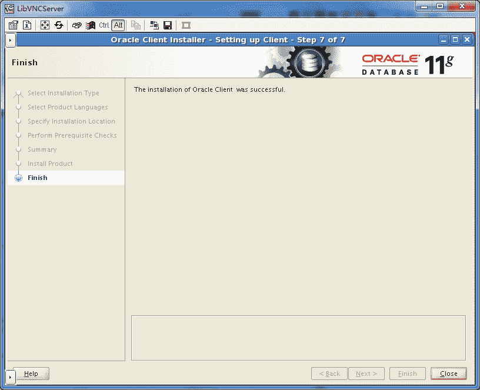

# 部分 VII. Oracle

## 第 74 章 Oracle 12c 安装可

```
[root@localhost ~]# hostnamectl 
   Static hostname: localhost.localdomain
         Icon name: computer-desktop
           Chassis: desktop
        Machine ID: b4f65cfce3a24bdea03ec5b8ee0a0260
           Boot ID: f6e5e776b7cf47f882f4fcc0c70be2e9
  Operating System: CentOS Linux 7 (Core)
       CPE OS Name: cpe:/o:centos:centos:7
            Kernel: Linux 3.10.0-229.el7.x86_64
      Architecture: x86_64	

```

## Server 安装

```
unzip linuxamd64_12c_database_1of2.zip
unzip linuxamd64_12c_database_2of2.zip

cd  database/
./runInstaller

```

|  |

|  |

|  |

|  |

|  |

|  |

|  |

|  |

|  |

|  |

|  |

|  |

|  |

|  |

|  |

```
[root@localhost ~]# /opt/oraInventory/orainstRoot.sh
Changing permissions of /opt/oraInventory.
Adding read,write permissions for group.
Removing read,write,execute permissions for world.

Changing groupname of /opt/oraInventory to oinstall.
The execution of the script is complete.

```

```
[root@localhost ~]# /opt/oracle/product/12.1.0/dbhome_1/root.sh
Performing root user operation.

The following environment variables are set as:
    ORACLE_OWNER= oracle
    ORACLE_HOME=  /opt/oracle/product/12.1.0/dbhome_1

Enter the full pathname of the local bin directory: [/usr/local/bin]:
   Copying dbhome to /usr/local/bin ...
   Copying oraenv to /usr/local/bin ...
   Copying coraenv to /usr/local/bin ...

Creating /etc/oratab file...
Entries will be added to the /etc/oratab file as needed by
Database Configuration Assistant when a database is created
Finished running generic part of root script.
Now product-specific root actions will be performed.

```

## Desktop 安装

Desktop 是指安装在桌面计算机，笔记本电脑上的数据库，占用资源比较少。

|  |

如果你想接收 Oracle 发来的关于数据库安全的邮件，请填写 email 地址

勾去选项 I wish to receive security updates via My Oracle Support.

|  |

点击 Yes 按钮继续

|  |

|  |

|  |

Character set 选择 Unicode(AL32UTF8)

输入 Administrative password 与 Confirm password 两个密码。

勾去选项 Create as Container database

|  |

|  |

|  |

|  |

|  |

|  |

|  |

|  |

|  |

|  |

## Oracle Net Configuration Assistant

## Oracle 12c Client for Windows 10

|  |

|  |

|  |

|  |

|  |

|  |

|  |

## 卸载 Oracle

卸载或者重装运行下面命令清理 Oracle

```
# rm -rf /etc/oratab /etc/oraInst.loc
# rm -rf /opt/oracle /opt/oraInventory /opt/ORCLfmap/

```

## Linux 安装 sqlplus

[`www.oracle.com/technetwork/topics/linuxx86-64soft-092277.html`](http://www.oracle.com/technetwork/topics/linuxx86-64soft-092277.html)

```
oracle-instantclient11.2-basic-11.2.0.4.0-1.x86_64.rpm
oracle-instantclient11.2-sqlplus-11.2.0.4.0-1.x86_64.rpm

```

安装

```
yum localinstall oracle-instantclient11.2-*		

```

创建 sqlnet.ora 和 tnsnames.ora 两个文件

```
mkdir -p /usr/lib/oracle/11.2/client64/network/admin
cd /usr/lib/oracle/11.2/client64/network/admin

[root@localhost admin]# cat sqlnet.ora
NAMES.DIRECTORY_PATH=(TNSNAMES, EZCONNECT)
ADR_BASE = /usr/lib/oracle/

[root@localhost admin]# cat tnsnames.ora
XXX =
   (DESCRIPTION =
     (ADDRESS = (PROTOCOL = TCP)(HOST = 172.16.0.2)(PORT = 1521))
     (CONNECT_DATA =
       (SERVER = DEDICATED)
       (SERVICE_NAME = DB)
     )
   )		

```

~/.bash_profile

```
ORACLE_HOME=/usr/lib/oracle/11.2/client64
PATH=$ORACLE_HOME/bin:$PATH
LD_LIBRARY_PATH=$ORACLE_HOME/lib
export ORACLE_HOME
export LD_LIBRARY_PATH
export TNS_ADMIN=$ORACLE_HOME/network/admin
export PATH		

```

```
sqlplus "username/password@(DESCRIPTION=(ADDRESS=(PROTOCOL=TCP)(HOST=192.168.2.1)(PORT=1521))(CONNECT_DATA=(SID=YOURSID)))"		

```

## 第 75 章 Privilege

## Account

```
select username,account_status from dba_users; 

select username,account_status from dba_users where account_status='OPEN';

select username,account_status from dba_users t where t.default_tablespace = 'USERS' and t.account_status = 'OPEN';

```

### show user

```

SQL> show user;
USER is "SYS"

SQL> select user from dual;

USER
------------------------------
SYS

```

### DEFAULT_TABLESPACE

用户默认表空间

```

SQL> SELECT DEFAULT_TABLESPACE FROM DBA_USERS WHERE USERNAME='WCUSER';

DEFAULT_TABLESPACE
------------------------------
WCSDB

SQL> SELECT DEFAULT_TABLESPACE FROM DBA_USERS WHERE USERNAME=(select user from dual);

DEFAULT_TABLESPACE
------------------------------
SYSTEM

SQL> select username,account_status from dba_users t where t.default_tablespace = 'USERS' and t.account_status = 'OPEN';

USERNAME                       ACCOUNT_STATUS
------------------------------ --------------------------------
FINANCE                        OPEN
NEWS                           OPEN

```

### unlock/lock

帐号加锁与解锁

**alter user scott account unlock /lock;**

```

SQL> alter user scott account unlock;

User altered.
SQL> select username,account_status from dba_users where username='SCOTT';

USERNAME                       ACCOUNT_STATUS
------------------------------ --------------------------------
SCOTT                          EXPIRED

SQL> alter user scott account lock;

User altered.

SQL> select username,account_status from dba_users where username='SCOTT';

USERNAME                       ACCOUNT_STATUS
------------------------------ --------------------------------
SCOTT                          EXPIRED & LOCKED

SQL>

```

## User

### Create user

```
create user userName identified by password; 

```

指定表空间

```
create user neo identified by 123456 default tablespace netkiller;

```

### Drop user

```
drop user userName cascade; 

```

cascade 删除用户同时删除该用户所创建的对象。

### Alter user

```
alter user neo default tablespace neo;			

```

### 修改密码

输入 sqlplus /nolog 回车

```
$ sqlplus /nolog

SQL> conn /as sysdba

SQL> alter user system identified by "123456";
SQL> alter user sys identified by "123456";
SQL> alter user FINANCE identified by "123123" account unlock;

User altered.

```

account unlock 解锁账号

```
alter user backup identified by "passw0rd" account unlock;			

```

### Reset Password 忘记密码重置密码

密码文件 orapwORACLE_SID 这里的 SID 是 orcl，所以密码文件是 orapworcl

```
orapwd file=$ORACLE_HOME/dbs/orapworcl password=newpass			

```

## grant

### 列出权限

```
CREATE SESSION	登陆权限，例如 sqlplus			

```

```

SQL> SELECT * FROM SYSTEM_PRIVILEGE_MAP;

 PRIVILEGE NAME 				      PROPERTY
---------- ---------------------------------------- ----------
	-3 ALTER SYSTEM 				     0
	-4 AUDIT SYSTEM 				     0
	-5 CREATE SESSION				     0
	-6 ALTER SESSION				     0
	-7 RESTRICTED SESSION				     0
       -10 CREATE TABLESPACE				     0
       -11 ALTER TABLESPACE				     0
       -12 MANAGE TABLESPACE				     0
       -13 DROP TABLESPACE				     0
       -15 UNLIMITED TABLESPACE 			     0
       -20 CREATE USER					     0
       -21 BECOME USER					     0
       -22 ALTER USER					     0
       -23 DROP USER					     0
       -30 CREATE ROLLBACK SEGMENT			     0
       -31 ALTER ROLLBACK SEGMENT			     0
       -32 DROP ROLLBACK SEGMENT			     0
       -40 CREATE TABLE 				     0
       -41 CREATE ANY TABLE				     0
       -42 ALTER ANY TABLE				     0
       -43 BACKUP ANY TABLE				     0
       -44 DROP ANY TABLE				     0
       -45 LOCK ANY TABLE				     0
       -46 COMMENT ANY TABLE				     0
       -47 SELECT ANY TABLE				     0
       -48 INSERT ANY TABLE				     0
       -49 UPDATE ANY TABLE				     0
       -50 DELETE ANY TABLE				     0
       -60 CREATE CLUSTER				     0
       -61 CREATE ANY CLUSTER				     0
       -62 ALTER ANY CLUSTER				     0
       -63 DROP ANY CLUSTER				     0
       -71 CREATE ANY INDEX				     0
       -72 ALTER ANY INDEX				     0
       -73 DROP ANY INDEX				     0
       -80 CREATE SYNONYM				     0
       -81 CREATE ANY SYNONYM				     0
       -82 DROP ANY SYNONYM				     0
       -83 SYSDBA					     0
       -84 SYSOPER					     0
       -85 CREATE PUBLIC SYNONYM			     0
       -86 DROP PUBLIC SYNONYM				     0
       -90 CREATE VIEW					     0
       -91 CREATE ANY VIEW				     0
       -92 DROP ANY VIEW				     0
      -105 CREATE SEQUENCE				     0
      -106 CREATE ANY SEQUENCE				     0
      -107 ALTER ANY SEQUENCE				     0
      -108 DROP ANY SEQUENCE				     0
      -109 SELECT ANY SEQUENCE				     0
      -115 CREATE DATABASE LINK 			     0
      -120 CREATE PUBLIC DATABASE LINK			     0
      -121 DROP PUBLIC DATABASE LINK			     0
      -125 CREATE ROLE					     0
      -126 DROP ANY ROLE				     0
      -127 GRANT ANY ROLE				     0
      -128 ALTER ANY ROLE				     0
      -130 AUDIT ANY					     0
      -135 ALTER DATABASE				     0
      -138 FORCE TRANSACTION				     0
      -139 FORCE ANY TRANSACTION			     0
      -140 CREATE PROCEDURE				     0
      -141 CREATE ANY PROCEDURE 			     0
      -142 ALTER ANY PROCEDURE				     0
      -143 DROP ANY PROCEDURE				     0
      -144 EXECUTE ANY PROCEDURE			     0
      -151 CREATE TRIGGER				     0
      -152 CREATE ANY TRIGGER				     0
      -153 ALTER ANY TRIGGER				     0
      -154 DROP ANY TRIGGER				     0
      -160 CREATE PROFILE				     0
      -161 ALTER PROFILE				     0
      -162 DROP PROFILE 				     0
      -163 ALTER RESOURCE COST				     0
      -165 ANALYZE ANY					     0
      -167 GRANT ANY PRIVILEGE				     0
      -172 CREATE MATERIALIZED VIEW			     0
      -173 CREATE ANY MATERIALIZED VIEW 		     0
      -174 ALTER ANY MATERIALIZED VIEW			     0
      -175 DROP ANY MATERIALIZED VIEW			     0
      -177 CREATE ANY DIRECTORY 			     0
      -178 DROP ANY DIRECTORY				     0
      -180 CREATE TYPE					     0
      -181 CREATE ANY TYPE				     0
      -182 ALTER ANY TYPE				     0
      -183 DROP ANY TYPE				     0
      -184 EXECUTE ANY TYPE				     0
      -186 UNDER ANY TYPE				     0
      -188 CREATE LIBRARY				     0
      -189 CREATE ANY LIBRARY				     0
      -190 ALTER ANY LIBRARY				     0
      -191 DROP ANY LIBRARY				     0
      -192 EXECUTE ANY LIBRARY				     0
      -200 CREATE OPERATOR				     0
      -201 CREATE ANY OPERATOR				     0
      -202 ALTER ANY OPERATOR				     0
      -203 DROP ANY OPERATOR				     0

 PRIVILEGE NAME 				      PROPERTY
---------- ---------------------------------------- ----------
      -204 EXECUTE ANY OPERATOR 			     0
      -205 CREATE INDEXTYPE				     0
      -206 CREATE ANY INDEXTYPE 			     0
      -207 ALTER ANY INDEXTYPE				     0
      -208 DROP ANY INDEXTYPE				     0
      -209 UNDER ANY VIEW				     0
      -210 QUERY REWRITE				     0
      -211 GLOBAL QUERY REWRITE 			     0
      -212 EXECUTE ANY INDEXTYPE			     0
      -213 UNDER ANY TABLE				     0
      -214 CREATE DIMENSION				     0
      -215 CREATE ANY DIMENSION 			     0
      -216 ALTER ANY DIMENSION				     0
      -217 DROP ANY DIMENSION				     0
      -218 MANAGE ANY QUEUE				     1
      -219 ENQUEUE ANY QUEUE				     1
      -220 DEQUEUE ANY QUEUE				     1
      -222 CREATE ANY CONTEXT				     0
      -223 DROP ANY CONTEXT				     0
      -224 CREATE ANY OUTLINE				     0
      -225 ALTER ANY OUTLINE				     0
      -226 DROP ANY OUTLINE				     0
      -227 ADMINISTER RESOURCE MANAGER			     1
      -228 ADMINISTER DATABASE TRIGGER			     0
      -233 MERGE ANY VIEW				     0
      -234 ON COMMIT REFRESH				     0
      -235 EXEMPT ACCESS POLICY 			     0
      -236 RESUMABLE					     0
      -237 SELECT ANY DICTIONARY			     0
      -238 DEBUG CONNECT SESSION			     0
      -241 DEBUG ANY PROCEDURE				     0
      -243 FLASHBACK ANY TABLE				     0
      -244 GRANT ANY OBJECT PRIVILEGE			     0
      -245 CREATE EVALUATION CONTEXT			     1
      -246 CREATE ANY EVALUATION CONTEXT		     1
      -247 ALTER ANY EVALUATION CONTEXT 		     1
      -248 DROP ANY EVALUATION CONTEXT			     1
      -249 EXECUTE ANY EVALUATION CONTEXT		     1
      -250 CREATE RULE SET				     1
      -251 CREATE ANY RULE SET				     1
      -252 ALTER ANY RULE SET				     1
      -253 DROP ANY RULE SET				     1
      -254 EXECUTE ANY RULE SET 			     1
      -255 EXPORT FULL DATABASE 			     0
      -256 IMPORT FULL DATABASE 			     0
      -257 CREATE RULE					     1
      -258 CREATE ANY RULE				     1
      -259 ALTER ANY RULE				     1
      -260 DROP ANY RULE				     1
      -261 EXECUTE ANY RULE				     1
      -262 ANALYZE ANY DICTIONARY			     0
      -263 ADVISOR					     0
      -264 CREATE JOB					     0
      -265 CREATE ANY JOB				     0
      -266 EXECUTE ANY PROGRAM				     0
      -267 EXECUTE ANY CLASS				     0
      -268 MANAGE SCHEDULER				     0
      -269 SELECT ANY TRANSACTION			     0
      -270 DROP ANY SQL PROFILE 			     0
      -271 ALTER ANY SQL PROFILE			     0
      -272 ADMINISTER SQL TUNING SET			     0
      -273 ADMINISTER ANY SQL TUNING SET		     0
      -274 CREATE ANY SQL PROFILE			     0
      -275 EXEMPT IDENTITY POLICY			     0
      -276 MANAGE FILE GROUP				     1
      -277 MANAGE ANY FILE GROUP			     1
      -278 READ ANY FILE GROUP				     1
      -279 CHANGE NOTIFICATION				     0
      -280 CREATE EXTERNAL JOB				     0
      -281 CREATE ANY EDITION				     0
      -282 DROP ANY EDITION				     0
      -283 ALTER ANY EDITION				     0
      -284 CREATE ASSEMBLY				     0
      -285 CREATE ANY ASSEMBLY				     0
      -286 ALTER ANY ASSEMBLY				     0
      -287 DROP ANY ASSEMBLY				     0
      -288 EXECUTE ANY ASSEMBLY 			     0
      -289 EXECUTE ASSEMBLY				     0
      -290 CREATE MINING MODEL				     0
      -291 CREATE ANY MINING MODEL			     0
      -292 DROP ANY MINING MODEL			     0
      -293 SELECT ANY MINING MODEL			     0
      -294 ALTER ANY MINING MODEL			     0
      -295 COMMENT ANY MINING MODEL			     0
      -301 CREATE CUBE DIMENSION			     0
      -302 ALTER ANY CUBE DIMENSION			     0
      -303 CREATE ANY CUBE DIMENSION			     0
      -304 DELETE ANY CUBE DIMENSION			     0
      -305 DROP ANY CUBE DIMENSION			     0
      -306 INSERT ANY CUBE DIMENSION			     0
      -307 SELECT ANY CUBE DIMENSION			     0
      -308 CREATE CUBE					     0
      -309 ALTER ANY CUBE				     0
      -310 CREATE ANY CUBE				     0
      -311 DROP ANY CUBE				     0
      -312 SELECT ANY CUBE				     0
      -313 UPDATE ANY CUBE				     0

 PRIVILEGE NAME 				      PROPERTY
---------- ---------------------------------------- ----------
      -314 CREATE MEASURE FOLDER			     0
      -315 CREATE ANY MEASURE FOLDER			     0
      -316 DELETE ANY MEASURE FOLDER			     0
      -317 DROP ANY MEASURE FOLDER			     0
      -318 INSERT ANY MEASURE FOLDER			     0
      -319 CREATE CUBE BUILD PROCESS			     0
      -320 CREATE ANY CUBE BUILD PROCESS		     0
      -321 DROP ANY CUBE BUILD PROCESS			     0
      -322 UPDATE ANY CUBE BUILD PROCESS		     0
      -326 UPDATE ANY CUBE DIMENSION			     0
      -327 ADMINISTER SQL MANAGEMENT OBJECT		     0
      -328 ALTER PUBLIC DATABASE LINK			     0
      -329 ALTER DATABASE LINK				     0
      -350 FLASHBACK ARCHIVE ADMINISTER 		     0

208 rows selected.			

```

### 查看用户权限

```
SELECT * FROM TABLE_PRIVILEGES;
SELECT * FROM DBA_TAB_PRIVS;			

```

```
select * from dict where table_name like '%PRIV%';			

```

SELECT grantee,privilege,admin_option FROM dba_sys_privs WHERE grantee IN ('SCOTT','SYS','SYSTEM') ORDER BY grantee;

```

SQL> SELECT grantee,privilege,admin_option FROM dba_sys_privs WHERE grantee IN ('SCOTT','SYS','SYSTEM') ORDER BY grantee;

GRANTEE 		       PRIVILEGE				ADM
------------------------------ ---------------------------------------- ---
SCOTT			       UNLIMITED TABLESPACE			NO
SYS			       ADMINISTER ANY SQL TUNING SET		NO
SYS			       ADMINISTER DATABASE TRIGGER		NO
SYS			       ADMINISTER RESOURCE MANAGER		NO
SYS			       ADMINISTER SQL MANAGEMENT OBJECT 	NO
SYS			       ADMINISTER SQL TUNING SET		NO
SYS			       ADVISOR					NO
SYS			       ALTER ANY ASSEMBLY			NO
SYS			       ALTER ANY CLUSTER			NO
SYS			       ALTER ANY CUBE				NO
SYS			       ALTER ANY CUBE DIMENSION 		NO
SYS			       ALTER ANY DIMENSION			NO
SYS			       ALTER ANY EDITION			NO
SYS			       ALTER ANY EVALUATION CONTEXT		YES
SYS			       ALTER ANY INDEX				NO
SYS			       ALTER ANY INDEXTYPE			NO
SYS			       ALTER ANY LIBRARY			NO
SYS			       ALTER ANY MATERIALIZED VIEW		NO
SYS			       ALTER ANY MINING MODEL			NO
SYS			       ALTER ANY OPERATOR			NO
SYS			       ALTER ANY OUTLINE			NO
SYS			       ALTER ANY PROCEDURE			NO
SYS			       ALTER ANY ROLE				NO
SYS			       ALTER ANY RULE				YES
SYS			       ALTER ANY RULE SET			YES
SYS			       ALTER ANY SEQUENCE			NO
SYS			       ALTER ANY SQL PROFILE			NO
SYS			       ALTER ANY TABLE				NO
SYS			       ALTER ANY TRIGGER			NO
SYS			       ALTER ANY TYPE				NO
SYS			       ALTER DATABASE				NO
SYS			       ALTER PROFILE				NO
SYS			       ALTER RESOURCE COST			NO
SYS			       ALTER ROLLBACK SEGMENT			NO
SYS			       ALTER SESSION				NO
SYS			       ALTER SYSTEM				NO
SYS			       ALTER TABLESPACE 			NO
SYS			       ALTER USER				NO
SYS			       ANALYZE ANY				NO
SYS			       AUDIT ANY				NO
SYS			       AUDIT SYSTEM				NO
SYS			       BACKUP ANY TABLE 			NO
SYS			       BECOME USER				NO
SYS			       CHANGE NOTIFICATION			NO
SYS			       COMMENT ANY MINING MODEL 		NO
SYS			       COMMENT ANY TABLE			NO
SYS			       CREATE ANY ASSEMBLY			NO
SYS			       CREATE ANY CLUSTER			NO
SYS			       CREATE ANY CONTEXT			NO
SYS			       CREATE ANY CUBE				NO
SYS			       CREATE ANY CUBE BUILD PROCESS		NO
SYS			       CREATE ANY CUBE DIMENSION		NO
SYS			       CREATE ANY DIMENSION			NO
SYS			       CREATE ANY DIRECTORY			NO
SYS			       CREATE ANY EDITION			NO
SYS			       CREATE ANY EVALUATION CONTEXT		YES
SYS			       CREATE ANY INDEX 			NO
SYS			       CREATE ANY INDEXTYPE			NO
SYS			       CREATE ANY JOB				NO
SYS			       CREATE ANY LIBRARY			NO
SYS			       CREATE ANY MATERIALIZED VIEW		NO
SYS			       CREATE ANY MEASURE FOLDER		NO
SYS			       CREATE ANY MINING MODEL			NO
SYS			       CREATE ANY OPERATOR			NO
SYS			       CREATE ANY OUTLINE			NO
SYS			       CREATE ANY PROCEDURE			NO
SYS			       CREATE ANY RULE				YES
SYS			       CREATE ANY RULE SET			YES
SYS			       CREATE ANY SEQUENCE			NO
SYS			       CREATE ANY SQL PROFILE			NO
SYS			       CREATE ANY SYNONYM			NO
SYS			       CREATE ANY TABLE 			NO
SYS			       CREATE ANY TRIGGER			NO
SYS			       CREATE ANY TYPE				NO
SYS			       CREATE ANY VIEW				NO
SYS			       CREATE ASSEMBLY				NO
SYS			       CREATE CLUSTER				NO
SYS			       CREATE CUBE				NO
SYS			       CREATE CUBE BUILD PROCESS		NO
SYS			       CREATE CUBE DIMENSION			NO
SYS			       CREATE DATABASE LINK			NO
SYS			       CREATE DIMENSION 			NO
SYS			       CREATE EVALUATION CONTEXT		YES
SYS			       CREATE EXTERNAL JOB			NO
SYS			       CREATE INDEXTYPE 			NO
SYS			       CREATE JOB				NO
SYS			       CREATE LIBRARY				NO
SYS			       CREATE MATERIALIZED VIEW 		NO
SYS			       CREATE MEASURE FOLDER			NO
SYS			       CREATE MINING MODEL			NO
SYS			       CREATE OPERATOR				NO
SYS			       CREATE PROCEDURE 			NO
SYS			       CREATE PROFILE				NO
SYS			       CREATE PUBLIC DATABASE LINK		NO
SYS			       CREATE PUBLIC SYNONYM			NO
SYS			       CREATE ROLE				NO
SYS			       CREATE ROLLBACK SEGMENT			NO

GRANTEE 		       PRIVILEGE				ADM
------------------------------ ---------------------------------------- ---
SYS			       CREATE RULE				YES
SYS			       CREATE RULE SET				YES
SYS			       CREATE SEQUENCE				NO
SYS			       CREATE SESSION				NO
SYS			       CREATE SYNONYM				NO
SYS			       CREATE TABLE				NO
SYS			       CREATE TABLESPACE			NO
SYS			       CREATE TRIGGER				NO
SYS			       CREATE TYPE				NO
SYS			       CREATE USER				NO
SYS			       CREATE VIEW				NO
SYS			       DEBUG ANY PROCEDURE			NO
SYS			       DEBUG CONNECT SESSION			NO
SYS			       DELETE ANY CUBE DIMENSION		NO
SYS			       DELETE ANY MEASURE FOLDER		NO
SYS			       DELETE ANY TABLE 			NO
SYS			       DEQUEUE ANY QUEUE			YES
SYS			       DROP ANY ASSEMBLY			NO
SYS			       DROP ANY CLUSTER 			NO
SYS			       DROP ANY CONTEXT 			NO
SYS			       DROP ANY CUBE				NO
SYS			       DROP ANY CUBE BUILD PROCESS		NO
SYS			       DROP ANY CUBE DIMENSION			NO
SYS			       DROP ANY DIMENSION			NO
SYS			       DROP ANY DIRECTORY			NO
SYS			       DROP ANY EDITION 			NO
SYS			       DROP ANY EVALUATION CONTEXT		YES
SYS			       DROP ANY INDEX				NO
SYS			       DROP ANY INDEXTYPE			NO
SYS			       DROP ANY LIBRARY 			NO
SYS			       DROP ANY MATERIALIZED VIEW		NO
SYS			       DROP ANY MEASURE FOLDER			NO
SYS			       DROP ANY MINING MODEL			NO
SYS			       DROP ANY OPERATOR			NO
SYS			       DROP ANY OUTLINE 			NO
SYS			       DROP ANY PROCEDURE			NO
SYS			       DROP ANY ROLE				NO
SYS			       DROP ANY RULE				YES
SYS			       DROP ANY RULE SET			YES
SYS			       DROP ANY SEQUENCE			NO
SYS			       DROP ANY SQL PROFILE			NO
SYS			       DROP ANY SYNONYM 			NO
SYS			       DROP ANY TABLE				NO
SYS			       DROP ANY TRIGGER 			NO
SYS			       DROP ANY TYPE				NO
SYS			       DROP ANY VIEW				NO
SYS			       DROP PROFILE				NO
SYS			       DROP PUBLIC DATABASE LINK		NO
SYS			       DROP PUBLIC SYNONYM			NO
SYS			       DROP ROLLBACK SEGMENT			NO
SYS			       DROP TABLESPACE				NO
SYS			       DROP USER				NO
SYS			       ENQUEUE ANY QUEUE			YES
SYS			       EXECUTE ANY ASSEMBLY			NO
SYS			       EXECUTE ANY CLASS			NO
SYS			       EXECUTE ANY EVALUATION CONTEXT		YES
SYS			       EXECUTE ANY INDEXTYPE			NO
SYS			       EXECUTE ANY LIBRARY			NO
SYS			       EXECUTE ANY OPERATOR			NO
SYS			       EXECUTE ANY PROCEDURE			NO
SYS			       EXECUTE ANY PROGRAM			NO
SYS			       EXECUTE ANY RULE 			YES
SYS			       EXECUTE ANY RULE SET			YES
SYS			       EXECUTE ANY TYPE 			NO
SYS			       EXECUTE ASSEMBLY 			NO
SYS			       EXPORT FULL DATABASE			NO
SYS			       FLASHBACK ANY TABLE			NO
SYS			       FLASHBACK ARCHIVE ADMINISTER		NO
SYS			       FORCE ANY TRANSACTION			NO
SYS			       FORCE TRANSACTION			NO
SYS			       GLOBAL QUERY REWRITE			NO
SYS			       GRANT ANY OBJECT PRIVILEGE		NO
SYS			       GRANT ANY PRIVILEGE			NO
SYS			       GRANT ANY ROLE				NO
SYS			       IMPORT FULL DATABASE			NO
SYS			       INSERT ANY CUBE DIMENSION		NO
SYS			       INSERT ANY MEASURE FOLDER		NO
SYS			       INSERT ANY TABLE 			NO
SYS			       LOCK ANY TABLE				NO
SYS			       MANAGE ANY FILE GROUP			NO
SYS			       MANAGE ANY QUEUE 			YES
SYS			       MANAGE FILE GROUP			NO
SYS			       MANAGE SCHEDULER 			NO
SYS			       MANAGE TABLESPACE			NO
SYS			       MERGE ANY VIEW				NO
SYS			       ON COMMIT REFRESH			NO
SYS			       QUERY REWRITE				NO
SYS			       READ ANY FILE GROUP			NO
SYS			       RESTRICTED SESSION			NO
SYS			       RESUMABLE				NO
SYS			       SELECT ANY CUBE				NO
SYS			       SELECT ANY CUBE DIMENSION		NO
SYS			       SELECT ANY MINING MODEL			NO
SYS			       SELECT ANY SEQUENCE			NO
SYS			       SELECT ANY TABLE 			YES
SYS			       SELECT ANY TRANSACTION			NO
SYS			       UNDER ANY TABLE				NO

GRANTEE 		       PRIVILEGE				ADM
------------------------------ ---------------------------------------- ---
SYS			       UNDER ANY TYPE				NO
SYS			       UNDER ANY VIEW				NO
SYS			       UNLIMITED TABLESPACE			NO
SYS			       UPDATE ANY CUBE				NO
SYS			       UPDATE ANY CUBE BUILD PROCESS		NO
SYS			       UPDATE ANY CUBE DIMENSION		NO
SYS			       UPDATE ANY TABLE 			NO
SYSTEM			       CREATE MATERIALIZED VIEW 		NO
SYSTEM			       CREATE TABLE				NO
SYSTEM			       GLOBAL QUERY REWRITE			NO
SYSTEM			       SELECT ANY TABLE 			NO
SYSTEM			       UNLIMITED TABLESPACE			YES

206 rows selected.			

```

select grantee,privilege,admin_option from dba_sys_privs where grantee in ('SCOTT','SYS') and privilege = 'EXECUTE ANY PROCEDURE' order by grantee;

```

SQL> select grantee,privilege,admin_option from dba_sys_privs where grantee in ('SCOTT','SYS')  and privilege = 'EXECUTE ANY PROCEDURE' order by grantee;

GRANTEE 		       PRIVILEGE				ADM
------------------------------ ---------------------------------------- ---
SYS			       EXECUTE ANY PROCEDURE			NO

```

### 吊销权限

```
REVOKE EXECUTE ANY PROCEDURE FROM scott;			

```

### System Privileges 系统权限

授予 DBA 权限，不限制的表空间，查询任何表，查询任何字典

```

grant dba to neo;  
grant unlimited tablespace to neo;  
grant select any table to neo;  
grant select any dictionary to neo; 

```

#### EM 权限

```
grant connect, resource, select_catalog_role to username;

```

#### Granting and Revoking SYSDBA and SYSOPER Privileges

Granting and Revoking SYSDBA and SYSOPER Privileges

```

If your server is using an EXCLUSIVE password file, use the GRANT statement to grant the SYSDBA or SYSOPER system privilege to a user, as shown in the following example:

GRANT SYSDBA TO user;

Use the REVOKE statement to revoke the SYSDBA or SYSOPER system privilege from a user, as shown in the following example:

REVOKE SYSDBA FROM user;

```

SYSDBA, SYSOPER, SYSASM

```
REVOKE SYSOPER FROM non-SYS-user;
GRANT SYSOPER TO non-SYS-user;		

```

### Object Privileges 对象权限

## Opening the Encrypted Wallet

```

$ sqlplus / as sysdba

SQL*Plus: Release 11.2.0.1.0 Production on Mon Feb 1 15:53:57 2016

Copyright (c) 1982, 2009, Oracle.  All rights reserved.

Connected to:
Oracle Database 11g Enterprise Edition Release 11.2.0.1.0 - 64bit Production
With the Partitioning, OLAP, Data Mining and Real Application Testing options

SQL> select * from v$encryption_wallet;

WRL_TYPE
--------------------
WRL_PARAMETER
-----------------------------------------------------------------------------
STATUS
------------------
file
/opt/oracle/admin/orcl/wallet
CLOSED

```

```

		$ orapki wallet create -wallet /opt/oracle/admin/orcl/wallet -auto_login_local
Oracle PKI Tool : Version 11.2.0.1.0 - Production
Copyright (c) 2004, 2009, Oracle and/or its affiliates. All rights reserved.

Enter password:       
Enter password again:   

[oracle@orcl ~]$ ll /opt/oracle/admin/orcl/wallet
total 8
-rw------- 1 oracle oinstall 3589 Feb  1 15:58 cwallet.sso
-rw------- 1 oracle oinstall 3512 Feb  1 15:58 ewallet.p12

```

```

		SQL> select * from v$encryption_wallet;

WRL_TYPE
--------------------
WRL_PARAMETER
--------------------
STATUS
------------------
file
/opt/oracle/admin/orcl/wallet
OPEN_NO_MASTER_KEY

```

The Wallet must be open before opening the database:

```

SQL> startup mount;
SQL> alter system set wallet open identified by "password";
SQL> alter database open;

```

待续......

## 第 76 章 数据库管理

## lsnrctl

```
启动监听服务：
lsnrctl start

停止监听服务：
lsnrctl stop

查看监听状态：
lsnrctl status

```

## listener.ora

```

[root@database ~]# cat /u01/app/oracle/product/10.2.0.1/network/admin/listener.ora
# listener.ora Network Configuration File: /u01/app/oracle/product/10.2.0.1/network/admin/listener.ora
# Generated by Oracle configuration tools.

SID_LIST_LISTENER =
  (SID_LIST =
    (SID_DESC =
      (SID_NAME = PLSExtProc)
      (ORACLE_HOME = /u01/app/oracle/product/10.2.0.1)
      (PROGRAM = extproc)
    )
  )

LISTENER =
  (DESCRIPTION_LIST =
    (DESCRIPTION =
      (ADDRESS = (PROTOCOL = IPC)(KEY = EXTPROC1))
      (ADDRESS = (PROTOCOL = TCP)(HOST = database.example.com)(PORT = 1521))
    )
  )		

```

## TNS 配置

tnsnames.ora 文件默认在 network/admin/tnsnames.ora

有些情况如你没有权限修改 network/admin/tnsnames.ora, 你可以在$HOME 下创建一个.tnsnames.ora 文件

```

[oracle@orcl admin]$ cat tnsnames.ora
# tnsnames.ora Network Configuration File: /opt/oracle/product/11.2.0/dbhome_1/network/admin/tnsnames.ora
# Generated by Oracle configuration tools.

ORCL =
  (DESCRIPTION =
    (ADDRESS = (PROTOCOL = TCP)(HOST = oral.example.com)(PORT = 1521))
    (CONNECT_DATA =
      (SERVER = DEDICATED)
      (SERVICE_NAME = orcl.example.com)
    )
  )

```

测试 TNS

```
$ sqlplus sys/chen@orcl

```

### HOST

HOST 可以使用 IP 地址 HOST = 192.168.0.5 建议改为 hostname 例如 HOST = oral.example.com 这样方便服务器更换 IP。

```
ORCL =
  (DESCRIPTION =
    (ADDRESS_LIST =
      (ADDRESS = (PROTOCOL = TCP)(HOST = 192.168.0.5)(PORT = 1521))
    )
    (CONNECT_DATA =
      (SERVICE_NAME = orcl.example.com)
    )
  )

```

SERVICE_NAME 通過 show parameter service_name;查詢

```
$ sqlplus user@orcl

```

### SID

Oracle 10G 之前多采用 SID = oradb

10G 之后更多使用 SERVICE_NAME = orcl.example.com

```

oradb10g =
  (DESCRIPTION =
    (ADDRESS_LIST =
      (ADDRESS = (PROTOCOL = TCP)(HOST = db1.domain.com)(PORT = 1521))
    )
    (CONNECT_DATA =
      (SID = oradb10g)
    )
  )

oradb =
  (DESCRIPTION =
    (ADDRESS_LIST =
      (ADDRESS = (PROTOCOL = TCP)(HOST = db2.domain.com)(PORT = 1521))
    )
    (CONNECT_DATA =
      (SID = oradb)
    )
  )	

```

## parameter

### db

```

SQL> show parameter db;

NAME                                 TYPE        VALUE
------------------------------------ ----------- ------------------------------
db_16k_cache_size                    big integer 0
db_2k_cache_size                     big integer 0
db_32k_cache_size                    big integer 0
db_4k_cache_size                     big integer 0
db_8k_cache_size                     big integer 0
db_block_buffers                     integer     0
db_block_checking                    string      FALSE
db_block_checksum                    string      TYPICAL
db_block_size                        integer     8192
db_cache_advice                      string      ON
db_cache_size                        big integer 0

NAME                                 TYPE        VALUE
------------------------------------ ----------- ------------------------------
db_create_file_dest                  string
db_create_online_log_dest_1          string
db_create_online_log_dest_2          string
db_create_online_log_dest_3          string
db_create_online_log_dest_4          string
db_create_online_log_dest_5          string
db_domain                            string      example.com
db_file_multiblock_read_count        integer     128
db_file_name_convert                 string
db_files                             integer     200
db_flash_cache_file                  string

NAME                                 TYPE        VALUE
------------------------------------ ----------- ------------------------------
db_flash_cache_size                  big integer 0
db_flashback_retention_target        integer     1440
db_keep_cache_size                   big integer 0
db_lost_write_protect                string      NONE
db_name                              string      orcl
db_recovery_file_dest                string      /opt/oracle/flash_recovery_are
                                                 a
db_recovery_file_dest_size           big integer 3882M
db_recycle_cache_size                big integer 0
db_securefile                        string      PERMITTED
db_ultra_safe                        string      OFF

NAME                                 TYPE        VALUE
------------------------------------ ----------- ------------------------------
db_unique_name                       string      orcl
db_writer_processes                  integer     1
dbwr_io_slaves                       integer     0
rdbms_server_dn                      string
standby_archive_dest                 string      ?/dbs/arch
standby_file_management              string      MANUAL
xml_db_events                        string      enable

```

### instance_name

```

SQL> show parameter instance_name;

NAME                                 TYPE        VALUE
------------------------------------ ----------- ------------------------------
instance_name                        string      orcl
SQL>

SQL> select instance from v$thread;

INSTANCE
--------------------------------------------------------------------------------
orcl

```

### service_name

```

SQL> show parameter service_name;

NAME                                 TYPE        VALUE
------------------------------------ ----------- ------------------------------
service_names                        string      orcl.example.com
SQL>

```

### global_name

```

SQL> select * from global_name;

GLOBAL_NAME
--------------------------------------------------------------------------------
ORCL.EXAMPLE.COM

```

### db_name

```

SQL> show parameter db_name;

NAME                                 TYPE        VALUE
------------------------------------ ----------- ------------------------------
db_name                              string      orcl

SQL> select name from v$database;

NAME
---------
ORCL

```

### db_domain

```

SQL> show parameter db_domain;

NAME                                 TYPE        VALUE
------------------------------------ ----------- ------------------------------
db_domain                            string      example.com
SQL>

```

### sga

```

SQL> show parameter sga;

NAME                                 TYPE        VALUE
------------------------------------ ----------- ------------------------------
lock_sga                             boolean     FALSE
pre_page_sga                         boolean     FALSE
sga_max_size                         big integer 6016M
sga_target                           big integer 0

```

### size

```

SQL> show parameter size

NAME                                 TYPE        VALUE
------------------------------------ ----------- ------------------------------
bitmap_merge_area_size               integer     1048576
client_result_cache_size             big integer 0
create_bitmap_area_size              integer     8388608
db_16k_cache_size                    big integer 0
db_2k_cache_size                     big integer 0
db_32k_cache_size                    big integer 0
db_4k_cache_size                     big integer 0
db_8k_cache_size                     big integer 0
db_block_size                        integer     8192
db_cache_size                        big integer 0
db_flash_cache_size                  big integer 0

NAME                                 TYPE        VALUE
------------------------------------ ----------- ------------------------------
db_keep_cache_size                   big integer 0
db_recovery_file_dest_size           big integer 3882M
db_recycle_cache_size                big integer 0
global_context_pool_size             string
hash_area_size                       integer     131072
java_max_sessionspace_size           integer     0
java_pool_size                       big integer 0
large_pool_size                      big integer 0
max_dump_file_size                   string      unlimited
object_cache_max_size_percent        integer     10
object_cache_optimal_size            integer     102400

NAME                                 TYPE        VALUE
------------------------------------ ----------- ------------------------------
olap_page_pool_size                  big integer 0
parallel_execution_message_size      integer     16384
result_cache_max_size                big integer 16064K
sga_max_size                         big integer 6272M
shared_pool_reserved_size            big integer 36909875
shared_pool_size                     big integer 0
sort_area_retained_size              integer     0
sort_area_size                       integer     65536
streams_pool_size                    big integer 0
workarea_size_policy                 string      AUTO

```

### spfile

```

SQL> show parameter spfile ;

NAME                                 TYPE        VALUE
------------------------------------ ----------- ------------------------------
spfile                               string      /opt/oracle/product/11.2.0/dbh
                                                 ome_1/dbs/spfilewcsdb.ora

```

### cache

```

SQL> show parameter cache

NAME                                 TYPE        VALUE
------------------------------------ ----------- ------------------------------
client_result_cache_lag              big integer 3000
client_result_cache_size             big integer 0
db_16k_cache_size                    big integer 0
db_2k_cache_size                     big integer 0
db_32k_cache_size                    big integer 0
db_4k_cache_size                     big integer 0
db_8k_cache_size                     big integer 0
db_cache_advice                      string      ON
db_cache_size                        big integer 0
db_flash_cache_file                  string
db_flash_cache_size                  big integer 0

NAME                                 TYPE        VALUE
------------------------------------ ----------- ------------------------------
db_keep_cache_size                   big integer 0
db_recycle_cache_size                big integer 0
object_cache_max_size_percent        integer     10
object_cache_optimal_size            integer     102400
result_cache_max_result              integer     5
result_cache_max_size                big integer 16064K
result_cache_mode                    string      MANUAL
result_cache_remote_expiration       integer     0
session_cached_cursors               integer     50

```

### Character Set

```

SQL> select * from V$NLS_VALID_VALUES where parameter='CHARACTERSET' and value like '%UTF%';

PARAMETER							 VALUE								  ISDEP     CON_ID
---------------------------------------------------------------- ---------------------------------------------------------------- ----- ----------
CHARACTERSET							 AL24UTFFSS							  TRUE		 0
CHARACTERSET							 UTF8								  FALSE 	 0
CHARACTERSET							 UTFE								  FALSE 	 0
CHARACTERSET							 AL32UTF8							  FALSE 	 0
CHARACTERSET							 AL16UTF16							  FALSE 	 0

```

```

SQL> select userenv('language') from dual;

USERENV('LANGUAGE')
----------------------------------------------------
AMERICAN_AMERICA.WE8MSWIN1252

```

```

SQL> select * from nls_database_parameters ;

PARAMETER															 VALUE
-------------------------------------------------------------------------------------------------------------------------------- ----------------------------------------------------------------
NLS_RDBMS_VERSION														 12.1.0.2.0
NLS_NCHAR_CONV_EXCP														 FALSE
NLS_LENGTH_SEMANTICS														 BYTE
NLS_COMP															 BINARY
NLS_DUAL_CURRENCY														 $
NLS_TIMESTAMP_TZ_FORMAT 													 DD-MON-RR HH.MI.SSXFF AM TZR
NLS_TIME_TZ_FORMAT														 HH.MI.SSXFF AM TZR
NLS_TIMESTAMP_FORMAT														 DD-MON-RR HH.MI.SSXFF AM
NLS_TIME_FORMAT 														 HH.MI.SSXFF AM
NLS_SORT															 BINARY
NLS_DATE_LANGUAGE														 AMERICAN
NLS_DATE_FORMAT 														 DD-MON-RR
NLS_CALENDAR															 GREGORIAN
NLS_NUMERIC_CHARACTERS														 .,
NLS_NCHAR_CHARACTERSET														 AL16UTF16
NLS_CHARACTERSET														 WE8MSWIN1252
NLS_ISO_CURRENCY														 AMERICA
NLS_CURRENCY															 $
NLS_TERRITORY															 AMERICA
NLS_LANGUAGE															 AMERICAN

20 rows selected.

```

```

SQL> SELECT * FROM v$nls_parameters;

PARAMETER							 VALUE								      CON_ID
---------------------------------------------------------------- ---------------------------------------------------------------- ----------
NLS_LANGUAGE							 AMERICAN								   0
NLS_TERRITORY							 AMERICA								   0
NLS_CURRENCY							 $									   0
NLS_ISO_CURRENCY						 AMERICA								   0
NLS_NUMERIC_CHARACTERS						 .,									   0
NLS_CALENDAR							 GREGORIAN								   0
NLS_DATE_FORMAT 						 DD-MON-RR								   0
NLS_DATE_LANGUAGE						 AMERICAN								   0
NLS_CHARACTERSET						 WE8MSWIN1252								   0
NLS_SORT							 BINARY 								   0
NLS_TIME_FORMAT 						 HH.MI.SSXFF AM 							   0
NLS_TIMESTAMP_FORMAT						 DD-MON-RR HH.MI.SSXFF AM						   0
NLS_TIME_TZ_FORMAT						 HH.MI.SSXFF AM TZR							   0
NLS_TIMESTAMP_TZ_FORMAT 					 DD-MON-RR HH.MI.SSXFF AM TZR						   0
NLS_DUAL_CURRENCY						 $									   0
NLS_NCHAR_CHARACTERSET						 AL16UTF16								   0
NLS_COMP							 BINARY 								   0
NLS_LENGTH_SEMANTICS						 BYTE									   0
NLS_NCHAR_CONV_EXCP						 FALSE									   0

19 rows selected.

```

```

SQL> SELECT * FROM v$nls_valid_values;

PARAMETER							 VALUE								  ISDEP     CON_ID
---------------------------------------------------------------- ---------------------------------------------------------------- ----- ----------
LANGUAGE							 AMERICAN							  FALSE 	 0
LANGUAGE							 GERMAN 							  FALSE 	 0
LANGUAGE							 FRENCH 							  FALSE 	 0
LANGUAGE							 CANADIAN FRENCH						  FALSE 	 0
LANGUAGE							 SPANISH							  FALSE 	 0
LANGUAGE							 ITALIAN							  FALSE 	 0
LANGUAGE							 DUTCH								  FALSE 	 0
LANGUAGE							 SWEDISH							  FALSE 	 0
LANGUAGE							 NORWEGIAN							  FALSE 	 0
LANGUAGE							 DANISH 							  FALSE 	 0
LANGUAGE							 FINNISH							  FALSE 	 0
LANGUAGE							 ICELANDIC							  FALSE 	 0
LANGUAGE							 GREEK								  FALSE 	 0
LANGUAGE							 PORTUGUESE							  FALSE 	 0
LANGUAGE							 TURKISH							  FALSE 	 0
LANGUAGE							 BRAZILIAN PORTUGUESE						  FALSE 	 0
LANGUAGE							 MEXICAN SPANISH						  FALSE 	 0
LANGUAGE							 RUSSIAN							  FALSE 	 0
LANGUAGE							 POLISH 							  FALSE 	 0
LANGUAGE							 HUNGARIAN							  FALSE 	 0
LANGUAGE							 CZECH								  FALSE 	 0
LANGUAGE							 LITHUANIAN							  FALSE 	 0
LANGUAGE							 SLOVAK 							  FALSE 	 0
LANGUAGE							 CATALAN							  FALSE 	 0
LANGUAGE							 BULGARIAN							  FALSE 	 0
LANGUAGE							 ROMANIAN							  FALSE 	 0
LANGUAGE							 SLOVENIAN							  FALSE 	 0
LANGUAGE							 HEBREW 							  FALSE 	 0
LANGUAGE							 EGYPTIAN							  FALSE 	 0
LANGUAGE							 CROATIAN							  FALSE 	 0
LANGUAGE							 ARABIC 							  FALSE 	 0
LANGUAGE							 THAI								  FALSE 	 0
LANGUAGE							 JAPANESE							  FALSE 	 0
LANGUAGE							 KOREAN 							  FALSE 	 0
LANGUAGE							 SIMPLIFIED CHINESE						  FALSE 	 0
LANGUAGE							 TRADITIONAL CHINESE						  FALSE 	 0
LANGUAGE							 ENGLISH							  FALSE 	 0
LANGUAGE							 LATIN AMERICAN SPANISH 					  FALSE 	 0
LANGUAGE							 UKRAINIAN							  FALSE 	 0
LANGUAGE							 ESTONIAN							  FALSE 	 0
LANGUAGE							 GERMAN DIN							  FALSE 	 0
LANGUAGE							 MALAY								  FALSE 	 0
LANGUAGE							 VIETNAMESE							  FALSE 	 0
LANGUAGE							 BENGALI							  TRUE		 0
LANGUAGE							 LATVIAN							  FALSE 	 0
LANGUAGE							 INDONESIAN							  FALSE 	 0
LANGUAGE							 HINDI								  FALSE 	 0
LANGUAGE							 TAMIL								  FALSE 	 0
LANGUAGE							 KANNADA							  FALSE 	 0
LANGUAGE							 TELUGU 							  FALSE 	 0
LANGUAGE							 ORIYA								  FALSE 	 0
LANGUAGE							 MALAYALAM							  FALSE 	 0
LANGUAGE							 ASSAMESE							  FALSE 	 0
LANGUAGE							 GUJARATI							  FALSE 	 0
LANGUAGE							 MARATHI							  FALSE 	 0
LANGUAGE							 PUNJABI							  FALSE 	 0
LANGUAGE							 BANGLA 							  FALSE 	 0
LANGUAGE							 AZERBAIJANI							  FALSE 	 0
LANGUAGE							 MACEDONIAN							  FALSE 	 0
LANGUAGE							 CYRILLIC SERBIAN						  FALSE 	 0
LANGUAGE							 LATIN SERBIAN							  FALSE 	 0
LANGUAGE							 CYRILLIC UZBEK 						  FALSE 	 0
LANGUAGE							 LATIN UZBEK							  FALSE 	 0
LANGUAGE							 CYRILLIC KAZAKH						  FALSE 	 0
LANGUAGE							 ALBANIAN							  FALSE 	 0
LANGUAGE							 BELARUSIAN							  FALSE 	 0
LANGUAGE							 IRISH								  FALSE 	 0
LANGUAGE							 SWAHILI							  FALSE 	 0
LANGUAGE							 DARI								  FALSE 	 0
LANGUAGE							 LATIN BOSNIAN							  FALSE 	 0
LANGUAGE							 AMHARIC							  FALSE 	 0
LANGUAGE							 LAO								  FALSE 	 0
LANGUAGE							 MALTESE							  FALSE 	 0
LANGUAGE							 NEPALI 							  FALSE 	 0
LANGUAGE							 ARMENIAN							  FALSE 	 0
LANGUAGE							 KHMER								  FALSE 	 0
LANGUAGE							 PERSIAN							  FALSE 	 0
LANGUAGE							 DIVEHI 							  FALSE 	 0
LANGUAGE							 SINHALA							  FALSE 	 0
TERRITORY							 AMERICA							  FALSE 	 0
TERRITORY							 UNITED KINGDOM 						  FALSE 	 0
TERRITORY							 GERMANY							  FALSE 	 0
TERRITORY							 FRANCE 							  FALSE 	 0
TERRITORY							 CANADA 							  FALSE 	 0
TERRITORY							 SPAIN								  FALSE 	 0
TERRITORY							 ITALY								  FALSE 	 0
TERRITORY							 THE NETHERLANDS						  FALSE 	 0
TERRITORY							 SWEDEN 							  FALSE 	 0
TERRITORY							 NORWAY 							  FALSE 	 0
TERRITORY							 DENMARK							  FALSE 	 0
TERRITORY							 FINLAND							  FALSE 	 0
TERRITORY							 ICELAND							  FALSE 	 0
TERRITORY							 GREECE 							  FALSE 	 0
TERRITORY							 PORTUGAL							  FALSE 	 0
TERRITORY							 TURKEY 							  FALSE 	 0
TERRITORY							 BRAZIL 							  FALSE 	 0
TERRITORY							 MEXICO 							  FALSE 	 0

PARAMETER							 VALUE								  ISDEP     CON_ID
---------------------------------------------------------------- ---------------------------------------------------------------- ----- ----------
TERRITORY							 CIS								  TRUE		 0
TERRITORY							 CROATIA							  FALSE 	 0
TERRITORY							 POLAND 							  FALSE 	 0
TERRITORY							 HUNGARY							  FALSE 	 0
TERRITORY							 CZECHOSLOVAKIA 						  TRUE		 0
TERRITORY							 LITHUANIA							  FALSE 	 0
TERRITORY							 ISRAEL 							  FALSE 	 0
TERRITORY							 BULGARIA							  FALSE 	 0
TERRITORY							 ALGERIA							  FALSE 	 0
TERRITORY							 BAHRAIN							  FALSE 	 0
TERRITORY							 CATALONIA							  FALSE 	 0
TERRITORY							 EGYPT								  FALSE 	 0
TERRITORY							 IRAQ								  FALSE 	 0
TERRITORY							 JORDAN 							  FALSE 	 0
TERRITORY							 KUWAIT 							  FALSE 	 0
TERRITORY							 LEBANON							  FALSE 	 0
TERRITORY							 LIBYA								  FALSE 	 0
TERRITORY							 MOROCCO							  FALSE 	 0
TERRITORY							 MAURITANIA							  FALSE 	 0
TERRITORY							 OMAN								  FALSE 	 0
TERRITORY							 QATAR								  FALSE 	 0
TERRITORY							 ROMANIA							  FALSE 	 0
TERRITORY							 SAUDI ARABIA							  FALSE 	 0
TERRITORY							 SOMALIA							  FALSE 	 0
TERRITORY							 SYRIA								  FALSE 	 0
TERRITORY							 DJIBOUTI							  FALSE 	 0
TERRITORY							 SLOVENIA							  FALSE 	 0
TERRITORY							 TUNISIA							  FALSE 	 0
TERRITORY							 YEMEN								  FALSE 	 0
TERRITORY							 SUDAN								  FALSE 	 0
TERRITORY							 SWITZERLAND							  FALSE 	 0
TERRITORY							 AUSTRIA							  FALSE 	 0
TERRITORY							 UNITED ARAB EMIRATES						  FALSE 	 0
TERRITORY							 THAILAND							  FALSE 	 0
TERRITORY							 CHINA								  FALSE 	 0
TERRITORY							 HONG KONG							  FALSE 	 0
TERRITORY							 JAPAN								  FALSE 	 0
TERRITORY							 KOREA								  FALSE 	 0
TERRITORY							 TAIWAN 							  FALSE 	 0
TERRITORY							 CZECH REPUBLIC 						  FALSE 	 0
TERRITORY							 SLOVAKIA							  FALSE 	 0
TERRITORY							 UKRAINE							  FALSE 	 0
TERRITORY							 ESTONIA							  FALSE 	 0
TERRITORY							 MALAYSIA							  FALSE 	 0
TERRITORY							 BANGLADESH							  FALSE 	 0
TERRITORY							 LATVIA 							  FALSE 	 0
TERRITORY							 VIETNAM							  FALSE 	 0
TERRITORY							 INDONESIA							  FALSE 	 0
TERRITORY							 CYPRUS 							  FALSE 	 0
TERRITORY							 AUSTRALIA							  FALSE 	 0
TERRITORY							 KAZAKHSTAN							  FALSE 	 0
TERRITORY							 UZBEKISTAN							  FALSE 	 0
TERRITORY							 SINGAPORE							  FALSE 	 0
TERRITORY							 SOUTH AFRICA							  FALSE 	 0
TERRITORY							 IRELAND							  FALSE 	 0
TERRITORY							 BELGIUM							  FALSE 	 0
TERRITORY							 LUXEMBOURG							  FALSE 	 0
TERRITORY							 NEW ZEALAND							  FALSE 	 0
TERRITORY							 INDIA								  FALSE 	 0
TERRITORY							 CHILE								  FALSE 	 0
TERRITORY							 COLOMBIA							  FALSE 	 0
TERRITORY							 COSTA RICA							  FALSE 	 0
TERRITORY							 EL SALVADOR							  FALSE 	 0
TERRITORY							 GUATEMALA							  FALSE 	 0
TERRITORY							 NICARAGUA							  FALSE 	 0
TERRITORY							 PANAMA 							  FALSE 	 0
TERRITORY							 PERU								  FALSE 	 0
TERRITORY							 PUERTO RICO							  FALSE 	 0
TERRITORY							 VENEZUELA							  FALSE 	 0
TERRITORY							 YUGOSLAVIA							  TRUE		 0
TERRITORY							 MACEDONIA							  TRUE		 0
TERRITORY							 RUSSIA 							  FALSE 	 0
TERRITORY							 AZERBAIJAN							  FALSE 	 0
TERRITORY							 FYR MACEDONIA							  FALSE 	 0
TERRITORY							 SERBIA AND MONTENEGRO						  TRUE		 0
TERRITORY							 ARGENTINA							  FALSE 	 0
TERRITORY							 ECUADOR							  FALSE 	 0
TERRITORY							 PHILIPPINES							  FALSE 	 0
TERRITORY							 ALBANIA							  FALSE 	 0
TERRITORY							 BELARUS							  FALSE 	 0
TERRITORY							 SERBIA 							  FALSE 	 0
TERRITORY							 MONTENEGRO							  FALSE 	 0
TERRITORY							 HONDURAS							  FALSE 	 0
TERRITORY							 PAKISTAN							  FALSE 	 0
TERRITORY							 SENEGAL							  FALSE 	 0
TERRITORY							 CAMEROON							  FALSE 	 0
TERRITORY							 CONGO BRAZZAVILLE						  FALSE 	 0
TERRITORY							 CONGO KINSHASA 						  FALSE 	 0
TERRITORY							 GABON								  FALSE 	 0
TERRITORY							 IVORY COAST							  FALSE 	 0
TERRITORY							 BAHAMAS							  FALSE 	 0
TERRITORY							 BERMUDA							  FALSE 	 0
TERRITORY							 NIGERIA							  FALSE 	 0
TERRITORY							 UGANDA 							  FALSE 	 0
TERRITORY							 ZAMBIA 							  FALSE 	 0
TERRITORY							 URUGUAY							  FALSE 	 0
TERRITORY							 KENYA								  FALSE 	 0

PARAMETER							 VALUE								  ISDEP     CON_ID
---------------------------------------------------------------- ---------------------------------------------------------------- ----- ----------
TERRITORY							 TANZANIA							  FALSE 	 0
TERRITORY							 BOLIVIA							  FALSE 	 0
TERRITORY							 BELIZE 							  FALSE 	 0
TERRITORY							 PARAGUAY							  FALSE 	 0
TERRITORY							 AFGHANISTAN							  FALSE 	 0
TERRITORY							 BOSNIA AND HERZEGOVINA 					  FALSE 	 0
TERRITORY							 ETHIOPIA							  FALSE 	 0
TERRITORY							 LAOS								  FALSE 	 0
TERRITORY							 MALTA								  FALSE 	 0
TERRITORY							 NEPAL								  FALSE 	 0
TERRITORY							 ARMENIA							  FALSE 	 0
TERRITORY							 MALDIVES							  FALSE 	 0
TERRITORY							 CAMBODIA							  FALSE 	 0
TERRITORY							 IRAN								  FALSE 	 0
TERRITORY							 SRI LANKA							  FALSE 	 0
CHARACTERSET							 US7ASCII							  FALSE 	 0
CHARACTERSET							 WE8DEC 							  FALSE 	 0
CHARACTERSET							 WE8HP								  FALSE 	 0
CHARACTERSET							 US8PC437							  FALSE 	 0
CHARACTERSET							 WE8EBCDIC37							  FALSE 	 0
CHARACTERSET							 WE8EBCDIC500							  FALSE 	 0
CHARACTERSET							 WE8EBCDIC1140							  FALSE 	 0
CHARACTERSET							 WE8EBCDIC285							  FALSE 	 0
CHARACTERSET							 WE8EBCDIC1146							  FALSE 	 0
CHARACTERSET							 WE8PC850							  FALSE 	 0
CHARACTERSET							 D7DEC								  FALSE 	 0
CHARACTERSET							 F7DEC								  FALSE 	 0
CHARACTERSET							 S7DEC								  FALSE 	 0
CHARACTERSET							 E7DEC								  FALSE 	 0
CHARACTERSET							 SF7ASCII							  FALSE 	 0
CHARACTERSET							 NDK7DEC							  FALSE 	 0
CHARACTERSET							 I7DEC								  FALSE 	 0
CHARACTERSET							 NL7DEC 							  FALSE 	 0
CHARACTERSET							 CH7DEC 							  FALSE 	 0
CHARACTERSET							 YUG7ASCII							  FALSE 	 0
CHARACTERSET							 SF7DEC 							  FALSE 	 0
CHARACTERSET							 TR7DEC 							  FALSE 	 0
CHARACTERSET							 IW7IS960							  FALSE 	 0
CHARACTERSET							 IN8ISCII							  FALSE 	 0
CHARACTERSET							 WE8EBCDIC1148							  FALSE 	 0
CHARACTERSET							 WE8PC858							  FALSE 	 0
CHARACTERSET							 WE8ISO8859P1							  FALSE 	 0
CHARACTERSET							 EE8ISO8859P2							  FALSE 	 0
CHARACTERSET							 SE8ISO8859P3							  FALSE 	 0
CHARACTERSET							 NEE8ISO8859P4							  FALSE 	 0
CHARACTERSET							 CL8ISO8859P5							  FALSE 	 0
CHARACTERSET							 AR8ISO8859P6							  FALSE 	 0
CHARACTERSET							 EL8ISO8859P7							  FALSE 	 0
CHARACTERSET							 IW8ISO8859P8							  FALSE 	 0
CHARACTERSET							 WE8ISO8859P9							  FALSE 	 0
CHARACTERSET							 NE8ISO8859P10							  FALSE 	 0
CHARACTERSET							 TH8TISASCII							  FALSE 	 0
CHARACTERSET							 TH8TISEBCDIC							  FALSE 	 0
CHARACTERSET							 BN8BSCII							  FALSE 	 0
CHARACTERSET							 VN8VN3 							  FALSE 	 0
CHARACTERSET							 VN8MSWIN1258							  FALSE 	 0
CHARACTERSET							 WE8ISO8859P15							  FALSE 	 0
CHARACTERSET							 BLT8ISO8859P13 						  FALSE 	 0
CHARACTERSET							 CEL8ISO8859P14 						  FALSE 	 0
CHARACTERSET							 CL8ISOIR111							  FALSE 	 0
CHARACTERSET							 WE8NEXTSTEP							  FALSE 	 0
CHARACTERSET							 CL8KOI8U							  FALSE 	 0
CHARACTERSET							 AZ8ISO8859P9E							  FALSE 	 0
CHARACTERSET							 AR8ASMO708PLUS 						  TRUE		 0
CHARACTERSET							 AR8EBCDICX							  FALSE 	 0
CHARACTERSET							 AR8XBASIC							  TRUE		 0
CHARACTERSET							 EL8DEC 							  FALSE 	 0
CHARACTERSET							 TR8DEC 							  FALSE 	 0
CHARACTERSET							 WE8EBCDIC37C							  FALSE 	 0
CHARACTERSET							 WE8EBCDIC500C							  FALSE 	 0
CHARACTERSET							 IW8EBCDIC424							  FALSE 	 0
CHARACTERSET							 TR8EBCDIC1026							  FALSE 	 0
CHARACTERSET							 WE8EBCDIC871							  FALSE 	 0
CHARACTERSET							 WE8EBCDIC284							  FALSE 	 0
CHARACTERSET							 WE8EBCDIC1047							  FALSE 	 0
CHARACTERSET							 WE8EBCDIC1140C 						  FALSE 	 0
CHARACTERSET							 WE8EBCDIC1145							  FALSE 	 0
CHARACTERSET							 WE8EBCDIC1148C 						  FALSE 	 0
CHARACTERSET							 WE8EBCDIC1047E 						  FALSE 	 0
CHARACTERSET							 WE8EBCDIC924							  FALSE 	 0
CHARACTERSET							 EEC8EUROASCI							  FALSE 	 0
CHARACTERSET							 EEC8EUROPA3							  FALSE 	 0
CHARACTERSET							 LA8PASSPORT							  FALSE 	 0
CHARACTERSET							 BG8PC437S							  FALSE 	 0
CHARACTERSET							 EE8PC852							  FALSE 	 0
CHARACTERSET							 RU8PC866							  FALSE 	 0
CHARACTERSET							 RU8BESTA							  FALSE 	 0
CHARACTERSET							 IW8PC1507							  FALSE 	 0
CHARACTERSET							 RU8PC855							  FALSE 	 0
CHARACTERSET							 TR8PC857							  FALSE 	 0
CHARACTERSET							 CL8MACCYRILLIC 						  FALSE 	 0
CHARACTERSET							 CL8MACCYRILLICS						  FALSE 	 0
CHARACTERSET							 WE8PC860							  FALSE 	 0
CHARACTERSET							 IS8PC861							  FALSE 	 0
CHARACTERSET							 EE8MACCES							  FALSE 	 0
CHARACTERSET							 EE8MACCROATIANS						  FALSE 	 0
CHARACTERSET							 TR8MACTURKISHS 						  FALSE 	 0

PARAMETER							 VALUE								  ISDEP     CON_ID
---------------------------------------------------------------- ---------------------------------------------------------------- ----- ----------
CHARACTERSET							 IS8MACICELANDICS						  FALSE 	 0
CHARACTERSET							 EL8MACGREEKS							  FALSE 	 0
CHARACTERSET							 IW8MACHEBREWS							  FALSE 	 0
CHARACTERSET							 EE8MSWIN1250							  FALSE 	 0
CHARACTERSET							 CL8MSWIN1251							  FALSE 	 0
CHARACTERSET							 ET8MSWIN923							  FALSE 	 0
CHARACTERSET							 BG8MSWIN							  FALSE 	 0
CHARACTERSET							 EL8MSWIN1253							  FALSE 	 0
CHARACTERSET							 IW8MSWIN1255							  FALSE 	 0
CHARACTERSET							 LT8MSWIN921							  FALSE 	 0
CHARACTERSET							 TR8MSWIN1254							  FALSE 	 0
CHARACTERSET							 WE8MSWIN1252							  FALSE 	 0
CHARACTERSET							 BLT8MSWIN1257							  FALSE 	 0
CHARACTERSET							 D8EBCDIC273							  FALSE 	 0
CHARACTERSET							 I8EBCDIC280							  FALSE 	 0
CHARACTERSET							 DK8EBCDIC277							  FALSE 	 0
CHARACTERSET							 S8EBCDIC278							  FALSE 	 0
CHARACTERSET							 EE8EBCDIC870							  FALSE 	 0
CHARACTERSET							 CL8EBCDIC1025							  FALSE 	 0
CHARACTERSET							 F8EBCDIC297							  FALSE 	 0
CHARACTERSET							 IW8EBCDIC1086							  FALSE 	 0
CHARACTERSET							 CL8EBCDIC1025X 						  FALSE 	 0
CHARACTERSET							 D8EBCDIC1141							  FALSE 	 0
CHARACTERSET							 N8PC865							  FALSE 	 0
CHARACTERSET							 BLT8CP921							  FALSE 	 0
CHARACTERSET							 LV8PC1117							  FALSE 	 0
CHARACTERSET							 LV8PC8LR							  FALSE 	 0
CHARACTERSET							 BLT8EBCDIC1112 						  FALSE 	 0
CHARACTERSET							 LV8RST104090							  FALSE 	 0
CHARACTERSET							 CL8KOI8R							  FALSE 	 0
CHARACTERSET							 BLT8PC775							  FALSE 	 0
CHARACTERSET							 DK8EBCDIC1142							  FALSE 	 0
CHARACTERSET							 S8EBCDIC1143							  FALSE 	 0
CHARACTERSET							 I8EBCDIC1144							  FALSE 	 0
CHARACTERSET							 F7SIEMENS9780X 						  FALSE 	 0
CHARACTERSET							 E7SIEMENS9780X 						  FALSE 	 0
CHARACTERSET							 S7SIEMENS9780X 						  FALSE 	 0
CHARACTERSET							 DK7SIEMENS9780X						  FALSE 	 0
CHARACTERSET							 N7SIEMENS9780X 						  FALSE 	 0
CHARACTERSET							 I7SIEMENS9780X 						  FALSE 	 0
CHARACTERSET							 D7SIEMENS9780X 						  FALSE 	 0
CHARACTERSET							 F8EBCDIC1147							  FALSE 	 0
CHARACTERSET							 WE8GCOS7							  FALSE 	 0
CHARACTERSET							 EL8GCOS7							  FALSE 	 0
CHARACTERSET							 US8BS2000							  FALSE 	 0
CHARACTERSET							 D8BS2000							  FALSE 	 0
CHARACTERSET							 F8BS2000							  FALSE 	 0
CHARACTERSET							 E8BS2000							  FALSE 	 0
CHARACTERSET							 DK8BS2000							  FALSE 	 0
CHARACTERSET							 S8BS2000							  FALSE 	 0
CHARACTERSET							 WE8BS2000E							  FALSE 	 0
CHARACTERSET							 WE8BS2000							  FALSE 	 0
CHARACTERSET							 EE8BS2000							  FALSE 	 0
CHARACTERSET							 CE8BS2000							  FALSE 	 0
CHARACTERSET							 CL8BS2000							  FALSE 	 0
CHARACTERSET							 WE8BS2000L5							  FALSE 	 0
CHARACTERSET							 WE8DG								  FALSE 	 0
CHARACTERSET							 WE8NCR4970							  FALSE 	 0
CHARACTERSET							 WE8ROMAN8							  FALSE 	 0
CHARACTERSET							 EE8MACCE							  FALSE 	 0
CHARACTERSET							 EE8MACCROATIAN 						  FALSE 	 0
CHARACTERSET							 TR8MACTURKISH							  FALSE 	 0
CHARACTERSET							 IS8MACICELANDIC						  FALSE 	 0
CHARACTERSET							 EL8MACGREEK							  FALSE 	 0
CHARACTERSET							 IW8MACHEBREW							  FALSE 	 0
CHARACTERSET							 US8ICL 							  FALSE 	 0
CHARACTERSET							 WE8ICL 							  FALSE 	 0
CHARACTERSET							 WE8ISOICLUK							  FALSE 	 0
CHARACTERSET							 EE8EBCDIC870C							  FALSE 	 0
CHARACTERSET							 EL8EBCDIC875S							  TRUE		 0
CHARACTERSET							 TR8EBCDIC1026S 						  FALSE 	 0
CHARACTERSET							 BLT8EBCDIC1112S						  FALSE 	 0
CHARACTERSET							 IW8EBCDIC424S							  FALSE 	 0
CHARACTERSET							 EE8EBCDIC870S							  FALSE 	 0
CHARACTERSET							 CL8EBCDIC1025S 						  FALSE 	 0
CHARACTERSET							 TH8TISEBCDICS							  FALSE 	 0
CHARACTERSET							 AR8EBCDIC420S							  FALSE 	 0
CHARACTERSET							 CL8EBCDIC1025C 						  FALSE 	 0
CHARACTERSET							 CL8EBCDIC1025R 						  FALSE 	 0
CHARACTERSET							 EL8EBCDIC875R							  FALSE 	 0
CHARACTERSET							 CL8EBCDIC1158							  FALSE 	 0
CHARACTERSET							 CL8EBCDIC1158R 						  FALSE 	 0
CHARACTERSET							 EL8EBCDIC423R							  FALSE 	 0
CHARACTERSET							 WE8MACROMAN8							  FALSE 	 0
CHARACTERSET							 WE8MACROMAN8S							  FALSE 	 0
CHARACTERSET							 TH8MACTHAI							  FALSE 	 0
CHARACTERSET							 TH8MACTHAIS							  FALSE 	 0
CHARACTERSET							 HU8CWI2							  FALSE 	 0
CHARACTERSET							 EL8PC437S							  FALSE 	 0
CHARACTERSET							 EL8EBCDIC875							  FALSE 	 0
CHARACTERSET							 EL8PC737							  FALSE 	 0
CHARACTERSET							 LT8PC772							  FALSE 	 0
CHARACTERSET							 LT8PC774							  FALSE 	 0
CHARACTERSET							 EL8PC869							  FALSE 	 0
CHARACTERSET							 EL8PC851							  FALSE 	 0
CHARACTERSET							 CDN8PC863							  FALSE 	 0
CHARACTERSET							 HU8ABMOD							  FALSE 	 0

PARAMETER							 VALUE								  ISDEP     CON_ID
---------------------------------------------------------------- ---------------------------------------------------------------- ----- ----------
CHARACTERSET							 AR8ASMO8X							  FALSE 	 0
CHARACTERSET							 AR8NAFITHA711T 						  TRUE		 0
CHARACTERSET							 AR8SAKHR707T							  TRUE		 0
CHARACTERSET							 AR8MUSSAD768T							  TRUE		 0
CHARACTERSET							 AR8ADOS710T							  TRUE		 0
CHARACTERSET							 AR8ADOS720T							  TRUE		 0
CHARACTERSET							 AR8APTEC715T							  TRUE		 0
CHARACTERSET							 AR8NAFITHA721T 						  TRUE		 0
CHARACTERSET							 AR8HPARABIC8T							  TRUE		 0
CHARACTERSET							 AR8NAFITHA711							  FALSE 	 0
CHARACTERSET							 AR8SAKHR707							  FALSE 	 0
CHARACTERSET							 AR8MUSSAD768							  FALSE 	 0
CHARACTERSET							 AR8ADOS710							  FALSE 	 0
CHARACTERSET							 AR8ADOS720							  FALSE 	 0
CHARACTERSET							 AR8APTEC715							  FALSE 	 0
CHARACTERSET							 AR8MSWIN1256							  FALSE 	 0
CHARACTERSET							 AR8NAFITHA721							  FALSE 	 0
CHARACTERSET							 AR8SAKHR706							  FALSE 	 0
CHARACTERSET							 AR8ARABICMAC							  FALSE 	 0
CHARACTERSET							 AR8ARABICMACS							  FALSE 	 0
CHARACTERSET							 AR8ARABICMACT							  TRUE		 0
CHARACTERSET							 LA8ISO6937							  FALSE 	 0
CHARACTERSET							 JA16VMS							  FALSE 	 0
CHARACTERSET							 JA16EUC							  FALSE 	 0
CHARACTERSET							 JA16EUCYEN							  FALSE 	 0
CHARACTERSET							 JA16SJIS							  FALSE 	 0
CHARACTERSET							 JA16DBCS							  FALSE 	 0
CHARACTERSET							 JA16SJISYEN							  FALSE 	 0
CHARACTERSET							 JA16EBCDIC930							  FALSE 	 0
CHARACTERSET							 JA16MACSJIS							  FALSE 	 0
CHARACTERSET							 JA16EUCTILDE							  FALSE 	 0
CHARACTERSET							 JA16SJISTILDE							  FALSE 	 0
CHARACTERSET							 KO16KSC5601							  FALSE 	 0
CHARACTERSET							 KO16DBCS							  FALSE 	 0
CHARACTERSET							 KO16KSCCS							  FALSE 	 0
CHARACTERSET							 KO16MSWIN949							  FALSE 	 0
CHARACTERSET							 ZHS16CGB231280 						  FALSE 	 0
CHARACTERSET							 ZHS16MACCGB231280						  FALSE 	 0
CHARACTERSET							 ZHS16GBK							  FALSE 	 0
CHARACTERSET							 ZHS16DBCS							  FALSE 	 0
CHARACTERSET							 ZHS32GB18030							  FALSE 	 0
CHARACTERSET							 ZHT32EUC							  FALSE 	 0
CHARACTERSET							 ZHT32SOPS							  FALSE 	 0
CHARACTERSET							 ZHT16DBT							  FALSE 	 0
CHARACTERSET							 ZHT32TRIS							  FALSE 	 0
CHARACTERSET							 ZHT16DBCS							  FALSE 	 0
CHARACTERSET							 ZHT16BIG5							  FALSE 	 0
CHARACTERSET							 ZHT16CCDC							  FALSE 	 0
CHARACTERSET							 ZHT16MSWIN950							  FALSE 	 0
CHARACTERSET							 ZHT16HKSCS							  FALSE 	 0
CHARACTERSET							 AL24UTFFSS							  TRUE		 0
CHARACTERSET							 UTF8								  FALSE 	 0
CHARACTERSET							 UTFE								  FALSE 	 0
CHARACTERSET							 AL32UTF8							  FALSE 	 0
CHARACTERSET							 ZHT16HKSCS31							  FALSE 	 0
CHARACTERSET							 JA16EUCFIXED							  TRUE		 0
CHARACTERSET							 JA16SJISFIXED							  TRUE		 0
CHARACTERSET							 JA16DBCSFIXED							  TRUE		 0
CHARACTERSET							 KO16KSC5601FIXED						  TRUE		 0
CHARACTERSET							 KO16DBCSFIXED							  TRUE		 0
CHARACTERSET							 ZHS16CGB231280FIXED						  TRUE		 0
CHARACTERSET							 ZHS16GBKFIXED							  TRUE		 0
CHARACTERSET							 ZHS16DBCSFIXED 						  TRUE		 0
CHARACTERSET							 ZHT32EUCFIXED							  TRUE		 0
CHARACTERSET							 ZHT32TRISFIXED 						  TRUE		 0
CHARACTERSET							 ZHT16DBCSFIXED 						  TRUE		 0
CHARACTERSET							 ZHT16BIG5FIXED 						  TRUE		 0
CHARACTERSET							 AL16UTF16							  FALSE 	 0
SORT								 BINARY 							  FALSE 	 0
SORT								 WEST_EUROPEAN							  FALSE 	 0
SORT								 XWEST_EUROPEAN 						  FALSE 	 0
SORT								 GERMAN 							  FALSE 	 0
SORT								 XGERMAN							  FALSE 	 0
SORT								 DANISH 							  FALSE 	 0
SORT								 XDANISH							  FALSE 	 0
SORT								 SPANISH							  FALSE 	 0
SORT								 XSPANISH							  FALSE 	 0
SORT								 GERMAN_DIN							  FALSE 	 0
SORT								 XGERMAN_DIN							  FALSE 	 0
SORT								 FINNISH							  FALSE 	 0
SORT								 FRENCH 							  FALSE 	 0
SORT								 NORWEGIAN							  FALSE 	 0
SORT								 SWEDISH							  FALSE 	 0
SORT								 ITALIAN							  FALSE 	 0
SORT								 ICELANDIC							  FALSE 	 0
SORT								 DUTCH								  FALSE 	 0
SORT								 XDUTCH 							  FALSE 	 0
SORT								 SWISS								  FALSE 	 0
SORT								 XSWISS 							  FALSE 	 0
SORT								 ARABIC 							  FALSE 	 0
SORT								 HUNGARIAN							  FALSE 	 0
SORT								 XHUNGARIAN							  FALSE 	 0
SORT								 GREEK								  FALSE 	 0
SORT								 CZECH								  FALSE 	 0
SORT								 XCZECH 							  FALSE 	 0
SORT								 POLISH 							  FALSE 	 0
SORT								 SLOVAK 							  FALSE 	 0

PARAMETER							 VALUE								  ISDEP     CON_ID
---------------------------------------------------------------- ---------------------------------------------------------------- ----- ----------
SORT								 XSLOVAK							  FALSE 	 0
SORT								 LATIN								  FALSE 	 0
SORT								 THAI_DICTIONARY						  TRUE		 0
SORT								 THAI_TELEPHONE 						  TRUE		 0
SORT								 TURKISH							  FALSE 	 0
SORT								 XTURKISH							  FALSE 	 0
SORT								 RUSSIAN							  FALSE 	 0
SORT								 HEBREW 							  FALSE 	 0
SORT								 LITHUANIAN							  FALSE 	 0
SORT								 CROATIAN							  FALSE 	 0
SORT								 XCROATIAN							  FALSE 	 0
SORT								 ROMANIAN							  FALSE 	 0
SORT								 BULGARIAN							  FALSE 	 0
SORT								 CATALAN							  FALSE 	 0
SORT								 XCATALAN							  FALSE 	 0
SORT								 SLOVENIAN							  FALSE 	 0
SORT								 XSLOVENIAN							  FALSE 	 0
SORT								 UKRAINIAN							  FALSE 	 0
SORT								 ESTONIAN							  FALSE 	 0
SORT								 ASCII7 							  FALSE 	 0
SORT								 JAPANESE							  TRUE		 0
SORT								 MALAY								  FALSE 	 0
SORT								 PUNCTUATION							  FALSE 	 0
SORT								 XPUNCTUATION							  FALSE 	 0
SORT								 CANADIAN FRENCH						  TRUE		 0
SORT								 VIETNAMESE							  FALSE 	 0
SORT								 EEC_EURO							  FALSE 	 0
SORT								 LATVIAN							  FALSE 	 0
SORT								 BENGALI							  FALSE 	 0
SORT								 XFRENCH							  FALSE 	 0
SORT								 INDONESIAN							  FALSE 	 0
SORT								 ARABIC_MATCH							  FALSE 	 0
SORT								 ARABIC_ABJ_SORT						  FALSE 	 0
SORT								 ARABIC_ABJ_MATCH						  FALSE 	 0
SORT								 EEC_EUROPA3							  FALSE 	 0
SORT								 CZECH_PUNCTUATION						  FALSE 	 0
SORT								 XCZECH_PUNCTUATION						  FALSE 	 0
SORT								 UNICODE_BINARY 						  FALSE 	 0
SORT								 EBCDIC 							  FALSE 	 0
SORT								 GENERIC_BASELETTER						  FALSE 	 0
SORT								 AZERBAIJANI							  FALSE 	 0
SORT								 XAZERBAIJANI							  FALSE 	 0
SORT								 GENERIC_M							  FALSE 	 0
SORT								 SPANISH_M							  FALSE 	 0
SORT								 FRENCH_M							  FALSE 	 0
SORT								 THAI_M 							  FALSE 	 0
SORT								 CANADIAN_M							  FALSE 	 0
SORT								 DANISH_M							  FALSE 	 0
SORT								 TCHINESE_RADICAL_M						  FALSE 	 0
SORT								 BIG5								  FALSE 	 0
SORT								 HKSCS								  FALSE 	 0
SORT								 TCHINESE_STROKE_M						  FALSE 	 0
SORT								 SCHINESE_PINYIN_M						  FALSE 	 0
SORT								 SCHINESE_STROKE_M						  FALSE 	 0
SORT								 GBK								  FALSE 	 0
SORT								 SCHINESE_RADICAL_M						  FALSE 	 0
SORT								 JAPANESE_M							  FALSE 	 0
SORT								 KOREAN_M							  FALSE 	 0
SORT								 UCA0610_ROOT							  FALSE 	 0
SORT								 UCA0610_DUCET							  FALSE 	 0
SORT								 UCA0610_SPANISH						  FALSE 	 0
SORT								 UCA0610_TSPANISH						  FALSE 	 0
SORT								 UCA0610_CFRENCH						  FALSE 	 0
SORT								 UCA0610_DANISH 						  FALSE 	 0
SORT								 UCA0610_THAI							  FALSE 	 0
SORT								 UCA0610_JAPANESE						  FALSE 	 0
SORT								 UCA0610_KOREAN 						  FALSE 	 0
SORT								 UCA0610_SCHINESE						  FALSE 	 0
SORT								 UCA0610_SCHINESE1						  FALSE 	 0
SORT								 UCA0610_SCHINESE2						  FALSE 	 0
SORT								 UCA0610_TCHINESE						  FALSE 	 0
SORT								 UCA0610_TCHINESE1						  FALSE 	 0
SORT								 UCA0620_ROOT							  FALSE 	 0
SORT								 UCA0620_DUCET							  FALSE 	 0
SORT								 UCA0620_SPANISH						  FALSE 	 0
SORT								 UCA0620_TSPANISH						  FALSE 	 0
SORT								 UCA0620_CFRENCH						  FALSE 	 0
SORT								 UCA0620_DANISH 						  FALSE 	 0
SORT								 UCA0620_THAI							  FALSE 	 0
SORT								 UCA0620_JAPANESE						  FALSE 	 0
SORT								 UCA0620_KOREAN 						  FALSE 	 0
SORT								 UCA0620_SCHINESE						  FALSE 	 0
SORT								 UCA0620_SCHINESE1						  FALSE 	 0
SORT								 UCA0620_SCHINESE2						  FALSE 	 0
SORT								 UCA0620_TCHINESE						  FALSE 	 0
SORT								 UCA0620_TCHINESE1						  FALSE 	 0

571 rows selected.

```

## 进程

```
select * from v$process		

```

## 查看用户

查看当前用户

```
select user from dual;		

```

查看所有用户

```
select * from all_users		

```

```
select username from dba_users;		

```

## 显示表

```
select * from tab where tabtype='SYNONYM';

```

```
select name,type,referenced_name from user_dependencies;

```

## 显示试图

```
select object_name,created,status from user_objects where object_type in ('VIEW')

```

## PROCEDURE

```
select object_name,created,status from user_objects where object_type in ('PROCEDURE')

```

## FUNCTION

```
select object_name,created,status from user_objects where object_type in ('FUNCTION')

```

## 视图、存储过程、函数

查询数据库中的视图、存储过程、函数

```
select object_name,created,status
from user_objects
where object_type in ('PROCEDURE','FUNCTION','VIEW')

```

## 查看存储过程源代码

```
select text from user_source where name = 'ADD_DEPT';

select text from all_source where name = 'ADD_DEPT';

```

## 日期时间格式

```

export NLS_LANG=AMERICAN       ---要注意这一句必须指定，不然下一句不生效。
export NLS_DATE_FORMAT='yyyy-mm-dd hh24:mi:ss'

```

### Date

修改当前会话的日期格式

```
alter session set nls_date_format='YYYY-MM-DD HH24:MI:SS';

```

查看本次会话定义

```
select * from nls_session_parameters where parameter = 'NLS_DATE_FORMAT';

```

查看本次会话定义

```
SELECT * FROM v$nls_parameters where parameter = 'NLS_DATE_FORMAT';

```

### 修改系统日期格式

查看数据库定义

```
alter system set nls_date_format='yyyy-mm-dd hh24:mi:ss' scope=spfile;
select * from nls_database_parameters where parameter = 'NLS_DATE_FORMAT';

```

### TIMESTAMP

```
ALTER SESSION SET NLS_TIMESTAMP_TZ_FORMAT='DD-MON-RR HH:MI:SSXFF AM TZR';			

```

查看数据库时区信息

```

select dbtimezone from dual;

```

查看 session 时区信息：

```
select sessiontimezone from dual;			

```

```
Database 的 timezone 可以在创建数据库的时候指定，如：
CREATE DATABASE db01
...
SET TIME_ZONE='+08:00';
或者在数据库创建之后通过 alter database 语句修改，但是只有重启数据库后有效：
ALTER DATABASE SET TIME_ZONE='+08:00';
session 的 timezone 可以简单通过 alter session 语句修改：
ALTER SESSION SET TIME_ZONE='+08:00';			

```

## 切换字符集

### 切换到 GBK

```

SQL> shutdown immediate;
SQL> startup mount;
SQL> alter system enable restricted session;
SQL> alter system set job_queue_processes=0;
SQL> alter database open;
SQL> alter database character set internal_use ZHS16GBK;
SQL> shutdown immediate;
SQL> startup
SQL> alter system disable restricted session;

```

### 切到 UTF-8

```

sqlplus "/ as sysdba"
SQL> SHUTDOWN IMMEDIATE
SQL> STARTUP MOUNT
SQL> ALTER SYSTEM ENABLE RESTRICTED SESSION;
SQL> ALTER SYSTEM SET JOB_QUEUE_PROCESSES=0;
SQL> ALTER SYSTEM SET AQ_TM_PROCESSES=0;
SQL> ALTER DATABASE OPEN
SQL> ALTER DATABASE NATIONAL CHARACTER SETINTERNAL_USE UTF8;
SQL> SHUTDOWN IMMEDIATE
SQL> STARTUP

```

### 切到 AL32UTF8

```

SQL> shutdown immediate;
SQL> startup mount;
SQL> alter system enable restricted session;
SQL> alter system set job_queue_processes=0;
SQL> alter database open;
SQL> alter database character set internal_use AL32UTF8;
SQL> shutdown immediate;
SQL> startup
SQL> alter system disable restricted session;

```

### 切换过程实例

例 76.1. Oracle 字符集切换实例

```

C:\Users\Administrator>sqlplus

SQL*Plus: Release 11.2.0.1.0 Production on Mon Nov 30 17:01:10 2015

Copyright (c) 1982, 2010, Oracle.  All rights reserved.

Enter user-name: sys as sysdba
Enter password:

Connected to:
Oracle Database 11g Release 11.2.0.1.0 - 64bit Production

SQL> shutdown immediate;
Database closed.
Database dismounted.
ORACLE instance shut down.
SQL> startup mount;
ORACLE instance started.

Total System Global Area 3423965184 bytes
Fixed Size                  2180544 bytes
Variable Size            1879050816 bytes
Database Buffers         1526726656 bytes
Redo Buffers               16007168 bytes
Database mounted.
SQL> alter system enable restricted session;

System altered.

SQL> alter system set job_queue_processes=0;

System altered.

SQL> alter database open;

Database altered.

SQL> ALTER DATABASE character set INTERNAL_USE ZHS16GBK;

Database altered.

SQL> shutdown immediate;
Database closed.
Database dismounted.
ORACLE instance shut down.
SQL> startup
ORACLE instance started.

Total System Global Area 3423965184 bytes
Fixed Size                  2180544 bytes
Variable Size            1879050816 bytes
Database Buffers         1526726656 bytes
Redo Buffers               16007168 bytes
Database mounted.
Database opened.
SQL> alter system disable restricted session;

System altered.

SQL>

SQL> select userenv('language') from dual;

USERENV('LANGUAGE')
----------------------------------------------------
AMERICAN_AMERICA.ZHS16GBK

SQL>

```

## Oracle 表空间

### 查询空闲表空间

```
select tablespace_name,file_id,block_id,bytes,blocks from dba_free_space;

```

```

SQL> select file_name from dba_data_files;

FILE_NAME
---------------------------------------------------------------------------------------------------------------------------------------------------------------------------------------------------------------------------------------------------------------------------------------------------------------------------------------------------------------------------------------------------------------------------------------------------------------------------------------------------------------------------------
/opt/oracle/oradata/orcl/users01.dbf
/opt/oracle/oradata/orcl/undotbs01.dbf
/opt/oracle/oradata/orcl/sysaux01.dbf
/opt/oracle/oradata/orcl/system01.dbf
/opt/oracle/oradata/orcl/example01.dbf
/opt/oracle/oradata/orcl/neo.dbf

6 rows selected.		

```

### 创建表空间

```
create tablespace test
datafile '/opt/app/oracle/oradata/test.dbf' size 8M
autoextend on
next 5M
maxsize 10M;

```

maxsize unlimited 是大小不受限制

```
create tablespace test
datafile '/opt/app/oracle/oradata/test.dbf' size 800M
autoextend on
next 50M
maxsize unlimited

```

unform 表示区的大小相同，默认为 1M

```
create tablespace test
datafile '/opt/app/oracle/oradata/test.dbf' size 800M
autoextend on
next 50M
maxsize 1000M
extent management local uniform;

```

unform size 500K 表示区的大小相同，为 500K

```
create tablespace test
datafile '/opt/app/oracle/oradata/test.dbf' size 800M
autoextend on
next 50M
maxsize 1000M
extent management local uniform size 500K;

```

autoallocate 表示区的大小由随表的大小自动动态改变

```
create tablespace test
datafile '/opt/app/oracle/oradata/test.dbf' size 800M
autoextend on
next 50M
maxsize 1000M
extent management local autoallocate;

```

temporary 创建字典管理临时表空间

```
create tablespace test
datafile '/opt/app/oracle/oradata/test.dbf' size 800M
autoextend on
next 50M
maxsize 1000M
temporary;

```

例 76.2. 创建表空间实例

```

SQL> create tablespace ts_b01_def datafile '/opt/oracle/oradata/orcl/ts_b01_def.dbf' size 100m autoextend on;

Tablespace created.

SQL> create tablespace ts_b01_idx datafile '/opt/oracle/oradata/orcl/ts_b01_idx.dbf' size 100m autoextend on;

Tablespace created.			

```

#### 临时表空间

创建临时表空间，语句中的 datafile 都换为 tempfile

```
create temporary tablespace test
tempfile '/opt/app/oracle/oradata/test.dbf' size 800M
autoextend on
next 50M
maxsize 1000M

```

### 更改表空间属性

更改自动扩展属性

```
alter database datafile
    '/opt/app/oracle/oradata/test.dbf',
    '/opt/app/oracle/oradata/test01.dbf'
    '/opt/app/oracle/oradata/test02.dbf'
    autoextend off;

```

#### 修改表空间大小

```
先查询数据文件名称、大小和路径的信息，语句如下：

select tablespace_name,file_id,bytes,file_name from dba_data_files;

增加表空间，修改文件大小语句如下

alter database datafile '需要增加的数据文件路径，即上面查询出来的路径 ' resize 800M;

```

### 删除表空间

```
drop tablespace "空间名" including contents and datafiles

drop tablespace test including contents and datafiles

```

## 第 77 章 Oracle Gui

## Create instance

```
[oracle@netkiller ~]$ dbca

```

```
dbca -silent -createDatabase -templateName General_Purpose.dbc
  -gdbname ora11g -sid ora11g -responseFile NO_VALUE -characterSet AL32UTF8
  -memoryPercentage 30 -emConfiguration LOCAL

Enter SYSTEM user password:
password
Enter SYS user password:
password
Copying database files
1% complete
3% complete
...		

```

## Oracle Net Configuration Assistant

## Oracle Enterprise Manager

启动 em

**emctl start dbconsole**

```
[oracle@oracle ~]$ emctl start dbconsole
Oracle Enterprise Manager 11g Database Control Release 11.2.0.1.0
Copyright (c) 1996, 2009 Oracle Corporation.  All rights reserved.
https://oracle.example.com:1158/em/console/aboutApplication
Starting Oracle Enterprise Manager 11g Database Control ..... started.
------------------------------------------------------------------
Logs are generated in directory /opt/oracle/product/11.2.0/dbhome_1/oracle.example.com_wcsdb/sysman/log

```

```
https://oracle.example.com:1158/em

```

使用 system 用户登录

停止 em

**emctl stop dbconsole**

```
[oracle@oracle ~]$ emctl stop dbconsole
Oracle Enterprise Manager 11g Database Control Release 11.2.0.1.0
Copyright (c) 1996, 2009 Oracle Corporation.  All rights reserved.
https://oracle.example.com:1158/em/console/aboutApplication
Stopping Oracle Enterprise Manager 11g Database Control ...
 ...  Stopped.

```

### EM Configuration issue. /opt/oracle/product/11.2.0/dbhome_1/orcl.example.com_orcl not found.

如果不记得密码请先重置密码

```
alter user sys identified by chen account unlock;
alter user sysman identified by chen account unlock;
alter user dbsnmp identified by chen account unlock;

```

运行 emca 重建 EM

```

[oracle@orcl ~]$ emca -config dbcontrol db -repos recreate

STARTED EMCA at Dec 2, 2015 8:48:06 AM
EM Configuration Assistant, Version 11.2.0.0.2 Production
Copyright (c) 2003, 2005, Oracle.  All rights reserved.

Enter the following information:
Database SID: orcl
Listener port number: 1521
Listener ORACLE_HOME [ /opt/oracle/product/11.2.0/dbhome_1 ]: 
Password for SYS user:
Password for DBSNMP user:  
Password for SYSMAN user:  
Email address for notifications (optional): netkiller@msn.com
Outgoing Mail (SMTP) server for notifications (optional): 
-----------------------------------------------------------------

You have specified the following settings

Database ORACLE_HOME ................ /opt/oracle/product/11.2.0/dbhome_1

Local hostname ................ orcl.example.com
Listener ORACLE_HOME ................ /opt/oracle/product/11.2.0/dbhome_1
Listener port number ................ 1521
Database SID ................ orcl
Email address for notifications ............... netkiller@msn.com
Outgoing Mail (SMTP) server for notifications ............... 

-----------------------------------------------------------------
Do you wish to continue? [yes(Y)/no(N)]: Y
Dec 2, 2015 8:49:12 AM oracle.sysman.emcp.EMConfig perform
INFO: This operation is being logged at /opt/oracle/cfgtoollogs/emca/orcl/emca_2015_12_02_08_48_06.log.
Dec 2, 2015 8:49:12 AM oracle.sysman.emcp.EMReposConfig invoke
INFO: Dropping the EM repository (this may take a while) ...
Dec 2, 2015 8:50:15 AM oracle.sysman.emcp.EMReposConfig invoke
INFO: Repository successfully dropped
Dec 2, 2015 8:50:16 AM oracle.sysman.emcp.EMReposConfig createRepository
INFO: Creating the EM repository (this may take a while) ...
Dec 2, 2015 8:54:56 AM oracle.sysman.emcp.EMReposConfig invoke
INFO: Repository successfully created
Dec 2, 2015 8:54:58 AM oracle.sysman.emcp.EMReposConfig uploadConfigDataToRepository
INFO: Uploading configuration data to EM repository (this may take a while) ...
Dec 2, 2015 8:55:35 AM oracle.sysman.emcp.EMReposConfig invoke
INFO: Uploaded configuration data successfully
Dec 2, 2015 8:55:37 AM oracle.sysman.emcp.util.DBControlUtil configureSoftwareLib
INFO: Software library configured successfully.
Dec 2, 2015 8:55:37 AM oracle.sysman.emcp.EMDBPostConfig configureSoftwareLibrary
INFO: Deploying Provisioning archives ...
Dec 2, 2015 8:55:55 AM oracle.sysman.emcp.EMDBPostConfig configureSoftwareLibrary
INFO: Provisioning archives deployed successfully.
Dec 2, 2015 8:55:55 AM oracle.sysman.emcp.util.DBControlUtil secureDBConsole
INFO: Securing Database Control (this may take a while) ...
Dec 2, 2015 8:56:39 AM oracle.sysman.emcp.util.DBControlUtil secureDBConsole
INFO: Database Control secured successfully.
Dec 2, 2015 8:56:39 AM oracle.sysman.emcp.util.DBControlUtil startOMS
INFO: Starting Database Control (this may take a while) ...
Dec 2, 2015 8:57:06 AM oracle.sysman.emcp.EMDBPostConfig performConfiguration
INFO: Database Control started successfully
Dec 2, 2015 8:57:06 AM oracle.sysman.emcp.EMDBPostConfig performConfiguration
INFO: >>>>>>>>>>> The Database Control URL is https://orcl.example.com:1158/em <<<<<<<<<<<
Dec 2, 2015 8:57:11 AM oracle.sysman.emcp.EMDBPostConfig invoke
WARNING: 
************************  WARNING  ************************

Management Repository has been placed in secure mode wherein Enterprise Manager data will be encrypted.  The encryption key has been placed in the file: /opt/oracle/product/11.2.0/dbhome_1/orcl.example.com_orcl/sysman/config/emkey.ora.   Please ensure this file is backed up as the encrypted data will become unusable if this file is lost. 

***********************************************************
Enterprise Manager configuration completed successfully
FINISHED EMCA at Dec 2, 2015 8:57:11 AM

```

查看 EM 是否启动

```
$ ss -lnt | grep 1158
0      0                              *:1158                          *:*			

```

https://orcl.example.com:1158/em

## Other GUI - phpOraAdmin

http://phporaadmin.sourceforge.net

## 第 78 章 CLI

## SQL*Plus

sqlplus /nolog

```

[oracle@wcs ~]$ sqlplus /nolog

SQL*Plus: Release 11.2.0.1.0 Production on Sat May 28 18:19:53 2011

Copyright (c) 1982, 2009, Oracle.  All rights reserved.

SQL> conn / as sysdba;
Connected to an idle instance.
SQL> exit

```

sqlplus / as sysdba

```

[oracle@wcs ~]$ sqlplus / as sysdba

SQL*Plus: Release 11.2.0.1.0 Production on Sat May 28 18:31:25 2011

Copyright (c) 1982, 2009, Oracle.  All rights reserved.

Connected to:
Oracle Database 11g Enterprise Edition Release 11.2.0.1.0 - 64bit Production
With the Partitioning, OLAP, Data Mining and Real Application Testing options

SQL>	

```

### conn

```
SQL>conn system/manger@orcl as sysdba

```

```
conn sys/sys@ip:1521/orainstance as sysdba		

```

### startup/shutdown

```

[oracle@localhost ~]$ sqlplus

SQL*Plus: Release 10.2.0.1.0 - Production on Tue Jan 5 09:44:13 2010

Copyright (c) 1982, 2005, Oracle.  All rights reserved.

Enter user-name: sys as sysdba
Enter password:

```

```

SQL> conn / as sysdba;

```

#### startup

```
SYS@orcl> startup			

```

#### shutdown

```

SYS@orcl> shutdown immediate

```

### $ORACLE_HOME/sqlplus/admin/glogin.sql

```

set line 2000
set linesize 2000 
set pagesize 100
col ename format a30 
col sal format 999,999.999 
alter session set nls_date_format = 'yyyy-mm-dd hh24:mi:ss';

```

### @运行 SQL

```

SQL> @ /home/oracle/your.sql

```

```
set pagesize 0
set linesize 80
set term off
set feed off
set echo off
set show off
set veri off
set head off

spool outputfile
select * from dba_users;
/
spool off

```

### 链接数据库

Example: Connect to database using Net Service Name and the database net service name is ORCL.

```
sqlplus myusername/mypassword@ORCL

```

```
sqlplus "user/password@(DESCRIPTION=(ADDRESS=(PROTOCOL=TCP)(Host=192.168.4.9)(Port=1521))(CONNECT_DATA=(SERVER = DEDICATED)(SERVICE_NAME = orcl.example.com)))"		

```

## exp/imp

创建导入，导出用户

```

sqlplus /nolog
conn system/manager

GRANT CREATE USER,DROP USER,ALTER USER ,CREATE ANY VIEW , 
   DROP ANY VIEW,EXP_FULL_DATABASE,IMP_FULL_DATABASE, 
      DBA,CONNECT,RESOURCE,CREATE SESSION TO 用户名字;

```

### exp

导出命令

```

exp USER/PASSWORD@SID FILE=/opt/oracle/backup/***.DMP   //保存数据； 
exp USER/PASSWORD@SID FILE=/opt/oracle/backup/***.DMP full=y //全部导出； 

```

将数据库中 system 用户与 sys 用户的表导出

```
exp system/password@TEST file=d:\data.dmp owner=(system,sys)

```

指定导出表

```
exp system/password@DB1 file= d:\data.dmp tables=(table1,table2)

```

将数据库中的表 table1 中的字段 filed1 以"130"打头的数据导出

```
exp system/password@TEST file=d:\data.dmp tables=(table1) query=" where filed1 like '130%'"

```

压缩导出文件

```
exp system/password@TEST file=d:\data.dmp full=y compress=y

```

### imp

导入命令用法

```

imp user/password@orcl file=/opt/oracle/backup/***.dmp full=y ignore=y; 

```

```
imp system/password full=y file=database.dmp

```

#### A 用户导出 B 用户导入

创建 parfile 文件内容如下

```
vim parfile.par

FROMUSER=USERA
TOUSER=USERB
ROWS=Y
INDEXES=Y
GRANTS=Y
CONSTRAINTS=Y
BUFFER=409600
file=data.dmp
log=data.log

```

导入命令如下

```
imp parfile=/filepath/parfile.par

```

## expdp/impdp

创建 dump 目录与用户

```
create directory mydump as '/u01/oracle';

```

```
grant read, write on directory mydump to dumpuser
grant read,write on directory backup to finance;		

```

### expdp

导出用户的数据

```
expdp dumpuser/password directory=mydump dumpfile=user.dmp

```

导出指定表数据

```
expdp dumpuser/password directory=mydump dumpfile=table.dmp tables=test1,test2

```

按用户导

```
expdp scott/tiger@orcl schemas=scott dumpfile=expdp.dmp DIRECTORY=backup;			

```

并行进程进程数

```
expdp scott/tiger@orcl directory=backup dumpfile=scott3.dmp parallel=40 job_name=scott3			

```

指定查询条件

```
expdp scott/tiger@orcl directory=backup dumpfile=expdp.dmp Tables=emp query='WHERE age=20';			

```

按表空间导

```
expdp system/manager DIRECTORY=backup DUMPFILE=tablespace.dmp TABLESPACES=temp,example;			

```

导整个数据库

```
expdp system/manager DIRECTORY=backup DUMPFILE=full.dmp FULL=y;			

```

### impdp

导入该用户数据

```
impdp dumpuser/password directory=mydump dumpfile=user.dmp

```

导出表数据

```
impdp dumpuser/password directory=mydump dumpfile=table.dmp

```

```
$ impdp  \'/ as sysdba\' directory=backup dumpfile=user.dmp logfile=user.log tablespaces=dave,bl table_exists_action=replace;			

```

导到指定 Schemas 下

```
impdp scott/tiger DIRECTORY=backup DUMPFILE=expdp.dmp SCHEMAS=scott;

```

改变表的所有者

```
impdp system/manager DIRECTORY=backup DUMPFILE=expdp.dmp TABLES=scott.dept REMAP_SCHEMA=scott:system;

```

导入表空间

```
impdp system/manager DIRECTORY=backup DUMPFILE=tablespace.dmp TABLESPACES=example;

```

导入数据库

```
impdb system/manager DIRECTORY=dump_dir DUMPFILE=full.dmp FULL=y;			

```

追加数据

```
impdp system/manager DIRECTORY=backup DUMPFILE=expdp.dmp SCHEMAS=system TABLE_EXISTS_ACTION			

```

### 数据泵演示

创建目录

```
mkdir  /opt/oracle/backup			

```

创建用户

```
create user backup identified by passw0rd;
GRANT resource,connect,CREATE SESSION,CREATE TABLE,SELECT ANY TABLE,UPDATE ANY TABLE,DELETE ANY TABLE,INSERT ANY TABLE,ALTER ANY TABLE,DROP ANY TABLE TO backup;

create directory backup as '/opt/oracle/backup';
grant read,write on directory backup to backup;		

```

例 78.1. expdp

```

$ expdp backup/passw0rd dumpfile=backup.dmp directory=backup

Export: Release 11.2.0.1.0 - Production on Tue Dec 1 16:19:56 2015

Copyright (c) 1982, 2009, Oracle and/or its affiliates.  All rights reserved.

Connected to: Oracle Database 11g Enterprise Edition Release 11.2.0.1.0 - 64bit Production
With the Partitioning, OLAP, Data Mining and Real Application Testing options
Starting "BACKUP"."SYS_EXPORT_SCHEMA_01":  backup/******** dumpfile=backup.dmp directory=backup 
Estimate in progress using BLOCKS method...
Processing object type SCHEMA_EXPORT/TABLE/TABLE_DATA
Total estimation using BLOCKS method: 0 KB
Processing object type SCHEMA_EXPORT/PRE_SCHEMA/PROCACT_SCHEMA
Processing object type SCHEMA_EXPORT/TABLE/TABLE
Processing object type SCHEMA_EXPORT/TABLE/INDEX/INDEX
Processing object type SCHEMA_EXPORT/TABLE/CONSTRAINT/CONSTRAINT
Processing object type SCHEMA_EXPORT/TABLE/INDEX/STATISTICS/INDEX_STATISTICS
Processing object type SCHEMA_EXPORT/TABLE/COMMENT
Master table "BACKUP"."SYS_EXPORT_SCHEMA_01" successfully loaded/unloaded
******************************************************************************
Dump file set for BACKUP.SYS_EXPORT_SCHEMA_01 is:
  /opt/oracle/backup/backup.dmp
Job "BACKUP"."SYS_EXPORT_SCHEMA_01" successfully completed at 16:20:28

```

运行完成后会在/opt/oracle/backup/目录生成 backup.dmp 文件

例 78.2. impdp

首先将 dmp 文件复制到恢复目录中，确认 oracle 用户有权限访问该文件。

```
mv backup.dmp /opt/oracle/backup/
chown oracle:oinstall /opt/oracle/backup/backup.dmp

```

如果不知道目录可以使用下面语句查看

```

SQL> SELECT directory_name, directory_path FROM dba_directories WHERE directory_name='BACKUP';

DIRECTORY_NAME
------------------------------
DIRECTORY_PATH
------------------------------
BACKUP
/opt/oracle/backup

```

```

$ impdp backup/passw0rd directory=backup dumpfile=backup.dmp

Import: Release 11.2.0.1.0 - Production on Tue Dec 1 16:32:34 2015

Copyright (c) 1982, 2009, Oracle and/or its affiliates.  All rights reserved.

Connected to: Oracle Database 11g Enterprise Edition Release 11.2.0.1.0 - 64bit Production
With the Partitioning, OLAP, Data Mining and Real Application Testing options
ORA-31655: no data or metadata objects selected for job
ORA-39154: Objects from foreign schemas have been removed from import
Master table "BACKUP"."SYS_IMPORT_FULL_01" successfully loaded/unloaded
Starting "BACKUP"."SYS_IMPORT_FULL_01":  backup/******** directory=backup dumpfile=backup.dmp 
Job "BACKUP"."SYS_IMPORT_FULL_01" successfully completed at 16:32:36

```

### 查看 dmp 文件的表空间

```
impdp \'/ as sysdba\' dumpfile=backup:expdp.dmp sqlfile=backup:expdp.sql

grep 'TABLESPACE' /opt/oracle/backup/expdp.sql | awk '{print $2}' | sort -u
TABLESPACE
"TS_DATA_DEF"
"TS_DATA_IDX"
UNLIMITED

```

## RMAN

### 数据库模式

数据库必须是归档模式，使用下面 SQL 查询当前数据库模式

```

SQL> archive log list;
Database log mode              Archive Mode
Automatic archival             Enabled
Archive destination            USE_DB_RECOVERY_FILE_DEST
Oldest online log sequence     66
Next log sequence to archive   68
Current log sequence           68

```

如果已经是归档模式可跳过此步,下面是切换服务器到归档模式的方法：

```

[oracle@oracle ~]$ sqlplus /nolog (启动 sqlplus)

SQL> conn / as sysdba (以 DBA 身份连接数据库)

SQL> shutdown immediate; (立即关闭数据库)

SQL> startup mount (启动实例并加载数据库，但不打开)

SQL> alter database archivelog; (更改数据库为归档模式)

SQL> alter database open; (打开数据库)

SQL> alter system archive log start; (启用自动归档)

SQL> exit (退出)

```

rman 采用块备份，查看块信息使用下面 SQL 语句

```
select * from dba_extents

```

### 完全备份

```
run {
allocate channel d1 type disk;
backup format='/opt/oracle/backup/%d_%N_%s.bk' tablespace users;
release channel d1;
}

```

下面让我来演示给你看

```

[oracle@oracle ~]$ mkdir /opt/oracle/backup
[oracle@oracle ~]$ rman target sys/passw0rd nocatalog

Recovery Manager: Release 11.2.0.1.0 - Production on Mon Jun 13 12:03:20 2011

Copyright (c) 1982, 2009, Oracle and/or its affiliates.  All rights reserved.

connected to target database: WCSDB (DBID=2970836713)
using target database control file instead of recovery catalog

RMAN> run {
allocate channel d1 type disk;
backup format='/opt/oracle/backup/%d_%N_%s.bk' tablespace users;
release channel d1;
} 2> 3> 4> 5>

allocated channel: d1
channel d1: SID=36 device type=DISK

Starting backup at 13-JUN-11
channel d1: starting full datafile backup set
channel d1: specifying datafile(s) in backup set
input datafile file number=00004 name=/opt/oracle/oradata/wcsdb/users01.dbf
channel d1: starting piece 1 at 13-JUN-11
channel d1: finished piece 1 at 13-JUN-11
piece handle=/opt/oracle/backup/WCSDB_USERS_1.bk tag=TAG20110613T120325 comment=NONE
channel d1: backup set complete, elapsed time: 00:00:01
Finished backup at 13-JUN-11

released channel: d1

RMAN>

```

查看备份结果

```

RMAN> list backup of tablespace users;

List of Backup Sets
===================

BS Key  Type LV Size       Device Type Elapsed Time Completion Time
------- ---- -- ---------- ----------- ------------ ---------------
1       Full    1.30M      DISK        00:00:01     13-JUN-11
        BP Key: 1   Status: AVAILABLE  Compressed: NO  Tag: TAG20110613T120325
        Piece Name: /opt/oracle/backup/WCSDB_USERS_1.bk
  List of Datafiles in backup set 1
  File LV Type Ckp SCN    Ckp Time  Name
  ---- -- ---- ---------- --------- ----
  4       Full 1561686    13-JUN-11 /opt/oracle/oradata/wcsdb/users01.dbf

```

备份目录下面是刚刚生成的备份文件

```

$ ls /opt/oracle/backup
WCSDB_USERS_1.bk

```

例 78.3. full backup

```

# crontab -u oracle -l
0 1 * * * /opt/oracle/rman/backup.sh

```

```

# cat .bash_profile
export ORACLE_BASE=/opt/oracle
export ORACLE_HOME=$ORACLE_BASE/product/11.2.0/dbhome_1
export ORACLE_SID=orcl
export PATH=$PATH:$HOME/bin:$ORACLE_HOME/bin
export LD_LIBRARY_PATH=$ORACLE_HOME/lib:/usr/lib

# cat /opt/oracle/rman/backup.sh
rman target sys/passw0rd@orcl msglog=/opt/oracle/rman/log/`date +"%Y%m%d%H%M"`.log cmdfile=/opt/oracle/rman/orcl.rman

```

```

# cat /opt/oracle/rman/orcl.rman
run {
   allocate channel c1 type disk;
   allocate channel c2 type disk;
   configure retention policy to recovery window of 6 days;
   configure controlfile autobackup on;
   configure backup optimization  on;
   configure device type disk parallelism 4 backup type to compressed backupset;
   configure controlfile autobackup format for device type disk to '/opt/oracle/backup/rman/%F.ctl';
   sql 'alter system switch logfile';
   backup full database format '/opt/oracle/backup/rman/df_%t_%s_%p.bak' tag='full' include current controlfile;
   sql 'alter system archive log current';
   backup  archivelog all  format '/opt/oracle/backup/rman/arc_%U_%s.bak' delete all input;
   release channel c1;
   release channel c2;
}
crosscheck backup;
delete noprompt expired backup;
delete noprompt obsolete;
exit

```

### 增量备份

```
RMAN> BACKUP INCREMENTAL LEVEL 0 DATABASE;
RMAN> BACKUP INCREMENTAL LEVEL 1 TABLESPACE SYSTEM DATAFILE 'ora_home/oradata/ tools01.dbf';
RMAN> BACKUP INCREMENTAL LEVEL = 1 CUMULATIVE TABLESPACE users;

```

网上发现的脚步，署名不详

```
run{
allocate channel c1 type disk;
allocate channel c2 type disk;
allocate channel c3 type disk;
backup full tag 'dbfull' format '/u01/oradata/backup/full%u_%s_%p' database include current controlfile;
sql 'alter system archive log current';
backup filesperset 3 format '/u01/oradata/backup/arch%u_%s_%p' archivelog all delete input;
release channel c1;
release channel c2;
release channel c3;
}

零级备份脚本
run{
allocate channel c1 type disk;
allocate channel c2 type disk;
allocate channel c3 type disk;
backup incremental level 0 tag ‘db0’ format ‘/u01/oradata/backup/db0%u_%s_%p’ database skip readonly;
sql ‘alter system archive log current’;
backup filesperset 3 format ‘/u01/oradata/backup/arch%u_%s_%p’ archivelog all delete input;
release channel c1;
release channel c2;
release channel c3;
}

一级备份脚本
run{
allocate channel c1 type disk;
allocate channel c2 type disk;
allocate channel c3 type disk;
backup incremental level 1 tag ‘db1’ format ‘/u01/oradata/backup/db1%u_%s_%p’ database skip readonly;
sql ‘alter system archive log current’;
backup filesperset 3 format ‘/u01/oradata/backup/arch%u_%s_%p’ archivelog all delete input;
release channel c1;
release channel c2;
release channel c3;
}

```

网上发现的脚步，没有署名，我也没有测试过，仅供参考

```

do_rman.sh

#!/bin/bash
#set env
export NLS_LANG=AMERICAN_AMERICA.ZHS16GBK
export PATH=$ORACLE_HOME/bin:$PATH

TARGET_SID=$TARGET_SID
RMAN_SID=$RMAN_SID

export PATH=$ORACLE_HOME/bin:$PATH
DATE=`date +%w`
DATE_2=`date +%Y%m%d`
BACKUP_PATH=$ORACLE_BASE/admin/$ORACLE_SID/rman/backup
LEVEL=$@
BIN=$ORACLE_HOME/bin
# Delete the data backuped last time

rm -rf $BACKUP_PATH/data/$DATE/*

if [ $# != 1 ]; then
	echo "usage: do_rman.sh n
	where n is the rman backup level(0,1,2 is permitted)."
	exit 1
fi
if [ $@ -ne 0 -a $@ -ne 1 -a $@ -ne 2 ]; then
	echo "usage: do_rman.sh n
	where n is the rman backup level(Only 0,1,2 is permitted)."
	exit 2
fi
echo "[do_rman] rman is starting."
if [ $LEVEL = 0 ]; then
	$BIN/rman log $BACKUP_PATH/log/level.$TARGET_SID.$LEVEL.$DATE_2.log < connect target /;
	connect catalog rman/rman@$RMAN_SID;
	resync catalog;
	run{
		allocate channel c1 type disk ;
		crosscheck backupset of archivelog all ;
		backup filesperset 3 format '$BACKUP_PATH/data/$DATE/arch.%d.live.$LEVEL.%t'(archivelog from time 'sysdate-7' all delete input) ;
		delete noprompt expired backupset of archivelog all ;
		release channel c1 ;
	}

	run{
		allocate channel c2 type disk ;
		crosscheck backupset of database ;
		backup incremental level $LEVEL filesperset 3 format '$BACKUP_PATH/data/$DATE/data.%d.live.$LEVEL.%t'(database include current controlfile) ;
		delete noprompt expired backupset of database ;
		delete noprompt obsolete ;
		release channel c2 ;
	}
	exit;
EOF

else
	$BIN/rman log $BACKUP_PATH/log/level.$TARGET_SID.$LEVEL.$DATE_2.log < connect target sys/sys202;
	connect catalog rman/rman@$RMAN_SID;
	resync catalog;
	run{
		allocate channel c1 type disk ;
		crosscheck backupset of archivelog all ;
		backup filesperset 3 format '$BACKUP_PATH/data/$DATE/arch.%d.live.$LEVEL.%t' (archivelog from time 'sysdate-1' all) ;
		delete noprompt expired backupset of archivelog all ;
		release channel c1 ;
	}

	run{
		allocate channel c2 type disk ;
		crosscheck backupset of database ;
		backup incremental level $LEVEL filesperset 3 format '$BACKUP_PATH/data/$DATE/data.%d.live.$LEVEL.%t' (database include current controlfile) ;
		delete noprompt expired backupset of database ;
		delete noprompt obsolete ;
		release channel c2 ;
	}

	exit;
EOF
fi

echo "[do_rman] rman is success."

```

### 恢复数据库

```

%rman target=rman/rman@mydb

RMAN> startup nomount

RMAN> restore database;

RMAN> recover database;

RMAN> alter database open;

```

网上找到的文档，署名不详，我没有测试过是否可以运行

```

设定参数:
CONFIGURE CONTROLFILE AUTOBACKUP FORMAT FOR DEVICE TYPE DISK TO '/arch/rman/controlfile%F.ctnl';
CONFIGURE CHANNEL 1 DEVICE TYPE DISK FORMAT   '/arch/rman/full%t.bak';

数据库 rman 全备
rman>backup database plus archivelog delete input;
备份产生的三个文件
-rw-r----- 1 oracle oinstall   7143424 Jan 28 18:05 controlfilec-2719028776-20100128-01.ctnl
-rw-r----- 1 oracle oinstall  41074688 Jan 28 18:03 full709495428.bak
-rw-r----- 1 oracle oinstall 763379712 Jan 28 18:05 full709495432.bak
-rw-r----- 1 oracle oinstall     17920 Jan 28 18:05 full709495518.bak

rman 恢复
------------------
1、启动数据库到 nomount 状态
$sqlplus / as sysdba
SQL> startup nomount

2、spfile 恢复
$rman nocatalog
rman> connect target /
run {
allocate channel c1 DEVICE TYPE DISK format '/arch/rman/controlfile%F.ctnl';
restore spfile to pfile '/arch/pfile.ora' from '/arch/rman/controlfilec-2719028776-20100128-01.ctnl';
release channel c1;
}

3、控制文件恢复
run {
allocate channel c1 DEVICE TYPE DISK format '/arch/rman/controlfile%F.ctnl';
restore controlfile from '/arch/rman/controlfilec-2719028776-20100128-01.ctnl';
release channel c1;
}

4、全库恢复
在恢复控制文件的情况下，可以修改数据到 mount 状态，进行全库的恢复
rman> alter database mount;
run {
allocate channel c1 device type disk format '/arch/rman/full%t.bak';
restore database;
release channel c1;
}

5、恢复 archivelog
run {
allocate channel c1 device type disk format '/arch/rman/full%t.bak';
restore archivelog all;
}
run {
allocate channel c1 device type disk format '/arch/rman/full%t.bak';
restore archivelog from logseq=72 until logseq=73;
}

6、redolog 恢复
SQL>recover database using backup controlfile until cancel;
SQL>alter database open resetlogs;  //现在有 redolog 产生了，还有 temp 表空间文件也生成了或者分开两步执行

SQL>select * from dual;
全库成功恢复

```

### 是用 tar 打包 rman 文件

```
# find /opt/oracle/rman/ -type f -mtime 1 -printf "%CY-%Cm-%Cd %Cr %s %f\n"

tar --newer="2011-07-04" -zcvf backup.tar.gz /opt/oracle/rman/

find /opt/oracle/rman/ -type f -mtime 1 | xargs tar zcvf oracle_2011-07-04.tgz

rsync -azP `find /opt/oracle/rman/ -type f -mtime 1` test@172.16.0.5:/home/test

```

### 打包 rman 备份文件

```
find -type f -mtime 1 |xargs ls -l|wc -l

find /u01/backup/rman/ -type f -mtime 1 |xargs tar -zcvf oracle.2011-6-6.tgz

```

## 第 79 章 DDL

## 字段类型

```
CREATE TABLE "NEO"."TEST_DATE_TABLE" 
   (	
    "COLUMN1" DATE DEFAULT sysdate NOT NULL ENABLE, 
	"COLUMN2" TIMESTAMP (6) DEFAULT current_timestamp
   ) SEGMENT CREATION IMMEDIATE 
  PCTFREE 10 PCTUSED 40 INITRANS 1 MAXTRANS 255 NOCOMPRESS LOGGING
  STORAGE(INITIAL 65536 NEXT 1048576 MINEXTENTS 1 MAXEXTENTS 2147483645
  PCTINCREASE 0 FREELISTS 1 FREELIST GROUPS 1 BUFFER_POOL DEFAULT FLASH_CACHE DEFAULT CELL_FLASH_CACHE DEFAULT)
  TABLESPACE "TS_NEO_DEF" ;

INSERT INTO "NEO"."TEST_DATE_TABLE" VALUES (DEFAULT, DEFAULT)

```

### Date

首先说明 Oracle Datetime 这样的字段 Date 中就包含日期。

有时你会遇到只有日期，没有显示时间，可以使用下来两种方法解决。

方法一：使用 TO_CHAR

```
select TO_CHAR(COLUMN1, 'YYYY-MM-DD HH24:MI:SS') from test_date_table;

```

方法二：使用

```
ALTER SESSION SET NLS_DATE_FORMAT='YYYY-MM-DD HH24:MI:SS';
select COLUMN1 from test_date_table;

```

### TIMESTAMP

## 索引

修改表字段长度

```
ALTER TABLE 
   customer 
MODIFY 
   ( lastloginip varchar2(60) )
;

```

例 79.1. 

## 第 79 章 DDL

## 字段类型

```
CREATE TABLE "NEO"."TEST_DATE_TABLE" 
   (	
    "COLUMN1" DATE DEFAULT sysdate NOT NULL ENABLE, 
	"COLUMN2" TIMESTAMP (6) DEFAULT current_timestamp
   ) SEGMENT CREATION IMMEDIATE 
  PCTFREE 10 PCTUSED 40 INITRANS 1 MAXTRANS 255 NOCOMPRESS LOGGING
  STORAGE(INITIAL 65536 NEXT 1048576 MINEXTENTS 1 MAXEXTENTS 2147483645
  PCTINCREASE 0 FREELISTS 1 FREELIST GROUPS 1 BUFFER_POOL DEFAULT FLASH_CACHE DEFAULT CELL_FLASH_CACHE DEFAULT)
  TABLESPACE "TS_NEO_DEF" ;

INSERT INTO "NEO"."TEST_DATE_TABLE" VALUES (DEFAULT, DEFAULT)

```

### Date

首先说明 Oracle Datetime 这样的字段 Date 中就包含日期。

有时你会遇到只有日期，没有显示时间，可以使用下来两种方法解决。

方法一：使用 TO_CHAR

```
select TO_CHAR(COLUMN1, 'YYYY-MM-DD HH24:MI:SS') from test_date_table;

```

方法二：使用

```
ALTER SESSION SET NLS_DATE_FORMAT='YYYY-MM-DD HH24:MI:SS';
select COLUMN1 from test_date_table;

```

### TIMESTAMP

## SEQUENCE 序列

查看序列

```
SELECT SEQUENCE_NAME,MIN_VALUE,MAX_VALUE,INCREMENT_BY,LAST_NUMBER FROM USER_SEQUENCES; 

```

创建序列

```
INCREMENT BY： 指定序列号之间的间隔，该值可为正的或负的整数，但不可为 0.序列为升序。忽略该子句时，缺省值为 1.
START WITH：指定生成的第一个序列号。在升序时，序列可从比最小值大的值开始，缺省值为序列的最小值。对于降序，序列可由比最大值小的值开始，缺省值为序列的最大值。
MAXVALUE：指定序列可生成的最大值。
NOMAXVALUE：为升序指定最大值为 1027，为降序指定最大值为-1.
MINVALUE：指定序列的最小值。
NOMINVALUE：为升序指定最小值为 1.为降序指定最小值为-1026.
NOCYCLE：一直累加，不循环		

```

```
CREATE SEQUENCE "NEO"."NEO_SEQUENCE_ID";
or
CREATE SEQUENCE "NEO"."NEO_SEQUENCE_ID"  MINVALUE 1 MAXVALUE 9999999999999999999999999999 INCREMENT BY 1 START WITH 1 CACHE 20 NOORDER  NOCYCLE ;

```

使用序列

下一个值

```
SELECT NEO_SEQUENCE_ID.NEXTVAL FROM DUAL;

```

当前值

```
SELECT NEO_SEQUENCE_ID.CURRVAL FROM DUAL;

```

删除缓存

DROP SEQUENCE "NEO"."NEO_SEQUENCE_ID";

## 第 80 章 程序包

## 执行包中的过程

```
select package_name.function_name (15000) from dual;

```

```
declare
   result number;
begin
   -- Call the function
   result := package_name.function_name (15000);
end;		

```

## 第 81 章 数据库链接

Oracle 提供数据库链接功能，实现从当前数据库链接到其他数据库，从当前数据库操作其他数据库上的数据。

创建链接

```
CREATE DATABASE LINK dblinkname CONNECT TO dbuser IDENTIFIED BY your_password USING 'orcl';

CREATE PUBLIC DATABASE LINK 数据链名称 CONNECT TO 登陆用户名 IDENTIFIED BY 密码 USING '(DESCRIPTION = (ADDRESS_LIST = (ADDRESS = (PROTOCOL = TCP)(HOST = 对方 Oracle 服务器的 IP 地址)(PORT = 端口号)) ) (CONNECT_DATA =(SERVICE_NAME = 对方 Oracle 服务器服务名) ))'	

```

查询

```
select * from v$dblink;
select * from user_db_links;
select owner, db_link from dba_db_links;

```

删除链接

```
drop database link 数据链名称;

```

例 81.1. DB LINK

```
CREATE DATABASE LINK WEB 
CONNECT TO WEB IDENTIFIED BY 0CfJly7y5YB060Cf5YBCf 
USING 'orcl';

CREATE VIEW ACCOUNT AS SELECT username, password FROM member@WEB;

select * from ACCOUNT where username="netkiller";

```

## 第 82 章 Oracle 监控

## Oracle 日志的路径

```

SQL> select * from v$logfile;

    GROUP# STATUS  TYPE    MEMBER				         IS_
---------- ------- ------- ---------------------------- ----
	 3	   ONLINE  /opt/oracle/oradata/orcl/redo03.log	  NO
	 2	   ONLINE  /opt/oracle/oradata/orcl/redo02.log	  NO
	 1	   ONLINE  /opt/oracle/oradata/orcl/redo01.log	  NO

SQL>

```

## SQL 日志监控

```

SQL> select * from v$sql;

SQL> select * from v$sqlarea;		

```

```

SQL> select sql_text from v$sql where rownum<10;

SQL_TEXT
----------------------------------------------------------------------------------------------------------
/* OracleOEM */ 	 SELECT SEVERITY_INDEX, CRITICAL_INICDENTS, WARNING_INCIDENTS from v$incmeter_summary
SELECT LAST_LOAD_TIME FROM MGMT_TARGETS WHERE TARGET_GUID=:B1
SELECT LAST_LOAD_TIME FROM MGMT_TARGETS WHERE TARGET_GUID=:B1
SELECT LAST_LOAD_TIME FROM MGMT_TARGETS WHERE TARGET_GUID=:B1
SELECT LAST_LOAD_TIME FROM MGMT_TARGETS WHERE TARGET_GUID=:B1
SELECT LAST_LOAD_TIME FROM MGMT_TARGETS WHERE TARGET_GUID=:B1
SELECT LAST_LOAD_TIME FROM MGMT_TARGETS WHERE TARGET_GUID=:B1
SELECT LAST_LOAD_TIME FROM MGMT_TARGETS WHERE TARGET_GUID=:B1
SELECT LAST_LOAD_TIME FROM MGMT_TARGETS WHERE TARGET_GUID=:B1

9 rows selected.

SQL> 

```

```

SQL> select sql_text from v$sqlarea where rownum<100;

SQL_TEXT
----------------------------------------------------------------------------------------------------------
/* OracleOEM */ 	 SELECT SEVERITY_INDEX, CRITICAL_INICDENTS, WARNING_INCIDENTS from v$incmeter_summary
SELECT LAST_LOAD_TIME FROM MGMT_TARGETS WHERE TARGET_GUID=:B1
SELECT BLACKOUT_GUID, START_TIME, END_TIME, STATUS FROM MGMT_BLACKOUT_WINDOWS WHERE TARGET_GUID=:B2 AND START_TIME <= :B1
UPDATE MGMT_TARGETS SET LAST_LOAD_TIME=:B2 WHERE TARGET_GUID = :B1 AND (LAST_LOAD_TIME < :B2 OR LAST_LOAD_TIME IS NULL)
SELECT ROWID FROM EMDW_TRACE_DATA WHERE LOG_TIMESTAMP < :B2 AND CONTEXT_TYPE_ID = NVL(:B1 ,CONTEXT_TYPE_ID) ORDER BY ROWID ASC
SELECT SYSTEM_JOB, JOB_NAME, JOB_OWNER FROM MGMT_JOB WHERE JOB_ID=:B1
update sys.job$ set this_date=:1 where job=:2
...
...
...
SELECT * FROM AQ_MNTR_MSGS_PERSQSUBS where rownum <=1

SQL_TEXT
----------------------------------------------------------------------------------------------------------
select timestamp, flags from fixed_obj$ where obj#=:1
SELECT STEP_STATUS FROM MGMT_JOB_EXECUTION WHERE STEP_ID=:B1

99 rows selected.

SQL>

```

查看 module

```

SQL> select module from v$sql group by module;

MODULE
----------------------------------------------------------------

SQL Developer
Oracle Enterprise Manager.string history purge
Data Pump Worker
OEM.BoundedPool
SEVERITY EVALUATION
STREAMS
emagent_SQL_oracle_database
OEM.SystemPool
sqlplus@orcl.example.com (TNS V1-V3)
OMS
DBMS_SCHEDULER
Oracle Enterprise Manager.rollup
OEM.CacheModeWaitPool
OEM.DefaultPool
Oracle Enterprise Manager.metric error purge
SQL*Plus
Oracle Enterprise Manager.purge system performan
Oracle Enterprise Manager.purge system error log
MMON_SLAVE
emagent_AQMetrics
perl@orcl.example.com (TNS V1-V3)
JDBC Thin Client
Oracle Enterprise Manager.Metric Engine

EM_PING
Oracle Enterprise Manager.current metric purge

27 rows selected.		

```

查询 JDBC SQL 操作日志

```

SQL> select module,first_load_time,sql_text from v$sql  where MODULE='JDBC Thin Client' and rownum<10 order by first_load_time desc;

MODULE			 FIRST_LOAD_TIME		      SQL_TEXT
---------------------------------------------------------------- ---------------------------------------------------------------------------- 
JDBC Thin Client	 2016-02-29/16:47:35      INSERT INTO CUSTOMER VALUES (LPAD(CUSTOMER.NEXTVAL, 27, 0), :B8 , :B7 , :B6 , :B5 , SYSDATE, :B4 , :B3 , :B2 , :B1 )
JDBC Thin Client	 2016-02-29/10:08:25      SELECT * FROM LOTTERYS WHERE ID = :B1 FOR UPDATE NOWAIT
JDBC Thin Client	 2016-02-29/10:08:25      SELECT COUNT(1) FROM ADMIN WHERE (FUNCTIONRIGHTS LIKE '%,' || :B2 || ',%') AND LOGINNAME = :B1
JDBC Thin Client	 2016-02-29/09:52:41      SELECT SUM(C.AMOUNT) AMOUNT FROM LOTTERYS C WHERE  FLAG = :1
JDBC Thin Client	 2016-02-29/09:51:32      SELECT COUNT(1) COUNT FROM CUSTOMER WHERE LOGINNAME = :1
JDBC Thin Client	 2016-02-29/09:29:06      BEGIN ...
JDBC Thin Client	 2016-02-29/09:29:06      SELECT ...
JDBC Thin Client	 2016-02-29/09:28:15      SELECT ...
JDBC Thin Client	 2016-02-29/09:25:34      SELECT FLAG FROM ADMIN WHERE LOGINNAME = :B1

9 rows selected.

```

查看 SQL Developer 操作日志

```

SQL> select module,first_load_time,sql_text from v$sql  where MODULE='SQL Developer' and rownum<10 order by first_load_time desc;

MODULE			FIRST_LOAD_TIME	     	SQL_TEXT
---------------------------------------------------------------- ---------------------------------------------------------------------------- 
SQL Developer	2016-02-29/16:18:42	     BEGIN DBMS_OUTPUT.ENABLE() ; END;
SQL Developer	2016-02-29/14:14:18	     select * from customer order by id desc
SQL Developer	2016-02-29/09:47:31	     SELECT TEXT FROM SYS.DBA_SOURCE	WHERE TYPE = :TYPE AND OWNER = :OWNER AND NAME = :NAME	ORDER BY LINE
SQL Developer	2016-02-29/09:30:44	     SELECT /*OracleDatabaseImpl.ALL_PARTITIONING_QUERY*/	  VALUE FROM V$OPTION WHERE PARAMETER='Partitioning'
SQL Developer	2016-02-29/09:27:31	     select 1 from dba_dependencies where 1=2
SQL Developer	2016-02-29/09:20:00	     ...
SQL Developer	2016-02-29/09:19:22	     ...
SQL Developer	2016-02-29/09:19:16	     select 1 from dba_triggers where 1=2
SQL Developer	2016-02-29/09:19:14	     select sys_context('USERENV','SESSIONID') from dual

9 rows selected.

```

SQL*Plus 操作日志

```

SQL> select module,first_load_time,sql_text from v$sql  where MODULE='SQL*Plus' order by first_load_time desc;

MODULE		FIRST_LOAD_TIME	     	SQL_TEXT
---------------------------------------------------------------- ---------------------------------------------------------------------------- ---------------------------------------------------------------------------------------------------------------------------------------------------------------------------------------------------------------------------------------------------------------------------------------------------------------------------------------------------
SQL*Plus	2015-12-02/08:54:58	    insert into sys.aud$( sessionid,entryid,statement,ntimestamp#, userid,userhost,terminal,action#,returncode, logoff$lread,logoff$pread,logoff$lwrite,logoff$dead, logoff$time,comment$text,spare1,clientid,sessioncpu,proxy$sid,user$guid, instance#,process#,auditid,dbid) values(:1,:2,:3,SYS_EXTRACT_UTC(SYSTIMESTAMP),     :4,:5,:6,:7,:8,	:9,:10,:11,:12,     cast(SYS_EXTRACT_UTC(systimestamp) as date),:13,:14,:15,:16,:17,:18,     :19,:20,:21,:22)

```

### 查询性能分析

```

SQL> SELECT * FROM (select PARSING_USER_ID,EXECUTIONS,SORTS, COMMAND_TYPE,DISK_READS,sql_text FROM v$sqlarea order BY disk_reads DESC )where ROWNUM<10 ;

PARSING_USER_ID EXECUTIONS	SORTS COMMAND_TYPE DISK_READS SQL_TEXT
--------------- ---------- ---------- ------------ ---------- -----------------------------------------------------------------------------------------------------------------------------------------------------------------------------------------------------------------------------------------------------------------------------------------------------------------------------------------------------------------------------------
	     30        226	    0		 3    1304810 SELECT TO_CHAR(current_timestamp AT TIME ZONE 'GMT', 'YYYY-MM-DD HH24:MI:SS TZD') AS curr_timestamp, COUNT(username) AS failed_count FROM  sys.dba_audit_session WHERE returncode != 0 AND TO_CHAR(timestamp, 'YYYY-MM-DD HH24:MI:SS') >= TO_CHAR(current_timestamp - TO_DSINTERVAL('0 0:30:00'), 'YYYY-MM-DD HH24:MI:SS')
	    100     128587	    0		47	61115 DECLARE job BINARY_INTEGER := :job; next_date DATE := :mydate;  broken BOOLEAN := FALSE; BEGIN EMD_MAINTENANCE.EXECUTE_EM_DBMS_JOB_PROCS(); :mydate := next_date; IF broken THEN :b := 1; ELSE :b := 0; END IF; END;
	      0       8408	    0		 3	16041 select /*+ index(idl_ub1$ i_idl_ub11) +*/ piece#,length,piece from idl_ub1$ where obj#=:1 and part=:2 and version=:3 order by piece#
	      0 	 9	    0		 3	14618 select o.name, o.owner# from obj$ o, type$ t  where o.oid$ = t.tvoid and	bitand(t.properties,8388608) = 8388608 and (sysdate-o.ctime) > 0.0007
	      0       8408	    0		 3	10717 select /*+ index(idl_ub2$ i_idl_ub21) +*/ piece#,length,piece from idl_ub2$ where obj#=:1 and part=:2 and version=:3 order by piece#
	      0      34791	    0		 3	10171 select order#,columns,types from access$ where d_obj#=:1
	     99 	14	    0		47	 8238 BEGIN CUSTOMER.CustomerOverDue(:1 ); END;
	     99 	14	    0		 3	 8222 SELECT NAME, CREATEDATE,FLAG FROM CUSTOMER WHERE TYPE = 't'
	     30 	 1	    0		 3	 5917 SELECT TO_CHAR(TO_TIMESTAMP('2016-02-28' , 'YYYY-MM-DD') AT TIME ZONE 'GMT', 'YYYY-MM-DD HH24:MI:SS TZD') AS curr_timestamp, COUNT(username) AS failed_count FROM sys.dba_audit_session WHERE returncode != 0 AND TO_CHAR(CAST(timestamp AS DATE) , 'YYYY-MM-DD') >= '2016-02-28' AND TO_CHAR(CAST(timestamp AS DATE) , 'YYYY-MM-DD') < TO_CHAR((TO_DATE('2016-02-28', 'YYYY-MM-DD') + 1), 'YYYY-MM-DD')

9 rows selected.

```

### IO 性能分析

```

SELECT se.sid,se.serial#,pr.SPID,se.username,se.status, se.terminal,se.program,se.MODULE,se.sql_address,st.event,st. 
p1text,si.physical_reads, si.block_changes FROM v$session se,v$session_wait st, 
v$sess_io si,v$process pr WHERE st.sid=se.sid AND st.sid=si.sid AND se.PADDR=pr.ADDR AND se.sid>6 AND st. 
wait_time=0 AND st.event NOT LIKE '%SQL%' ORDER BY physical_reads DESC			

```

## session

查看用户正在执行的 SQL

```

SQL> SELECT osuser, username, sql_text from v$session a, v$sqltext b where a.sql_address =b.address order by address, piece;

OSUSER			       USERNAME 		      SQL_TEXT
------------------------------ ------------------------------ ----------------------------------------------------------------
oracle			       SYSMAN			      BEGIN EMD_NOTIFICATION.QUEUE_READY(:1, :2, :3); END;
oracle			       SYS			      SELECT osuser, username, sql_text from v$session a, v$sqltext b
oracle			       SYS			       where a.sql_address =b.address order by address, piece
linea			       Neo			      UPDATE gt_scheduler_config SET report_date = TO_DATE(:1 ,'yyyy-M
linea			       Neo			      M-dd HH24:mi:ss') WHERE id = :2

```

```

SQL> select sid,username,sql_text from v$session a,v$sqltext_with_newlines b where a.SQL_ADDRESS=b.ADDRESS;

       SID USERNAME			  SQL_TEXT
---------- ------------------------------ ----------------------------------------------------------------
       177 SYSMAN			  BEGIN EMD_NOTIFICATION.QUEUE_READY(:1, :2, :3); END;
	95 SYS				  lines b where a.SQL_ADDRESS=b.ADDRESS
	95 SYS				  select sid,username,sql_text from v$session a,v$sqltext_with_new		

```

## SQL Monitoring Report

监控级别

```

SQL> show parameter statistics_level

NAME				     TYPE	 VALUE
------------------------------------ ----------- ------------------------------
statistics_level		     string	 TYPICAL

SQL> select statistics_name,session_status,system_status,activation_level,session_settable from v$statistics_level where statistics_name = 'SQL Monitoring';

STATISTICS_NAME 						 SESSION_ SYSTEM_S ACTIVAT SES
---------------------------------------------------------------- -------- -------- ------- ---
SQL Monitoring							 ENABLED  ENABLED  TYPICAL YES

```

```

SQL> show parameter control_manage

NAME				     TYPE	 VALUE
------------------------------------ ----------- ------------------------------
control_management_pack_access	     string	 DIAGNOSTIC+TUNING

```

强制对某个 SQL 使用实时监控

```

select /*+ monitor */ count(*) from emp where sal > 5000;

```

禁止实时监控：

```

select /*+ no_monitor */ count(*) from emp where sal > 5000;		

```

SQL 监控报表

```

SQL> select dbms_sqltune.report_sql_monitor from dual;

REPORT_SQL_MONITOR
--------------------------------------------------------------------------------
SQL Monitoring Report

SQL Text
------------------------------
DECLARE job BINAR

```

## 第 83 章 Installing Oracle Database

## Installing Oracle Database 10g Release 2 on Linux x86

reference: http://www.oracle.com/technology/pub/articles/smiley_10gdb_install.html

To make these changes, cut and paste the following commands as root:

过程 83.1. Configure linux step by step

1.  Verifying Your Installation

    ```
    rpm -q binutils compat-db control-center gcc gcc-c++ glibc glibc-common \
    gnome-libs libstdc++ libstdc++-devel make pdksh sysstat xscreensaver libaio openmotif21

    ```

    installing package

    ```
    yum install compat-gcc-32 compat-gcc-32-c++ compat-gcc-32-g77 compat-libf2c-32 compat-libstdc++-296 compat-libstdc++-33 compat-db compat-readline43

    ```

2.  Verifying System Requirements

    ```
    grep MemTotal /proc/meminfo
    grep SwapTotal /proc/meminfo

    ```

    Swap = mem * 2

3.  Create the Oracle Groups and User Account

    ```
    groupadd oinstall
    groupadd dba
    useradd -m -g oinstall -G dba oracle
    passwd oracle
    id oracle

    ```

4.  Create Directories

    ```
    mkdir -p /u01/app/oracle
    chown -R oracle:oinstall /u01/app/oracle
    chmod -R 775 /u01/app/oracle

    ```

5.  Configuring the Linux Kernel Parameters

    ```

    cat >> /etc/sysctl.conf <<EOF
    kernel.shmall = 2097152
    kernel.shmmax = 536870912
    kernel.shmmni = 4096
    kernel.sem = 250 32000 100 128
    fs.file-max = 65536
    net.ipv4.ip_local_port_range = 1024 65000
    net.core.rmem_default=262144
    net.core.wmem_default=262144
    net.core.rmem_max=262144
    net.core.wmem_max=262144
    EOF
    /sbin/sysctl -p

    ```

    Run the following commands as root to verify your settings:

    ```
    /sbin/sysctl -a | grep shm
    /sbin/sysctl -a | grep sem
    /sbin/sysctl -a | grep file-max
    /sbin/sysctl -a | grep ip_local_port_range
    /sbin/sysctl -a | grep rmem_default
    /sbin/sysctl -a | grep rmem_max
    /sbin/sysctl -a | grep wmem_default
    /sbin/sysctl -a | grep wmem_max

    ```

6.  Setting Shell Limits for the oracle User

    ```

    cat >> /etc/security/limits.conf <<EOF
    oracle soft nproc 2047
    oracle hard nproc 16384
    oracle soft nofile 1024
    oracle hard nofile 65536
    EOF

    ```

7.  /etc/profile

    ```

    cat >> /etc/profile <<EOF
    if [ \$USER = "oracle" ]; then
     if [ \$SHELL = "/bin/ksh" ]; then
     ulimit -p 16384
     ulimit -n 65536
     else
     ulimit -u 16384 -n 65536
     fi
     umask 022
    fi
    EOF

    cat >> /etc/csh.login <<EOF
    if ( \$USER == "oracle" ) then
     limit maxproc 16384
     limit descriptors 65536
     umask 022
    endif
    EOF

    ```

8.  .bash_profile

    ```
    # su - oracle
    $ vim .bash_profile

    export ORACLE_BASE=/u01/app/oracle
    export ORACLE_HOME=$ORACLE_BASE/product/10.2.0.1
    export ORACLE_SID=orcl
    export PATH=$PATH:$HOME/bin:$ORACLE_HOME/bin
    export LD_LIBRARY_PATH=$ORACLE_HOME/lib:/usr/lib

    ```

过程 83.2. Installing Oracle

1.  编辑 /10201_database_linux32/database/install/oraparam.ini 添加

    ```
    vim 10201_database_linux32/database/install/oraparam.ini

    ### #[Certified Versions]

    Linux=redhat-3,SuSE-9,redhat-4,centos-5,UnitedLinux-1.0,asianux-1,asianux-2

    [Linux-centos-5.1-optional]
    TEMP_SPACE=80
    SWAP_SPACE=150
    MIN_DISPLAY_COLORS=256

    ```

2.  install

    ```

    gunzip xxxx.cpio.gz
    cpio -idmv < xxxx.cpio
    export LANG=en_US
    ./runInstaller

    ```

3.  dbstart

    ```
    # su - oracle
    # dbstart

    提示打开 /ade/vikrkuma_new/oracle/bin/tnslsnr 失败

    ```

    编辑 /u01/app/oracle/product/10.2.0.1/bin/dbstart

    ```
    # Set this to bring up Oracle Net Listener
    ORACLE_HOME_LISTNER=/ade/vikrkuma_new/oracle

    应该是在 78 行，将其改为：

    # Set this to bring up Oracle Net Listener
    ORACLE_HOME_LISTNER=$ORACLE_HOME

    ```

    /etc/oratable 将最后一行的最后一个字符由 “N” 改为 “Y”

    ```
    orcl: /u01/app/oracle/product/10.2.0.1:Y

    ```

过程 83.3. Configuring Storage

1.  Partition the Disks

    ```
    fdisk -l /dev/sdb

    ```

2.  Filesystems

    ZFS or btrfs

3.  Create the Mount Point

    ```

    mkdir /u02

    ```

    Add the New Filesystem to /etc/fstab

    ```

    /dev/sdb1 /u02 xfs defaults 1 1

    ```

    Mount the New Filesystem

    ```

    mount /u02
    df -h /u02

    ```

4.  Create Oracle Directories and Set Permissions

    ```

    mkdir -p /u02/oradata/demo1
    chown -R oracle:oinstall /u02/oradata
    chmod -R 775 /u02/oradata

    ```

5.  Create a New Tablespace in the New Filesystem

    ```

    Ex:
    $ sqlplus

    SQL*Plus: Release 10.2.0.1.0 - Production on Sun Nov 27 15:50:50 2005

    Copyright (c) 1982, 2005, Oracle.  All rights reserved.

    Enter user-name: system
    Enter password:

    Connected to:
    Oracle Database 10g Enterprise Edition Release 10.2.0.1.0 - Production
    With the Partitioning, OLAP and Data Mining options

    SQL> create tablespace data1
      2  datafile '/u02/oradata/demo1/data1_01.dbf' size 100m
      3  extent management local
      4  segment space management auto;

    Tablespace created.

    Now you can use the new tablespace to store database objects such as tables and indexes.

    Ex:
    SQL> create table demotab (id number(5) not null primary key,
     2 name varchar2(50) not null,
     3 amount number(9,2))
     4 tablespace data1;

    Table created.

    ```

## 11gR2

```
unzip linux.x64_11gR2_database_1of2.zip
unzip linux.x64_11gR2_database_2of2.zip

[oracle@wcs ~]$ vi .bash_profile
export TMP=/tmp
export TMPDIR=$TMP
export ORACLE_BASE=/opt/oracle/
export ORACLE_HOME=$ORACLE_BASE/product/11.2.0/dbhome_1
export ORACLE_SID=orcl
export ORACLE_TERM=xterm
export ORACLE_HOME_LISTNER=$ORACLE_HOME
export PATH=$ORACLE_HOME/bin:$PATH
export LD_LIBRARY_PATH=$ORACLE_HOME/lib:/lib64:/usr/lib64:/usr/local/lib64:/usr/X11R6/lib64/
export CLASSPATH=$ORACLE_HOME/JRE:$ORACLE_HOME/jlib:$ORACLE_HOME/rdbms/jlib
export LD_ASSUME_KERNEL=2.6.18
export NLS_LANG="AMERICAN_AMERICA.ZHS16GBK"

```

```

cat >> /etc/sysctl.conf <<EOF
fs.aio-max-nr = 3145728
fs.file-max = 6815744
kernel.shmall = 1073741824
kernel.shmmax = 4398046511104
kernel.shmmni = 4096
kernel.sem = 250 32000 100 142
net.ipv4.ip_local_port_range = 9000 65500
net.core.rmem_default = 262144
net.core.rmem_max = 4194304
net.core.wmem_default = 262144
net.core.wmem_max = 1048576
EOF
/sbin/sysctl -p

```

|  |

|  |

|  |

|  |

|  |

|  |

|  |

|  |

|  |

|  |

|  |

|  |

|  |

|  |

|  |

|  |

|  |

|  |

|  |

|  |

切换到 root 用户运行下面脚本

```
/opt/oracle/oraInventory/orainstRoot.sh
/opt/oracle/product/11.2.0.1/client/root.sh

```

```
[root@oracle ~]# /opt/oracle/oraInventory/orainstRoot.sh
Changing permissions of /opt/oracle/oraInventory.
Adding read,write permissions for group.
Removing read,write,execute permissions for world.

Changing groupname of /opt/oracle/oraInventory to oinstall.
The execution of the script is complete.

[root@oracle ~]# /opt/oracle/product/11.2.0/dbhome_1/root.sh
Running Oracle 11g root.sh script...

The following environment variables are set as:
    ORACLE_OWNER= oracle
    ORACLE_HOME=  /opt/oracle/product/11.2.0/dbhome_1

Enter the full pathname of the local bin directory: [/usr/local/bin]:
   Copying dbhome to /usr/local/bin ...
   Copying oraenv to /usr/local/bin ...
   Copying coraenv to /usr/local/bin ...

Creating /etc/oratab file...
Entries will be added to the /etc/oratab file as needed by
Database Configuration Assistant when a database is created
Finished running generic part of root.sh script.
Now product-specific root actions will be performed.
Finished product-specific root actions.

```

## Installing Oracle Client 11g

orains.sh

```
#!/bin/bash
groupadd oinstall
groupadd dba
useradd -m -g oinstall -G dba oracle
echo "oracle:oracle" | chpasswd
id oracle
mkdir -p /opt/oracle
chown oracle.oinstall /opt/oracle

```

```

cat >> /etc/sysctl.conf <<EOF
kernel.shmall = 2097152
kernel.shmmax = 536870912
kernel.shmmni = 4096
kernel.sem = 250 32000 100 128
fs.file-max = 65536
net.ipv4.ip_local_port_range = 32768 61000
net.core.rmem_default=262144
net.core.wmem_default=262144
net.core.rmem_max=4194304
net.core.wmem_max=262144
EOF
/sbin/sysctl -p

```

Run the following commands as root to verify your settings:

```
/sbin/sysctl -a | grep shm
/sbin/sysctl -a | grep sem
/sbin/sysctl -a | grep file-max
/sbin/sysctl -a | grep ip_local_port_range
/sbin/sysctl -a | grep rmem_default
/sbin/sysctl -a | grep rmem_max
/sbin/sysctl -a | grep wmem_default
/sbin/sysctl -a | grep wmem_max

```

```
export TMP=/tmp
export TMPDIR=/tmp
export ORACLE_BASE=/opt/oracle
export ORACLE_HOME=$ORACLE_BASE/product/11.2.0.1/client
export PATH=$ORACLE_HOME/bin:$PATH

```

```
yum install sysstat libaio-devel glibc-devel elfutils-libelf-devel unixODBC unixODBC-devel

unzip linux.x64_11gR2_client.zip

[oracle@wcs ~]$ cd client/
[oracle@wcs client]$ ./runInstaller

```

|  |

|  |

|  |

|  |

|  |

|  |

登录到 root 用户运行下面脚本

```
/opt/oracle/oraInventory/orainstRoot.sh
/opt/oracle/product/11.2.0.1/client/root.sh

```

```
[root@wcs oracle]# /opt/oracle/oraInventory/orainstRoot.sh
Changing permissions of /opt/oracle/oraInventory.
Adding read,write permissions for group.
Removing read,write,execute permissions for world.

Changing groupname of /opt/oracle/oraInventory to oinstall.
The execution of the script is complete.
[root@wcs oracle]# /opt/oracle/product/11.2.0.1/client/root.sh
Running Oracle 11g root.sh script...

The following environment variables are set as:
    ORACLE_OWNER= oracle
    ORACLE_HOME=  /opt/oracle/product/11.2.0.1/client

Enter the full pathname of the local bin directory: [/usr/local/bin]:
   Copying dbhome to /usr/local/bin ...
   Copying oraenv to /usr/local/bin ...
   Copying coraenv to /usr/local/bin ...

Creating /etc/oratab file...
Entries will be added to the /etc/oratab file as needed by
Database Configuration Assistant when a database is created
Finished running generic part of root.sh script.
Now product-specific root actions will be performed.

```

至此，Oracle 客户端安装完毕

## Silence Install - Database

### Response File

创建 response 文件 /home/oracle/db.rsp

```

[oracle@oracle ~]$ cat db.rsp

#-------------------------------------------------------------------------------
# Do not change the following system generated value.
#-------------------------------------------------------------------------------
oracle.install.responseFileVersion=/oracle/install/rspfmt_dbinstall_response_schema_v11_2_0

#-------------------------------------------------------------------------------
# The installation option can be one of the following
# 1\. INSTALL_DB_SWONLY
# 2\. INSTALL_DB_AND_CONFIG
# 3\. UPGRADE_DB
#-------------------------------------------------------------------------------
oracle.install.option=INSTALL_DB_AND_CONFIG

#-------------------------------------------------------------------------------
# This variable holds the hostname of the system as set by the user.
# It can be used to force the installation to use an alternative
# hostname rather than using the first hostname found on the system
# (e.g., for systems with multiple hostnames and network interfaces).
#-------------------------------------------------------------------------------
ORACLE_HOSTNAME=oracle.example.com

#-------------------------------------------------------------------------------
# Unix group to be set for the inventory directory.
#-------------------------------------------------------------------------------
UNIX_GROUP_NAME=oinstall

#-------------------------------------------------------------------------------
# Inventory location.
#-------------------------------------------------------------------------------
INVENTORY_LOCATION=/opt/oracle/oraInventory

#-------------------------------------------------------------------------------
# Specify the languages in which the components will be installed.
#
# en   : English                  ja   : Japanese
# fr   : French                   ko   : Korean
# ar   : Arabic                   es   : Latin American Spanish
# bn   : Bengali                  lv   : Latvian
# pt_BR: Brazilian Portuguese     lt   : Lithuanian
# bg   : Bulgarian                ms   : Malay
# fr_CA: Canadian French          es_MX: Mexican Spanish
# ca   : Catalan                  no   : Norwegian
# hr   : Croatian                 pl   : Polish
# cs   : Czech                    pt   : Portuguese
# da   : Danish                   ro   : Romanian
# nl   : Dutch                    ru   : Russian
# ar_EG: Egyptian                 zh_CN: Simplified Chinese
# en_GB: English (Great Britain)  sk   : Slovak
# et   : Estonian                 sl   : Slovenian
# fi   : Finnish                  es_ES: Spanish
# de   : German                   sv   : Swedish
# el   : Greek                    th   : Thai
# iw   : Hebrew                   zh_TW: Traditional Chinese
# hu   : Hungarian                tr   : Turkish
# is   : Icelandic                uk   : Ukrainian
# in   : Indonesian               vi   : Vietnamese
# it   : Italian
#
# Example : SELECTED_LANGUAGES=en,fr,ja
#-------------------------------------------------------------------------------
SELECTED_LANGUAGES=en

#-------------------------------------------------------------------------------
# Complete path of the Oracle Home
#-------------------------------------------------------------------------------
ORACLE_HOME=/opt/oracle/product/11.2.0/dbhome_1

#-------------------------------------------------------------------------------
# Complete path of the Oracle Base.
#-------------------------------------------------------------------------------
ORACLE_BASE=/opt/oracle

#-------------------------------------------------------------------------------
# Installation Edition of the component.
#
# The value should contain only one of these choices.
# EE     : Enterprise Edition
# SE     : Standard Edition
# SEONE  : Standard Edition One
# PE     : Personal Edition (WINDOWS ONLY)
#-------------------------------------------------------------------------------
oracle.install.db.InstallEdition=EE

#-------------------------------------------------------------------------------
# This property is considered only if InstallEdition is EE.
#
# true  : Components mentioned as part of 'customComponents' property
#         are considered for install.
# false : Value for 'customComponents' is not considered.
#-------------------------------------------------------------------------------
oracle.install.db.isCustomInstall=false

#-------------------------------------------------------------------------------
# This property is considered only if 'IsCustomInstall' is set to true
#
# Description: List of Enterprise Edition Options you would like to install.
#
#              The following choices are available. You may specify any
#              combination of these choices.  The components you choose should
#              be specified in the form "internal-component-name:version"
#              Below is a list of components you may specify to install.
#
#              oracle.oraolap:11.2.0.0.2 - Oracle OLAP
#              oracle.rdbms.dm:11.2.0.0.2 - Oracle Data Mining RDBMS Files
#              oracle.rdbms.dv:11.2.0.0.2 - Oracle Database Vault option
#              oracle.rdbms.lbac:11.2.0.0.2 - Oracle Label Security
#              oracle.rdbms.partitioning:11.2.0.0.2 - Oracle Partitioning
#              oracle.rdbms.rat:11.2.0.0.2 - Oracle Real Application Testing
#              oracle.clrintg.ode_net:11.2.0.0.2 - Oracle Database Extensions for .NET 1.x (Windows)
#              oracle.clrintg.ode_net_2:11.2.0.0.2 - Oracle Database Extensions for .NET 2.0 (Windows)
#-------------------------------------------------------------------------------
oracle.install.db.customComponents=

#-------------------------------------------------------------------------------
oracle.install.db.DBA_GROUP=dba

#-------------------------------------------------------------------------------
oracle.install.db.OPER_GROUP=dba

#-------------------------------------------------------------------------------
# This variable represents the cluster node names selected by the .
# user for installation
#-------------------------------------------------------------------------------
oracle.install.db.CLUSTER_NODES=

#-------------------------------------------------------------------------------
# One of the following
# - GENERAL_PURPOSE
# - TRANSACTION_PROCESSING
# - DATAWAREHOUSE
#-------------------------------------------------------------------------------
oracle.install.db.config.starterdb.type=GENERAL_PURPOSE

#-------------------------------------------------------------------------------
# Global Database Name
#-------------------------------------------------------------------------------
oracle.install.db.config.starterdb.globalDBName=orcl.example.com

#-------------------------------------------------------------------------------
# The Starter Database SID
#-------------------------------------------------------------------------------
oracle.install.db.config.starterdb.SID=orcl

#-------------------------------------------------------------------------------
# Database character set
#
#  One of the following
#  AL32UTF8, WE8ISO8859P15, WE8MSWIN1252, EE8ISO8859P2,
#  EE8MSWIN1250, NE8ISO8859P10, NEE8ISO8859P4, BLT8MSWIN1257,
#  BLT8ISO8859P13, CL8ISO8859P5, CL8MSWIN1251, AR8ISO8859P6,
#  AR8MSWIN1256, EL8ISO8859P7, EL8MSWIN1253, IW8ISO8859P8,
#  IW8MSWIN1255, JA16EUC, JA16EUCTILDE, JA16SJIS, JA16SJISTILDE,
#  KO16MSWIN949, ZHS16GBK, TH8TISASCII, ZHT32EUC, ZHT16MSWIN950,
#  ZHT16HKSCS, WE8ISO8859P9, TR8MSWIN1254, VN8MSWIN1258
#-------------------------------------------------------------------------------
oracle.install.db.config.starterdb.characterSet=AL32UTF8
#-------------------------------------------------------------------------------
# Specify the total memory allocation for the database. (in MB)
# Value should be at least 256 MB, and should not exceed the
# total physical memory available on the system.
# Example: oracle.install.db.config.starterdb.memoryLimit=40
#-------------------------------------------------------------------------------
oracle.install.db.config.starterdb.memoryLimit=6218
oracle.install.db.config.starterdb.memoryOption=true

#-------------------------------------------------------------------------------
# This variable controls whether to load Example Schemas onto
# the starter database or not.
#-------------------------------------------------------------------------------
oracle.install.db.config.starterdb.installExampleSchemas=true

#-------------------------------------------------------------------------------
# This include enabling audit settings, configuring password
# profiles and revoking some grants to public. These settings
# are provided by default.  You may choose to disable all.
#-------------------------------------------------------------------------------
oracle.install.db.config.starterdb.enableSecuritySettings=true

#-------------------------------------------------------------------------------
oracle.install.db.config.starterdb.password.ALL=

#-------------------------------------------------------------------------------
oracle.install.db.config.starterdb.password.SYS=

#-------------------------------------------------------------------------------
oracle.install.db.config.starterdb.password.SYSTEM=

#-------------------------------------------------------------------------------
oracle.install.db.config.starterdb.password.SYSMAN=

#-------------------------------------------------------------------------------
oracle.install.db.config.starterdb.password.DBSNMP=

#-------------------------------------------------------------------------------
# Can be one of the following
# 1\. GRID_CONTROL
# 2\. DB_CONTROL
#
oracle.install.db.config.starterdb.control=DB_CONTROL

#-------------------------------------------------------------------------------
# Determines the Management Service to use if Grid Control
# is selected to manage the database.
#-------------------------------------------------------------------------------
oracle.install.db.config.starterdb.gridcontrol.gridControlServiceURL=

#-------------------------------------------------------------------------------
# Determines whether to receive email notification for
# critical alerts when using DB control.
#-------------------------------------------------------------------------------
oracle.install.db.config.starterdb.dbcontrol.enableEmailNotification=false

#-------------------------------------------------------------------------------
oracle.install.db.config.starterdb.dbcontrol.emailAddress=

#-------------------------------------------------------------------------------
oracle.install.db.config.starterdb.dbcontrol.SMTPServer=

#-------------------------------------------------------------------------------
oracle.install.db.config.starterdb.automatedBackup.enable=false

#-------------------------------------------------------------------------------
oracle.install.db.config.starterdb.automatedBackup.osuid=

#-------------------------------------------------------------------------------
oracle.install.db.config.starterdb.automatedBackup.ospwd=

#-------------------------------------------------------------------------------
# Can be one of the following
# - FILE_SYSTEM_STORAGE
# - ASM_STORAGE
#-------------------------------------------------------------------------------
oracle.install.db.config.starterdb.storageType=FILE_SYSTEM_STORAGE

#-------------------------------------------------------------------------------
# Database file location:
# directory for datafiles, control files, redo logs.
#
# Applicable only when oracle.install.db.config.starterdb.storage=FILE_SYSTEM_STORAGE
#-------------------------------------------------------------------------------
oracle.install.db.config.starterdb.fileSystemStorage.dataLocation=/opt/oracle/oradata

#-------------------------------------------------------------------------------
# Backup and recovery location
#
# Applicable only when oracle.install.db.config.starterdb.storage=FILE_SYSTEM_STORAGE
#-------------------------------------------------------------------------------
oracle.install.db.config.starterdb.fileSystemStorage.recoveryLocation=

#-------------------------------------------------------------------------------
# Name of ASM disk group to be used for storage.
#
# Applicable only when oracle.install.db.config.starterdb.storageType=ASM_STORAGE
#-------------------------------------------------------------------------------
oracle.install.db.config.asm.diskGroup=

#-------------------------------------------------------------------------------
# Password for ASMSNMP user of the ASM instance.
#
# Applicable only when oracle.install.db.config.starterdb.storage=ASM_STORAGE
#-------------------------------------------------------------------------------
oracle.install.db.config.asm.ASMSNMPPassword=

#------------------------------------------------------------------------------
# Specify the My Oracle Support Account Username.
#
#  Example   : MYORACLESUPPORT_USERNAME=metalink
#------------------------------------------------------------------------------
MYORACLESUPPORT_USERNAME=neo.chen@msn.com

#------------------------------------------------------------------------------
# Specify the My Oracle Support Account Username password.
#
# Example    : MYORACLESUPPORT_PASSWORD=password
#------------------------------------------------------------------------------
MYORACLESUPPORT_PASSWORD=

#------------------------------------------------------------------------------
# Specify whether to enable the user to set the password for
# My Oracle Support credentials. The value can be either true or false.
# If left blank it will be assumed to be false.
#
# Example    : SECURITY_UPDATES_VIA_MYORACLESUPPORT=true
#------------------------------------------------------------------------------
SECURITY_UPDATES_VIA_MYORACLESUPPORT=false

#------------------------------------------------------------------------------
# Specify whether user wants to give any proxy details for connection.
# The value can be either true or false. If left blank it will be assumed
# to be false.
#
# Example    : DECLINE_SECURITY_UPDATES=false
#------------------------------------------------------------------------------
DECLINE_SECURITY_UPDATES=false

#------------------------------------------------------------------------------
# Specify the Proxy server name. Length should be greater than zero.
#
# Example    : PROXY_HOST=proxy.domain.com
#------------------------------------------------------------------------------
PROXY_HOST=

#------------------------------------------------------------------------------
# Specify the proxy port number. Should be Numeric and atleast 2 chars.
#
# Example    : PROXY_PORT=25
#------------------------------------------------------------------------------
PROXY_PORT=

```

### OS 配置脚本

/home/oracle/orains.sh

```

#!/bin/bash
ORACLE_BASE=/opt/oracle
ORACLE_PASSWORD="oracle"

groupadd oinstall
groupadd dba
useradd -m -g oinstall -G dba oracle
echo "oracle:$ORACLE_PASSWORD" | chpasswd

mkdir -p $ORACLE_BASE
chown -R oracle:oinstall $ORACLE_BASE
chmod -R 775 $ORACLE_BASE

cat >> /etc/sysctl.conf <<EOF
fs.aio-max-nr = 3145728
fs.file-max = 6815744
kernel.shmall = 1073741824
kernel.shmmax = 4398046511104
kernel.shmmni = 4096
kernel.sem = 250 32000 100 142
net.ipv4.ip_local_port_range = 9000 65500
net.core.rmem_default = 262144
net.core.rmem_max = 4194304
net.core.wmem_default = 262144
net.core.wmem_max = 1048576
EOF

cat >> /etc/security/limits.conf <<EOF
oracle soft nproc 2048
oracle hard nproc 16384
oracle soft nofile 1024
oracle hard nofile 65536
EOF

cat >> /home/oracle/.bash_profile <<\EOF
export TMP=/tmp
export TMPDIR=$TMP
export ORACLE_HOSTNAME=$(hostname)
export ORACLE_BASE=/opt/oracle
export ORACLE_HOME=$ORACLE_BASE/product/11.2.0/dbhome_1
export ORACLE_SID=orcl
export ORACLE_TERM=xterm
export PATH=$ORACLE_HOME/bin:$PATH
export LD_LIBRARY_PATH=$ORACLE_HOME/lib:/lib64:/usr/lib64:/usr/local/lib64
export CLASSPATH=$ORACLE_HOME/JRE:$ORACLE_HOME/jlib:$ORACLE_HOME/rdbms/jlib
export LD_ASSUME_KERNEL=2.6.18
export NLS_LANG="american_america.UTF8"
export NLS_LANG="AMERICAN_AMERICA.US7ASCII"
#export NLS_LANG="AMERICAN_AMERICA.ZHS16GBK"
#export NLS_LANG="SIMPLIFIED CHINESE_CHINA.ZHS16GBK"
#export NLS_LANG="TRADITIONAL CHINESE_TAIWAN.ZHT16MSWIN950"
#export NLS_LANG="JAPANESE_JAPAN.WE8MSWIN1252"
EOF

cat >> /home/oracle/.bashrc <<\EOF
alias sysdba='sqlplus "/ as sysdba"'
EOF

cat >> /etc/oraInst.loc <<EOF
inventory_loc=$ORACLE_BASE/oraInventory
inst_group=oinstall
EOF
chmod 664 /etc/oraInst.loc

cat >> /etc/yum.repos.d/rhel-source-local.repo <<\EOF
[rhel-source-local]
name=Red Hat Enterprise Linux $releasever - Source
baseurl=file:///media/cdrom0/Server
enabled=1
gpgcheck=1
gpgkey=file:///etc/pki/rpm-gpg/RPM-GPG-KEY-redhat-release
EOF

yum install gcc gcc-c++ glibc-devel libstdc++ libstdc++-devel libaio-devel sysstat libaio-devel elfutils-libelf-devel unixODBC unixODBC-devel

```

```
su - root
/home/oracle/orains.sh

```

### 运行 runInstaller

```
unzip linux.x64_11gR2_database_1of2.zip
unzip linux.x64_11gR2_database_2of2.zip
cd database
./runInstaller -silent -noconfig -responseFile /home/oracle/db.rsp

```

检查安装日志

```
ls /opt/oracle/oraInventory/logs/

```

## Silence Install - Client

```

###############################################################################
## Copyright(c) Oracle Corporation 1998,2008\. All rights reserved.           ##
##                                                                           ##
## Specify values for the variables listed below to customize                ##
## your installation.                                                        ##
##                                                                           ##
## Each variable is associated with a comment. The comment                   ##
## can help to populate the variables with the appropriate                   ##
## values.							             ##
##                                                                           ##
###############################################################################

#-------------------------------------------------------------------------------
# Do not change the following system generated value.
#-------------------------------------------------------------------------------
oracle.install.responseFileVersion=http://www.oracle.com/2007/install/rspfmt_clientinstall_response_schema_v11_2_0

#-------------------------------------------------------------------------------
# This variable holds the hostname of the system as set by the user.
# It can be used to force the installation to use an alternative
# hostname rather than using the first hostname found on the system
# (e.g., for systems with multiple hostnames and network interfaces).
ORACLE_HOSTNAME=wcs.example.com
#-------------------------------------------------------------------------------
# Unix group to be set for the inventory directory.
UNIX_GROUP_NAME=oinstall
#-------------------------------------------------------------------------------
# Inventory location.
INVENTORY_LOCATION=/opt/oracle/oraInventory
#-------------------------------------------------------------------------------
# Specify the languages in which the components will be installed.
#
# en   : English                  ja   : Japanese
# fr   : French                   ko   : Korean
# ar   : Arabic                   es   : Latin American Spanish
# bn   : Bengali                  lv   : Latvian
# pt_BR: Brazilian Portuguese     lt   : Lithuanian
# bg   : Bulgarian                ms   : Malay
# fr_CA: Canadian French          es_MX: Mexican Spanish
# ca   : Catalan                  no   : Norwegian
# hr   : Croatian                 pl   : Polish
# cs   : Czech                    pt   : Portuguese
# da   : Danish                   ro   : Romanian
# nl   : Dutch                    ru   : Russian
# ar_EG: Egyptian                 zh_CN: Simplified Chinese
# en_GB: English (Great Britain)  sk   : Slovak
# et   : Estonian                 sl   : Slovenian
# fi   : Finnish                  es_ES: Spanish
# de   : German                   sv   : Swedish
# el   : Greek                    th   : Thai
# iw   : Hebrew                   zh_TW: Traditional Chinese
# hu   : Hungarian                tr   : Turkish
# is   : Icelandic                uk   : Ukrainian
# in   : Indonesian               vi   : Vietnamese
# it   : Italian
#
# Example : SELECTED_LANGUAGES=en,fr,ja
SELECTED_LANGUAGES=en
#-------------------------------------------------------------------------------
# Complete path of the Oracle Home
ORACLE_HOME=/opt/oracle/product/11.2.0.1/client
#-------------------------------------------------------------------------------
# Complete path of the Oracle Base.
ORACLE_BASE=/opt/oracle
#------------------------------------------------------------------------------
#Name       : INSTALL_TYPE
#Datatype   : String
#Description: Installation type of the component.
#
#             The following choices are available. The value should contain
#             only one of these choices.
#             InstantClient : InstantClient
#             Administrator : Administrator
#             Runtime       : Runtime
#             Custom        : Custom
#
#Example    : INSTALL_TYPE = "Administrator"
#------------------------------------------------------------------------------
oracle.install.client.installType=Administrator
#-------------------------------------------------------------------------------
# Name       : oracle.install.client.customComponents
# Datatype   : StringList
#
# This property is considered only if INSTALL_TYPE is set to "Custom"
#
# Description: List of Client Components you would like to install
#
#   The following choices are available. You may specify any
#   combination of these choices.  The components you choose should
#   be specified in the form "internal-component-name:version"
#   Below is a list of components you may specify to install.
#
# oracle.sqlj:11.2.0.1.0 -- "Oracle SQLJ"
# oracle.rdbms.util:11.2.0.1.0 -- "Oracle Database Utilities"
# oracle.javavm.client:11.2.0.1.0 -- "Oracle Java Client"
# oracle.sqlplus:11.2.0.1.0 -- "SQL*Plus"
# oracle.dbjava.jdbc:11.2.0.1.0 -- "Oracle JDBC/THIN Interfaces"
# oracle.ldap.client:11.2.0.1.0 -- "Oracle Internet Directory Client"
# oracle.rdbms.oci:11.2.0.1.0 -- "Oracle Call Interface (OCI)"
# oracle.precomp:11.2.0.1.0 -- "Oracle Programmer"
# oracle.xdk:11.2.0.1.0 -- "Oracle XML Development Kit"
# oracle.network.aso:11.2.0.1.0 -- "Oracle Advanced Security"
# oracle.assistants.oemlt:11.2.0.1.0 -- "Enterprise Manager Minimal Integration"
# oracle.oraolap.mgmt:11.2.0.1.0 -- "OLAP Analytic Workspace Manager and Worksheet"
# oracle.network.client:11.2.0.1.0 -- "Oracle Net"
# oracle.ordim.client:11.2.0.1.0 -- "Oracle Multimedia Client Option"
# oracle.ons:11.2.0.0.0 -- "Oracle Notification Service"
# oracle.odbc:11.2.0.1.0 -- "Oracle ODBC Driver"
# oracle.has.client:11.2.0.1.0 -- "Oracle Clusterware High Availability API"
# oracle.dbdev:11.2.0.1.0 -- "Oracle SQL Developer"
# oracle.rdbms.scheduler:11.2.0.1.0 -- "Oracle Scheduler Agent"
#
# Example    : oracle.install.client.customComponents="oracle.precomp:11.2.0.1.0","oracle.ons:11.2.0.0.0","oracle.oraolap.mgmt:11.2.0.1.0","oracle.rdbms.scheduler:11.2.0.1.0"
#-------------------------------------------------------------------------------
oracle.install.client.customComponents=
#-------------------------------------------------------------------------------
#Name       : MTS_PORT
#Datatype   : int
#Description: Port number to be used for by the Oracle MTS Recovery Service to listen
#		  for requests. This needs to be entered in case oracle.ntoramts is
#	        selected in the list of custom components in custom install
#
#
#Example    : MTS_PORT = 2030
#------------------------------------------------------------------------------
oracle.install.client.oramtsPortNumber=

#------------------------------------------------------------------------------
# Host name to be used for by the Oracle Scheduler Agent.
# This needs to be entered in case oracle.rdbms.scheduler is selected in the
# list of custom components during custom install
#
# Example    : oracle.install.client.schedulerAgentHostName = acme.domain.com
#------------------------------------------------------------------------------
oracle.install.client.schedulerAgentHostName=

#------------------------------------------------------------------------------
# Port number to be used for by the Oracle Scheduler Agent.
# This needs to be entered in case oracle.rdbms.scheduler is selected in the
# list of custom components during custom install
#
# Example: oracle.install.client.schedulerAgentPortNumber = 1500
#------------------------------------------------------------------------------
oracle.install.client.schedulerAgentPortNumber=

```

```

#!/bin/bash
groupadd oinstall
groupadd dba
useradd -m -g oinstall -G dba oracle
echo "oracle:oracle" | chpasswd
id oracle

mkdir -p /opt/oracle
chown oracle.oinstall /opt/oracle

cat >> /etc/sysctl.conf <<EOF
kernel.shmall = 2097152
kernel.shmmax = 536870912
kernel.shmmni = 4096
kernel.sem = 250 32000 100 128
fs.file-max = 65536
net.ipv4.ip_local_port_range = 32768 61000
net.core.rmem_default=262144
net.core.wmem_default=262144
net.core.rmem_max=4194304
net.core.wmem_max=262144
EOF
/sbin/sysctl -p

cat >> /home/oracle/.bash_profile <<\EOF
export TMP=/tmp
export TMPDIR=/tmp
export ORACLE_BASE=/opt/oracle
export ORACLE_HOME=$ORACLE_BASE/product/11.2.0.1/client
export PATH=$ORACLE_HOME/bin:$PATH
EOF

cat >> /home/oracle/.bashrc <<\EOF
alias sysdba='sqlplus "/ as sysdba"'
EOF

```

```
yum install sysstat libaio-devel glibc-devel elfutils-libelf-devel unixODBC unixODBC-devel

unzip linux.x64_11gR2_client.zip

cd client/
./runInstaller -silent -noconfig -responseFile /home/oracle/client.rsp

```

```
# /opt/oracle/oraInventory/orainstRoot.sh
# /opt/oracle/product/11.2.0.1/client/root.sh

```

## oracle 817 script

Oracle 817 数据库启动脚本

```

#!/bin/bash
##############################################################
# Script to startup and shutdown Oracle and listener
# File:/etc/rc.d/init.d/orcl
##############################################################
# Setup environment for script execution
#./home/oracle/.bash_profile
#
ORACLE_HOME=/u01/app/oracle/product/8.1.7
# Determine and execute action based on command line parameter
case "$1" in
start)
echo "Starting Oracle database(s) listed in /etc/oratab ..."
sleep 2
su - oracle -c "$ORACLE_HOME/bin/dbstart"
echo "Starting TNS listener ..."
sleep 2
su - oracle -c "$ORACLE_HOME/bin/lsnrctl start"
touch /var/lock/subsys/orcl
;;
stop)
echo "Shutting down TNS listener ..."
sleep 2
su - oracle -c "$ORACLE_HOME/bin/lsnrctl stop"
echo "Shutting down Oracle database(s) listed in /etc/oratab ..."
su - oracle -c "$ORACLE_HOME/bin/dbshut"
rm -f /var/lock/subsys/orcl
;;
status)
ps -ax | grep -e ora_ -e tnslsnr
;;
*)
echo "Usage: $1 {start|stop|status}"
;;
esac
exit 0	

```

## Script for automatic startup on boot

```

#!/bin/bash
#
# Run-level Startup script for the Oracle Instance and Listener
#
# chkconfig: 345 91 19
# description: Startup/Shutdown Oracle listener and instance

ORA_HOME="/u01/app/oracle/product/9.2.0.1.0"
ORA_OWNR="oracle"

# if the executables do not exist -- display error

if [ ! -f $ORA_HOME/bin/dbstart -o ! -d $ORA_HOME ]
then
        echo "Oracle startup: cannot start"
        exit 1
fi

# depending on parameter -- startup, shutdown, restart 
# of the instance and listener or usage display 

case "$1" in
    start)
        # Oracle listener and instance startup
        echo -n "Starting Oracle: "
        su - $ORA_OWNR -c "$ORA_HOME/bin/lsnrctl start"
        su - $ORA_OWNR -c $ORA_HOME/bin/dbstart
        touch /var/lock/subsys/oracle
        echo "OK"
        ;;
    stop)
        # Oracle listener and instance shutdown
        echo -n "Shutdown Oracle: "
        su - $ORA_OWNR -c "$ORA_HOME/bin/lsnrctl stop"
        su - $ORA_OWNR -c $ORA_HOME/bin/dbshut
        rm -f /var/lock/subsys/oracle
        echo "OK"
        ;;
    reload|restart)
        $0 stop
        $0 start
        ;;
    *)
        echo "Usage: $0 start|stop|restart|reload"
        exit 1
esac
exit 0

```

## Run level shell script to start Oracle 10g services on RedHat Enterprise Linux (RHAS 4)

```

#!/bin/bash
##############################################################
# Script to startup and shutdown Oracle and listener
# Author: neo - http://netkiller.8800.org
# File:/etc/rc.d/init.d/oracle
# chmod 750 /etc/init.d/oracle
# chkconfig --add oracle --level 0356
##############################################################
# Setup environment for script execution
export ORACLE_BASE=/u01/app/oracle
export ORACLE_HOME=/u01/app/oracle/product/10.2.0.1/
export PATH=$ORACLE_HOME/bin:$ORACLE_HOME/Apache/Apache/bin:$PATH
export NLS_LANG='croatian_croatia.ee8iso8859p2'
export ORACLE_SID=orcl
export DISPLAY=:0
export USER=oracle
if [ -f ./home/oracle/.bash_profile ]; then
        ./home/oracle/.bash_profile
fi

# Determine and execute action based on command line parameter

# check Oracle db status
function chkdb_status() {

        # set username
        SUSER="scott"
        # set password
        SPASS="123456"

        sqlplus -s /nolog > /dev/null 2>&1 <<EOF
whenever sqlerror exit failure
connect $SUSER/$SPASS
exit success
EOF

        if [ $? -ne 0 ]; then
                echo "Connection failed : DB is down"
                exit 1
        else
                echo "Connection succeeded : DB is up"
fi
}

function isql {
        case "$1" in
                start)
                        echo  "*** Starting Oracle iSQL Plus *** "
                        su - $USER -c "$ORACLE_HOME/bin/isqlplusctl start"
                        echo "*** Note: You can access service at url:  http://$(hostname):5560/isqlplus"
                        ;;
                stop)
                        echo  "*** Stopping Oracle iSQL Plus *** "
                        su - $USER -c "$ORACLE_HOME/bin/isqlplusctl stop"
                        ;;
                *)
                        echo "Usage: $1 isql {start|stop}"
                        ;;
        esac

}

function sqlplus {
        case "$1" in
                start)

su - "$oracle_user"<<EOO
    lsnrctl start
    apachectl start
    sqlplus /nolog<<EOS
      connect / as sysdba
      startup
EOS
EOO
                        ;;
                stop)
su - "$oracle_user"<<EOO
    lsnrctl stop
    apachectl stop
    sqlplus /nolog<<EOS
      connect / as sysdba
      shutdown immediate
EOS
EOO
                        ;;
                *)
                        echo "Usage: $1 emctl {start|stop}"
                        ;;
        esac

}
function emctl {
        case "$1" in
                start)
                        echo  "*** Starting Oracle Enterprise Manager 10g Database Control ***"
                        su - $USER -c "$ORACLE_HOME/bin/emctl start dbconsole"
                        echo "*** Note: You can access service at url:  http://$(hostname):1158/em"
                        ;;
                stop)
                        echo  "*** Stopping Oracle Enterprise Manager 10g Database Control ***"
                        su - $USER -c "$ORACLE_HOME/bin/emctl stop dbconsole"
                        ;;
                *)
                        echo "Usage: $1 emctl {start|stop}"
                        ;;
        esac
}
case "$1" in
        start)
                echo "Starting Oracle database(s) listed in /etc/oratab ..."
                sleep 2
                su - $USER -c "$ORACLE_HOME/bin/dbstart"
                echo "Starting TNS listener ..."
                sleep 2
                su - $USER -c "$ORACLE_HOME/bin/lsnrctl start"
                touch /var/lock/subsys/orcl
                ;;
        stop)
                echo "Shutting down TNS listener ..."
                sleep 2
                su - $USER -c "$ORACLE_HOME/bin/lsnrctl stop"
                echo "Shutting down Oracle database(s) listed in /etc/oratab ..."
                su - $USER -c "$ORACLE_HOME/bin/dbshut"
                rm -f /var/lock/subsys/orcl
                ;;
        status)
                chkdb_status
                ps -ax | grep -e ora_ -e tnslsnr
                ;;
        isql)
                isql $2
                ;;
        sqlplus)
                sqlplus $2
                ;;
        emctl)
                emctl $2
                ;;
        *)
                echo "Usage: $1 {start|stop|status}"
                echo
                echo "Usage: $1 [isql | sqlplus | emctl] {start|stop}"
                ;;
esac
exit 0

```

## 第 84 章 FAQ

## Reset root password 重置 MySQL root 密码

忘记 root 密码是使用 --skip-grant-tables 启动项

CentOS 6.x

```

# vim /etc/init.d/mysqld

 $exec --skip-grant-tables  --datadir="$datadir" --socket="$socketfile" \
    --pid-file="$mypidfile" \
    --basedir=/usr --user=mysql >/dev/null 2>&1 &

```

```

# /etc/init.d/mysqld restart
Stopping mysqld:                                           [  OK  ]
Starting mysqld:                                           [  OK  ]

# mysqladmin -u root flush-privileges password "newpassword"

```

### MySQL 5.7.x

CentOS 7.x

添加 skip-grant-tables=1 选项，然后重启 mysql

```

# cat /etc/my.cnf
# For advice on how to change settings please see
# http://dev.mysql.com/doc/refman/5.6/en/server-configuration-defaults.html

[mysqld]
#
# Remove leading # and set to the amount of RAM for the most important data
# cache in MySQL. Start at 70% of total RAM for dedicated server, else 10%.
# innodb_buffer_pool_size = 128M
#
# Remove leading # to turn on a very important data integrity option: logging
# changes to the binary log between backups.
# log_bin
#
# Remove leading # to set options mainly useful for reporting servers.
# The server defaults are faster for transactions and fast SELECTs.
# Adjust sizes as needed, experiment to find the optimal values.
# join_buffer_size = 128M
# sort_buffer_size = 2M
# read_rnd_buffer_size = 2M
datadir=/var/lib/mysql
socket=/var/lib/mysql/mysql.sock
skip-grant-tables=1
# Disabling symbolic-links is recommended to prevent assorted security risks
symbolic-links=0

# Recommended in standard MySQL setup
sql_mode=NO_ENGINE_SUBSTITUTION,STRICT_TRANS_TABLES 

[mysqld_safe]
log-error=/var/log/mysqld.log
pid-file=/var/run/mysqld/mysqld.pid

```

```

# systemctl restart mysqld

```

```

update mysql.user set authentication_string=password('netkiller') where user='root' and Host = 'localhost';
flush privileges;
quit;

```

```

# mysql
Welcome to the MySQL monitor.  Commands end with ; or \g.
Your MySQL connection id is 2
Server version: 5.7.14 MySQL Community Server (GPL)

Copyright (c) 2000, 2016, Oracle and/or its affiliates. All rights reserved.

Oracle is a registered trademark of Oracle Corporation and/or its
affiliates. Other names may be trademarks of their respective
owners.

Type 'help;' or '\h' for help. Type '\c' to clear the current input statement.

mysql> update mysql.user set authentication_string=password('netkiller') where user='root' and Host = 'localhost';
Query OK, 1 row affected, 1 warning (0.03 sec)
Rows matched: 1  Changed: 1  Warnings: 1

mysql> flush privileges;
Query OK, 0 rows affected (0.00 sec)

mysql> quit;
Bye

```

删除 skip-grant-tables=1 重启 MySQL

### MySQL 8.0

```

[root@localhost log]# vim /etc/my.cnf

[mysqld]
skip-grant-table

```

```

ALTER USER root@localhost identified by 'MQiEge1ikst7S_6tlXzBOmt';
ALTER USER root@localhost PASSWORD EXPIRE NEVER;			

```

## 数据库内容替换

```

#!/bin/bash
HOST='localhost'
USER='neo'
PASS='chen'

SDB='neo'
TDB='netkiller'
MYSQLDUMP="mysqldump"
MYSQLDUMPOPTS="-h${HOST} -u${USER} -p${PASS}"

MYSQL="mysql"
MYSQLOPTS="-h${HOST} -u${USER} -p${PASS}"
#SED="sed -e 's/netkiller\.8800\.org/netkiller\.sf\.net/g' -e 's/陈景峰/景峰/g' -e 's/Neo/Netkiller/g'"

$MYSQL $MYSQLOPTS <<SQL
DROP DATABASE $TDB;
CREATE DATABASE $TDB DEFAULT CHARACTER SET utf8 COLLATE utf8_general_ci;
SQL

$MYSQLDUMP $MYSQLDUMPOPTS ${SDB} | sed -e 's/netkiller\.8800\.org/netkiller\.sf\.net/g' -e 's/陈景峰/景峰/g' -e 's/Neo/Netkiller/g' | $MYSQL $MYSQLOPTS ${TDB}
#echo "$MYSQLDUMP $MYSQLDUMPOPTS ${SDB} | $SED | $MYSQL $MYSQLOPTS ${TDB}"

```

## 查看错误代码

```

mysql> \! perror 6
OS error code   6:  No such device or address

```

### ERROR 1153 (08S01) at line 3168: Got a packet bigger than 'max_allowed_packet' bytes

```
max_allowed_packet=500M

```

### ERROR 1129 (00000): Host 'XXXXXX' is blocked because of many connection errors; unblock with 'mysqladmin flush-hosts'

连接在中途被中断了的连接请求。在 max_connect_errors 次失败请求后，mysql 阻止该主机进一步的连接，直到管理员执行命令 mysqladmin flush-hosts。

```

mysql> flush hosts;

```

```
set global max_connect_errors=1000;

```

```
max_connect_errors=10000

```

## 临时表是否需要建索引

答案：要

## Kill 脚本

查询出锁定的表

SELECT concat('KILL ',id,';') FROM information_schema.processlist WHERE user='root';

SELECT concat('KILL ',id,';') FROM information_schema.processlist WHERE command='Locked' and user='root';

SELECT concat('KILL ',id,';') FROM information_schema.processlist WHERE command='Locked' and user='root' and db='test';

拼装 kill 命令后输入到 kill.sql, source 将从 kill.sql 读取 sql 命令并执行。

```
SELECT concat('KILL ',id,';') FROM information_schema.processlist WHERE user='root' INTO OUTFILE '/tmp/kill.sql';

source /tmp/kill.sql;

```

```
mysqladmin -uroot -p processlist | grep Sleep |awk '{if (length($2) > 1) print "Kill "$2}'|xargs mysqladmin -uroot kill

```

## ERROR 1503 (HY000): A PRIMARY KEY must include all columns in the table's partitioning function

[`dev.mysql.com/doc/refman/5.1/en/partitioning-limitations-partitioning-keys-unique-keys.html`](http://dev.mysql.com/doc/refman/5.1/en/partitioning-limitations-partitioning-keys-unique-keys.html)

## ERROR 1820 (HY000): You must reset your password using ALTER USER statement before executing this statement.

这个错误来自 MySQL 5.7，首次登陆 MySQL 5.7 必须修改密码

```
ALTER USER 'root'@'localhost' IDENTIFIED BY 'your_password';		

```

## ERROR 1819 (HY000): Your password does not satisfy the current policy requirements

MySQL 5.7 密码强度，必须含有 0-9，a-z,A-Z 以及“-”或“_”

https://dev.mysql.com/doc/refman/5.7/en/validate-password-options-variables.html

禁用密码安全策略（早起 5.7 版本可用，新版已经废弃这个选项）

```
#  cat /etc/my.cnf | grep validate-password
validate-password=OFF

```

新的方式修改策略与密码长度

```

mysql> set global validate_password_policy=0;
mysql> set global validate_password_length=4;
mysql> grant all privileges on test.* to 'test'@localhost  identified by 'chen';

```

## 重新整理 AUTO_INCREMENT 字段

AUTO_INCREMENT 并非按照我们意愿，顺序排列，经常会跳过一些数字，例如当插入失败的时候，再次插入会使用新的值。有时会造成浪费，我们可以使用下面 SQL 重新编排 AUTO_INCREMENT 序列。

```
SET @newid=0;
UPDATE mytable SET id = (SELECT @newid:=@newid+ 1);

```

使用 max()查看最大值，然后使用 alter 修改起始位置。

```
select max(id) from mytable;
ALTER TABLE mytable AUTO_INCREMENT = 1000;		

```

注意外键，需要 ON UPDATE CASCADE 支持，否则无法更新。CONSTRAINT `FK_group_has_contact_contact` FOREIGN KEY (`contact_id`) REFERENCES `contact` (`id`) ON UPDATE CASCADE ON DELETE CASCADE,

```
CREATE TABLE `contact` (
	`id` INT(10) UNSIGNED NOT NULL AUTO_INCREMENT COMMENT '唯一 ID',
	`name` VARCHAR(50) NOT NULL COMMENT '姓名',
	`mobile` VARBINARY(32) NULL DEFAULT NULL COMMENT '手机号码',
	`email` VARBINARY(50) NULL DEFAULT NULL COMMENT '电子邮件',
	`mobile_digest` VARCHAR(32) NULL DEFAULT NULL COMMENT '摘要',
	`email_digest` VARCHAR(32) NULL DEFAULT NULL COMMENT '邮件摘要',
	`birthday` DATE NULL DEFAULT NULL COMMENT '生日',
	`description` VARCHAR(255) NULL DEFAULT NULL COMMENT '备注描述',
	`status` ENUM('Subscription','Unsubscribe') NOT NULL DEFAULT 'Subscription' COMMENT '订阅状态',
	`ctime` TIMESTAMP NOT NULL DEFAULT CURRENT_TIMESTAMP COMMENT '创建时间',
	`mtime` TIMESTAMP NULL DEFAULT NULL ON UPDATE CURRENT_TIMESTAMP COMMENT '修改时间',
	PRIMARY KEY (`id`),
	UNIQUE INDEX `digest` (`mobile_digest`, `email_digest`)
)
COMMENT='会员手机短信与电子邮件映射表'
COLLATE='utf8_general_ci'
ENGINE=InnoDB
AUTO_INCREMENT=43642;

CREATE TABLE `group` (
	`id` INT(10) UNSIGNED NOT NULL AUTO_INCREMENT,
	`name` VARCHAR(50) NOT NULL,
	`description` VARCHAR(512) NOT NULL,
	`ctime` TIMESTAMP NOT NULL DEFAULT CURRENT_TIMESTAMP,
	PRIMARY KEY (`id`),
	UNIQUE INDEX `name` (`name`)
)
COMMENT='短信分组'
COLLATE='utf8_general_ci'
ENGINE=InnoDB
AUTO_INCREMENT=8;

CREATE TABLE `group_has_contact` (
	`id` INT(10) UNSIGNED NOT NULL AUTO_INCREMENT,
	`group_id` INT(10) UNSIGNED NOT NULL,
	`contact_id` INT(10) UNSIGNED NOT NULL,
	`ctime` TIMESTAMP NULL DEFAULT CURRENT_TIMESTAMP,
	PRIMARY KEY (`id`),
	UNIQUE INDEX `group_contact` (`group_id`, `contact_id`),
	INDEX `FK_group_has_contact_contact` (`contact_id`),
	CONSTRAINT `FK_group_has_contact_contact` FOREIGN KEY (`contact_id`) REFERENCES `contact` (`id`) ON UPDATE CASCADE ON DELETE CASCADE,
	CONSTRAINT `FK_group_has_contact_group` FOREIGN KEY (`group_id`) REFERENCES `group` (`id`) ON UPDATE CASCADE ON DELETE CASCADE
)
COMMENT='N:M'
COLLATE='utf8_general_ci'
ENGINE=InnoDB
AUTO_INCREMENT=55764;

```

## 转换 latin1 到 UTF-8

```
UPDATE category SET 
    name=convert(cast(convert(name using  latin1) as binary) using utf8),
    description=convert(cast(convert(description using  latin1) as binary) using utf8)

```

## this is incompatible with sql_mode=only_full_group_by

ERROR 1055 (42000): Expression #1 of SELECT list is not in GROUP BY clause and contains nonaggregated column 'mydb.contact.id' which is not functionally dependent on columns in GROUP BY clause; this is incompatible with sql_mode=only_full_group_by

```

mysql> select @@version;
+-----------+
| @@version |
+-----------+
| 5.7.10    |
+-----------+
1 row in set (0.00 sec)

mysql> select @@GLOBAL.sql_mode;
+-------------------------------------------------------------------------------------------------------------------------------------------+
| @@GLOBAL.sql_mode                                                                                                                         |
+-------------------------------------------------------------------------------------------------------------------------------------------+
| ONLY_FULL_GROUP_BY,STRICT_TRANS_TABLES,NO_ZERO_IN_DATE,NO_ZERO_DATE,ERROR_FOR_DIVISION_BY_ZERO,NO_AUTO_CREATE_USER,NO_ENGINE_SUBSTITUTION |
+-------------------------------------------------------------------------------------------------------------------------------------------+
1 row in set (0.00 sec)

mysql> SET sql_mode = '';
Query OK, 0 rows affected, 1 warning (0.00 sec)

mysql> select id,name from contact group by name limit 10;
+-------+-------------+
| id    | name        |
+-------+-------------+
| 84046 |   张伟      |
| 80259 |   张磊      |
|   784 |   王岩      |
| 87685 |  杨钞       |
+-------+-------------+
10 rows in set (0.07 sec)

```

不建议设置 SET sql_mode = ''，正确方式如下：

```

mysql> set global sql_mode='STRICT_TRANS_TABLES,NO_ZERO_IN_DATE,NO_ZERO_DATE,ERROR_FOR_DIVISION_BY_ZERO,NO_AUTO_CREATE_USER,NO_ENGINE_SUBSTITUTION';
mysql> set session sql_mode='STRICT_TRANS_TABLES,NO_ZERO_IN_DATE,NO_ZERO_DATE,ERROR_FOR_DIVISION_BY_ZERO,NO_AUTO_CREATE_USER,NO_ENGINE_SUBSTITUTION';		

```

或者采用

```

Adding only one mode to sql_mode without removing existing ones:

SET sql_mode=(SELECT CONCAT(@@sql_mode,',<mode_to_add>'));
Removing only a specific mode from sql_mode without removing others:

SET sql_mode=(SELECT REPLACE(@@sql_mode,'<mode_to_remove>',''));
In your case, if you want to remove only ONLY_FULL_GROUP_BY mode, then use below command:

SET sql_mode=(SELECT REPLACE(@@sql_mode, 'ONLY_FULL_GROUP_BY', ''));		

```

## [Warning] Changed limits: max_open_files: 5000 (requested 20480)

```

2018-01-08T01:34:44.515973Z 0 [Warning] Changed limits: max_open_files: 5000 (requested 10240)
2018-01-08T01:34:44.516402Z 0 [Warning] Changed limits: table_open_cache: 1471 (requested 2000)		

```

提出出现在 CentOS 7 ulimit 配置没有问题的情况下 mysql 日志提示 Warning

```
# ulimit -Sa | grep "open files"
open files                      (-n) 40960		

```

```
[root@netkiller ~]# cat /proc/`pidof mysqld`/limits
Limit                     Soft Limit           Hard Limit           Units     
Max cpu time              unlimited            unlimited            seconds   
Max file size             unlimited            unlimited            bytes     
Max data size             unlimited            unlimited            bytes     
Max stack size            8388608              unlimited            bytes     
Max core file size        0                    unlimited            bytes     
Max resident set          unlimited            unlimited            bytes     
Max processes             63494                63494                processes 
Max open files            5000                 5000                 files     
Max locked memory         65536                65536                bytes     
Max address space         unlimited            unlimited            bytes     
Max file locks            unlimited            unlimited            locks     
Max pending signals       63494                63494                signals   
Max msgqueue size         819200               819200               bytes     
Max nice priority         0                    0                    
Max realtime priority     0                    0                    
Max realtime timeout      unlimited            unlimited            us        

```

动态改变

```
[root@netkiller ~]# egrep '^(Limit|Max open files)' /proc/`pidof mysqld`/limits
Limit                     Soft Limit           Hard Limit           Units     
Max open files            5000                 5000                 files  

```

问题的出现出现原因是 systemctl 启动脚本覆盖了 ulimit 配置

```
# cat /usr/lib/systemd/system/mysqld.service | grep -A2 open_files_limit
# Sets open_files_limit
LimitNOFILE = 5000

```

解决方法，直接修改上面的数值，不建议修改 mysqld.service，这样会影响你下次升级。请采用下面的方案完美解决：

```

mkdir /usr/lib/systemd/system/mysqld.service.d

cat >> /usr/lib/systemd/system/mysqld.service.d/override.conf <<EOF
[Service]
LimitNOFILE=40960
EOF

```

重启 MySQL

```
systemctl daemon-reload
systemctl restart mysqld

```

检查是否生效

```

mysql> show variables like 'open_files_limit';
+------------------+-------+
| Variable_name    | Value |
+------------------+-------+
| open_files_limit | 65535 |
+------------------+-------+
1 row in set (0.01 sec)		

```

## ERROR 1364: 1364: Field 'id' doesn't have a default value

```

set @@SESSION.sql_mode='NO_AUTO_CREATE_USER,NO_ENGINE_SUBSTITUTION';
SELECT @@GLOBAL.sql_mode;
UPDATE `cms`.`content` SET `source`='test' WHERE `content_id`='1099';		

```

## ERROR 1290 (HY000): The MySQL server is running with the --secure-file-priv option so it cannot execute this statement

MySQL 不允许向 secure_file_priv 意外的目录导出文件。

```

mysql> SELECT * FROM `order` INTO OUTFILE '/tmp/order.txt';
ERROR 1290 (HY000): The MySQL server is running with the --secure-file-priv option so it cannot execute this statement

mysql> show variables like '%secure%';
+--------------------------+-----------------------+
| Variable_name            | Value                 |
+--------------------------+-----------------------+
| require_secure_transport | OFF                   |
| secure_auth              | ON                    |
| secure_file_priv         | /var/lib/mysql-files/ |
+--------------------------+-----------------------+
3 rows in set (0.00 sec)

mysql> SELECT * FROM `order` INTO OUTFILE '/var/lib/mysql-files/order.txt';
Query OK, 3 rows affected (0.00 sec)

root@netkiller ~ % cat /var/lib/mysql-files/order.txt
1	Tom	22	2017-11-16 17:23:15
2	Neo	34.65	2017-11-16 17:29:28
3	Cici	34.98	2017-11-16 17:30:29

```

在 my.cnf 中 加入 secure-file-priv=/tmp 可以修改为你需要的目录。

## ERROR 1086 (HY000): File '/var/lib/mysql-files/order.txt' already exists

SELECT * FROM tabname INTO OUTFILE 不支持覆盖操作，这是 MySQL 从安全角度考虑的。

```

mysql> SELECT * FROM `order` INTO OUTFILE '/var/lib/mysql-files/order.txt';
ERROR 1086 (HY000): File '/var/lib/mysql-files/order.txt' already exists		

```

## ERROR 1415: Not allowed to return a result set from a trigger

触发器中不允许返回结果集，解决方法是顶一个变量，然后将返回值返回给变量。

```

DROP TRIGGER IF EXISTS `test`.`demo_AFTER_INSERT`;

DELIMITER $$
USE `test`$$
CREATE DEFINER=`root`@`%` TRIGGER `test`.`demo_AFTER_INSERT` AFTER INSERT ON `demo` FOR EACH ROW
BEGIN
	set @rev = "";
	SELECT 
    OUT2FILE('/tmp/demo.log',
            CONCAT_WS(',',
                    NEW.id,
                    NEW.name,
                    NEW.sex,
                    NEW.address))
	INTO @rev;
END$$
DELIMITER ;		

```

## Authentication plugin 'caching_sha2_password' cannot be loaded: /usr/lib64/mysql/plugin/caching_sha2_password.so: cannot open shared object file: No such fileor directory

这个故障出现在 MySQL 8.0 上，用户使用 mysql client 5.7 链接 MySQL 8.0 提示如下

```

[root@netkiller ~]# mysql -h 193.112.95.53 -uroot -p
Enter password:
ERROR 2059 (HY000): Authentication plugin 'caching_sha2_password' cannot be loaded: /usr/lib64/mysql/plugin/caching_sha2_password.so: cannot open shared object file: No such fileor directory

```

解决方案，创建用户使用 mysql_native_password 密码

```

mysql> CREATE USER 'root'@'%' IDENTIFIED WITH mysql_native_password BY 'pMQiEge1ikst7S_6tlXzBOmt_4b';
Query OK, 0 rows affected (0.08 sec)

mysql> grant all on *.* to 'root'@'%';
Query OK, 0 rows affected (0.08 sec)

```

重新链接

```

[root@netkiller ~]# mysql -h 193.112.95.53 -uneo -p
Enter password:
Welcome to the MySQL monitor.  Commands end with ; or \g.
Your MySQL connection id is 24
Server version: 8.0.11 MySQL Community Server - GPL

Copyright (c) 2000, 2016, Oracle and/or its affiliates. All rights reserved.

Oracle is a registered trademark of Oracle Corporation and/or its
affiliates. Other names may be trademarks of their respective
owners.

Type 'help;' or '\h' for help. Type '\c' to clear the current input statement.

mysql>

```

## com.mysql.jdbc.exceptions.jdbc4.MySQLNonTransientConnectionException: Public Key Retrieval is not allowed

问题出在现在 MySQL 8.0 版本

解决方法：在连接后面添加 allowPublicKeyRetrieval=true

```

spring.datasource.url=jdbc:mysql://192.168.0.1:3306/test?useUnicode=true&characterEncoding=UTF-8&serverTimezone=UTC&useSSL=false&allowPublicKeyRetrieval=true

```