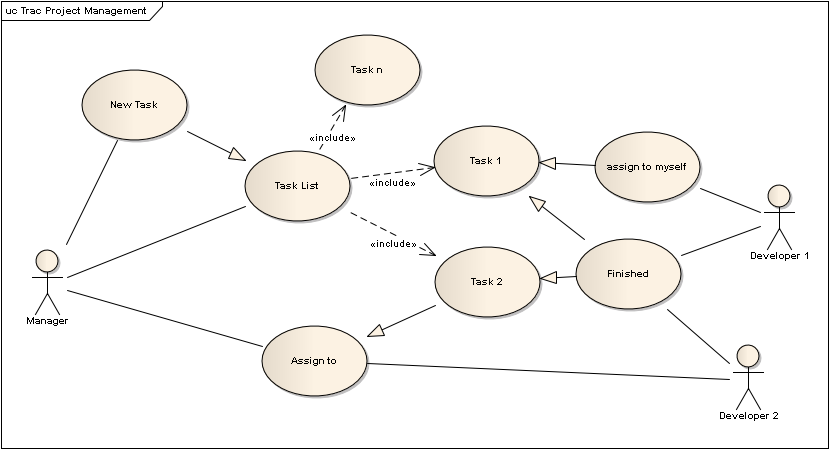
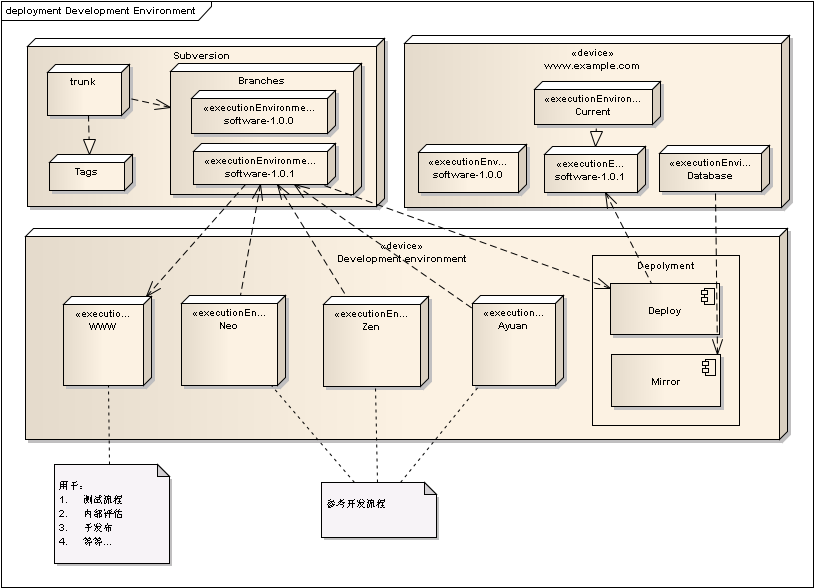
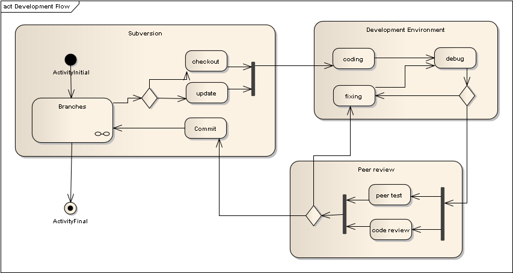
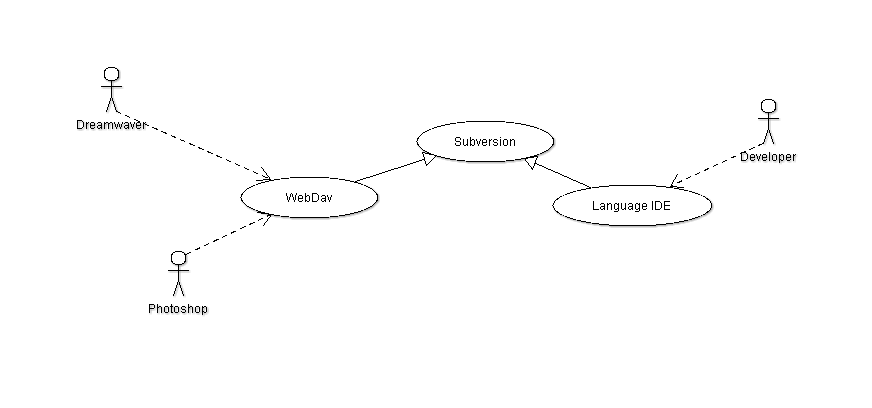
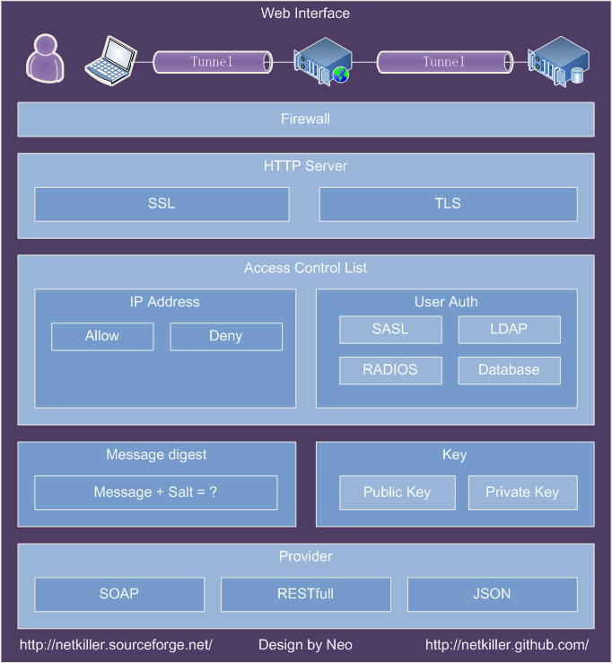

# 第 1 章 Developer & Programming language

## System programming language

A System programming language is usually used to mean "a language for system programming": that is, a language designed for writing system software as distinct from application software.

http://en.wikipedia.org/wiki/System_programming_language

## 编程语言热度排行榜

### TIOBE Programming 编程语言排行榜

TIOBE Programming Community Index - 编程语言排行榜[`www.tiobe.com/index.php/content/paperinfo/tpci/index.html`](http://www.tiobe.com/index.php/content/paperinfo/tpci/index.html)

### Programming Languages Reference Sheets - Hyperpolyglot

[`hyperpolyglot.org/`](http://hyperpolyglot.org/)

### DB-Engines - DB-Engines Ranking

[`db-engines.com/en/ranking`](http://db-engines.com/en/ranking)

### Web Framework Benchmarks

[`www.techempower.com/benchmarks/`](http://www.techempower.com/benchmarks/)

### The 10 hottest JavaScript framework projects

[The 10 hottest JavaScript framework projects](http://www.infoworld.com/d/application-development/the-10-hottest-javascript-framework-projects-228335?source=footer)

### 各种语言性能测试

[`benchmarksgame.alioth.debian.org/`](http://benchmarksgame.alioth.debian.org/)

### IDE 横向比较

[`en.wikipedia.org/wiki/Comparison_of_integrated_development_environments`](http://en.wikipedia.org/wiki/Comparison_of_integrated_development_environments)

### Top 10 Programming Languages

[`spectrum.ieee.org/computing/software/top-10-programming-languages`](http://spectrum.ieee.org/computing/software/top-10-programming-languages)

[IEEE Spectrum’s 2014 Ranking](http://spectrum.ieee.org/static/interactive-the-top-programming-languages#index/0/0/1/1/1/50/1/50/1/50/1/30/1/30/1/30/1/20/1/20/1/5/1/5/1/20/1/100/)

### PYPL PopularitY of Programming Language

[`pypl.github.io/PYPL.html`](http://pypl.github.io/PYPL.html)

### RedMonk 编程语言排行榜

[`redmonk.com/sogrady/`](http://redmonk.com/sogrady/)

### Developer Survey Results 2017

[`stackoverflow.com/research/developer-survey-2016`](http://stackoverflow.com/research/developer-survey-2016)

[`stackoverflow.com/insights/survey/2017#technology-most-loved-dreaded-and-wanted-languages`](https://stackoverflow.com/insights/survey/2017#technology-most-loved-dreaded-and-wanted-languages)

## 软件工程 (Software Engineering)



## Open Source and License

GPL 你可以免费使用，但修改后必须开源。

GPLv3 你可以免费使用，但修改后必须开源，不允许加入闭源商业代码。

BSD 你可以免费使用，修改后可不开源，基本上你可以我所欲为。

Linux 中有许多 BSD 代码，但 BSD 却不能移植 Linux 代码到 BSD 中，这是因为 GPL License。

http://www.apache.org/licenses/

## 项目运作


## 收集需求


## 标准与规范

### Release Notes

Release Notes 撰写说明

当一个项目升级时，需要写一个文档纪录这次变动，内容包括，新增了什么，更改了什么，修复了什么，未解决得问题，改善了什么，忽略了什么

常用信息类型

```

New
Changed
Fixed
Unresolved
Improved
Ignore

```

例 1.1. Example - Release Notes

```

NEW - xxxxxxxxxxxxx
CHANGED - xxxxxxxxxxxxx
FIXED - xxxxxxxxxxx
UNRESOLVED - xxxxxxxxx
IMPROVED - xxxxxxxxx

```

你也同样可以参考很多开源组织编写的 Release Notes，例如 apache, mysql, php 等等

### Project directory

一种很蠢目录规划：

```
			project
			project/library
			project/log
			project/tmp
			project/...

```

目录规划原则，临时文件分离，日志分离，配置文件分离;这样有利于在负载均衡环境中克隆节点。

*   项目目录/workspace/project

*   临时目录 /workspace/tmp/

*   日志 目录/workspace/log/

*   配置文件/workspace/conf

### 版本控制及如何运作

#### 版本库布局

版本库布局

1.  trunk
2.  branches
3.  tags
4.  releases

多项目版本库布局

```

		 	                   /-> branches
		       .---> project 2 ---> trunk
		      / 	           \-> tags
		     /
		    /					/-> branches
repositories -------> project 1 ---> trunk
			\ 					\-> tags
			 \
			  \ 			   /-> branches
			   `---> project 3 ---> trunk
				               \-> tags

```

#### 策略

trunk 主干，作为主干你要保证他的代码是可运行的。

branches 分支，代码来自主干，可以有很多分支，分支用于多个团队同步开发，最终要将代码合并到主干。例如：branches/member, branches/blog, branches/shop 分别来自不同的团队

tags 一般用于做快照，一旦建立永不更改

releases 发行本版，代码来自主干， 与 tags 功能一样，命名更直观。例如每个月为一个周期，发布一次代码 releases/v1.0, releases/1.5

```

                          .-----------------------------------------------------------------------> cart r100 ---> ...
                         /		                                                                          ^
                        .----------------------> blog r3 ---> r4 ... ... r(10) ---> r(n) ---> r(...) --->/---> ...
                       /		                   ^                        \                           /
               .-> branches r1  ---> member r2 ---/---------> r4 ... r(10) --\----> r(14) ---> r(...)--/---> ...
              /                       ^          /                \           \         \             /
repositories ----> trunk    r1  -----/----------/--------------> r(11) ---> r(12) ---> r(15) ---> r(...) ---> ...
              \	                                                                \         \          \
               `-> tags     r1  ------------------------------------------> v1.0.0 r(13)   \          \
                       \                                                                               \
                        `--------------------------------------------------------------> v1.0.1 (r16)   \
                         `--------------------------------------------------------------------------> v1.0.2 r(n)

```

```

                                                                            .> unstable 2.1.1
                          		                                           / \
                                              unstable 1.1           unstable 2.1     unstable 3.1
                        		                  ^ \                     ^ \         / \
               .-> branches ---> unstable 1.0 ---/   \   unstable 2.0 ---/   \   unstable 3.0    unstable---> ...
              /                      ^                \            ^          \      ^    \          ^
repositories ----> trunk    --------/-----------------> stable ---/-----> stable ---/---> stable ---/-> stable ---> ...
              \	                                       \                     \              \
               `-> tags     ----------------------------> stable 1.0          \              \
                       \                                                       \              \
                        `-------------------------------------------------------> stable 2.0   \
                         `-------------------------------------------------------------------> stable 3.0

```

怎样访问版本库



美工、页面人员采用 WebDav 访问 Subversion。Photoshop,Dreamwaver 软件对 WebDav 有很好地支持，他们不需要学习如何使用 Subversion。

开发者通过 Svn 客户端访问代码库，既可以使用开发 IDE 集成工具也可以使用单独工具。像 TortoiseSVN 等等。

#### nightly version

每天晚上做一个快照

#### rc1,rc2,rc4

#### 怎样写注释信息

##### Fixed Bug

```
				svn ci -m "- Fixed bug #53412 (your comment)"

```

##### Implemented

```
				svn ci -m "- Implemented FR #53271, FR #52410 (Building multiple XXXX binary)"

```

##### Add

```
				svn ci -m "- Add Feature #534 (your message)"

```

### 代码审查

Code Review

一对一代码审查可以提高程序质量.

```

developer neo ---> coding ---> commit --->.
                           /               \
developer zen ---> review '                 \
                                           --->  svn repos
developer neo ---> review .                 /
                           \               /
developer zen ---> coding ---> commit --->`

```

#### Coding workflow

|  |

### Redis Key

Redis Key 使用“：”分割例如

```
set SMS:CAPTCHA 1234

```

### 错误编码

格式 ABCD

A: 编码

1 用户错误

2 网络错误

3 系统错误

4 应用服务器错误

5 应用程序错误

6 缓存错误

7 数据库错误

8 搜索引擎

B 编码

0 成功

1 失败

剩余 C D 用户自行编码

### HTML 标准

#### 校验

```
https://html5.validator.nu/?doc=https%3A%2F%2Fwww.netkiller.cn%2Findex.html	

```

#### XHTML/HTML

#### CSS

#### Script

### 编码风格

```
https://code.google.com/p/google-styleguide/
http://lxr.linux.no/linux/Documentation/CodingStyle
http://perldoc.perl.org/perlstyle.html
http://www.gnu.org/prep/standards/

```

#### java 编程规范

##### Spring Data JPA

```

	@Autowired
	private TableRepostitory tableRepostitory;

	@Autowired
	private JdbcTemplate jdbcTemplate;

	@PersistenceContext 
	private EntityManager entityManager; 

```

#### php 文件

http://www.php-fig.org

##### 格式与 编码

使用 UNIX 风格换行, 请在你的编辑器内调整

```
UNIX (LF 或"\n")
MAC OS (CR 或"\r")
Windows CRLF \r\n

```

源码文件使用 UTF-8

有些 IDE 环境 UTF-8 BOM

##### 循环嵌套

if, while, for, foreach, do ... loop, switch... 等的嵌套必须小于等于 3 层

如下面的例子，可读性极差。

```
if (xxx){
	if (xxx){
		if(xxx){
			if(xxx){
				if(xxx){

				}
			}
		}
		if(xxx){
			if(xxx){
			}
		}
	}
	if (xxx){
		if(xxx){
			if(xxx){
			}
		}
		if(xxx){
			if(xxx){
			}
		}
	}
}

```

加以改造

```
func aaa(p){
	if(p){
		if(xxx){
		}
	}
}
func bbb(b){
	if(b){
		if(xxx){
			if(xxx){

			}
		}
	}
}

if(xxx){
	aaa(xxx)
}
if(b){
	bbb(b)
}			
```

##### 取出行尾的空格以及多余的换行符

一个空格占用一个字节,换行符 Window 是两个字节\r\n, Unix 与 Mac 占用一个字节

##### php 标签

禁止这样使用

```

<?
...
?>

```

正确的使用方法

```

<?php
...

or

<?php
...
?>

```

##### 头部注释

```

<?php
/**
 * Project Name
 *
 * @author     $Author: netkiller $
 * @copyright  Copyright (c) 2012 Company
 * @version    $Id: chapter.coding.xml 584 2013-05-15 05:13:17Z netkiller $
 */

<?php
/**
 * Project Name
 *
 * @author     $Author: netkiller $
 * @license    GNU General Public License 2.0
 * @version    $Id: chapter.coding.xml 584 2013-05-15 05:13:17Z netkiller $
 */

```

#### String

双引号要处理字符串转义，性能上不如单引号，如果你不需要转义字符串，或者字符串中不含原转译字符，建议你使用单引号

```
print("string")

```

每次输出会检索特殊字符串如： \r, \n, \t, \0xFF 等等

```
print('string')

```

#### Database

使用 pdo_mysql 替代 mysql

错误的写法，通过字符串链接拼接 sql 语句极容易出现注入漏洞

```
$sql = "select * from table where id=".$id;
$sql = "select * from table where id='".$id."'";
$sql = "INSERT INTO fruit(name, colour) VALUES ('".$name."', '".$colour."')";

```

正确的写法

```
$sql = "select * from table where id=?";
$sql = "INSERT INTO fruit(name, colour) VALUES (?, ?)";

```

```

$sql = <<<____SQL
     CREATE TABLE IF NOT EXISTS `ticket_hist` (
       `tid` int(11) NOT NULL,
       `trqform` varchar(40) NOT NULL,
       `trsform` varchar(40) NOT NULL,
       `tgen` datetime NOT NULL,
       `tterm` datetime,
       `tstatus` tinyint(1) NOT NULL
     ) ENGINE=ARCHIVE COMMENT='ticket archive';
____SQL;

```

##### 结果集使用注意事项

返回数据库查询结果有几种形式

数组形式

```

Array
(
    [0] => banana
    [1] => yellow
)

Array
(
    [NAME] => banana
    [COLOUR] => yellow
)

```

对象形式

```
Object
(
	Obj->NAME
	Obj->COLOUR
)

```

正确的使用方式

```
print($row[name])
print($row->name)

```

错误的使用使方式

```
print($row[0])

```

避免使用 "*"查询，一会影响性能，二增加带宽开销

```
$sql = "select * from tab where status=0 limit 1";

```

如果程序使用$row[1]读取结果，有可能当数据库结构改变，增加字段，字段顺序发生变化，输出数据都会出错

##### 索引

下面的例子，不会使用索引

```
$sql = "select id, name, created from tab where id != 100";

```

```
EXPLAIN select * from members where id != '1010';			索引失效
EXPLAIN select count(*) from members where id != '1010';	索引有效

```

##### 缓存

下面的例子，数据不会缓存查询结果

```
$sql = "select id, name, created from tab where created=now()";

```

### 安全

#### Interface



#### SQL 注入

## 第 2 章 Editor

*   vi

    vi file

*   emacs

    emacs

*   nano/pico

    nano file / pico file

*   joe

    joe file

    ```
    sudo apt-get install joe
    ```

### VIM

|  |

Vi IMproved - enhanced vi editor (transitional package)

```

sudo apt-get install vim-perl vim-python vim-latexsuite

```

#### New text file line delimiter

```

:set ff
:set ff=dos
:set ff=unix
:set ff=mac

```

#### vim 中的出现^M

```

sudo apt-get install tofrodos
dos2unix

```

输入

```
:set notextmode		

```

#### tab 符

```

set expandtab tabstop=4 shiftwidth=4 softtabstop=4 foldmethod=marker

```

#### 粘贴是禁用格式化功能

:set paste

#### Regular Expressions

##### search & replace

```
%s/neo/leo/g
%s#/logs#/www#g

```

##### 会去掉 vim 文件中的空白行

```

:%s/^\s*\n/

```

#### 大小写转换

将光标移动到想要大小写转换的地方然后键入

guw (大写转换成小写)

gUw (小写转换成大写)

g~w (是改变光标到词尾)

guu gUU g~~ (是改变一行)

#### split

```

:split <filename> 	按拆分模式打开文件，默认为上下拆分
:vsplit <filename>	左右拆分

```

Ctrl-w w

切换活动窗口

Ctrl-w Ctrl-w

同上

Ctrl-w h/j/k/l

切换活动窗口为 左/上/下/右 边的窗口

:q

关闭光标所在的分屏

#### vimrc

```

neo@netkiller:~$ cat /home/neo/.vimrc
set expandtab tabstop=4 shiftwidth=4 softtabstop=4 foldmethod=marker
set paste
set ruler
set number
set nocp " don't open Vim in Vi-compatible mode
set bs=2 " setup backspace to delete previous char in insert mode
set encoding=utf-8 fileencodings= " set UTF-8 for all files
set autoindent
set smartindent
set t_Co=256
syntax on
set syntax=tt2html
set hlsearch
colorscheme elflord

```

#### vimdiff - edit two or three versions of a file with Vim and show differences

```
# vimdiff  FILE_LEFT  FILE_RIGHT
# vim -d  FILE_LEFT  FILE_RIGHT

```

```
# vim FILE_LEFT
:vertical diffsplit FILE_RIGHT

```

##### 光标移动

左右窗口联动控制

```
:set scrollbind
:set noscrollbind

```

在各个差异点之间快速移动。

```
]c	跳转到下一个差异点
[c	跳转到上一个差异点

```

如果在命令前加上数字的话，可以跳过一个或数个差异点，从而实现跳的更远。比如如果在位于第一个差异点的行输入"2]c"，将越过下一个差异点，跳转到第三个差异点。

##### 文件合并

```

文件比较的最终目的之一就是合并，以消除差异。如果希望把一个差异点中当前文件的内容复制到另一个文件里，可以使用命令
dp （diff "put"）

如果希望把另一个文件的内容复制到当前行中，可以使用命令
do (diff "get"，之所以不用 dg，是因为 dg 已经被另一个命令占用了)

如果希望手工修改某一行，可以使用通常的 vim 操作。如果希望在两个文件之间来回跳转，可以用下列命令序列：
Ctrl-w, w

在修改一个或两个文件之后，vimdiff 会试图自动来重新比较文件，来实时反映比较结果。但是也会有处理失败的情况，这个时候需要手工来刷新比较结果：
:diffupdate

如果希望撤销修改，可以和平常用 vim 编辑一样，直接
<ESC>, u

但是要注意一定要将光标移动到需要撤销修改的文件窗口中。

```

##### 上下文

```
上下文的展开和查看
比较和合并文件的时候经常需要结合上下文来确定最终要采取的操作。Vimdiff 缺省是会把不同之处上下各 6 行的文本都显示出来以供参考。其他的相同的文本行被自动折叠。如果希望修改缺省的上下文行数，可以这样设置：
:set diffopt=context:3

可以用简单的折叠命令来临时展开被折叠的相同的文本行：
zo （folding open，之所以用 z 这个字母，是因为它看上去比较像折叠着的纸）

然后可以用下列命令来重新折叠：
zc （folding close）

```

##### 保存于退出

```
同时操作两个文件
在比较和合并告一段落之后，可以用下列命令对两个文件同时进行操作。比如同时退出：
:qa （quit all）

如果希望保存全部文件：
:wa （write all）

或者是两者的合并命令，保存全部文件，然后退出：
:wqa （write, then quit all）

如果在退出的时候不希望保存任何操作的结果：
:qa! （force to quit all）

```

#### vim backup script

```

#!/bin/bash
########################################
# vim script for automatic backup by neo
########################################

datetime=`date +"%Y-%m-%d.%H:%M:%S"`
current_date=`date +"%Y-%m-%d"`
current_time=`date +"%H:%M:%S"`
filename=`basename $1`
original=$1

if [ -f ${original}.original ]
then
    echo "[${datetime}] [B] ${original} to ${original}.original" >> ~/backup/history.log
else
    cp ${original} ${original}.original
fi

if [ -d ~/backup/${current_date} ]
then
    echo "[${datetime}] [O] ${original}" >> ~/backup/history.log
else
    mkdir -p ~/backup/${current_date}
    echo [${datetime}] [C] mkdir ~/backup/${current_date} >> ~/backup/history.log
fi

backup=~/backup/${current_date}/${filename}.${current_time}
if [ -f ${original} ];
then
    cp ${original} ${backup}
    echo "[${datetime}] [B] ${original} to ${backup}" >> ~/backup/history.log
fi

vim ${original}

datetime=`date +"%Y-%m-%d.%H:%M:%S"`
current_date=`date +"%Y-%m-%d"`
current_time=`date +"%H:%M:%S"`
newfile=~/backup/${current_date}/${filename}.${current_time}

if [ -f ${original} ];
then
    if [ -f ${backup} ];
    then
        original_sha=`sha1sum ${backup} |awk -F ' ' '{print $1}'`
        newfile_sha=`sha1sum ${original} |awk -F ' ' '{print $1}'`

        if [ $original_sha = $newfile_sha ];
        then
            echo "[${datetime}] --- " >> ~/backup/history.log
            exit
        fi

    fi
    cp ${original} ${newfile}
    echo "[${datetime}] [M] ${original}" >> ~/backup/history.log
    echo "[${datetime}] [B] ${original} to ${newfile}" >> ~/backup/history.log

fi
echo "[${datetime}] --- " >> ~/backup/history.log
exit

```

### Eclipse

```

Window-Perferenes-General-Keys

Remove Trailing Whitespace

```

#### AnyEdit

http://andrei.gmxhome.de/anyedit/

Remove trailing whitespace:

Window -> Preferences -> PHP -> Editor -> Save Actions

[v] Remove trailing whitespace

() All lines (o) Ignore empty lines

AnyEdit tools plugin for Eclipse

#### Eclim

[`eclim.org/index.html`](http://eclim.org/index.html)

安装 Eclim

```
java -jar eclim_1.7.0.jar

```

#### Vrapper

Eclipse 的 VIM 插件

http://vrapper.sourceforge.net/home/

### Komodo Edit

http://www.activestate.com/komodo_edit/

### Syntext Serna Free

http://www.syntext.com/downloads/serna-free/

### SciTE

http://www.scintilla.org/

```
$ apt-cache search SciTE
scite - Lightweight GTK-based Programming Editor
sciteproj - project manager for the SciTE editor

```

## 第 3 章 Comparison, merge and patch utilities

### comparison, merge

sdiff

```
neo@netkiller:/tmp$ sdiff file1 file2
#!/bin/bash                                                     #!/bin/bash
echo "Helloworld"                                             | echo "Helloword"
echo "Line 1"                                                   echo "Line 1"

```

vimdiff

```
$ vimdiff file1 file2

```

### patch - apply a diff file to an original

diff

-r 是一个递归选项，设置了这个选项，diff 会将两个不同版本源代码目录中的所有对应文件全部都进行一次比较，包括子目录文件。

-N 选项确保补丁文件将正确地处理已经创建或删除文件的情况。

-u 选项以统一格式创建补丁文件，这种格式比缺省格式更紧凑些。

patch

-p0 选项要从当前目录查找目的文件（夹）

-p1 选项要忽略掉第一层目录，从当前目录开始查找。

-E 选项说明如果发现了空文件，那么就删除它

-R 选项说明在补丁文件中的“新”文件和“旧”文件现在要调换过来了（实际上就是给新版本打补丁，让它变成老版本）

例 3.1. single file

make a patch file

```
$ diff -uN file.old file.new > file.patch

```

take a patch file

```

$ patch -p0 < file.patch

```

例 3.2. a lot of file or directory

```
$ diff –uNr dir.old dir.new >my.patch

```

```

$ patch -p1 < file.patch

```

### WinMerge

http://winmerge.org/

开源，一般化

### Beyond Compare Pro

最好用的文件比较合并工具