# 第 1 章 FreeBSD Install

## Welcome

| 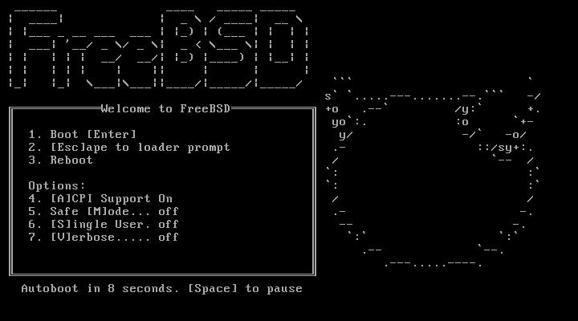 |

回车即可

| 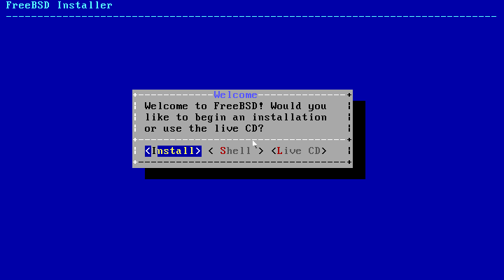 |

选择 Install 按钮后回车

| 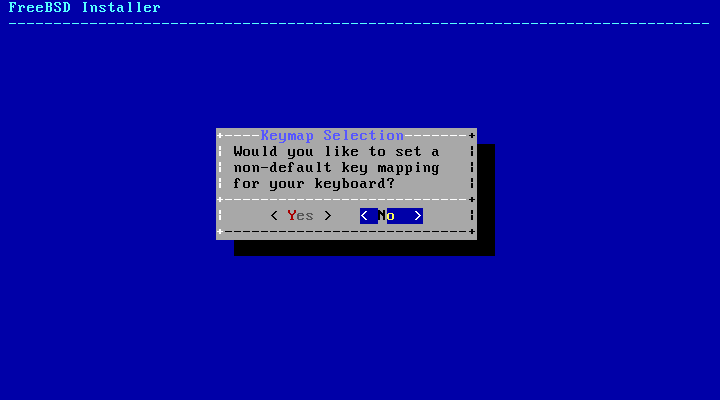 |

选择 No

| 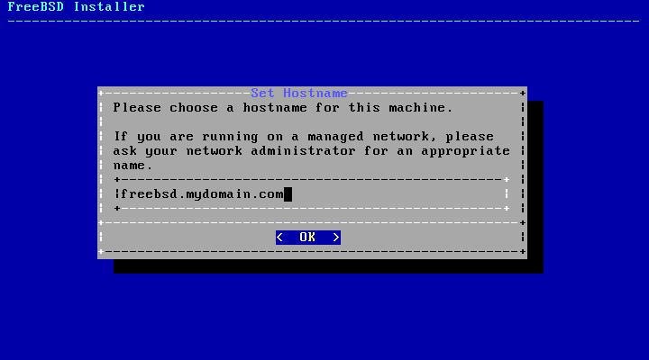 |

输入 Hostname

## partitioning

| 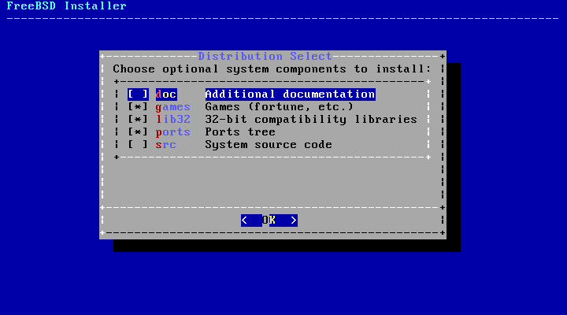 |

回车即可

| 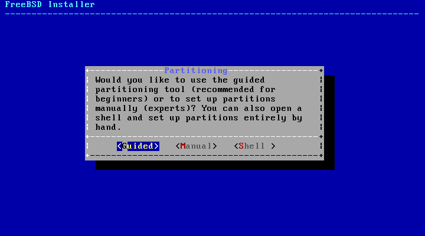 |

选择 Guided

| 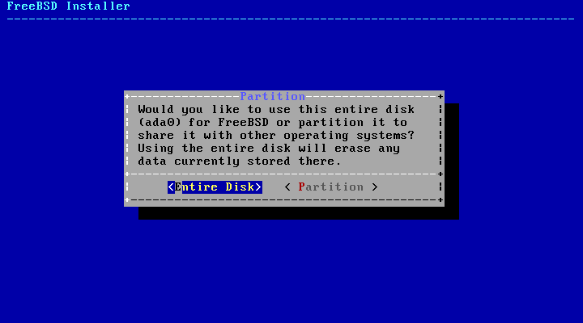 |

选择 Entire Dist 便是使用整个磁盘，

| 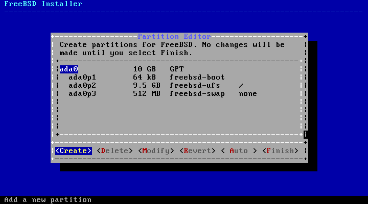 |

使用光标键移动按钮到 Auto 然后回车，表示自动分区

| 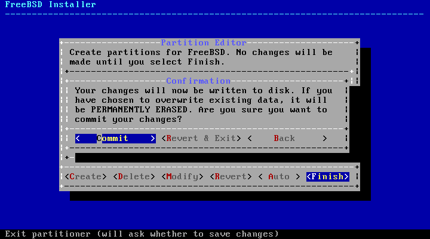 |

选择 Finish 回车，完成分区设置

再选择 Commit 确认，最后就会格式化磁盘

| 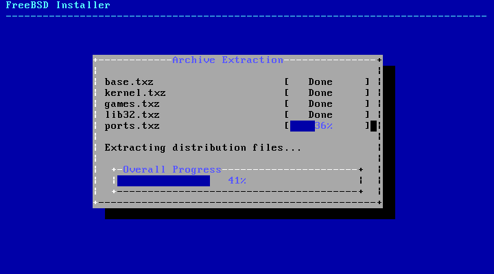 |

开始安装

## password

| 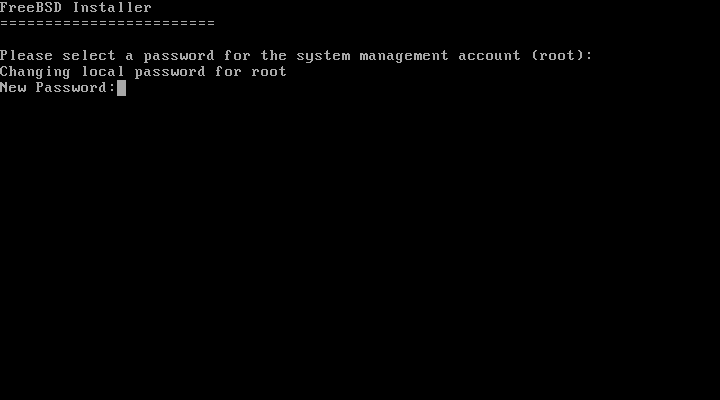 |

设置 root 密码

| 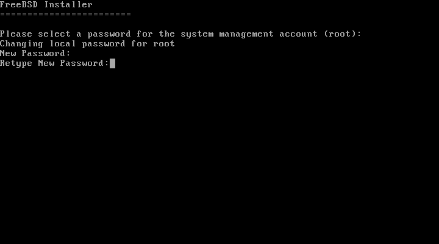 |

确认密码，再输入一次

## network

| 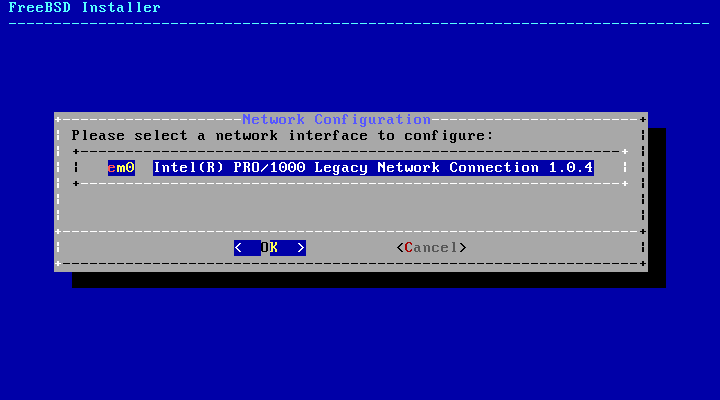 |

网络接口选择，这是只有一个网卡，如果你有多个网卡，这里应该是一个选择列表

| 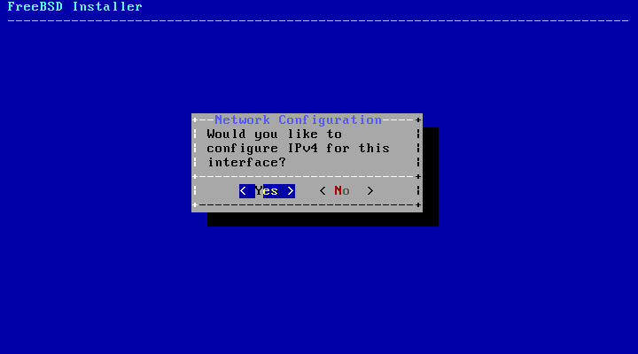 |

问你是否开启 IPv4 选 Yes

|  |

问题是否使用 DHCP 获取 IP 地址。这里选择 No

| 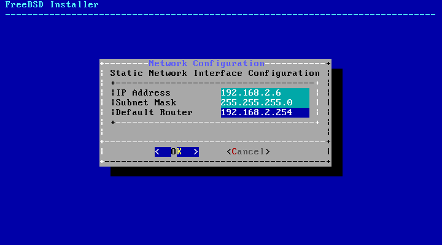 |

输入 IP 地址，子网掩码，网关

| 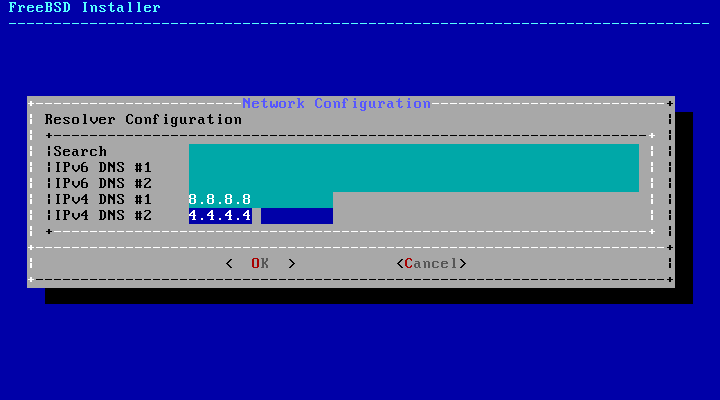 |

设置 DNS 服务器

## timezone

| 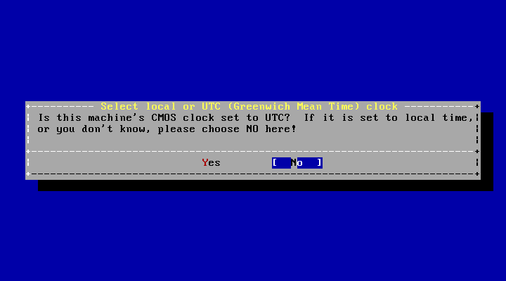 |

问你是否使用 UTC 时间，选择 No

| 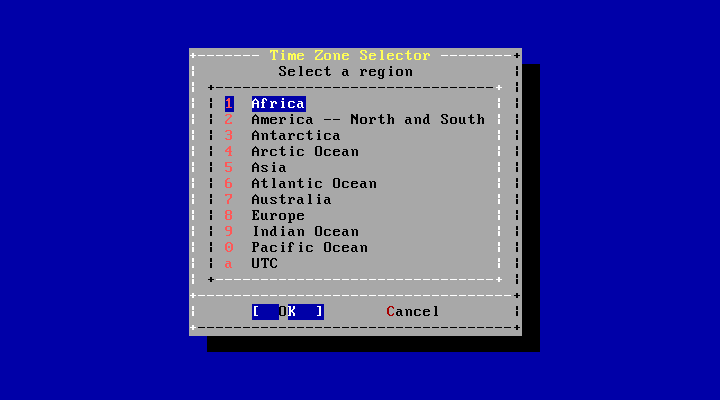 |

选择时区，我一般使用 Hongkong 或者 Harbin

| 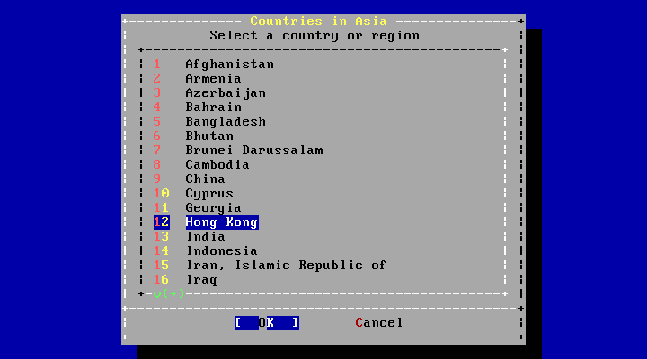 |

回车

| 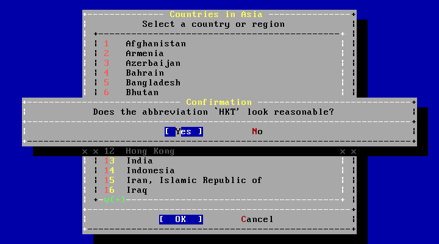 |

选择 Yes

## complete

额外的软件包安装

| 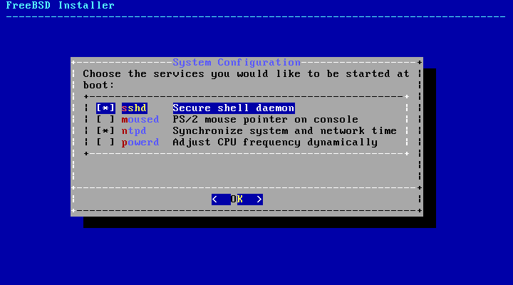 |

sshd 当然需要，还有 ntpd, moused 也不错可以在控制台上使用鼠标，可以快速复制粘贴控制台上的内容。

| 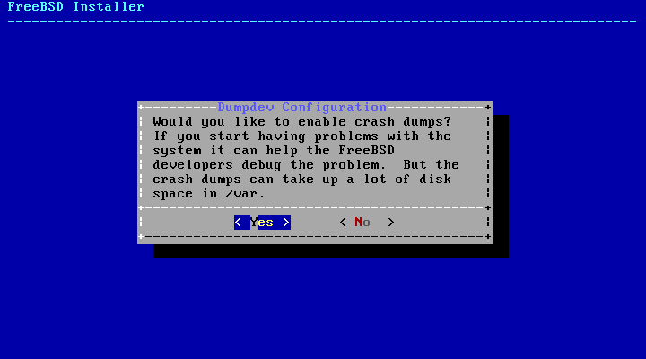 |

对于普通用户，这个基本用不到 No

| 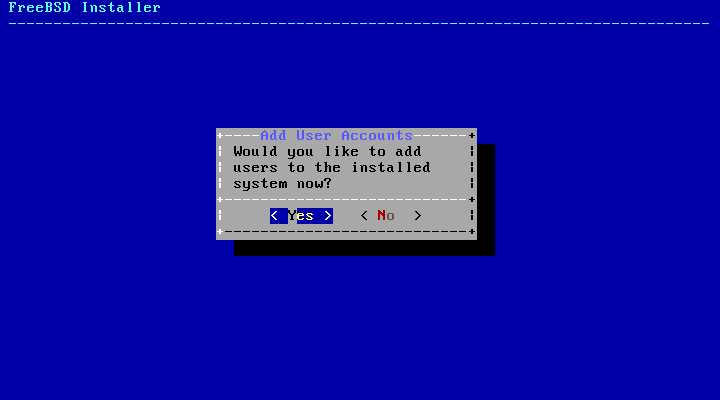 |

添加一个普通帐号，选择 Yes

| 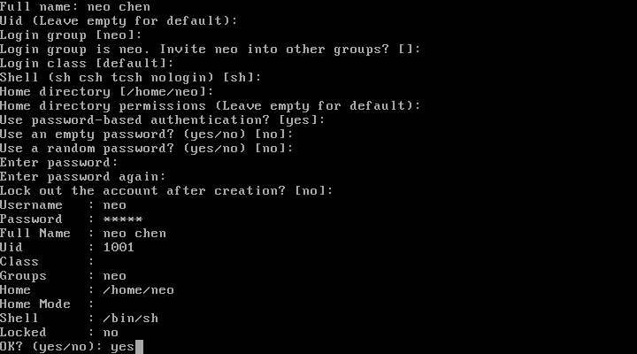 |

根据提示输入即可

| 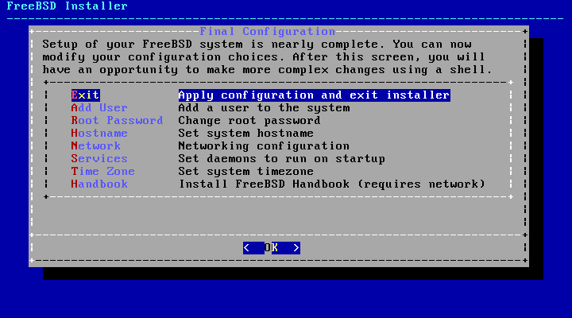 |

到此 FreeBSD 安装完成，如果你想修改前面那些配置可以在这里修改。这个界面让很多菜鸟搞得蒙头转向，挑不出安全程序，一边又一遍的安装 FreeBSD. 这里你放心的 Exit 菜单上回车即可。

| 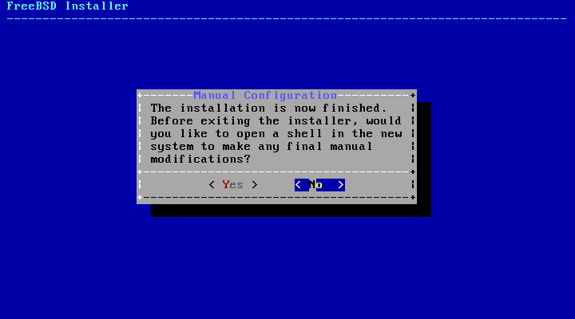 |

选择 Yes 回车

| 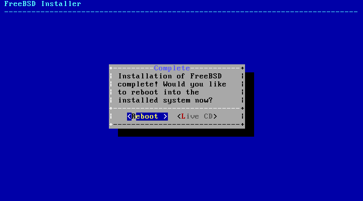 |

选择 Reboot 回车

## FreeBSD 初始化设置

刚刚添加了一个 neo 用户，但这个用户并不能 su - root， 默认配置下 FreeBSD 在安全性方面做得比 Linux 好很多，你需要做下面的操作将 neo 添加到 wheel 组才能使用 su 命令

```
# pw usermod neo -G wheel
# id neo
uid=1001(neo) gid=1001(neo) groups=1001(neo),0(wheel)

```

## sysinstall，bsdinstall 与 bsdconfig 工具

### 从 FreeBSD 10 开始 sysinstall 被 bsdinstall 与 bsdconfig 所替代

例如安装 FreeBSD src 源码包

```
sysinstall -> Configure -> Distributions -> src -> ALL -> Install from a FreeBSD CD/DVD

```