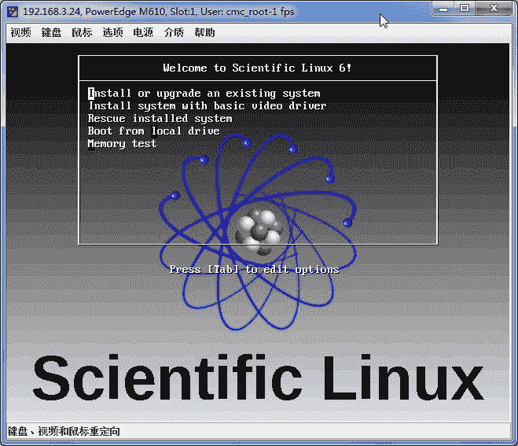
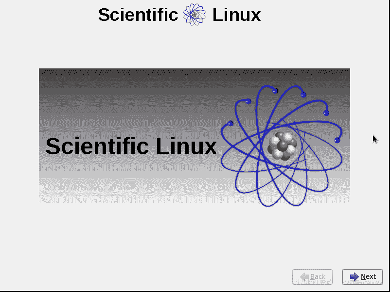
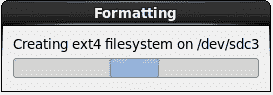

# 第 1 章 Introduction

## 1. Linux 发行版本

下面是我常用的 Linux 本版，Debian/Ubuntu 适合做实验，快速安装定制，Gentoo 适合 DIY

如果是企业服务器还是建议使用 CentOS，Scientific Linux， 所以 CentOS 是 IDC 装机量怎大的操作系统。

### 1.1. Linux 下载排名

[`distrowatch.com/`](http://distrowatch.com/)

### 1.2. Debian 衍生版本

Ubuntu Server Edition[`www.ubuntu.com/`](http://www.ubuntu.com/)

Netkiller Ubuntu Linux 手札

### 1.3. Redhat 衍生版本

CentOS - The Community ENTerprise Operating System

[`www.centos.org/`](http://www.centos.org/)

Scientific Linux (SL)

[`www.scientificlinux.org/`](http://www.scientificlinux.org/)

Netkiller CentOS Linux 手札

### 1.4. FreeBSD 包风格的 Linux 发行版

Gentoo

http://www.gentoo.org/

## 第 2 章 Linux 专用领域发行版

这些 Linux 都是为了特别用途而优化过的，例如处理音频，视频等等

### 1. ubuntustudio

```
$ apt-cache search ubuntustudio
plymouth-theme-ubuntustudio - Ubuntu Studio Plymouth theme
ubiquity-slideshow-ubuntustudio - Ubiquity slideshow for Ubuntu Studio
ubuntustudio-audio - Transitional Package for the Audio Seed
ubuntustudio-audio-plugins - Ubuntu Studio audio plugins Package
ubuntustudio-controls - Ubuntu Studio Controls is a small app that changes A/V settings.
ubuntustudio-default-settings - default settings for the Ubuntu Studio desktop
ubuntustudio-desktop - Ubuntu Studio Desktop Package
ubuntustudio-font-meta - Ubuntu Studio fonts Package
ubuntustudio-generation - Ubuntu Studio Audio Generation Package
ubuntustudio-graphics - Ubuntu Studio graphics Package
ubuntustudio-icon-theme - Ubuntu Studio Icon Theme
ubuntustudio-lightdm-theme - UbuntuStudio LightDM theme
ubuntustudio-live-settings - configuration for the Ubuntu Studio live-dvd
ubuntustudio-look - Ubuntu Studio look
ubuntustudio-menu - Menu for Ubuntu Studio
ubuntustudio-recording - Ubuntu Studio Audio Recording Package
ubuntustudio-screensaver - Ubuntu Studio screensaver
ubuntustudio-sounds - Ubuntu Studio's GNOME audio theme
ubuntustudio-video - Ubuntu Studio video Package
ubuntustudio-wallpapers - Ubuntu Studio - Wallpapers

```

### 2. AV Linux

http://www.bandshed.net/AVLinux.html

## 2. CentOS 8

Centos 8 较之前的版本改动比较大

CentOS 有两个发行版

*   CentOS stream：滚动发布的 Linux 发行版，适用于需要频繁更新的开发者
*   CentOS：类似 RHEL 8 的稳定操作系统，系统管理员可以用其部署或配置服务和应用

下载 ISO 文件你会发现只有 boot 和 dvd1，boot 是网络安装，而 DVD1 差不多 8G，估计你的手上没有 DVD9 光盘，普通 DVD 光盘是 D5 只有 4.7G，那么怎么安装呢，使用 U 盘。

将 ISO 文件烧录到 U 盘中，方法如下。

```

neo@MacBook-Pro-Neo ~/Downloads % sudo dd if=CentOS-Stream-x86_64-dvd1.iso of=/dev/disk2 bs=1m
Password:
dd: /dev/disk2: end of device
7581+0 records in
7580+1 records out
7948210176 bytes transferred in 1500.898226 secs (5295636 bytes/sec)

```

我手上并没有大容量 U 盘，我是用 USB 读卡器+8GB TF 卡。

使用 dd 命令将 ISO 写入 U 盘后，使用 U 盘启动电脑就可以安装了。

表 1.1. Linux server partition

| volume | size |
| --- | --- |
| /boot | 300M |
| / | 30G |
| /var | 50G |
| /opt | remainder |
| swap | memory * 2 |

表 1.2. Linux desktop partition

| volume | size |
| --- | --- |
| /boot | 300M |
| / | 30G |
| /var | 50G |
| /home | remainder |
| swap | memory * 2 |

## 3. 早起版本

### Getting Started Guides

### 3.1. Scientific Linux

|  |

|  |

|  |

|  |

|  |

|  |

|  |

|  |

|  |

|  |

|  |

|  |

|  |

|  |

|  |

|  |

|  |

|  |

|  |

|  |

|  |

### 3.2. Redhat Linux

|  |

|  |

|  |

|  |

|  |

|  |

|  |

|  |

|  |

|  |

|  |

|  |

|  |

|  |

|  |

|  |

|  |

|  |

|  |

|  |

|  |

|  |

|  |

|  |

### 3.3. CentOS 6

|  |

|  |

|  |

|  |

|  |

|  |

|  |

|  |

|  |

|  |

|  |

|  |

|  |

|  |

|  |

|  |

|  |

|  |

|  |

|  |

|  |

|  |

|  |

|  |

|  |

### 3.4. 5.x 减肥

卸载无用的包

```
yum remove NetworkManager
yum remove avahi
yum remove cups
yum remove bluez-gnome bluez-utils bluez-libs
yum remove isdn4k-utils

```

### 3.5. 6.x Mini 安装后需要做的一些事

禁用防火墙与 SELinux

```
lokkit --disabled --selinux=disabled

```

```
yum remove dhclient -y

```

```
yum update -y
yum install -y telnet wget rsync
yum install -y openssh-clients
yum install -y system-config-network-tui
yum install -y bind-utils
yum install -y vim-enhanced

```