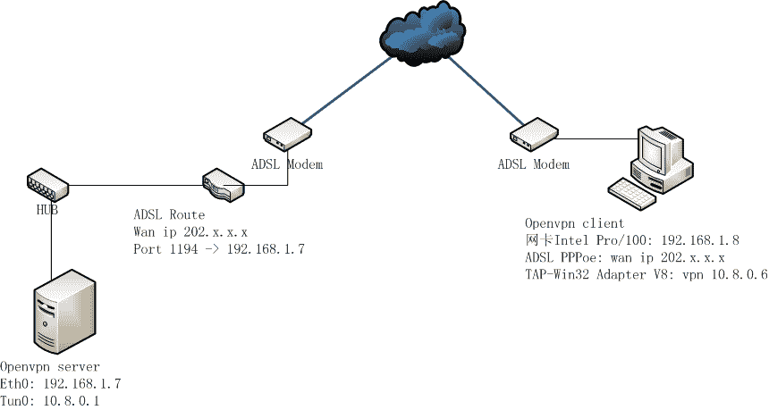

# 部分 III. Network Application

## 1. tc - show / manipulate traffic control settings

### 1.1. 模拟网络丢包

```

tc qdisc add dev eth0 root netem corrupt 0.2% loss 10%		

```

## 第 30 章 Networking 网络管理

### 1. hosts

```

# cat -n /etc/hosts
     1  # Do not remove the following line, or various programs
     2  # that require network functionality will fail.
     3  127.0.0.1               development.domain.org development netkiller.localdomain netkiller
     4  ::1             localhost6.localdomain6 localhost6

```

#### 1.1. /etc/hostname

```
# cat /etc/hostname
web1.example.com

```

查看 IP 地址

```

[root@localhost ~]# hostname --ip-address
::1 127.0.0.1			

```

#### 1.2. hostnamectl - Control the system hostname

```
[root@netkiller ~]# hostnamectl
   Static hostname: netkiller.localdomain
         Icon name: computer-desktop
           Chassis: desktop
        Machine ID: 072e88a0fdd2447296554f3cd5129076
           Boot ID: a978056f50544355abd723b328a89b6f
  Operating System: CentOS Linux 7 (Core)
       CPE OS Name: cpe:/o:centos:centos:7
            Kernel: Linux 3.10.0-229.el7.x86_64
      Architecture: x86_64

```

设置 hostname

```

[root@netkiller ~]# hostnamectl set-hostname master

```

#### 1.3. /etc/host.conf

解析顺序配置文件

```
[root@development bin]# cat /etc/host.conf
order hosts,bind

```

首先在/etc/hosts 文件中寻找，如果不存在，再去 DNS 服务器中寻找

#### 1.4. /etc/hosts

IP 地址后面 TAB 符，然后写主机地址

```
127.0.0.1       localhost.localdomain localhost
::1             localhost6.localdomain6 localhost6
192.168.1.10	development.example.com development

```

#### 1.5. hosts.allow / hosts.deny

/etc/hosts.allow 和 /etc/hosts.deny

许可 IP／禁止 IP，相当于黑白名单

#### 1.6. /etc/resolv.conf

```

search example.com
nameserver 208.67.222.222
nameserver 208.67.220.220

```

### 2. Hostname

### 3. Network adapter 网络适配器

**ethtool eth1**

```
neo@shenzhen:~/doc/Linux/xhtml$ sudo ethtool eth1
Settings for eth1:
        Supported ports: [ TP MII ]
        Supported link modes:   10baseT/Half 10baseT/Full
                                100baseT/Half 100baseT/Full
        Supports auto-negotiation: Yes
        Advertised link modes:  10baseT/Half 10baseT/Full
                                100baseT/Half 100baseT/Full
        Advertised auto-negotiation: Yes
        Speed: 100Mb/s
        Duplex: Full
        Port: MII
        PHYAD: 32
        Transceiver: internal
        Auto-negotiation: on
        Supports Wake-on: pumbg
        Wake-on: d
        Current message level: 0x00000007 (7)
        Link detected: yes

```

**mii-tool**

```
neo@shenzhen:~/doc/Linux/xhtml$ sudo mii-tool
eth1: negotiated 100baseTx-FD, link ok

```

#### 3.1. 接口名称

Linux 网卡默认接口名称是 eth0，如果你想定义其他名称可以更改下面文件。

/etc/udev/rules.d/70-persistent-net.rules

```
cat /etc/udev/rules.d/70-persistent-net.rules

# This file maintains persistent names for network interfaces.
# See udev(7) for syntax.
#
# Entries are automatically added by the 75-persistent-net-generator.rules
# file; however you are also free to add your own entries.

# PCI device 0x10ec:0x8136 (r8169)
SUBSYSTEM=="net", ACTION=="add", DRIVERS=="?*", ATTR{address}=="00:1d:92:f0:37:58", ATTR{dev_id}=="0x0", ATTR{type}=="1", KERNEL=="eth*", NAME="eth0"

```

双网卡实例

```
# cat /etc/udev/rules.d/70-persistent-net.rules
# This file was automatically generated by the /lib/udev/write_net_rules
# program, run by the persistent-net-generator.rules rules file.
#
# You can modify it, as long as you keep each rule on a single
# line, and change only the value of the NAME= key.

# PCI device 0x8086:0x10d3 (e1000e)
SUBSYSTEM=="net", ACTION=="add", DRIVERS=="?*", ATTR{address}=="00:25:90:35:91:36", ATTR{type}=="1", KERNEL=="eth*", NAME="eth0"

# PCI device 0x8086:0x10d3 (e1000e)
SUBSYSTEM=="net", ACTION=="add", DRIVERS=="?*", ATTR{address}=="00:25:90:35:91:37", ATTR{type}=="1", KERNEL=="eth*", NAME="eth1"

```

### 4. Ethernet Interfaces 以太网接口

restart

```
sudo /etc/init.d/networking restart

```

#### 4.1. ifquery

```
$ sudo ifquery --list
lo
eth0
eth1

```

#### 4.2. DHCP

DHCP

```
sudo vi /etc/network/interfaces

# The primary network interface - use DHCP to find our address
auto eth0
iface eth0 inet dhcp

```

#### 4.3. Static IP

Static IP

```
# The primary network interface
auto eth0
iface eth0 inet static
address 192.168.3.90
gateway 192.168.3.1
netmask 255.255.255.0
network 192.168.3.0
broadcast 192.168.3.255

dns-nameservers 8.8.8.8 4.4.4.4

```

Setting up Second IP address or Virtual IP address in Ubuntu

```
sudo vi /etc/network/interfaces

auto eth0:1
iface eth0:1 inet static
address 192.168.1.60
netmask 255.255.255.0
network x.x.x.x
broadcast x.x.x.x
gateway x.x.x.x

dns-nameservers 8.8.8.8 4.4.4.4

```

### 5. Mask 子网掩码

举例说明该算法。
例：给定一 class c address : 192.168.5.0 ，要求划分 20 个子网，每个子网 5 个主机。
解：因为 4 <5 < 8 ，用 256－8＝248 ---->即是所求的子网掩码，对应的子网数也就出来了。这是针对 C 类地址。
针对 B 类地址的做法。对于 B 类地址，假如主机数小于或等于 254，与 C 类地址算法相同。对于主机数大于 254 的，如需主机 700 台，50 个子网（相当大了），512 < 700< 1024
256－（1024/256）=256－4＝252 ---->即是所求的子网掩码，对应的子网数也就出来了。上面 256－4 中的 4（2 的 2 次幂）是指主机数用 2 进制表示时超过 8 位的位数，即超过 2 位，掩码为剩余的前 6 位，即子网数为 2（6）－2＝62 个。

```
Append :Host/Subnet Quantities Table

----------------------------------------------------------------------
Class A                   Effective  Effective
# bits        Mask         Subnets     Hosts
-------  ---------------  ---------  ---------
  2      255.192.0.0            2      4194302
  3      255.224.0.0            6      2097150
  4      255.240.0.0           14      1048574
  5      255.248.0.0           30       524286
  6      255.252.0.0           62       262142
  7      255.254.0.0          126       131070
  8      255.255.0.0          254        65536
  9      255.255.128.0        510        32766
  10     255.255.192.0       1022        16382
  11     255.255.224.0       2046         8190
  12     255.255.240.0       4094         4094
  13     255.255.248.0       8190         2046
  14     255.255.252.0      16382         1022
  15     255.255.254.0      32766          510
  16     255.255.255.0      65536          254
  17     255.255.255.128   131070          126
  18     255.255.255.192   262142           62
  19     255.255.255.224   524286           30
  20     255.255.255.240  1048574           14
  21     255.255.255.248  2097150            6
  22     255.255.255.252  4194302            2

Class B                   Effective  Effective
# bits        Mask         Subnets     Hosts
-------  ---------------  ---------  ---------
  2      255.255.192.0           2     16382
  3      255.255.224.0           6      8190
  4      255.255.240.0          14      4094
  5      255.255.248.0          30      2046
  6      255.255.252.0          62      1022
  7      255.255.254.0         126       510
  8      255.255.255.0         254       254
  9      255.255.255.128       510       126
  10     255.255.255.192      1022        62
  11     255.255.255.224      2046        30
  12     255.255.255.240      4094        14
  13     255.255.255.248      8190         6
  14     255.255.255.252     16382         2

Class C                   Effective  Effective
# bits        Mask         Subnets     Hosts
-------  ---------------  ---------  ---------
  2      255.255.255.192      2         62
  3      255.255.255.224      6         30
  4      255.255.255.240     14         14
  5      255.255.255.248     30          6
  6      255.255.255.252     62          2

*Subnet all zeroes and all ones excluded.
*Host all zeroes and all ones excluded.

```

### 6. Gateway 设置默认网关

default gateway

```
$ sudo route add default gw 172.16.0.1

```

```
$ sudo ip route default via 172.16.0.1 dev eth0

```

### 7. Configuring Name Server Lookups

Setting up DNS

```
When it comes to DNS setup Ubuntu doesn’t differ from other distributions. You can add hostname and IP addresses to the file /etc/hosts for static lookups.

To cause your machine to consult with a particular server for name lookups you simply add their addresses to /etc/resolv.conf.

For example a machine which should perform lookups from the DNS server at IP address 192.168.3.2 would have a resolv.conf file looking like this

sudo vi /etc/resolv.conf

enter the following details

search test.com
nameserver 192.168.3.2

```

```
domain domain.com
search www.domain.com domain.com
nameserver 202.96.128.86
nameserver 202.96.134.133

```

### 8. IP forwarding(IP 转发)

enable IP forwarding

```
neo@shenzhen:~$ sysctl net.ipv4.ip_forward
net.ipv4.ip_forward = 1

```

```
# enable IP forwarding
echo 1 > /proc/sys/net/ipv4/ip_forward

```

ubuntu

```
sysctl -w net.ipv4.ip_forward=1

```

### 9. bonding

绑定的前提条件：芯片组型号相同，而且网卡应该具备自己独立的 BIOS 芯片。

**#vi ifcfg-bond0**

```
# cat ifcfg-bond0
DEVICE=bond0
BOOTPROTO=static
IPADDR=172.16.0.1
NETMASK=255.255.252.0
BROADCAST=172.16.3.254
ONBOOT=yes
TYPE=Ethernet

```

这里要主意，不要指定单个网卡的 IP 地址、子网掩码。将上述信息指定到虚拟适配器(bonding)中即可

```
[root@rhas-13 network-scripts]# cat ifcfg-eth0
DEVICE=eth0
ONBOOT=yes
BOOTPROTO=dhcp

[root@rhas-13 network-scripts]# cat ifcfg-eth1
DEVICE=eth1
ONBOOT=yes
BOOTPROTO=dhcp

```

编辑 /etc/modules.conf 文件，加入如下一行内容，以使系统在启动时加载 bonding 模块，对外虚拟网络接口设备为 bond0.加入下列两行:

*** /etc/modules.conf 文件已经不再使用**

```

cat >> /etc/modprobe.d/bonding.conf <<EOF
alias bond0 bonding
options bond0 miimon=100 mode=1
EOF

```

说明：miimon 是用来进行链路监测的。比如:miimon=100，那么系统每 100ms 监测一次链路连接状态，如果有一条线路不通就转入另一条线路；mode 的值表示工作模式，他共有 0， 1,2,3 四种模式，常用的为 0,1 两种。mode=0 表示 load balancing (round-robin)为负载均衡方式，两块网卡都工作。mode=1 表示 fault-tolerance (active-backup)提供冗余功能，工作方式是主备的工作方式,也就是说默认情况下只有一块网卡工作,另一块做备份。bonding 只能提供链路监测，即从主机到交换机的链路是否接通。如果只是交换机对外的链路 down 掉了，而交换机本身并没有故障，那么 bonding 会认为链路没有问题而继续使用。

**# vi /etc/rc.d/rc.local**

```
ifenslave bond0 eth0 eth1
route add -net 172.31.3.254 netmask 255.255.255.0 bond0

```

到这时已经配置完毕 重新启动机器。重启会看见以下信息就表示配置成功了

```
................
Bringing up interface bond0 OK
Bringing up interface eth0 OK
Bringing up interface eth1 OK
................

```

mode=1 工作在主备模式下,这时 eth1 作为备份网卡是 no arp 的 [root@rhas-13 network-scripts]# ifconfig 验证网卡的配置信息

那也就是说在主备模式下,当一个网络接口失效时(例如主交换机掉电等),不回出现网络中断, 系统会按照 cat /etc/rc.d/rc.local 里指定网卡的顺序工作,机器仍能对外服务,起到了失效保护的功能。在 mode=0 负载均衡工作模式,他能提供两倍的带宽,下我们来看一下网卡的配置信息：

在这种情况下出现一块网卡失效,仅仅会是服务器出口带宽下降,也不会影响网络使用。通过查看 bond0 的工作状态查询能详细的掌握 bonding 的工作状态

Linux 下通过网卡邦定技术既增加了服务器的可靠性,又增加了可用网络带宽,为用户提供不间断的关键服务。

#### 9.1. Ubuntu

ifenslave

```
apt-get install ifenslave-2.6

```

/etc/modules

```
bonding

```

modprobe bonding

/etc/modprobe.d/aliases

```
alias bond0 bonding
options bonding mode=0 miimon=100

or

options bonding mode=1 miimon=100 downdelay=200 updelay=200

```

例 30.1. bonding example

/etc/network/interfaces

```
auto lo
iface lo inet loopback

iface eth0 inet dhcp
iface eth1 inet dhcp

auto bond0
iface bond0 inet static
address 172.16.0.1
netmask 255.255.255.0
gateway 172.16.0.254
up ifenslave bond0 eth0 eth1
down ifenslave -d bond0 eth0 eth1

```

### 10. Wireless - WiFi 配置

#### 10.1. rfkill - tool for enabling and disabling wireless devices

```
$ rfkill list all
0: phy0: Wireless LAN
	Soft blocked: no
	Hard blocked: yes

```

锁定无线设备

```
$ rfkill block 0

$ rfkill list 
0: phy0: Wireless LAN
	Soft blocked: yes
	Hard blocked: yes			

```

解锁无线设备

```
$ rfkill unblock all

$ rfkill list all
0: phy0: Wireless LAN
	Soft blocked: no
	Hard blocked: yes

```

#### 10.2. iwlist - Get more detailed wireless information from a wireless interface

```
$ sudo iwlist wlan1 scanning |more

wlan1     Scan completed :
          Cell 01 - Address: 04:A1:51:99:0A:25
                    Channel:1
                    Frequency:2.412 GHz (Channel 1)
                    Quality=43/70  Signal level=-67 dBm  
                    Encryption key:on
                    ESSID:"szgw-p5"
                    Bit Rates:1 Mb/s; 2 Mb/s; 5.5 Mb/s; 11 Mb/s; 6 Mb/s
                              9 Mb/s; 12 Mb/s; 18 Mb/s
                    Bit Rates:24 Mb/s; 36 Mb/s; 48 Mb/s; 54 Mb/s
                    Mode:Master
                    Extra:tsf=0000000904486387
                    Extra: Last beacon: 1068ms ago
                    IE: Unknown: 0007737A67772D7035
                    IE: Unknown: 010882848B960C121824
                    IE: Unknown: 030101
                    IE: Unknown: 0706434E20010D14
                    IE: IEEE 802.11i/WPA2 Version 1
                        Group Cipher : TKIP
                        Pairwise Ciphers (2) : CCMP TKIP
                        Authentication Suites (1) : PSK
                    IE: WPA Version 1
                        Group Cipher : TKIP
                        Pairwise Ciphers (2) : CCMP TKIP
                        Authentication Suites (1) : PSK
                    IE: Unknown: 2A0100
                    IE: Unknown: 32043048606C
                    IE: Unknown: DD180050F20201018D0003A4000027A4000042435E0062322F00
                    IE: Unknown: DD1E00904C33CE111BFFFF000000000000000000000000000000000000000000
                    IE: Unknown: 2D1ACE111BFFFF000000000000000000000000000000000000000000
                    IE: Unknown: DD1A00904C34010D0A00000000000000000000000000000000000000
                    IE: Unknown: 3D16010D0A00000000000000000000000000000000000000
                    IE: Unknown: 4A0E14000A002C01C800140005001900
                    IE: Unknown: 7F0101
                    IE: Unknown: DD0900037F01010000FF7F
                    IE: Unknown: DD0A00037F04010000004000

```

搜索 SSID

```
$ sudo iwlist wlan1 scanning | grep ESSID
                    ESSID:"product"
                    ESSID:"wifi123456"
                    ESSID:"ChinaNet-zNNs"
                    ESSID:"ChinaNet-dqar"
                    ESSID:"360WiFi-SEM"
                    ESSID:"360\xE5\x85\x8D\xE8\xB4\xB9WiFi-A5"
                    ESSID:"\xE5\x8F\x96\xE4\xB8\xAA\xE4\xBB\x80\xE4\xB9\x88\xE5\x90\x8D\xE5\xAD\x97\xE5\x91\xA2\xEF\xBC\x9F"
                    ESSID:""
                    ESSID:""			

```

#### 10.3. iwconfig - configure a wireless network interface

```

$ sudo iwconfig eth1 essid <ESSID> key <PASSWORD>			

```

#### 10.4. /proc/net/wireless

```
$ cat /proc/net/wireless
Inter-| sta-|   Quality        |   Discarded packets               | Missed | WE
 face | tus | link level noise |  nwid  crypt   frag  retry   misc | beacon | 22			

```

例 30.2. 命令行建立 WiFi 链接步骤

```
$ sudo rfkill unblock all
$ sudo ifconfig wlan1 up
$ sudo iwlist wlan1 scanning | grep ESSID
$ sudo iwconfig wlan1 essid Netkiller key 66535215

```

### 11. CentOS 网络配置

**system-config-network**

```
ifconfig eth0 192.168.0.10 netmask 255.255.255.0
or
ip addr add 192.168.0.10 dev eth0

```

ifcfg-eth0,ifcfg-eth1,ifcfg-eth2 ... ifcfg-eth(n)

```

[root@development httpd]# cat /etc/sysconfig/network-scripts/ifcfg-eth0
# Broadcom Corporation NetLink BCM5784M Gigabit Ethernet PCIe
DEVICE=eth0
BOOTPROTO=static
BROADCAST=192.168.3.255
HWADDR=00:25:64:A3:59:BF
IPADDR=192.168.3.40
IPV6INIT=yes
IPV6_AUTOCONF=yes
NETMASK=255.255.255.0
NETWORK=192.168.3.0
ONBOOT=yes

```

eth0:1

```

[root@development httpd]# cp /etc/sysconfig/network-scripts/ifcfg-eth0 /etc/sysconfig/network-scripts/ifcfg-eth0:1
[root@development httpd]# vi /etc/sysconfig/network-scripts/ifcfg-eth0:1
# Broadcom Corporation NetLink BCM5784M Gigabit Ethernet PCIe
DEVICE=eth0:1
BOOTPROTO=static
BROADCAST=192.168.3.255
HWADDR=00:25:64:A3:59:BF
IPADDR=192.168.3.41
IPV6INIT=yes
IPV6_AUTOCONF=yes
NETMASK=255.255.255.0
NETWORK=192.168.3.0
ONBOOT=yes

```

reload network

```

[root@development ~]# /etc/init.d/network reload
Shutting down interface eth0:                              [  OK  ]
Shutting down loopback interface:                          [  OK  ]
Bringing up loopback interface:                            [  OK  ]
Bringing up interface eth0:

```

#### 11.1. Gateway

```

[root@development ~]# cat /etc/sysconfig/network
NETWORKING=yes
NETWORKING_IPV6=yes
HOSTNAME=development.domain.org
GATEWAY=192.168.3.1

```

#### 11.2. bonding

```

cat >> /etc/modprobe.d/bonding.conf <<EOF
alias bond0 bonding
options bond0 mode=balance-alb miimon=1000
EOF

cat > /etc/sysconfig/network-scripts/ifcfg-eth0 <<EOF
DEVICE="eth0"
ONBOOT="yes"
BOOTPROTO="none"
USERCTL="no"
NM_CONTROLLED="no"
EOF

cat > /etc/sysconfig/network-scripts/ifcfg-eth1 <<EOF
DEVICE="eth1"
ONBOOT="yes"
BOOTPROTO="none"
USERCTL="no"
NM_CONTROLLED="no"
EOF

cat > /etc/sysconfig/network-scripts/ifcfg-bond0 <<EOF
DEVICE="bond0"
ONBOOT="yes"
BOOTPROTO="none"
TYPE="Ethernet"
IPADDR=172.16.0.5
NETMASK=255.255.255.0
NETWORK=172.16.0.0
USERCTL="no"
NM_CONTROLLED="no"
EOF

modprobe bonding mode=balance-alb miimon=1000
ifconfig bond0 up
ifconfig bond0 172.16.0.5 netmask 255.255.255.0 up
ip route add default via 172.16.0.254 dev bond0
ifenslave bond0 eth0
ifenslave bond0 eth1

cat >> /etc/rc.local <<EOF
#-------------------------
ifenslave bond0 eth0
ifenslave bond0 eth1
ip route add default via 172.16.0.254 dev bond0
#-------------------------
EOF

more /proc/net/bonding/bond0

```

#### 11.3. brctl

Linux 系统 4 个物理网卡的名称则分别为 eth0，eth1，eth2，eth3。我们将四个网口桥接到 br0 端口。

你可以这样理解 vlan 2, vlan ip 192.168.0.1，然后将 4 个接口划分到 vlan2, 这时这 4 个接口可以通过 vlan 2 访问其他用户。我只是做了一个比喻，让你能够理解。

```
# brctl addbr br0

# brctl addif br0 eth0
# brctl addif br0 eth1
# brctl addif br0 eth2
# brctl addif br0 eth3

# ifconfig eth0 0.0.0.0
# ifconfig eth1 0.0.0.0
# ifconfig eth2 0.0.0.0
# ifconfig eth3 0.0.0.0

# ifconfig br0 192.168.0.1

```

### 12. 网络检查命令

#### 12.1. ping

```

-f: 发送洪水请求,每个请求打印一个点,每个响应删除一个点.如果网络存在丢包,那么会呈现出一长串不断增加的点.

-n: 选项,加上之后可以阻止 ping 程序去进行反向 dns 查询
    当每次 ping 完得到响应之后,ping 程序会尝试一次反向 dns 查询(reverse dns lookup)来获取“64 bytes from”后面的域名,如果查询速度很慢的话,就会给人似乎延迟很大的感觉,其实这也是 ping 感觉慢,但是每次 ping 的响应时间却并不慢的原因.

```

#### 12.2. Finding optimal MTU

```

$ ping -c 1 -s $((1500-28)) -M do www.debian.org
PING www.debian.org (140.112.8.139) 1472(1500) bytes of data.
1480 bytes from linux3.cc.ntu.edu.tw (140.112.8.139): icmp_seq=1 ttl=47 time=52.7 ms

--- www.debian.org ping statistics ---
1 packets transmitted, 1 received, 0% packet loss, time 0ms
rtt min/avg/max/mdev = 52.778/52.778/52.778/0.000 ms

```

Try 1454 instead of 1500

#### 12.3. ss - another utility to investigate sockets

```

ss 是 Socket Statistics 的缩写
    ss 命令可以用来获取 socket 统计信息,它可以显示和 netstat 类似的内容;但 ss 的优势在于它能够显示更多更详细的有关 TCP 和连接状态的信息,而且比 netstat 更快速更高效.

    当服务器的 socket 连接数量变得非常大时,无论是使用 netstat 命令还是直接 cat /proc/net/tcp,执行速度都会很慢;ss 快的秘诀在于,它利用到了 TCP 协议栈中 tcp_diag . tcp_diag 是一个用于分析统计的模块, 用 netfilter 来获取第 Linux 内核中第一手的信息,这就确保了 ss 的快捷高效;如果你的系统中没有 tcp_diag,ss 也可以正常运行,只是效率会变得稍慢.

    netstat 命令是 net-tools 工具集中的一员,而 ss 命令是 iproute 工具集中的一员.
    yum install iproute iproute-doc

#### ss 过滤器

ss 的过滤器分为两种:
     state
         状态:established,syn-sent,syn-recv,fin-wait-1,fin-wait-2,time-wait,closed,close-wait,last-ack,listen,closing
         除了这 13 种状态之外,还有几个聚类的状态:
             all – for all the states
             bucket – 显示状态为 maintained as minisockets,如：time-wait 和 syn-recv
             big – 和 bucket 相反
             connected – 除了 listen and closed 的所有状态
             synchronized – 所有已连接的状态除了 syn-sent
     addr+port
         地址和端口可以使用表达式,类似于 tcpdump 中的用法,关键字有:
             dst ADDRESS_PATTERN – matches remote address and port
             src ADDRESS_PATTERN – matches local address and port
             dport RELOP PORT – compares remote port to a number
             sport RELOP PORT – compares local port to a number
             autobound – checks that socket is bound to an ephemeral port

#### ss usage

ss [ OPTIONS ] [ FILTER ]
        OPTIONS:
            -p 显示每个进程的名字和 pid
            -s 列出当前 socket 详细信息
            -n 不解析服务名称
            -r 解析主机名
            -a 显示所有套接字(sockets)
            -o 显示计时器信息(timer)
            -l 显示监听状态的套接字(sockets)
            -e 显示详细的套接字(sockets)信息
            -m 显示套接字(sockets)的内存使用情况
            -i 显示 TCP 内部信息
            -4 仅显示 IPv4 的套接字(sockets)
            -6 仅显示 IPv6 的套接字(sockets)
            -0 显示 PACKET 套接字(sockets)
            -t 仅显示 TCP 套接字(sockets)
            -u 仅显示 UCP 套接字(sockets)
            -d 仅显示 DCCP 套接字(sockets)
            -w 仅显示 RAW 套接字(sockets)
            -x 仅显示 Unix 套接字(sockets)
            -f --family=FAMILY  显示 FAMILY 类型的套接字(sockets),FAMILY 可选,支持 unix, inet, inet6, link, netlink
            -D --diag=FILE     将原始 TCP 套接字(sockets)信息转储到文件
            -F --filter=FILE   从文件中都去过滤器信息 FILTER := [ state TCP-STATE ] [ EXPRESSION ]

#### Recv And Send

[root@netkiller ~]# ss -anp | column -c1
State      Recv-Q Send-Q        Local Address:Port          Peer Address:Port
LISTEN     0      128               127.0.0.1:9000                     *:*      users:(("php-fpm",1481,9),("php-fpm",1482,0),("php-fpm",1483,0),("php-fpm",1484,0),("php-fpm",1485,0),("php-fpm",1486,0),("php-fpm",1487,0),("php-fpm",1488,0),("php-fpm",1489,0),("php-fpm",1490,0),("php-fpm",1491,0))
LISTEN     0      50                        *:3306                     *:*      users:(("mysqld",2680,11))
LISTEN     0      128                       *:443                      *:*      users:(("nginx",1743,8),("nginx",1744,8),("nginx",1745,8))
LISTEN     0      128              10.1.17.17:2812                     *:*      users:(("monit",2030,6))
TIME-WAIT  0      0                 127.0.0.1:43251            127.0.0.1:80
TIME-WAIT  0      0                 127.0.0.1:43248            127.0.0.1:80
ESTAB      0      0                10.1.17.17:22              10.1.17.18:51752  users:(("sshd",3122,3))
ESTAB      0      0                10.1.17.17:22              10.1.20.70:51531  users:(("sshd",19093,3))

处于 LISTEN 状态的 socket:
    Recv-Q 表示了 current listen backlog 队列元素数目(等待用户调用 accept 的完成 3 次握手的 socket)
    Send-Q 表示了 listen socket 最大能容纳的 backlog.这个数目由 listen 时指定,且不能大于 /proc/sys/net/ipv4/tcp_max_syn_backlog;

对于非 LISTEN socket:
    Recv-Q 表示了 receive queue 中的字节数目(等待接收的下一个 tcp 段的序号-尚未从内核空间 copy 到用户空间的段最前面的一个序号)
    Send-Q 表示发送 queue 中容纳的字节数(已加入发送队列中最后一个序号-输出段中最早一个未确认的序号)

#### Sockets State
>1 Listen

[root@netkiller ~]# ss -lnp | column -c1
State      Recv-Q Send-Q        Local Address:Port          Peer Address:Port
LISTEN     0      128               127.0.0.1:9000                     *:*      users:(("php-fpm",1481,9),("php-fpm",1482,0),("php-fpm",1483,0),("php-fpm",1484,0),("php-fpm",1485,0),("php-fpm",1486,0),("php-fpm",1487,0),("php-fpm",1488,0),("php-fpm",1489,0),("php-fpm",1490,0),("php-fpm",1491,0))
LISTEN     0      50                        *:3306                     *:*      users:(("mysqld",2680,11))
LISTEN     0      50                        *:3307                     *:*      users:(("mysqld",2564,11))

>2 Established

[root@netkiller ~]# ss -onp state established | column -c1
Recv-Q Send-Q             Local Address:Port               Peer Address:Port
0      0                     10.1.17.17:22                   10.1.17.18:51752  timer:(keepalive,70min,0) users:(("sshd",3122,3))
0      0                     10.1.17.17:22                   10.1.20.70:51531  timer:(keepalive,69min,0) users:(("sshd",19093,3))

>3 Sockets Summary

[root@netkiller ~]# ss -s
Total: 93 (kernel 150)
TCP:   106 (estab 10, closed 88, orphaned 0, synrecv 0, timewait 88/0), ports 41

Transport Total     IP        IPv6
*	  150       -         -
RAW	  0         0         0
UDP	  1         1         0
TCP	  18        18        0
INET	  19        19        0
FRAG	  0         0         0

>4 Expand

1 显示所有状态为 established 的 ssh 连接
[root@netkiller ~]# ss -o state established '( dport = :ssh or sport = :ssh )'
Recv-Q Send-Q                                      Local Address:Port                                          Peer Address:Port
0      0                                              10.1.17.17:ssh                                             10.1.17.18:51752    timer:(keepalive,109min,0)
0      0                                              10.1.17.17:ssh                                             10.1.20.70:51531    timer:(keepalive,103min,0)

#### ***timer user mem rto*** 

------在另外一个终端执行 ssh 10.1.2.103-----
然后在本终端执行如下命令
[root@netkiller ~]# ss -eimpn '( dport = :22 )' -o
State      Recv-Q Send-Q                                                          Local Address:Port                                                            Peer Address:Port
ESTAB      0      0                                                                   10.1.2.23:44107                                                             10.1.2.103:22     timer:(keepalive,28min,0) users:(("ssh",9545,4)) ino:21970248 sk:ffff88013c2e5900
	 mem:(r0,w0,f4096,t0) sack cubic wscale:7,8 rto:203 rtt:3.25/1.75 ato:40 cwnd:10 send 35.9Mbps rcv_rtt:33427 rcv_space:113592

------在另外一个终端执行 telnet 27.111.200.86 15672-----
然后在本终端执行如下命令
[root@netkiller ~]# ss -eimpn '( dport = :15672 )' -o
State      Recv-Q Send-Q                                                          Local Address:Port                                                            Peer Address:Port
ESTAB      0      2                                                                   10.1.2.23:57531                                                          27.111.200.86:15672  timer:(on,614ms,0) users:(("telnet",10163,4)) ino:21983807 sk:ffff8800378ba040
	 mem:(r0,w554,f3542,t0) sack cubic wscale:7,8 cwnd:10 rcv_space:14600

> timer

-o 显示计时器信息(timer),linux 对一个 tcp socket 总共有 7 个定时器,通过 4 个 timer 实现
    通过 icsk_retransmit_timer 实现的重传定时器,零窗口探测定时器;
    通过 sk_timer 实现的连接建立定时器,保活定时器和 FIN_WAIT_2 定时器;
    通过 icsk_delack_timer 实现的延时 ack 定时器以及 TIME_WAIT 定时器.

timer 这个输出描述的是 tcp socket 上的定时器
timer 的输出含义就是(类型,过期时间,重试次数)
    off: 当前 socket 没有 timer
    on: 重传 timer
    keepalive：连接建立 timer or fin_wait_2 timer or 保活 timer;具体是那个 timer,可以根据连接的状态来确定.
    timewait: TIME_WAITtimer
    persist：零窗口探测 timer 

> user

ss -p 输出 users 项里会出现三个参数:
    第一个是进程名
    第二个为 pid
    第三项该进程文件描述符的使用数量

> mem

mem:(r0,w554,f3542,t0)
r  the read (inbound) buffer
w  the write (outbound) buffer
f  the "forward allocated memory" (memory available to the socket)
t  the transmit queue (stuff waiting to be sent or waiting on an ACK)

> socket information

sack cubic wscale
rto
rtt
cwnd
send
rcv_space

#### Notice
>1 ss process name and pid

only name

ss -tp | grep -v Recv-Q | sed -e 's/.*users:(("//' -e 's/".*$//' | sort | uniq

only  pid
[root@netkiller ~]# ss -tp | grep -v Recv-Q | sed -e 's/.*users:((.*",//' -e 's/,.*$//'  | sort | uniq

name  and pid
# ss -tp | grep -v Recv-Q | sed -e 's/.*users:(("\(.*\)",\(.*\),.*$/\1:\2/' | sort | uniq
f_e_related_dat:4695
mysqld:4289
salt-minion:4001
sshd:25161

```

### 13. Ubuntu netplan (Ubuntu 18.04 之后才用 netplan 管理网络)

https://netplan.io/examples 参考例子

配置 DHCP

例 30.3. netplan dhcp 例子

```

neo@netkiller ~ % cat /etc/netplan/interfaces.yaml 
network:
  version: 2
  renderer: networkd
  ethernets:
    enp2s1:
      dhcp4: true			

```

启用生效

```

neo@netkiller ~ % sudo netplan apply			

```

### 14. Linux IP And Router

#### 14.1. netmask

子网掩码快速算法 大家都应该知道 2 的 x 次方值吧？下面是 2 的 0 次到 10 次方的计算值分别是： 1 2 4 8 16 32 64 128 256 512 1024。 实例 如果你希望每个子网中只有 5 个 ip 地址可以给机器用，那么你就最少需要准备给每个子网 7 个 ip 位址，因为需要加上两头的不可用的网络和广播 ip，所以你需要选比 7 多的最近的那位，也就是 8，就是说选每个子网 8 个 ip。到这一步，你就可以算屏蔽了。 这个方法就是：最后一位屏蔽就是 256 减去你每个子网所需要的 ip 位元址的数量，那么这个例子就是 256-8=248，那么算出这个，你就可以知道那些 ip 是不能用的了， 依此类推：0-7,8-15,16-23,24-31，……，写在上面的 0、7、8、15、16、23、24、31……都是不能用的，你应该用某两个数字之间的 IP，那个就是一个子网可用的 IP。 再试验一下，就拿 200 台机器分成 4 个子网来做例子吧。 200 台机器，4 个子网，那么就是每个子网 50 台机器，设定为 192.168.10.0，C 类的 IP，大子网掩码应为 255.255.255.0，对吧，但是我们要分子网，所以按照上面的，我们用 32 个 IP 一个子网内不够，应该每个子网用 64 个 IP（其中 62 位可用，足够了吧），然后用我的办法：子网掩码应该是 256-64=192，那么总的子网掩码应该为：255.255.255.192。不相信？算算：0-63，64-127，128-191，192-255，这样你就可以把四个区域分别设定到四个子网的机器上了。

##### 14.1.1. iptab

```
# iptab
+----------------------------------------------+
| addrs   bits   pref   class  mask            |
+----------------------------------------------+
|     1      0    /32          255.255.255.255 |
|     2      1    /31          255.255.255.254 |
|     4      2    /30          255.255.255.252 |
|     8      3    /29          255.255.255.248 |
|    16      4    /28          255.255.255.240 |
|    32      5    /27          255.255.255.224 |
|    64      6    /26          255.255.255.192 |
|   128      7    /25          255.255.255.128 |
|   256      8    /24      1C  255.255.255.0   |
|   512      9    /23      2C  255.255.254.0   |
|    1K     10    /22      4C  255.255.252.0   |
|    2K     11    /21      8C  255.255.248.0   |
|    4K     12    /20     16C  255.255.240.0   |
|    8K     13    /19     32C  255.255.224.0   |
|   16K     14    /18     64C  255.255.192.0   |
|   32K     15    /17    128C  255.255.128.0   |
|   64K     16    /16      1B  255.255.0.0     |
|  128K     17    /15      2B  255.254.0.0     |
|  256K     18    /14      4B  255.252.0.0     |
|  512K     19    /13      8B  255.248.0.0     |
|    1M     20    /12     16B  255.240.0.0     |
|    2M     21    /11     32B  255.224.0.0     |
|    4M     22    /10     64B  255.192.0.0     |
|    8M     23     /9    128B  255.128.0.0     |
|   16M     24     /8      1A  255.0.0.0       |
|   32M     25     /7      2A  254.0.0.0       |
|   64M     26     /6      4A  252.0.0.0       |
|  128M     27     /5      8A  248.0.0.0       |
|  256M     28     /4     16A  240.0.0.0       |
|  512M     29     /3     32A  224.0.0.0       |
| 1024M     30     /2     64A  192.0.0.0       |
| 2048M     31     /1    128A  128.0.0.0       |
| 4096M     32     /0    256A  0.0.0.0         |
+----------------------------------------------+

```

##### 14.1.2. netmask - a netmask generation and conversion program

```
$ sudo apt-get install netmask

```

-s, --standard Output address/netmask pairs

```
$ netmask -s 192.168.1.0/28
    192.168.1.0/255.255.255.240

$ netmask -s 192.168.1.0/24
    192.168.1.0/255.255.255.0  

$ netmask -s 192.168.1.0/24
    192.168.1.0/255.255.255.0  

$ netmask -s 192.168.1.0/26
    192.168.1.0/255.255.255.192

[root@netkiller src]# netmask -s  11.111.195.211/27
 11.111.195.192/255.255.255.224

```

-c, --cidr Output CIDR format address lists

```
$ netmask -c 192.168.1.0/255.255.255.252
    192.168.1.0/30

$ netmask -c 192.168.1.0/255.255.255.192
    192.168.1.0/26

$ netmask -c 192.168.1.0/255.255.255.240
    192.168.1.0/28

```

-i, --cisco Output Cisco style address lists 思科风格的反子网掩码计算

```
$ netmask  -i 192.168.1.0/255.255.255.0
    192.168.1.0 0.0.0.255      

$ netmask  -i 192.168.1.0/255.255.255.252
    192.168.1.0 0.0.0.3        

$ netmask  -i 192.168.1.0/24
    192.168.1.0 0.0.0.255      

$ netmask  -i 192.168.1.0/28
    192.168.1.0 0.0.0.15  

```

-r, --range Output ip address ranges 输出地址范围

计算子网掩码位数

```
[root@netkiller src]# netmask  11.111.195.211/255.255.255.224
 11.111.195.192/27			

```

```
$ netmask  -r 192.168.1.0/255.255.255.0
    192.168.1.0-192.168.1.255   (256)

$ netmask  -r 192.168.1.0/255.255.255.192
    192.168.1.0-192.168.1.63    (64)

$ netmask  -r 192.168.1.0/255.255.255.252
    192.168.1.0-192.168.1.3     (4)

$ netmask  -r 192.168.1.0/28
    192.168.1.0-192.168.1.15    (16)

$ netmask  -r 192.168.1.0/24
    192.168.1.0-192.168.1.255   (256)

```

```
$ netmask -r 192.168.1.0/255.255.255.252
    192.168.1.0-192.168.1.3     (4)

$ netmask -r 192.168.1.2/255.255.255.252
    192.168.1.0-192.168.1.3     (4)

$ netmask -r 192.168.1.6/255.255.255.252
    192.168.1.4-192.168.1.7     (4)

$ netmask -r 192.168.1.12/255.255.255.252
   192.168.1.12-192.168.1.15    (4)

$ netmask -r 192.168.1.13/255.255.255.252
   192.168.1.12-192.168.1.15    (4)

$ netmask -r 192.168.1.100/255.255.255.252
  192.168.1.100-192.168.1.103   (4)

$ netmask -r 192.168.1.100/255.255.255.240
   192.168.1.96-192.168.1.111   (16)

$ netmask -r 192.168.1.50/255.255.255.240
   192.168.1.48-192.168.1.63    (16)			

```

-b, --binary Output address/netmask pairs in binary 二进制

```
$ netmask -b 192.168.1.0/255.255.255.240
11000000 10101000 00000001 00000000 / 11111111 11111111 11111111 11110000

$ netmask -b 172.16.0.0/255.255.252.0
10101100 00010000 00000000 00000000 / 11111111 11111111 11111100 00000000

```

#### 14.2. arp - manipulate the system ARP cache

##### 14.2.1. display hosts

display (all) hosts in alternative (BSD) style

```
[root@dev2 ~]# arp -a
? (192.168.3.253) at 00:1D:0F:82:05:DC [ether] on eth0
? (192.168.3.48) at 00:25:64:9A:D7:CC [ether] on eth0
? (192.168.3.101) at 00:25:64:A3:65:93 [ether] on eth0
nis.example.com (192.168.3.5) at 00:25:64:9A:D7:E0 [ether] on eth0
? (192.168.3.1) at 00:0F:E2:71:8E:FB [ether] on eth0
? (192.168.3.153) at B8:AC:6F:25:D2:2E [ether] on eth0			

```

display (all) hosts in default (Linux) style

```
[root@dev2 ~]# arp -e
Address                  HWtype  HWaddress           Flags Mask            Iface
192.168.3.48             ether   00:25:64:9A:D7:CC   C                     eth0
192.168.3.101            ether   00:25:64:A3:65:93   C                     eth0
nis.example.com          ether   00:25:64:9A:D7:E0   C                     eth0
192.168.3.1              ether   00:0F:E2:71:8E:FB   C                     eth0
10.0.0.1                 ether   00:1F:12:55:A9:02   C                     eth0
192.168.3.153            ether   B8:AC:6F:25:D2:2E   C                     eth0

```

don't resolve names

```
[root@dev2 ~]# arp -a -n
? (192.168.3.253) at 00:1D:0F:82:05:DC [ether] on eth0
? (192.168.3.48) at 00:25:64:9A:D7:CC [ether] on eth0
? (192.168.3.101) at 00:25:64:A3:65:93 [ether] on eth0
? (192.168.3.5) at 00:25:64:9A:D7:E0 [ether] on eth0
? (192.168.3.1) at 00:0F:E2:71:8E:FB [ether] on eth0
? (192.168.3.153) at B8:AC:6F:25:D2:2E [ether] on eth0

```

##### 14.2.2. delete a specified entry

```
[root@dev2 ~]# arp -d 192.168.3.101
[root@dev2 ~]# arp -i eth1 -d 10.0.0.1

```

##### 14.2.3. /proc/net/arp

```
[root@dev2 ~]# cat /proc/net/arp
IP address       HW type     Flags       HW address            Mask     Device
192.168.3.48     0x1         0x2         00:25:64:9A:D7:CC     *        eth0
192.168.3.101    0x1         0x2         00:1E:7A:E0:47:40     *        eth0
192.168.3.5      0x1         0x2         00:25:64:9A:D7:E0     *        eth0
192.168.3.1      0x1         0x2         00:0F:E2:71:8E:FB     *        eth0
192.168.3.153    0x1         0x2         B8:AC:6F:25:D2:2E     *        eth0

```

##### 14.2.4. /etc/ethers

```
# Ethernet-address  IP-number
00:25:64:9A:D7:CC	192.168.3.48

```

read new entries from file or from /etc/ethers

```
# arp -f

```

#### 14.3. iproute2

```
add 增加路由
del 删除路由
via 网关出口 IP 地址
dev 网关出口 物理设备名

```

##### 14.3.1. 

```

sudo ip link set eth0 down
sudo ip link set eth0 up			

```

##### 14.3.2. 添加路由

```
ip route add 192.168.0.0/24 via 192.168.0.1
ip route add 192.168.1.1 dev 192.168.0.1			

```

##### 14.3.3. 删除路由

```
ip route del 192.168.0.0/24 via 192.168.0.1			

```

##### 14.3.4. 变更路由

```
[root@router ~]# ip route
192.168.5.0/24 dev eth0  proto kernel  scope link  src 192.168.5.47
192.168.3.0/24 dev eth0  proto kernel  scope link  src 192.168.3.47
default via 192.168.3.1 dev eth0

[root@router ~]# ip route change default via 192.168.5.1 dev eth0

[root@router ~]# ip route list
192.168.5.0/24 dev eth0  proto kernel  scope link  src 192.168.5.47
192.168.3.0/24 dev eth0  proto kernel  scope link  src 192.168.3.47
default via 192.168.5.1 dev eth0

```

##### 14.3.5. 替换已有的路由

```
 ip route replace

```

##### 14.3.6. 增加默认路由

192.168.0.1 是我的默认路由器

```
ip route add default via 192.168.0.1 dev eth0

```

##### 14.3.7. cache

```
ip route flush cache			

```

#### 14.4. 策略路由

```

比如我们的 LINUX 有 3 个网卡
eth0: 192.168.1.1　　　（局域网）
eth1: 172.17.1.2　　　 （default gw=172.17.1.1，可以上 INTERNET）
eth2: 192.168.10.2　　 （连接第二路由 192.168.10.1，也可以上 INTERNET）

实现两个目的
1、让 192.168.1.66 从第二路由上网，其他人走默认路由
2、让所有人访问 192.168.1.1 的 FTP 时，转到 192.168.10.96 上

配置方法：
vi /etc/iproute2/rt_tables

#
# reserved values
#
255     local
254     main
253     default
100     ROUTE2

# ip route default via 172.17.1.1 dev eth1
# ip route default via 192.168.10.1 dev eth2 table ROUTE2
# ip rule add from 192.168.1.66 pref 1001 table ROUTE2
# ip rule add to 192.168.10.96 pref 1002 table ROUTE2
# echo 1 >; /proc/sys/net/ipv4/ip_forward
# iptables -t nat -A POSTROUTING -j MASQUERADE
# iptables -t nat -A PREROUTING -d 192.168.1.1 -p tcp --dport 21 -j DNAT --to 192.168.10.96
# ip route flush cache	

```

```

http://phorum.study-area.org/viewtopic.php?t=10085
引用：# 對外網卡 
EXT_IF="eth0" 

# HiNet IP 
EXT_IP1="111.111.111.111" 
EXT_MASK1="24" 
GW1="111.111.111.1" 

# SeedNet IP 
EXT_IP2="222.222.222.222" 
EXT_MASK2="24" 
GW2="222.222.222.1" 

# ?#93;定 ip 
ip addr add $EXT_IP1/$EXT_MASK1 dev $EXT_IF 
ip addr add $EXT_IP2/$EXT_MASK2 dev $EXT_IF 

# ?#93;定 HiNet routing 
ip rule add to $EXT_IP1/$EXT_MASK1 lookup 201 
ip route add default via $GW1 dev $EXT_IF table 201 

# ?#93;定 SeedNet routing 
ip rule add to $EXT_IP2/$EXT_MASK2 lookup 202 
ip route add default via $GW2 dev $EXT_IF table 202 

# ?#93;定 Default route 
ip route replace default equalize \ 
   nexthop via $GW1 dev $EXT_IF \ 
   nexthop via $GW2 dev $EXT_IF 

# 清除 route cache 
ip route flush cache    

它这里的 ip rule 也是这么使用的		

```

#### 14.5. 负载均衡

```
ip route add default scope global nexthop dev ppp0 nexthop dev ppp1		

```

```
neo@debian:~$ sudo ip route add default scope global nexthop via 192.168.3.1 dev eth0 weight 1 \
nexthop via 192.168.5.1 dev eth2 weight 1

neo@debian:~$ sudo ip route
192.168.5.0/24 dev eth1  proto kernel  scope link  src 192.168.5.9
192.168.4.0/24 dev eth0  proto kernel  scope link  src 192.168.4.9
192.168.3.0/24 dev eth0  proto kernel  scope link  src 192.168.3.9
172.16.0.0/24 dev eth2  proto kernel  scope link  src 172.16.0.254
default
        nexthop via 192.168.3.1  dev eth0 weight 1
        nexthop via 192.168.5.1  dev eth1 weight 1

```

```
ip route add default scope global nexthop via $P1 dev $IF1 weight 1 \
nexthop via $P2 dev $IF2 weight 1			

```

#### 14.6. MASQUERADE

```
iptables–tnat–APOSTROUTING–d192.168.1.0/24–s0/0–oppp0–jMASQUERD
iptables–tnat–APOSTROUTING–s192.168.1.0/24-jSNAT–to202.103.224.58	
iptables -t nat -A POSTROUTING -s 192.168.0.0/24 -j MASQUERADE 	

```

```
#ip route add via ppp0 dev eth0
#ip route add via 202.103.224.58 dev eth0		

```

#### 14.7. ip tunnel

ipip 是 IP 隧道模块

过程 30.1. ip tunnel IP 隧道配置步骤

1.  server 1

    ```
    modprobe ipip
    ip tunnel add mytun mode ipip remote 220.201.35.11 local 211.100.37.167 ttl 255
    ifconfig mytun 10.42.1.1
    route add -net 10.42.1.0/24 dev mytun

    ```

2.  server 2

    ```
    modprobe ipip
    ip tunnel add mytun mode ipip remote 211.100.37.167 local 220.201.35.11 ttl 255
    ifconfig mytun 10.42.1.2
    route add -net 10.42.1.0/24 dev mytun

    ```

3.  nat

    ```
    /sbin/iptables -t nat -A POSTROUTING -s 10.42.1.0/24 -j MASQUERADE
    /sbin/iptables -t nat -A POSTROUTING -s 211.100.37.0/24 -j MASQUERADE

    ```

删除路由表

```
route del -net 10.42.1.0/24 dev mytun

```

修改 IP 隧道的 IP

```
ifconfig mytun 10.10.10.220
route add -net 10.10.10.0/24 dev mytun

```

ip 伪装

```
/sbin/iptables -t nat -A POSTROUTING -s 10.10.10.0/24 -j MASQUERADE

```

#### 14.8. VLAN

首先需确保加载了内核模块 802.1q

```
[root@development ~]# lsmod | grep 8021q
[root@development ~]# modprobe 8021q		

```

加载后会生成目录/proc/net/vlan

```
[root@development ~]# cat /proc/net/vlan/config
VLAN Dev name    | VLAN ID
Name-Type: VLAN_NAME_TYPE_RAW_PLUS_VID_NO_PAD

```

#### 14.9. Zebra

http://www.zebra.org/

## 第 31 章 OpenNTPD

### *Synchronizes system time using the Network Time Protocol (NTP)*

http://www.ntp.org

[`www.pool.ntp.org/`](http://www.pool.ntp.org/)

### 1. install

#### 1.1. ntpd - Network Time Protocol (NTP) daemon

过程 31.1. ntp server

1.  ```
    # yum install ntp	

    ```

2.  port

    ```
    [root@ntp ~]# netstat -unlnp |grep 123
    udp        0      0 192.168.5.5:123             0.0.0.0:*                               10810/ntpd
    udp        0      0 172.16.0.5:123              0.0.0.0:*                               10810/ntpd
    udp        0      0 192.168.3.5:123             0.0.0.0:*                               10810/ntpd
    udp        0      0 127.0.0.1:123               0.0.0.0:*                               10810/ntpd
    udp        0      0 0.0.0.0:123                 0.0.0.0:*                               10810/ntpd
    udp        0      0 ::1:123                     :::*                                    10810/ntpd
    udp        0      0 fe80::225:64ff:fe9a:123     :::*                                    10810/ntpd
    udp        0      0 :::123                      :::*                                    10810/ntpd

    [root@ntp ~]# lsof -i :123
    COMMAND   PID USER   FD   TYPE DEVICE SIZE NODE NAME
    ntpd    10810  ntp   16u  IPv4  35921       UDP *:ntp
    ntpd    10810  ntp   17u  IPv6  35922       UDP *:ntp
    ntpd    10810  ntp   18u  IPv6  35923       UDP [fe80::225:64ff:fe9a:d7e0]:ntp
    ntpd    10810  ntp   19u  IPv6  35924       UDP localhost6.localdomain6:ntp
    ntpd    10810  ntp   20u  IPv4  35925       UDP localhost.localdomain:ntp
    ntpd    10810  ntp   21u  IPv4  35926       UDP nis.example.com:ntp
    ntpd    10810  ntp   22u  IPv4  35927       UDP 172.16.0.5:ntp
    ntpd    10810  ntp   23u  IPv4  35928       UDP 192.168.5.5:ntp

    ```

3.  status

    ntpstat

    ```
    [root@subversion ~]# ntpstat
    synchronised to local net at stratum 11
       time correct to within 11 ms
       polling server every 1024 s

    ```

    ```
    [root@subversion ~]# ntptrace -n 127.0.0.1
    127.0.0.1: stratum 11, offset 0.000000, synch distance 0.010984

    ```

    ```
    [root@subversion ~]# ntpq -p
         remote           refid      st t when poll reach   delay   offset  jitter
    ==============================================================================
     122.226.192.4   .INIT.          16 u    - 1024    0    0.000    0.000   0.000
     218.75.4.130    .INIT.          16 u    - 1024    0    0.000    0.000   0.000
     www.chinaepg.ne .INIT.          16 u    - 1024    0    0.000    0.000   0.000
    *LOCAL(0)        .LOCL.          10 l   60   64  377    0.000    0.000   0.001

    ```

4.  http://www.pool.ntp.org/

    ```
    vim /etc/ntp.conf
    server 2.cn.pool.ntp.org
    server 3.asia.pool.ntp.org
    server 2.asia.pool.ntp.org

    ```

5.  ```
    # chkconfig ntpd on
    # service ntpd start/stop/restart

    ```

#### 1.2. Ubuntu

ubuntu

```
sudo apt-get install openntpd

```

#### 1.3. ntpdate

### 2. ntpdate

#### 2.1. CentOS 7

```
# yum install ntpdate
# systemctl enable ntpdate
# systemctl start ntpdate

```

```
# ntpdate 172.16.3.51

```

或使用

```
# /usr/libexec/ntpdate-wrapper		

```

#### 2.2. CentOS 6

使用 ntpdate 临时更新时间

```

[root@dev1 ~]# ntpdate 192.168.3.5 && hwclock -w
 9 Aug 12:38:22 ntpdate[2538]: step time server 192.168.3.5 offset 3543.674078 sec

```

另外一个命令 rdate 同样可以达到 ntpdate 目的，rdate 是系统默认安装。

过程 31.2. ntp client

1.  ```
    # yum install ntp

    ```

2.  ```
    # chkconfig ntpd on
    # service ntpd start				

    ```

3.  ```
    vim /etc/ntp.conf
    #server 0.centos.pool.ntp.org
    #server 1.centos.pool.ntp.org
    #server 2.centos.pool.ntp.org
    server 192.168.3.5

    ```

ntpd 启动后，不能再使用 ntpdate

### 3. ntpd.conf / ntp.conf

```

# $OpenBSD: ntpd.conf,v 1.7 2004/07/20 17:38:35 henning Exp $
# sample ntpd configuration file, see ntpd.conf(5)

# Addresses to listen on (ntpd does not listen by default)
listen on *
#listen on 127.0.0.1
#listen on ::1

# sync to a single server
#server ntp.example.org

# use a random selection of 4 public stratum 2 servers
# see http://twiki.ntp.org/bin/view/Servers/NTPPoolServers
# and http://www.pool.ntp.org/
#server 0.debian.pool.ntp.org
#server 1.debian.pool.ntp.org
#server 2.debian.pool.ntp.org
#server 3.debian.pool.ntp.org

server 0.asia.pool.ntp.org
server 1.asia.pool.ntp.org
server 2.asia.pool.ntp.org
server 3.asia.pool.ntp.org

```

#### 3.1. server 配置

server your_ip_address

```
server 172.16.0.1
server 172.16.0.2

```

#### 3.2. ntp 安全设置

允许 192.168.1.0 段访问 ntp

```
restrict default ignore
# Hosts on local network are less restricted.
restrict 192.168.1.0 mask 255.255.255.0 nomodify notrap

```

### 4. ntpstat - show network time synchronisation status

```
# ntpstat
Unable to talk to NTP daemon. Is it running?		

```

### 5. ntpq - standard NTP query program

```
[root@netkiller nginx]# ntpq -p
     remote           refid      st t when poll reach   delay   offset  jitter
==============================================================================
 LOCAL(0)        .LOCL.          10 l  17d   64    0    0.000    0.000   0.000
#time5.aliyun.co 10.137.38.86     2 u  709 1024  177   48.647    4.163  17.751
+120.25.115.19   10.137.38.86     2 u 1907 1024  376   11.631   -0.173   0.366
-120.25.115.20   10.137.38.86     2 u  324 1024  377   11.701   -0.316   0.299
-time4.aliyun.co 10.137.38.86     2 u 1726 1024  376   12.342   -0.919   0.293
+time6.aliyun.co 10.137.38.86     2 u  629 1024   67   44.500    0.076  10.601
-10.143.33.49    10.137.38.86     2 u  547 1024  377   26.710   -1.764   0.403
-10.143.33.50    10.137.38.86     2 u  654 1024  377   27.091    2.432   0.241
-10.143.33.51    10.137.38.86     2 u  923 1024  377   27.375    1.779   0.337
*10.143.0.44     10.137.38.86     2 u  723 1024  377   28.356    0.080   0.338
+10.143.0.45     10.137.38.86     2 u  479 1024  377   28.081    0.188   0.345
-10.143.0.46     10.137.38.86     2 u  986 1024  377   27.809   -0.777   1.672
 100.100.5.1     .INIT.          16 u    - 1024    0    0.000    0.000   0.000
 100.100.5.2     .INIT.          16 u    - 1024    0    0.000    0.000   0.000
 100.100.5.3     .INIT.          16 u    - 1024    0    0.000    0.000   0.000
 100.100.3.1     .INIT.          16 u    - 1024    0    0.000    0.000   0.000
 100.100.3.2     .INIT.          16 u    - 1024    0    0.000    0.000   0.000
 100.100.3.3     .INIT.          16 u    - 1024    0    0.000    0.000   0.000

```

-n 禁止 DNS 解析

```
[root@iZ621r6pk9aZ nginx]# ntpq -n -p
     remote           refid      st t when poll reach   delay   offset  jitter
==============================================================================
 127.127.1.0     .LOCL.          10 l  17d   64    0    0.000    0.000   0.000
#182.92.12.11    10.137.38.86     2 u  757 1024  177   48.647    4.163  17.751
+120.25.115.19   10.137.38.86     2 u 1955 1024  376   11.631   -0.173   0.366
-120.25.115.20   10.137.38.86     2 u  372 1024  377   11.701   -0.316   0.299
-120.25.108.11   10.137.38.86     2 u 1774 1024  376   12.342   -0.919   0.293
+115.28.122.198  10.137.38.86     2 u  677 1024   67   44.500    0.076  10.601
-10.143.33.49    10.137.38.86     2 u  595 1024  377   26.710   -1.764   0.403
-10.143.33.50    10.137.38.86     2 u  702 1024  377   27.091    2.432   0.241
-10.143.33.51    10.137.38.86     2 u  971 1024  377   27.375    1.779   0.337
*10.143.0.44     10.137.38.86     2 u  771 1024  377   28.356    0.080   0.338
+10.143.0.45     10.137.38.86     2 u  527 1024  377   28.081    0.188   0.345
-10.143.0.46     10.137.38.86     2 u 1034 1024  377   27.809   -0.777   1.672
 100.100.5.1     .INIT.          16 u    - 1024    0    0.000    0.000   0.000
 100.100.5.2     .INIT.          16 u    - 1024    0    0.000    0.000   0.000
 100.100.5.3     .INIT.          16 u    - 1024    0    0.000    0.000   0.000
 100.100.3.1     .INIT.          16 u    - 1024    0    0.000    0.000   0.000
 100.100.3.2     .INIT.          16 u    - 1024    0    0.000    0.000   0.000
 100.100.3.3     .INIT.          16 u    - 1024    0    0.000    0.000   0.000		

```

## 第 32 章 DHCP

### 1. DHCP Server

eth0 公网 ip

eth1 192.168.0.1 255.255.255.0

eth2 192.168.1.1 255.255.255.0

```

dhcpd.conf 配置内容如下：

#Sample /etc/dhcpd.conf
default-lease-time 1200;
max-lease-time 19200;
option domain-name-servers 202.102.192.68,202.102.199.68; 
#option domain-name "test.test";
ddns-update-style ad-hoc;

subnet 192.168.0.0 netmask 255.255.255.0 {
	range 192.168.0.20 192.168.0.200;
	option subnet-mask 255.255.255.0;
	option broadcast-address 192.168.0.255;
	option routers 192.168.0.1;
}
subnet 192.168.1.0 netmask 255.255.255.0 {
	range 192.168.1.20 192.168.1.200;
	option subnet-mask 255.255.255.0;
	option broadcast-address 192.168.1.255;
	option routers 192.168.1.1;
}		

```

### 2. dhclient

all interface

```
$ sudo dhclient	

```

eth0

```
$ sudo dhclient eth0	

```

### 3. release matching connections

windows

```

  > ipconfig /release
  > ipconfig /renew

```

## 第 33 章 DNS/Bind

### 1. 安装 bind9

neo@master:~$ # apt-get install bind9

named.conf.local.neo.org

```
neo@master:~$ cat /etc/bind/named.conf.local.neo.org

zone "neo.org" in {
     type master;
     file "db.neo.org";
};

zone "0.16.172.in-addr.arpa" in {
    type master;
    file "db.172.16.0";
};

```

/var/cache/bind/db.neo.org

```
neo@master:~$ cat /var/cache/bind/db.neo.org
@ IN SOA        neo.org. root.neo.org. (
                          200211131 ; serial, todays date + todays serial #
                          28800 ; refresh, seconds
                          7200 ; retry, seconds
                          3600000 ; expire, seconds
                          86400 ) ; minimum, seconds
        NS ns.neo.org.
@       IN A         172.16.0.1
www     IN A         172.16.0.1
mail    IN A         172.16.0.1
@       MX 10 mail.neo.org.

```

/var/cache/bind/db.172.16.0

```
neo@master:~$ cat /var/cache/bind/db.172.16.0
@ IN SOA neo.org root.neo.org. (
                               2002111300 ; Serial
                               28800 ; Refresh
                               14400 ; Retry
                               3600000 ; Expire
                               86400 ) ; Minimum
                               IN NS ns.neo.org.

1 PTR www1.neo.org.
2 PTR www2.neo.org.
3 PTR www3.neo.org.
neo@master:~$

```

/etc/resolv.conf

```
neo@master:~$ cat /etc/resolv.conf
search neo.org
nameserver 172.16.0.2
neo@master:~$

```

### 2. forwarders

```
options {
    directory "/var/named";
    forwarders { 192.168.24.35; 192.168.24.36; };
};

```

### 3. Load Balancing

Load Balancing (DNS 轮循负载均衡)

Bind 8

```
neo@master:~$ cat /var/cache/bind/db.neo.org
@ IN SOA        neo.org. root.neo.org. (
                          200211131 ; serial, todays date + todays serial #
                          28800 ; refresh, seconds
                          7200 ; retry, seconds
                          3600000 ; expire, seconds
                          86400 ) ; minimum, seconds
        NS ns.neo.org.
@       IN A         192.168.0.1
web     IN A         192.168.0.1
mail    IN A         192.168.0.1
@       MX 10 mail.neo.org.

www1 IN A         172.16.0.1
www2 IN A         172.16.0.2
www3 IN A         172.16.0.3
www4 IN A         172.16.0.4

www    IN CNAME        www1.neo.org.
www    IN CNAME        www2.neo.org.
www    IN CNAME        www3.neo.org.
www    IN CNAME        www4.neo.org.
neo@master:~$

```

Bind 9

```
neo@master:~$ cat /var/cache/bind/db.neo.org
@ IN SOA        neo.org. root.neo.org. (
                          200211131 ; serial, todays date + todays serial #
                          28800 ; refresh, seconds
                          7200 ; retry, seconds
                          3600000 ; expire, seconds
                          86400 ) ; minimum, seconds
        NS ns.neo.org.
@       IN A         192.168.0.1
web     IN A         192.168.0.1
mail    IN A         192.168.0.1
@       MX 10 mail.neo.org.

www IN A         172.16.0.1
www IN A         172.16.0.2
www IN A         172.16.0.3
www IN A         172.16.0.4
www IN A         10.50.1.110
www IN A         10.50.1.131
www IN A         10.50.1.122
neo@master:~$

```

### 4. view

```
acl "cnc_view" {
          220.250.21.86;
          216.93.170.17;
          216.93.160.16;
          210.53.31.2;
          218.104.224.106;
          218.66.59.233;
          218.66.102.93;
          202.101.98.55;
          };

view "cnc" {
match-clients { "cnc_view"; };
recursion yes;
zone "." { type hint; file "named.root"; };
zone "netkiller.org.cn" { type master; file "cnc/netkiller.org.cn" ; };
};

view "no_cnc" {
match-clients { any; };
recursion yes;
zone "netkiller.org.cn" { type master; file "telecom/netkiller.org.cn"; };
zone "." { type hint; file "named.root"; };
};

```

### 5. Master / Slave

#### 5.1. master /etc/named.conf

```
# cat /etc/named.conf

        zone "example.com" {
                type master;
                file "/var/named/example.com.zone";
                allow-transfer { 172.16.1.23; 120.100.100.23; };
        };

```

notify 指令会自动通知所有这个域的所有在 ns 记录上的机器，also-notify 指令可以用来通知所有不在 ns 记录上的 dns 服务器

```
        zone "example.com" {
                type master;
                file "example.com.zone";
                allow-transfer { 172.16.1.23; };
                notify yes;
                also-notify { 172.16.1.23; };
        };

		zone "1.16.172.in-addr.arpa" IN {
			type master;
			file "1.16.172";
			allow-transfer { 172.16.1.23 ; };
			notify yes;
			also-notify { 172.16.1.23 ; };
		};
        zone "144.132.102.in-addr.arpa" IN {
			type master;
			file "144.132.102.in-addr.arpa.zone";
			allow-transfer { 172.16.1.23 ; };
			notify yes;
			also-notify { 172.16.1.23 ; };
         };

```

##### 5.1.1. /var/named/example.com.zone

```
# cat 144.132.102.in-addr.arpa.zone
$TTL    86400
@       IN      SOA     localhost. root.localhost.  (
                                      2010010100 ; Serial
                                      28800      ; Refresh
                                      14400      ; Retry
                                      3600000    ; Expire
                                      86400 )    ; Minimum
        IN      NS      ns1.example.com.

6       IN      PTR     www.example.com.
15      IN      PTR     bbs.example.com.
19      IN      PTR     images.example.com.

```

##### 5.1.2. /var/named/example.com.zone

```
$TTL    86400
@               IN SOA  example.com. root.example.com. (
                                        42              ; serial (d. adams)
                                        3H              ; refresh
                                        15M             ; retry
                                        1W              ; expiry
                                        1D )            ; minimum
                IN NS           ns1.example.com.
                IN NS           ns2.example.com.
@               IN A 120.100.100.6
@               IN MX 10 mx.corpease.net.

ns1             IN A 120.100.100.20
ns2             IN A 120.100.100.23
www            IN A 120.100.100.6
images         IN A 120.100.100.6

```

#### 5.2. slave /etc/named.conf

```
        zone "example.com" {
                type slave;
                file "/var/named/slaves/example.com.zone";
                masters { 172.16.1.20; 120.100.100.20; };
        };

```

```
        zone "144.132.120.in-addr.arpa" IN {
                type slave;
                file "slaves/144.132.120.in-addr.arpa.zone";
                masters { 172.16.1.20; };
        };

```

#### 5.3. FAQ

##### 5.3.1. Master 更改后 Slave 不同步

采用 master / slave 结构的 DNS 服务器，一般情况下只需要维护 master 上的记录即可

很多人会遇到，档你在 master 增加一个记录后 slave 没有更新，删除 slave 上的 zone 文件 restart 才能更新。

这是因为你没有更改 2010010100 ; Serial 这项。凡是对 zone 文件操作后必须更改 Serial 建议使用日期与时间作为该值。

另外 Serial 的新数值必须大于就数值才能更新

##### 5.3.2. Master 与 Slave 的 Test

启动主 DNS 服务器然后测试解析与反向解析，然后启动备份 DNS，观察复制情况，再测试正向与反向解析。

```
dig @120.100.100.20 www.example.com

```

```

$ dig @120.100.100.20 -x 120.100.100.6

; <<>> DiG 9.7.3 <<>> @120.100.100.20 -x 120.100.100.6
; (1 server found)
;; global options: +cmd
;; Got answer:
;; ->>HEADER<<- opcode: QUERY, status: NOERROR, id: 41279
;; flags: qr aa rd ra; QUERY: 1, ANSWER: 1, AUTHORITY: 1, ADDITIONAL: 1

;; QUESTION SECTION:
;6.144.132.120.in-addr.arpa.    IN      PTR

;; ANSWER SECTION:
6.144.132.120.in-addr.arpa. 86400 IN    PTR     www.example.com.

;; AUTHORITY SECTION:
144.132.120.in-addr.arpa. 86400 IN      NS      ns1.example.com.

;; ADDITIONAL SECTION:
ns1.example.com.            1800    IN      A       120.100.100.20

;; Query time: 6 msec
;; SERVER: 120.100.100.20#53(120.100.100.20)
;; WHEN: Wed Feb  8 10:37:28 2012
;; MSG SIZE  rcvd: 103

neo@neo-OptiPlex-380:~$ dig @120.100.100.20 -x 120.100.100.19

; <<>> DiG 9.7.3 <<>> @120.100.100.20 -x 120.100.100.19
; (1 server found)
;; global options: +cmd
;; Got answer:
;; ->>HEADER<<- opcode: QUERY, status: NOERROR, id: 17336
;; flags: qr aa rd ra; QUERY: 1, ANSWER: 1, AUTHORITY: 1, ADDITIONAL: 1

;; QUESTION SECTION:
;19.144.132.120.in-addr.arpa.   IN      PTR

;; ANSWER SECTION:
19.144.132.120.in-addr.arpa. 86400 IN   PTR     images.example.com.

;; AUTHORITY SECTION:
144.132.120.in-addr.arpa. 86400 IN      NS      ns1.example.com.

;; ADDITIONAL SECTION:
ns1.example.com.            1800    IN      A       120.100.100.20

;; Query time: 6 msec
;; SERVER: 120.100.100.20#53(120.100.100.20)
;; WHEN: Wed Feb  8 10:37:39 2012
;; MSG SIZE  rcvd: 107

```

### 6. DNS tools

#### 6.1. dig - DNS lookup utility

dig

dig @<name server> <domain name>

```

[root@testing neo]# dig @202.96.134.133 netkiller.8800.org

; <<>> DiG 9.2.4 <<>> @202.96.134.133 netkiller.8800.org
;; global options:  printcmd
;; Got answer:
;; ->>HEADER<<- opcode: QUERY, status: NOERROR, id: 47971
;; flags: qr rd ra; QUERY: 1, ANSWER: 1, AUTHORITY: 2, ADDITIONAL: 2

;; QUESTION SECTION:
;netkiller.8800.org.            IN      A

;; ANSWER SECTION:
netkiller.8800.org.     14353   IN      A       220.201.35.11

;; AUTHORITY SECTION:
8800.org.               86398   IN      NS      ns1.3322.net.
8800.org.               86398   IN      NS      ns2.3322.net.

;; ADDITIONAL SECTION:
ns1.3322.net.           166302  IN      A       61.177.95.125
ns2.3322.net.           166298  IN      A       222.185.245.254

;; Query time: 4 msec
;; SERVER: 202.96.134.133#53(202.96.134.133)
;; WHEN: Fri May 11 22:25:54 2007
;; MSG SIZE  rcvd: 128

[root@testing neo]#

```

##### 6.1.1. any

```

$ dig any google.com

; <<>> DiG 9.7.0-P1 <<>> any google.com
;; global options: +cmd
;; Got answer:
;; ->>HEADER<<- opcode: QUERY, status: NOERROR, id: 3225
;; flags: qr rd ra; QUERY: 1, ANSWER: 21, AUTHORITY: 0, ADDITIONAL: 0

;; QUESTION SECTION:
;google.com.                    IN      ANY

;; ANSWER SECTION:
google.com.             300     IN      A       74.125.71.104
google.com.             300     IN      A       74.125.71.99
google.com.             300     IN      A       74.125.71.106
google.com.             300     IN      A       74.125.71.105
google.com.             300     IN      A       74.125.71.103
google.com.             300     IN      A       74.125.71.147
google.com.             86400   IN      SOA     ns1.google.com. dns-admin.google.com. 2011128000 7200 1800 1209600 300
google.com.             3600    IN      TXT     "v=spf1 include:_netblocks.google.com ip4:216.73.93.70/31 ip4:216.73.93.72/31 ~all"
google.com.             345600  IN      NS      ns2.google.com.
google.com.             600     IN      MX      20 alt1.aspmx.l.google.com.
google.com.             345600  IN      NS      ns1.google.com.
google.com.             345600  IN      NS      ns4.google.com.
google.com.             345600  IN      NS      ns3.google.com.
google.com.             600     IN      MX      10 aspmx.l.google.com.
google.com.             600     IN      MX      40 alt3.aspmx.l.google.com.
google.com.             600     IN      MX      30 alt2.aspmx.l.google.com.
google.com.             600     IN      MX      50 alt4.aspmx.l.google.com.
google.com.             300     IN      A       74.125.71.104
google.com.             300     IN      A       74.125.71.99
google.com.             300     IN      A       74.125.71.106
google.com.             300     IN      A       74.125.71.105

;; Query time: 432 msec
;; SERVER: 208.67.222.222#53(208.67.222.222)
;; WHEN: Tue Nov 29 18:06:43 2011
;; MSG SIZE  rcvd: 508

```

##### 6.1.2. ns

```

$ dig ns google.com

; <<>> DiG 9.7.0-P1 <<>> ns google.com
;; global options: +cmd
;; Got answer:
;; ->>HEADER<<- opcode: QUERY, status: NOERROR, id: 57275
;; flags: qr rd ra; QUERY: 1, ANSWER: 4, AUTHORITY: 0, ADDITIONAL: 0

;; QUESTION SECTION:
;google.com.                    IN      NS

;; ANSWER SECTION:
google.com.             171085  IN      NS      ns2.google.com.
google.com.             171085  IN      NS      ns1.google.com.
google.com.             171085  IN      NS      ns3.google.com.
google.com.             171085  IN      NS      ns4.google.com.

;; Query time: 402 msec
;; SERVER: 208.67.222.222#53(208.67.222.222)
;; WHEN: Tue Nov 29 18:06:07 2011
;; MSG SIZE  rcvd: 100

```

##### 6.1.3. A

```

$ dig google.com A

; <<>> DiG 9.7.0-P1 <<>> google.com A
;; global options: +cmd
;; Got answer:
;; ->>HEADER<<- opcode: QUERY, status: NOERROR, id: 35608
;; flags: qr rd ra; QUERY: 1, ANSWER: 6, AUTHORITY: 0, ADDITIONAL: 0

;; QUESTION SECTION:
;google.com.                    IN      A

;; ANSWER SECTION:
google.com.             254     IN      A       74.125.71.106
google.com.             254     IN      A       74.125.71.104
google.com.             254     IN      A       74.125.71.99
google.com.             254     IN      A       74.125.71.105
google.com.             254     IN      A       74.125.71.147
google.com.             254     IN      A       74.125.71.103

;; Query time: 0 msec
;; SERVER: 172.16.3.52#53(172.16.3.52)
;; WHEN: Wed Feb  8 09:47:36 2012
;; MSG SIZE  rcvd: 124

```

##### 6.1.4. mx

```

$ dig mx google.com

; <<>> DiG 9.7.0-P1 <<>> mx google.com
;; global options: +cmd
;; Got answer:
;; ->>HEADER<<- opcode: QUERY, status: NOERROR, id: 27428
;; flags: qr rd ra; QUERY: 1, ANSWER: 5, AUTHORITY: 0, ADDITIONAL: 0

;; QUESTION SECTION:
;google.com.                    IN      MX

;; ANSWER SECTION:
google.com.             525     IN      MX      10 aspmx.l.google.com.
google.com.             525     IN      MX      20 alt1.aspmx.l.google.com.
google.com.             525     IN      MX      40 alt3.aspmx.l.google.com.
google.com.             525     IN      MX      30 alt2.aspmx.l.google.com.
google.com.             525     IN      MX      50 alt4.aspmx.l.google.com.

;; Query time: 359 msec
;; SERVER: 208.67.222.222#53(208.67.222.222)
;; WHEN: Tue Nov 29 18:05:54 2011
;; MSG SIZE  rcvd: 136

```

##### 6.1.5. cname

```

$ dig www.google.com cname

; <<>> DiG 9.7.0-P1 <<>> www.google.com cname
;; global options: +cmd
;; Got answer:
;; ->>HEADER<<- opcode: QUERY, status: NOERROR, id: 29361
;; flags: qr rd ra; QUERY: 1, ANSWER: 1, AUTHORITY: 0, ADDITIONAL: 0

;; QUESTION SECTION:
;www.google.com.                        IN      CNAME

;; ANSWER SECTION:
www.google.com.         600516  IN      CNAME   www.l.google.com.

;; Query time: 186 msec
;; SERVER: 172.16.3.52#53(172.16.3.52)
;; WHEN: Wed Feb  8 09:49:00 2012
;; MSG SIZE  rcvd: 52

```

##### 6.1.6. txt

```

neo@netkiller:~$ dig 163.com txt

; <<>> DiG 9.9.5-11ubuntu1.2-Ubuntu <<>> 163.com txt
;; global options: +cmd
;; Got answer:
;; ->>HEADER<<- opcode: QUERY, status: NOERROR, id: 7940
;; flags: qr rd ra; QUERY: 1, ANSWER: 1, AUTHORITY: 0, ADDITIONAL: 1

;; OPT PSEUDOSECTION:
; EDNS: version: 0, flags:; udp: 512
;; QUESTION SECTION:
;163.com.			IN	TXT

;; ANSWER SECTION:
163.com.		2544	IN	TXT	"v=spf1 include:spf.163.com -all"

;; Query time: 39 msec
;; SERVER: 8.8.8.8#53(8.8.8.8)
;; WHEN: Wed Feb 24 10:24:58 HKT 2016
;; MSG SIZE  rcvd: 80

```

##### 6.1.7. -x addr 反向解析

```

$ dig -x 8.8.8.8

; <<>> DiG 9.7.0-P1 <<>> -x 8.8.8.8
;; global options: +cmd
;; Got answer:
;; ->>HEADER<<- opcode: QUERY, status: NOERROR, id: 5101
;; flags: qr rd ra; QUERY: 1, ANSWER: 1, AUTHORITY: 0, ADDITIONAL: 0

;; QUESTION SECTION:
;8.8.8.8.in-addr.arpa.          IN      PTR

;; ANSWER SECTION:
8.8.8.8.in-addr.arpa.   61329   IN      PTR     google-public-dns-a.google.com.

;; Query time: 186 msec
;; SERVER: 172.16.3.52#53(172.16.3.52)
;; WHEN: Wed Feb  8 09:53:47 2012
;; MSG SIZE  rcvd: 82

```

##### 6.1.8. web dig

[`toolbox.googleapps.com/apps/dig/#TXT/netkiller.cn`](https://toolbox.googleapps.com/apps/dig/#TXT/netkiller.cn)

#### 6.2. nslookup - query Internet name servers interactively

##### 6.2.1. 刷新 DNS 解析缓存

Windows DNS 刷新

```
C:\Users\neo>ipconfig /flushdns

Windows IP 配置

已成功刷新 DNS 解析缓存。

```

##### 6.2.2. 查看 NS 记录

-qt=ns 查看 NS 记录

```

C:\Users\neo>nslookup -qt=ns 163.com
服务器:  resolver1.opendns.com
Address:  208.67.222.222

非权威应答:
163.com nameserver = ns3.nease.net
163.com nameserver = ns2.nease.net
163.com nameserver = ns4.nease.net

```

```

C:\Users\neo>nslookup -qt=ns 163.com
服务器:  ns.szptt.net.cn
Address:  202.96.134.133

非权威应答:
163.com nameserver = ns3.nease.net
163.com nameserver = ns4.nease.net
163.com nameserver = ns2.nease.net

ns4.nease.net   internet address = 61.135.255.140
ns2.nease.net   internet address = 114.113.197.12
ns3.nease.net   internet address = 220.181.28.4

```

##### 6.2.3. Mx 记录

```

C:\Users\neo>nslookup -qt=mx 163.com
服务器:  ns.szptt.net.cn
Address:  202.96.134.133

非权威应答:
163.com MX preference = 10, mail exchanger = 163mx03.mxmail.netease.com
163.com MX preference = 10, mail exchanger = 163mx04.mxmail.netease.com
163.com MX preference = 50, mail exchanger = 163mx00.mxmail.netease.com
163.com MX preference = 10, mail exchanger = 163mx01.mxmail.netease.com
163.com MX preference = 10, mail exchanger = 163mx02.mxmail.netease.com

163mx04.mxmail.netease.com      internet address = 220.181.12.78
163mx04.mxmail.netease.com      internet address = 220.181.12.79
163mx04.mxmail.netease.com      internet address = 220.181.12.80
163mx04.mxmail.netease.com      internet address = 220.181.12.81
163mx04.mxmail.netease.com      internet address = 220.181.12.83
163mx04.mxmail.netease.com      internet address = 220.181.12.84
163mx04.mxmail.netease.com      internet address = 220.181.12.85
163mx04.mxmail.netease.com      internet address = 220.181.12.70
163mx04.mxmail.netease.com      internet address = 220.181.12.71
163mx04.mxmail.netease.com      internet address = 220.181.12.72
163mx04.mxmail.netease.com      internet address = 220.181.12.76
163mx04.mxmail.netease.com      internet address = 220.181.12.77
163mx00.mxmail.netease.com      internet address = 220.181.12.87
163mx00.mxmail.netease.com      internet address = 220.181.12.88
163mx00.mxmail.netease.com      internet address = 220.181.12.89
163mx00.mxmail.netease.com      internet address = 220.181.12.90
163mx00.mxmail.netease.com      internet address = 220.181.12.91
163mx00.mxmail.netease.com      internet address = 220.181.12.52
163mx00.mxmail.netease.com      internet address = 220.181.12.53
163mx00.mxmail.netease.com      internet address = 220.181.12.55
163mx00.mxmail.netease.com      internet address = 220.181.12.56
163mx00.mxmail.netease.com      internet address = 220.181.12.57

```

##### 6.2.4. txt

```
neo@netkiller:~$ nslookup -type=txt 163.com
Server:		8.8.8.8
Address:	8.8.8.8#53

Non-authoritative answer:
163.com	text = "v=spf1 include:spf.163.com -all"

Authoritative answers can be found from:

```

### 7. DNS

#### 7.1. OpenDNS

```
208.67.222.222
208.67.220.220

```

#### 7.2. Google DNS

```
8.8.8.8
8.8.4.4

```

### 8. NamedManager

https://projects.jethrocarr.com/p/oss-namedmanager/

NamedManager 你可以理解为 Bind 的 Web UI，类似域名服务商的 Web 管理界面 m。

## 第 34 章 dnsmasq

### 1. Install

#### 1.1. CentOS / Redhat

```
yum -y install dnsmasq

```

#### 1.2. Debian / Ubuntu

```
apt-get install dnsmasq

```

#### 1.3. Firewall 设置

```
iptables -A INPUT -p udp -m udp –dport 53 -j ACCEPT

```

### 2. /etc/dnsmasq.conf

一般配置下面三处即可

```
# vim /etc/dnsmasq.conf

resolv-file=/etc/dnsmasq.resolv.conf
addn-hosts=/etc/dnsmasq.hosts
conf-dir=/etc/dnsmasq.d

/etc/init.d/dnsmasq restart

```

### 3. dnsmasq.resolv.conf

让 dnsmasq 接管 DNS 解析

```
# vim /etc/dnsmasq.conf

resolv-file=/etc/dnsmasq.resolv.conf
resolv-file

```

```

sudo cp /etc/resolv.conf /etc/dnsmasq.resolv.conf

cat > /etc/dnsmasq.resolv.conf <<EOF
nameserver 208.67.222.222
nameserver 208.67.220.220
EOF

```

或者

```
nameserver 8.8.8.8
nameserver 4.4.4.4

```

/etc/resolv.conf 设置用本机做解析

```
echo "nameserver 127.0.0.1″ > /etc/resolv.conf
or
sudo vim /etc/resolv.conf
nameserver 127.0.0.1

```

reload

```
/etc/init.d/dnsmasq reload
or
sudo killall -s SIGHUP dnsmasq

```

### 4. dnsmasq.hosts

dnsmasq 默认会读取 /etc/hosts 如果你不想让它解析/etc/hosts 文件，可以自己定义一个文件。

```
# vim /etc/dnsmasq.conf
no-hosts
addn-hosts=/etc/dnsmasq.hosts

```

```
echo "172.16.0.1 test.example.com" > /etc/dnsmasq.hosts

```

重新起动

```
/etc/init.d/dnsmasq restart

```

查看日志

```
cat /var/log/message

Sep 15 18:17:24 J10-51-MemCache dnsmasq[13799]: read /etc/hosts - 2 addresses
Sep 15 18:17:24 J10-51-MemCache dnsmasq[13799]: read /etc/dnsmasq.hosts - 40 addresses

```

使用 nslookup 测试

```
nslookup test.example.com 172.16.3.51

```

### 提示

注释 no-hosts 选项，可以实现 /etc/hosts 与 /etc/dnsmasq.hosts 共用

### 5. /etc/dnsmasq.d/dnsmasq.server.conf

配置域名使用那些 DNS 解析

```
vim /etc/dnsmasq.d/dnsmasq.server.conf

server=/google.com/8.8.8.8
server=/yahoo.com/4.4.4.4
server=/qq.com/202.96.134.133
server=/com.cn/202.96.128.68
server=/us/208.67.222.222
server=/uk/208.67.220.220

```

反向解析

```
# Add other name servers here, with domain specs if they are for
# non-public domains.
#server=/localnet/192.168.0.1

# Example of routing PTR queries to nameservers: this will send all
# address->name queries for 192.168.3/24 to nameserver 10.1.2.3
#server=/3.168.192.in-addr.arpa/10.1.2.3

```

### 6. /etc/dnsmasq.d/dnsmasq.address.conf

```
vim /etc/dnsmasq.d/dnsmasq.address.conf

address=/www.mydomain.com/172.16.0.254

```

deny domain

```
address=/www.facebook.com/127.0.0.1
address=/www.google.com/127.0.0.1

```

#### 6.1. 域名劫持

将域名解析到错误的地址，这样可以屏蔽一些网站。

```
address=/www.facebook.com/127.0.0.1
address=/www.google.com/127.0.0.1

```

例如：在企业网络中不想让员下载安装软件，可以将下载网站解析到错误的地址上去，做到网址屏蔽

```
address=/www.download.com/127.0.0.1

```

### 7. FAQ

dnsdomainname: Unknown host

```
# hostname -i
hostname: Unknown host

echo "127.0.0.1    `hostname`" >> /etc/hosts

# hostname -i
127.0.0.1

```

什么时候使用 reload / restart

开启或禁用选项必须使用 restart, 更新配置可以使用 reload

## 第 35 章 rinetd — internet “redirection server”

### 1. rinetd install

#### 1.1. ubuntu

```
sudo aptitude install rinetd

```

#### 1.2. centos

```
rpm -Uvh http://www6.atomicorp.com/channels/atomic/centos/5/x86_64/RPMS/rinetd-0.62-6.el5.art.x86_64.rpm

```

配分配至文件

```
cp /etc/rinetd.conf /etc/rinetd.conf

# cat /etc/rinetd.conf.old
# example configuration file for rinetd
#
#

# to forward connections to port 80 on 10.10.10.2 to port 80 on 192.168.0.2
#  10.10.10.2 80 192.168.0.2 80

# to forward connections to port 80 on all addresses to port 80 on 192.168.0.2
# 0.0.0.0 80 192.168.0.2 80

# access controls can be set with allow and deny rules
# allow and deny before the first forwarding rule are global
# allow and deny after a specific rule apply to it only

# this rule allows hosts from 172.16.32.0/24 netblock
# allow 172.16.32.*

# this rule denies the host 192.168.32.12
# deny 192.168.32.12

# rinetd supports logging - to enable, uncomment the following
# logfile /var/log/rinetd.log

# by default, logs are in a tab-delimited format. Web common-log format
# is available by uncommenting the following
# logcommon

```

启动 rinetd

```
chkconfig rinetd on
service rinetd start

```

### 2. rinetd.conf

```
$ cat /etc/rinetd.conf
#
# this is the configuration file for rinetd, the internet redirection server
#
# you may specify global allow and deny rules here
# only ip addresses are matched, hostnames cannot be specified here
# the wildcards you may use are * and ?
#
# allow 192.168.2.*
# deny 192.168.2.1?

#
# forwarding rules come here
#
# you may specify allow and deny rules after a specific forwarding rule
# to apply to only that forwarding rule
#
# bindadress    bindport  connectaddress  connectportA

# logging information
logfile /var/log/rinetd.log

# uncomment the following line if you want web-server style logfile format
# logcommon

```

映射关系

```
# bindadress    bindport  connectaddress  connectportA
192.168.2.1 80 192.168.2.3 80
192.168.2.1 443 192.168.2.3 443

```

### 3. 防御脚本

```
#!/bin/bash
if [ ! -f /var/tmp/denyip ]; then
    touch /var/tmp/denyip
fi

for deny in $(cat /var/log/rinetd.log | awk '{print $2}' | awk -F'.' '{print $1"."$2"."$3"."$4}' | sort | uniq -c | sort -r -n | head -n 200 | awk '{print $2}')
do
    grep -q $deny /var/tmp/denyip
    if [ $? -eq 1 ] ; then
        echo $deny >> /var/tmp/denyip
        iptables -I INPUT -p tcp --dport 443 -s $deny -j DROP
    fi
done

```

第二版脚本

```
#!/bin/bash

DPORT=443
TOP=30
ACCCESS_LOG=/var/log/rinetd.log
#TIMEPOINT='24/May/2012'
TIMEPOINT=$(date '+%d/%b/%Y:%H')
BLACKLIST=/var/tmp/black
WHITELIST=/var/tmp/white

if [ ! -f ${BLACKLIST} ]; then
    touch ${BLACKLIST}
fi

if [ ! -f ${WHITELIST} ]; then
    touch ${WHITELIST}
fi

for deny in $(grep ${TIMEPOINT} ${ACCCESS_LOG} | awk '{print $2}' | awk -F'.' '{print $1"."$2"."$3"."$4}' | sort | uniq -c | sort -r -n | head -n $TOP | awk '{print $2}')
do

    if [ $(grep -c $deny ${WHITELIST}) -ne 0 ]; then
        echo 'Allow IP:' $deny
		iptables -D INPUT -p tcp --dport $DPORT -s $deny -j DROP
		continue
    fi

    if [ $(grep -c $deny ${BLACKLIST}) -eq 0 ] ; then
		echo 'Deny IP:' $deny
        echo $deny >> ${BLACKLIST}
        iptables -I INPUT -p tcp --dport $DPORT -s $deny -j DROP
    fi
done

```

### 4. rinetd.log

查找指定包长度的连接

```
# cat /var/log/rinetd.log | awk -F' ' '$7 ~ /11/ {print $2"\t"$7"\t"$8"\t"$9}'

# cat /var/log/rinetd.log | awk -F' ' '$7 ~ /28/ {print $1"\t"$2"\t"$7"\t"$8"\t"$9}'

```

查找空连接

```
# cat /var/log/rinetd.log | awk -F' ' '$7 ~ /0/ {print $1"\t"$2"\t"$7"\t"$8"\t"$9}' | awk '{print $2}' | awk -F'.' '{print $1"."$2"."$3"."$4}' | sort | uniq -c | sort -r -n | head -n 10
# cat /var/log/rinetd.log | awk -F' ' '$7 == 0 {print $1"\t"$2"\t"$7"\t"$8"\t"$9}' | awk '{print $2}' | awk -F'.' '{print $1"."$2"."$3"."$4}' | sort | uniq -c | sort -r -n | head -n 100

```

查找多个数值

```
# cat /var/log/rinetd.log | awk -F' ' '$7 ~ /(210|209|210)/ {print $1"\t"$2"\t"$7"\t"$8"\t"$9}'

```

## 第 36 章 News Group (innd)

homepage: http://www.isc.org/inn.html

### 1. Ubuntu

过程 36.1. innd

1.  debian 安装

    ```
    sudo apt-get install inn2

    ```

2.  配置

    1.  inn.conf

        ```
        cd /etc/news/
        chown news.news inn.conf
        domain:                 example.org
        server:                 localhost
        fromhost:               news.example.org
        moderatormailer:        openunix@163.com

        ```

    2.  storage.conf

        ```
        vi storage.conf
        method tradspool {
                newsgroups: *
                class: 0
        }

        ```

    3.  readers.conf

        ```
        vi readers.conf
        auth "local" {
                hosts: "*"
                default: "*"
        }

        access "local" {
                users: "*"
                newsgroups: "*"
        }

        ```

3.  start

    /etc/init.d/innd start

    ```
    service innd start
    Starting INND system:                                      [  OK  ]

    ```

    sudo ufw allow nntp

news://news.example.org

### 2. CentOS

```
# yum -y install inn		

```

readers.conf

```
# vim /etc/news/readers.conf		
auth "localhost" {
    hosts: "*"
    default: "*"
}

access "localhost" {
    users: "*"
    newsgroups: "*,!junk,!control,!control.*"
    access: RPA
}		

```

create a group

```
# /usr/lib/news/bin/ctlinnd newgroup test		

```

### 3. User Authentication

过程 36.2. Authinfo

1.  ckpasswd

    ```
    chown root /usr/lib/news/bin/auth/passwd/ckpasswd
    chmod 4555 /usr/lib/news/bin/auth/passwd/ckpasswd

    ```

2.  shadow auth

    ```
    $ sudo vim /etc/news/readers.conf

    auth local {
            auth: "ckpasswd -s"
    }

    access local {
            users: "neo"
            newsgroups: "*,!junk,!control,!control.*"
    }

    ```

3.  passwd file

    ```
    auth local {
           auth: "ckpasswd -f /etc/news/newsusers"
    }

    access local {
            users: "neo"
            newsgroups: "*,!junk,!control,!control.*"
    }

    ```

4.  dbm,ndbm

    ```
    auth: "ckpasswd -d /etc/news/newsusers.ndbm"

    ```

### 4. usenet 管理

```
Usenet 新闻组有以下几大类：
　　●comp   计算机科学及相关的话题
　　●news   一般性的新闻话题
　　●rec    个人爱好、娱乐活动、艺术话题
　　●sci    科学研究、工程技术
　　●soc    社会类话题
　　●biz    商业类话题
　　●talk   有争议的话题
　　●misc   不属于以上几类的或有交叉的话题
　　后来又增加了一类“alt”，这是一个范围较小、使用的人也较少的一个新闻组，
“alt”是“altemative” 的简写，是“替代”的意思，在这个组可以讨论各类话题。

```

创建组

```
sudo ctlinnd newgroup comp.lang.php
sudo ctlinnd newgroup comp.lang.perl
sudo ctlinnd newgroup comp.lang.python

sudo ctlinnd newgroup rec.photography
sudo ctlinnd newgroup rec.photographic.equipment
sudo ctlinnd newgroup rec.photographic.equipment.35mm
sudo ctlinnd newgroup rec.photographic.equipment.digital
sudo ctlinnd newgroup rec.photographic.equipment.lens

```

ctlinnd 手册

```
使用 ctlinnd 这 个 指 令 的 大 部 份 功 能 都 只 会 在 INND 开 启 后 才 可 以 使 用 ， 例 如 就 是 新 增 Newsgroup ， 您可 以 参考 ctlinnd 的 系 统 手 册 。 以 下 是 一 些 常 用 的 功 能 解 释 及 例 子 。

格 式 ： ctlinnd newgroup [groupname]
例 子 ： ctlinnd newgroup group.readers.discuss

这 个 作 法 是 新 增 一 个 名 为 "group.readers.discuss" 的 Newsgroup

格式： ctlinnd rmgroup [groupname]
例子： ctlinnd rmgroup group.test.unused

这个指令是可以删除 [groupname] 的 Newsgroup。

格式： ctlinnd cannel [message-id]
例子： ctlinnd cancel 3BCBF4B3.8AD48C8F@linux.org.hk

把 Message-ID 为 "3BCBF4B3.8AD48C8F@linux.org.hk" 的 文 章 删 除 ， 而 这 个 Message-ID 可 以 在 "View Source" 时 看到 ， 就 如 图 二 中 是 在 Netscape 中 的 画 面 ， 图 中 打 圈 的 就 是 Message-ID 的 位 置， 不 过 要 注 意 是 某 些 的 Message-ID 是 包 括 了 "$" 号 的 ， 这 时 可 别 忘 记 在 "$" 号 前 加 上 "\" ， 也就 是 "\$"。

格式： ctlinnd pause [reason]
例子： ctlinnd pause maintenance

暂 停 一 切 的 连 线 及 不 准 许 新 的 文 章 ， 这 个 适 合 作 为 暂 时 性 的 服 务 暂 停 。 而 [reason] 部 份是 关键 钥 ， 您 可 以 输 入 任 何 的 [reason] ， 下 文 再 谈 。

格式： ctlinnd throttle [reason]
例子： ctlinnd throttle upgrade

暂 停 一 切 的 连 线 及 不 准 许 新 的 文 章 ， 并 且 也 会 关 闭 INND 的 "history" 檔 案 。 这 个 适 合 作为 长 时期 的 服 务 暂 停 。 而 [reason] 部 份 是 关 键 钥 ， 您 可 以 输 入 任 何 的 [reason] ， 下 文 再 谈 。

格式： ctlinnd go [reason]
例子： ctlinnd go maintenance

这 个 "go" 功 能 是 使 已 暂 停 服 务 的 innd 继 续 服 务 ，例 如 是 在 "pause" 或 是 "throttle" 后 ，可 以 使 用 这个 功 能 ， 但 是 要 注 意 笔 者 刚 才 提 过 [reason] 一 事 ， 在 "go" 中 使 用 的 [reason] 必须 要 与 "pause" 或是 "throttle" 中 的 [reason] 相 同 。

```

### 5. 通过 SSL 连接

```
$ cat /etc/news/sasl.conf

```

创建证书

```
$ sudo openssl req -new -x509 -nodes \
-out cert.pem -days 366 \
-keyout cert.pem

Generating a 1024 bit RSA private key
....................++++++
...............................++++++
writing new private key to 'cert.pem'
-----
You are about to be asked to enter information that will be incorporated
into your certificate request.
What you are about to enter is what is called a Distinguished Name or a DN.
There are quite a few fields but you can leave some blank
For some fields there will be a default value,
If you enter '.', the field will be left blank.
-----
Country Name (2 letter code) [GB]:CN
State or Province Name (full name) [Berkshire]:Guang dong
Locality Name (eg, city) [Newbury]:Shen Zhen
Organization Name (eg, company) [My Company Ltd]:netkiller
Organizational Unit Name (eg, section) []:netkiller
Common Name (eg, your name or your server's hostname) []:netkiller.8800.org
Email Address []:openunix@163.com

```

设置权限

```
$ sudo chmod 640 cert.pem

```

### 6. src.rpm 安装

下载文件

```
wget ftp://rpmfind.net/linux/redhat/enterprise/4/en/os/i386/SRPMS/inn-2.3.5-12.src.rpm
cd /usr/src/redhat/SPECS
rpmbuild --ba inn.spec
cd /usr/src/redhat/RPMS/i386/
rpm -ivh *

```

makedbz

```
cd /var/lib/news
chmod 664 active
sudo -u news /usr/lib/news/bin/makedbz -i
mv history.n.dir history.dir
mv history.n.hash history.hash
mv history.n.index history.index

```

inncheck

```
sudo -u news /usr/lib/news/bin/inncheck

```

### 7. 常用新闻组

news://news.newsfan.net

news://news.nntp.hk

news://news.idsam.com

## 第 37 章 IRC - Internet Relay Chat

[`www.irchelp.org/`](http://www.irchelp.org/)

### 1. IRC Protcol

irc://chat.freenode.net/wikipedia-zh

irc://host/channel

irc://chat.freenode.net/wikipedia-zh irc://irc.freenode.net/trac

### 2. IRC Commands

IRC 常用命令

```
如果已经进入了 UTF-8 频道，却不知道自己是否正使用 UTF-8 编码，可以输入

/charset utf-8

/serv irc.freenode.net

/nick 更改昵称

/join 加入/建立聊天室

/mode +(-)i 锁住聊天室

/mode +(-)o 设定管理员权限

/knock 要求进入私人聊天室

/invite 邀请用户进入私人聊天室

/privmsg 悄悄话

/ignore 忽略

/away 暂时离开

/whois 查询用户信息

/names 列出所有在线用户

/topic 更换聊天室主题

/kick 把用户踢出聊天室

/quit 退出聊天室

```

```
IRC 命令有二点值得您注意：

所有的 IRC 命令都是由“/”引导。

在不引起混淆的情况下，IRC 命令允许简写。例如，/join 命令可以简写为/j，/jo 或者/joi。

/nick

更改昵称的基本方法是：/n(ick) 新的昵称

您的昵称可以包含英文字母，数字，汉字及下划线等。但是，昵称不能超过 50 个（每个字符和汉字都算一个字），而且不能包含$，+，！和空格。

/nick 命令等价于工具按钮中的“改变别名”。

/join

/join 命令的格式是：/j(oin) 聊天室名

如果聊天室已经存在，您就进入该聊天室。此时，/join 命令等价于聊天室列表工具按钮中的“进入”。

如果聊天室不存在，您就建立了一个新的聊天室并进入。此时，/join 命令等价于工具按钮中的“建聊天室”。
聊天室的名字可以包含英文字母，数字，汉字及下划线等。但是，不能超过 50 个字（每个字符和汉字都算一个字），而且不能包含$，+，！和空格。

/mode +(-)i

/mode +(-)i 命令可以用来锁住（解锁）用户自建的聊天室（私人聊天室）。其命令格式是:/m(ode)

+i 或 /m(ode) -i

只有用户自建的聊天室才能加锁。

未经管理员邀请，其他用户不能进入私人聊天室。

/mode +(-)o

/mode +(-)o 命令可以让聊天室管理员赋予或者剥夺其他用户的管理员身份。其命令格式是：/m(ode)

+o 用户昵称或/m(ode)-o 用户昵称只有聊天室管理员才能使用这个命令。

/knock
/knock 命令可以让您询问私人聊天室管理员是否可以进入该私人聊天室。其命令格式是：/k(nock) 房间名

消息]

/invite

/invite 命令可以让聊天室管理员邀请其他用户进入私人聊天室。其命令格式是:/i(nvite) 用户昵称

只有私人聊天室的管理员才能使用这个命令。

/privmsg

/privmsg 命令用来向在同一间聊天室的某个用户发送私人消息（悄悄话）。也就是说，您的消息只送给指定的人，而不会显示给其他用户。

/privmsg 命令的基本格式是： /p(rivmsg) 用户昵称 消息

接受您的私人消息的用户必须和您在同一间聊天室。

“用户昵称”和“消息”这两个参数是不能省略的。
如果某个用户的昵称太长，在不会产生混淆的情况下，您可以只输入用户昵称的头几个字母，系统会进行自动匹配。

例如：聊天室里除了您之外还有两个用户，他们的昵称分别是 xiaobao 和 softman。您若想给 softman 发送悄悄话，可以在输入框里输入下面的命令：

/p s Have you etanged today?
由于 xiaobao 和 softman 的第一个字母就不一样，所以系统会把您输入的昵称“s”自动匹配为“softman”。另外，“/p”是“/privmsg”的缩写。

/ignore

/ignore 命令用来把某个用户加入您的“坏人黑名单”。一旦某个用户进入了您的黑名单，他说的任何话都将不会显示在您的终端上。

/ignore 命令的基本格式是：/ig(nore) 用户昵称

用户昵称所代表的用户必须和您在同一个聊天室。

/ignore 命令等价于用户列表工具按钮中的“忽略”。

如果某个用户的昵称太长，在不会产生混淆的情况下，您可以只输入用户昵称的头几个字母，系统会进行自动匹配。

在您的用户列表中，如果某个用户昵称前有一个#，表示该用户已经被您列入黑名单。

如果一个用户已经在您的黑名单中，您可以用 /ignore 用户昵称 把他从黑名单中去掉。

/away

/away 命令用来把自己设为“暂时离开”状态，并可以留言给其他用户。当其他用户和您说悄悄话时，您预先设置的留言会自动回复给其他用户。

/away 命令的基本格式是：/a(way) [留言]

“留言”这个参数是可选的。如果有这个参数，您的状态会被设置为“暂时离开”。否则，您的状态会被设置为“我回来了”。

当您暂时离开聊天室时，用户列表中您的昵称前会出现一个?，表示您处于“离开”状态。工具按钮中的“暂时离开”也会变为“我回来了”。

当您回来继续聊天时，您可以点击工具按钮中的“我回来了”，或者在输入框里输入 /away 命令，将自己设置为正常状态。

/away 命令等价于工具按钮中的“暂时离开”

/whois

/whois 命令用来查询某个用户的信息，包括用户的亿唐 ID，IP 地址，目前所在的聊天室和发呆时间。

/whois 命令的基本格式是：/w(hois) 用户昵称

/whois 命令等价于用户列表工具按钮中的“查询”。

/names

/names 命令用来查看当前所有（或某个聊天室内）的在线聊天用户。其命令格式是：/na(mes) [聊天室]

/topic

/topic 命令用来设定当前聊天室的主题。

/topic 命令的基本格式是：/t(opic) 聊天室主题

只有当前聊天室的管理员（op）才有权利设定聊天室主题。

聊天室的创建者就是该聊天室的管理员。

管理员权限可以通过 /mode +o 命令转交。

/kick

/kick 命令用来把某个用户踢出当前聊天室。

/kick 命令的基本格式是：/ki(ck) 用户昵称 [消息]

只有当前聊天室的管理员（op）才有权利把其他用户踢出当前聊天室。

聊天室的创建者就是该聊天室的管理员。

管理员权限可以通过/mode +o 命令转交。

请诸位网友慎用这个命令。“君子动口不动手”嘛！

/quit

/quit 命令用来退出聊天室。

/quit 命令的基本格式是：/q(uit) [消息]

“消息”这个参数是可选的。如果您指定退出时的消息，该消息会发送给当前聊天室中的其他用户。您可以使用这个消息向其他用户道别。

/quit 命令等价于工具按钮中的“结束聊天”。

```

### 3. ircd-irc2 - The original IRCNet IRC server daemon

Installation

```
sudo apt-get install ircd-irc2

```

Configuration

```
$ sudo vim /etc/ircd/ircd.conf
$ sudo /etc/init.d/ircd-irc2 start

```

### 4. ircd-hybrid

install

```
netkiller@shenzhen:~$ sudo apt-get install ircd-hybrid

```

script file

```
netkiller@shenzhen:~$ /etc/init.d/ircd-hybrid
Usage: /etc/init.d/ircd-hybrid {start|stop|restart|reload|force-reload}

```

config file

```
netkiller@shenzhen:~$ sudo ls /etc/ircd-hybrid/
cresv.conf  dline.conf  ircd.conf  ircd.motd  kline.conf  nresv.conf  rkline.conf  rxline.conf  xline.conf

```

### 5. IRC Client

#### 5.1. Irssi - a modular IRC client for UNIX

Irssi Chat Client - Your text mode chatting application since 1999.

Irssi 是目前命令行下最好的聊天工具，难得的是这个命令行 IRC 还一直在更新。

##### 5.1.1. 安装 Irssi

```
sudo apt-get install irssi

```

进入 irssi 输入 irc 命令即可

```
[anni@netkiller ~]$ irssi				
/connect irc.freenode.net
/join #ubuntu,#ubuntuforums,#ubuntu+1
/quit

```

##### 5.1.2. irssi 命令参数

```
NAME
       Irssi - a modular IRC client for UNIX

SYNOPSIS
       irssi [-dv!?] [-c server] [-p port] [-n nickname] [-w password] [-h hostname]

DESCRIPTION
       Irssi  is  a  modular  Internet  Relay  Chat client. It is highly extensible and very secure. Being a fullscreen, termcap based client with many features, Irssi is easily extensible through
       scripts and modules.

OPTIONS
       --config=FILE
              use FILE instead of ~/.irssi/config.

       --home=PATH
              PATH specifies the home directory of Irssi.  Default is ~/.irssi

       -c, --connect=SERVER
              connects to SERVER

       -w, --password=PASSWORD
              use PASSWORD for authentication.

       -p, --port=PORT
              automatically connect to PORT on server.

       -!, --noconnect
              disables autoconnecting.

       -n, --nick=NICKNAME
              specify NICKNAME as your nick.

       -h, --hostname=HOSTNAME
              use HOSTNAME for your irc session.

       -d, --dummy
              use dummy terminal mode.

       -v, --version
              display the version of Irssi.

       -?, --help
              show a help message.				

```

常用参数

```
[root@netkiller ~]# irssi -c irc.freenode.org -n Neo

```

自动连接并进入频道

```
/connect irc.freenode.net
/nick Neo
/NETWORK ADD freenode
/SERVER ADD -auto -network freenode irc.freenode.net 6667
/CHANNEL ADD -auto #netkiller freenode

```

##### 5.1.3. network

IRC 网络列表

```
/NETWORK LIST

20:40 Networks:
20:40 IRCnet: querychans: 5, max_kicks: 4, max_msgs: 5, max_whois: 4
20:40 EFNet: max_kicks: 4, max_msgs: 3, max_whois: 1
20:40 Undernet: max_kicks: 1, max_msgs: 3, max_whois: 30
20:40 DALnet: max_kicks: 4, max_msgs: 3, max_whois: 30
20:40 QuakeNet: max_kicks: 1, max_msgs: 3, max_whois: 30
20:40 OFTC: max_kicks: 1, max_msgs: 3, max_whois: 30
20:40 GameSurge: max_kicks: 1, max_msgs: 3, max_whois: 30
20:40 WebChat: max_kicks: 1, max_msgs: 3, max_whois: 30
20:40 Rizon: max_kicks: 1, max_msgs: 3, max_whois: 30
20:40 LinkNet: max_kicks: 1, max_msgs: 3, max_whois: 30			

```

添加网络

```

/NETWORK ADD -autosendcmd "/^msg NickServ IDENTIFY password;wait 2000" freenode	

/network add -nick <your-nick> Freenode

```

##### 5.1.4. server

```
/server list			

20:54 Server               Port  Network    Settings
20:54 eu.irc6.net          6667  IRCnet     
20:54 open.ircnet.net      6667  IRCnet     
20:54 irc.efnet.org        6667  EFNet      
20:54 irc.undernet.org     6667  Undernet   
20:54 irc.dal.net          6667  DALnet     
20:54 irc.quakenet.org     6667  QuakeNet   
20:54 irc.oftc.net         6667  OFTC       
20:54 irc.gamesurge.net    6667  GameSurge  
20:54 irc.webchat.org      6667  WebChat    
20:54 irc.rizon.net        6667  Rizon      
20:54 irc.link-net.org     6667  LinkNet    			

```

#### 5.2. ircII - interface to the Internet Relay Chat system

ircii 是较为古老的命令行 IRC，有些版本的 Linux 包资源中已经下架。例如 CentOS yum search ircii 是没有的。

TUI client

```
$ sudo apt-get install ircii

```

/etc/irc/servers

remove the string: change_this_in_etc_irc_servers

add default irc server.

```
172.16.0.1

```

running irc client

```
$ irc -c '#system' neo 192.168.3.9

```

freenode.net

```
$ irc -c '#debian' neo chat.freenode.net

```

#### 5.3. HydraIRC

[`www.hydrairc.com`](http://www.hydrairc.com)

#### 5.4. XChat

[XChat Client](http://www.xchat.org/)

```
xchat --url=irc://chat.freenode.net/wikipedia-zh

xchat --url=irc://irc.freenode.net/trac

```

-e 可以避免开启多个窗口，新 URL 将在 TAB 中打开。

```
xchat --url=irc://irc.freenode.net/trac -e

```

#### 5.5. F-IRC

http://www.vanheusden.com/f-irc/

### 6. Web IRC

#### 6.1. QuakeNet Web IRC

[`webchat.quakenet.org`](https://webchat.quakenet.org)

Nickname: 昵称

Channels: 频道

输入上面两两项后，点击 Join chat 进入聊天室。

#### 6.2. freenode

http://webchat.freenode.net

#### 6.3. Web IRC

[`www.mibbit.com`](http://www.mibbit.com)

点击页面中的 “Launch Mibbit Client” 按钮即可进入 IRC Client

选择 IRC 服务器，然后填写昵称 Nick, 和频道 Channel，最后点击 Connect 按钮

#### 6.4. hackint

https://webirc.hackint.org

## 第 38 章 jabber XMPP

[jabber homepage](http://www.jabber.org/) [XMPP](http://www.jabber.org/)

### 1. ejabberd - Distributed, fault-tolerant Jabber/XMPP server written in Erlang

http://www.ejabberd.im/

1.  install

    ```

    $ sudo apt-get install ejabberd

    ```

2.  configure.

    ```

    $ sudo cp /etc/ejabberd/ejabberd.cfg /etc/ejabberd/ejabberd.cfg.old
    $ sudo ls /etc/ejabberd/
    ejabberd.cfg  ejabberd.cfg.old  ejabberd.pem  inetrc

    $ sudo vim /etc/ejabberd/ejabberd.cfg		

    %%%%%%%%%%%%%%%%%%%%%%%%%%%%%%%%%%%%%%%%%%%%%%%%%%%%%%%%%%%%%%%%%%%%%%%%%%%%%%%
    %% Options which are set by Debconf and managed by ucf

    %% Admin user
    {acl, admin, {user, "neo", "netkiller.8800.org"}}.

    %% Hostname
    {hosts, ["netkiller.8800.org"]}.

    %%%%%%%%%%%%%%%%%%%%%%%%%%%%%%%%%%%%%%%%%%%%%%%%%%%%%%%%%%%%%%%%%%%%%%%%%%%%%%%

    ```

3.  create a admin

    **# ejabberdctl register <username> <server> <password>** **# ejabberdctl unregister <username> <server>**

    ```

    $ sudo ejabberdctl register neo netkiller.8800.org your_password		

    ```

    admin page: http://localhost:5280/admin/

4.  firewall

    ```

    $ sudo ufw allow xmpp-server
    Rule added

    $ sudo ufw allow xmpp-client
    Rule added

    ```

5.  test

    ```

    $ sudo apt-get install sendxmpp

    ```

    Create config file ~/.sendxmpprc

    ```

    $ vim ~/.sendxmpprc

    #account@host:port password
    neo@netkiller.8800.org chen

    $ sudo chmod 600 .sendxmpprc	

    ```

    send messages

    ```

    $ echo -n hi | sendxmpp -r echocmd neo@netkiller.8800.org

    ```

#### 1.1. ejabberdctl

set-password

```

$ sudo ejabberdctl set-password eva netkiller.8800.org eva			

```

### 2. tigase

http://www.tigase.net/

### 3. Openfire

http://www.igniterealtime.org/index.jsp

### 4. DJabberd

http://www.danga.com/djabberd/

### 5. freetalk - A console based Jabber client

```
$ sudo apt-get install freetalk

$ freetalk		

```

### 6. library

#### 6.1. python-xmpp

```

$ sudo apt-get install python-xmpp			

```

```

$ cat jabber.py
import xmpp
jid=xmpp.protocol.JID('neo@netkiller.8800.org')
cl=xmpp.Client(jid.getDomain(),debug=[])
cl.connect()
cl.auth(jid.getNode(),'chen')
cl.send(xmpp.protocol.Message('neo@netkiller.8800.org','hi there'))
cl.disconnect()		

```

## 第 39 章 Proxy Server

### 1. Apache Proxy

 **```
netkiller@Linux-server:/etc/apache2$ sudo a2enmod proxy
Module proxy installed; run /etc/init.d/apache2 force-reload to enable.
netkiller@Linux-server:/etc/apache2$ sudo a2enmod proxy_connect
Module proxy_connect installed; run /etc/init.d/apache2 force-reload to enable.
netkiller@Linux-server:/etc/apache2$ sudo a2enmod proxy_http
Module proxy_http installed; run /etc/init.d/apache2 force-reload to enable.
netkiller@Linux-server:/etc/apache2$

```

proxy.conf

ProxyRequests On

ProxyPass /mirror/1/ http://netkiller.hikz.com/

ProxyPassReverse /mirror/1/ http://netkiller.hikz.com/

```

netkiller@Linux-server:/etc/apache2$ cat mods-available/proxy.conf
<IfModule mod_proxy.c>

        #turning ProxyRequests on and allowing proxying from all may allow
        #spammers to use your proxy to send email.

        #ProxyRequests Off
        ProxyRequests On

        <Proxy *>
                Order deny,allow
                Deny from all
                #Allow from .your_domain.com
                Allow from all
        </Proxy>

        # Enable/disable the handling of HTTP/1.1 "Via:" headers.
        # ("Full" adds the server version; "Block" removes all outgoing Via: headers)
        # Set to one of: Off | On | Full | Block

        ProxyVia On

        # To enable the cache as well, edit and uncomment the following lines:
        # (no cacheing without CacheRoot)

        CacheRoot "/var/cache/apache2/proxy"
        CacheSize 5
        CacheGcInterval 4
        CacheMaxExpire 24
        CacheLastModifiedFactor 0.1
        CacheDefaultExpire 1
        # Again, you probably should change this.
        #NoCache a_domain.com another_domain.edu joes.garage_sale.com

</IfModule>

```

VirtualHost

```

<VirtualHost *>
    ServerAdmin openunix@163.com
    DocumentRoot /home/netkiller/public_html
    ServerName netkiller.8800.org
    ErrorLog /home/netkiller/log/netkiller.8800.org-error_log
    CustomLog /home/netkiller/log/netkiller.8800.org-access_log common
    ProxyPass   /mirror/1/ http://netkiller.hikz.com/
    ProxyPassReverse    /mirror/1/ http://netkiller.hikz.com/

    <Location /repos>
      DAV svn
      SVNPath /home/netkiller/repos

    </Location>
</VirtualHost>
<VirtualHost *:*>
    ServerAdmin openunix@163.com
    ServerName mirror.netkiller.8800.org
    ErrorLog /home/netkiller/log/netkiller.8800.org-error_log
    CustomLog /home/netkiller/log/netkiller.8800.org-access_log common
    ProxyPass   / http://netkiller.hikz.com/
    ProxyPassReverse    / http://netkiller.hikz.com/
</VirtualHost>

```

测试 http://netkiller.8800.org/mirror/1/, mirror.netkiller.8800.org**  **### 2. Squid - Internet Object Cache (WWW proxy cache)

如果 apache 安装了 gzip,deflate 需要开启 cache_vary

cache_vary on

#### 2.1. 源码安装

```
wget http://www.squid-cache.org/Versions/v2/2.6/squid-2.6.STABLE13.tar.gz
./configure --prefix=/usr/local/squid-2.6
make all
make install

mkdir -p /usr/local/squid-2.6/var/cache
chown nobody.nobody -R /usr/local/squid-2.6/var/
ln -s /usr/local/squid-2.6 /usr/local/squid
cd /usr/local/squid

./squid -NCd1

```

#### 2.2. debian/ubuntu 安装

**$ sudo apt-get install squid**

```
$ sudo apt-get install squid3
$ sudo apt-get install squidclient

```

#### 2.3. 配置

查看当前配置参数

当你打开 squid.conf 文件时，你会头大，因为文件太长了，并且已经启用了部分参数。你可以使用下面命令查看那些参数被开启。

```
$ grep '^[a-z]' squid.conf		

```

下面是安装 squid3 后的默认开启选项

```
$ grep '^[a-z]' squid.conf
acl manager proto cache_object
acl localhost src 127.0.0.1/32
acl to_localhost dst 127.0.0.0/8
acl SSL_ports port 443
acl Safe_ports port 80          # http
acl Safe_ports port 21          # ftp
acl Safe_ports port 443         # https
acl Safe_ports port 70          # gopher
acl Safe_ports port 210         # wais
acl Safe_ports port 1025-65535  # unregistered ports
acl Safe_ports port 280         # http-mgmt
acl Safe_ports port 488         # gss-http
acl Safe_ports port 591         # filemaker
acl Safe_ports port 777         # multiling http
acl CONNECT method CONNECT
http_access allow manager localhost
http_access deny manager
http_access deny !Safe_ports
http_access deny CONNECT !SSL_ports
http_access allow localhost
http_access deny all
icp_access deny all
htcp_access deny all
http_port 3128
hierarchy_stoplist cgi-bin ?
access_log /var/log/squid3/access.log squid
refresh_pattern ^ftp:           1440    20%     10080
refresh_pattern ^gopher:        1440    0%      1440
refresh_pattern (cgi-bin|\?)    0       0%      0
refresh_pattern .               0       20%     4320
icp_port 3130
coredump_dir /var/spool/squid3		

```

修改 squid.conf 之前请做好备份。

```
netkiller@Linux-server:/etc/squid$ sudo cp squid.conf squid.conf.old
netkiller@Linux-server:/etc/squid$ sudo vi squid.conf

```

生成自己的 squid.conf 文件,这样比较清晰

```
$ grep '^[a-z]' squid.conf.old > squid.conf		

```

##### 2.3.1. 正向代理

```
# cat squid.conf
acl manager proto cache_object
acl localhost src 127.0.0.1/32 ::1
acl to_localhost dst 127.0.0.0/8 0.0.0.0/32 ::1
acl SSL_ports port 443
acl Safe_ports port 80          # http
acl Safe_ports port 21          # ftp
acl Safe_ports port 443         # https
acl Safe_ports port 70          # gopher
acl Safe_ports port 210         # wais
acl Safe_ports port 1025-65535  # unregistered ports
acl Safe_ports port 280         # http-mgmt
acl Safe_ports port 488         # gss-http
acl Safe_ports port 591         # filemaker
acl Safe_ports port 777         # multiling http
acl CONNECT method CONNECT
http_access allow manager localhost
http_access deny manager
http_access deny !Safe_ports
http_access deny CONNECT !SSL_ports
http_access allow localhost
http_access allow all
#http_access deny all
http_port 3128
hierarchy_stoplist cgi-bin ?
coredump_dir /var/spool/squid3
refresh_pattern ^ftp:           1440    20%     10080
refresh_pattern ^gopher:        1440    0%      1440
refresh_pattern -i (/cgi-bin/|\?) 0     0%      0

refresh_pattern -i \.css$ 	1440 50% 129600 reload-into-ims
refresh_pattern -i \.js$ 	1440 90% 129600 reload-into-ims
refresh_pattern -i \.hml$ 	1440 90% 129600 reload-into-ims
refresh_pattern -i \.html$ 	1440 90% 129600 reload-into-ims
refresh_pattern -i \.shtml$ 1440 90% 129600 reload-into-ims
refresh_pattern -i \.xml$ 	1440 50% 129600 reload-into-ims
refresh_pattern -i \.jpg$ 	1440 90% 129600 reload-into-ims
refresh_pattern -i \.png$ 	1440 90% 129600 ignore-reload
refresh_pattern -i \.gif$ 	1440 90% 129600 ignore-reload
refresh_pattern -i \.bmp$ 	1440 90% 129600 ignore-reload

refresh_pattern -i \.mp3$ 	1440 50% 2880 ignore-reload
refresh_pattern -i \.wmv$ 	1440 50% 2880 ignore-reload
refresh_pattern -i \.rm$ 	1440 50% 2880 ignore-reload
refresh_pattern -i \.swf$ 	1440 50% 2880 ignore-reload
refresh_pattern -i \.mpeg$ 	1440 50% 2880 ignore-reload

refresh_pattern -i \.doc$ 		1440    50%     2880      ignore-reload
refresh_pattern -i \.ppt$ 		1440    50%     2880      ignore-reload
refresh_pattern -i \.xls$ 		1440    50%     2880      ignore-reload
refresh_pattern -i \.pdf$ 		1440    50%     2880      ignore-reload
refresh_pattern -i \.rar$       1440    50%     2880      ignore-reload
refresh_pattern -i \.zip$ 		1440    50%     2880      ignore-reload
refresh_pattern -i \.txt$ 		1440    50%     2880      ignore-reload

refresh_pattern .               0       20%     4320

```

设置代理服务器

```
declare -x ftp_proxy="192.168.0.1:3128"
declare -x ftps_proxy="192.168.0.1:3128"
declare -x http_proxy="192.168.0.1:3128"
declare -x https_proxy="192.168.0.1:3128"

```

检查 Cache 工作情况

```
# declare -x http_proxy="172.16.0.5:3128"

# curl -I http://www.qq.com
HTTP/1.0 200 OK
Server: squid/3.0
Date: Wed, 15 Jun 2011 07:54:36 GMT
Content-Type: text/html; charset=GB2312
Vary: Accept-Encoding
Expires: Wed, 15 Jun 2011 08:09:36 GMT
Cache-Control: max-age=900
Vary: Accept-Encoding
X-Cache: HIT from rainny.qq.com
X-Cache: MISS from localhost
X-Cache-Lookup: MISS from localhost:3128
Via: 1.0 localhost (squid/3.1.6)
Proxy-Connection: keep-alive

# curl -I http://www.qq.com
HTTP/1.0 200 OK
Server: squid/3.0
Date: Wed, 15 Jun 2011 07:54:36 GMT
Content-Type: text/html; charset=GB2312
Vary: Accept-Encoding
Expires: Wed, 15 Jun 2011 08:09:36 GMT
Cache-Control: max-age=900
Vary: Accept-Encoding
X-Cache: HIT from rainny.qq.com
Age: 2
X-Cache: HIT from localhost
X-Cache-Lookup: HIT from localhost:3128
Via: 1.0 localhost (squid/3.1.6)
Proxy-Connection: keep-alive

```

当第二次请求同一个 URL 的时候 X-Cache: 由 MISS 变为 HIT，表示已经被缓存

##### 2.3.2. 代理服务器

加入权限认证

```
netkiller@Linux-server:/etc/squid$ sudo htpasswd -c /etc/squid/squid_passwd neo
New password:
Re-type new password:
Adding password for user neo
netkiller@Linux-server:/etc/squid$

netkiller@Linux-server:/etc/squid$ sudo find / -name ncsa_auth
/usr/lib/squid/ncsa_auth

#
# Add this to the auth_param section of squid.conf
#
auth_param basic program /usr/lib/squid/ncsa_auth /etc/squid/squid_passwd

#
# Add this to the bottom of the ACL section of squid.conf
#
acl ncsa_users proxy_auth REQUIRED
acl business_hours time M T W H F 9:00-17:00

#
# Add this at the top of the http_access section of squid.conf
#
http_access allow ncsa_users business_hours

```

extension_methods REPORT MERGE MKACTIVITY CHECKOUT # subversion

```
extension_methods REPORT MERGE MKACTIVITY CHECKOUT			

```

默认端口 3128 如果你不想改 squid.conf,可以使用 iptables 映射

**iptables -t nat -A PREROUTING -i eth0 -p tcp -s 0.0.0.0/0.0.0.0 --dport 80 -j REDIRECT --to-ports 3128**

设置你的浏览器，并测试

##### 2.3.3. Squid 作为反向代理 Cache 服务器(Reverse Proxy)

这里我们将 apache 和 squid 安装在一台服务器上

过程 39.1. 配置步骤

1.  配置 Apache 监听端口

    ```
    netkiller@Linux-server:~$ cd /etc/apache2/
    netkiller@Linux-server:/etc/apache2$ sudo cp ports.conf ports.conf.old
    netkiller@Linux-server:/etc/apache2$ sudo vi ports.conf
    Listen 8080
    Listen 443
    netkiller@Linux-server:/etc/apache2$ sudo /etc/init.d/apache2 restart
     * Forcing reload of apache 2.0 web server...                                                                                          [ ok ]
    netkiller@Linux-server:/etc/apache2$

    ```

    restart/reload 后测试一下

    http://localhost:8080/

2.  squid 2.5 之前的版本

    ```
    netkiller@Linux-server:/etc/apache2$ cd ../squid/
    netkiller@Linux-server:/etc/squid$ sudo vi squid.conf
    http_port 80
    httpd_accel_host localhost
    httpd_accel_port 8080
    httpd_accel_single_host on
    httpd_accel_with_proxy on
    httpd_accel_uses_host_header off
    netkiller@Linux-server:/etc/squid$ sudo /etc/init.d/squid reload
     * Reloading Squid configuration files
       ...done.
    netkiller@Linux-server:/etc/squid$

    ```

    squid 2.5 之前的版本

    对公网主机 220.201.35.11:80 做 Cache

    ```
    netkiller@Linux-server:/etc/apache2$ cd ../squid/
    netkiller@Linux-server:/etc/squid$ sudo vi squid.conf
    http_port 80
    httpd_accel_host 220.201.35.11
    httpd_accel_port 80
    httpd_accel_single_host on
    httpd_accel_with_proxy on
    httpd_accel_uses_host_header off
    netkiller@Linux-server:/etc/squid$ sudo /etc/init.d/squid reload
     * Reloading Squid configuration files
       ...done.
    netkiller@Linux-server:/etc/squid$

    ```

    多台主机做 Cache

    ```
    netkiller@Linux-server:/etc/apache2$ cd ../squid/
    netkiller@Linux-server:/etc/squid$ sudo vi squid.conf
    http_port 80
    httpd_accel_host virtual
    httpd_accel_port 8080
    httpd_accel_single_host on
    httpd_accel_with_proxy on
    httpd_accel_uses_host_header off
    netkiller@Linux-server:/etc/squid$ sudo /etc/init.d/squid reload
     * Reloading Squid configuration files
       ...done.
    netkiller@Linux-server:/etc/squid$

    ```

3.  squid 2.6 之后版本的配置

    localhost

    ```
    http_port 80 defaultsite=localhost vhost transparent
    cache_peer localhost parent 8080 0 no-query originserver

    ```

    其它主机

    ```
    http_port 80 defaultsite=192.168.1.2 vhost transparent
    cache_peer 192.168.1.2 parent 80 0 no-query originserver

    ```

4.  2.7/3.0 版本

    ```
    visible_hostname netkiller.8800.org

    http_port 80 accel vhost vport

    cache_peer 127.0.0.1 parent 8080 0 no-query originserver name=mainsite
    cache_peer 127.0.0.1 parent 8080 0 no-query originserver name=site1
    cache_peer_domain mainsite netkiller.8800.org
    cache_peer_domain site1 neo.ohyeap.com
    http_access allow all

    ```

5.  注意事项

    ERROR

    The requested URL could not be retrieved

    * Access Denied

    出现上面错说，关闭 http_access deny all

    # And finally deny all other access to this proxy

    #http_access deny all

```
#squid.conf
#服务器 IP 192.168.1.1
#监听服务器的 80 端口，透明代理，支持域名和 IP 的虚拟主机
http_port 192.168.1.1:80 transparent vhost vport

#限制同一 IP 客户端的最大连接数
acl OverConnLimit maxconn 16
http_access deny OverConnLimit

#防止天涯盗链，转嫁给百度
acl tianya referer_regex -i tianya
http_access deny tianya
deny_info http://www.baidu.com/logs.gif tianya

#防止被人利用为 HTTP 代理，设置允许访问的 IP 地址
acl myip dst 192.168.1.1
http_access deny !myip

#防止百度机器人爬死服务器
acl AntiBaidu req_header User-Agent Baiduspider
http_access deny AntiBaidu

#允许本地管理
acl Manager proto cache_object
acl Localhost src 127.0.0.1 192.168.1.1
http_access allow Manager Localhost
http_access deny Manager

#仅仅允许 80 端口的代理
acl Safe_ports port 80 # http
http_access deny !Safe_ports
http_access allow all

#Squid 信息设置
visible_hostname netkiller.8800.org
cache_mgr openunix@163.com

#基本设置
cache_effective_user squid
cache_effective_group squid
tcp_recv_bufsize 65535 bytes

#2.5 的反向代理加速配置
#httpd_accel_host 127.0.0.1
#httpd_accel_port 80
#httpd_accel_single_host on
#httpd_accel_uses_host_header on
#httpd_accel_with_proxy on
#2.6 的反向代理加速配置
#代理到本机的 80 端口的服务，仅仅做为原始内容服务器
cache_peer 127.0.0.1 parent 80 0 no-query originserver

#错误文档
error_directory /usr/local/squid/share/errors/Simplify_Chinese

#单台使用，不使用该功能
icp_port 0

```

##### 2.3.4. 代理+反向代理

```
http_port 80 vhost vport defaultsite=220.201.35.11
http_port 88
......
......
acl Manager proto cache_object
acl Localhost src 127.0.0.1/32
acl Safe_ports port 80
acl all src 0.0.0.0/0.0.0.0
acl ACCEL_DST dst 127.0.0.1/32 220.201.35.11/32

acl ACCEL_MODE  myport 80
acl PROXY_MODE  myport 88
# Authentation
auth_param basic realm Please Login
auth_param basic program /usr/local/squid/libexec/ncsa_auth /usr/local/squid/etc/passwd
acl VALIDUSER proxy_auth plan9

# ACCEL MODE
# -----------------------------------------------------------------------------
cache_peer 10.34.2.93 parent 80 0 no-query originserver
cache_peer_access 220.201.35.11 allow ACCEL_MODE
cache_peer_access 220.201.35.11 deny all

http_access allow ACCEL_DST Safe_ports
http_access allow PROXY_MODE VALIDUSER
http_access deny !Safe_ports
http_access allow ACCEL_MODE
http_access allow Manager Localhost
http_access deny all
icp_access deny all

```

#### 2.4. Squid 管理

##### 2.4.1. squidclient

squidclient -- client interface to the squid cache

squidclient 使用方法

1.  运行状态信息： squidclient -p 80 mgr:info
2.  内存使用情况： squidclient -p 80 mgr:mem
3.  磁盘使用情况： squidclient -p 80 mgr:diskd
4.  已经缓存的列表： squidclient -p 80 mgr:objects. use it carefully,it may crash
5.  强制更新 url：squidclient -p 80 -m PURGE http://netkiller.8800.org/index.html
6.  查看更多信息：squidclient -h 或者 squidclient -p 80 mgr:

```
debian:~# squidclient -p 80 mgr:squidaio_counts
HTTP/1.0 200 OK
Server: squid/2.6.STABLE5
Date: Sun, 29 Apr 2007 13:27:09 GMT
Content-Type: text/plain
Expires: Sun, 29 Apr 2007 13:27:09 GMT
Last-Modified: Sun, 29 Apr 2007 13:27:09 GMT
X-Cache: MISS from debian.example.org.example.org
X-Cache-Lookup: MISS from debian.example.org.example.org:80
Via: 1.0 debian.example.org.example.org:80 (squid/2.6.STABLE5)
Connection: close

ASYNC IO Counters:
Operation       # Requests
open    0
close   0
cancel  0
write   0
read    0
stat    0
unlink  0
check_callback  0
queue   0
debian:~#

```

squidclient -p 80 mgr:5min

##### 2.4.2. reset cache

重做 cache

```
mkdir /var/spool/squid		
chown proxy.proxy -R /var/spool/squid		
netkiller@Linux-server:~$ sudo squid -z
netkiller@Linux-server:~$ sudo squid -k reconfigure

```

#### 2.5. 禁止页面被 Cache

加到 head 中

```

  HTML
          <META   HTTP-EQUIV="pragma" CONTENT="no-cache">
          <META   HTTP-EQUIV="Cache-Control" CONTENT="no-cache, must-revalidate">
          <META   HTTP-EQUIV="expires" CONTENT="Wed, 26 Feb 1978 08:21:57 GMT">
  ASP
  <%
          Response.Expires = -1
          Response.ExpiresAbsolute = Now() - 1
          Response.cachecontrol = "no-cache"
  %>
  PHP
          header("Expires: Mon, 26 Jul 1997 05:00:00 GMT");
          header("Cache-Control: no-cache, must-revalidate");
          header("Pragma: no-cache");
  JSP
          response.setHeader("Pragma","No-Cache");
          response.setHeader("Cache-Control","No-Cache");
          response.setDateHeader("Expires",   0);
  C#中禁止 cache 的方法！
          Response.Buffer=true;
          Response.ExpiresAbsolute=System.DateTime.Now.AddSeconds(-1);
          Response.Expires=0;
          Response.CacheControl="no-cache";

```

让浏览器发送 no-cache 头,只需 Ctrl+f5 刷新

#### 2.6. Squid 实用案例

##### 2.6.1. Squid Apache/Lighttpd 在同一台服务器上

squid 与 web server 在同一台服务器上,一般情况是 squid 监听 80 端口, web server 监听其它端口(一般是 8080)

用户访问时通过 80 端口访问服务器.不想让用户访问 8080.

1.  web server

    Apache httpd.conf 文件 Listen 8080 改成 IP:Port,这样 8080 端口只允许本地访问

    ```
    Listen 127.0.0.1:8080

    ```

    lighttpd

    ```
    vi /etc/lighttpd/lighttpd.conf
    server.port               = 8080
    server.bind               = "localhost"

    /etc/init.d/lighttpd reload

    ```

    本地测试

    ```
    curl http://127.0.0.1:8080/

    ```

2.  Squid

    ```
    http_port 80 defaultsite=localhost vhost
    cache_peer localhost parent 8080 0 no-query originserver

    acl our_networks src 172.16.0.0/16
    http_access allow our_networks
    http_access allow all

    ```

    测试

    ```
    curl http://127.0.0.1/

    ```

    在其它电脑上用 IE 访问 http://your_ip/ 可以看到你的主页

    在其它电脑上用 IE 访问 http://ip:8080/ 应该是无法访问

3.  另一种方法是使用 iptables 实现

    ```
    /sbin/iptables -A INPUT -i eth0 -p tcp --dport 8080 -j DROP
    /sbin/iptables -A INPUT -i lo -p tcp --dport 8080 -j ACCEPT

    ```

使用 nmap 工具还是可以看到 8080 存在的.

**# nmap localhost**

```
debian:~# nmap localhost

Starting Nmap 4.11 ( http://www.insecure.org/nmap/ ) at 2007-04-29 08:28 EDT
Interesting ports on localhost (127.0.0.1):
Not shown: 1670 closed ports
PORT     STATE SERVICE
22/tcp   open  ssh
25/tcp   open  smtp
53/tcp   open  domain
80/tcp   open  http
111/tcp  open  rpcbind
113/tcp  open  auth
548/tcp  open  afpovertcp
901/tcp  open  samba-swat
953/tcp  open  rndc
8080/tcp open  http-proxy

Nmap finished: 1 IP address (1 host up) scanned in 0.268 seconds

```

##### 2.6.2. 用非 root 用户守护 Squid

squid.conf

```
http_port 3128 transparent vhost vport

```

iptables 做端口重定向

```
iptables -t nat -A PREROUTING -j REDIRECT -p tcp --destination-port 80 --to-ports 3128

```

#### 2.7. squid+icap+clamav

squid+icap+clamav

[`icap-server.sourceforge.net/squid.html`](http://icap-server.sourceforge.net/squid.html) [`wiki.squid-cache.org/Features/ICAP`](http://wiki.squid-cache.org/Features/ICAP)

### 3. Web page proxy

#### 3.1. Surrogafier

homepage: http://bcable.net/project.php?surrogafier

Surrogafier，安装最简便。只需要下载一个 PHP 文件，上传到网站的某个目录，然后从浏览器里访问这个 PHP 脚本，就有了代理页面。

基本配置

```

# Default to simple mode when the page is loaded. [false]
define('DEFAULT_SIMPLE',true);
# Force the page to always be in simple mode (no advanced mode option). [false]
define('FORCE_SIMPLE',false);
# Width for the URL box when in simple mode (CSS "width" attribute). [300px]
define('SIMPLE_MODE_URLWIDTH','300px');

# Default value for tunnel server. []
define('DEFAULT_TUNNEL_PIP','');
# Default value for tunnel port. []
define('DEFAULT_TUNNEL_PPORT','');
# Should the tunnel fields be displayed? "false" value here will force the defaults above [true]
define('FORCE_DEFAULT_TUNNEL',true);

# Default value for "Persistent URL" checkbox [true]
define('DEFAULT_URL_FORM',true);
# Default value for "Remove Cookies" checkbox [false]
define('DEFAULT_REMOVE_COOKIES',false);
# Default value for "Remove Referer Field" checkbox [false]
define('DEFAULT_REMOVE_REFERER',false);
# Default value for "Remove Scripts" checkbox [false]
define('DEFAULT_REMOVE_SCRIPTS',false);
# Default value for "Remove Objects" checkbox [false]
define('DEFAULT_REMOVE_OBJECTS',false);
# Default value for "Encrypt URLs" checkbox [false]
define('DEFAULT_ENCRYPT_URLS',true);
# Default value for "Encrypt Cookies" checkbox [false]
define('DEFAULT_ENCRYPT_COOKS',true);

```

高级选项

```
#从代理服务器到用户的传输用 gzip 压缩
define('GZIP_PROXY_USER',true);
# 如果可能，在代理获取的内容也用 gzip 压缩
define('GZIP_PROXY_SERVER',true);

#每次访问的超时计数，由 10 秒增加到 20 秒
define('TIME_LIMIT',20);
#域名解析缓存的时间，由原来的 10 分钟，改为 90 分钟
define('DNS_CACHE_EXPIRE',90);

```

#### 3.2. CGIproxy

http://www.jmarshall.com/tools/cgiproxy/

#### 3.3. PHPProxy

http://sourceforge.net/projects/poxy/

```

$ wget http://nchc.dl.sourceforge.net/sourceforge/poxy/poxy-0.5b2.zip
$ unzip poxy-0.5b2.zip

```

http://freshmeat.net/projects/phpproxy/

#### 3.4. BBlocked

http://www.bblocked.org/

#### 3.5. Glype

http://www.glype.com/

#### 3.6. Zelune

### 4. Socks/Socks5

#### 4.1. Socks5

软件包 socks5-v1.0r11 他的主站已经无法访问,你可以搜一下.

安装

```
			./configure --with-threads
			make
			make install

```

#### 4.2. dante-server - SOCKS (v4 and v5) proxy daemon(danted)

1.  install.

    ```

    $ sudo apt-get install dante-server

    ```

2.  configure.

    ```

    $ sudo vim /etc/danted.conf

    $ cat /etc/danted.conf | sed s/^#.*//g | sed -r /^$/d
    logoutput: /tmp/socks.log
    internal: eth0 port = 1080
    external: 172.16.0.1
    method: username none #rfc931
    clientmethod: none
    user.privileged: proxy
    user.notprivileged: nobody
    user.libwrap: nobody
    client pass {
            from: 0.0.0.0/0 port 1-65535 to: 0.0.0.0/0
            log: connect disconnect error
    }
    pass {
            from: 0.0.0.0/0 to: 0.0.0.0/0
            protocol: tcp udp
    }

    ```

3.  Once the config is complete. Start/Restart dante socks server:

    ```

    $ sudo /etc/init.d/danted start

    ```

    check to see if server is listening on 1080

    ```

    $ netstat -n -a |grep 1080
    tcp        0      0 172.16.0.1:1080         0.0.0.0:*               LISTEN
    tcp        0      0 172.16.0.1:1080         10.8.0.6:1485           TIME_WAIT

    ```

4.  Make sure the firewall is open.

    ```

    $ grep socks /etc/services
    socks           1080/tcp                        # socks proxy server
    socks           1080/udp

    $ sudo ufw allow socks
    Rule added

    ```

#### 4.3. SSH Socks5 Tunnel

SSH Tunnel

```

internal: 127.0.0.1 port = 1080

ssh -L 1080:localhost:1080 username@yourserver

or

ssh user@server.com -D 1080
# -D is for Dynamic Port Forwarding.

```

#### 4.4. hpsockd - HP SOCKS server

注意：hpsockd 不支持 socks5

```

$ sudo apt-get install hpsockd
$ sudo cp /usr/share/doc/hpsockd/examples/hpsockd.conf /etc/hpsockd.conf
$ sudo vim /etc/hpsockd.conf

```

@@MYNET@@/@@NETSIZE@@ 替换为 网络与子网掩码 如：172.16.0.0/24

```

$ cat /etc/hpsockd.conf
daemon {
        name            "sockd";
        listen-address  { 0.0.0.0; };
        directory       "/var/cache/hpsockd";
        negotiate-file  "negot_file";           # must be specified
#       inetdsec-file   "/var/adm/inetd.sec";   # default is no inetd.sec
#       listen          {1,252};
#       client          {1,200};
#       pre-fork        1;
#       service         "socks";
        port            1080;
#       poll            1m;
#       user            -2;
        user            "nobody";
#       dns-helper      1;
#       flags           { };
};

logging {
#       facility        "daemon";
#       level           2;
        dump-prefix     "sockd.dump";           # if not specified, you get no dumps
        usage-log       "usage.log";            # if not specified, you get no logging
};

env {
        PING="/bin/ping %z";
        TRACEROUTE="/usr/sbin/traceroute %z";
};

default {
#       timeout         2h;
#       setup-timeout   15m;
#       bufsize         32768;
};

route {
        { default       host };                 # must have at least one route
};

method-list {
        { number   0; name "noAuth"; internal; flags 0; };
        { number   2; name "userPass"; internal; flags 0; };
        { number 254; name "v4"; internal; flags 0; };
};

client-method {
        { src { 10.10.0.0/24; }; method { "userPass"; "v4"; "noAuth"; }; };
};

client {
        permit traceroute {             # Let net 10.10.0.0 traceroute even net 10.10.0.0.
                src { 10.10.0.0/24; };
        };

        deny {                          # block X traffic
                port { 6000-6099; };
        };
        deny {                          # Nothing bound for net 10.10.0.0, or private
                dest {  10.10.0.0/24; 127/8; 10/8; 172.16/12; 192.168/16; };
        };

        permit {                        # give ftp control sessions longer
                src { 10.10.0.0/24; };
                port { "ftp"; };
                timeout 1d;
        };

        permit {                        # Let net 10.10.0.0 out
                src { 10.10.0.0/24; };
                timeout 1h;
        };
        deny { };                       # nuke everyone else (default action)
};

```

#### 4.5. Shadowsocks - A secure socks5 proxy, designed to protect your Internet traffic.

`shadowsocks.org/`

##### 4.5.1. Server

###### 4.5.1.1. Python PyPI

```

yum install epel-release -y
yum install python2-pip
pip install shadowsocks

cat > /etc/sysctl.d/local.conf << EOF
# max open files
fs.file-max = 51200
# max read buffer
net.core.rmem_max = 67108864
# max write buffer
net.core.wmem_max = 67108864
# default read buffer
net.core.rmem_default = 65536
# default write buffer
net.core.wmem_default = 65536
# max processor input queue
net.core.netdev_max_backlog = 4096
# max backlog
net.core.somaxconn = 4096
# resist SYN flood attacks
net.ipv4.tcp_syncookies = 1
# reuse timewait sockets when safe
net.ipv4.tcp_tw_reuse = 1
# turn off fast timewait sockets recycling
net.ipv4.tcp_tw_recycle = 0
# short FIN timeout
net.ipv4.tcp_fin_timeout = 30
# short keepalive time
net.ipv4.tcp_keepalive_time = 1200
# outbound port range
net.ipv4.ip_local_port_range = 10000 65000
# max SYN backlog
net.ipv4.tcp_max_syn_backlog = 4096
# max timewait sockets held by system simultaneously
net.ipv4.tcp_max_tw_buckets = 5000
# turn on TCP Fast Open on both client and server side
net.ipv4.tcp_fastopen = 3
# TCP receive buffer
net.ipv4.tcp_rmem = 4096 87380 67108864
# TCP write buffer
net.ipv4.tcp_wmem = 4096 65536 67108864
# turn on path MTU discovery
net.ipv4.tcp_mtu_probing = 1
# for high-latency network
net.ipv4.tcp_congestion_control = hybla
# for low-latency network, use cubic instead
# net.ipv4.tcp_congestion_control = cubic
EOF

mkdir -p /etc/shadowsocks/

cat > /etc/shadowsocks/ssserver.json << EOF
{
        "server": "0.0.0.0",
        "server_port": 8399,
        "local_address": "127.0.0.1",
        "local_port": 1080,
        "password": "netkiller",
        "timeout": 300,
        "method": "aes-256-cfb",
        "fast_open": false
}
EOF

# 启动
ssserver -c /etc/shadowsocks/ssserver.json -d start

wget -N --no-check-certificate https://raw.githubusercontent.com/wn789/serverspeeder/master/serverspeeder.sh
bash serverspeeder.sh
service serverSpeeder start

```

```

service serverSpeeder start #启动
service serverSpeeder stop #停止
service serverSpeeder reload #重新加载配置
service serverSpeeder restart #重启
service serverSpeeder status #状态
service serverSpeeder stats #统计
service serverSpeeder renewLic #更新许可文件
service serverSpeeder update #更新
chattr -i /serverspeeder/etc/apx* && /serverspeeder/bin/serverSpeeder.sh uninstall -f #卸载			

```

###### 4.5.1.2. GitHub

```

$ git clone https://github.com/shadowsocks/shadowsocks.git
$ cd shadowsocks
$ python setup.py				

```

##### 4.5.2. ssserver 命令

```

[root@iZj6c39y62jl5b1wmfv6u8Z ~]# ssserver --help
usage: ssserver [OPTION]...
A fast tunnel proxy that helps you bypass firewalls.

You can supply configurations via either config file or command line arguments.

Proxy options:
  -c CONFIG              path to config file
  -s SERVER_ADDR         server address, default: 0.0.0.0
  -p SERVER_PORT         server port, default: 8388
  -k PASSWORD            password
  -m METHOD              encryption method, default: aes-256-cfb
  -t TIMEOUT             timeout in seconds, default: 300
  --fast-open            use TCP_FASTOPEN, requires Linux 3.7+
  --workers WORKERS      number of workers, available on Unix/Linux
  --forbidden-ip IPLIST  comma seperated IP list forbidden to connect
  --manager-address ADDR optional server manager UDP address, see wiki

General options:
  -h, --help             show this help message and exit
  -d start/stop/restart  daemon mode
  --pid-file PID_FILE    pid file for daemon mode
  --log-file LOG_FILE    log file for daemon mode
  --user USER            username to run as
  -v, -vv                verbose mode
  -q, -qq                quiet mode, only show warnings/errors
  --version              show version information

Online help: <https://github.com/shadowsocks/shadowsocks>			

```

不适用配置文件，命令行启动方法。

```

ssserver -s ::0 -p 448 -k passw0rd -m aes-256-cfb --user nobody --workers 2 -d start			

```

##### 4.5.3. Client

###### 4.5.3.1. Shadowsocks for Windows

[`github.com/shadowsocks/shadowsocks-windows/releases`](https://github.com/shadowsocks/shadowsocks-windows/releases)

## 第 40 章 Firewall

摘要

Linux Firewall 安装与配置

### 1. TCP/IP 相关内核配置项

#### checking status

```
$ sysctl net.ipv4.ip_forward
net.ipv4.ip_forward = 0

```

or just checking out the value in the /proc system

```
$ cat /proc/sys/net/ipv4/ip_forward
0

```

#### enable

```
sysctl -w net.ipv4.ip_forward=1

```

or

```

#redhat
echo 1 > /proc/sys/net/ipv4/ip_forward
#debian/ubuntu
echo 1 | sudo tee /proc/sys/net/ipv4/ip_forward;

```

#### disable

```
sysctl -w net.ipv4.ip_forward=0

```

or

```

echo 0 > /proc/sys/net/ipv4/ip_forward

```

without rebooting the system

#### 1.1. net.ipv4.ip_forward

表 40.1. net.ipv4.ip_forward

| user | route | wan |
| --- | --- | --- |
| 192.168.0.2 | eth0:192.168.0.1 eth1:172.16.0.1 | 172.16.0.254 |

```

$ sysctl net.ipv4.ip_forward
net.ipv4.ip_forward = 0

```

try out ping host from 192.168.0.2 to 192.168.0.1 , 172.16.0.1 and 172.16.0.254

you can access 192.168.0.1 , 172.16.0.1, but 172.16.0.254 time out

sysctl -w net.ipv4.ip_forward=1

try again ping 172.16.0.254

#### 1.2. net.ipv4.icmp_echo_ignore_all

如果希望屏蔽别人 ping 你的主机，则加入以下代码：

```
# Disable ping requests
net.ipv4.icmp_echo_ignore_all = 1

```

### 2. iptables - administration tools for packet filtering and NAT

[Linux Iptables Manual](http://www.netkiller.cn/linux/network/firewall)

```

      Incoming
       Traffic
          |
          |
          V
     +----------+
     |PREROUTING|
     +----------+
     |   raw    |  <--------------+
     |  mangle  |                 |
     |   nat    |                 |
     +----------+                 |
          |                       |
          |                       |
       Routing                    |
    +- Decision -+                |
    |            |                |
    |            |                |
    V            V                |
  Local        Remote             |
Destination   Destination         |
    |            |                |
    |            |                |
    V            V                |
+--------+  +---------+           |
| INPUT  |  | FORWARD |           |
+--------+  +---------+           |
| mangle |  | mangle  |           |
| filter |  | filter  |           |
+--------+  +---------+           |
    |            |                |
    |            |                |
    V            |                |
  Local          |                |
 Machine         |                |
    |            |                |
    |            |                |
    V            |                |
 Routing         |                |
 Decision        |                |
    |            |                |
    |            |                |
    V            |                |
+--------+       |                |
| OUTPUT |       |                |
+--------+       |                |
|  raw   |       |                |
| mangle |       |                |
|  nat   |       |                |
| filter |       |                |
+--------+       |                |
    |            |                |
    |      +-------------+        |
    |      | POSTROUTING |      Local
    +----> +-------------+ --> Traffic
           |   mangle    |
           |     nat     |
           +-------------+
                 |
                 |
                 V
              Outgoing
              Traffic

```

#### 2.1. Getting Started

Redhat / CentOS

You can check to see if iptables is installed on your system by:

```
[root@database ~]# rpm -q iptables
iptables-1.3.5-5.3.el5_4.1

```

And to see if iptables is actually running, we can check that the iptables modules are loaded and use the -L switch to inspect the currently loaded rules:

```
[root@database ~]# lsmod | grep ip_tables
ip_tables              55201  2 iptable_nat,iptable_filter
x_tables               50505  6 ipt_MASQUERADE,iptable_nat,xt_state,ipt_REJECT,xt_tcpudp,ip_tables

```

```
[root@database ~]# iptables -L
Chain INPUT (policy ACCEPT)
target     prot opt source               destination
ACCEPT     udp  --  anywhere             anywhere            udp dpt:domain
ACCEPT     tcp  --  anywhere             anywhere            tcp dpt:domain
ACCEPT     udp  --  anywhere             anywhere            udp dpt:bootps
ACCEPT     tcp  --  anywhere             anywhere            tcp dpt:bootps

Chain FORWARD (policy ACCEPT)
target     prot opt source               destination
ACCEPT     all  --  anywhere             192.168.122.0/24    state RELATED,ESTABLISHED
ACCEPT     all  --  192.168.122.0/24     anywhere
ACCEPT     all  --  anywhere             anywhere
REJECT     all  --  anywhere             anywhere            reject-with icmp-port-unreachable
REJECT     all  --  anywhere             anywhere            reject-with icmp-port-unreachable

Chain OUTPUT (policy ACCEPT)
target     prot opt source               destination

```

显示行号

```
# iptables --list -nv --line-number 
Chain INPUT (policy ACCEPT 0 packets, 0 bytes)
num   pkts bytes target     prot opt in     out     source               destination         
1      139 15916 ACCEPT     all  --  *      *       0.0.0.0/0            0.0.0.0/0            state RELATED,ESTABLISHED
2        1    92 ACCEPT     icmp --  *      *       0.0.0.0/0            0.0.0.0/0           
3        0     0 ACCEPT     all  --  lo     *       0.0.0.0/0            0.0.0.0/0           
4        1    40 ACCEPT     tcp  --  *      *       0.0.0.0/0            0.0.0.0/0            state NEW tcp dpt:22
5        0     0 ACCEPT     tcp  --  *      *       0.0.0.0/0            0.0.0.0/0            state NEW tcp dpt:80
6        0     0 ACCEPT     tcp  --  *      *       0.0.0.0/0            0.0.0.0/0            state NEW tcp dpt:25
7        0     0 ACCEPT     tcp  --  *      *       0.0.0.0/0            0.0.0.0/0            state NEW tcp dpt:20
8        2   104 ACCEPT     tcp  --  *      *       0.0.0.0/0            0.0.0.0/0            state NEW tcp dpt:21
9        1    40 REJECT     all  --  *      *       0.0.0.0/0            0.0.0.0/0            reject-with icmp-host-prohibited

Chain FORWARD (policy ACCEPT 0 packets, 0 bytes)
num   pkts bytes target     prot opt in     out     source               destination         
1        0     0 REJECT     all  --  *      *       0.0.0.0/0            0.0.0.0/0            reject-with icmp-host-prohibited

Chain OUTPUT (policy ACCEPT 137 packets, 24640 bytes)
num   pkts bytes target     prot opt in     out     source               destination		

```

##### 2.1.1. CentOS/Redhat TUI 工具

If iptables is not running, you can enable it by running:

```
# lokkit --enabled --selinux=disabled
# lokkit --disabled --selinux=disabled

```

```
# lokkit --enabled

# ls /etc/sysconfig/iptables*
iptables         iptables-config  iptables.old

# cat /etc/sysconfig/iptables
# Firewall configuration written by system-config-firewall
# Manual customization of this file is not recommended.
*filter
:INPUT ACCEPT [0:0]
:FORWARD ACCEPT [0:0]
:OUTPUT ACCEPT [0:0]
-A INPUT -m state --state ESTABLISHED,RELATED -j ACCEPT
-A INPUT -p icmp -j ACCEPT
-A INPUT -i lo -j ACCEPT
-A INPUT -m state --state NEW -m tcp -p tcp --dport 22 -j ACCEPT
-A INPUT -j REJECT --reject-with icmp-host-prohibited
-A FORWARD -j REJECT --reject-with icmp-host-prohibited
COMMIT

# lokkit --disabled
# ls /etc/sysconfig/iptables*
iptables-config  iptables.old

```

lokkit --enabled 作用就是产生/etc/sysconfig/iptables 文件。--disabled 的作用是将更名为 iptables.old

```
# system-config-securitylevel

```

#### 2.2. 用户自定义规则连

##### User-defined Chain

##### 2.2.1. Chains List

列出规则链

```
 列出 INPUT,OUTPUT,FORWARD 规则
iptables -L

列出 NAT 规则
iptables -t nat -L

列出过滤规则
iptables -t filter -L

```

显示行号

```
# iptables -L --line-numbers
Chain INPUT (policy ACCEPT)
num  target     prot opt source               destination
1    ACCEPT     all  --  anywhere             192.168.2.10
2    ACCEPT     all  --  anywhere             192.168.2.11
3    ACCEPT     all  --  anywhere             192.168.2.12
4    ACCEPT     all  --  anywhere             192.168.2.13
5    ACCEPT     all  --  anywhere             192.168.2.14
6    DROP       all  --  anywhere             anywhere

Chain FORWARD (policy ACCEPT)
num  target     prot opt source               destination

Chain OUTPUT (policy ACCEPT)
num  target     prot opt source               destination

```

显示包转发

```
# iptables -L -v
Chain INPUT (policy ACCEPT 881 packets, 146K bytes)
 pkts bytes target     prot opt in     out     source               destination
    0     0 ACCEPT     all  --  tun0   any     anywhere             192.168.2.10
    0     0 ACCEPT     all  --  tun0   any     anywhere             192.168.2.11
    0     0 ACCEPT     all  --  tun0   any     anywhere             192.168.2.12
    0     0 ACCEPT     all  --  tun0   any     anywhere             192.168.2.13
    0     0 ACCEPT     all  --  tun0   any     anywhere             192.168.2.14
    0     0 DROP       all  --  tun0   any     anywhere             anywhere

Chain FORWARD (policy ACCEPT 1190 packets, 440K bytes)
 pkts bytes target     prot opt in     out     source               destination

Chain OUTPUT (policy ACCEPT 888 packets, 437K bytes)
 pkts bytes target     prot opt in     out     source               destination

```

```
# iptables -L -t nat -v
Chain PREROUTING (policy ACCEPT 509 packets, 43877 bytes)
 pkts bytes target     prot opt in     out     source               destination

Chain POSTROUTING (policy ACCEPT 94 packets, 6038 bytes)
 pkts bytes target     prot opt in     out     source               destination
  163 13140 MASQUERADE  all  --  any    br0     10.8.0.0/24          anywhere

Chain OUTPUT (policy ACCEPT 94 packets, 6038 bytes)
 pkts bytes target     prot opt in     out     source               destination

```

##### 2.2.2. Chains Refresh

刷新规则

```
/sbin/iptables -F
/sbin/iptables -F -t filter
/sbin/iptables -F -t nat
/sbin/iptables -t nat -P PREROUTING ACCEPT
/sbin/iptables -t nat -P POSTROUTING ACCEPT
/sbin/iptables -P INPUT ACCEPT
/sbin/iptables -P OUTPUT ACCEPT
/sbin/iptables -P FORWARD ACCEPT

```

##### 2.2.3. Chains Admin

创建新链

```
				iptables -N netkiller

```

删除新链

```
				# iptables -X netkiller

```

##### 2.2.4. 重置

例 40.1. /etc/sysconfig/iptables

```
/sbin/iptables -F
/sbin/iptables -F -t filter
/sbin/iptables -F -t nat
/sbin/iptables -t nat -P PREROUTING ACCEPT
/sbin/iptables -t nat -P POSTROUTING ACCEPT
/sbin/iptables -t nat -P OUTPUT ACCEPT
/sbin/iptables -P INPUT ACCEPT
/sbin/iptables -P OUTPUT ACCEPT
/sbin/iptables -P FORWARD ACCEPT

sysctl net.ipv4.ip_forward=1

```

/etc/sysconfig/iptables

```
-P INPUT ACCEPT
-P FORWARD ACCEPT
-P OUTPUT ACCEPT
-A INPUT -m state --state RELATED,ESTABLISHED -j ACCEPT
-A INPUT -p icmp -j ACCEPT
-A INPUT -i lo -j ACCEPT
-A INPUT -p tcp -m state --state NEW -m tcp --dport 22 -j ACCEPT
-A INPUT -j REJECT --reject-with icmp-host-prohibited
-A FORWARD -j REJECT --reject-with icmp-host-prohibited				

```

#### 2.3. Protocols 协议

```
-p tcp
-p udp

```

#### 2.4. Interfaces 网络适配器接口

```
iptables -A INPUT -i lo -j ACCEPT
iptables -A INPUT -i eth0 -j ACCEPT
iptables -A INPUT -i ppp0 -j ACCEPT

```

#### 2.5. 源 IP 地址

```
# Accept packets from trusted IP addresses
 iptables -A INPUT -s 192.168.0.4 -j ACCEPT # change the IP address as appropriate

# Accept packets from trusted IP addresses
 iptables -A INPUT -s 192.168.0.0/24 -j ACCEPT  # using standard slash notation
 iptables -A INPUT -s 192.168.0.0/255.255.255.0 -j ACCEPT # using a subnet mask

# Accept packets from trusted IP addresses
 iptables -A INPUT -s 192.168.0.4 -m mac --mac-source 00:50:8D:FD:E6:32 -j ACCEPT

```

多地址输入方法

```
iptables -t filter -A INPUT -s 192.168.1.1,2.2.2.2,10.10.10.10 -j ACCEPT		

```

连续范围

```
-A INPUT -i eth0 -m iprange --src-range 192.168.1.90-192.168.1.101 -j ACCEPT		

```

#### 2.6. Ports 端口

```
# Accept tcp packets on destination port 6881 (bittorrent)
 iptables -A INPUT -p tcp --dport 6881 -j ACCEPT

```

##### 2.6.1. range

```
# Accept tcp packets on destination ports 6881-6890
iptables -A INPUT -p tcp --dport 6881:6890 -j ACCEPT

```

##### 2.6.2. multiport

多端口

```
-A INPUT -s 116.24.13.13/32 -p tcp -m tcp -m multiport --dports 21,20 -j ACCEPT

```

#### 2.7. NAT

##### 2.7.1. Redirect

重定向规则

```
端口重定向
# iptables -t nat -A PREROUTING -i eth0 -p tcp --dport 21 -j REDIRECT --to-port 2401

将 80 端口重定向到 8080
# iptables -t nat -A PREROUTING -j REDIRECT -p tcp --destination-port 80 --to-ports 8080

```

端口转发

```
echo 1 > /proc/sys/net/ipv4/ip_forward
iptables -t nat -A PREROUTING -d 192.168.3.9 -p tcp -m tcp --dport 1000 -j DNAT --to-destination 192.168.3.137:8080
iptables -t nat -A POSTROUTING -s 192.168.3.0/255.255.255.0 -d 192.168.3.137 -p tcp -m tcp --dport 8080 -j SNAT --to-source 192.168.3.9

```

##### 2.7.2. Postrouting and IP Masquerading

```

iptables -P FORWARD ACCEPT
iptables -t nat -A POSTROUTING -o ppp0 -j MASQUERADE

iptables -t nat -A POSTROUTING -s 192.168.0.0/24 -j MASQUERADE
iptables -t nat -A POSTROUTING -s 192.168.1.0/24 -o eth0 -j MASQUERADE

sudo iptables -t nat -A POSTROUTING -o eth0 -j MASQUERADE
sudo iptables -t nat -I POSTROUTING -j MASQUERADE
sudo iptables -t nat -A POSTROUTING -j MASQUERADE -s 172.16.0.0/24 -d 0.0.0.0/0
sudo iptables -t nat -A POSTROUTING -j MASQUERADE -o eth1 -s 172.16.1.0/24 -d 0.0.0.0/0
sudo iptables -t nat -A POSTROUTING -j MASQUERADE -p tcp -o eth1 -s 172.16.1.0/24 -d 0.0.0.0/0

```

##### 2.7.3. Prerouting

```
iptables -t nat -A PREROUTING -i eth0 -p tcp --dport 80 -j DNAT --to 172.31.0.23:80

```

If you have a default policy of DROP in your FORWARD chain, you must append a rule to forward all incoming HTTP requests so that destination NAT routing is possible. To do this, use the following command:

```
iptables -A FORWARD -i eth0 -p tcp --dport 80 -d 172.31.0.23 -j ACCEPT

```

This rule forwards all incoming HTTP requests from the firewall to the intended destination; the Apache HTTP Server behind the firewall.

##### 2.7.4. DNAT and SNAT

```
echo 1 > /proc/sys/net/ipv4/ip_forward
iptables -t nat -A PREROUTING -d 202.103.96.10 -j DNAT --to-destination 192.168.0.10
iptables -t nat -A POSTROUTING -s 192.168.0.0/24 -j SNAT --to-source 202.96.244.56

```

##### 2.7.5. DMZ zone

```
#
# DMZ zone
#
$iptables -t nat -A PREROUTING -p TCP -m multiport -i eth0 --dport 22,25,113,80,8080 -j DNAT --to 10.0.0.10
$iptables -t nat -A PREROUTING -p UDP -i eth0 --dport 25 -j DNAT --to-destination 10.0.0.10

```

DNAT ppp0/eth0

```

iptables -t nat -A PREROUTING -p tcp -i ppp0 --dport 80 -j DNAT --to-destination <web server ip>
iptables -t nat -A PREROUTING -i eth0 -p tcp --dport 80 -j DNAT --to-destination 10.0.4.2:80

```

#### 2.8. Module(模块)

##### 2.8.1. IPTables and Connection Tracking

NEW — A packet requesting a new connection, such as an HTTP request.

ESTABLISHED — A packet that is part of an existing connection.

RELATED — A packet that is requesting a new connection but is part of an existing connection. For example, FTP uses port 21 to establish a connection, but data is transferred on a different port (typically port 20).

INVALID — A packet that is not part of any connections in the connection tracking table.

放行已经启动的服务

```
-A INPUT -m state --state RELATED,ESTABLISHED -j ACCEPT

```

```
iptables -A FORWARD -m state --state ESTABLISHED,RELATED -j ACCEPT

```

禁止新的端口 listen，在防火墙启动后，不在允许启动任何新的端口。

```
-A INPUT -m state --state INVALID,NEW -j DROP		

```

##### 2.8.2. string

```
iptables -m string -h

```

```
# iptables -A INPUT -p tcp --dport 80 -m string --algo bm --string "XXDD0S" -j DROP

```

##### 2.8.3. connlimit

```
限制同一 IP 同时最多 100 个 http 连接
iptables -I INPUT -p tcp --syn --dport 80 -m connlimit --connlimit-above 100 -j REJECT

只允许每组 C 类 IP 同时 100 个 http 连接
iptables -p tcp --syn --dport 80 -m connlimit --connlimit-above 100 --connlimit-mask 24 -j REJECT

只允许每个 IP 同时 5 个 80 端口转发,超过的丢弃
iptables -I FORWARD -p tcp --syn --dport 80 -m connlimit --connlimit-above 5 -j DROP

限制某 IP 最多同时 100 个 http 连接
iptables -A INPUT -s xxx.xxx.xxx.xxx -p tcp --syn --dport 80 -m connlimit --connlimit-above 100 -j REJECT		

```

限制多少 IP 链接你的服务器

```
# allow 2 telnet connections per client host
iptables -p tcp --syn --dport 23 -m connlimit --connlimit-above 2 -j REJECT

# you can also match the other way around:
iptables -p tcp --syn --dport 23 -m connlimit ! --connlimit-above 2 -j ACCEPT

# limit the nr of parallel http requests to 16 per class C sized
# network (24 bit netmask)
iptables -p tcp --syn --dport 80 -m connlimit --connlimit-above 16 \
        --connlimit-mask 24 -j REJECT

# Skip proxy server IP 1.2.3.4 from this kind of limitations:
iptables -A INPUT -p tcp --syn --dport 80 -d ! 1.2.3.4 -m connlimit --connlimit-above 20 -j REJECT --reject-with tcp-reset

iptables -A INPUT -i ppp0 -p tcp --syn -m connlimit --connlimit-above 15 -j DROP
iptables -A INPUT -s 192.186.0.0/24 -p tcp --syn -m connlimit --connlimit-above 15 -j DROP
iptables -I INPUT -p tcp --dport 80 -m connlimit --connlimit-above 50 -j REJECT

```

```
iptables -A INPUT -p tcp -m state --state NEW -m tcp --dport 443 --syn -m connlimit --connlimit-above 50 -j REJECT

```

例 40.2. connlimit 实例

OS: CentOS

```
# Generated by iptables-save v1.3.5 on Thu Mar  1 19:01:23 2012
*filter
:INPUT ACCEPT [0:0]
:FORWARD ACCEPT [0:0]
:OUTPUT ACCEPT [548:1014604]
:RH-Firewall-1-INPUT - [0:0]
-A INPUT -j RH-Firewall-1-INPUT
-A FORWARD -j RH-Firewall-1-INPUT
-A OUTPUT -p udp -m udp --dport 53 -j ACCEPT
-A OUTPUT -p udp -m udp --dport 161 -j ACCEPT
-A OUTPUT -p udp -j DROP
-A RH-Firewall-1-INPUT -i lo -j ACCEPT
-A RH-Firewall-1-INPUT -p icmp -m icmp --icmp-type any -j ACCEPT
-A RH-Firewall-1-INPUT -p esp -j ACCEPT
-A RH-Firewall-1-INPUT -p ah -j ACCEPT
-A RH-Firewall-1-INPUT -d 224.0.0.251 -p udp -m udp --dport 5353 -j ACCEPT
-A RH-Firewall-1-INPUT -p tcp -m tcp --dport 3306 -j ACCEPT
-A RH-Firewall-1-INPUT -p tcp -m state --state NEW -m tcp --dport 22 -j ACCEPT
-A RH-Firewall-1-INPUT -p tcp -m state --state NEW -m tcp --dport 80 --tcp-flags FIN,SYN,RST,ACK SYN -m connlimit --connlimit-above 50 --connlimit-mask 32 -j REJECT --reject-with icmp-port-unreachable
-A RH-Firewall-1-INPUT -p tcp -m state --state NEW -m tcp --dport 443 --tcp-flags FIN,SYN,RST,ACK SYN -m connlimit --connlimit-above 50 --connlimit-mask 32 -j REJECT --reject-with icmp-port-unreachable
-A RH-Firewall-1-INPUT -p tcp -m state --state NEW -m tcp --dport 80 -j ACCEPT
-A RH-Firewall-1-INPUT -p tcp -m state --state NEW -m tcp --dport 443 -j ACCEPT
-A RH-Firewall-1-INPUT -m state --state RELATED,ESTABLISHED -j ACCEPT
-A RH-Firewall-1-INPUT -j REJECT --reject-with icmp-host-prohibited
COMMIT
# Completed on Thu Mar  1 19:01:23 2012

```

CentOS

```
# Firewall configuration written by system-config-firewall
# Manual customization of this file is not recommended.
*filter
:INPUT ACCEPT [0:0]
:FORWARD ACCEPT [0:0]
:OUTPUT ACCEPT [0:0]
-A INPUT -m state --state ESTABLISHED,RELATED -j ACCEPT
-A INPUT -p icmp -j ACCEPT
-A INPUT -i lo -j ACCEPT
-A INPUT -m state --state NEW -m tcp -p tcp --dport 22 -j ACCEPT
-A INPUT -p tcp -m state --state NEW -m tcp --dport 443 --tcp-flags FIN,SYN,RST,ACK SYN -m connlimit --connlimit-above 50 --connlimit-mask 32 -j REJECT --reject-with icmp-port-unreachable
-A INPUT -m state --state NEW -m tcp -p tcp --dport 443 -j ACCEPT
-A INPUT -j REJECT --reject-with icmp-host-prohibited
-A FORWARD -j REJECT --reject-with icmp-host-prohibited
COMMIT

```

##### 2.8.4. recent

限制每 IP 在一定的时间(比如 60 秒)内允许新建立最多 100 个 http 连接数

```
iptables -A INPUT -p tcp --dport 80 -m recent --name BAD_HTTP_ACCESS --update --seconds 60 --hitcount 100 -j REJECT
iptables -A INPUT -p tcp --dport 80 -m recent --name BAD_HTTP_ACCESS --set -j ACCEPT				

```

##### 2.8.5. limit

```
iptables -A INPUT -p icmp -m limit --limit 3/s -j LOG --log-level INFO --log-prefix "ICMP packet IN: "

```

```
iptables -N syn-flood
iptables -A INPUT -p tcp --syn -j syn-flood
iptables -I syn-flood -p tcp -m limit --limit 3/s --limit-burst 6 -j RETURN
iptables -A syn-flood -j REJECT

```

将丢弃包情况记入日志

```
新建 LOGGING 链:
iptables -N LOGGING

将所有接收包导入 LOGGING 链中：
iptables -A INPUT -j LOGGING

设置日志前缀与日志级别：
iptables -A LOGGING -m limit --limit 2/min -j LOG --log-prefix "IPTables Packet Dropped: " --log-level 7

最后将包倒向 DROP，将包丢弃：
iptables -A LOGGING -j DROP			

```

##### 2.8.6. nth

###### 2.8.6.1. DNAT

利用 iptables 实现负载均衡

```
iptables -A PREROUTING -i eth0 -p tcp --dport 80 -m state --state NEW -m nth --counter 0 --every 3 --packet 0 -j DNAT --to-destination 192.168.1.101:80
iptables -A PREROUTING -i eth0 -p tcp --dport 80 -m state --state NEW -m nth --counter 0 --every 3 --packet 0 -j DNAT --to-destination 192.168.1.102:80
iptables -A PREROUTING -i eth0 -p tcp --dport 80 -m state --state NEW -m nth --counter 0 --every 3 --packet 0 -j DNAT --to-destination 192.168.1.103:80			

```

###### 2.8.6.2. SNAT

SNAT 是控制出去的 IP

```

# Generated by iptables-save v1.4.21 on Mon Nov 28 21:25:50 2016
*filter
:INPUT ACCEPT [0:0]
:FORWARD ACCEPT [0:0]
:OUTPUT ACCEPT [27:3804]
-A INPUT -m state --state RELATED,ESTABLISHED -j ACCEPT
-A INPUT -p icmp -j ACCEPT
-A INPUT -i lo -j ACCEPT
-A INPUT -p tcp -m state --state NEW -m tcp --dport 22 -j ACCEPT
-A INPUT -p tcp -m state --state NEW -m tcp --dport 25 -j ACCEPT
-A INPUT -s 47.90.44.87 -p tcp -m state --state NEW -m tcp --dport 10050 -j ACCEPT
-A INPUT -j REJECT --reject-with icmp-host-prohibited
-A FORWARD -j REJECT --reject-with icmp-host-prohibited
COMMIT
# Completed on Mon Nov 28 21:25:50 2016
# Generated by iptables-save v1.4.21 on Mon Nov 28 21:25:50 2016
*nat
:PREROUTING ACCEPT [0:0]
:INPUT ACCEPT [0:0]
:OUTPUT ACCEPT [0:0]
:POSTROUTING ACCEPT [0:0]
-A POSTROUTING -o enp2s0f0 -p tcp -m state --state NEW -m tcp -m statistic --mode nth --every 5 --packet 0 -j SNAT --to-source 104.23.14.186
-A POSTROUTING -o enp2s0f0 -p tcp -m state --state NEW -m tcp -m statistic --mode nth --every 5 --packet 0 -j SNAT --to-source 104.23.14.187
-A POSTROUTING -o enp2s0f0 -p tcp -m state --state NEW -m tcp -m statistic --mode nth --every 5 --packet 0 -j SNAT --to-source 104.23.14.188
-A POSTROUTING -o enp2s0f0 -p tcp -m state --state NEW -m tcp -m statistic --mode nth --every 5 --packet 0 -j SNAT --to-source 104.23.14.189
-A POSTROUTING -o enp2s0f0 -p tcp -m state --state NEW -m tcp -m statistic --mode nth --every 5 --packet 0 -j SNAT --to-source 104.23.14.190
COMMIT
# Completed on Mon Nov 28 21:25:50 2016

```

使用 curl 测试

```

$ curl http://ip.cn
$ curl http://ip.cn
$ curl http://ip.cn
$ curl http://ip.cn
$ curl http://ip.cn

```

你会发现每次访问的 IP 均不同

##### 2.8.7. random 模块

```

# iptables -t nat -A PREROUTING -i eth0 -p tcp --dport 80 -m state --state NEW -m statistic --mode random --probability .25 -j DNAT --to-destination 10.10.0.1:80
# iptables -t nat -A PREROUTING -i eth0 -p tcp --dport 80 -m state --state NEW -m statistic --mode random --probability .25 -j DNAT --to-destination 10.10.0.2:80
# iptables -t nat -A PREROUTING -i eth0 -p tcp --dport 80 -m state --state NEW -m statistic --mode random --probability .25 -j DNAT --to-destination 10.10.0.3:80
# iptables -t nat -A PREROUTING -i eth0 -p tcp --dport 80 -m state --state NEW -m statistic --mode random --probability .25 -j DNAT --to-destination 10.10.0.4:80
# iptables -t nat -A PREROUTING -i eth0 -p tcp --dport 80 -m state --state NEW -m statistic --mode random --probability .25 -j DNAT --to-destination 10.10.0.5:80

```

#### 2.9. IPV6

```

[root@linux iptables]# modprobe ipv6
[root@linux iptables]# modprobe ip6_tables
[root@linux iptables]# [ ! -f /proc/net/ip6_tables_names ] && echo "Current kernel doesn't support? 'ip6tables' firewalling (IPv6)!"
[root@linux iptables]# ip6tables -A INPUT -i eth0 -p tcp -s 3ffe:ffff:100::1/128 --dport 22 -j ACCEPT

```

#### 2.10. iptables-xml - Convert iptables-save format to XML

#### 2.11. access.log IP 封锁脚本

```
#!/bin/bash

ACCCESS_LOG=/tmp/myid.access.log
TIMEPOINT='23/May/2012'
BLACKLIST=/var/tmp/black
WHITELIST=/var/tmp/white
if [ ! -f ${BLACKLIST} ]; then
    touch ${BLACKLIST}
fi

if [ ! -f ${WHITELIST} ]; then
    touch ${WHITELIST}
fi

for deny in $(grep ${TIMEPOINT} ${ACCCESS_LOG} | awk '{print $1}' | awk -F'.' '{print $1"."$2"."$3"."$4}' | sort | uniq -c | sort -r -n | head -n 30| awk '{print $2}')
do

    if [ $(grep -c $deny ${WHITELIST}) -ne 0 ]; then
        echo 'Allow IP:' $deny
	continue
    fi

    if [ $(grep -c $deny ${BLACKLIST}) -eq 0 ] ; then

	echo 'Deny IP:' $deny
        echo $deny >> ${BLACKLIST}
        iptables -I INPUT -p tcp --dport 443 -s $deny -j DROP
        iptables -I INPUT -p tcp --dport 80 -s $deny -j DROP
    fi
done

```

#### 2.12. Example

##### Common Chains Filtering

##### 2.12.1. INPUT Rule Chains

###### 2.12.1.1. OpenSSH

```
# Accept tcp packets on destination port 22 (SSH)
 iptables -A INPUT -p tcp --dport 22 -j ACCEPT

# Accept tcp packets on destination port 22 (SSH) from private LAN
 iptables -A INPUT -p tcp -s 192.168.0.0/24 --dport 22 -j ACCEPT

```

###### 2.12.1.2. FTP

```
/sbin/iptables -A INPUT -p tcp --dport 21 -j ACCEPT
/sbin/iptables -A INPUT -p tcp --dport 20 -j ACCEPT

```

###### 2.12.1.3. DNS

```
iptables -A INPUT -i eth0 -p tcp --dport 53   -j ACCEPT
iptables -A INPUT -i eth0 -p udp --dport 53   -j ACCEPT

```

###### 2.12.1.4. WWW

```
# WWW
/sbin/iptables -A INPUT -p tcp --dport 80 -j ACCEPT
# HTTPS
/sbin/iptables -A INPUT -p tcp --dport 443 -j ACCEPT
# Tomcat
/sbin/iptables -A INPUT -p tcp --dport 8080 -j ACCEPT

```

###### 2.12.1.5. SOCKS5

```
/sbin/iptables -A INPUT -p tcp --dport 1080 -j ACCEPT

```

###### 2.12.1.6. Mail Server

```
# SMTP
/sbin/iptables -A INPUT -p tcp --dport 25 -j ACCEPT
# SMTPS
/sbin/iptables -A INPUT -p tcp --dport 465 -j ACCEPT
# POP3
/sbin/iptables -A INPUT -p tcp --dport 110 -j ACCEPT
# POP3S
/sbin/iptables -A INPUT -p tcp --dport 995 -j ACCEPT
# IMAP
/sbin/iptables -A INPUT -p tcp --dport 143 -j ACCEPT
# IMAPS
/sbin/iptables -A INPUT -p tcp --dport 993 -j ACCEPT

```

###### 2.12.1.7. MySQL

```
/sbin/iptables -A INPUT -p tcp --dport 3306 -j ACCEPT

```

###### 2.12.1.8. PostgreSQL

```
/sbin/iptables -A INPUT -p tcp --dport 5432 -j ACCEPT

```

###### 2.12.1.9. DHCP

```
iptables -A INPUT -p UDP -i eth0 --dport 67 -j ACCEPT
iptables -A INPUT -p UDP -i eth0 --dport 68 -j ACCEPT

```

###### 2.12.1.10. Samba

```
/sbin/iptables -A INPUT -p tcp -s 192.168.0.0/24 --dport 137 -j ACCEPT
iptables -A INPUT -p tcp -s 192.168.0.0/24 --dport 145 -j ACCEPT
iptables -A INPUT -p udp -s 192.168.0.0/24 --dport 138 -j ACCEPT
iptables -A INPUT -p udp -s 192.168.0.0/24 --dport 139 -j ACCEPT

```

###### 2.12.1.11. ICMP

accept_redirects
# echo "0" > /proc/sys/net/ipv4/conf/all/accept_redirects
or
# sysctl net.ipv4.conf.all.accept_redirects="0"

```
使自己不能 ping 通 127.0.0.1
iptables -A INPUT -s 127.0.0.1 -p icmp -j DROP

192.168.0.0/24 网段无法 ping 能本机
iptables -A INPUT -s 192.168.0.0/24 -p icmp -j DROP

禁所有机器
# iptables -A INPUT -s 0/0 -p icmp -j DROP

# ICMP(PING) 接受 ! echo-request
iptables -A INPUT -p icmp --icmp-type ! echo-request -j ACCEPT

```

###### 2.12.1.12. 禁止 IP 访问自己

```
$sudo iptables -A INPUT -s 192.168.0.253 -j DROP

```

###### 2.12.1.13. DENY

```
iptables -A INPUT -m state --state ESTABLISHED,RELATED -j ACCEPT
iptables -A INPUT -j DROP

```

##### 2.12.2. OUTPUT Rule Chains

###### 2.12.2.1. outbound

```
# Open ports for outbound established connections
$IPT -A OUTPUT -p tcp -s $NET -d 0/0 --destination-port 1:65535 -j ACCEPT
$IPT -A OUTPUT -p udp -s $NET -d 0/0 --destination-port 1:65535 -j ACCEPT

```

###### 2.12.2.2. ICMP

本地不允许 ping 192.168.0.0/24
iptables -A OUTPUT -s 192.168.0.0/24 -p icmp -j DROP

禁所本地 ping 任何机器
# iptables -A OUTPUT -s 0/0 -p icmp -j DROP

# ICMP(PING) 接受 ! echo-request
iptables -A OUTPUT -p icmp --icmp-type ! echo-request -j ACCEPT

###### 2.12.2.3. NFS

```
iptables -A OUTPUT -p tcp --dport 2049 -j REJECT

```

###### 2.12.2.4. SSH

```
iptables -A OUTPUT -p tcp -m multiport --dports 22 -j REJECT

```

###### 2.12.2.5. 禁止自己访问某个 IP

```
# iptables -A OUTPUT -d 192.168.0.253 -j DROP
iptables -A OUTPUT -p udp -j DROP
iptables -A OUTPUT -d 125.211.210.46 -j DROP

```

##### 2.12.3. Forward

```
iptables -A FORWARD -i eth1 -j ACCEPT

```

```
# Network 1 forwarded outgoing client request to network 2
iptables -A FORWARD -i eth1 -p tcp -s 192.168.1.0/24 -d 192.168.2.0/24 -m state --state NEW,ESTABLISHED -j ACCEPT
iptables -A FORWARD -o eth1 -p tcp -s 192.168.2.0/24 -d 192.168.1.0/24 -m state --state ESTABLISHED,RELATED -j ACCEPT

```

###### 2.12.3.1. TCPMSS

```
iptables -A FORWARD -p tcp --tcp-flags SYN,RST SYN -j TCPMSS --clamp-mss-to-pmtu

```

##### 2.12.4. Malicious Software and Spoofed IP Addresses

```
# The following rules drop all TCP traffic that attempts to use port 31337:
iptables -A OUTPUT -o eth0 -p tcp --dport 31337 --sport 31337 -j DROP
iptables -A FORWARD -o eth0 -p tcp --dport 31337 --sport 31337 -j DROP

```

##### 2.12.5. /etc/sysconfig/iptables 操作系统默认配置

例 40.3. CentOS 5.6

```
# iptables-save
# Generated by iptables-save v1.3.5 on Sat Dec 31 18:29:51 2011
*filter
:INPUT ACCEPT [0:0]
:FORWARD ACCEPT [0:0]
:OUTPUT ACCEPT [1516:131654]
:RH-Firewall-1-INPUT - [0:0]
-A INPUT -j RH-Firewall-1-INPUT
-A FORWARD -j RH-Firewall-1-INPUT
-A RH-Firewall-1-INPUT -i lo -j ACCEPT
-A RH-Firewall-1-INPUT -i eth0 -j ACCEPT
-A RH-Firewall-1-INPUT -p icmp -m icmp --icmp-type any -j ACCEPT
-A RH-Firewall-1-INPUT -p esp -j ACCEPT
-A RH-Firewall-1-INPUT -p ah -j ACCEPT
-A RH-Firewall-1-INPUT -d 224.0.0.251 -p udp -m udp --dport 5353 -j ACCEPT
-A RH-Firewall-1-INPUT -p udp -m udp --dport 631 -j ACCEPT
-A RH-Firewall-1-INPUT -p tcp -m tcp --dport 631 -j ACCEPT
-A RH-Firewall-1-INPUT -m state --state RELATED,ESTABLISHED -j ACCEPT
-A RH-Firewall-1-INPUT -p tcp -m state --state NEW -m tcp --dport 1521 -j ACCEPT
-A RH-Firewall-1-INPUT -p tcp -m state --state NEW -m tcp --dport 3306 -j ACCEPT
-A RH-Firewall-1-INPUT -p tcp -m state --state NEW -m tcp --dport 22 -j ACCEPT
-A RH-Firewall-1-INPUT -p tcp -m state --state NEW -m tcp --dport 23 -j ACCEPT
-A RH-Firewall-1-INPUT -p tcp -m state --state NEW -m tcp --dport 25 -j ACCEPT
-A RH-Firewall-1-INPUT -p tcp -m state --state NEW -m tcp --dport 80 -j ACCEPT
-A RH-Firewall-1-INPUT -p tcp -m state --state NEW -m tcp --dport 21 -j ACCEPT
-A RH-Firewall-1-INPUT -p tcp -m state --state NEW -m tcp --dport 443 -j ACCEPT
-A RH-Firewall-1-INPUT -p udp -m state --state NEW -m udp --dport 137 -j ACCEPT
-A RH-Firewall-1-INPUT -p udp -m state --state NEW -m udp --dport 138 -j ACCEPT
-A RH-Firewall-1-INPUT -p tcp -m state --state NEW -m tcp --dport 139 -j ACCEPT
-A RH-Firewall-1-INPUT -p tcp -m state --state NEW -m tcp --dport 445 -j ACCEPT
-A RH-Firewall-1-INPUT -p tcp -m state --state NEW -m tcp --dport 2049 -j ACCEPT
-A RH-Firewall-1-INPUT -j REJECT --reject-with icmp-host-prohibited
COMMIT
# Completed on Sat Dec 31 18:29:51 2011

```

```
# Firewall configuration written by system-config-securitylevel
# Manual customization of this file is not recommended.
*filter
:INPUT ACCEPT [0:0]
:FORWARD ACCEPT [0:0]
:OUTPUT ACCEPT [0:0]
:RH-Firewall-1-INPUT - [0:0]
-A INPUT -j RH-Firewall-1-INPUT
-A FORWARD -j RH-Firewall-1-INPUT
-A RH-Firewall-1-INPUT -i lo -j ACCEPT
-A RH-Firewall-1-INPUT -i eth3 -j ACCEPT
-A RH-Firewall-1-INPUT -i eth2 -j ACCEPT
-A RH-Firewall-1-INPUT -i eth0 -j ACCEPT
-A RH-Firewall-1-INPUT -i eth1 -j ACCEPT
-A RH-Firewall-1-INPUT -p icmp --icmp-type any -j ACCEPT
-A RH-Firewall-1-INPUT -p 50 -j ACCEPT
-A RH-Firewall-1-INPUT -p 51 -j ACCEPT
-A RH-Firewall-1-INPUT -p udp --dport 5353 -d 224.0.0.251 -j ACCEPT
-A RH-Firewall-1-INPUT -p udp -m udp --dport 631 -j ACCEPT
-A RH-Firewall-1-INPUT -p tcp -m tcp --dport 631 -j ACCEPT
-A RH-Firewall-1-INPUT -m state --state ESTABLISHED,RELATED -j ACCEPT
-A RH-Firewall-1-INPUT -m state --state NEW -m tcp -p tcp --dport 22 -j ACCEPT
-A RH-Firewall-1-INPUT -m state --state NEW -m tcp -p tcp --dport 80 -j ACCEPT
-A RH-Firewall-1-INPUT -m state --state NEW -m tcp -p tcp --dport 443 -j ACCEPT
-A RH-Firewall-1-INPUT -j REJECT --reject-with icmp-host-prohibited
COMMIT

# Generated by iptables-save v1.3.5 on Wed May 23 10:58:21 2012
*filter
:INPUT ACCEPT [0:0]
:FORWARD ACCEPT [0:0]
:OUTPUT ACCEPT [43:8584]
:RH-Firewall-1-INPUT - [0:0]
-A INPUT -j RH-Firewall-1-INPUT
-A FORWARD -j RH-Firewall-1-INPUT
-A RH-Firewall-1-INPUT -i lo -j ACCEPT
-A RH-Firewall-1-INPUT -i eth3 -j ACCEPT
-A RH-Firewall-1-INPUT -i eth2 -j ACCEPT
-A RH-Firewall-1-INPUT -i eth0 -j ACCEPT
-A RH-Firewall-1-INPUT -i eth1 -j ACCEPT
-A RH-Firewall-1-INPUT -p icmp -m icmp --icmp-type any -j ACCEPT
-A RH-Firewall-1-INPUT -p esp -j ACCEPT
-A RH-Firewall-1-INPUT -p ah -j ACCEPT
-A RH-Firewall-1-INPUT -d 224.0.0.251 -p udp -m udp --dport 5353 -j ACCEPT
-A RH-Firewall-1-INPUT -p udp -m udp --dport 631 -j ACCEPT
-A RH-Firewall-1-INPUT -p tcp -m tcp --dport 631 -j ACCEPT
-A RH-Firewall-1-INPUT -m state --state RELATED,ESTABLISHED -j ACCEPT
-A RH-Firewall-1-INPUT -p tcp -m state --state NEW -m tcp --dport 22 -j ACCEPT
-A RH-Firewall-1-INPUT -p tcp -m state --state NEW -m tcp --dport 80 -j ACCEPT
-A RH-Firewall-1-INPUT -p tcp -m state --state NEW -m tcp --dport 443 --tcp-flags FIN,SYN,RST,ACK SYN -m connlimit --connlimit-above 50 --connlimit-mask 32 -j REJECT --reject-with icmp-port-unreachable
-A RH-Firewall-1-INPUT -p tcp -m state --state NEW -m tcp --dport 443 -j ACCEPT
-A RH-Firewall-1-INPUT -j REJECT --reject-with icmp-host-prohibited
COMMIT
# Completed on Wed May 23 10:58:21 2012

```

### 3. ulogd - The Netfilter Userspace Logging Daemon

ulogd homepage: http://www.gnumonks.org/projects/

1.  Installation

    $ sudo apt-get install ulogd

    $ sudo apt-get install ulogd-mysql

2.  Configure LOGEMU

    ```
    plugin="/usr/lib/ulogd/ulogd_LOGEMU.so"

    ```

3.  Configure MYSQL

    $ sudo vim /etc/ulogd.conf

    ```
    plugin="/usr/lib/ulogd/ulogd_MYSQL.so"
    [MYSQL]
    table="ulog"
    pass="ulog"
    user="ulog"
    db="ulogd"
    host="localhost"

    ```

    create database

    ```

    neo@master:~$ mysql -u root -p -A mysql
    Enter password:
    Welcome to the MySQL monitor.  Commands end with ; or \g.
    Your MySQL connection id is 9
    Server version: 5.0.51a-3ubuntu5.1-log (Ubuntu)

    Type 'help;' or '\h' for help. Type '\c' to clear the buffer.

    mysql> create database ulogd;
    Query OK, 1 row affected (0.07 sec)

    mysql> grant all privileges on ulogd.* to ulog@localhost identified by 'ulog';
    Query OK, 0 rows affected (0.09 sec)

    mysql> flush privileges;
    Query OK, 0 rows affected (0.02 sec)

    mysql> source /usr/share/doc/ulogd-mysql/mysql.table
    Query OK, 0 rows affected (0.05 sec)

    mysql> exit;
    Bye
    neo@master:~$

    ```

4.  Iptables

    ```
    iptables -A INPUT -p tcp --dport 80 -j ULOG
    iptables -A FORWARD -j ULOG

    ```

5.  Starting

    $ sudo /etc/init.d/ulogd start

6.  testing

    logemu

    ```
    neo@master:~$ tail -f /var/log/ulog/syslogemu.log
    Oct 20 12:54:07 master IN=eth0 OUT= MAC=00:0c:29:b0:6b:d0:00:50:56:c0:00:08:08:00  SRC=192.168.245.1 DST=192.168.245.129 LEN=40 TOS=00 PREC=0x00 TTL=128 ID=30048 DF PROTO=TCP SPT=2080 DPT=80 SEQ=1732529774 ACK=1543952440 WINDOW=64608 ACK URGP=0
    Oct 20 12:54:22 master IN=eth0 OUT= MAC=00:0c:29:b0:6b:d0:00:50:56:c0:00:08:08:00  SRC=192.168.245.1 DST=192.168.245.129 LEN=40 TOS=00 PREC=0x00 TTL=128 ID=30294 DF PROTO=TCP SPT=2080 DPT=80 SEQ=1732529774 ACK=1543952441 WINDOW=64608 ACK URGP=0
    Oct 20 12:54:32 master IN=eth0 OUT= MAC=00:0c:29:b0:6b:d0:00:50:56:c0:00:08:08:00  SRC=192.168.245.1 DST=192.168.245.129 LEN=40 TOS=00 PREC=0x00 TTL=128 ID=30481 DF PROTO=TCP SPT=2080 DPT=80 SEQ=1732529774 ACK=1543952441 WINDOW=64608 ACK FIN URGP=0
    Oct 20 12:55:27 master IN=eth0 OUT= MAC=00:0c:29:b0:6b:d0:00:50:56:c0:00:08:08:00  SRC=192.168.245.1 DST=192.168.245.129 LEN=48 TOS=00 PREC=0x00 TTL=128 ID=31444 DF PROTO=TCP SPT=2087 DPT=80 SEQ=866215326 ACK=0 WINDOW=65535 SYN URGP=0

    ```

    mysql

    ```

    mysql> select count(*) from ulog;
    +----------+
    | count(*) |
    +----------+
    |        8 |
    +----------+
    1 row in set (0.03 sec)

    mysql> select id, raw_mac from ulog;
    +----+--------------------------------------------+
    | id | raw_mac                                    |
    +----+--------------------------------------------+
    |  1 | 00:0c:29:b0:6b:d0:00:50:56:c0:00:08:08:00  |
    |  2 | 00:0c:29:b0:6b:d0:00:50:56:c0:00:08:08:00  |
    |  3 | 00:0c:29:b0:6b:d0:00:50:56:c0:00:08:08:00  |
    |  4 | 00:0c:29:b0:6b:d0:00:50:56:c0:00:08:08:00  |
    |  5 | 00:0c:29:b0:6b:d0:00:50:56:c0:00:08:08:00  |
    |  6 | 00:0c:29:b0:6b:d0:00:50:56:c0:00:08:08:00  |
    |  7 | 00:0c:29:b0:6b:d0:00:50:56:c0:00:08:08:00  |
    |  8 | 00:0c:29:b0:6b:d0:00:50:56:c0:00:08:08:00  |
    |  9 | 00:0c:29:b0:6b:d0:00:50:56:c0:00:08:08:00  |
    +----+--------------------------------------------+
    9 rows in set (0.00 sec)

    ```

共有四个参数可供使用：
1.--ulog-nlgroup
iptables -A INPUT -p TCP --dport 22 -j ULOG --ulog-nlgroup 2
指定向哪个 netlink 组发送包，比如-- ulog-nlgroup 2。一共有 32 个 netlink 组，它们被简单地编号位 1-32。默认值是 1。

2.--ulog-prefix
iptables -A INPUT -p TCP --dport 22 -j ULOG --ulog-prefix "SSH connection attempt: "
指定记录信息的前缀，以便于区分不同的信息。使用方法和 LOG 的 prefix 一样，只是长度可以达到 32 个字符。

3.--ulog-cprange
iptables -A INPUT -p TCP --dport 22 -j ULOG --ulog-cprange 100
指定每个包要向“ULOG 在用户空间的代理”发送的字节数，如--ulog-cprange 100，
表示把整个包的前 100 个字节拷贝到用户空间记录下来，其中包含了这个包头，还有一些包的引导数据。默认值是 0，表示拷贝整个包，不管它有多大。

4.--ulog-qthreshold
iptables -A INPUT -p TCP --dport 22 -j ULOG --ulog-qthreshold 10
告诉 ULOG 在向用户空间发送数据以供记录之前，要在内核里收集的包的数量，如--ulog-qthreshold 10。
这表示先在内核里积聚 10 个包，再把它们发送到用户空间里，它们会被看作同一个 netlink 的信息，只是由好几部分组成罢了。
默认值是 1，这是为了向后兼容，因为以前的版本不能处理分段的信息

### 4. ufw - program for managing a netfilter firewall

1.  Installation

    sudo apt-get install ufw

2.  Enable | Disable

    sudo ufw enable | disable

    ```
    neo@master:~$ sudo ufw enable
    Firewall started and enabled on system startup

    ```

3.  Default Rule

    sudo ufw default deny

    sudo ufw default allow

    ```
    neo@master:~$ sudo ufw default deny
    Default policy changed to 'deny'
    (be sure to update your rules accordingly)

    ```

4.  Rule Allow|Deny

    sudo ufw allow|deny [service]

    打开或关闭某个端口，例如：

    sudo ufw allow smtp　 允许所有的外部 IP 访问本机的 25/tcp (smtp)端口
    sudo ufw allow 22/tcp  允许所有的外部 IP 访问本机的 22/tcp (ssh)端口
    sudo ufw allow 53  允许外部访问 53 端口(tcp/udp)
    sudo ufw allow from 172.16.1.100  允许此 IP 访问所有的本机端口
    sudo ufw allow proto udp 192.168.0.1 port 53 to 192.168.0.2 port 53
    sudo ufw deny smtp  禁止外部访问 smtp 服务
    sudo ufw delete allow smtp  删除上面建立的某条规则

    UFW 使用范例

    UFW 使用范例：

    允许 53 端口

    $ sudo ufw allow 53

    禁用 53 端口

    $ sudo ufw delete allow 53

    允许 80 端口

    $ sudo ufw allow 80/tcp

    禁用 80 端口

    $ sudo ufw delete allow 80/tcp

    允许 smtp 端口

    $ sudo ufw allow smtp

    删除 smtp 端口的许可

    $ sudo ufw delete allow smtp

    允许某特定 IP

    $ sudo ufw allow from 192.168.254.254

    删除上面的规则

    $ sudo ufw delete allow from 192.168.254.254

    $ sudo ufw allow ssh
    $ sudo ufw allow www
    $ sudo ufw allow smtp

    ```
    neo@master:~$ sudo ufw allow ssh
    Rule added

    ```

5.  Status

    sudo ufw status

    ```
    neo@master:~$ sudo ufw allow www
    Rule added
    neo@master:~$ sudo ufw status
    Firewall loaded

    To                         Action  From
    --                         ------  ----
    25:tcp                     ALLOW   Anywhere
    22:tcp                     ALLOW   Anywhere
    22:udp                     ALLOW   Anywhere
    80:tcp                     ALLOW   Anywhere
    80:udp                     ALLOW   Anywhere

    ```

6.  Rule Delete

    sudo ufw delete allow|deny RULE

    ```
    neo@master:~$ sudo ufw status
    Firewall loaded

    To                         Action  From
    --                         ------  ----
    25:tcp                     ALLOW   Anywhere
    22:tcp                     ALLOW   Anywhere
    22:udp                     ALLOW   Anywhere
    80:tcp                     ALLOW   Anywhere
    80:udp                     ALLOW   Anywhere

    neo@master:~$ sudo ufw delete allow smtp
    Rule deleted
    neo@master:~$ sudo ufw status
    Firewall loaded

    To                         Action  From
    --                         ------  ----
    22:tcp                     ALLOW   Anywhere
    22:udp                     ALLOW   Anywhere
    80:tcp                     ALLOW   Anywhere
    80:udp                     ALLOW   Anywhere

    ```

7.  logging

    sudo ufw logging on|off

    ```
    neo@master:~$ sudo ufw logging ON
    Logging enabled

    ```

8.  iptales

    ```
    neo@master:~$ sudo iptables -L
    Chain INPUT (policy DROP)
    target     prot opt source               destination
    ufw-before-input  all  --  anywhere             anywhere
    ufw-after-input  all  --  anywhere             anywhere

    Chain FORWARD (policy DROP)
    target     prot opt source               destination
    ufw-before-forward  all  --  anywhere             anywhere
    ufw-after-forward  all  --  anywhere             anywhere

    Chain OUTPUT (policy ACCEPT)
    target     prot opt source               destination
    ufw-before-output  all  --  anywhere             anywhere
    ufw-after-output  all  --  anywhere             anywhere

    Chain ufw-after-forward (1 references)
    target     prot opt source               destination
    LOG        all  --  anywhere             anywhere            limit: avg 3/min burst 10 LOG level warning prefix `[UFW BLOCK FORWARD]: '
    RETURN     all  --  anywhere             anywhere

    Chain ufw-after-input (1 references)
    target     prot opt source               destination
    RETURN     udp  --  anywhere             anywhere            udp dpt:netbios-ns
    RETURN     udp  --  anywhere             anywhere            udp dpt:netbios-dgm
    RETURN     tcp  --  anywhere             anywhere            tcp dpt:netbios-ssn
    RETURN     tcp  --  anywhere             anywhere            tcp dpt:microsoft-ds
    RETURN     udp  --  anywhere             anywhere            udp dpt:bootps
    RETURN     udp  --  anywhere             anywhere            udp dpt:bootpc
    LOG        all  --  anywhere             anywhere            limit: avg 3/min burst 10 LOG level warning prefix `[UFW BLOCK INPUT]: '
    RETURN     all  --  anywhere             anywhere

    Chain ufw-after-output (1 references)
    target     prot opt source               destination
    RETURN     all  --  anywhere             anywhere

    Chain ufw-before-forward (1 references)
    target     prot opt source               destination
    ufw-user-forward  all  --  anywhere             anywhere
    RETURN     all  --  anywhere             anywhere

    Chain ufw-before-input (1 references)
    target     prot opt source               destination
    ACCEPT     all  --  anywhere             anywhere
    ACCEPT     all  --  anywhere             anywhere            ctstate RELATED,ESTABLISHED
    DROP       all  --  anywhere             anywhere            ctstate INVALID
    ACCEPT     icmp --  anywhere             anywhere            icmp destination-unreachable
    ACCEPT     icmp --  anywhere             anywhere            icmp source-quench
    ACCEPT     icmp --  anywhere             anywhere            icmp time-exceeded
    ACCEPT     icmp --  anywhere             anywhere            icmp parameter-problem
    ACCEPT     icmp --  anywhere             anywhere            icmp echo-request
    ACCEPT     udp  --  anywhere             anywhere            udp spt:bootps dpt:bootpc
    ufw-not-local  all  --  anywhere             anywhere
    ACCEPT     all  --  base-address.mcast.net/4  anywhere
    ACCEPT     all  --  anywhere             base-address.mcast.net/4
    ufw-user-input  all  --  anywhere             anywhere
    RETURN     all  --  anywhere             anywhere

    Chain ufw-before-output (1 references)
    target     prot opt source               destination
    ACCEPT     all  --  anywhere             anywhere
    ACCEPT     tcp  --  anywhere             anywhere            state NEW,RELATED,ESTABLISHED
    ACCEPT     udp  --  anywhere             anywhere            state NEW,RELATED,ESTABLISHED
    ufw-user-output  all  --  anywhere             anywhere
    RETURN     all  --  anywhere             anywhere

    Chain ufw-not-local (1 references)
    target     prot opt source               destination
    RETURN     all  --  anywhere             anywhere            ADDRTYPE match dst-type LOCAL
    RETURN     all  --  anywhere             anywhere            ADDRTYPE match dst-type MULTICAST
    RETURN     all  --  anywhere             anywhere            ADDRTYPE match dst-type BROADCAST
    LOG        all  --  anywhere             anywhere            limit: avg 3/min burst 10 LOG level warning prefix `[UFW BLOCK NOT-TO-ME]: '
    DROP       all  --  anywhere             anywhere

    Chain ufw-user-forward (1 references)
    target     prot opt source               destination
    RETURN     all  --  anywhere             anywhere

    Chain ufw-user-input (1 references)
    target     prot opt source               destination
    ACCEPT     tcp  --  anywhere             anywhere            tcp dpt:ssh
    ACCEPT     udp  --  anywhere             anywhere            udp dpt:ssh
    ACCEPT     tcp  --  anywhere             anywhere            tcp dpt:www
    ACCEPT     udp  --  anywhere             anywhere            udp dpt:www
    RETURN     all  --  anywhere             anywhere

    Chain ufw-user-output (1 references)
    target     prot opt source               destination
    RETURN     all  --  anywhere             anywhere

    ```

#### 4.1. /etc/default/ufw

```
$ sudo vim /etc/default/ufw
# /etc/default/ufw
#

# set to yes to apply rules to support IPv6 (no means only IPv6 on loopback
# accepted). You will need to 'disable' and then 'enable' the firewall for
# the changes to take affect.
IPV6=no

# set the default input policy to ACCEPT, DROP or REJECT.  Please note that if
# you change this you will most likely want to adjust your rules
DEFAULT_INPUT_POLICY="DROP"

# set the default output policy to ACCEPT, DROP, or REJECT.  Please note that
# if you change this you will most likely want to adjust your rules
DEFAULT_OUTPUT_POLICY="ACCEPT"

# set the default forward policy to ACCEPT, DROP or REJECT.  Please note that
# if you change this you will most likely want to adjust your rules
#DEFAULT_FORWARD_POLICY="DROP"
DEFAULT_FORWARD_POLICY="ACCEPT"

# set the default application policy to ACCEPT, DROP, REJECT or SKIP. Please
# note that setting this to ACCEPT may be a security risk. See 'man ufw' for
# details
DEFAULT_APPLICATION_POLICY="SKIP"

# By default, ufw only touches its own chains. Set this to 'yes' to have ufw
# manage the built-in chains too. Warning: setting this to 'yes' will break
# non-ufw managed firewall rules
MANAGE_BUILTINS=no

#
# IPT backend
#
# only enable if using iptables backend
IPT_SYSCTL=/etc/ufw/sysctl.conf

# extra connection tracking modules to load
IPT_MODULES="nf_conntrack_ftp nf_nat_ftp nf_conntrack_irc nf_nat_irc"

```

#### 4.2. ip_forward

```
$ sudo vim /etc/ufw/sysctl.conf
net/ipv4/ip_forward=1

```

#### 4.3. DHCP

```
neo@netkiller:~$ sudo ufw allow 67/udp
Rules updated
neo@netkiller:~$ sudo ufw allow 68/udp
Rules updated

```

#### 4.4. Samba

```
neo@netkiller:~$ sudo ufw allow 137/tcp
Rule added
neo@netkiller:~$ sudo ufw allow 445/tcp
Rule added
neo@netkiller:~$ sudo ufw allow 138/udp
Rule added
neo@netkiller:~$ sudo ufw allow 139/udp
Rule added

```

### 5. CentOS 7 Firewalld

[`www.firewalld.org`](http://www.firewalld.org)

#### 5.1. 如果你不习惯使用 firewalld 想用回 Iptables

安装 iptables

```

# yum install iptables-services

# vim /etc/sysconfig/iptables
*filter
:INPUT ACCEPT [0:0]
:FORWARD ACCEPT [0:0]
:OUTPUT ACCEPT [0:0]
-A INPUT -m state --state RELATED,ESTABLISHED -j ACCEPT
-A INPUT -p icmp -j ACCEPT
-A INPUT -i lo -j ACCEPT
-A INPUT -p tcp -m state --state NEW -m tcp --dport 22 -j ACCEPT
-A INPUT -p tcp -m state --state NEW -m tcp --dport 80 -j ACCEPT
-A INPUT -j REJECT --reject-with icmp-host-prohibited
-A FORWARD -j REJECT --reject-with icmp-host-prohibited
COMMIT

```

默认 firewall 作为防火墙的设置

```

#禁止 firewall 开机启动

# systemctl disable firewalld.service

#设置防火墙开机启动

# systemctl enable iptables.service 

#停止 firewall 

# systemctl stop firewalld.service 

#重启防火墙使配置生效

# systemctl restart iptables.service		

```

#### 5.2. 安装 firewalld

安装 firewalld

```

yum install firewalld	

```

firewall-config 图形界面

```

yum install firewall-config			

```

启动/停止/启用/禁用

```

# systemctl start firewalld
# systemctl stop firewalld
# systemctl enable firewalld
# systemctl disable firewalld
# systemctl restart firewalld

```

查看运行状态

```

[root@localhost ~]# systemctl status firewalld 
● firewalld.service - firewalld - dynamic firewall daemon
   Loaded: loaded (/usr/lib/systemd/system/firewalld.service; enabled; vendor preset: enabled)
   Active: active (running) since Tue 2019-06-04 11:47:00 CST; 5h 16min ago
     Docs: man:firewalld(1)
 Main PID: 2928 (firewalld)
   CGroup: /system.slice/firewalld.service
           └─2928 /usr/bin/python -Es /usr/sbin/firewalld --nofork --nopid

Jun 04 11:47:00 localhost.localdomain systemd[1]: Starting firewalld - dynamic firewall daemon...
Jun 04 11:47:00 localhost.localdomain systemd[1]: Started firewalld - dynamic firewall daemon.

```

```

查看服务是否开机启动：systemctl is-enabled firewalld.service
查看已启动的服务列表：systemctl list-unit-files|grep enabled
查看启动失败的服务列表：systemctl --failed		

```

#### 5.3. firewalld 配置文件

##### 5.3.1. 规则配置文件

```

[root@localhost ~]# cat /etc/firewalld/zones/public.xml
<?xml version="1.0" encoding="utf-8"?>
<zone>
  <short>Public</short>
  <description>For use in public areas. You do not trust the other computers on networks to not harm your computer. Only selected incoming connections are accepted.</description>
  <service name="ssh"/>
  <service name="dhcpv6-client"/>
  <port protocol="tcp" port="80"/>
</zone>			

```

##### 5.3.2. 服务配置文件

```

[root@localhost ~]# ls -1 /usr/lib/firewalld/services/
amanda-client.xml
amanda-k5-client.xml
bacula-client.xml
bacula.xml
bgp.xml
bitcoin-rpc.xml
bitcoin-testnet-rpc.xml
bitcoin-testnet.xml
bitcoin.xml
ceph-mon.xml
ceph.xml
cfengine.xml
condor-collector.xml
ctdb.xml
dhcpv6-client.xml
dhcpv6.xml
dhcp.xml
dns.xml
docker-registry.xml
docker-swarm.xml
dropbox-lansync.xml
elasticsearch.xml
freeipa-ldaps.xml
freeipa-ldap.xml
freeipa-replication.xml
freeipa-trust.xml
ftp.xml
ganglia-client.xml
ganglia-master.xml
git.xml
gre.xml
high-availability.xml
https.xml
http.xml
imaps.xml
imap.xml
ipp-client.xml
ipp.xml
ipsec.xml
ircs.xml
irc.xml
iscsi-target.xml
jenkins.xml
kadmin.xml
kerberos.xml
kibana.xml
klogin.xml
kpasswd.xml
kprop.xml
kshell.xml
ldaps.xml
ldap.xml
libvirt-tls.xml
libvirt.xml
managesieve.xml
mdns.xml
minidlna.xml
mongodb.xml
mosh.xml
mountd.xml
mssql.xml
ms-wbt.xml
murmur.xml
mysql.xml
nfs3.xml
nfs.xml
nmea-0183.xml
nrpe.xml
ntp.xml
openvpn.xml
ovirt-imageio.xml
ovirt-storageconsole.xml
ovirt-vmconsole.xml
pmcd.xml
pmproxy.xml
pmwebapis.xml
pmwebapi.xml
pop3s.xml
pop3.xml
postgresql.xml
privoxy.xml
proxy-dhcp.xml
ptp.xml
pulseaudio.xml
puppetmaster.xml
quassel.xml
radius.xml
redis.xml
RH-Satellite-6.xml
rpc-bind.xml
rsh.xml
rsyncd.xml
samba-client.xml
samba.xml
sane.xml
sips.xml
sip.xml
smtp-submission.xml
smtps.xml
smtp.xml
snmptrap.xml
snmp.xml
spideroak-lansync.xml
squid.xml
ssh.xml
syncthing-gui.xml
syncthing.xml
synergy.xml
syslog-tls.xml
syslog.xml
telnet.xml
tftp-client.xml
tftp.xml
tinc.xml
tor-socks.xml
transmission-client.xml
upnp-client.xml
vdsm.xml
vnc-server.xml
wbem-https.xml
xmpp-bosh.xml
xmpp-client.xml
xmpp-local.xml
xmpp-server.xml
zabbix-agent.xml
zabbix-server.xml			

```

##### 5.3.3. 区域配置文件

```

[root@localhost ~]# ls -1 /usr/lib/firewalld/zones/
block.xml
dmz.xml
drop.xml
external.xml
home.xml
internal.xml
public.xml
trusted.xml
work.xml			

```

#### 5.4. firewall-cmd

##### 5.4.1. 查看版本号

```

[root@localhost ~]# firewall-cmd --version
0.5.3			

```

##### 5.4.2. 查看帮助

查看帮助： firewall-cmd --help

```

[root@localhost ~]# firewall-cmd --help			

```

##### 5.4.3. 显示状态

显示状态： firewall-cmd --state

```

[root@localhost ~]# firewall-cmd --state
running			

```

##### 5.4.4. 重新载入防火墙规则

```

firewall-cmd --reload			

```

##### 5.4.5. 持久化

将当前防火墙的规则永久保存

```

[root@localhost ~]# firewall-cmd --runtime-to-permanent
success			

```

##### 5.4.6. 检查配置正确性

```

[root@localhost ~]# firewall-cmd --check-config 
success			

```

##### 5.4.7. 日志选项

```

--get-log-denied         # 获取记录被拒绝的日志；
--set-log-denied=<value> # 设置记录被拒绝的日志，只能为 'all','unicast','broadcast','multicast','off' 其中的一个；			

```

##### 5.4.8. 拒绝所有包

```

拒绝所有包：firewall-cmd --panic-on
取消拒绝状态： firewall-cmd --panic-off
查看是否拒绝： firewall-cmd --query-panic			

```

##### 5.4.9. 直接模式

```

firewall-cmd --direct -add-rule ipv4 filter INPUT 0 -p tcp --dport 9000 -j ACCEPT
firewall-cmd --reload			

```

#### 5.5. 区域

Firewall 能将不同的网络连接归类到不同的信任级别，Zone 提供了以下几个级别

```

drop: 		丢弃所有进入的包，而不给出任何响应
block: 		拒绝所有外部发起的连接，允许内部发起的连接
public: 	允许指定的进入连接
internal: 	范围针对所有互联网用户
external: 	对伪装的进入连接，一般用于路由转发
dmz: 		允许受限制的进入连接
work: 		允许受信任的计算机被限制的进入连接，类似 workgroup
home: 		类似 homegroup
trusted: 	信任所有连接		

```

##### 5.5.1. 查看区域

```

[root@localhost ~]# firewall-cmd --get-zones
block dmz drop external home internal public trusted work			

```

##### 5.5.2. 查看默认区域

```

[root@localhost ~]# firewall-cmd --get-default-zone
public			

```

##### 5.5.3. 设置默认区域

```

firewall-cmd --set-default-zone=inside			

```

##### 5.5.4. 查看区域对应的网络接口

```

[root@localhost ~]# firewall-cmd --get-active-zones
public
  interfaces: enp0s3			

```

##### 5.5.5. 查看指定区域的所有配置

```

[root@localhost ~]# firewall-cmd --zone=public --list-all
public (active)
  target: default
  icmp-block-inversion: no
  interfaces: enp0s3
  sources: 
  services: ssh dhcpv6-client
  ports: 
  protocols: 
  masquerade: no
  forward-ports: 
  source-ports: 
  icmp-blocks: 
  rich rules: 			

```

##### 5.5.6. 查看所有区域的配置信息

```

[root@localhost ~]# firewall-cmd --list-all-zones
block
  target: %%REJECT%%
  icmp-block-inversion: no
  interfaces: 
  sources: 
  services: 
  ports: 
  protocols: 
  masquerade: no
  forward-ports: 
  source-ports: 
  icmp-blocks: 
  rich rules: 

dmz
  target: default
  icmp-block-inversion: no
  interfaces: 
  sources: 
  services: ssh
  ports: 
  protocols: 
  masquerade: no
  forward-ports: 
  source-ports: 
  icmp-blocks: 
  rich rules: 

drop
  target: DROP
  icmp-block-inversion: no
  interfaces: 
  sources: 
  services: 
  ports: 
  protocols: 
  masquerade: no
  forward-ports: 
  source-ports: 
  icmp-blocks: 
  rich rules: 

external
  target: default
  icmp-block-inversion: no
  interfaces: 
  sources: 
  services: ssh
  ports: 
  protocols: 
  masquerade: yes
  forward-ports: 
  source-ports: 
  icmp-blocks: 
  rich rules: 

home
  target: default
  icmp-block-inversion: no
  interfaces: 
  sources: 
  services: ssh mdns samba-client dhcpv6-client
  ports: 
  protocols: 
  masquerade: no
  forward-ports: 
  source-ports: 
  icmp-blocks: 
  rich rules: 

internal
  target: default
  icmp-block-inversion: no
  interfaces: 
  sources: 
  services: ssh mdns samba-client dhcpv6-client
  ports: 
  protocols: 
  masquerade: no
  forward-ports: 
  source-ports: 
  icmp-blocks: 
  rich rules: 

public (active)
  target: default
  icmp-block-inversion: no
  interfaces: enp0s3
  sources: 
  services: ssh dhcpv6-client
  ports: 
  protocols: 
  masquerade: no
  forward-ports: 
  source-ports: 
  icmp-blocks: 
  rich rules: 

trusted
  target: ACCEPT
  icmp-block-inversion: no
  interfaces: 
  sources: 
  services: 
  ports: 
  protocols: 
  masquerade: no
  forward-ports: 
  source-ports: 
  icmp-blocks: 
  rich rules: 

work
  target: default
  icmp-block-inversion: no
  interfaces: 
  sources: 
  services: ssh dhcpv6-client
  ports: 
  protocols: 
  masquerade: no
  forward-ports: 
  source-ports: 
  icmp-blocks: 
  rich rules: 

```

##### 5.5.7. 删除区域

```

[root@localhost ~]# firewall-cmd --delete-zone=your_zone --permanent			

```

##### 5.5.8. 区域接口

###### 5.5.8.1. 接口列表

```

[root@localhost ~]# firewall-cmd --list-interfaces
enp0s3		

[root@localhost ~]# firewall-cmd --list-interfaces
wlp5s0

```

###### 5.5.8.2. 查询接口所在区域

```

[root@localhost ~]# firewall-cmd --get-zone-of-interface=eth0
no zone
[root@localhost ~]# firewall-cmd --get-zone-of-interface=enp0s3
public			

```

###### 5.5.8.3. 设置区域接口

```

firewall-cmd --set-default-zone=dmz
firewall-cmd --zone=dmz --add-interface=eth0			

```

##### 5.5.9. 更在区域接口

```

firewall-cmd --permanent --zone=internal --change-interface=enp03s			

```

#### 5.6. 端口操作

##### 5.6.1. 开放端口

开放端口 firewall-cmd --zone=public --add-port=80/tcp --permanent

```

[root@localhost ~]# firewall-cmd --zone=public --add-port=80/tcp --permanent
success

```

--permanent 永久生效，没有此参数重启后失效

##### 5.6.2. 查看端口状态

查看端口，使用 firewall-cmd --zone=public --query-port=80/tcp

```

[root@localhost ~]# firewall-cmd --zone=public --query-port=80/tcp
no			

```

##### 5.6.3. 禁用端口

删除端口

```

firewall-cmd --zone=public --remove-port=80/tcp --permanent

```

--permanent 表示永久生效

##### 5.6.4. 指定端口协议

```

firewall-cmd --zome=public --add-port=5060-5059/udp --permanent			

```

##### 5.6.5. 端口转发

将 80 端口的流量转发到 8080 端口

```

firewall-cmd --zone="public" --add-forward-port=port=80:proto=tcp:toport=8080			

```

##### 5.6.6. IP 转发

开启 IP 伪装

```

firewall-cmd --zone=public --add-masquerade

```

将 80 端口转发到 172.16.0.10:8080 主机

```

firewall-cmd --zone="public" --add-forward-port=port=80:proto=tcp:toport=8080:toaddr=172.16.0.10

```

#### 5.7. 服务

##### 5.7.1. 查看可用的服务器

```

[root@localhost ~]# firewall-cmd --get-services
RH-Satellite-6 amanda-client amanda-k5-client bacula bacula-client bgp bitcoin bitcoin-rpc bitcoin-testnet bitcoin-testnet-rpc ceph ceph-mon cfengine condor-collector ctdb dhcp dhcpv6 dhcpv6-client dns docker-registry docker-swarm dropbox-lansync elasticsearch freeipa-ldap freeipa-ldaps freeipa-replication freeipa-trust ftp ganglia-client ganglia-master git gre high-availability http https imap imaps ipp ipp-client ipsec irc ircs iscsi-target jenkins kadmin kerberos kibana klogin kpasswd kprop kshell ldap ldaps libvirt libvirt-tls managesieve mdns minidlna mongodb mosh mountd ms-wbt mssql murmur mysql nfs nfs3 nmea-0183 nrpe ntp openvpn ovirt-imageio ovirt-storageconsole ovirt-vmconsole pmcd pmproxy pmwebapi pmwebapis pop3 pop3s postgresql privoxy proxy-dhcp ptp pulseaudio puppetmaster quassel radius redis rpc-bind rsh rsyncd samba samba-client sane sip sips smtp smtp-submission smtps snmp snmptrap spideroak-lansync squid ssh syncthing syncthing-gui synergy syslog syslog-tls telnet tftp tftp-client tinc tor-socks transmission-client upnp-client vdsm vnc-server wbem-https xmpp-bosh xmpp-client xmpp-local xmpp-server zabbix-agent zabbix-server			

```

##### 5.7.2. 启用服务

```

[root@localhost ~]# firewall-cmd --zone=public --add-service=mysql --permanent
success			

```

##### 5.7.3. 禁用服务

```

[root@localhost ~]# firewall-cmd --zone=public --remove-service=mysql --permanent
success			

```

##### 5.7.4. 指定区域添加服务

```

firewall-cmd --zone=dmz --add-service=http --permanent
firewall-cmd --zone=dmz --add-service=https --permanent			

```

##### 5.7.5. 查询服务状态

```

[root@localhost ~]# firewall-cmd --query-service mysql
no			

```

##### 5.7.6. 查看持久化服务

查看重启后所有 Zones 级别中被允许的服务，即永久放行的服务

```

firewall-cmd --get-service --permanent			

```

#### 5.8. IP 伪装

##### 5.8.1. 开启 IP 伪装

```

firewall-cmd --zone=public --add-masquerade

```

##### 5.8.2. 查看 IP 伪装

```

firewall-cmd --zone=external --query-masquerade			

```

##### 5.8.3. 关闭 IP 伪装

```

firewall-cmd --zone=public --remove-masquerade			

```

#### 5.9. 富规则

使用 --add-rich-rule, --list-rich-rules, --remove-rich-rule 命令来管理富规则

允许来自主机 192.168.0.14 的所有 IPv4 流量。

```

sudo firewall-cmd --zone=public --add-rich-rule 'rule family="ipv4" source address=192.168.0.14 accept'			

```

拒绝来自主机 192.168.1.10 到 22 端口的 IPv4 的 TCP 流量。

```

firewall-cmd --zone=public --add-rich-rule 'rule family="ipv4" source address="192.168.1.10" port port=22 protocol=tcp reject'		

```

允许来自主机 172.16.0.5 到 80 端口的 IPv4 的 TCP 流量，并将流量转发到 6532 端口上。

```

firewall-cmd --zone=public --add-rich-rule 'rule family=ipv4 source address=172.16.0.5 forward-port port=80 protocol=tcp to-port=8080'		

```

将主机 172.16.0.2 上 80 端口的 IPv4 流量转发到 8080 端口（需要在区域上激活 masquerade）

```

firewall-cmd --zone=public --add-rich-rule 'rule family=ipv4 forward-port port=80 protocol=tcp to-port=8080 to-addr=172.16.0.2'

```

列出你目前的丰富规则

```

firewall-cmd --list-rich-rules	

```

### 6. Shorewall

[Shorewall](http://www.shorewall.net/)

#### 6.1. Installation Instructions

##### 6.1.1. Install using RPM

```
# rpm -ivh http://slovakia.shorewall.net/pub/shorewall/CURRENT_STABLE_VERSION_IS_4.4/shorewall-4.4.25/shorewall-4.4.25-3.noarch.rpm
Retrieving http://slovakia.shorewall.net/pub/shorewall/CURRENT_STABLE_VERSION_IS_4.4/shorewall-4.4.25/shorewall-4.4.25-3.noarch.rpm
warning: /var/tmp/rpm-tmp.qc6WVw: Header V4 DSA/SHA1 Signature, key ID 6c562ac4: NOKEY
Preparing...                ########################################### [100%]
   1:shorewall              ########################################### [100%]

```

##### 6.1.2. Install using apt-get

```
netkiller@shenzhen:~$ apt-cache search shorewall
shorewall - Shoreline Firewall (Shorewall), a high-level tool for configuring Netfilter
shorewall-doc - documentation for Shorewall firewall
shorewall-lite - Shorewall (lite version), a high-level tool for configuring Netfilter
netkiller@shenzhen:~$

```

install

```
sudo apt-get install shorewall

```

copy config file to /etc/shorewall/

```
sudo cp /usr/share/doc/shorewall/default-config/modules /etc/shorewall/
sudo cp /usr/share/doc/shorewall/default-config/policy /etc/shorewall/
sudo cp /usr/share/doc/shorewall/default-config/nat /etc/shorewall/
sudo cp /usr/share/doc/shorewall/default-config/zones /etc/shorewall/
sudo cp /usr/share/doc/shorewall/default-config/maclist /etc/shorewall/
sudo cp /usr/share/doc/shorewall/default-config/blacklist /etc/shorewall/

sudo cp /usr/share/doc/shorewall/default-config/interfaces /etc/shorewall/
sudo cp /usr/share/doc/shorewall/default-config/rules /etc/shorewall/
sudo cp /usr/share/doc/shorewall/default-config/hosts /etc/shorewall/
sudo cp /usr/share/doc/shorewall/default-config/masq /etc/shorewall/

```

#### 6.2. Configuring Shorewall

过程 40.1. shorewall.conf

1.  STARTUP_ENABLED

    STARTUP_ENABLED=No

    改为

    STARTUP_ENABLED=Yes

2.  IP_FORWARDING

    IP_FORWARDING 关闭与开启

    IP_FORWARDING=On

    IP_FORWARDING=Off

    ```
    IP_FORWARDING=On

    ```

7.  启动防火墙

    sudo shorewall start

##### 6.2.1. zones

```
# cat /etc/shorewall/zones
#
# Shorewall version 4 - Zones File
#
# For information about this file, type "man shorewall-zones"
#
# The manpage is also online at
# http://www.shorewall.net/manpages/shorewall-zones.html
#
###############################################################################
#ZONE   TYPE            OPTIONS         IN                      OUT
#                                       OPTIONS                 OPTIONS
#fw     firewall
ouside  wan
inside  lan
dmz     dmz

```

##### 6.2.2. policy

```
# cat /etc/shorewall/policy
#
# Shorewall version 4 - Policy File
#
# For information about entries in this file, type "man shorewall-policy"
#
# The manpage is also online at
# http://www.shorewall.net/manpages/shorewall-policy.html
#
###############################################################################
#SOURCE DEST    POLICY          LOG     LIMIT:          CONNLIMIT:
#                               LEVEL   BURST           MASK
inside  outside ACCEPT
dmz     outside ACCEPT
inside  dmz     ACCEPT

outside all     DROP
all     all     REJECT

```

##### 6.2.3. interfaces

```
# cat /etc/shorewall/interfaces
#
# Shorewall version 4 - Interfaces File
#
# For information about entries in this file, type "man shorewall-interfaces"
#
# The manpage is also online at
# http://www.shorewall.net/manpages/shorewall-interfaces.html
#
###############################################################################
#ZONE   INTERFACE       BROADCAST       OPTIONS
outside eth0    detect
inside  eth1    detect
dmz     eth2    detect

```

##### 6.2.4. masq

```
# cat /etc/shorewall/masq
#
# Shorewall version 4 - Masq file
#
# For information about entries in this file, type "man shorewall-masq"
#
# The manpage is also online at
# http://www.shorewall.net/manpages/shorewall-masq.html
#
#############################################################################################
#INTERFACE:DEST         SOURCE          ADDRESS         PROTO   PORT(S) IPSEC   MARK    USER/
#                                                                                       GROUP
eth0    192.168.0.0/24

```

##### 6.2.5. rules

```
# cat /etc/shorewall/rules
#
# Shorewall version 4 - Rules File
#
# For information on the settings in this file, type "man shorewall-rules"
#
# The manpage is also online at
# http://www.shorewall.net/manpages/shorewall-rules.html
#
######################################################################################################################################################################################
#ACTION         SOURCE          DEST            PROTO   DEST    SOURCE          ORIGINAL        RATE            USER/   MARK    CONNLIMIT       TIME         HEADERS         SWITCH
#                                                       PORT    PORT(S)         DEST            LIMIT           GROUP
#SECTION BLACKLIST
#SECTION ALL
#SECTION ESTABLISHED
#SECTION RELATED
SECTION NEW
ACCEPT  any     outside tcp     http
ACCEPT  any     inside  tcp     http
ACCEPT  dmz     inside  tcp     smtp
ACCEPT 	any 	inside	tcp 	ssh
ACCEPT 	any 	dmz		tcp 	ssh
ACCEPT 	dmz 	any		tcp 	ssh
SSH(ACCEPT) net all        -           -            -         -                s:1/min:3

```

##### 6.2.6. params

```
# cat /etc/shorewall/params
#
# Shorewall version 4 - Params File
#
# /etc/shorewall/params
#
#       Assign any variables that you need here.
#
#       It is suggested that variable names begin with an upper case letter
#       to distinguish them from variables used internally within the
#       Shorewall programs
#
#       Example:
#
#               NET_IF=eth0
#               NET_BCAST=130.252.100.255
#               NET_OPTIONS=routefilter,norfc1918
#
#       Example (/etc/shorewall/interfaces record):
#
#               net     $NET_IF         $NET_BCAST      $NET_OPTIONS
#
#       The result will be the same as if the record had been written
#
#               net     eth0            130.252.100.255 routefilter,norfc1918
#
###############################################################################

#LAST LINE -- DO NOT REMOVE

```

### 7. Firewall GUI Tools

KMyFirewall

Firestarter

[Firewall Builder](http://www.kmyfirewall.org/)

### 8. Endian Firewall

[`www.endian.com/`](http://www.endian.com/)

### 9. Smooth Firewall

### 10. Sphirewall

http://sphirewall.net/

## 第 41 章 Stunnel - universal SSL tunnel

Homepage: http://www.stunnel.org/

Stunnel is a program that allows you to encrypt arbitrary TCP connections inside SSL (Secure Sockets Layer) available on both Unix and Windows. Stunnel can allow you to secure non-SSL aware daemons and protocols (like POP, IMAP, LDAP, etc) by having Stunnel provide the encryption, requiring no changes to the daemon's code.

1.  install

    ```
    $ sudo apt-get install stunnel4

    ```

2.  enable stunnel

    ```

    $ vim /etc/default/stunnel4
    # /etc/default/stunnel
    # Julien LEMOINE <speedblue@debian.org>
    # September 2003

    # Change to one to enable stunnel
    ENABLED=0
    FILES="/etc/stunnel/*.conf"
    OPTIONS=""

    # Change to one to enable ppp restart scripts
    PPP_RESTART=0

    ```

    edit /etc/default/stunnel4 file and change ENABLED=0 to ENABLED=1 to enable Stunnel

3.  config

    ```
    $ sudo vim /etc/stunnel/stunnel.conf
    [pop3s]
    accept  = 995
    connect = 110

    [imaps]
    accept  = 993
    connect = 143

    [ssmtp]
    accept  = 465
    connect = 25

    [https]
    accept  = 443
    connect = 80		

    ```

4.  start

    ```
    $ sudo /etc/init.d/stunnel4 start			

    ```

## 第 42 章 OpenSSH

ssh 连接过程

```

(1)远程主机收到用户的登录请求,把自己的公钥发给用户.
(2)用户使用这个公钥,将登录密码加密后,发送回来.
(3)远程主机用自己的私钥,解密登录密码,如果密码正确,就同意用户登录.

```

### 1. 安装 OpenSSH

使用下面命令安装 OpenSSH

sudo apt-get install ssh

### 2. /etc/ssh/

#### 2.1. IP 地址限制

只允许通过 192.168.2.1,192.168.2.2 访问本机

```

# vim /etc/hosts.allow
sshd:192.168.2.1,192.168.2.2

```

禁止所有人访问本机

```

# vim /etc/hosts.deny
sshd:ALL

```

上面使白名单策略，你也可以采用黑名单策略。

#### 2.2. sshd_config

```

# vi /etc/ssh/sshd_config

```

##### 2.2.1. Authentication 配置

连接后 2m 没有任何键盘输入以及屏幕输出，将自动切换 SSH 连接。

```

LoginGraceTime 2m

```

禁止 root 用户登录(disable root SSH login)

```

PermitRootLogin no

```

限制 SSH 验证重试次数(maximum number of authentication)：

```

MaxAuthTries 6

```

##### 2.2.2. Automatic SSH / SSH without password

config /etc/ssh/sshd_config

```

$ sudo vim /etc/ssh/sshd_config

AuthorizedKeysFile  %h/.ssh/authorized_keys

$ sudo /etc/init.d/ssh reload

```

ssh-keygen

**ssh-keygen -d**

master server

```

[netkiller@master ~]$ ssh-keygen -d
Generating public/private dsa key pair.
Enter file in which to save the key (/home/netkiller/.ssh/id_dsa):
Enter passphrase (empty for no passphrase):
Enter same passphrase again:
Your identification has been saved in /home/netkiller/.ssh/id_dsa.
Your public key has been saved in /home/netkiller/.ssh/id_dsa.pub.
The key fingerprint is:
bf:a9:21:2c:82:77:2d:71:33:12:20:10:93:5f:cb:74 netkiller@master
[netkiller@master ~]$
[netkiller@master ~]$ cp .ssh/id_dsa.pub .ssh/authorized_keys
[netkiller@master ~]$ chmod 600 .ssh/authorized_keys
[netkiller@master ~]$ ls -l .ssh/
total 12
-rw-------  1 netkiller netkiller 612 Mar 27 15:31 authorized_keys
-rw-------  1 netkiller netkiller 736 Mar 27 15:24 id_dsa
-rw-r--r--  1 netkiller netkiller 612 Mar 27 15:24 id_dsa.pub
[netkiller@master ~]$

```

backup server

```

[netkiller@backup ~]$ ssh-keygen -d
Generating public/private dsa key pair.
Enter file in which to save the key (/home/netkiller/.ssh/id_dsa):
Created directory '/home/netkiller/.ssh'.
Enter passphrase (empty for no passphrase):
Enter same passphrase again:
Your identification has been saved in /home/netkiller/.ssh/id_dsa.
Your public key has been saved in /home/netkiller/.ssh/id_dsa.pub.
The key fingerprint is:
c5:2f:0e:4e:b0:46:47:ec:19:30:be:9c:20:ad:9c:51 netkiller@backup
[netkiller@backup ~]$ cp .ssh/id_dsa.pub .ssh/authorized_keys
[netkiller@backup ~]$ chmod 600 .ssh/authorized_keys
[netkiller@backup ~]$ ls -l .ssh/
total 16
-rw-------  1 netkiller netkiller 609 Mar 27 15:31 authorized_keys
-rw-------  1 netkiller netkiller 736 Mar 27 15:27 id_dsa
-rw-r--r--  1 netkiller netkiller 609 Mar 27 15:27 id_dsa.pub

```

交换公钥证书

master => backup

```

[netkiller@master ~]$ scp .ssh/id_dsa.pub netkiller@backup.example.org:.ssh/master.pub
netkiller@backup.example.org's password:
id_dsa.p                                                     100%  612     0.6KB/s   00:00
[netkiller@master ~]$

[netkiller@backup ~]$ cat .ssh/master.pub >> .ssh/authorized_keys

```

test

```

[netkiller@master ~]$ ssh backup.example.org
Enter passphrase for key '/home/netkiller/.ssh/id_dsa':
Last login: Tue Mar 27 15:26:35 2007 from master.example.org
[netkiller@backup ~]$

```

master <= backup

```

[netkiller@backup ~]$ scp .ssh/id_dsa.pub netkiller@master.example.org:.ssh/backup.pub
netkiller@master.example.org's password:
id_dsa.pub                                                   100%  609     0.6KB/s   00:00
[netkiller@backup ~]$

[netkiller@master ~]$ cat .ssh/backup.pub >> .ssh/authorized_keys

```

test

```

[netkiller@backup ~]$ ssh master.example.org
Enter passphrase for key '/home/netkiller/.ssh/id_dsa':
Last login: Tue Mar 27 15:44:37 2007 from backup.example.org
[netkiller@master ~]$

```

注意：authorized_keys 权限必须为 600，否则可能登陆的时候还会让你输入密码，但是一旦改成 600 以后并且成功登陆，此问题不再出现。

script

```

ssh-keygen -d
cp .ssh/id_dsa.pub .ssh/authorized_keys
chmod 600 .ssh/authorized_keys
ls -l .ssh/

```

### 提示

禁止证书登陆 PubkeyAuthentication no; 或者 AuthorizedKeysFile /dev/null

##### 2.2.3. disable password authentication

建议你使用证书登录，并禁用密码认证 PasswordAuthentication yes，这样更安全，且不会骇客穷举你的口令。

```

PasswordAuthentication no

```

##### 2.2.4. GSSAPI options

GSSAPI (Generic Security Services Application Programming Interface) 是一套类似 Kerberos 5 的通用网络安全系统接口. 该接口是对各种不同的客户端服务器安全机制的封装,以消除安全接口的不同,降低编程难度. 但该接口在目标主机无域名解析时会有如下问题

GSSAPI 基本用不到建议关闭

```

#GSSAPIAuthentication no
GSSAPIAuthentication yes
#GSSAPICleanupCredentials yes
GSSAPICleanupCredentials yes
#GSSAPIStrictAcceptorCheck yes
#GSSAPIKeyExchange no

```

```

debug1:  Host  '10.1.1.17'  is known and matches the RSA host key.  
debug1:  Found key in /home/neo/.ssh/known_hosts: 1   
debug1:  ssh_rsa_verify: signature correct  
debug1:  SSH 2 _MSG_NEWKEYS sent  
debug1:  expecting SSH 2 _MSG_NEWKEYS  
debug1:  SSH 2 _MSG_NEWKEYS received  
debug1:  SSH 2 _MSG_SERVICE_REQUEST sent  
debug1:  SSH 2 _MSG_SERVICE_ACCEPT received  
debug1:  Authentications that can continue: publickey,gssapi-with-mic,password  
debug1:  Next authentication method: gssapi-with-mic  
debug1:  An invalid name was supplied  
Cannot determine realm for numeric host address  
debug1:  An invalid name was supplied  
Cannot determine realm for numeric host address  
debug1:  An invalid name was supplied  
debug1:  Next authentication method: publickey  
debug1:  Trying private key: /home/neo/.ssh/identity  
debug1:  Trying private key: /home/neo/.ssh/id_rsa  
debug1:  Trying private key: /home/neo/.ssh/id_dsa  
debug1:  Next authentication method: password  
====>
事实上,正是从 gssapi-with-mic 这一行开始,开始耗时间:

找到
GSSAPIAuthentication yes
改为
GSSAPIAuthentication no				

```

关闭 GSSAPI

```

GSSAPIAuthentication no
#GSSAPIAuthentication yes
#GSSAPICleanupCredentials yes
#GSSAPICleanupCredentials yes
#GSSAPIStrictAcceptorCheck yes
#GSSAPIKeyExchange no

```

##### 2.2.5. 忽略 known_hosts 文件

/etc/ssh/sshd_config

```

IgnoreUserKnownHosts yes

```

##### 2.2.6. UseDNS no

ssh 登录服务器时总是要停顿等待一下才能连接上,这是因为 OpenSSH 服务器有一个 DNS 查找选项(UseDNS)默认是打开的. UseDNS 选项打开状态下,当客户端试图登录 OpenSSH 服务器时,服务器端先根据客户端的 IP 地址进行 DNS PTR 反向查询,查询出客户端的 host name,然后根据查询出的客户端 host name 进行 DNS 正向 A 记录查询,验证与其原始 IP 地址是否一致,这是防止客户端欺骗的一种手段.

```

vim /etc/ssh/sshd_config 
=====>
增加 UseDNS no

打开这个参数 ssh 在连接 sever 如果无法进行 dns 解析的时候会出现如下卡顿现象(ssh 加 -v 参数)：
debug1: Found key in /home/neo/.ssh/known_hosts:71
debug1: ssh_rsa_verify: signature correct
debug1: SSH2_MSG_NEWKEYS sent
debug1: expecting SSH2_MSG_NEWKEYS
debug1: SSH2_MSG_NEWKEYS received
debug1: SSH2_MSG_SERVICE_REQUEST sent
debug1: SSH2_MSG_SERVICE_ACCEPT received

<---- delay 4-5 seconds------>

debug1: Authentications that can continue: publickey,password
debug1: Next authentication method: publickey
debug1: Trying private key: /home/neo/.ssh/identity		

```

##### 2.2.7. 禁止 root 用户登录

只允许普通用户登陆，然后通过 su 命令切换到 root 用过。后面还会将怎样限制 su 命令

```

PermitRootLogin no

```

##### 2.2.8. 限制 SSH 验证重试次数

超过 3 次 socket 连接会断开，效果不明显，有一点点用。

```

MaxAuthTries 3

```

##### 2.2.9. 禁止证书登陆

证书登陆非常安全，但是很有可能正常用户在你不知道情况下，给你安装了一个证书，他随时都可能进入你的系统

任何一个有权限的用户都能很方便的植入一个证书到 .ssh/authorized_keys 文件中

```

PubkeyAuthentication no
AuthorizedKeysFile /dev/null

```

##### 2.2.10. 使用证书替代密码认证

是不是自相矛盾？ 这个跟上面讲的正好相反，这里只允许使用 key 文件登陆。

```

PasswordAuthentication no

```

这种方式比起密码要安全的多，唯一要注意的地方就是证书被拷贝 ，建议你给证书加上 passphrase。

证书的 passphrase 是可以通过 openssl 工具将其剥离的，SSH 证书我没有试过，但是原理都差不多。

##### 2.2.11. 图形窗口客户端记忆密码的问题

当你使用 XShell, Xftp, WinSCP, SecureCRT, SecureFX ......等等软件登录时，该软件都提供记住密码的功能，使你下次再登陆的时候无须输入密码就可以进入系统。这样做的确非常方便，

但是你是否想过你的电脑一旦丢失或者被其他人进入，那有多么危险。我之前每天背着笔记本电脑上班，上面安装着 XShell 并且密码全部记忆在里面。这使我意识到一点电脑丢失，有多么可怕。

禁止 SSH 客户端记住密码，你不要要求别人那么做。你也无法控制，最终我找到了一种解决方案。

```

ChallengeResponseAuthentication yes

```

每次登陆都回提示你输入密码。密码保存也无效。

##### 2.2.12. 用户白名单权限控制

在 Linux 中允许指定用户使用 SSH，将指定的用户添加 /etc/ssh/sshd_config 文件中即可，多个用户用空格分割他们。

```

# echo "AllowUsers myuser" >> /etc/ssh/sshd_config				

```

运行下列命令检查是否添加成功。

```

# cat /etc/ssh/sshd_config | grep -i allowusers
AllowUsers myuser				

```

重启生效

```

# systemctl restart sshd				

```

测试一下效果

```

# ssh test@192.168.1.4
test@192.168.1.4's password: 
Permission denied, please try again.

日志输出:

Mar 29 02:00:35 CentOS7 sshd[4900]: User test from 192.168.1.6 not allowed because not listed in AllowUsers
Mar 29 02:00:35 CentOS7 sshd[4900]: input_userauth_request: invalid user test [preauth]
Mar 29 02:00:40 CentOS7 unix_chkpwd[4902]: password check failed for user (test)
Mar 29 02:00:40 CentOS7 sshd[4900]: pam_unix(sshd:auth): authentication failure; logname= uid=0 euid=0 tty=ssh ruser= rhost=192.168.1.6  user=test
Mar 29 02:00:43 CentOS7 sshd[4900]: Failed password for invalid user test from 192.168.1.6 port 42568 ssh2

```

使用用户 myuser 正常登陆，因为他在允许的用户列表中。

```

# ssh myuser@192.168.1.4
myuser@192.168.1.4's password: 

输出:

Mar 29 02:01:13 CentOS7 sshd[4939]: Accepted password for myuser from 192.168.1.6 port 42590 ssh2
Mar 29 02:01:13 CentOS7 sshd[4939]: pam_unix(sshd:session): session opened for user myuser by (uid=0)				

```

##### 2.2.13. 用户黑名单控制

```

# echo "DenyUsers user1" >> /etc/ssh/sshd_config

运行下列命令检查是否添加成功。

# cat /etc/ssh/sshd_config | grep -i denyusers
DenyUsers user1

重启 ssh 服务生效

# systemctl restart sshd				

```

##### 2.2.14. 组白名单权限

```

# echo "AllowGroups wheel" >> /etc/ssh/sshd_config				

```

确认是否添加成功

```

# cat /etc/ssh/sshd_config | grep -i AllowGroups
AllowGroups wheel

# getent group wheel
wheel:x:1005:user1,user2,user3					

```

##### 2.2.15. 组黑名单权限

```

# echo "DenyGroups wheel" >> /etc/ssh/sshd_config				

```

```

# cat /etc/ssh/sshd_config | grep -i denygroups
DenyGroups wheel

# getent group wheel
wheel:x:1005:user1,user2,user3				

```

##### 2.2.16. 禁止 SSH 端口映射

禁止使用 SSH 映射 Socks5 翻墙等等

```

AllowTcpForwarding no

```

#### 2.3. ssh_config

##### 2.3.1. ForwardAgent

转发 Agent 开启, 当你 ssh root@remote 后，再从 remote 登录另一台服务器的时候就不许要再次输入密码

```

ForwardAgent yes

```

#### 2.4. ~/.ssh/config

格式

```

Host    别名
    HostName        主机名
    Port            端口
    User            用户名
    IdentityFile    密钥文件的路径		

```

指定主机 175.46.28.88 的默认端口 2022

```

cat ~/.ssh/config
Host 175.46.28.88
    Port 2022

```

~/.ssh/config 文件的权限必须是 600

```

chmod 600 ~/.ssh/config			

```

### 3. ssh client

#### 3.1. -o option 参数详解

```

-o option
             Can be used to give options in the format used in the configuration file.  This is useful for specifying options for which there is no separate command-line flag.  For
             full details of the options listed below, and their possible values, see ssh_config(5).

[root@netkiller tmp]# ssh root@192.168.2.18
The authenticity of host '192.168.2.18 (192.168.2.18)' can't be established.
RSA key fingerprint is 83:e9:fc:a9:98:6b:33:41:0f:b2:44:13:01:f5:af:3c.
Are you sure you want to continue connecting (yes/no)? 

===>这段话的意思是,无法确认 host 主机的真实性,只知道它的公钥 md 值,问你还想继续连接吗?

[root@netkiller tmp]# ssh  -o stricthostkeychecking=no root@192.168.2.18
Warning: Permanently added '192.168.2.18' (RSA) to the list of known hosts.
root@192.168.2.18's password: 

```

### 4. OpenSSH Tunnel

mysql tunnel

```

$ ssh -L 3306:127.0.0.1:3306 user@example.org

```

testing

```

$ mysql -h 127.0.0.1 -uroot -p test

```

#### 4.1. SOCKS v5 Tunnel

```

ssh -D 1080 <远程主机地址>
or
ssh -D 7070 <远程主机地址>

```

I prefer 1080 to 7070\. the reason is 1080 default for SOCKS port.

```

ssh neo@www.example.com -D 1080

```

```

ssh -D 1080 -f -C -q -N neo@example.com			

```

Explanation of arguments

-D: Tells SSH that we want a SOCKS tunnel on the specified port number (you can choose a number between 1025-65536)
-f: Forks the process to the background
-C: Compresses the data before sending it
-q: Uses quiet mode
-N: Tells SSH that no command will be sent once the tunnel is up

脚本

```

ssh -D 1080 -f -C -q -N neo@vpn.netkiller.cn
pkill ping
ping -i 30 8.8.8.8 > /dev/null &			

```

ping 是保持隧道活跃，每个 30 秒 ping 访问一次外部主机以保持 ssh 不会退出。

### 5. ssh-keygen — authentication key generation, management and conversion

#### 5.1. .ssh/known_hosts

当你的重装服务器，或者更换 IP 地址会提示.ssh/known_hosts 中的 Key 不匹配，例如下面的提示

```

$ ssh logs@120.132.144.48
@@@@@@@@@@@@@@@@@@@@@@@@@@@@@@@@@@@@@@@@@@@@@@@@@@@@@@@@@@@
@    WARNING: REMOTE HOST IDENTIFICATION HAS CHANGED!     @
@@@@@@@@@@@@@@@@@@@@@@@@@@@@@@@@@@@@@@@@@@@@@@@@@@@@@@@@@@@
IT IS POSSIBLE THAT SOMEONE IS DOING SOMETHING NASTY!
Someone could be eavesdropping on you right now (man-in-the-middle attack)!
It is also possible that a host key has just been changed.
The fingerprint for the RSA key sent by the remote host is
99:9b:da:86:dd:8d:ae:46:66:00:e0:09:fb:c5:56:3d.
Please contact your system administrator.
Add correct host key in /home/neo/.ssh/known_hosts to get rid of this message.
Offending RSA key in /home/neo/.ssh/known_hosts:43
  remove with: ssh-keygen -f "/home/neo/.ssh/known_hosts" -R 172.12.14.48
RSA host key for 172.12.14.48 has changed and you have requested strict checking.
Host key verification failed.
			</screen>
			<para>打开/home/neo/.ssh/known_hosts 文件删除 43 行即可，也同样可以使用下面命令删除</para>
			<screen>
ssh-keygen -f "/home/neo/.ssh/known_hosts" -R 172.12.14.48
			</screen>
			<tip><para>CentOS 不会提示你 remove with: ssh-keygen -f "/home/neo/.ssh/known_hosts" -R 172.12.14.48</para></tip>
			<screen>
$ ssh-keygen -f "/home/neo/.ssh/known_hosts" -R 172.12.14.48
/home/neo/.ssh/known_hosts updated.
Original contents retained as /home/neo/.ssh/known_hosts.old

```

### 6. ssh-keyscan

```

# ssh-keyscan 58.96.18.16
# 58.96.18.16 SSH-2.0-OpenSSH_6.7
58.96.18.16 ssh-rsa AAAAB3NzaC1yc2EAAAADAQABAAABAQCuKVqBeREVzDFDhTa4cdYel5TInydVSeiSQGgHPppOmRSzUC6qWpqP1HO9bgYXRTXozn0h/K1I15RZ2hRGlJarFi8zCpaXoXg3roQHzPW8fof9icWAA85XlM6r08X6LjHR9G9KalKvFMjuZtqJbFEYJj+MCxxsi46ORQk7DIFL5kWs8ESxi6yLs+9Ivr3Fw3xt3mG+y/hZvN00mfRijiPqMOIsmnnSOmeJaQ0MnUIzLt2DPWKzpZbAUe0oeqSibwJIsY0vW31bctbl9NSGJXkYf8l+cPgBD2CVkWSUXp2wa08fTTV5LigCeudLDEJOUYKdj70NjOe4MjQ88wGag/j3
# 58.96.18.16 SSH-2.0-OpenSSH_6.7
58.96.18.16 ecdsa-sha2-nistp256 AAAAE2VjZHNhLXNoYTItbmlzdHAyNTYAAAAIbmlzdHAyNTYAAABBBJ6hDPAs/088hMO1hXQjGTWZ8FYR0VDmdzRJyCkGnlXO1MxJfcWcf99SR+FczWED1fzoN/wbQNN0sPoLnsA7Jh0=		

```

### 7. ssh-copy-id - install your public key in a remote machine's authorized_keys

```

ssh-copy-id [-i [identity_file]] [user@]machine

```

### 8. ssh-agent

```

$ ssh-agent
SSH_AUTH_SOCK=/tmp/ssh-JvfzN17863/agent.17863; export SSH_AUTH_SOCK;
SSH_AGENT_PID=17864; export SSH_AGENT_PID;
echo Agent pid 17864;

```

使 ssh-agent 生效

```

eval `ssh-agent`

```

#### 8.1. ssh-add

私钥管理

```

neo@netkiller:~$ ssh-add
Identity added: /home/neo/.ssh/id_dsa (/home/neo/.ssh/id_dsa)

neo@netkiller:~$ ssh-add -l
1024 e5:16:5a:ca:5c:ca:a6:66:89:2d:bf:f2:22:94:3c:d6 /home/neo/.ssh/id_dsa (DSA)

```

let's add a few one-off keys

```

$ ssh-add ssh-keys/id*

```

Delete all keys from the agent

```

neo@netkiller:~$ ssh-add -D
All identities removed.

```

#### 8.2. Lock / Unlock agent

```

neo@netkiller:~$ ssh-add -x
Enter lock password:
Again:
Agent locked.
neo@netkiller:~$ ssh-add -X
Enter lock password:
Agent unlocked.

```

#### 8.3. Set lifetime (in seconds) when adding identities.

```

neo@netkiller:~$ ssh-add -t 10
Identity added: /home/neo/.ssh/id_dsa (/home/neo/.ssh/id_dsa)
Lifetime set to 10 seconds

neo@netkiller:~$ ssh-add -l
1024 e5:16:5a:ca:5c:ca:a6:66:89:2d:bf:f2:22:94:3c:d6 /home/neo/.ssh/id_dsa (DSA)

neo@netkiller:~$ ssh-add -l
The agent has no identities.

```

### 9. OpenSSH for Windows

homepage: http://sshwindows.sourceforge.net/

#### 9.1. Putty Client

1.  config /etc/ssh/sshd_config

    ```

    $ sudo vim /etc/ssh/sshd_config

    AuthorizedKeysFile  %h/.ssh/authorized_keys

    $ sudo /etc/init.d/ssh reload

    ```

2.  ssh-keygen

    ```

    neo@master:~$ ssh-keygen
    Generating public/private rsa key pair.
    Enter file in which to save the key (/home/neo/.ssh/id_rsa):
    Enter passphrase (empty for no passphrase):
    Enter same passphrase again:
    Your identification has been saved in /home/neo/.ssh/id_rsa.
    Your public key has been saved in /home/neo/.ssh/id_rsa.pub.
    The key fingerprint is:
    98:35:81:56:fd:b5:87:e4:94:e4:54:b8:b9:0a:4e:80 neo@master

    ```

3.  authorized_keys

    ```

    $ mv .ssh/id_rsa.pub .ssh/authorized_keys

    ```

    or

    ```

    $ cat .ssh/id_rsa.pub > .ssh/authorized_keys

    ```

4.  PuTTYgen

    Load an existing private key file

    to click 'Load' button and then open 'id_rsa'

    'Save public key' and 'Save private key'

    closing PuTTYgen

5.  Pageant

    opening Pageant

    to click mouse right key and then select 'Add Key', opening above private key.

6.  Putty

    Host Name: your ip address

    Connection -> Data -> Auto-login username: your username

    Connection -> SSH -> Auth -> Allow agent forwarding, you must checked it

    Now, You may click 'Open' to login linux system

### 10. Google Authenticator - Android Apps on Google Play

```

#### ssh 二次认证

1) 安装依赖环境
yum install gcc wget pam-devel libpng-devel libtool

2) 安装二维码工具
yum install -y  qrencode

3) 安装 google_authenticator (EPEL repo)
yum install google-authenticator -y

4) setup
<1> Using command line switch to the user you want to setup Google 2-step verification for
[root@test23 src]# su root
<2>  Run the Google Authenticator script and answer yes (y) to all questions:
[root@test23 src]# google-authenticator
<3> 执行 google-authenticator 命令 会生成一张二维码 ,手机下载   google authenticator app  扫描上面的二维码(或者手动输入),这样就能实现 基于时间的 口令同步.同时在用户的家目录下 下面 5 个是万能钥匙   用一次少一个 .
<4> 设置 ssh 登陆认证方式,Edit the file /etc/pam.d/sshd,and add this line towards the top of the file:
# google authenticator 
auth required pam_google_authenticator.so
<5>Next, edit the file /etc/ssh/sshd_config ,and change the ChallengeResponseAuthentication value to yes so it looks something like:
# google authenticator 
ChallengeResponseAuthentication yes
<6> 重启 sshd 服务

#### 普通用户 su 到 root 用户二次认证

[root@test23 redhat]# cat /etc/pam.d/su
#%PAM-1.0
auth		sufficient	pam_rootok.so
# Uncomment the following line to implicitly trust users in the "wheel" group.
#auth		sufficient	pam_wheel.so trust use_uid
# Uncomment the following line to require a user to be in the "wheel" group.
#auth		required	pam_wheel.so use_uid
# google authenticator
auth required pam_google_authenticator.so
auth            include        system-auth
account		sufficient	pam_succeed_if.so uid = 0 use_uid quiet
account		include		system-auth
password	include		system-auth
session		include		system-auth
session		optional	pam_xauth.so

#### 普通用户 su 到 root 用户不需要输入系统密码认证

[root@test23 redhat]# cat /etc/pam.d/su
#%PAM-1.0
auth            sufficient      pam_rootok.so
# Uncomment the following line to implicitly trust users in the "wheel" group.
#auth           sufficient      pam_wheel.so trust use_uid
# Uncomment the following line to require a user to be in the "wheel" group.
#auth           required        pam_wheel.so use_uid
# google authenticator
auth            required        pam_google_authenticator.so
auth            [success=ignore default=1] pam_succeed_if.so user = root
auth            sufficient      pam_succeed_if.so use_uid user = redhat
auth            include         system-auth
account         sufficient      pam_succeed_if.so uid = 0 use_uid quiet
account         include         system-auth
password        include         system-auth
session         include         system-auth
session         optional        pam_xauth.so

其中:
auth            [success=ignore default=1] pam_succeed_if.so user = root
auth            sufficient      pam_succeed_if.so use_uid user = redhat
第一行的意思是 要 su 到哪个用户不需要输入密码
第二行的意思是 要从哪个用户 su 到一行时候才不要密码
由于 auth            required        pam_google_authenticator.so 这一行在前面,所有 本列中从 redhat su 到 root ,不需要输入 root 的系统密码, 但是需要输入 google 的动态口令.

如果说想指定和多用户 su 到 root 都不需要 root 密码,只需输入动态口令,有两种方式:

1)  把上面的两行改成如下
auth            [success=ignore default=1] pam_succeed_if.so user = root
auth            sufficient      pam_succeed_if.so use_uid user ingroup allowedpeople

意思是把 需要的普通用户都加入一个 allowedpeople 用户组里, 对该用户组授权!

2) 见下面是用 普通用户 sudo 到 root 用户不需要输入系统密码认证 

#### 普通用户 sudo 到 root 用户不需要输入系统密码认证

1) 切换到普通用户(redhat) 执行 google-authenticator

2) 此普通用户(redhat)在 sudo 的配置文件为

redhat	ALL=(ALL)	/bin/su - root

3) 修改 sudo 的 pam 文件如下
[root@test23 pam.d]# cat /etc/pam.d/sudo
#%PAM-1.0
# google authenticator
#auth       required      pam_radius_auth.so
auth 	   required 	pam_google_authenticator.so
#auth       include      system-auth
account    include      system-auth
password   include      system-auth
session    optional     pam_keyinit.so revoke
session    required     pam_limits.so

4) 普通用户通过 google 口令 sudo  到 root 用户
[redhat@test23 ~]$ sudo su - root
Verification code:
[root@test23 ~]#

另外一种方式 见 Radius

```

### 11. 禁止 SSH 密码穷举

骇客常常使用骇客字典穷举你的 SSH 密码，使用下面脚本可以封杀频繁链接的 IP 地址

```

#!/bin/bash
########################################
# Homepage: http://netkiller.github.io
# Author: neo <netkiller@msn.com>
########################################
PIPE=/var/tmp/pipe
pidfile=/var/tmp/$0.pid
BLACKLIST=/var/tmp/black.lst
WHITELIST=/var/tmp/white.lst

LOGFILE=/var/log/secure
DAY=5
########################################

if [ -z "$( egrep "CentOS|7." /etc/centos-release)" ]; then
	echo 'Only for CentOS 7.x'
	exit
fi

if [ -f $BLACKLIST ]; then
	find $BLACKLIST -type f -mtime +${DAY} -delete
fi

if [ ! -f ${BLACKLIST} ]; then
    touch ${BLACKLIST}
fi

if [ ! -f ${WHITELIST} ]; then
    touch ${WHITELIST}
fi

for ipaddr in $(grep rhost ${LOGFILE} | grep -oE "\b([0-9]{1,3}\.){3}[0-9]{1,3}\b" | sort | uniq -c | sort -r -n | head -n 10| awk '{print $2}')
do

    if [ $(grep -c $ipaddr ${WHITELIST}) -gt 0 ]; then
		continue
    fi

    if [ $(grep -c $ipaddr ${BLACKLIST}) -eq 0 ] ; then
		echo $ipaddr >> ${BLACKLIST}
        iptables -I INPUT -p tcp --dport 22 -s $ipaddr -j DROP
        #iptables -I INPUT -s $ipaddr -j DROP
    fi
done			

```

### 12. FAQ

#### 12.1. Pseudo-terminal will not be allocated because stdin is not a terminal.

SSH 提示 Pseudo-terminal will not be allocated because stdin is not a terminal. 使用 -T 参数可能禁用输出

```

ssh -T root@host < /path/to/shell/file
cat file | ssh -T root@host  

```

#### 12.2. 去掉 passphrase

```

1\. 使用 openssl 命令去掉私钥的密码 openssl rsa -in ~/.ssh/id_rsa -out ~/.ssh/id_rsa_new
2\. 备份旧私钥 mv ~/.ssh/id_rsa ~/.ssh/id_rsa.backup
3\. 使用新私钥 mv ~/.ssh/id_rsa_new ~/.ssh/id_rsa
4\. 设置权限 chomd 600 ~/.ssh/id_rsa

```

#### 12.3. 打印调试信息

-v Verbose mode. Causes ssh to print debugging messages about its progress. This is helpful in debugging connection, authentication, and configuration problems. Multiple -v options increase the verbosity. The maximum is 3.

```

# ssh -v administrator@58.96.18.16
OpenSSH_6.6, OpenSSL 1.0.1e-fips 11 Feb 2013
debug1: Reading configuration data /etc/ssh/ssh_config
debug1: Connecting to 58.96.18.16 [58.96.18.16] port 22.
debug1: Connection established.
debug1: permanently_set_uid: 0/0
debug1: identity file /root/.ssh/id_rsa type 1
debug1: identity file /root/.ssh/id_rsa-cert type -1
debug1: identity file /root/.ssh/id_dsa type -1
debug1: identity file /root/.ssh/id_dsa-cert type -1
debug1: identity file /root/.ssh/id_ecdsa type -1
debug1: identity file /root/.ssh/id_ecdsa-cert type -1
debug1: identity file /root/.ssh/id_ed25519 type -1
debug1: identity file /root/.ssh/id_ed25519-cert type -1
debug1: Enabling compatibility mode for protocol 2.0
debug1: Local version string SSH-2.0-OpenSSH_6.6
debug1: Remote protocol version 2.0, remote software version OpenSSH_6.7
debug1: match: OpenSSH_6.7 pat OpenSSH* compat 0x04000000
debug1: SSH2_MSG_KEXINIT sent
debug1: SSH2_MSG_KEXINIT received
debug1: kex: server->client aes128-ctr hmac-sha1-etm@openssh.com none
debug1: kex: client->server aes128-ctr hmac-sha1-etm@openssh.com none
debug1: sending SSH2_MSG_KEX_ECDH_INIT
debug1: expecting SSH2_MSG_KEX_ECDH_REPLY
debug1: Server host key: ECDSA 13:b8:f4:3e:67:27:51:d2:ce:40:97:17:83:89:9d:38
debug1: Host '58.96.18.16' is known and matches the ECDSA host key.
debug1: Found key in /root/.ssh/known_hosts:37
debug1: ssh_ecdsa_verify: signature correct
debug1: SSH2_MSG_NEWKEYS sent
debug1: expecting SSH2_MSG_NEWKEYS
debug1: SSH2_MSG_NEWKEYS received
debug1: Roaming not allowed by server
debug1: SSH2_MSG_SERVICE_REQUEST sent
debug1: SSH2_MSG_SERVICE_ACCEPT received
debug1: Authentications that can continue: publickey,password,keyboard-interactive
debug1: Next authentication method: publickey
debug1: Offering RSA public key: /root/.ssh/id_rsa
Connection closed by 58.96.18.16			

```

-vv

```

# ssh -vv administrator@58.96.18.16
OpenSSH_6.6, OpenSSL 1.0.1e-fips 11 Feb 2013
debug1: Reading configuration data /etc/ssh/ssh_config
debug2: ssh_connect: needpriv 0
debug1: Connecting to 58.96.18.16 [58.96.18.16] port 22.
debug1: Connection established.
debug1: permanently_set_uid: 0/0
debug1: identity file /root/.ssh/id_rsa type 1
debug1: identity file /root/.ssh/id_rsa-cert type -1
debug1: identity file /root/.ssh/id_dsa type -1
debug1: identity file /root/.ssh/id_dsa-cert type -1
debug1: identity file /root/.ssh/id_ecdsa type -1
debug1: identity file /root/.ssh/id_ecdsa-cert type -1
debug1: identity file /root/.ssh/id_ed25519 type -1
debug1: identity file /root/.ssh/id_ed25519-cert type -1
debug1: Enabling compatibility mode for protocol 2.0
debug1: Local version string SSH-2.0-OpenSSH_6.6
debug1: Remote protocol version 2.0, remote software version OpenSSH_6.7
debug1: match: OpenSSH_6.7 pat OpenSSH* compat 0x04000000
debug2: fd 3 setting O_NONBLOCK
debug1: SSH2_MSG_KEXINIT sent
debug1: SSH2_MSG_KEXINIT received
debug2: kex_parse_kexinit: curve25519-sha256@libssh.org,ecdh-sha2-nistp256,ecdh-sha2-nistp384,diffie-hellman-group-exchange-sha256,diffie-hellman-group-exchange-sha1,diffie-hellman-group14-sha1,diffie-hellman-group1-sha1
debug2: kex_parse_kexinit: ecdsa-sha2-nistp256-cert-v01@openssh.com,ecdsa-sha2-nistp384-cert-v01@openssh.com,ecdsa-sha2-nistp256,ecdsa-sha2-nistp384,ssh-ed25519-cert-v01@openssh.com,ssh-rsa-cert-v01@openssh.com,ssh-dss-cert-v01@openssh.com,ssh-rsa-cert-v00@openssh.com,ssh-dss-cert-v00@openssh.com,ssh-ed25519,ssh-rsa,ssh-dss
debug2: kex_parse_kexinit: aes128-ctr,aes192-ctr,aes256-ctr,arcfour256,arcfour128,aes128-gcm@openssh.com,aes256-gcm@openssh.com,chacha20-poly1305@openssh.com,aes128-cbc,3des-cbc,blowfish-cbc,cast128-cbc,aes192-cbc,aes256-cbc,arcfour,rijndael-cbc@lysator.liu.se
debug2: kex_parse_kexinit: aes128-ctr,aes192-ctr,aes256-ctr,arcfour256,arcfour128,aes128-gcm@openssh.com,aes256-gcm@openssh.com,chacha20-poly1305@openssh.com,aes128-cbc,3des-cbc,blowfish-cbc,cast128-cbc,aes192-cbc,aes256-cbc,arcfour,rijndael-cbc@lysator.liu.se
debug2: kex_parse_kexinit: hmac-md5-etm@openssh.com,hmac-sha1-etm@openssh.com,umac-64-etm@openssh.com,umac-128-etm@openssh.com,hmac-sha2-256-etm@openssh.com,hmac-sha2-512-etm@openssh.com,hmac-ripemd160-etm@openssh.com,hmac-sha1-96-etm@openssh.com,hmac-md5-96-etm@openssh.com,hmac-md5,hmac-sha1,umac-64@openssh.com,umac-128@openssh.com,hmac-sha2-256,hmac-sha2-512,hmac-ripemd160,hmac-ripemd160@openssh.com,hmac-sha1-96,hmac-md5-96
debug2: kex_parse_kexinit: hmac-md5-etm@openssh.com,hmac-sha1-etm@openssh.com,umac-64-etm@openssh.com,umac-128-etm@openssh.com,hmac-sha2-256-etm@openssh.com,hmac-sha2-512-etm@openssh.com,hmac-ripemd160-etm@openssh.com,hmac-sha1-96-etm@openssh.com,hmac-md5-96-etm@openssh.com,hmac-md5,hmac-sha1,umac-64@openssh.com,umac-128@openssh.com,hmac-sha2-256,hmac-sha2-512,hmac-ripemd160,hmac-ripemd160@openssh.com,hmac-sha1-96,hmac-md5-96
debug2: kex_parse_kexinit: none,zlib@openssh.com,zlib
debug2: kex_parse_kexinit: none,zlib@openssh.com,zlib
debug2: kex_parse_kexinit: 
debug2: kex_parse_kexinit: 
debug2: kex_parse_kexinit: first_kex_follows 0 
debug2: kex_parse_kexinit: reserved 0 
debug2: kex_parse_kexinit: ecdh-sha2-nistp256,ecdh-sha2-nistp384,ecdh-sha2-nistp521,diffie-hellman-group-exchange-sha256,diffie-hellman-group14-sha1
debug2: kex_parse_kexinit: ssh-rsa,ssh-dss,ecdsa-sha2-nistp256,ssh-ed25519
debug2: kex_parse_kexinit: aes128-ctr,aes192-ctr,aes256-ctr,aes128-gcm@openssh.com,aes256-gcm@openssh.com,chacha20-poly1305@openssh.com
debug2: kex_parse_kexinit: aes128-ctr,aes192-ctr,aes256-ctr,aes128-gcm@openssh.com,aes256-gcm@openssh.com,chacha20-poly1305@openssh.com
debug2: kex_parse_kexinit: umac-64-etm@openssh.com,umac-128-etm@openssh.com,hmac-sha2-256-etm@openssh.com,hmac-sha2-512-etm@openssh.com,hmac-sha1-etm@openssh.com,umac-64@openssh.com,umac-128@openssh.com,hmac-sha2-256,hmac-sha2-512,hmac-sha1
debug2: kex_parse_kexinit: umac-64-etm@openssh.com,umac-128-etm@openssh.com,hmac-sha2-256-etm@openssh.com,hmac-sha2-512-etm@openssh.com,hmac-sha1-etm@openssh.com,umac-64@openssh.com,umac-128@openssh.com,hmac-sha2-256,hmac-sha2-512,hmac-sha1
debug2: kex_parse_kexinit: none,zlib@openssh.com
debug2: kex_parse_kexinit: none,zlib@openssh.com
debug2: kex_parse_kexinit: 
debug2: kex_parse_kexinit: 
debug2: kex_parse_kexinit: first_kex_follows 0 
debug2: kex_parse_kexinit: reserved 0 
debug2: mac_setup: setup hmac-sha1-etm@openssh.com
debug1: kex: server->client aes128-ctr hmac-sha1-etm@openssh.com none
debug2: mac_setup: setup hmac-sha1-etm@openssh.com
debug1: kex: client->server aes128-ctr hmac-sha1-etm@openssh.com none
debug1: sending SSH2_MSG_KEX_ECDH_INIT
debug1: expecting SSH2_MSG_KEX_ECDH_REPLY
debug1: Server host key: ECDSA 13:b8:f4:3e:67:27:51:d2:ce:40:97:17:83:89:9d:38
debug1: Host '58.96.18.16' is known and matches the ECDSA host key.
debug1: Found key in /root/.ssh/known_hosts:37
debug1: ssh_ecdsa_verify: signature correct
debug2: kex_derive_keys
debug2: set_newkeys: mode 1
debug1: SSH2_MSG_NEWKEYS sent
debug1: expecting SSH2_MSG_NEWKEYS
debug2: set_newkeys: mode 0
debug1: SSH2_MSG_NEWKEYS received
debug1: Roaming not allowed by server
debug1: SSH2_MSG_SERVICE_REQUEST sent
debug2: service_accept: ssh-userauth
debug1: SSH2_MSG_SERVICE_ACCEPT received
debug2: key: /root/.ssh/id_rsa (0x7fbd8e43e0a0),
debug2: key: /root/.ssh/id_dsa ((nil)),
debug2: key: /root/.ssh/id_ecdsa ((nil)),
debug2: key: /root/.ssh/id_ed25519 ((nil)),
debug1: Authentications that can continue: publickey,password,keyboard-interactive
debug1: Next authentication method: publickey
debug1: Offering RSA public key: /root/.ssh/id_rsa
debug2: we sent a publickey packet, wait for reply
Connection closed by 58.96.18.16			

```

-vvv

```

# ssh -vvv administrator@58.96.18.16
OpenSSH_6.6, OpenSSL 1.0.1e-fips 11 Feb 2013
debug1: Reading configuration data /etc/ssh/ssh_config
debug2: ssh_connect: needpriv 0
debug1: Connecting to 58.96.18.16 [58.96.18.16] port 22.
debug1: Connection established.
debug1: permanently_set_uid: 0/0
debug3: Incorrect RSA1 identifier
debug3: Could not load "/root/.ssh/id_rsa" as a RSA1 public key
debug1: identity file /root/.ssh/id_rsa type 1
debug1: identity file /root/.ssh/id_rsa-cert type -1
debug1: identity file /root/.ssh/id_dsa type -1
debug1: identity file /root/.ssh/id_dsa-cert type -1
debug1: identity file /root/.ssh/id_ecdsa type -1
debug1: identity file /root/.ssh/id_ecdsa-cert type -1
debug1: identity file /root/.ssh/id_ed25519 type -1
debug1: identity file /root/.ssh/id_ed25519-cert type -1
debug1: Enabling compatibility mode for protocol 2.0
debug1: Local version string SSH-2.0-OpenSSH_6.6
debug1: Remote protocol version 2.0, remote software version OpenSSH_6.7
debug1: match: OpenSSH_6.7 pat OpenSSH* compat 0x04000000
debug2: fd 3 setting O_NONBLOCK
debug3: load_hostkeys: loading entries for host "58.96.18.16" from file "/root/.ssh/known_hosts"
debug3: load_hostkeys: found key type ECDSA in file /root/.ssh/known_hosts:37
debug3: load_hostkeys: loaded 1 keys
debug3: order_hostkeyalgs: prefer hostkeyalgs: ecdsa-sha2-nistp256-cert-v01@openssh.com,ecdsa-sha2-nistp384-cert-v01@openssh.com,ecdsa-sha2-nistp256,ecdsa-sha2-nistp384
debug1: SSH2_MSG_KEXINIT sent
debug1: SSH2_MSG_KEXINIT received
debug2: kex_parse_kexinit: curve25519-sha256@libssh.org,ecdh-sha2-nistp256,ecdh-sha2-nistp384,diffie-hellman-group-exchange-sha256,diffie-hellman-group-exchange-sha1,diffie-hellman-group14-sha1,diffie-hellman-group1-sha1
debug2: kex_parse_kexinit: ecdsa-sha2-nistp256-cert-v01@openssh.com,ecdsa-sha2-nistp384-cert-v01@openssh.com,ecdsa-sha2-nistp256,ecdsa-sha2-nistp384,ssh-ed25519-cert-v01@openssh.com,ssh-rsa-cert-v01@openssh.com,ssh-dss-cert-v01@openssh.com,ssh-rsa-cert-v00@openssh.com,ssh-dss-cert-v00@openssh.com,ssh-ed25519,ssh-rsa,ssh-dss
debug2: kex_parse_kexinit: aes128-ctr,aes192-ctr,aes256-ctr,arcfour256,arcfour128,aes128-gcm@openssh.com,aes256-gcm@openssh.com,chacha20-poly1305@openssh.com,aes128-cbc,3des-cbc,blowfish-cbc,cast128-cbc,aes192-cbc,aes256-cbc,arcfour,rijndael-cbc@lysator.liu.se
debug2: kex_parse_kexinit: aes128-ctr,aes192-ctr,aes256-ctr,arcfour256,arcfour128,aes128-gcm@openssh.com,aes256-gcm@openssh.com,chacha20-poly1305@openssh.com,aes128-cbc,3des-cbc,blowfish-cbc,cast128-cbc,aes192-cbc,aes256-cbc,arcfour,rijndael-cbc@lysator.liu.se
debug2: kex_parse_kexinit: hmac-md5-etm@openssh.com,hmac-sha1-etm@openssh.com,umac-64-etm@openssh.com,umac-128-etm@openssh.com,hmac-sha2-256-etm@openssh.com,hmac-sha2-512-etm@openssh.com,hmac-ripemd160-etm@openssh.com,hmac-sha1-96-etm@openssh.com,hmac-md5-96-etm@openssh.com,hmac-md5,hmac-sha1,umac-64@openssh.com,umac-128@openssh.com,hmac-sha2-256,hmac-sha2-512,hmac-ripemd160,hmac-ripemd160@openssh.com,hmac-sha1-96,hmac-md5-96
debug2: kex_parse_kexinit: hmac-md5-etm@openssh.com,hmac-sha1-etm@openssh.com,umac-64-etm@openssh.com,umac-128-etm@openssh.com,hmac-sha2-256-etm@openssh.com,hmac-sha2-512-etm@openssh.com,hmac-ripemd160-etm@openssh.com,hmac-sha1-96-etm@openssh.com,hmac-md5-96-etm@openssh.com,hmac-md5,hmac-sha1,umac-64@openssh.com,umac-128@openssh.com,hmac-sha2-256,hmac-sha2-512,hmac-ripemd160,hmac-ripemd160@openssh.com,hmac-sha1-96,hmac-md5-96
debug2: kex_parse_kexinit: none,zlib@openssh.com,zlib
debug2: kex_parse_kexinit: none,zlib@openssh.com,zlib
debug2: kex_parse_kexinit: 
debug2: kex_parse_kexinit: 
debug2: kex_parse_kexinit: first_kex_follows 0 
debug2: kex_parse_kexinit: reserved 0 
debug2: kex_parse_kexinit: ecdh-sha2-nistp256,ecdh-sha2-nistp384,ecdh-sha2-nistp521,diffie-hellman-group-exchange-sha256,diffie-hellman-group14-sha1
debug2: kex_parse_kexinit: ssh-rsa,ssh-dss,ecdsa-sha2-nistp256,ssh-ed25519
debug2: kex_parse_kexinit: aes128-ctr,aes192-ctr,aes256-ctr,aes128-gcm@openssh.com,aes256-gcm@openssh.com,chacha20-poly1305@openssh.com
debug2: kex_parse_kexinit: aes128-ctr,aes192-ctr,aes256-ctr,aes128-gcm@openssh.com,aes256-gcm@openssh.com,chacha20-poly1305@openssh.com
debug2: kex_parse_kexinit: umac-64-etm@openssh.com,umac-128-etm@openssh.com,hmac-sha2-256-etm@openssh.com,hmac-sha2-512-etm@openssh.com,hmac-sha1-etm@openssh.com,umac-64@openssh.com,umac-128@openssh.com,hmac-sha2-256,hmac-sha2-512,hmac-sha1
debug2: kex_parse_kexinit: umac-64-etm@openssh.com,umac-128-etm@openssh.com,hmac-sha2-256-etm@openssh.com,hmac-sha2-512-etm@openssh.com,hmac-sha1-etm@openssh.com,umac-64@openssh.com,umac-128@openssh.com,hmac-sha2-256,hmac-sha2-512,hmac-sha1
debug2: kex_parse_kexinit: none,zlib@openssh.com
debug2: kex_parse_kexinit: none,zlib@openssh.com
debug2: kex_parse_kexinit: 
debug2: kex_parse_kexinit: 
debug2: kex_parse_kexinit: first_kex_follows 0 
debug2: kex_parse_kexinit: reserved 0 
debug2: mac_setup: setup hmac-sha1-etm@openssh.com
debug1: kex: server->client aes128-ctr hmac-sha1-etm@openssh.com none
debug2: mac_setup: setup hmac-sha1-etm@openssh.com
debug1: kex: client->server aes128-ctr hmac-sha1-etm@openssh.com none
debug1: sending SSH2_MSG_KEX_ECDH_INIT
debug1: expecting SSH2_MSG_KEX_ECDH_REPLY
debug1: Server host key: ECDSA 13:b8:f4:3e:67:27:51:d2:ce:40:97:17:83:89:9d:38
debug3: load_hostkeys: loading entries for host "58.96.18.16" from file "/root/.ssh/known_hosts"
debug3: load_hostkeys: found key type ECDSA in file /root/.ssh/known_hosts:37
debug3: load_hostkeys: loaded 1 keys
debug1: Host '58.96.18.16' is known and matches the ECDSA host key.
debug1: Found key in /root/.ssh/known_hosts:37
debug1: ssh_ecdsa_verify: signature correct
debug2: kex_derive_keys
debug2: set_newkeys: mode 1
debug1: SSH2_MSG_NEWKEYS sent
debug1: expecting SSH2_MSG_NEWKEYS
debug2: set_newkeys: mode 0
debug1: SSH2_MSG_NEWKEYS received
debug1: Roaming not allowed by server
debug1: SSH2_MSG_SERVICE_REQUEST sent
debug2: service_accept: ssh-userauth
debug1: SSH2_MSG_SERVICE_ACCEPT received
debug2: key: /root/.ssh/id_rsa (0x7f7c909340a0),
debug2: key: /root/.ssh/id_dsa ((nil)),
debug2: key: /root/.ssh/id_ecdsa ((nil)),
debug2: key: /root/.ssh/id_ed25519 ((nil)),
debug1: Authentications that can continue: publickey,password,keyboard-interactive
debug3: start over, passed a different list publickey,password,keyboard-interactive
debug3: preferred publickey,keyboard-interactive,password
debug3: authmethod_lookup publickey
debug3: remaining preferred: keyboard-interactive,password
debug3: authmethod_is_enabled publickey
debug1: Next authentication method: publickey
debug1: Offering RSA public key: /root/.ssh/id_rsa
debug3: send_pubkey_test
debug2: we sent a publickey packet, wait for reply
Connection closed by 58.96.18.16

```

## 第 43 章 VPN (Virtual Private Network)

### 1. OpenVPN (openvpn - Virtual Private Network daemon)



http://openvpn.net/

#### 1.1. 安装 OpenVPN Server

##### 1.1.1. 源码安装

过程 43.1. OpenVPN 编译安装步骤

1.  安装 liblzo,libssl 支持库

    ```

    netkiller@neo:~$ sudo apt-get install liblzo-dev
    netkiller@neo:~$ sudo apt-get install libssl-dev

    ```

2.  取得安装包

    ```

    netkiller@neo:/usr/local$ sudo chmod 777 /usr/local/src/
    netkiller@neo:~$ cd /usr/local/src/
    netkiller@neo:/usr/local/src$ wget http://openvpn.net/release/openvpn-2.0.9.tar.gz
    netkiller@neo:/usr/local/src$ tar zxvf openvpn-2.0.9.tar.gz
    netkiller@neo:/usr/local/src$ cd openvpn-2.0.9/
    netkiller@neo:/usr/local/src/openvpn-2.0.9$

    ```

3.  编译安装

    ```

    netkiller@neo:/usr/local/src/openvpn-2.0.9$ ./configure --prefix=/usr/local/openvpn-2.0.9 --enable-pthread
    netkiller@neo:/usr/local/src/openvpn-2.0.9$ make
    netkiller@neo:/usr/local/src/openvpn-2.0.9$ sudo make install

    ```

4.  配置文件

    ```

    netkiller@neo:/usr/local/src/openvpn-2.0.9$ sudo ln -s /usr/local/openvpn-2.0.9/ /usr/local/openvpn
    netkiller@neo:/usr/local/src/openvpn-2.0.9$ cd /usr/local/openvpn
    netkiller@neo:/usr/local/openvpn$ sudo mkdir etc
    netkiller@neo:/usr/local/openvpn$ sudo mkdir log
    netkiller@neo:/usr/local/openvpn$ sudo vi etc/openvpn.conf

    ```

    例 43.1. openvpn.conf

    sudo cp ca.crt dh1024.pem server.crt server.key /usr/local/openvpn/etc/

5.  创建证书

    修改 vars 文件的环境变量

    ```

    netkiller@neo:/usr/share/openvpn$ sudo vi vars
    export KEY_COUNTRY=CN
    export KEY_PROVINCE=GD
    export KEY_CITY=Shenzhen
    export KEY_ORG=http://netkiller.sourceforge.net/
    export KEY_EMAIL=netkiller@msn.com

    ```

    ```

    netkiller@neo:/usr/local/openvpn$ cd /usr/share/openvpn/
    netkiller@neo:/usr/share/openvpn$

    netkiller@neo:~/openvpn-2.1_rc1/easy-rsa/2.0$ sudo make install DESTDIR=/usr/share/openvpn
    install -c --directory "/usr/share/openvpn/"
    install -c --mode=0755 build-* "/usr/share/openvpn/"
    install -c --mode=0755 clean-all list-crl inherit-inter pkitool revoke-full sign-req whichopensslcnf "/usr/share/openvpn/"
    install -c --mode=0644 openssl-0.9.6.cnf openssl.cnf README vars "/usr/share/openvpn/"
    netkiller@neo:~/openvpn-2.1_rc1/easy-rsa/2.0$

    netkiller@neo:/usr/share/openvpn$ sudo chmod +x vars
    netkiller@neo:/usr/share/openvpn$
    netkiller@neo:/usr/share/openvpn$ sudo ./clean-all

    netkiller@neo:/usr/share/openvpn$ sudo ./build-ca
    netkiller@neo:/usr/share/openvpn$ sudo ./build-key-server server
    netkiller@neo:/usr/share/openvpn$ sudo ./build-key client1

    netkiller@neo:/usr/share/openvpn$ sudo mkdir /etc/openvpn
    netkiller@neo:/usr/share/openvpn$ cd /etc/openvpn/
    netkiller@neo:/etc/openvpn$ sudo vi server.ovpn
    netkiller@neo:/etc/openvpn$ sudo cp /usr/share/openvpn/keys/dh1024.pem .
    netkiller@neo:/etc/openvpn$ sudo cp /usr/share/openvpn/keys/server.crt .
    netkiller@neo:/etc/openvpn$ sudo cp /usr/share/openvpn/keys/server.key .
    netkiller@neo:/etc/openvpn$ sudo cp /usr/share/openvpn/keys/ca.crt .

    root@neo:/home/netkiller/openvpn-2.1_rc1/sample-config-files# cp * /etc/openvpn/
    root@neo:/home/netkiller/openvpn-2.1_rc1/sample-config-files# cd /etc/openvpn/

    ```

6.  启动

    ```

    /usr/local/openvpn/sbin/openvpn --config /usr/local/openvpn/etc/openvpn.conf

    ```

7.  Script

    /etc/init.d/openvpn

    ```

    #!/bin/bash
    # vpn init file for OpenVPN
    #
    # chkconfig: - 100 100
    # description: OpenVPN is a full-featured SSL VPN solution which can accomodate a wide range of configurations,
    #				including remote access, site-to-site VPNs, WiFi security,
    #				and enterprise-scale remote access solutions with load balancing, failover,
    #				and fine-grained access-controls
    #				as it is designed and optimized for high performance environments.
    # author: Neo Chen<netkiller@msn.com>
    #
    # processname: $PROG
    # config:
    # pidfile: /var/run/openvpn

    # source function library
    . /etc/init.d/functions

    PREFIX=/usr/local/openvpn
    PROG=$PREFIX/sbin/openvpn
    OPTIONS="-f /usr/local/openvpn/etc/openvpn.conf"
    USER=daemon
    RETVAL=0
    prog="openvpn"

    start() {
            echo -n $"Starting $prog: "
            if [ $UID -ne 0 ]; then
                    RETVAL=1
                    failure
            else
                    daemon --user=$USER $PROG $OPTIONS
                    RETVAL=$?
                    [ $RETVAL -eq 0 ] && touch /var/lock/subsys/openvpn
            fi;
            echo
            return $RETVAL
    }

    stop() {
            echo -n $"Stopping $prog: "
            if [ $UID -ne 0 ]; then
                    RETVAL=1
                    failure
            else
                    killproc $PROG
                    RETVAL=$?
                    [ $RETVAL -eq 0 ] && rm -f /var/lock/subsys/openvpn
            fi;
            echo
            return $RETVAL
    }

    reload(){
            echo -n $"Reloading $prog: "
            killproc $PROG -HUP
            RETVAL=$?
            echo
            return $RETVAL
    }

    restart(){
    	stop
    	start
    }

    condrestart(){
        [ -e /var/lock/subsys/openvpn ] && restart
        return 0
    }

    case "$1" in
      start)
    	start
    	;;
      stop)
    	stop
    	;;
      restart)
    	restart
            ;;
      reload)
    	reload
            ;;
      condrestart)
    	condrestart
    	;;
      status)
            status openvpn
    	RETVAL=$?
            ;;
      *)
    	echo $"Usage: $0 {start|stop|status|restart|condrestart|reload}"
    	RETVAL=1
    esac

    exit $RETVAL

    ```

    添加 x 权限

    ```

    sudo chmod +x /etc/init.d/openvpn

    ```

##### 1.1.2. Ubuntu

Ubuntu/Debian 环境安装

过程 43.2. Openvpn Server 安装步骤

*   相关软件包

    ```

    netkiller@shenzhen:~$ apt-cache search openvpn
    carpaltunnel - Configuration helper for OpenVPN
    kvpnc - vpn clients frontend for KDE
    network-manager-openvpn - network management framework (OpenVPN plugin)
    openvpn - Virtual Private Network daemon
    tunneldigger - Configures OpenVPN tunnel networks
    tunneldigger-utils - Utilities for TunnelDigger-configured OpenVPN tunnels
    You have new mail in /var/mail/netkiller
    netkiller@shenzhen:~$

    ```

    This is for Dapper ubuntu and openvpn

    ```
    netkiller@shenzhen:~$ sudo apt-get install openvpn

    ```

    *   config file

        /etc/openvpn/

    *   share

        /usr/share/openvpn/

    *   doc

        /usr/share/doc/openvpn/

    *   example

        /usr/share/doc/openvpn/examples/

###### 1.1.2.1. create keys for the server

过程 43.3. CREATE KEYS FOR THE SERVER AND THE CLIENTS

1.  Change to the directory /usr/share/doc/openvpn/examples/easy-rsa/2.0

    ```
    netkiller@shenzhen:~$ cd /usr/share/doc/openvpn/examples/easy-rsa/2.0
    netkiller@shenzhen:/usr/share/doc/openvpn/examples/easy-rsa/2.0$ ls
    build-ca  build-dh  build-inter  build-key  build-key-pass  build-key-pkcs12  build-key-server  build-req  build-req-pass  clean-all  inherit-inter  list-crl  Makefile  openssl-0.9.6.cnf.gz  openssl.cnf  pkitool  README.gz  revoke-full  sign-req  vars  whichopensslcnf

    ```

    backup vars to vars.original

    ```
    sudo cp vars vars.original

    ```

    vi vars and change with you

    ```
    export KEY_COUNTRY="CN"
    export KEY_PROVINCE="GD"
    export KEY_CITY="Shenzhen"
    export KEY_ORG="http://netkiller.sourceforge.net/"
    export KEY_EMAIL="netkiller@msn.com"

    ```

    type the commands

    *   vars

    *   clean-all

    *   build-ca

    *   build-key-server server

    *   build-key client1

    *   build-dh

2.  vars and clean-all

    ```
    netkiller@shenzhen:/usr/share/doc/openvpn/examples/easy-rsa/2.0$ source ./vars
    NOTE: If you run ./clean-all, I will be doing a rm -rf on /usr/share/doc/openvpn/examples/easy-rsa/2.0/keys
    netkiller@shenzhen:/usr/share/doc/openvpn/examples/easy-rsa/2.0$ ./clean-all

    $ sudo mkdir keys
    $ sudo chown neo.neo keys

    ```

3.  build-ca

    ```
    netkiller@shenzhen:/usr/share/doc/openvpn/examples/easy-rsa/2.0$ ./build-ca
    Generating a 1024 bit RSA private key
    ..........................++++++
    .............++++++
    writing new private key to 'ca.key'
    -----
    You are about to be asked to enter information that will be incorporated
    into your certificate request.
    What you are about to enter is what is called a Distinguished Name or a DN.
    There are quite a few fields but you can leave some blank
    For some fields there will be a default value,
    If you enter '.', the field will be left blank.
    -----
    Country Name (2 letter code) [CN]:
    State or Province Name (full name) [GD]:
    Locality Name (eg, city) [Shenzhen]:
    Organization Name (eg, company) [http://vpn.netkiller.cn]:
    Organizational Unit Name (eg, section) []:
    Common Name (eg, your name or your server's hostname) [http://vpn.netkiller.cn CA]:
    Email Address [netkiller@msn.com]:

    ```

4.  build-key-server server

    You will have to answer the same questions above. It will ask you for a password, I suggest you don’t put a password when it ask.

    ```
    netkiller@shenzhen:/usr/share/doc/openvpn/examples/easy-rsa/2.0$ ./build-key-server server
    Generating a 1024 bit RSA private key
    ...................................++++++
    ...........................................++++++
    writing new private key to 'server.key'
    -----
    You are about to be asked to enter information that will be incorporated
    into your certificate request.
    What you are about to enter is what is called a Distinguished Name or a DN.
    There are quite a few fields but you can leave some blank
    For some fields there will be a default value,
    If you enter '.', the field will be left blank.
    -----
    Country Name (2 letter code) [CN]:
    State or Province Name (full name) [GD]:
    Locality Name (eg, city) [Shenzhen]:
    Organization Name (eg, company) [http://vpn.netkiller.cn]:
    Organizational Unit Name (eg, section) []:
    Common Name (eg, your name or your server's hostname) [server]:
    Email Address [netkiller@msn.com]:

    Please enter the following 'extra' attributes
    to be sent with your certificate request
    A challenge password []:
    An optional company name []:
    Using configuration from /usr/share/doc/openvpn/examples/easy-rsa/2.0/openssl.cnf
    Check that the request matches the signature
    Signature ok
    The Subject's Distinguished Name is as follows
    countryName           :PRINTABLE:'CN'
    stateOrProvinceName   :PRINTABLE:'GD'
    localityName          :PRINTABLE:'Shenzhen'
    organizationName      :PRINTABLE:'http://vpn.netkiller.cn'
    commonName            :PRINTABLE:'server'
    emailAddress          :IA5STRING:'netkiller@msn.com'
    Certificate is to be certified until Nov 10 18:09:52 2017 GMT (3650 days)
    Sign the certificate? [y/n]:y

    1 out of 1 certificate requests certified, commit? [y/n]y
    Write out database with 1 new entries
    Data Base Updated

    ```

    enter yes to sign the certificate.

5.  build-dh

    ```
    # ./build-dh
    Generating DH parameters, 1024 bit long safe prime, generator 2
    This is going to take a long time
    .........................+..............................+....................................................+..........................................................................................+............................................................+..........................................+..........................+.............................................................................................................+....................+...................+...............................................+..+...........................................................+................+..........................................................+............................................................................+..........+..........................................................................+...........+.............................................................................................................................................................................+....+..........................................................+........+...................................+.........................................................+...........................................................................................+..............................................................................................+.................................++*++*++*

    ```

###### 1.1.2.2. create keys for the clients

过程 43.4. create keys for the clients

1.  build-key client1

    Now to build the client files

    ```
    netkiller@shenzhen:/usr/share/doc/openvpn/examples/easy-rsa/2.0$ ./build-key client1
    Generating a 1024 bit RSA private key
    .++++++
    ...........++++++
    writing new private key to 'client1.key'
    -----
    You are about to be asked to enter information that will be incorporated
    into your certificate request.
    What you are about to enter is what is called a Distinguished Name or a DN.
    There are quite a few fields but you can leave some blank
    For some fields there will be a default value,
    If you enter '.', the field will be left blank.
    -----
    Country Name (2 letter code) [CN]:
    State or Province Name (full name) [GD]:
    Locality Name (eg, city) [Shenzhen]:
    Organization Name (eg, company) [http://vpn.netkiller.cn]:
    Organizational Unit Name (eg, section) []:
    Common Name (eg, your name or your server's hostname) [client1]:
    Email Address [netkiller@msn.com]:

    Please enter the following 'extra' attributes
    to be sent with your certificate request
    A challenge password []:
    An optional company name []:
    Using configuration from /usr/share/doc/openvpn/examples/easy-rsa/2.0/openssl.cnf
    Check that the request matches the signature
    Signature ok
    The Subject's Distinguished Name is as follows
    countryName           :PRINTABLE:'CN'
    stateOrProvinceName   :PRINTABLE:'GD'
    localityName          :PRINTABLE:'Shenzhen'
    organizationName      :PRINTABLE:'http://vpn.netkiller.cn'
    commonName            :PRINTABLE:'client1'
    emailAddress          :IA5STRING:'netkiller@msn.com'
    Certificate is to be certified until Nov 10 18:15:39 2017 GMT (3650 days)
    Sign the certificate? [y/n]:y

    1 out of 1 certificate requests certified, commit? [y/n]y
    Write out database with 1 new entries
    Data Base Updated

    ```

    And once again you will need to answer the questions above. I still don’t recommend you putting a password as it can cause problems when I have tried.

    注意在进入 Common Name (eg, your name or your server's hostname) []: 的输入时, 每个证书输入的名字必须不同.

2.  All the files you just generated are located in /usr/share/doc/openvpn/examples/easy-rsa/2.0/keys

    If you do a list command in the keys folder you should have something like:

    ```
    netkiller@shenzhen:/usr/share/doc/openvpn/examples/easy-rsa/2.0$ ls keys/
    01.pem  ca.crt  client1.crt  client1.key  index.txt       index.txt.attr.old  serial      server.crt  server.key
    02.pem  ca.key  client1.csr  dh1024.pem   index.txt.attr  index.txt.old       serial.old  server.csr

    ```

    Copy the files ca.crt, ca.key, dh1024.pem, server.crt, and server.key to the /etc/openvpn/keys

    ```
    netkiller@shenzhen:/usr/share/doc/openvpn/examples/easy-rsa/2.0$ cd keys/
    netkiller@shenzhen:/usr/share/doc/openvpn/examples/easy-rsa/2.0/keys$ sudo cp keys/ca.key keys/ca.crt keys/dh1024.pem keys/server.key keys/server.crt /etc/openvpn/

    ```

    We will worry about the client files after we configure the client config file.

3.  CONFIGURE THE SERVER

    Change to the directory /usr/share/doc/openvpn/examples/sample-config-files

    ```
    netkiller@shenzhen:/usr/share/doc/openvpn/examples/sample-config-files$ sudo gunzip server.conf.gz
    netkiller@shenzhen:/usr/share/doc/openvpn/examples/sample-config-files$ sudo cp server.conf /etc/openvpn/
    netkiller@shenzhen:/usr/share/doc/openvpn/examples/sample-config-files$ cd /etc/openvpn/
    netkiller@shenzhen:/etc/openvpn$

    ```

    为用户添加路由

    push "route 192.168.1.0 255.255.255.0"

    例 43.2. server.conf

    ```

    #################################################
    # Sample OpenVPN 2.0 config file for            #
    # multi-client server.                          #
    #                                               #
    # This file is for the server side              #
    # of a many-clients <-> one-server              #
    # OpenVPN configuration.                        #
    #                                               #
    # OpenVPN also supports                         #
    # single-machine <-> single-machine             #
    # configurations (See the Examples page         #
    # on the web site for more info).               #
    #                                               #
    # This config should work on Windows            #
    # or Linux/BSD systems.  Remember on            #
    # Windows to quote pathnames and use            #
    # double backslashes, e.g.:                     #
    # "C:\\Program Files\\OpenVPN\\config\\foo.key" #
    #                                               #
    # Comments are preceded with '#' or ';'         #
    #################################################

    # Which local IP address should OpenVPN
    # listen on? (optional)
    ;local a.b.c.d
    ;local 192.168.1.7

    # Which TCP/UDP port should OpenVPN listen on?
    # If you want to run multiple OpenVPN instances
    # on the same machine, use a different port
    # number for each one.  You will need to
    # open up this port on your firewall.
    port 1194

    # TCP or UDP server?
    ;proto tcp
    proto udp

    # "dev tun" will create a routed IP tunnel,
    # "dev tap" will create an ethernet tunnel.
    # Use "dev tap0" if you are ethernet bridging
    # and have precreated a tap0 virtual interface
    # and bridged it with your ethernet interface.
    # If you want to control access policies
    # over the VPN, you must create firewall
    # rules for the the TUN/TAP interface.
    # On non-Windows systems, you can give
    # an explicit unit number, such as tun0.
    # On Windows, use "dev-node" for this.
    # On most systems, the VPN will not function
    # unless you partially or fully disable
    # the firewall for the TUN/TAP interface.
    ;dev tap
    dev tun

    # Windows needs the TAP-Win32 adapter name
    # from the Network Connections panel if you
    # have more than one.  On XP SP2 or higher,
    # you may need to selectively disable the
    # Windows firewall for the TAP adapter.
    # Non-Windows systems usually don't need this.
    ;dev-node MyTap

    # SSL/TLS root certificate (ca), certificate
    # (cert), and private key (key).  Each client
    # and the server must have their own cert and
    # key file.  The server and all clients will
    # use the same ca file.
    #
    # See the "easy-rsa" directory for a series
    # of scripts for generating RSA certificates
    # and private keys.  Remember to use
    # a unique Common Name for the server
    # and each of the client certificates.
    #
    # Any X509 key management system can be used.
    # OpenVPN can also use a PKCS #12 formatted key file
    # (see "pkcs12" directive in man page).
    ca ca.crt
    cert server.crt
    key server.key  # This file should be kept secret

    # Diffie hellman parameters.
    # Generate your own with:
    #   openssl dhparam -out dh1024.pem 1024
    # Substitute 2048 for 1024 if you are using
    # 2048 bit keys.
    dh dh1024.pem

    # Configure server mode and supply a VPN subnet
    # for OpenVPN to draw client addresses from.
    # The server will take 10.8.0.1 for itself,
    # the rest will be made available to clients.
    # Each client will be able to reach the server
    # on 10.8.0.1\. Comment this line out if you are
    # ethernet bridging. See the man page for more info.
    server 10.8.0.0 255.255.255.0

    # Maintain a record of client <-> virtual IP address
    # associations in this file.  If OpenVPN goes down or
    # is restarted, reconnecting clients can be assigned
    # the same virtual IP address from the pool that was
    # previously assigned.
    ifconfig-pool-persist ipp.txt

    # Configure server mode for ethernet bridging.
    # You must first use your OS's bridging capability
    # to bridge the TAP interface with the ethernet
    # NIC interface.  Then you must manually set the
    # IP/netmask on the bridge interface, here we
    # assume 10.8.0.4/255.255.255.0\.  Finally we
    # must set aside an IP range in this subnet
    # (start=10.8.0.50 end=10.8.0.100) to allocate
    # to connecting clients.  Leave this line commented
    # out unless you are ethernet bridging.
    ;server-bridge 10.8.0.4 255.255.255.0 10.8.0.50 10.8.0.100

    # Push routes to the client to allow it
    # to reach other private subnets behind
    # the server.  Remember that these
    # private subnets will also need
    # to know to route the OpenVPN client
    # address pool (10.8.0.0/255.255.255.0)
    # back to the OpenVPN server.
    ;push "route 192.168.10.0 255.255.255.0"
    ;push "route 192.168.20.0 255.255.255.0"
    push "route 192.168.1.0 255.255.255.0"

    # To assign specific IP addresses to specific
    # clients or if a connecting client has a private
    # subnet behind it that should also have VPN access,
    # use the subdirectory "ccd" for client-specific
    # configuration files (see man page for more info).

    # EXAMPLE: Suppose the client
    # having the certificate common name "Thelonious"
    # also has a small subnet behind his connecting
    # machine, such as 192.168.40.128/255.255.255.248.
    # First, uncomment out these lines:
    ;client-config-dir ccd
    ;route 192.168.40.128 255.255.255.248

    # Then create a file ccd/Thelonious with this line:
    #   iroute 192.168.40.128 255.255.255.248
    # This will allow Thelonious' private subnet to
    # access the VPN.  This example will only work
    # if you are routing, not bridging, i.e. you are
    # using "dev tun" and "server" directives.

    # EXAMPLE: Suppose you want to give
    # Thelonious a fixed VPN IP address of 10.9.0.1.
    # First uncomment out these lines:
    ;client-config-dir ccd
    ;route 10.9.0.0 255.255.255.252
    # Then add this line to ccd/Thelonious:
    #   ifconfig-push 10.9.0.1 10.9.0.2

    # Suppose that you want to enable different
    # firewall access policies for different groups
    # of clients.  There are two methods:
    # (1) Run multiple OpenVPN daemons, one for each
    #     group, and firewall the TUN/TAP interface
    #     for each group/daemon appropriately.
    # (2) (Advanced) Create a script to dynamically
    #     modify the firewall in response to access
    #     from different clients.  See man
    #     page for more info on learn-address script.
    ;learn-address ./script

    # If enabled, this directive will configure
    # all clients to redirect their default
    # network gateway through the VPN, causing
    # all IP traffic such as web browsing and
    # and DNS lookups to go through the VPN
    # (The OpenVPN server machine may need to NAT
    # the TUN/TAP interface to the internet in
    # order for this to work properly).
    # CAVEAT: May break client's network config if
    # client's local DHCP server packets get routed
    # through the tunnel.  Solution: make sure
    # client's local DHCP server is reachable via
    # a more specific route than the default route
    # of 0.0.0.0/0.0.0.0.
    ;push "redirect-gateway"

    # Certain Windows-specific network settings
    # can be pushed to clients, such as DNS
    # or WINS server addresses.  CAVEAT:
    # http://openvpn.net/faq.html#dhcpcaveats
    ;push "dhcp-option DNS 10.8.0.1"
    ;push "dhcp-option WINS 10.8.0.1"

    # Uncomment this directive to allow different
    # clients to be able to "see" each other.
    # By default, clients will only see the server.
    # To force clients to only see the server, you
    # will also need to appropriately firewall the
    # server's TUN/TAP interface.
    client-to-client

    # Uncomment this directive if multiple clients
    # might connect with the same certificate/key
    # files or common names.  This is recommended
    # only for testing purposes.  For production use,
    # each client should have its own certificate/key
    # pair.
    #
    # IF YOU HAVE NOT GENERATED INDIVIDUAL
    # CERTIFICATE/KEY PAIRS FOR EACH CLIENT,
    # EACH HAVING ITS OWN UNIQUE "COMMON NAME",
    # UNCOMMENT THIS LINE OUT.
    ;duplicate-cn

    # The keepalive directive causes ping-like
    # messages to be sent back and forth over
    # the link so that each side knows when
    # the other side has gone down.
    # Ping every 10 seconds, assume that remote
    # peer is down if no ping received during
    # a 120 second time period.
    keepalive 10 120

    # For extra security beyond that provided
    # by SSL/TLS, create an "HMAC firewall"
    # to help block DoS attacks and UDP port flooding.
    #
    # Generate with:
    #   openvpn --genkey --secret ta.key
    #
    # The server and each client must have
    # a copy of this key.
    # The second parameter should be '0'
    # on the server and '1' on the clients.
    ;tls-auth ta.key 0 # This file is secret

    # Select a cryptographic cipher.
    # This config item must be copied to
    # the client config file as well.
    ;cipher BF-CBC        # Blowfish (default)
    ;cipher AES-128-CBC   # AES
    ;cipher DES-EDE3-CBC  # Triple-DES

    # Enable compression on the VPN link.
    # If you enable it here, you must also
    # enable it in the client config file.
    comp-lzo

    # The maximum number of concurrently connected
    # clients we want to allow.
    ;max-clients 100

    # It's a good idea to reduce the OpenVPN
    # daemon's privileges after initialization.
    #
    # You can uncomment this out on
    # non-Windows systems.
    ;user nobody
    ;group nogroup

    # The persist options will try to avoid
    # accessing certain resources on restart
    # that may no longer be accessible because
    # of the privilege downgrade.
    persist-key
    persist-tun

    # Output a short status file showing
    # current connections, truncated
    # and rewritten every minute.
    status openvpn-status.log

    # By default, log messages will go to the syslog (or
    # on Windows, if running as a service, they will go to
    # the "\Program Files\OpenVPN\log" directory).
    # Use log or log-append to override this default.
    # "log" will truncate the log file on OpenVPN startup,
    # while "log-append" will append to it.  Use one
    # or the other (but not both).
    log         openvpn.log
    ;log-append  openvpn.log

    # Set the appropriate level of log
    # file verbosity.
    #
    # 0 is silent, except for fatal errors
    # 4 is reasonable for general usage
    # 5 and 6 can help to debug connection problems
    # 9 is extremely verbose
    verb 3

    # Silence repeating messages.  At most 20
    # sequential messages of the same message
    # category will be output to the log.
    ;mute 20

    ```

    test

    ```
    netkiller@shenzhen:/etc/openvpn$ sudo openvpn --config /etc/openvpn/server.conf
    Tue Nov 13 14:12:33 2007 OpenVPN 2.0.9 i486-pc-linux-gnu [SSL] [LZO] [EPOLL] built on Mar  2 2007
    Tue Nov 13 14:12:33 2007 Diffie-Hellman initialized with 1024 bit key
    Tue Nov 13 14:12:33 2007 TLS-Auth MTU parms [ L:1542 D:138 EF:38 EB:0 ET:0 EL:0 ]
    Tue Nov 13 14:12:33 2007 TUN/TAP device tun0 opened
    Tue Nov 13 14:12:33 2007 ifconfig tun0 10.8.0.1 pointopoint 10.8.0.2 mtu 1500
    Tue Nov 13 14:12:33 2007 route add -net 10.8.0.0 netmask 255.255.255.0 gw 10.8.0.2
    Tue Nov 13 14:12:33 2007 Data Channel MTU parms [ L:1542 D:1450 EF:42 EB:135 ET:0 EL:0 AF:3/1 ]
    Tue Nov 13 14:12:33 2007 UDPv4 link local (bound): [undef]:1194
    Tue Nov 13 14:12:33 2007 UDPv4 link remote: [undef]
    Tue Nov 13 14:12:33 2007 MULTI: multi_init called, r=256 v=256
    Tue Nov 13 14:12:33 2007 IFCONFIG POOL: base=10.8.0.4 size=62
    Tue Nov 13 14:12:33 2007 IFCONFIG POOL LIST
    Tue Nov 13 14:12:33 2007 Initialization Sequence Completed

    ```

4.  firewall 配置

    ```
    iptables -t nat -A POSTROUTING -o eth0 -j MASQUERADE
    iptables -A FORWARD -i eth0 -o tun+ -j ACCEPT

    ```

    例 43.3. Openvpn 桥接模式服务器配置实例

    ```
    # Generated by iptables-save v1.4.7 on Sat Jun 15 15:54:31 2013
    *nat
    :PREROUTING ACCEPT [40:5588]
    :POSTROUTING ACCEPT [0:0]
    :OUTPUT ACCEPT [0:0]
    -A POSTROUTING -o br0 -j MASQUERADE
    COMMIT
    # Completed on Sat Jun 15 15:54:31 2013
    # Generated by iptables-save v1.4.7 on Sat Jun 15 15:54:31 2013
    *filter
    :INPUT DROP [0:0]
    :FORWARD DROP [0:0]
    :OUTPUT DROP [81:14706]
    -A INPUT -m state --state RELATED,ESTABLISHED -j ACCEPT
    -A INPUT -p icmp -j ACCEPT
    -A INPUT -i lo -j ACCEPT
    -A INPUT -p tcp -m state --state NEW -m tcp --dport 22 -j ACCEPT
    -A INPUT -p tcp -m state --state NEW -m tcp --dport 27017 -j ACCEPT
    -A INPUT -p udp --dport 1194 -j ACCEPT
    -A INPUT -j REJECT --reject-with icmp-host-prohibited
    -A FORWARD -i br0 -o tun+ -j ACCEPT
    -A FORWARD -i tun+ -o br0 -j ACCEPT
    -A OUTPUT -j ACCEPT
    COMMIT
    # Completed on Sat Jun 15 15:54:31 2013

    ```

    例 43.4. 双网卡配置实例

    ```
    iptables -P INPUT DROP
    iptables -P OUTPUT DROP
    iptables -P FORWARD DROP

    iptables -A INPUT -i eth0 -p udp --dport openvpn -j ACCEPT
    iptables -A OUTPUT -o eth0 -p udp --sport openvpn -j ACCEPT

    iptables -A INPUT -i tun+ -j ACCEPT
    iptables -A OUTPUT -o tun+ -j ACCEPT

    iptables -A FORWARD -i tun+ -o eth1 -j ACCEPT
    iptables -A FORWARD -i eth1 -o tun+ -j ACCEPT

    iptables -t nat -A POSTROUTING -s 172.31.0.0/24 -o eth1 -j MASQUERADE

    ```

5.  Start

    ```
    netkiller@shenzhen:~$ sudo /etc/init.d/openvpn start
    Starting virtual private network daemon: server(OK).

    ```

##### 1.1.3. CentOS

###### openvpn - secure IP tunnel daemon.

安装环境 CentOS 7.4

过程 43.5. OpenVPN Server

1.  ```

    # yum install openvpn easy-rsa

    ```

    察看 openvpn 包中的文件

    ```

    [root@netkiller ~]# rpm -ql openvpn
    /etc/openvpn
    /etc/openvpn/client
    /etc/openvpn/server
    /run/openvpn-client
    /run/openvpn-server
    /usr/lib/systemd/system/openvpn-client@.service
    /usr/lib/systemd/system/openvpn-server@.service
    /usr/lib/systemd/system/openvpn@.service
    /usr/lib/tmpfiles.d/openvpn.conf
    /usr/lib64/openvpn
    /usr/lib64/openvpn/plugins
    /usr/lib64/openvpn/plugins/openvpn-plugin-auth-pam.so
    /usr/lib64/openvpn/plugins/openvpn-plugin-down-root.so
    /usr/sbin/openvpn
    /usr/share/doc/openvpn-2.4.6
    /usr/share/doc/openvpn-2.4.6/AUTHORS
    /usr/share/doc/openvpn-2.4.6/COPYING
    /usr/share/doc/openvpn-2.4.6/COPYRIGHT.GPL
    /usr/share/doc/openvpn-2.4.6/ChangeLog
    /usr/share/doc/openvpn-2.4.6/Changes.rst
    /usr/share/doc/openvpn-2.4.6/README
    /usr/share/doc/openvpn-2.4.6/README.auth-pam
    /usr/share/doc/openvpn-2.4.6/README.down-root
    /usr/share/doc/openvpn-2.4.6/README.systemd
    /usr/share/doc/openvpn-2.4.6/contrib
    /usr/share/doc/openvpn-2.4.6/contrib/OCSP_check
    /usr/share/doc/openvpn-2.4.6/contrib/OCSP_check/OCSP_check.sh
    /usr/share/doc/openvpn-2.4.6/contrib/README
    /usr/share/doc/openvpn-2.4.6/contrib/openvpn-fwmarkroute-1.00
    /usr/share/doc/openvpn-2.4.6/contrib/openvpn-fwmarkroute-1.00/README
    /usr/share/doc/openvpn-2.4.6/contrib/openvpn-fwmarkroute-1.00/fwmarkroute.down
    /usr/share/doc/openvpn-2.4.6/contrib/openvpn-fwmarkroute-1.00/fwmarkroute.up
    /usr/share/doc/openvpn-2.4.6/contrib/pull-resolv-conf
    /usr/share/doc/openvpn-2.4.6/contrib/pull-resolv-conf/client.down
    /usr/share/doc/openvpn-2.4.6/contrib/pull-resolv-conf/client.up
    /usr/share/doc/openvpn-2.4.6/management-notes.txt
    /usr/share/doc/openvpn-2.4.6/sample
    /usr/share/doc/openvpn-2.4.6/sample/sample-config-files
    /usr/share/doc/openvpn-2.4.6/sample/sample-config-files/README
    /usr/share/doc/openvpn-2.4.6/sample/sample-config-files/client.conf
    /usr/share/doc/openvpn-2.4.6/sample/sample-config-files/firewall.sh
    /usr/share/doc/openvpn-2.4.6/sample/sample-config-files/home.up
    /usr/share/doc/openvpn-2.4.6/sample/sample-config-files/loopback-client
    /usr/share/doc/openvpn-2.4.6/sample/sample-config-files/loopback-server
    /usr/share/doc/openvpn-2.4.6/sample/sample-config-files/office.up
    /usr/share/doc/openvpn-2.4.6/sample/sample-config-files/openvpn-shutdown.sh
    /usr/share/doc/openvpn-2.4.6/sample/sample-config-files/openvpn-startup.sh
    /usr/share/doc/openvpn-2.4.6/sample/sample-config-files/roadwarrior-client.conf
    /usr/share/doc/openvpn-2.4.6/sample/sample-config-files/roadwarrior-server.conf
    /usr/share/doc/openvpn-2.4.6/sample/sample-config-files/server.conf
    /usr/share/doc/openvpn-2.4.6/sample/sample-config-files/static-home.conf
    /usr/share/doc/openvpn-2.4.6/sample/sample-config-files/static-office.conf
    /usr/share/doc/openvpn-2.4.6/sample/sample-config-files/tls-home.conf
    /usr/share/doc/openvpn-2.4.6/sample/sample-config-files/tls-office.conf
    /usr/share/doc/openvpn-2.4.6/sample/sample-config-files/xinetd-client-config
    /usr/share/doc/openvpn-2.4.6/sample/sample-config-files/xinetd-server-config
    /usr/share/doc/openvpn-2.4.6/sample/sample-scripts
    /usr/share/doc/openvpn-2.4.6/sample/sample-scripts/auth-pam.pl
    /usr/share/doc/openvpn-2.4.6/sample/sample-scripts/bridge-start
    /usr/share/doc/openvpn-2.4.6/sample/sample-scripts/bridge-stop
    /usr/share/doc/openvpn-2.4.6/sample/sample-scripts/ucn.pl
    /usr/share/doc/openvpn-2.4.6/sample/sample-scripts/verify-cn
    /usr/share/doc/openvpn-2.4.6/sample/sample-windows
    /usr/share/doc/openvpn-2.4.6/sample/sample-windows/sample.ovpn
    /usr/share/man/man8/openvpn.8.gz
    /var/lib/openvpn

    [root@netkiller ~]# rpm -ql easy-rsa
    /usr/share/doc/easy-rsa-3.0.3
    /usr/share/doc/easy-rsa-3.0.3/COPYING.md
    /usr/share/doc/easy-rsa-3.0.3/ChangeLog
    /usr/share/doc/easy-rsa-3.0.3/README.quickstart.md
    /usr/share/doc/easy-rsa-3.0.3/vars.example
    /usr/share/easy-rsa
    /usr/share/easy-rsa/3
    /usr/share/easy-rsa/3.0
    /usr/share/easy-rsa/3.0.3
    /usr/share/easy-rsa/3.0.3/easyrsa
    /usr/share/easy-rsa/3.0.3/openssl-1.0.cnf
    /usr/share/easy-rsa/3.0.3/x509-types
    /usr/share/easy-rsa/3.0.3/x509-types/COMMON
    /usr/share/easy-rsa/3.0.3/x509-types/ca
    /usr/share/easy-rsa/3.0.3/x509-types/client
    /usr/share/easy-rsa/3.0.3/x509-types/san
    /usr/share/easy-rsa/3.0.3/x509-types/server
    /usr/share/licenses/easy-rsa-3.0.3
    /usr/share/licenses/easy-rsa-3.0.3/gpl-2.0.txt

    ```

2.  **key**

    创建 vars 文件，参数 https://github.com/OpenVPN/easy-rsa/blob/v3.0.5/easyrsa3/vars.example

    ```

    [root@netkiller ~]# cd /usr/share/easy-rsa/3.0.3/

    [root@netkiller 3.0.3]# cat > vars <<EOF
    > set_var EASYRSA                 "/usr/share/easy-rsa/3.0.3"
    > set_var EASYRSA_PKI             "/usr/share/easy-rsa/3.0.3/pki"
    > set_var EASYRSA_DN              "cn_only"
    > set_var EASYRSA_REQ_COUNTRY     "CN"
    > set_var EASYRSA_REQ_PROVINCE    "Guangdong"
    > set_var EASYRSA_REQ_CITY        "Shenzhen"
    > set_var EASYRSA_REQ_ORG         "Netkiller CERTIFICATE AUTHORITY"
    > set_var EASYRSA_REQ_EMAIL       "netkiller@msn.com"
    > set_var EASYRSA_REQ_OU          "Netkiller EASY CA"
    > set_var EASYRSA_KEY_SIZE        2048
    > set_var EASYRSA_ALGO            rsa
    > set_var EASYRSA_CA_EXPIRE       7500
    > set_var EASYRSA_CERT_EXPIRE     365
    > set_var EASYRSA_NS_SUPPORT      "no"
    > set_var EASYRSA_NS_COMMENT      "Netkiller CERTIFICATE AUTHORITY"
    > set_var EASYRSA_EXT_DIR         "/usr/share/easy-rsa/3.0.3/x509-types"
    > set_var EASYRSA_SSL_CONF        "/usr/share/easy-rsa/3.0.3/openssl-1.0.cnf"
    > set_var EASYRSA_DIGEST          "sha256"
    > EOF

    						由于设置了 EASYRSA_DN 为 cn_only，所以创建 CA 时比较简单。果设置成 org 则会要求输入很多项目。

    ```

    初始化 PKI，此时会创建 pki 目录

    ```

    [root@netkiller 3.0.3]# easyrsa init-pki

    init-pki complete; you may now create a CA or requests.
    Your newly created PKI dir is: /usr/share/easy-rsa/3.0.3/pki

    ```

    创建 CA

    ```

    [root@netkiller 3.0.3]# easyrsa build-ca

    Note: using Easy-RSA configuration from: ./vars
    Generating a 2048 bit RSA private key
    ..........+++
    ..+++
    writing new private key to '/usr/share/easy-rsa/3.0.3/pki/private/ca.key.rWzzQ1HXvk'
    Enter PEM pass phrase:
    Verifying - Enter PEM pass phrase:
    -----
    You are about to be asked to enter information that will be incorporated
    into your certificate request.
    What you are about to enter is what is called a Distinguished Name or a DN.
    There are quite a few fields but you can leave some blank
    For some fields there will be a default value,
    If you enter '.', the field will be left blank.
    -----
    Common Name (eg: your user, host, or server name) [Easy-RSA CA]:

    CA creation complete and you may now import and sign cert requests.
    Your new CA certificate file for publishing is at:
    /usr/share/easy-rsa/3.0.3/pki/ca.crt

    ```

    创建 DH 参数，Diffie hellman 参数使用的是 openssl dhparam 创建

    ```

    [root@netkiller 3.0.3]# easyrsa gen-dh

    Note: using Easy-RSA configuration from: ./vars
    Generating DH parameters, 2048 bit long safe prime, generator 2
    This is going to take a long time
    .........................+..................................................................................................+......................................................+....................+.+...............................................................................................................................................+..............................................................+..................................................+...............................................+..........................+...............................................................................................................................................................................+.........................................+..................................................+.............................................................................................................................................................................................................................................................................................................................................................................................................................................................+.............................................+.................................................................................+...................................+..........+........................................................................................................................................................................................+..........................................................................................................................+...................................+........................................................................................................................+...........................................................................................................................................+.........+..................................................+....................................................................................++*++*

    DH parameters of size 2048 created at /usr/share/easy-rsa/3.0.3/pki/dh.pem

    ```

    生成证书，分为三个步骤 gen-req, build-client-full, build-server-full 可以使用 nopass 参数生成不加密的私钥。

    ```

    [root@netkiller 3.0.3]# easyrsa gen-req server 

    Note: using Easy-RSA configuration from: ./vars
    Generating a 2048 bit RSA private key
    ...........................................................+++
    ............................................................+++
    writing new private key to '/usr/share/easy-rsa/3.0.3/pki/private/server.key.Jm7mqy5rG2'
    Enter PEM pass phrase:
    Verifying - Enter PEM pass phrase:
    -----
    You are about to be asked to enter information that will be incorporated
    into your certificate request.
    What you are about to enter is what is called a Distinguished Name or a DN.
    There are quite a few fields but you can leave some blank
    For some fields there will be a default value,
    If you enter '.', the field will be left blank.
    -----
    Common Name (eg: your user, host, or server name) [server]:

    Keypair and certificate request completed. Your files are:
    req: /usr/share/easy-rsa/3.0.3/pki/reqs/server.req
    key: /usr/share/easy-rsa/3.0.3/pki/private/server.key

    ```

    ```

    [root@netkiller 3.0.3]# easyrsa sign-req server server

    Note: using Easy-RSA configuration from: ./vars

    You are about to sign the following certificate.
    Please check over the details shown below for accuracy. Note that this request
    has not been cryptographically verified. Please be sure it came from a trusted
    source or that you have verified the request checksum with the sender.

    Request subject, to be signed as a server certificate for 365 days:

    subject=
        commonName                = server

    Type the word 'yes' to continue, or any other input to abort.
      Confirm request details: yes
    Using configuration from /usr/share/easy-rsa/3.0.3/openssl-1.0.cnf
    Enter pass phrase for /usr/share/easy-rsa/3.0.3/pki/private/ca.key:
    Check that the request matches the signature
    Signature ok
    The Subject's Distinguished Name is as follows
    commonName            :ASN.1 12:'server'
    Certificate is to be certified until Jul 31 08:49:25 2019 GMT (365 days)

    Write out database with 1 new entries
    Data Base Updated

    Certificate created at: /usr/share/easy-rsa/3.0.3/pki/issued/server.crt

    ```

    ```

    [root@netkiller 3.0.3]# easyrsa build-client-full client

    Note: using Easy-RSA configuration from: ./vars
    Generating a 2048 bit RSA private key
    ..............................+++
    ................+++
    writing new private key to '/usr/share/easy-rsa/3.0.3/pki/private/client.key.U2dMhl28xj'
    Enter PEM pass phrase:
    Verifying - Enter PEM pass phrase:
    -----
    Using configuration from /usr/share/easy-rsa/3.0.3/openssl-1.0.cnf
    Enter pass phrase for /usr/share/easy-rsa/3.0.3/pki/private/ca.key:
    Check that the request matches the signature
    Signature ok
    The Subject's Distinguished Name is as follows
    commonName            :ASN.1 12:'client'
    Certificate is to be certified until Jul 31 08:52:46 2019 GMT (365 days)

    Write out database with 1 new entries
    Data Base Updated

    ```

    ```

    # cp pki/private/ca.key pki/ca.crt pki/dh.pem pki/private/server.key pki/issued/server.crt /etc/openvpn

    ```

3.  编辑配置文件 server.conf

    ```

    [root@netkiller 3.0.3]# cp pki/private/ca.key pki/ca.crt pki/dh.pem pki/private/server.key pki/issued/server.crt /etc/openvpn/
    [root@netkiller 3.0.3]# vim /etc/openvpn/server.conf

    ```

    ```

    [root@netkiller 3.0.3]# cd /etc/openvpn/
    [root@netkiller server]# openvpn --genkey --secret ta.key

    ```

    只需配置四处位置

    ```

    push "route 192.168.0.0 255.255.255.0"		192.168.0.0 是你的局域网网络
    push "redirect-gateway def1 bypass-dhcp"	VPN 作为默认网关
    push "dhcp-option DNS 208.67.222.222"		DHCP 推送 OpenDNS 防止内地 DNS 封锁境外域名。
    push "dhcp-option DNS 208.67.220.220"

    ```

    ```

    #################################################
    # Sample OpenVPN 2.0 config file for            #
    # multi-client server.                          #
    #                                               #
    # This file is for the server side              #
    # of a many-clients <-> one-server              #
    # OpenVPN configuration.                        #
    #                                               #
    # OpenVPN also supports                         #
    # single-machine <-> single-machine             #
    # configurations (See the Examples page         #
    # on the web site for more info).               #
    #                                               #
    # This config should work on Windows            #
    # or Linux/BSD systems.  Remember on            #
    # Windows to quote pathnames and use            #
    # double backslashes, e.g.:                     #
    # "C:\\Program Files\\OpenVPN\\config\\foo.key" #
    #                                               #
    # Comments are preceded with '#' or ';'         #
    #################################################

    # Which local IP address should OpenVPN
    # listen on? (optional)
    ;local a.b.c.d

    # Which TCP/UDP port should OpenVPN listen on?
    # If you want to run multiple OpenVPN instances
    # on the same machine, use a different port
    # number for each one.  You will need to
    # open up this port on your firewall.
    port 1194

    # TCP or UDP server?
    ;proto tcp
    proto udp

    # "dev tun" will create a routed IP tunnel,
    # "dev tap" will create an ethernet tunnel.
    # Use "dev tap0" if you are ethernet bridging
    # and have precreated a tap0 virtual interface
    # and bridged it with your ethernet interface.
    # If you want to control access policies
    # over the VPN, you must create firewall
    # rules for the the TUN/TAP interface.
    # On non-Windows systems, you can give
    # an explicit unit number, such as tun0.
    # On Windows, use "dev-node" for this.
    # On most systems, the VPN will not function
    # unless you partially or fully disable
    # the firewall for the TUN/TAP interface.
    ;dev tap
    dev tun

    # Windows needs the TAP-Win32 adapter name
    # from the Network Connections panel if you
    # have more than one.  On XP SP2 or higher,
    # you may need to selectively disable the
    # Windows firewall for the TAP adapter.
    # Non-Windows systems usually don't need this.
    ;dev-node MyTap

    # SSL/TLS root certificate (ca), certificate
    # (cert), and private key (key).  Each client
    # and the server must have their own cert and
    # key file.  The server and all clients will
    # use the same ca file.
    #
    # See the "easy-rsa" directory for a series
    # of scripts for generating RSA certificates
    # and private keys.  Remember to use
    # a unique Common Name for the server
    # and each of the client certificates.
    #
    # Any X509 key management system can be used.
    # OpenVPN can also use a PKCS #12 formatted key file
    # (see "pkcs12" directive in man page).
    ca ca.crt
    cert server.crt
    key server.key  # This file should be kept secret

    # Diffie hellman parameters.
    # Generate your own with:
    #   openssl dhparam -out dh2048.pem 2048
    dh dh.pem

    # Network topology
    # Should be subnet (addressing via IP)
    # unless Windows clients v2.0.9 and lower have to
    # be supported (then net30, i.e. a /30 per client)
    # Defaults to net30 (not recommended)
    ;topology subnet

    # Configure server mode and supply a VPN subnet
    # for OpenVPN to draw client addresses from.
    # The server will take 10.8.0.1 for itself,
    # the rest will be made available to clients.
    # Each client will be able to reach the server
    # on 10.8.0.1\. Comment this line out if you are
    # ethernet bridging. See the man page for more info.
    server 10.8.0.0 255.255.255.0

    # Maintain a record of client <-> virtual IP address
    # associations in this file.  If OpenVPN goes down or
    # is restarted, reconnecting clients can be assigned
    # the same virtual IP address from the pool that was
    # previously assigned.
    ifconfig-pool-persist ipp.txt

    # Configure server mode for ethernet bridging.
    # You must first use your OS's bridging capability
    # to bridge the TAP interface with the ethernet
    # NIC interface.  Then you must manually set the
    # IP/netmask on the bridge interface, here we
    # assume 10.8.0.4/255.255.255.0\.  Finally we
    # must set aside an IP range in this subnet
    # (start=10.8.0.50 end=10.8.0.100) to allocate
    # to connecting clients.  Leave this line commented
    # out unless you are ethernet bridging.
    ;server-bridge 10.8.0.4 255.255.255.0 10.8.0.50 10.8.0.100

    # Configure server mode for ethernet bridging
    # using a DHCP-proxy, where clients talk
    # to the OpenVPN server-side DHCP server
    # to receive their IP address allocation
    # and DNS server addresses.  You must first use
    # your OS's bridging capability to bridge the TAP
    # interface with the ethernet NIC interface.
    # Note: this mode only works on clients (such as
    # Windows), where the client-side TAP adapter is
    # bound to a DHCP client.
    ;server-bridge

    # Push routes to the client to allow it
    # to reach other private subnets behind
    # the server.  Remember that these
    # private subnets will also need
    # to know to route the OpenVPN client
    # address pool (10.8.0.0/255.255.255.0)
    # back to the OpenVPN server.
    ;push "route 192.168.10.0 255.255.255.0"
    ;push "route 192.168.20.0 255.255.255.0"
    push "route 192.168.0.0 255.255.255.0"

    # To assign specific IP addresses to specific
    # clients or if a connecting client has a private
    # subnet behind it that should also have VPN access,
    # use the subdirectory "ccd" for client-specific
    # configuration files (see man page for more info).

    # EXAMPLE: Suppose the client
    # having the certificate common name "Thelonious"
    # also has a small subnet behind his connecting
    # machine, such as 192.168.40.128/255.255.255.248.
    # First, uncomment out these lines:
    ;client-config-dir ccd
    ;route 192.168.40.128 255.255.255.248
    # Then create a file ccd/Thelonious with this line:
    #   iroute 192.168.40.128 255.255.255.248
    # This will allow Thelonious' private subnet to
    # access the VPN.  This example will only work
    # if you are routing, not bridging, i.e. you are
    # using "dev tun" and "server" directives.

    # EXAMPLE: Suppose you want to give
    # Thelonious a fixed VPN IP address of 10.9.0.1.
    # First uncomment out these lines:
    ;client-config-dir ccd
    ;route 10.9.0.0 255.255.255.252
    # Then add this line to ccd/Thelonious:
    #   ifconfig-push 10.9.0.1 10.9.0.2

    # Suppose that you want to enable different
    # firewall access policies for different groups
    # of clients.  There are two methods:
    # (1) Run multiple OpenVPN daemons, one for each
    #     group, and firewall the TUN/TAP interface
    #     for each group/daemon appropriately.
    # (2) (Advanced) Create a script to dynamically
    #     modify the firewall in response to access
    #     from different clients.  See man
    #     page for more info on learn-address script.
    ;learn-address ./script

    # If enabled, this directive will configure
    # all clients to redirect their default
    # network gateway through the VPN, causing
    # all IP traffic such as web browsing and
    # and DNS lookups to go through the VPN
    # (The OpenVPN server machine may need to NAT
    # or bridge the TUN/TAP interface to the internet
    # in order for this to work properly).
    push "redirect-gateway def1 bypass-dhcp"

    # Certain Windows-specific network settings
    # can be pushed to clients, such as DNS
    # or WINS server addresses.  CAVEAT:
    # http://openvpn.net/faq.html#dhcpcaveats
    # The addresses below refer to the public
    # DNS servers provided by opendns.com.
    ;push "dhcp-option DNS 208.67.222.222"
    ;push "dhcp-option DNS 208.67.220.220"

    # Uncomment this directive to allow different
    # clients to be able to "see" each other.
    # By default, clients will only see the server.
    # To force clients to only see the server, you
    # will also need to appropriately firewall the
    # server's TUN/TAP interface.
    ;client-to-client

    # Uncomment this directive if multiple clients
    # might connect with the same certificate/key
    # files or common names.  This is recommended
    # only for testing purposes.  For production use,
    # each client should have its own certificate/key
    # pair.
    #
    # IF YOU HAVE NOT GENERATED INDIVIDUAL
    # CERTIFICATE/KEY PAIRS FOR EACH CLIENT,
    # EACH HAVING ITS OWN UNIQUE "COMMON NAME",
    # UNCOMMENT THIS LINE OUT.
    ;duplicate-cn

    # The keepalive directive causes ping-like
    # messages to be sent back and forth over
    # the link so that each side knows when
    # the other side has gone down.
    # Ping every 10 seconds, assume that remote
    # peer is down if no ping received during
    # a 120 second time period.
    keepalive 10 120

    # For extra security beyond that provided
    # by SSL/TLS, create an "HMAC firewall"
    # to help block DoS attacks and UDP port flooding.
    #
    # Generate with:
    #   openvpn --genkey --secret ta.key
    #
    # The server and each client must have
    # a copy of this key.
    # The second parameter should be '0'
    # on the server and '1' on the clients.
    tls-auth ta.key 0 # This file is secret

    # Select a cryptographic cipher.
    # This config item must be copied to
    # the client config file as well.
    # Note that v2.4 client/server will automatically
    # negotiate AES-256-GCM in TLS mode.
    # See also the ncp-cipher option in the manpage
    cipher AES-256-CBC

    # Enable compression on the VPN link and push the
    # option to the client (v2.4+ only, for earlier
    # versions see below)
    ;compress lz4-v2
    ;push "compress lz4-v2"

    # For compression compatible with older clients use comp-lzo
    # If you enable it here, you must also
    # enable it in the client config file.
    ;comp-lzo

    # The maximum number of concurrently connected
    # clients we want to allow.
    ;max-clients 100

    # It's a good idea to reduce the OpenVPN
    # daemon's privileges after initialization.
    #
    # You can uncomment this out on
    # non-Windows systems.
    ;user nobody
    ;group nobody

    # The persist options will try to avoid
    # accessing certain resources on restart
    # that may no longer be accessible because
    # of the privilege downgrade.
    persist-key
    persist-tun

    # Output a short status file showing
    # current connections, truncated
    # and rewritten every minute.
    status openvpn-status.log

    # By default, log messages will go to the syslog (or
    # on Windows, if running as a service, they will go to
    # the "\Program Files\OpenVPN\log" directory).
    # Use log or log-append to override this default.
    # "log" will truncate the log file on OpenVPN startup,
    # while "log-append" will append to it.  Use one
    # or the other (but not both).
    log         openvpn.log
    ;log-append  openvpn.log

    # Set the appropriate level of log
    # file verbosity.
    #
    # 0 is silent, except for fatal errors
    # 4 is reasonable for general usage
    # 5 and 6 can help to debug connection problems
    # 9 is extremely verbose
    verb 3

    # Silence repeating messages.  At most 20
    # sequential messages of the same message
    # category will be output to the log.
    ;mute 20

    # Notify the client that when the server restarts so it
    # can automatically reconnect.
    explicit-exit-notify 1

    ```

4.  启用 IP 转发

    ```

    # vim /etc/sysctl.conf
    # Controls IP packet forwarding
    net.ipv4.ip_forward = 1

    ```

    net.ipv4.ip_forward = 1 使 IP 转发生效

    ```

    sysctl -w net.ipv4.ip_forward=1

    ```

5.  IP 伪装

    ```

    iptables -A INPUT -p udp --dport 1194 -j ACCEPT
    iptables -t nat -A POSTROUTING -o eth0 -j MASQUERADE					

    ```

6.  启动 OpenVPN

    ```

    systemctl enable openvpn@server.service
    systemctl start openvpn@server.service

    ```

#### 1.2. Easy-RSA 3

##### 1.2.1. 吊销用户证书

使用 revoke 撤销证书

```

[root@netkiller 3.0.3]# easyrsa revoke netkiller

Note: using Easy-RSA configuration from: ./vars

Please confirm you wish to revoke the certificate with the following subject:

subject= 
    commonName                = netkiller

Type the word 'yes' to continue, or any other input to abort.
  Continue with revocation: yes
Using configuration from /usr/share/easy-rsa/3.0.3/openssl-1.0.cnf
Enter pass phrase for /usr/share/easy-rsa/3.0.3/pki/private/ca.key:
Revoking Certificate 0E359A14EAC019731B6E8B63E3E006B6.
Data Base Updated

IMPORTANT!!!

Revocation was successful. You must run gen-crl and upload a CRL to your
infrastructure in order to prevent the revoked cert from being accepted.			

```

生成证书撤销列表

```

[root@netkiller 3.0.3]# easyrsa gen-crl

Note: using Easy-RSA configuration from: ./vars
Using configuration from /usr/share/easy-rsa/3.0.3/openssl-1.0.cnf
Enter pass phrase for /usr/share/easy-rsa/3.0.3/pki/private/ca.key:

An updated CRL has been created.
CRL file: /usr/share/easy-rsa/3.0.3/pki/crl.pem			

```

##### 1.2.2. 导出 PKCS 7/PKCS 12 证书

可以使用 export-p7 和 export-p12 生成 PKCS 7/PKCS 12 文件。支持两个参数：noca 和 nokey。

```

[root@netkiller 3.0.3]# easyrsa export-p7 netkiller

Note: using Easy-RSA configuration from: ./vars

Successful export of p7 file. Your exported file is at the following
location: /usr/share/easy-rsa/3.0.3/pki/issued/netkiller.p7b

```

```

[root@netkiller 3.0.3]# easyrsa export-p12 netkiller

Note: using Easy-RSA configuration from: ./vars
Enter pass phrase for /usr/share/easy-rsa/3.0.3/pki/private/netkiller.key:
Enter Export Password:
Verifying - Enter Export Password:

Successful export of p12 file. Your exported file is at the following
location: /usr/share/easy-rsa/3.0.3/pki/private/netkiller.p12

```

##### 1.2.3. 查看请求文件

```

[root@netkiller 3.0.3]# easyrsa show-req netkiller

Note: using Easy-RSA configuration from: ./vars

Showing req details for 'netkiller'.
This file is stored at:
/usr/share/easy-rsa/3.0.3/pki/reqs/netkiller.req

Certificate Request:
    Data:
        Version: 0 (0x0)
        Subject:
            commonName                = netkiller
        Attributes:
            a0:00

```

##### 1.2.4. 查看证书

```

[root@netkiller 3.0.3]# easyrsa show-cert netkiller

Note: using Easy-RSA configuration from: ./vars

Showing cert details for 'netkiller'.
This file is stored at:
/usr/share/easy-rsa/3.0.3/pki/issued/netkiller.crt

Certificate:
    Data:
        Version: 3 (0x2)
        Serial Number:
            0e:35:9a:14:ea:c0:19:73:1b:6e:8b:63:e3:e0:06:b6
    Signature Algorithm: sha256WithRSAEncryption
        Issuer:
            commonName                = Easy-RSA CA
        Validity
            Not Before: Jul 31 08:49:25 2018 GMT
            Not After : Jul 31 08:49:25 2019 GMT
        Subject:
            commonName                = netkiller
        X509v3 extensions:
            X509v3 Basic Constraints: 
                CA:FALSE
            X509v3 Subject Key Identifier: 
                98:74:4D:E3:FC:56:B5:B1:67:71:16:48:92:86:44:AE:CB:D2:70:0D
            X509v3 Authority Key Identifier: 
                keyid:A3:92:2F:41:9C:3E:92:A8:70:C0:57:4B:5A:35:F0:28:CF:7A:CC:E7
                DirName:/CN=Easy-RSA CA
                serial:BB:05:A6:1E:5C:94:B2:0B

            X509v3 Extended Key Usage: 
                TLS Web Server Authentication
            X509v3 Key Usage: 
                Digital Signature, Key Encipherment
            X509v3 Subject Alternative Name: 
                DNS:netkiller

```

##### 1.2.5. 导入 req 文件

```

./easyrsa import-req /tmp/path/to/import.req EntityName
./easyrsa sign-req client EntityName		

```

##### 1.2.6. 更新数据库

```

[root@netkiller 3.0.3]# easyrsa update-db

Note: using Easy-RSA configuration from: ./vars
Using configuration from /usr/share/easy-rsa/3.0.3/openssl-1.0.cnf
Enter pass phrase for /usr/share/easy-rsa/3.0.3/pki/private/ca.key:			

```

##### 1.2.7. Easy-RSA 2 吊销(revoke)用户证书

```

$ . vars
$ ./revoke-full client1
$ sudo cp keys/crl.pem /etc/openvpn/

```

命令执行完成之后， 会在 keys 目录下面， 生成一个 crl.pem 文件,这个文件中包含了吊销证书的名单。

确认成功注销某个证书，可以打开 keys/index.txt 文件，可以看到前面已被标记为 R 的注销证书

```

$ grep ^R keys/index.txt
R       200908052722Z   110218014133Z   04      unknown /C=CN/ST=GD/L=Shenzhen/O=EXAMPLE.COM/CN=client1/emailAddress=client1@EXAMPLE.com

```

在服务端的配置文件 server.conf 中，加入这样一行：

```

crl-verify crl.pem

```

#### 1.3. Openvpn Client

```
$ cd /usr/share/doc/openvpn/examples/easy-rsa/2.0
$ cp keys/ca.crt keys/client1.crt keys/client1.key /etc/openvpn/

```

过程 43.6. Openvpn Client 安装步骤

1.  CONFIGURE THE CLIENTS

    修改 remote my-server-1 1194

    例 43.5. client.conf

    ```
    <![CDATA[
    ##############################################
    # Sample client-side OpenVPN 2.0 config file #
    # for connecting to multi-client server.     #
    #                                            #
    # This configuration can be used by multiple #
    # clients, however each client should have   #
    # its own cert and key files.                #
    #                                            #
    # On Windows, you might want to rename this  #
    # file so it has a .ovpn extension           #
    ##############################################

    # Specify that we are a client and that we
    # will be pulling certain config file directives
    # from the server.
    client

    # Use the same setting as you are using on
    # the server.
    # On most systems, the VPN will not function
    # unless you partially or fully disable
    # the firewall for the TUN/TAP interface.
    ;dev tap
    dev tun

    # Windows needs the TAP-Win32 adapter name
    # from the Network Connections panel
    # if you have more than one.  On XP SP2,
    # you may need to disable the firewall
    # for the TAP adapter.
    ;dev-node MyTap

    # Are we connecting to a TCP or
    # UDP server?  Use the same setting as
    # on the server.
    ;proto tcp
    proto udp

    # The hostname/IP and port of the server.
    # You can have multiple remote entries
    # to load balance between the servers.
    remote vpn.vpn.netkiller.cn 1194
    ;remote my-server-2 1194

    # Choose a random host from the remote
    # list for load-balancing.  Otherwise
    # try hosts in the order specified.
    ;remote-random

    # Keep trying indefinitely to resolve the
    # host name of the OpenVPN server.  Very useful
    # on machines which are not permanently connected
    # to the internet such as laptops.
    resolv-retry infinite

    # Most clients don't need to bind to
    # a specific local port number.
    nobind

    # Downgrade privileges after initialization (non-Windows only)
    ;user nobody
    ;group nogroup

    # Try to preserve some state across restarts.
    persist-key
    persist-tun

    # If you are connecting through an
    # HTTP proxy to reach the actual OpenVPN
    # server, put the proxy server/IP and
    # port number here.  See the man page
    # if your proxy server requires
    # authentication.
    ;http-proxy-retry # retry on connection failures
    ;http-proxy [proxy server] [proxy port #]

    # Wireless networks often produce a lot
    # of duplicate packets.  Set this flag
    # to silence duplicate packet warnings.
    ;mute-replay-warnings

    # SSL/TLS parms.
    # See the server config file for more
    # description.  It's best to use
    # a separate .crt/.key file pair
    # for each client.  A single ca
    # file can be used for all clients.
    ca ca.crt
    cert client1.crt
    key client1.key

    # Verify server certificate by checking
    # that the certicate has the nsCertType
    # field set to "server".  This is an
    # important precaution to protect against
    # a potential attack discussed here:
    #  http://openvpn.net/howto.html#mitm
    #
    # To use this feature, you will need to generate
    # your server certificates with the nsCertType
    # field set to "server".  The build-key-server
    # script in the easy-rsa folder will do this.
    ;ns-cert-type server

    # If a tls-auth key is used on the server
    # then every client must also have the key.
    ;tls-auth ta.key 1

    # Select a cryptographic cipher.
    # If the cipher option is used on the server
    # then you must also specify it here.
    ;cipher x

    # Enable compression on the VPN link.
    # Don't enable this unless it is also
    # enabled in the server config file.
    comp-lzo

    # Set log file verbosity.
    verb 3

    # Silence repeating messages
    ;mute 20

    ```

2.  禁止 Server 端 redirect-gateway def1

    ```
    redirect-gateway local

    ```

#### 1.4. OpenVPN GUI for Windows

##### 1.4.1. Windows Server

过程 43.7. For Windows Server

1.  http://openvpn.se/

    http://openvpn.se/files/install_packages/openvpn-2.0.9-gui-1.0.3-install.exe

    下载安装后,会在系统托盘上显示图标.这时并不能使用,使用创建配置文件后托盘图标才会显示连接菜单

2.  创建证书

    ```
    C:\Documents and Settings\Neo>cd "\Program Files\OpenVPN\easy-rsa"
    C:\Program Files\OpenVPN\easy-rsa>
    C:\Program Files\OpenVPN\easy-rsa>init-config.bat

    ```

    编辑 vars.bat

    ```
    set KEY_COUNTRY=CN
    set KEY_PROVINCE=GD
    set KEY_CITY=Shenzhen
    set KEY_ORG=netkiller.cn
    set KEY_EMAIL=netkiller@msn.com

    ```

    ```
    C:\Program Files\OpenVPN\easy-rsa>clean-all.bat
    C:\Program Files\OpenVPN\easy-rsa>vars.bat

    ```

    创建 CA 证书

    ```

    C:\Program Files\OpenVPN\easy-rsa>build-ca.bat
    Loading 'screen' into random state - done
    Generating a 1024 bit RSA private key
    ......++++++
    ......++++++
    writing new private key to 'keys\ca.key'
    -----
    You are about to be asked to enter information that will be incorporated
    into your certificate request.
    What you are about to enter is what is called a Distinguished Name or a DN.
    There are quite a few fields but you can leave some blank
    For some fields there will be a default value,
    If you enter '.', the field will be left blank.
    -----
    Country Name (2 letter code) [CN]:
    State or Province Name (full name) [GD]:
    Locality Name (eg, city) [Shenzhen]:
    Organization Name (eg, company) [netkiller.cn]:
    Organizational Unit Name (eg, section) []:vpn
    Common Name (eg, your name or your server's hostname) []:netkiller.cn
    Email Address [netkiller@msn.com]:

    C:\Program Files\OpenVPN\easy-rsa>

    ```

    dh

    ```

    C:\Program Files\OpenVPN\easy-rsa>build-dh.bat
    Loading 'screen' into random state - done
    Generating DH parameters, 1024 bit long safe prime, generator 2
    This is going to take a long time
    ..........................+...................+.................................
    .................................+...........+.....................+.......+....
    ...............................................................+..+.............
    .+.......................................+......................................
    ...+..+...........+................................+............................
    ................................................+.....+.........................
    ................................................+.....+......+..................
    ....................................+...........................................
    .........................................................................+.....+
    .......................................+.....................+..................
    ....+...........................................................................
    ......................+............................+............................
    ................................................................................
    ................................................................................
    ............................+.................+......................+......+...
    .............+...................+..............................................
    .................+............................................+.................
    ................................................................................
    ................................+....+.................+........................
    ...................+.......+....................................................
    ..+...............+.............................................................
    ................................................................................
    ...............................................................+................
    .......+.........................................................++*++*++*

    C:\Program Files\OpenVPN\easy-rsa>

    ```

    server key

    ```

    C:\Program Files\OpenVPN\easy-rsa>build-key-server.bat server
    Loading 'screen' into random state - done
    Generating a 1024 bit RSA private key
    ........++++++
    ....................++++++
    writing new private key to 'keys\server.key'
    -----
    You are about to be asked to enter information that will be incorporated
    into your certificate request.
    What you are about to enter is what is called a Distinguished Name or a DN.
    There are quite a few fields but you can leave some blank
    For some fields there will be a default value,
    If you enter '.', the field will be left blank.
    -----
    Country Name (2 letter code) [CN]:
    State or Province Name (full name) [GD]:
    Locality Name (eg, city) [Shenzhen]:
    Organization Name (eg, company) [netkiller.cn]:
    Organizational Unit Name (eg, section) []:vpn
    Common Name (eg, your name or your server's hostname) []:netkiller.cn
    Email Address [netkiller@msn.com]:

    Please enter the following 'extra' attributes
    to be sent with your certificate request
    A challenge password []:chen
    An optional company name []:
    Using configuration from openssl.cnf
    Loading 'screen' into random state - done
    Check that the request matches the signature
    Signature ok
    The Subject's Distinguished Name is as follows
    countryName           :PRINTABLE:'CN'
    stateOrProvinceName   :PRINTABLE:'GD'
    localityName          :PRINTABLE:'Shenzhen'
    organizationName      :PRINTABLE:'netkiller.cn'
    organizationalUnitName:PRINTABLE:'vpn'
    commonName            :PRINTABLE:'netkiller.cn'
    emailAddress          :IA5STRING:'netkiller@msn.com'
    Certificate is to be certified until Jun  9 03:14:55 2017 GMT (3650 days)
    Sign the certificate? [y/n]:y

    1 out of 1 certificate requests certified, commit? [y/n]y
    Write out database with 1 new entries
    Data Base Updated

    C:\Program Files\OpenVPN\easy-rsa>

    ```

    client key

    ```

    C:\Program Files\OpenVPN\easy-rsa>build-key.bat client
    Loading 'screen' into random state - done
    Generating a 1024 bit RSA private key
    ......++++++
    ....................++++++
    writing new private key to 'keys\client.key'
    -----
    You are about to be asked to enter information that will be incorporated
    into your certificate request.
    What you are about to enter is what is called a Distinguished Name or a DN.
    There are quite a few fields but you can leave some blank
    For some fields there will be a default value,
    If you enter '.', the field will be left blank.
    -----
    Country Name (2 letter code) [CN]:
    State or Province Name (full name) [GD]:
    Locality Name (eg, city) [Shenzhen]:
    Organization Name (eg, company) [netkiller.cn]:
    Organizational Unit Name (eg, section) []:vpn
    Common Name (eg, your name or your server's hostname) []:netkiller.cn
    Email Address [netkiller@msn.com ]:

    Please enter the following 'extra' attributes
    to be sent with your certificate request
    A challenge password []:chen
    An optional company name []:
    Using configuration from openssl.cnf
    Loading 'screen' into random state - done
    DEBUG[load_index]: unique_subject = "yes"
    Check that the request matches the signature
    Signature ok
    The Subject's Distinguished Name is as follows
    countryName           :PRINTABLE:'CN'
    stateOrProvinceName   :PRINTABLE:'GD'
    localityName          :PRINTABLE:'Shenzhen'
    organizationName      :PRINTABLE:'netkiller.cn'
    organizationalUnitName:PRINTABLE:'vpn'
    commonName            :PRINTABLE:'netkiller.cn'
    emailAddress          :IA5STRING:'netkiller@msn.com'
    Certificate is to be certified until Jun  9 03:17:55 2017 GMT (3650 days)
    Sign the certificate? [y/n]:y
    failed to update database
    TXT_DB error number 2

    C:\Program Files\OpenVPN\easy-rsa>

    ```

3.  配置

    例 43.6. server.ovpn

    ```
    <![CDATA[
    #################################################
    # Sample OpenVPN 2.0 config file for            #
    # multi-client server.                          #
    #                                               #
    # This file is for the server side              #
    # of a many-clients <-> one-server              #
    # OpenVPN configuration.                        #
    #                                               #
    # OpenVPN also supports                         #
    # single-machine <-> single-machine             #
    # configurations (See the Examples page         #
    # on the web site for more info).               #
    #                                               #
    # This config should work on Windows            #
    # or Linux/BSD systems.  Remember on            #
    # Windows to quote pathnames and use            #
    # double backslashes, e.g.:                     #
    # "C:\\Program Files\\OpenVPN\\config\\foo.key" #
    #                                               #
    # Comments are preceded with '#' or ';'         #
    #################################################

    # Which local IP address should OpenVPN
    # listen on? (optional)
    ;local a.b.c.d

    # Which TCP/UDP port should OpenVPN listen on?
    # If you want to run multiple OpenVPN instances
    # on the same machine, use a different port
    # number for each one.  You will need to
    # open up this port on your firewall.
    port 1194

    # TCP or UDP server?
    ;proto tcp
    proto udp

    # "dev tun" will create a routed IP tunnel,
    # "dev tap" will create an ethernet tunnel.
    # Use "dev tap0" if you are ethernet bridging
    # and have precreated a tap0 virtual interface
    # and bridged it with your ethernet interface.
    # If you want to control access policies
    # over the VPN, you must create firewall
    # rules for the the TUN/TAP interface.
    # On non-Windows systems, you can give
    # an explicit unit number, such as tun0.
    # On Windows, use "dev-node" for this.
    # On most systems, the VPN will not function
    # unless you partially or fully disable
    # the firewall for the TUN/TAP interface.
    ;dev tap
    dev tun

    # Windows needs the TAP-Win32 adapter name
    # from the Network Connections panel if you
    # have more than one.  On XP SP2 or higher,
    # you may need to selectively disable the
    # Windows firewall for the TAP adapter.
    # Non-Windows systems usually don't need this.
    ;dev-node MyTap

    # SSL/TLS root certificate (ca), certificate
    # (cert), and private key (key).  Each client
    # and the server must have their own cert and
    # key file.  The server and all clients will
    # use the same ca file.
    #
    # See the "easy-rsa" directory for a series
    # of scripts for generating RSA certificates
    # and private keys.  Remember to use
    # a unique Common Name for the server
    # and each of the client certificates.
    #
    # Any X509 key management system can be used.
    # OpenVPN can also use a PKCS #12 formatted key file
    # (see "pkcs12" directive in man page).
    ca ca.crt
    cert server.crt
    key server.key  # This file should be kept secret

    # Diffie hellman parameters.
    # Generate your own with:
    #   openssl dhparam -out dh1024.pem 1024
    # Substitute 2048 for 1024 if you are using
    # 2048 bit keys.
    dh dh1024.pem

    # Configure server mode and supply a VPN subnet
    # for OpenVPN to draw client addresses from.
    # The server will take 10.8.0.1 for itself,
    # the rest will be made available to clients.
    # Each client will be able to reach the server
    # on 10.8.0.1\. Comment this line out if you are
    # ethernet bridging. See the man page for more info.
    server 10.8.0.0 255.255.255.0

    # Maintain a record of client <-> virtual IP address
    # associations in this file.  If OpenVPN goes down or
    # is restarted, reconnecting clients can be assigned
    # the same virtual IP address from the pool that was
    # previously assigned.
    ifconfig-pool-persist ipp.txt

    # Configure server mode for ethernet bridging.
    # You must first use your OS's bridging capability
    # to bridge the TAP interface with the ethernet
    # NIC interface.  Then you must manually set the
    # IP/netmask on the bridge interface, here we
    # assume 10.8.0.4/255.255.255.0\.  Finally we
    # must set aside an IP range in this subnet
    # (start=10.8.0.50 end=10.8.0.100) to allocate
    # to connecting clients.  Leave this line commented
    # out unless you are ethernet bridging.
    ;server-bridge 10.8.0.4 255.255.255.0 10.8.0.50 10.8.0.100

    # Push routes to the client to allow it
    # to reach other private subnets behind
    # the server.  Remember that these
    # private subnets will also need
    # to know to route the OpenVPN client
    # address pool (10.8.0.0/255.255.255.0)
    # back to the OpenVPN server.
    ;push "route 192.168.10.0 255.255.255.0"
    ;push "route 192.168.20.0 255.255.255.0"

    # To assign specific IP addresses to specific
    # clients or if a connecting client has a private
    # subnet behind it that should also have VPN access,
    # use the subdirectory "ccd" for client-specific
    # configuration files (see man page for more info).

    # EXAMPLE: Suppose the client
    # having the certificate common name "Thelonious"
    # also has a small subnet behind his connecting
    # machine, such as 192.168.40.128/255.255.255.248.
    # First, uncomment out these lines:
    ;client-config-dir ccd
    ;route 192.168.40.128 255.255.255.248
    # Then create a file ccd/Thelonious with this line:
    #   iroute 192.168.40.128 255.255.255.248
    # This will allow Thelonious' private subnet to
    # access the VPN.  This example will only work
    # if you are routing, not bridging, i.e. you are
    # using "dev tun" and "server" directives.

    # EXAMPLE: Suppose you want to give
    # Thelonious a fixed VPN IP address of 10.9.0.1.
    # First uncomment out these lines:
    ;client-config-dir ccd
    ;route 10.9.0.0 255.255.255.252
    # Then add this line to ccd/Thelonious:
    #   ifconfig-push 10.9.0.1 10.9.0.2

    # Suppose that you want to enable different
    # firewall access policies for different groups
    # of clients.  There are two methods:
    # (1) Run multiple OpenVPN daemons, one for each
    #     group, and firewall the TUN/TAP interface
    #     for each group/daemon appropriately.
    # (2) (Advanced) Create a script to dynamically
    #     modify the firewall in response to access
    #     from different clients.  See man
    #     page for more info on learn-address script.
    ;learn-address ./script

    # If enabled, this directive will configure
    # all clients to redirect their default
    # network gateway through the VPN, causing
    # all IP traffic such as web browsing and
    # and DNS lookups to go through the VPN
    # (The OpenVPN server machine may need to NAT
    # the TUN/TAP interface to the internet in
    # order for this to work properly).
    # CAVEAT: May break client's network config if
    # client's local DHCP server packets get routed
    # through the tunnel.  Solution: make sure
    # client's local DHCP server is reachable via
    # a more specific route than the default route
    # of 0.0.0.0/0.0.0.0.
    ;push "redirect-gateway"

    # Certain Windows-specific network settings
    # can be pushed to clients, such as DNS
    # or WINS server addresses.  CAVEAT:
    # http://openvpn.net/faq.html#dhcpcaveats
    ;push "dhcp-option DNS 10.8.0.1"
    ;push "dhcp-option WINS 10.8.0.1"

    # Uncomment this directive to allow different
    # clients to be able to "see" each other.
    # By default, clients will only see the server.
    # To force clients to only see the server, you
    # will also need to appropriately firewall the
    # server's TUN/TAP interface.
    ;client-to-client

    # Uncomment this directive if multiple clients
    # might connect with the same certificate/key
    # files or common names.  This is recommended
    # only for testing purposes.  For production use,
    # each client should have its own certificate/key
    # pair.
    #
    # IF YOU HAVE NOT GENERATED INDIVIDUAL
    # CERTIFICATE/KEY PAIRS FOR EACH CLIENT,
    # EACH HAVING ITS OWN UNIQUE "COMMON NAME",
    # UNCOMMENT THIS LINE OUT.
    ;duplicate-cn

    # The keepalive directive causes ping-like
    # messages to be sent back and forth over
    # the link so that each side knows when
    # the other side has gone down.
    # Ping every 10 seconds, assume that remote
    # peer is down if no ping received during
    # a 120 second time period.
    keepalive 10 120

    # For extra security beyond that provided
    # by SSL/TLS, create an "HMAC firewall"
    # to help block DoS attacks and UDP port flooding.
    #
    # Generate with:
    #   openvpn --genkey --secret ta.key
    #
    # The server and each client must have
    # a copy of this key.
    # The second parameter should be '0'
    # on the server and '1' on the clients.
    ;tls-auth ta.key 0 # This file is secret

    # Select a cryptographic cipher.
    # This config item must be copied to
    # the client config file as well.
    ;cipher BF-CBC        # Blowfish (default)
    ;cipher AES-128-CBC   # AES
    ;cipher DES-EDE3-CBC  # Triple-DES

    # Enable compression on the VPN link.
    # If you enable it here, you must also
    # enable it in the client config file.
    comp-lzo

    # The maximum number of concurrently connected
    # clients we want to allow.
    ;max-clients 100

    # It's a good idea to reduce the OpenVPN
    # daemon's privileges after initialization.
    #
    # You can uncomment this out on
    # non-Windows systems.
    ;user nobody
    ;group nobody

    # The persist options will try to avoid
    # accessing certain resources on restart
    # that may no longer be accessible because
    # of the privilege downgrade.
    persist-key
    persist-tun

    # Output a short status file showing
    # current connections, truncated
    # and rewritten every minute.
    status openvpn-status.log

    # By default, log messages will go to the syslog (or
    # on Windows, if running as a service, they will go to
    # the "\Program Files\OpenVPN\log" directory).
    # Use log or log-append to override this default.
    # "log" will truncate the log file on OpenVPN startup,
    # while "log-append" will append to it.  Use one
    # or the other (but not both).
    ;log         openvpn.log
    ;log-append  openvpn.log

    # Set the appropriate level of log
    # file verbosity.
    #
    # 0 is silent, except for fatal errors
    # 4 is reasonable for general usage
    # 5 and 6 can help to debug connection problems
    # 9 is extremely verbose
    verb 3

    # Silence repeating messages.  At most 20
    # sequential messages of the same message
    # category will be output to the log.
    ;mute 20

    ```

##### 1.4.2. Windows Client

过程 43.8. For Windows Client

1.  配置文件

    将 C:\Program Files\OpenVPN\sample-config 目录下的 client.ovpn 复制到 C:\Program Files\OpenVPN\config

    ca.crt, client.crt, client.key 三个文件复制到 C:\Program Files\OpenVPN\config

    修改;remote my-server-1 1194

    ```
    remote vpn.vpn.netkiller.cn 1194

    ```

    编辑 client.ovpn 文件

    例 43.7. client.ovpn

    ```
    ##############################################
    # Sample client-side OpenVPN 2.0 config file #
    # for connecting to multi-client server.     #
    #                                            #
    # This configuration can be used by multiple #
    # clients, however each client should have   #
    # its own cert and key files.                #
    #                                            #
    # On Windows, you might want to rename this  #
    # file so it has a .ovpn extension           #
    ##############################################

    # Specify that we are a client and that we
    # will be pulling certain config file directives
    # from the server.
    client

    # Use the same setting as you are using on
    # the server.
    # On most systems, the VPN will not function
    # unless you partially or fully disable
    # the firewall for the TUN/TAP interface.
    ;dev tap
    dev tun

    # Windows needs the TAP-Win32 adapter name
    # from the Network Connections panel
    # if you have more than one.  On XP SP2,
    # you may need to disable the firewall
    # for the TAP adapter.
    ;dev-node MyTap

    # Are we connecting to a TCP or
    # UDP server?  Use the same setting as
    # on the server.
    ;proto tcp
    proto udp

    # The hostname/IP and port of the server.
    # You can have multiple remote entries
    # to load balance between the servers.
    remote vpn.netkiller.cn 1194
    ;remote my-server-2 1194

    # Choose a random host from the remote
    # list for load-balancing.  Otherwise
    # try hosts in the order specified.
    ;remote-random

    # Keep trying indefinitely to resolve the
    # host name of the OpenVPN server.  Very useful
    # on machines which are not permanently connected
    # to the internet such as laptops.
    resolv-retry infinite

    # Most clients don't need to bind to
    # a specific local port number.
    nobind

    # Downgrade privileges after initialization (non-Windows only)
    ;user nobody
    ;group nobody

    # Try to preserve some state across restarts.
    persist-key
    persist-tun

    # If you are connecting through an
    # HTTP proxy to reach the actual OpenVPN
    # server, put the proxy server/IP and
    # port number here.  See the man page
    # if your proxy server requires
    # authentication.
    ;http-proxy-retry # retry on connection failures
    ;http-proxy [proxy server] [proxy port #]

    # Wireless networks often produce a lot
    # of duplicate packets.  Set this flag
    # to silence duplicate packet warnings.
    ;mute-replay-warnings

    # SSL/TLS parms.
    # See the server config file for more
    # description.  It's best to use
    # a separate .crt/.key file pair
    # for each client.  A single ca
    # file can be used for all clients.
    ca ca.crt
    cert client1.crt
    key client1.key

    # Verify server certificate by checking
    # that the certicate has the nsCertType
    # field set to "server".  This is an
    # important precaution to protect against
    # a potential attack discussed here:
    #  http://openvpn.net/howto.html#mitm
    #
    # To use this feature, you will need to generate
    # your server certificates with the nsCertType
    # field set to "server".  The build-key-server
    # script in the easy-rsa folder will do this.
    ;ns-cert-type server

    # If a tls-auth key is used on the server
    # then every client must also have the key.
    ;tls-auth ta.key 1

    # Select a cryptographic cipher.
    # If the cipher option is used on the server
    # then you must also specify it here.
    ;cipher x

    # Enable compression on the VPN link.
    # Don't enable this unless it is also
    # enabled in the server config file.
    comp-lzo

    # Set log file verbosity.
    verb 3

    # Silence repeating messages
    ;mute 20

    ```

2.  连接到 VPN 服务器

    托盘图标上->右键->选择 [Connect] 菜单

###### 1.4.2.1. 客户端路由设置

client.ovpn 中加入

```
# Silence repeating messages
;mute 20
up client.ovpn_up.bat

```

client.ovpn_up.bat

```

@echo off
@echo 5 秒后执行添加路由
set t=5
ping -n %t% 127.0.0.1>nul
@echo 开始执行添加路由

route ADD 0.0.0.0 MASK 0.0.0.0 192.168.90.254

route DELETE 0.0.0.0 MASK 128.0.0.0 10.8.0.21
route DELETE 128.0.0.0 MASK 128.0.0.0 10.8.0.21

rem route ADD 10.0.0 MASK 255.0.0.0 192.168.90.252
rem route ADD 192.168.0 MASK 255.255.0.0 192.168.90.252
rem route ADD 202.96.0.0 MASK 255.255.0.0 192.168.90.252

```

#### 1.5. point-to-point VPNs

过程 43.9. This example demonstrates a bare-bones point-to-point OpenVPN configuration.

1.  Generate a static key

    ```
    $ cd /etc/openvpn/
    $ sudo openvpn --genkey --secret static.key

    ```

2.  server configuration file

    ```
    $ cd /usr/share/doc/openvpn/examples/sample-config-files
    $ sudo cp static-office.conf office.up /etc/openvpn/

    ```

    static-office.conf

    ```
    $ sudo vim static-office.conf

    ```

3.  client configuration file

    ```
    $ cd /usr/share/doc/openvpn/examples/sample-config-files
    $ sudo cp static-home.conf home.up /etc/openvpn/
    $ cd /etc/openvpn/
    $ scp user@vpn.netkiller.cn:/etc/openvpn/static.key .

    ```

    static-home.conf

    ```
    remote vpn.netkiller.cn

    ```

OpenVPN GUI for Windows

```
copy C:\Program Files\OpenVPN\sample-config\sample.ovpn C:\Program Files\OpenVPN\config

```

#### 1.6. VPN 案例

##### 1.6.1. server and client vpn

```
		<![CDATA[
office (linux)                                   home (xp)
--------------                                   ----------
172.16.0.1 eth0                                  192.168.0.1
    ^                                                ^
    |                                                |
10.8.0.1 tun0  --> 10.8.0.2 <---> 10.8.0.5 <--   10.8.0.6

testing home - > office
----------------------------------------------------------

ping 10.8.0.1 OK
ping 172.16.0.1 OK
ping 172.16.0.254 OK

```

例 43.8. office.conf

office

```
			<![CDATA[
$ sudo sysctl -w net.ipv4.ip_forward=1
$ sudo iptables -t nat -A POSTROUTING -o eth0 -j MASQUERADE

```

```

#################################################
# Sample OpenVPN 2.0 config file for            #
# multi-client server.                          #
#                                               #
# This file is for the server side              #
# of a many-clients <-> one-server              #
# OpenVPN configuration.                        #
#                                               #
# OpenVPN also supports                         #
# single-machine <-> single-machine             #
# configurations (See the Examples page         #
# on the web site for more info).               #
#                                               #
# This config should work on Windows            #
# or Linux/BSD systems.  Remember on            #
# Windows to quote pathnames and use            #
# double backslashes, e.g.:                     #
# "C:\\Program Files\\OpenVPN\\config\\foo.key" #
#                                               #
# Comments are preceded with '#' or ';'         #
#################################################

# Which local IP address should OpenVPN
# listen on? (optional)
;local a.b.c.d

# Which TCP/UDP port should OpenVPN listen on?
# If you want to run multiple OpenVPN instances
# on the same machine, use a different port
# number for each one.  You will need to
# open up this port on your firewall.
port 1194

# TCP or UDP server?
;proto tcp
proto udp

# "dev tun" will create a routed IP tunnel,
# "dev tap" will create an ethernet tunnel.
# Use "dev tap0" if you are ethernet bridging
# and have precreated a tap0 virtual interface
# and bridged it with your ethernet interface.
# If you want to control access policies
# over the VPN, you must create firewall
# rules for the the TUN/TAP interface.
# On non-Windows systems, you can give
# an explicit unit number, such as tun0.
# On Windows, use "dev-node" for this.
# On most systems, the VPN will not function
# unless you partially or fully disable
# the firewall for the TUN/TAP interface.
;dev tap
dev tun

# Windows needs the TAP-Win32 adapter name
# from the Network Connections panel if you
# have more than one.  On XP SP2 or higher,
# you may need to selectively disable the
# Windows firewall for the TAP adapter.
# Non-Windows systems usually don't need this.
;dev-node MyTap

# SSL/TLS root certificate (ca), certificate
# (cert), and private key (key).  Each client
# and the server must have their own cert and
# key file.  The server and all clients will
# use the same ca file.
#
# See the "easy-rsa" directory for a series
# of scripts for generating RSA certificates
# and private keys.  Remember to use
# a unique Common Name for the server
# and each of the client certificates.
#
# Any X509 key management system can be used.
# OpenVPN can also use a PKCS #12 formatted key file
# (see "pkcs12" directive in man page).
ca ca.crt
cert server.crt
key server.key  # This file should be kept secret

# Diffie hellman parameters.
# Generate your own with:
#   openssl dhparam -out dh1024.pem 1024
# Substitute 2048 for 1024 if you are using
# 2048 bit keys.
dh dh1024.pem

# Configure server mode and supply a VPN subnet
# for OpenVPN to draw client addresses from.
# The server will take 10.8.0.1 for itself,
# the rest will be made available to clients.
# Each client will be able to reach the server
# on 10.8.0.1\. Comment this line out if you are
# ethernet bridging. See the man page for more info.
server 10.8.0.0 255.255.255.0

# Maintain a record of client <-> virtual IP address
# associations in this file.  If OpenVPN goes down or
# is restarted, reconnecting clients can be assigned
# the same virtual IP address from the pool that was
# previously assigned.
ifconfig-pool-persist ipp.txt

# Configure server mode for ethernet bridging.
# You must first use your OS's bridging capability
# to bridge the TAP interface with the ethernet
# NIC interface.  Then you must manually set the
# IP/netmask on the bridge interface, here we
# assume 10.8.0.4/255.255.255.0\.  Finally we
# must set aside an IP range in this subnet
# (start=10.8.0.50 end=10.8.0.100) to allocate
# to connecting clients.  Leave this line commented
# out unless you are ethernet bridging.
;server-bridge 10.8.0.4 255.255.255.0 10.8.0.50 10.8.0.100

# Configure server mode for ethernet bridging
# using a DHCP-proxy, where clients talk
# to the OpenVPN server-side DHCP server
# to receive their IP address allocation
# and DNS server addresses.  You must first use
# your OS's bridging capability to bridge the TAP
# interface with the ethernet NIC interface.
# Note: this mode only works on clients (such as
# Windows), where the client-side TAP adapter is
# bound to a DHCP client.
;server-bridge

# Push routes to the client to allow it
# to reach other private subnets behind
# the server.  Remember that these
# private subnets will also need
# to know to route the OpenVPN client
# address pool (10.8.0.0/255.255.255.0)
# back to the OpenVPN server.
;push "route 192.168.10.0 255.255.255.0"
;push "route 192.168.20.0 255.255.255.0"
push "route 172.16.0.0 255.255.255.0"

# To assign specific IP addresses to specific
# clients or if a connecting client has a private
# subnet behind it that should also have VPN access,
# use the subdirectory "ccd" for client-specific
# configuration files (see man page for more info).

# EXAMPLE: Suppose the client
# having the certificate common name "Thelonious"
# also has a small subnet behind his connecting
# machine, such as 192.168.40.128/255.255.255.248.
# First, uncomment out these lines:
;client-config-dir ccd
;route 192.168.40.128 255.255.255.248
# Then create a file ccd/Thelonious with this line:
#   iroute 192.168.40.128 255.255.255.248
# This will allow Thelonious' private subnet to
# access the VPN.  This example will only work
# if you are routing, not bridging, i.e. you are
# using "dev tun" and "server" directives.

# EXAMPLE: Suppose you want to give
# Thelonious a fixed VPN IP address of 10.9.0.1.
# First uncomment out these lines:
;client-config-dir ccd
;route 10.9.0.0 255.255.255.252
route 192.168.102.0 255.255.255.0
# Then add this line to ccd/Thelonious:
#   ifconfig-push 10.9.0.1 10.9.0.2

# Suppose that you want to enable different
# firewall access policies for different groups
# of clients.  There are two methods:
# (1) Run multiple OpenVPN daemons, one for each
#     group, and firewall the TUN/TAP interface
#     for each group/daemon appropriately.
# (2) (Advanced) Create a script to dynamically
#     modify the firewall in response to access
#     from different clients.  See man
#     page for more info on learn-address script.
;learn-address ./script

# If enabled, this directive will configure
# all clients to redirect their default
# network gateway through the VPN, causing
# all IP traffic such as web browsing and
# and DNS lookups to go through the VPN
# (The OpenVPN server machine may need to NAT
# or bridge the TUN/TAP interface to the internet
# in order for this to work properly).
;push "redirect-gateway def1 bypass-dhcp"
;push "redirect-gateway"

# Certain Windows-specific network settings
# can be pushed to clients, such as DNS
# or WINS server addresses.  CAVEAT:
# http://openvpn.net/faq.html#dhcpcaveats
# The addresses below refer to the public
# DNS servers provided by opendns.com.
;push "dhcp-option DNS 208.67.222.222"
;push "dhcp-option DNS 208.67.220.220"

# Uncomment this directive to allow different
# clients to be able to "see" each other.
# By default, clients will only see the server.
# To force clients to only see the server, you
# will also need to appropriately firewall the
# server's TUN/TAP interface.
client-to-client

# Uncomment this directive if multiple clients
# might connect with the same certificate/key
# files or common names.  This is recommended
# only for testing purposes.  For production use,
# each client should have its own certificate/key
# pair.
#
# IF YOU HAVE NOT GENERATED INDIVIDUAL
# CERTIFICATE/KEY PAIRS FOR EACH CLIENT,
# EACH HAVING ITS OWN UNIQUE "COMMON NAME",
# UNCOMMENT THIS LINE OUT.
;duplicate-cn

# The keepalive directive causes ping-like
# messages to be sent back and forth over
# the link so that each side knows when
# the other side has gone down.
# Ping every 10 seconds, assume that remote
# peer is down if no ping received during
# a 120 second time period.
keepalive 10 120

# For extra security beyond that provided
# by SSL/TLS, create an "HMAC firewall"
# to help block DoS attacks and UDP port flooding.
#
# Generate with:
#   openvpn --genkey --secret ta.key
#
# The server and each client must have
# a copy of this key.
# The second parameter should be '0'
# on the server and '1' on the clients.
;tls-auth ta.key 0 # This file is secret

# Select a cryptographic cipher.
# This config item must be copied to
# the client config file as well.
;cipher BF-CBC        # Blowfish (default)
;cipher AES-128-CBC   # AES
;cipher DES-EDE3-CBC  # Triple-DES

# Enable compression on the VPN link.
# If you enable it here, you must also
# enable it in the client config file.
comp-lzo

# The maximum number of concurrently connected
# clients we want to allow.
;max-clients 100

# It's a good idea to reduce the OpenVPN
# daemon's privileges after initialization.
#
# You can uncomment this out on
# non-Windows systems.
;user nobody
;group nogroup

# The persist options will try to avoid
# accessing certain resources on restart
# that may no longer be accessible because
# of the privilege downgrade.
persist-key
persist-tun

# Output a short status file showing
# current connections, truncated
# and rewritten every minute.
status openvpn-status.log

# By default, log messages will go to the syslog (or
# on Windows, if running as a service, they will go to
# the "\Program Files\OpenVPN\log" directory).
# Use log or log-append to override this default.
# "log" will truncate the log file on OpenVPN startup,
# while "log-append" will append to it.  Use one
# or the other (but not both).
log         openvpn.log
log-append  openvpn.log

# Set the appropriate level of log
# file verbosity.
#
# 0 is silent, except for fatal errors
# 4 is reasonable for general usage
# 5 and 6 can help to debug connection problems
# 9 is extremely verbose
verb 3

# Silence repeating messages.  At most 20
# sequential messages of the same message
# category will be output to the log.
;mute 20

```

例 43.9. home.ovpn

```

##############################################
# Sample client-side OpenVPN 2.0 config file #
# for connecting to multi-client server.     #
#                                            #
# This configuration can be used by multiple #
# clients, however each client should have   #
# its own cert and key files.                #
#                                            #
# On Windows, you might want to rename this  #
# file so it has a .ovpn extension           #
##############################################

# Specify that we are a client and that we
# will be pulling certain config file directives
# from the server.
client

# Use the same setting as you are using on
# the server.
# On most systems, the VPN will not function
# unless you partially or fully disable
# the firewall for the TUN/TAP interface.
;dev tap
dev tun

# Windows needs the TAP-Win32 adapter name
# from the Network Connections panel
# if you have more than one.  On XP SP2,
# you may need to disable the firewall
# for the TAP adapter.
;dev-node MyTap

# Are we connecting to a TCP or
# UDP server?  Use the same setting as
# on the server.
;proto tcp
proto udp

# The hostname/IP and port of the server.
# You can have multiple remote entries
# to load balance between the servers.
remote vpn.netkiller.cn 1194
;remote my-server-2 1194

# Choose a random host from the remote
# list for load-balancing.  Otherwise
# try hosts in the order specified.
;remote-random

# Keep trying indefinitely to resolve the
# host name of the OpenVPN server.  Very useful
# on machines which are not permanently connected
# to the internet such as laptops.
resolv-retry infinite

# Most clients don't need to bind to
# a specific local port number.
nobind

# Downgrade privileges after initialization (non-Windows only)
;user nobody
;group nobody

# Try to preserve some state across restarts.
persist-key
persist-tun

# If you are connecting through an
# HTTP proxy to reach the actual OpenVPN
# server, put the proxy server/IP and
# port number here.  See the man page
# if your proxy server requires
# authentication.
;http-proxy-retry # retry on connection failures
;http-proxy [proxy server] [proxy port #]

# Wireless networks often produce a lot
# of duplicate packets.  Set this flag
# to silence duplicate packet warnings.
;mute-replay-warnings

# SSL/TLS parms.
# See the server config file for more
# description.  It's best to use
# a separate .crt/.key file pair
# for each client.  A single ca
# file can be used for all clients.
ca ca.crt
cert client.crt
key client.key

# Verify server certificate by checking
# that the certicate has the nsCertType
# field set to "server".  This is an
# important precaution to protect against
# a potential attack discussed here:
#  http://openvpn.net/howto.html#mitm
#
# To use this feature, you will need to generate
# your server certificates with the nsCertType
# field set to "server".  The build-key-server
# script in the easy-rsa folder will do this.
;ns-cert-type server

# If a tls-auth key is used on the server
# then every client must also have the key.
;tls-auth ta.key 1

# Select a cryptographic cipher.
# If the cipher option is used on the server
# then you must also specify it here.
;cipher x

# Enable compression on the VPN link.
# Don't enable this unless it is also
# enabled in the server config file.
comp-lzo

# Set log file verbosity.
verb 3

# Silence repeating messages
;mute 20

```

##### 1.6.2. Ethernet Bridging Example

过程 43.10. server

1.  ```
    yum -y install bridge-utils

    ```

2.  server.conf

    ```
    dev tap0
    server-bridge 192.168.3.5 255.255.255.0 192.168.3.200  192.168.3.250
    push "redirect-gateway local def1"
    push "dhcp-option DNS 208.67.222.222"
    push "dhcp-option DNS 208.67.220.220"

    ```

3.  ```
    cp /usr/share/doc/openvpn-2.1.1/sample-scripts/bridge-st* /etc/openvpn/
    chmod +x /etc/openvpn/bridge*

    ```

    config bridge-start

    ```
    vim /etc/openvpn/bridge-start
    eth="eth0"
    eth_ip="192.168.3.5"
    eth_netmask="255.255.255.0"
    eth_broadcast="192.168.3.255"

    ```

4.  start

    ```
    /etc/openvpn/bridge-start
    /etc/init.d/openvpn start

    ```

5.  stop

    ```
    /etc/init.d/openvpn stop
    /etc/openvpn/bridge-stop

    ```

过程 43.11. client

1.  client.ovpn

    ```
    dev tap
    dev-node tap-bridge

    ```

2.  网上邻居右键，选择属性，TAP-Win32 Adapter V8 重命名为 tap-bridge

    vista windows7 操作系统注意：

    ```
    OpenVPN GUI 右键“以管理员身份运行”

    client.ovpn 中加入
    route-method exe
    route-delay 2

    ```

##### 1.6.3. IDC Example

```
		Internet
			|
			V
		ethernet 0 : 120.132.x.x
	Cisco PIX Firewall	NAT(120.132.x.x TO 172.16.1.2)
		ethernet 1 : 172.16.1.254
			|
			V
Cisco Catalyst 3750 Switch
		g0/0/1 : 172.16.1.1
			|
			V
	eth0 : 172.16.1.2
	OpenVPN Server

```

VPN 拨通后不能正常访问 172.16.1.0

/etc/openvpn/server.conf

```
push "redirect-gateway def1 bypass-dhcp"

```

```
$ sudo iptables -t nat -A POSTROUTING -s 10.8.0.0/24 -o eth0 -j MASQUERADE

```

#### 1.7. OpenVPN 安全

OpenVPN 一旦拨通，即可访问 LAN 内所有资源。很多时候我们并不希望所有的电脑都被访问。有两种方法：

通过 push 是用户无法访问某些网段

通过 iptables 限制访问规则

```
# Generated by iptables-save v1.4.7 on Tue May 14 17:54:27 2013
*nat
:PREROUTING ACCEPT [223:25375]
:POSTROUTING ACCEPT [14:949]
:OUTPUT ACCEPT [14:949]
-A POSTROUTING -s 10.8.0.0/24 -o br0 -j MASQUERADE
COMMIT
# Completed on Tue May 14 17:54:27 2013
# Generated by iptables-save v1.4.7 on Tue May 14 17:54:27 2013
*mangle
:PREROUTING ACCEPT [11437:6020321]
:INPUT ACCEPT [3297:437320]
:FORWARD ACCEPT [8084:5579781]
:OUTPUT ACCEPT [5861:5797640]
:POSTROUTING ACCEPT [13949:11377549]
-A POSTROUTING -o virbr0 -p udp -m udp --dport 68 -j CHECKSUM --checksum-fill
COMMIT
# Completed on Tue May 14 17:54:27 2013
# Generated by iptables-save v1.4.7 on Tue May 14 17:54:27 2013
*filter
:INPUT ACCEPT [300:38586]
:FORWARD ACCEPT [736:520323]
:OUTPUT ACCEPT [503:536634]
-A FORWARD -d 192.168.2.10/32 -i tun0 -p tcp --dport 80 -j ACCEPT
-A FORWARD -d 192.168.2.11/32 -i tun0 -p tcp --dport 80 -j ACCEPT
-A FORWARD -d 192.168.2.12/32 -i tun0 -p tcp --dport 80 -j ACCEPT
-A FORWARD -d 192.168.2.13/32 -i tun0 -p tcp --dport 80 -j ACCEPT
-A FORWARD -d 192.168.2.14/32 -i tun0 -p tcp --dport 80 -j ACCEPT
-A FORWARD -d 192.168.0.0/16 -i tun0 -j DROP
COMMIT
# Completed on Tue May 14 17:54:27 2013

```

查询生效规则

```
# iptables -L -v
Chain INPUT (policy ACCEPT 226 packets, 17012 bytes)
 pkts bytes target     prot opt in     out     source               destination

Chain FORWARD (policy ACCEPT 0 packets, 0 bytes)
 pkts bytes target     prot opt in     out     source               destination
    0     0 ACCEPT     tcp  --  tun0   any     anywhere             192.168.2.10        tcp dpt:http
    0     0 ACCEPT     tcp  --  tun0   any     anywhere             192.168.2.11        tcp dpt:http
    0     0 ACCEPT     tcp  --  tun0   any     anywhere             192.168.2.12        tcp dpt:http
    0     0 ACCEPT     tcp  --  tun0   any     anywhere             192.168.2.13        tcp dpt:http
    0     0 ACCEPT     tcp  --  tun0   any     anywhere             192.168.2.14        tcp dpt:http
    0     0 DROP       all  --  tun0   any     anywhere             192.168.0.0/16

Chain OUTPUT (policy ACCEPT 170 packets, 28112 bytes)
 pkts bytes target     prot opt in     out     source               destination

```

### 2. pptpd

#### 2.1. Server 服务端

过程 43.12. pptpd 安装步骤

1.  install

    Ubuntu

    ```
    $ sudo apt-get install pptpd

    ```

    CentOS

    ```
    # yum install pptp pptp-setup

    ```

2.  $ sudo vim /etc/pptpd.conf

    ```
    localip 172.16.0.1
    remoteip 172.16.0.50-100

    ```

3.  $ sudo vim /etc/ppp/pptpd-options

    ```
    ms-dns 208.67.222.222
    ms-dns 208.67.220.220

    ```

4.  $ sudo vim /etc/ppp/chap-secrets

    ```
    # Secrets for authentication using CHAP
    # client        server  secret                  IP addresses
    neo pptpd chen *

    ```

5.  restart

    ```
    sudo /etc/init.d/pptpd restart
    Restarting PPTP:
    Stopping PPTP: pptpd.
    Starting PPTP Daemon: pptpd.

    ```

6.  ```
    # ifconfig ppp0
    ppp0      Link encap:Point-to-Point Protocol
              inet addr:192.168.3.9  P-t-P:192.168.3.15  Mask:255.255.255.255
              UP POINTOPOINT RUNNING NOARP MULTICAST  MTU:1396  Metric:1
              RX packets:1545 errors:0 dropped:0 overruns:0 frame:0
              TX packets:1008 errors:0 dropped:0 overruns:0 carrier:0
              collisions:0 txqueuelen:3
              RX bytes:342505 (334.4 KiB)  TX bytes:239324 (233.7 KiB)

    ```

7.  $ sudo vim /etc/sysctl.conf

    ```
    # Uncomment the next line to enable packet forwarding for IPv4
    net.ipv4.ip_forward=1

    ```

    refresh status

    ```
    $ sudo sysctl -p
    net.ipv4.ip_forward = 1

    ```

8.  NAT

    ```

    $ sudo iptables -t nat -A POSTROUTING -s 172.16.0.0/24 -o eth0 -j MASQUERADE
    $ sudo iptables-save > /etc/iptables-rules

    ```

    $ sudo vim /etc/network/interfaces

    ```

    pre-up iptables-restore < /etc/iptables-rules

    ```

9.  firewall

    ```
    $ sudo ufw allow 1723
    Rules updated

    ```

MTU

```
$ sudo iptables -A FORWARD -s 10.100.0.0/24 -p tcp -m tcp --tcp-flags SYN,RST SYN -j TCPMSS --set-mss 1200

还有一个最简单的修改 mtu 的办法：
$ sudo vim /etc/ppp/ip-up.local

!/bin/bash

/sbin/ifconfig $1 mtu 1496

```

#### 2.2. Client 客户端

安装 pptp 客户端

```
yum install -y pptp pptp-setup

```

##### 2.2.1. 创建账号

普通账号

```
pptpsetup --create vpn --server vpn.netkiller.cn \
--username neo --password netkiller

```

加密账号

```
pptpsetup --create vpn0 --server vpn.netkiller.cn \
--username neo --password netkiller --encrypt

```

查看 vpn 配置文件

```
# cat /etc/ppp/peers/vpn 
# written by pptpsetup
pty "pptp vpn.netkiller.cn --nolaunchpppd"
lock
noauth
nobsdcomp
nodeflate
name neo
remotename vpn
ipparam vpn

```

##### 2.2.2. 内核模块安装

```
for module in nf_nat_pptp nf_conntrack_pptp nf_conntrack_proto_gre
do
    modprobe $module
done

```

##### 2.2.3. 拨入 VPN

链接 vpn

```
pppd call vpn

```

查看日志

```
# tail -f /var/log/messages | grep pppd
Sep  9 19:09:19 iZ621r6pk9aZ pppd[21801]: pppd 2.4.5 started by root, uid 0
Sep  9 19:09:19 iZ621r6pk9aZ pppd[21801]: Using interface ppp0

```

##### 2.2.4. 路由配置

###### 2.2.4.1. 自动配置路由

创建文件/etc/ppp/ip-up.local，写入添加路由命令，然后赋予可执行权限。

```
[neo@netkiller ppp]# cat /etc/ppp/ip-up.local 
ip route add 192.168.0.0/24 dev ppp0  scope link

[neo@netkiller ppp]# chmod +x /etc/ppp/ip-up.local 

```

创建文件 /etc/ppp/ip-down.local 写入删除路由命令，然后赋予可执行权限

```
# cat /etc/ppp/ip-down.local
ip route del 192.168.0.0/24 dev ppp0

chmod +x /etc/ppp/ip-down.local

```

###### 2.2.4.2. 手工配置路由

添加路由

```
ip route add 192.168.0.0/24 dev ppp0  scope link			

```

查看路由表

```
[neo@netkiller ppp]# ip route 
default via 47.19.19.27 dev eth1 
1.2.2.2 dev ppp0  proto kernel  scope link  src 2.0.1.8 
10.0.0.0/8 via 10.47.47.247 dev eth0 
10.47.40.0/21 dev eth0  proto kernel  scope link  src 10.47.40.190 
47.89.36.0/22 dev eth1  proto kernel  scope link  src 47.89.36.254 
100.64.0.0/10 via 10.47.47.247 dev eth0 
118.142.17.226 via 47.89.39.247 dev eth1  src 47.89.36.254 
169.254.0.0/16 dev eth0  scope link  metric 1002 
169.254.0.0/16 dev eth1  scope link  metric 1003 
172.16.0.0/12 via 10.47.47.247 dev eth0  
192.168.0.0/24 dev ppp0  scope link			

```

删除路由

```
ip route del 192.168.0.0/24 dev ppp0

```

FreeBSD 等老系统

```
route add -net 192.168.0.0/24 dev ppp0

```

#### 2.3. FAQ

##### 2.3.1. 800 错误

错误：800

运行 ipconfig /flushdns 后，再试

##### 2.3.2. 测试 PPTP 端口

```
telnet vpn.netkiller.cn 1723			

```

##### 2.3.3. debug

```

# pppd call vpn debug dump logfd 2 updetach
pppd options in effect:
debug		# (from command line)
updetach		# (from command line)
logfd 2		# (from command line)
dump		# (from command line)
noauth		# (from /etc/ppp/peers/vpn)
name cf4		# (from /etc/ppp/peers/vpn)
remotename vpn		# (from /etc/ppp/peers/vpn)
		# (from /etc/ppp/peers/vpn)
pty pptp vpn.netkiller.cn --nolaunchpppd		# (from /etc/ppp/peers/vpn)
ipparam vpn		# (from /etc/ppp/peers/vpn)
nobsdcomp		# (from /etc/ppp/peers/vpn)
nodeflate		# (from /etc/ppp/peers/vpn)
using channel 4
Using interface ppp0
Connect: ppp0 <--> /dev/pts/6
sent [LCP ConfReq id=0x1 <asyncmap 0x0> <magic 0xf6887c7c> <pcomp> <accomp>]
sent [LCP ConfReq id=0x1 <asyncmap 0x0> <magic 0xf6887c7c> <pcomp> <accomp>]

```

### 3. l2tpd - dummy package for l2tpd to xl2tpd transition

过程 43.13. install l2tpd

1.  install

    ```
    # apt-get install l2tpd

    ```

2.  /etc/xl2tpd/xl2tpd.conf

    ```

    # cp /etc/xl2tpd/xl2tpd.conf /etc/xl2tpd/xl2tpd.conf.original
    # vim /etc/xl2tpd/xl2tpd.conf

    [global]
    port = 1701
    auth file = /etc/xl2tpd/l2tp-secrets

    [lns default]
    ip range = 192.168.3.200-192.168.3.250
    local ip = 192.168.3.9
    require chap = yes
    refuse pap = yes
    require authentication = yes
    name = vpn.example.com
    pppoptfile = /etc/ppp/options.l2tpd.lns

    ```

3.  /etc/ppp/options.l2tpd.lns

    ```

    vim /etc/ppp/options.l2tpd.lns

    ipcp-accept-local
    ipcp-accept-remote
    ms-dns 208.67.222.222
    ms-dns 208.67.220.220
    ms-wins 192.168.3.4
    noccp
    auth
    crtscts
    idle 1800
    mtu 1410
    mru 1410
    nodefaultroute
    debug
    lock
    proxyarp
    connect-delay 5000

    ```

4.  /etc/xl2tpd/l2tp-secrets

    ```

    vim /etc/xl2tpd/l2tp-secrets

    neo     *       chen    *

    ```

5.  start

    ```

    /etc/init.d/xl2tpd start

    ```

### 4. strongswan - IPSec utilities for strongSwan

#### Windows 10 + IKEv2 VPN

http://www.strongswan.org/

```

User -> Windows 10 Desktop -> Inside Greatwall -> VPN Server(Hongkong/Other) -> Outside Greatwall

```

首先在海外部署一台服务器，将服务器配置成为 VPN 服务器，然后桌面用户通过该服务器，你懂的......

由于 pptp,l2tp,openvpn 先后被墙，所以我选择了 IKEv2。

#### 4.1. 安装 strongswan VPN 服务器

CentOS 7 环境

```
yum install -y strongswane

yum install -y haveged
systemctl enable haveged
systemctl start haveged

cd /etc/strongswan

```

创建自签名 CA 根证书

```
# 私钥证书
strongswan pki --gen --type rsa --size 4096 --outform der > ipsec.d/private/CARootKey.der
chmod 600 ipsec.d/private/CARootKey.der

# 公钥证书
strongswan pki --self --ca --lifetime 3650 --in ipsec.d/private/CARootKey.der --type rsa --dn "C=NL, O=Example Company, CN=StrongSwan Root CA" --outform der > ipsec.d/cacerts/CARootCert.der
strongswan  pki --print --in ipsec.d/cacerts/CARootCert.der

```

颁发服务器证书

```
# 私钥证书
strongswan pki --gen --type rsa --size 2048 --outform der > ipsec.d/private/ServerKey.der
chmod 600 ipsec.d/private/ServerKey.der

# 公钥证书
strongswan pki --pub --in ipsec.d/private/ServerKey.der --type rsa | strongswan pki --issue --lifetime 730 --cacert ipsec.d/cacerts/CARootCert.der --cakey ipsec.d/private/CARootKey.der --dn "C=NL, O=Example Company, CN=vpn.example.org" --san vpn.example.com --san vpn.example.net --san 147.90.44.87  --san @147.90.44.87 --flag serverAuth --flag ikeIntermediate --outform der > ipsec.d/certs/ServerCert.der
strongswan pki --print --in ipsec.d/certs/ServerCert.der

```

颁发客户端用户证书

```
# 私钥证书
cd /etc/strongswan/
strongswan pki --gen --type rsa --size 2048 --outform der > ipsec.d/private/ClientKey.der
chmod 600 ipsec.d/private/ClientKey.der

# 公钥证书
strongswan pki --pub --in ipsec.d/private/ClientKey.der --type rsa | strongswan pki --issue --lifetime 730 --cacert ipsec.d/cacerts/CARootCert.der --cakey ipsec.d/private/CARootKey.der --dn "C=NL, O=Example Company, CN=netkiller@msn.com" --san "netkiller@msn.com" --san "neo.chan@live.com" --outform der > ipsec.d/certs/ClientCert.der

# 证书转换，转过过程是 der -> pem -> p12 
openssl rsa -inform DER -in ipsec.d/private/ClientKey.der -out ipsec.d/private/ClientKey.pem -outform PEM
openssl x509 -inform DER -in ipsec.d/certs/ClientCert.der -out ipsec.d/certs/ClientCert.pem -outform PEM
openssl x509 -inform DER -in ipsec.d/cacerts/CARootCert.der -out ipsec.d/cacerts/CARootCert.pem -outform PEM

# 请为证书设置一个密码
openssl pkcs12 -export  -inkey ipsec.d/private/ClientKey.pem -in ipsec.d/certs/ClientCert.pem -name "Client's VPN Certificate"  -certfile ipsec.d/cacerts/CARootCert.pem -caname "strongSwan Root CA" -out Client.p12				

```

p12 中包含了 CA 证书，客户端私钥证书，客户端公钥证书。Client.p12 发送给最终用户即可

### 提示

如果你安装过 OpenVPN 那么会很好理解，上述的几个步骤等同于：

```

build-ca 				= CARootKey/CARootCert
build-key-server server = ServerKey/ServerCert
build-key client1		= Client.p12 

```

#### 4.2. 防火墙配置

开启转发

```

cat > /etc/sysctl.d/vpn.conf <<EOF
# VPN
net.ipv4.ip_forward = 1
net.ipv4.conf.all.accept_redirects = 0
net.ipv4.conf.all.send_redirects = 0
EOF

sysctl -p /etc/sysctl.d/vpn.conf

```

开放 500，4500 两个端口，注意是 UDP 协议，允许 esp,ah 协议通过，最后 IP 伪装

```
# for ISAKMP (handling of security associations)
iptables -A INPUT -p udp --dport 500 --j ACCEPT

# for NAT-T (handling of IPsec between natted devices)
iptables -A INPUT -p udp --dport 4500 --j ACCEPT

# for ESP payload (the encrypted data packets)
iptables -A INPUT -p esp -j ACCEPT
iptables -A INPUT -p ah -j ACCEPT

# for the routing of packets on the server
iptables -I POSTROUTING -t nat -o eth1 -j MASQUERADE
iptables -t nat -A POSTROUTING -o eth1 -j SNAT --to-source xxx.xxx.xxx.xxx

```

xxx.xxx.xxx.xxx 改为你的出口 IP，也就是 eth1 的 IP 地址。

启动 strongswan 服务

如果你使用 CentOS 7 firewalld 请用下面命令

```
firewall-cmd --zone=dmz --permanent --add-rich-rule='rule protocol value="esp" accept' # ESP (the encrypted data packets)
firewall-cmd --zone=dmz --permanent --add-rich-rule='rule protocol value="ah" accept' # AH (authenticated headers)
firewall-cmd --zone=dmz --permanent --add-port=500/udp #IKE  (security associations)
firewall-cmd --zone=dmz --permanent --add-port=4500/udp # IKE NAT Traversal (IPsec between natted devices)
firewall-cmd --permanent --add-service="ipsec"
firewall-cmd --zone=dmz --permanent --add-masquerade
firewall-cmd --permanent --set-default-zone=dmz
firewall-cmd --reload
firewall-cmd --list-all		

```

#### 4.3. 配置 IPSEC

下面配置 IPSEC 复制粘贴即可

```

cp /etc/strongswan/ipsec.conf{,.original}
cat > /etc/strongswan/ipsec.conf <<EOF
# ipsec.conf - strongSwan IPsec configuration file

config setup
    charondebug="ike 2, knl 2, cfg 2, net 2, esp 2, dmn 2,  mgr 2"

conn %default
    keyexchange=ikev2
    ike=aes128-sha256-ecp256,aes256-sha384-ecp384,aes128-sha256-modp2048,aes128-sha1-modp2048,aes256-sha384-modp4096,aes256-sha256-modp4096,aes256-sha1-modp4096,aes128-sha256-modp1536,aes128-sha1-modp1536,aes256-sha384-modp2048,aes256-sha256-modp2048,aes256-sha1-modp2048,aes128-sha256-modp1024,aes128-sha1-modp1024,aes256-sha384-modp1536,aes256-sha256-modp1536,aes256-sha1-modp1536,aes256-sha384-modp1024,aes256-sha256-modp1024,aes256-sha1-modp1024!
    esp=aes128gcm16-ecp256,aes256gcm16-ecp384,aes128-sha256-ecp256,aes256-sha384-ecp384,aes128-sha256-modp2048,aes128-sha1-modp2048,aes256-sha384-modp4096,aes256-sha256-modp4096,aes256-sha1-modp4096,aes128-sha256-modp1536,aes128-sha1-modp1536,aes256-sha384-modp2048,aes256-sha256-modp2048,aes256-sha1-modp2048,aes128-sha256-modp1024,aes128-sha1-modp1024,aes256-sha384-modp1536,aes256-sha256-modp1536,aes256-sha1-modp1536,aes256-sha384-modp1024,aes256-sha256-modp1024,aes256-sha1-modp1024,aes128gcm16,aes256gcm16,aes128-sha256,aes128-sha1,aes256-sha384,aes256-sha256,aes256-sha1!
    dpdaction=clear
    dpddelay=300s
    rekey=no
    left=%any
    leftsubnet=0.0.0.0/0
    leftcert=ServerCert.der
    right=%any
    rightdns=8.8.8.8,8.8.4.4
    rightsourceip=10.10.0.0/24

conn IPSec-IKEv2
    keyexchange=ikev2
    auto=add

conn IPSec-IKEv2-EAP
    also="IPSec-IKEv2"
    rightauth=eap-mschapv2
    rightauthby2=pubkey
    rightsendcert=never
    eap_identity=%any

conn CiscoIPSec
    keyexchange=ikev1
    forceencaps=yes
    authby=xauthrsasig
    xauth=server
    auto=add
EOF

```

配置 VPN 账号与密码

```

# VPN user accounts and secrets
cat > /etc/strongswan/ipsec.secrets <<EOF
: RSA ServerKey.der

neo : EAP "hWAS5IJWD8NxlQvVFaUVAKid6IFJ6uNO" 
jam : EAP "1cNEwkfsaN6GzcmWYLedUvJXSpb16UPH" 
EOF

```

启动 strongswan

```
systemctl enable strongswan
systemctl start strongswan

```

#### 4.4. Windows 10 VPN 客户端配置

导入客户端 p12 证书，直接双击 Client.p12 文件即可

|  |

选择“本地计算机”

|  |

下一步

|  |

输入证书密码，下一步

|  |

下一步

|  |

点击“完成”按钮

|  |

证书导入成功

接下来配置 Windows 10 VPN 链接

任务条最右测系统托盘区，点击网络图标，再点击“网络设置”

|  |

点击“VPN”，然后点击“添加 VPN 链接”

|  |

填写信息并保存

|  |

点击“更改适配器选项”

|  |

找到 VPN 网络适配器，鼠标右键点击，选择“属性”

|  |

|  |

切换到“网络”选项卡，选中“IPv4”后点击“属性按钮”

|  |

点击“高级”按钮

|  |

勾选“在远程网络上使用默认网关”，然后点击“确定”按钮

|  |

回到网络设置界面，点击 VPN 图标，再点击链接

|  |

现在查看你的 IP 地址，正确应该是经过 VPN Server 访问互联网。

#### 4.5. FAQ

##### 4.5.1. 查看证书信息

```
strongswan  pki --print --in ipsec.d/cacerts/CARootCert.der
strongswan pki --print --in ipsec.d/certs/ServerCert.der

```

或使用 openssl 查看

```
openssl x509 -inform DER -in ipsec.d/certs/ServerCert.der -noout -text			

```

### 5. openswan - IPSEC utilities for Openswan

http://www.openswan.org/

```
# yum install openswan

```

```
vi /etc/sysctl.conf
net.ipv4.ip_forward = 1
net.ipv4.conf.default.rp_filter = 0
net.ipv4.conf.all.accept_redirects = 0
net.ipv4.conf.all.send_redirects = 0

```

```
ipsec newhostkey --output /etc/ipsec.secert

```

### 6. Ipsec VPN

#### 6.1. ipsec-tools - IPsec tools for Linux

https://trac.ipsec-tools.net/

### 7. N2N VPN

[`www.ntop.org/products/n2n/`](http://www.ntop.org/products/n2n/)

```
$ apt-cache search n2n
n2n - Peer-to-Peer VPN network daemon

```

### 8. Hypersocket VPN

http://sourceforge.net/p/hypersocket-vpn/wiki/CentOS/

## 第 44 章 Point to Point

### 1. download

#### 1.1. rtorrent - ncurses BitTorrent client based on LibTorrent

```

$ apt-cache search rtorrent
rtorrent - ncurses BitTorrent client based on LibTorrent
rtpg-www - web based front end for rTorrent			

```

#### 1.2. mldonkey-server - Door to the 'donkey' network

```

$ sudo apt-get install mldonkey-server

$ sudo cat /etc/default/mldonkey-server
# MLDonkey configuration file
# This file is loaded by /etc/init.d/mldonkey-server.
# This file is managed using ucf(1).

MLDONKEY_DIR=/var/lib/mldonkey
MLDONKEY_USER=mldonkey
MLDONKEY_GROUP=mldonkey
MLDONKEY_UMASK=0022
LAUNCH_AT_STARTUP=false
MLDONKEY_NICENESS=0			

```

Initial Setup

Once the daemon is running, connect to it as the admin user and change the password:

```

$ telnet 127.0.0.1 4000
Trying 127.0.0.1...
Connected to 127.0.0.1.
Escape character is '^]'.
Welcome to MLDonkey 2.8.5
Welcome on mldonkey command-line

Use ? for help

MLdonkey command-line:
> auth admin ""
Full access enabled

MLdonkey command-line:
> passwd newpasswd
Password of user admin changed

MLdonkey command-line:
>

```

#### 1.3. amule - client for the eD2k and Kad networks, like eMule

```

$ apt-cache search amule
amule - client for the eD2k and Kad networks, like eMule
amule-adunanza - client for the eD2k and Kadu networks for for Fastweb clients
amule-adunanza-daemon - non-graphic version of aMule-AdunanzA, a client for the eD2k and
amule-adunanza-utils - utilities for aMule-AdunanzA (command-line version)
amule-adunanza-utils-gui - graphic utilities for aMule-AdunanzA
amule-common - common files for the rest of aMule packages
amule-daemon - non-graphic version of aMule, a client for the eD2k and Kad networks
amule-emc - list ed2k links inside emulecollection files
amule-gnome-support - ed2k links handling support for GNOME web browsers
amule-utils - utilities for aMule (command-line version)
amule-utils-gui - graphic utilities for aMule

```**