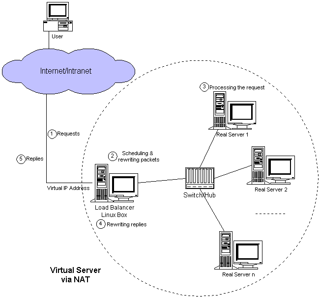
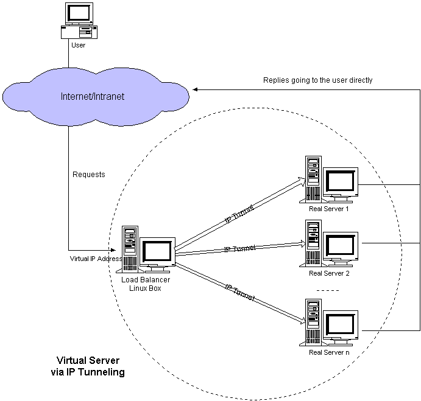
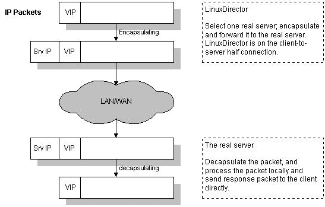
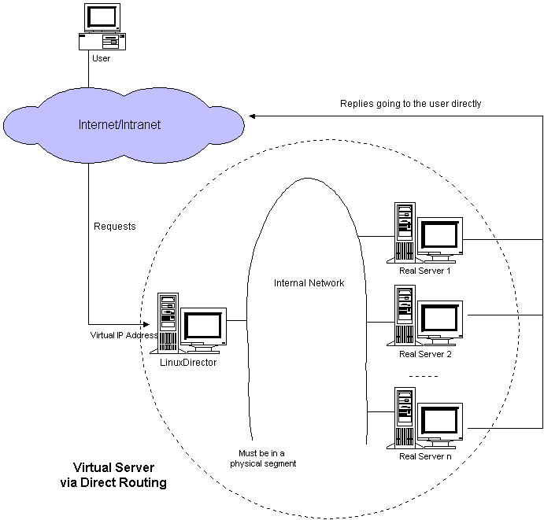
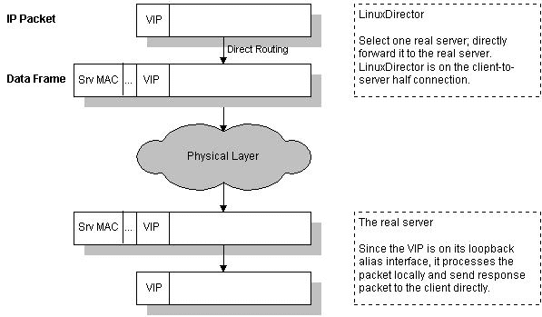

# 部分 VIII. Server Load Balancing

## Load Balancing / High-Availability

本章主要讲述服务器负载均衡技术语服务器高可用，关于网络链路负载均衡与路由交换设备 HA 请关注作者的《Netkiller Network 手札》

## 第 125 章 heartbeat

## 1. heartbeat+ldirectord

### 1.1. heartbeat

```
neo@ubuntu:~$ apt-cache search  heartbeat
heartbeat - Subsystem for High-Availability Linux
heartbeat-dev - Subsystem for High-Availability Linux - development files
ipvsadm - Linux Virtual Server support programs

neo@ubuntu:~$ sudo apt-get install heartbeat

```

### 1.2. ldirectord

当前环境

```
[root@backup ~]# cd /etc/ha.d/
[root@backup ha.d]# ls
authkeys       harc           ldirectord.cf  README.config  shellfuncs
ha.cf          haresources    rc.d/          resource.d/

```

heartbeat 主要有三个配置文件:

1.  /etc/ha.d/authkeys

2.  /etc/ha.d/ha.cf

3.  /etc/ha.d/haresources

过程 125.1. 配置步骤:

1.  /etc/ha.d/authkeys

    auth 3

    3 md5 hello

    ```
    [root@backup ha.d]# vi authkeys
    auth 3
    #1 crc
    #2 sha1 HI!
    3 md5 hello

    ```

2.  /etc/ha.d/ha.cf

    master

    logfile /var/log/ha-log

    logfacility local0

    keepalive 2

    deadtime 30

    warntime 10

    initdead 120

    udpport 694

    ucast eth1 10.10.10.161

    ucast eth1 <backup node ip>

    auto_failback on

    node    master.example.org
    node    backup.example.org

    ping_group group1 10.10.10.160 10.10.10.161

    respawn hacluster /usr/lib/heartbeat/ipfail

    apiauth ipfail gid=haclient uid=hacluster

    ```
    [root@backup ha.d]# vi ha.cf
    logfile /var/log/ha-log

    ```

    backup

    ucast eth1 master node ip

3.  /etc/ha.d/haresources

    <node> <vip>/<netmask>/<interface>/<vip> ldirectord

    master.example.org 211.100.37.164/32/eth0:0/211.100.37.164 ldirectord

    ```
    [root@master ha.d]# cat haresources
    master.example.org 211.100.37.164/32/eth0:0/211.100.37.164 ldirectord

    ```

    backup.example.org 211.100.37.164/32/eth0:0/211.100.37.164 ldirectord

    ```
    [root@backup ha.d]# cat haresources
    backup.example.org 211.100.37.164/32/eth0:0/211.100.37.164 ldirectord

    ```

4.  /etc/ha.d/ldirectord.cf

    ```
    checktimeout=3
    checkinterval=1
    autoreload=yes
    logfile="/var/log/ldirectord.log"
    quiescent=yes
    virtual=211.100.37.164:80
            real=10.10.0.7:80 gate
            real=10.10.0.8:80 gate
            real=10.10.0.9:80 gate
            service=http
            virtualhost=netkiller.8800.org
            scheduler=wrr
            protocol=tcp
            checkport=80
    ...

    ```

### 1.3. test

debug

```
tail -f /var/log/ha-log

```

察看心跳监听是否工作：

```
[root@master ha.d]# tcpdump -i eth1 icmp
[root@backup ha.d]# tcpdump -i eth1 icmp

```

IPaddr2 Script

IPAddr2::10.10.0.1/32/0:0/10.10.0.1

```
resource.d/IPaddr2 10.10.0.1/32/0:0/10.10.0.1 start

```

## 2. Pacemaker

## 第 126 章 Linux Virtual Server

Session

当选用持久服务（-p 选项）支持 HTTP session 时，来自同一 IP 地址的请求将被送到同一台服务器。所以在这种状况下，一个 ab 生成的请求都会被调度到一台服务器，达不到性能测试的目的。在真实系统使用中，持久服务时间一般设置好几个小时。 当 ldirectord 监测到并且在列表中删除一台应用服务器时，之前有建立连接的,继续转发到这台机上，确实是这样。因为 IPVS 并不立即淘汰刚删除的服务器，考虑到服务器太忙被删除，可能很快会被加回来。如果你需要马上淘汰已删除服务器的连接，可以用 echo 1 > /proc/sys/net/ipv4/vs/expire_nodest_conn 不用担心记录连接所消耗的内存，因为一个连接只占用 128 个字节，所以 512M 可用内存可以支持四百万条连接数。 可以考虑用分布式的测试工具，或者多台机器一起跑 ab。

## 1. 环境配置

ssh

```
neo@ubuntu:~$ sudo apt-get install ssh

```

network

```
neo@ubuntu:~$ sudo ifconfig eth0 172.16.0.250
neo@ubuntu:~$ sudo route add default gw 172.16.0.254

```

install ipvsadm

```
neo@ubuntu:~$ apt-cache search ipvsadm
ipvsadm - Linux Virtual Server support programs
neo@ubuntu:~$ sudo apt-get install ipvsadm
Reading package lists... Done
Building dependency tree
Reading state information... Done
Suggested packages:
  heartbeat keepalived ldirectord
The following NEW packages will be installed:
  ipvsadm
0 upgraded, 1 newly installed, 0 to remove and 30 not upgraded.
Need to get 0B/43.9kB of archives.
After unpacking 238kB of additional disk space will be used.
Preconfiguring packages ...
Selecting previously deselected package ipvsadm.
(Reading database ... 16572 files and directories currently installed.)
Unpacking ipvsadm (from .../ipvsadm_1.24+1.21-1.1ubuntu3_i386.deb) ...
Setting up ipvsadm (1.24+1.21-1.1ubuntu3) ...

neo@ubuntu:~$

```

test

```
neo@ubuntu:~$ sudo ipvsadm
IP Virtual Server version 1.2.1 (size=4096)
Prot LocalAddress:Port Scheduler Flags
  -> RemoteAddress:Port           Forward Weight ActiveConn InActConn
neo@ubuntu:~$

```

## 2. VS/NAT



ip_forward

```
sysctl -w net.ipv4.ip_forward=1
or
echo 1 > /proc/sys/net/ipv4/ip_forward
or
/etc/sysctl.conf 文件，保证其中有如下一行:
net.ipv4.ip_forward = 1

执行:
sysctl -p

```

iptables

```
sudo iptables -t nat -A POSTROUTING -j MASQUERADE -p tcp -o eth0 -s 172.16.0.0/16 -d 0.0.0.0/0
sudo iptables -t nat -A POSTROUTING -j MASQUERADE -p tcp -o eth1 -s 192.168.1.0/24 -d 0.0.0.0/0

```

ipvsadm

```
sudo ipvsadm -A -t 172.16.0.1:80 -s wlc
sudo ipvsadm -a -t 172.16.0.1:80 -r 192.168.0.4:80 -m
sudo ipvsadm -a -t 172.16.0.1:80 -r 192.168.0.5:80 -m -w 2

```

## 3. VS/TUN



Director

```
ifconfig eth0:0 172.16.0.1 netmask 255.255.255.255 broadcast 172.16.0.1 up

```

ifconfig eth0:0 <VIP> netmask 255.255.255.255 broadcast <VIP> up

```
ipvsadm -A -t 172.16.0.1:80 -s wlc
ipvsadm -a -t 172.16.0.1:80 -r 172.16.0.10 -i
ipvsadm -a -t 172.16.0.1:80 -r 172.16.0.20 -i
ipvsadm -a -t 172.16.0.1:80 -r 172.16.0.30 -i

```

ifconfig

```
[root@centos etc]# ifconfig
eth0      Link encap:Ethernet  HWaddr 00:0C:29:15:2B:CF
          inet addr:172.16.0.40  Bcast:172.16.255.255  Mask:255.255.0.0
          inet6 addr: fe80::20c:29ff:fe15:2bcf/64 Scope:Link
          UP BROADCAST RUNNING MULTICAST  MTU:1500  Metric:1
          RX packets:2340 errors:0 dropped:0 overruns:0 frame:0
          TX packets:2524 errors:0 dropped:0 overruns:0 carrier:0
          collisions:0 txqueuelen:1000
          RX bytes:995068 (971.7 KiB)  TX bytes:327201 (319.5 KiB)
          Interrupt:177 Base address:0x1400

eth0:0    Link encap:Ethernet  HWaddr 00:0C:29:15:2B:CF
          inet addr:172.16.0.1  Bcast:172.16.0.1  Mask:255.255.255.255
          UP BROADCAST RUNNING MULTICAST  MTU:1500  Metric:1
          Interrupt:177 Base address:0x1400

lo        Link encap:Local Loopback
          inet addr:127.0.0.1  Mask:255.0.0.0
          inet6 addr: ::1/128 Scope:Host
          UP LOOPBACK RUNNING  MTU:16436  Metric:1
          RX packets:27 errors:0 dropped:0 overruns:0 frame:0
          TX packets:27 errors:0 dropped:0 overruns:0 carrier:0
          collisions:0 txqueuelen:0
          RX bytes:2460 (2.4 KiB)  TX bytes:2460 (2.4 KiB)

[root@centos etc]#

```

route

```
[root@centos etc]# route
Kernel IP routing table
Destination     Gateway         Genmask         Flags Metric Ref    Use Iface
169.254.0.0     *               255.255.0.0     U     0      0        0 eth0
172.16.0.0      *               255.255.0.0     U     0      0        0 eth0
default         172.16.0.254    0.0.0.0         UG    0      0        0 eth0
[root@centos etc]#

```

ipvsadm

```
[root@centos etc]# ipvsadm
IP Virtual Server version 1.2.1 (size=4096)
Prot LocalAddress:Port Scheduler Flags
  -> RemoteAddress:Port           Forward Weight ActiveConn InActConn
TCP  172.16.0.1:http wlc
  -> 172.16.0.30:http             Tunnel  1      0          0
  -> 172.16.0.20:http             Tunnel  1      0          0
  -> 172.16.0.10:http             Tunnel  1      0          0
[root@centos etc]#

```

realserver

```
echo 1 > /proc/sys/net/ipv4/ip_forward
modprobe ipip
ifconfig tunl0 0.0.0.0 up
echo 1 > /proc/sys/net/ipv4/conf/all/hidden
echo 1 > /proc/sys/net/ipv4/conf/tunl0/hidden
ifconfig tunl0 172.16.0.1 netmask 255.255.255.255 broadcast 172.16.0.1 up
route add -host 172.16.0.1 dev tunl0

```

ubuntu real server

```
neo@backup:~$ sudo sysctl -w net.ipv4.ip_forward=1
net.ipv4.ip_forward = 1
neo@backup:~$ sudo modprobe ipip
neo@backup:~$ sudo ifconfig tunl0 0.0.0.0 up

neo@backup:~$ sudo ifconfig tunl0 172.16.0.1 netmask 255.255.255.255 broadcast 172.16.0.1 up
neo@backup:~$ sudo route add -host 172.16.0.1 dev tunl0
neo@backup:~$ route
Kernel IP routing table
Destination     Gateway         Genmask         Flags Metric Ref    Use Iface
172.16.0.1      *               255.255.255.255 UH    0      0        0 tunl0
localnet        *               255.255.0.0     U     0      0        0 eth0
default         172.16.0.254    0.0.0.0         UG    0      0        0 eth0
neo@backup:~$

```

script

```
sudo sysctl -w net.ipv4.ip_forward=1
sudo modprobe ipip
sudo ifconfig tunl0 0.0.0.0 up
sudo ifconfig tunl0 172.16.0.1 netmask 255.255.255.255 broadcast 172.16.0.1 up

```

ifconfig

```
neo@master:~$ ifconfig
eth0      Link encap:Ethernet  HWaddr 00:0C:29:CC:CF:A2
          inet addr:172.16.0.10  Bcast:172.16.255.255  Mask:255.255.0.0
          inet6 addr: fe80::20c:29ff:fecc:cfa2/64 Scope:Link
          UP BROADCAST RUNNING MULTICAST  MTU:1500  Metric:1
          RX packets:5006 errors:0 dropped:0 overruns:0 frame:0
          TX packets:4692 errors:0 dropped:0 overruns:0 carrier:0
          collisions:0 txqueuelen:1000
          RX bytes:2866792 (2.7 MiB)  TX bytes:639042 (624.0 KiB)
          Interrupt:177 Base address:0x1400

lo        Link encap:Local Loopback
          inet addr:127.0.0.1  Mask:255.0.0.0
          inet6 addr: ::1/128 Scope:Host
          UP LOOPBACK RUNNING  MTU:16436  Metric:1
          RX packets:0 errors:0 dropped:0 overruns:0 frame:0
          TX packets:0 errors:0 dropped:0 overruns:0 carrier:0
          collisions:0 txqueuelen:0
          RX bytes:0 (0.0 b)  TX bytes:0 (0.0 b)

tunl0     Link encap:IPIP Tunnel  HWaddr
          inet addr:172.16.0.1  Mask:255.255.255.255
          UP RUNNING NOARP  MTU:1480  Metric:1
          RX packets:98 errors:0 dropped:0 overruns:0 frame:0
          TX packets:0 errors:0 dropped:0 overruns:0 carrier:0
          collisions:0 txqueuelen:0
          RX bytes:19511 (19.0 KiB)  TX bytes:0 (0.0 b)

neo@master:~$ route
Kernel IP routing table
Destination     Gateway         Genmask         Flags Metric Ref    Use Iface
172.16.0.0      *               255.255.0.0     U     0      0        0 eth0
default         172.16.0.254    0.0.0.0         UG    0      0        0 eth0
neo@master:~$

```

## 4. VS/DR



VS/DR 方式是通过改写请求报文中的 MAC 地址部分来实现的。

Director 和 RealServer 必需在物理上有一个网卡通过不间断的局域网相连。

Director

VIP:172.16.0.1

```
neo@ubuntu:~$ sudo ifconfig eth0 172.16.0.1/16
or
ifconfig eth0 172.16.0.x netmask 255.255.0.0 broadcast 172.16.0.255 up
ifconfig eth0:0 172.16.0.1 netmask 255.255.255.255 broadcast 172.16.0.1 up

sudo sysctl -w net.ipv4.ip_forward=1

```

ipvsadm

```
#!/bin/bash
ipvsadm -C
ipvsadm -A -t 172.16.0.1:80 -s wlc
ipvsadm -a -t 172.16.0.1:80 -r 172.16.0.10 -g
ipvsadm -a -t 172.16.0.1:80 -r 172.16.0.20 -g
ipvsadm -a -t 172.16.0.1:80 -r 172.16.0.30 -g

```

script

```
ifconfig eth0 172.16.0.x netmask 255.255.0.0 broadcast 172.16.0.255 up
ifconfig eth0:0 172.16.0.1 netmask 255.255.255.255 broadcast 172.16.0.1 up
echo 1 > /proc/sys/net/ipv4/ip_forward

```

RealServer

Ubuntn

```
neo@master:~$ sudo sysctl -w net.ipv4.ip_forward=1
net.ipv4.ip_forward = 1
neo@master:~$ sudo sysctl -w net.ipv4.conf.lo.arp_ignore=1
net.ipv4.conf.lo.arp_ignore = 1
neo@master:~$ sudo sysctl -w net.ipv4.conf.lo.arp_announce=2
net.ipv4.conf.lo.arp_announce = 2
neo@master:~$ sudo sysctl -w net.ipv4.conf.all.arp_ignore=1
net.ipv4.conf.all.arp_ignore = 1
neo@master:~$ sudo sysctl -w net.ipv4.conf.all.arp_announce=2
net.ipv4.conf.all.arp_announce = 2
neo@master:~$
neo@master:~$ sudo ifconfig lo:0 172.16.0.1 netmask 255.255.255.255 broadcast 172.16.0.1 up
neo@master:~$ sudo route add -host 172.16.0.1 dev lo:0

```

script

```
sudo sysctl -w net.ipv4.ip_forward=1
sudo sysctl -w net.ipv4.conf.lo.arp_ignore=1
sudo sysctl -w net.ipv4.conf.lo.arp_announce=2
sudo sysctl -w net.ipv4.conf.all.arp_ignore=1
sudo sysctl -w net.ipv4.conf.all.arp_announce=2
sudo ifconfig lo:0 172.16.0.1 netmask 255.255.255.255 broadcast 172.16.0.1 up
sudo route add -host 172.16.0.1 dev lo:0

```

redhat

```
echo 1 > /proc/sys/net/ipv4/ip_forward
echo 1 > /proc/sys/net/ipv4/conf/all/hidden
echo 1 > /proc/sys/net/ipv4/conf/lo/hidden
ifconfig lo:0 172.16.0.1 netmask 255.255.255.255 broadcast 172.16.0.1 up

```

test

```
neo@ubuntu:~$ sudo tcpdump -i eth0|grep "172.16.0.1"

```

### 4.1. 配置文件

#### 4.1.1. Director

ifconfig

```
neo@ubuntu:~$ ifconfig
eth0      Link encap:Ethernet  HWaddr 00:0C:29:C2:FC:D7
          inet addr:172.16.0.250  Bcast:172.16.255.255  Mask:255.255.0.0
          inet6 addr: fe80::20c:29ff:fec2:fcd7/64 Scope:Link
          UP BROADCAST RUNNING MULTICAST  MTU:1500  Metric:1
          RX packets:8566 errors:0 dropped:0 overruns:0 frame:0
          TX packets:11544 errors:0 dropped:0 overruns:0 carrier:0
          collisions:0 txqueuelen:1000
          RX bytes:726365 (709.3 KiB)  TX bytes:2638735 (2.5 MiB)
          Interrupt:177 Base address:0x1400

eth0:0    Link encap:Ethernet  HWaddr 00:0C:29:C2:FC:D7
          inet addr:172.16.0.1  Bcast:255.255.255.255  Mask:0.0.0.0
          UP BROADCAST RUNNING MULTICAST  MTU:1500  Metric:1
          Interrupt:177 Base address:0x1400

lo        Link encap:Local Loopback
          inet addr:127.0.0.1  Mask:255.0.0.0
          inet6 addr: ::1/128 Scope:Host
          UP LOOPBACK RUNNING  MTU:16436  Metric:1
          RX packets:0 errors:0 dropped:0 overruns:0 frame:0
          TX packets:0 errors:0 dropped:0 overruns:0 carrier:0
          collisions:0 txqueuelen:0
          RX bytes:0 (0.0 b)  TX bytes:0 (0.0 b)

neo@ubuntu:~$

```

ipvsadm

```
neo@ubuntu:~$ sudo ipvsadm
IP Virtual Server version 1.2.1 (size=4096)
Prot LocalAddress:Port Scheduler Flags
  -> RemoteAddress:Port           Forward Weight ActiveConn InActConn
TCP  172.16.0.1:www wlc
  -> 172.16.0.20:www              Route   1      0          0
  -> 172.16.0.10:www              Route   1      0          0
neo@ubuntu:~$

```

#### 4.1.2. RealServer

ifconfig

```
neo@ubuntu:~$ ifconfig
eth0      Link encap:Ethernet  HWaddr 00:0C:29:CC:CF:A2
          inet addr:172.16.0.20  Bcast:172.16.255.255  Mask:255.255.0.0
          inet6 addr: fe80::20c:29ff:fecc:cfa2/64 Scope:Link
          UP BROADCAST RUNNING MULTICAST  MTU:1500  Metric:1
          RX packets:1897 errors:0 dropped:0 overruns:0 frame:0
          TX packets:1511 errors:0 dropped:0 overruns:0 carrier:0
          collisions:0 txqueuelen:1000
          RX bytes:229334 (223.9 KiB)  TX bytes:205973 (201.1 KiB)
          Interrupt:177 Base address:0x1400

lo        Link encap:Local Loopback
          inet addr:127.0.0.1  Mask:255.0.0.0
          inet6 addr: ::1/128 Scope:Host
          UP LOOPBACK RUNNING  MTU:16436  Metric:1
          RX packets:0 errors:0 dropped:0 overruns:0 frame:0
          TX packets:0 errors:0 dropped:0 overruns:0 carrier:0
          collisions:0 txqueuelen:0
          RX bytes:0 (0.0 b)  TX bytes:0 (0.0 b)

lo:0      Link encap:Local Loopback
          inet addr:172.16.0.1  Mask:255.255.255.255
          UP LOOPBACK RUNNING  MTU:16436  Metric:1

neo@ubuntu:~$

```

## 5. ipvsadm script

save/restore

```
$ ipvsadm-sav > ipvsadm.sav
$ ipvsadm-restore < ipvsadm.sav

```

同步

```
#sync daemon.
ipvsadm --start-daemon=master --mcast-interface=eth1
ipvsadm --start-daemon=backup --mcast-interface=eth1

```

cancel

```
[root@centos etc]# ipvsadm -C
[root@centos etc]# ifconfig eth0:0 down
and
[root@centos etc]# ifconfig lo:0 down

```

## 6. Timeout

```
# ipvsadm -L --timeout
Timeout (tcp tcpfin udp): 900 120 300

```

## 7. debug

```
tcpdump -n -i eth0 port 80 or icmp or arp

```

正确的 IP 包

```

20:39:01.222810 IP 172.16.0.253.4086 > 172.16.0.1.www: S 4092656017:4092656017(0) win 65535 <mss 1460,nop,wscale 2,nop,nop,sackOK>
20:39:01.225684 IP 172.16.0.253.4086 > 172.16.0.1.www: . ack 3272377939 win 64240
20:39:01.225697 IP 172.16.0.1.www > 172.16.0.253.4086: S 3272377938:3272377938(0) ack 4092656018 win 5840 <mss 1460,nop,nop,sackOK,nop,wscale 1>
20:39:01.225726 IP 172.16.0.253.4086 > 172.16.0.1.www: P 1:186(185) ack 1 win 64240
20:39:01.246167 IP 172.16.0.1.www > 172.16.0.253.4086: . ack 186 win 3456
20:39:01.284672 IP 172.16.0.1.www > 172.16.0.253.4086: P 1:524(523) ack 186 win 3456
20:39:01.386049 IP 172.16.0.253.4086 > 172.16.0.1.www: . ack 524 win 64109

```

## 8. ipvsadm monitor

monitor.py

```

#!/usr/bin/env python

class Ipvs:
    types = ''
    vip = '0.0.0.0'
    vport = '0'
    scheduler = ''
    nodes = []
    """
    def __init__(self, vs):
        self.types = vs[0]
        self.vip = vs[1]
        self.vport = vs[2]
        self.scheduler = vs[3]
        self.nodes = vs[4]
    """
class Node:
    nip     = '0.0.0.0'
    nport   = ''
    forward = ''
    weight = 0
    active = 0
    inact  = 0
    def __init__(self, node):
        nip = node[0]
        nport = node[1]
        forward = node[2]
        weight = node[3]
        active = node[4]
        incat = node[5]
        self.nip     = nip
        self.nport   = nport
        self.forward = forward
        self.weight = weight
        self.active = active
        self.inact  = incat

class Monitor:
    buffer = []
    ipvsdict = {}
    def __init__(self):
        self.buffer.append('<?xml version="1.0"?>')
        self.buffer.append('<?xml-stylesheet type="text/xsl" href="vs.xsl"?>')
        #self.make()
	pass
    def clear(self):
        self.buffer = []
        self.ipvss = []
    def make(self):
        self.buffer.append('<ipvs>')
        for key in self.ipvsdict:
            ipvs = self.ipvsdict[key]
            self.node(ipvs.nodes,ipvs.vip+':'+ipvs.vport+' '+ipvs.scheduler)
        self.buffer.append('</ipvs>')
    def header(self,vs):
        self.buffer.append('<!-- --------------------------------------- -->')
    def node(self, nodes, caption):
        self.buffer.append('<table>')
        self.buffer.append('<caption>'+caption+'</caption>')
	for node in nodes:
            self.buffer.append('<node>')
            self.buffer.append('<nip>'+node.nip+'</nip>')
            self.buffer.append('<nport>'+node.nport+'</nport>')
            self.buffer.append('<forward>'+node.forward+'</forward>')
            self.buffer.append('<weight>'+node.weight+'</weight>')
            self.buffer.append('<active>'+node.active+'</active>')
            self.buffer.append('<inact>'+node.inact+'</inact>')
            self.buffer.append('</node>')
        self.buffer.append('</table>')
    def display(self):
        for buf in self.buffer:
            print buf
    def saveAs(self,filename):
#       if filename:
        f = open(filename,'w')
        for buf in self.buffer:
            f.write(buf)
        f.close()
    def save(self):
        self.saveAs('vs.xml')

    def ipvslist(self):
        w,r = os.popen2(IPVSADM)
        w.close()
        version = r.readline()
        vsfield = r.readline()
        nodefield = r.readline()

        pattern_vs = r'(\w+)\s+([0-9.]+):(\w+)\s+(\w+)'
        pattern_node = r'\s->\s([0-9.]+):(\w+)\s+(\w+)\s+(\d+)\s+(\d+)\s+(\d+)'
        cp_vs = re.compile(pattern_vs)
        cp_node = re.compile(pattern_node)

        current_vs = ''
        for line in r.readlines():
            if line[:3] == 'TCP' or line[:3] == 'UDP':
                current_vs = line

                result = cp_vs.search(line).groups()
                ipvs = Ipvs()
                ipvs.types = result[0]
                ipvs.vip = result[1]
                ipvs.vport = result[2]
                ipvs.scheduler = result[3]
                ipvs.nodes = []
                self.ipvsdict[current_vs] = ipvs
            elif line[2:4]== '->':
                result = cp_node.search(line).groups()
                oneNode = Node(result)
                #nodes.append(oneNode)
                self.ipvsdict[current_vs].nodes.append(oneNode)

class Network:
    interface = []
    def __init__(self):
        pass
    def hostname:
        pass

class Ipvsadmin:
    cmdline = ''
    vscache = []
    forward = {'nat':'','route':'','tunel':''}

    def load(self, config):
        pass
    def vip(self, vip, vport, scheduler):
        pass
    def rip(self, vip,rip,rport,forward,weight):
        pass
    def list(self):
        pass
    def saveAs(self):
        pass
    def restore(self):
        pass

class Deploy:
    src = ['vs.xml','vs.xsl']
    dst = ''
    def __init__(self):
        pass
    def target(self, dst):
        self.dst = dst
    def start(self):
        try:
            for srcfile in self.src:
                shutil.copy(srcfile,self.dst)
        except (IOError, os.error), why:
            print "Can't copy %s to %s: %s" % (`self.src`, `self.dst`, str(why))

import os,re
import shutil
IPVSADM='/sbin/ipvsadm'

def main():
    xml = Monitor()
    xml.ipvslist()
    xml.make()
    #xml.display()
    xml.save()
    #xml.saveAs('/var/www/vs.xml')
    deploy = Deploy()
    deploy.target('/var/www')
    deploy.start()

if __name__ == "__main__":
    main()

```

ipvs.xsl

```

<?xml version="1.0" encoding="utf-8"?>
<!-- stylesheet by netkiller -->
<xsl:stylesheet  version="1.0">

<xsl:output method="html"/>

<xsl:template match="/">
<html>
<head>
<title><xsl:value-of select="table/caption"/></title>
<meta http-equiv="content-type" content="text/html; charset=utf-8" />
<meta content="陈景峰,网路杀手,网络杀手,bg7nyt,ham,火腿" name="keywords" />
<meta content="陈景峰" name="description" />
<!--
<link rel="shortcut icon" href="favicon.ico" />
<link rel="Bookmark" href="favicon.ico" />
-->
<link rel="stylesheet" type="text/css" href="style.css" />

</head>

<body bgcolor="DFEFFF" text="#000000">
<a name="top" />

<xsl:apply-templates/>

</body>
</html>
</xsl:template>

<xsl:template match="/ipvs">
<xsl:for-each select="table">
<table width="90%" border="1" cellspacing="0" cellpadding="5" bgcolor="E0F0FF" align="center" bordercolor="4FA7FF">
<caption><xsl:value-of select="caption"/></caption>
<xsl:for-each select="node">
<tr>
<td><xsl:value-of select="nip"/></td>
<td><xsl:value-of select="nport"/></td>
<td><xsl:value-of select="forward"/></td>
<td><xsl:value-of select="weight"/></td>
<td><xsl:value-of select="active"/></td>
<td><xsl:value-of select="inact"/></td>
</tr>
</xsl:for-each>
</table>
<br />
</xsl:for-each>
</xsl:template>

<xsl:template match="chapter/title">
<center><h1>
<xsl:apply-templates/>
</h1>
</center>
<hr />

</xsl:template>

<xsl:template match="ulink">
<a href="{@url}" border="0" >
<xsl:apply-templates/> </a> <br />
</xsl:template>

<!--
<xsl:apply-templates select="title"/><br />
<xsl:for-each select="setp">
</xsl:for-each>
-->
</xsl:stylesheet>

```

## 第 127 章 keepalived

VRRP（Virtual Router Redundancy Protocol）协议

网站: http://www.keepalived.org/

**http://www.lvwnet.com/vince/linux/Keepalived-LVS-NAT-Director-ProxyArp-Firewall-HOWTO.html**

http://www.keepalived.org/LVS-NAT-Keepalived-HOWTO.html

http://archive.linuxvirtualserver.org/html/lvs-users/2002-12/msg00189.html

http://www.linuxvirtualserver.org/docs/ha/keepalived.html

## 1. 安装

两台已经安装好 Ubuntu 的服务器

分别安装 ssh 以方便 putty 登录

```
neo@master:~$ sudo apt-get install ssh
neo@slave:~$ sudo apt-get install ssh

```

install keepalived

```
neo@master:~$ apt-cache search lvs
keepalived - Failover and monitoring daemon for LVS clusters
neo@master:~$ sudo apt-get install keepalived

```

配置 keepalived.conf

```
neo@master:/etc/keepalived$ sudo touch keepalived.conf
neo@master:/etc/keepalived$ sudo vi keepalived.conf

```

例 127.1. keepalived.conf

```

vrrp_sync_group VG1 {
    group {
        VI_1
        VI_2
    }
}

vrrp_instance VI_1 {
    state MASTER
    interface eth0
    virtual_router_id 51
    priority 100
    advert_int 1
    authentication {
        auth_type PASS
        auth_pass 1111
    }
    virtual_ipaddress {
        172.16.0.1
    }
}

vrrp_instance VI_2 {
    state MASTER
    interface eth1
    virtual_router_id 51
    priority 100
    advert_int 1
    authentication {
        auth_type PASS
        auth_pass 1111
    }
    virtual_ipaddress {
        172.18.1.254
    }
}

virtual_server 172.16.0.1 80 {
    delay_loop 6
    lb_algo wlc
    lb_kind NAT
    persistence_timeout 600
    protocol TCP

    real_server 172.16.0.2 80 {
        weight 100
        TCP_CHECK {
            connect_timeout 3
        }
    }
    real_server 172.16.0.3 80 {
        weight 100
        TCP_CHECK {
            connect_timeout 3
        }
    }
    real_server 172.16.0.4 80 {
        weight 100
        TCP_CHECK {
            connect_timeout 3
        }
    }
}			

```

enable ip_forward

$ sudo sysctl -w net.ipv4.ip_forward=1

```
neo@master:~$ sysctl net.ipv4.ip_forward
net.ipv4.ip_forward = 0		

```

Starting keepalived

```
neo@master:/etc/keepalived$ sudo /etc/init.d/keepalived start
Starting keepalived: keepalived.		

```

### virtual_ipaddress

virtual_ipaddress { 172.16.0.1/16 } 正常直接写 IP 即可.但在 ubuntu 中如果不写子网掩码,它会默认为 172.16.0.1/32.

## 2. test

Log

Keepalived 日志输出位置

Debian/Ubutun: /var/log/daemon.log

Other: /var/log/messages

```
tail -f  /var/log/daemon.log |grep Keepalived

```

$ sudo ipvsadm

链接测试

```
$ w3m -no-cookie -dump 'http://172.16.0.1'

```

查看 vip

```

neo@master:/etc/keepalived$ ip addr show eth0
2: eth0: <BROADCAST,MULTICAST,UP,10000> mtu 1500 qdisc pfifo_fast qlen 1000
    link/ether 00:0c:29:07:40:14 brd ff:ff:ff:ff:ff:ff
    inet 172.16.0.2/16 brd 172.16.255.255 scope global eth0
    inet6 fe80::20c:29ff:fe07:4014/64 scope link
       valid_lft forever preferred_lft forever
neo@master:/etc/keepalived$

neo@master:/etc/keepalived$ sudo /etc/init.d/keepalived start
Starting keepalived: keepalived.

neo@master:/etc/keepalived$ ip addr show eth0
2: eth0: <BROADCAST,MULTICAST,UP,10000> mtu 1500 qdisc pfifo_fast qlen 1000
    link/ether 00:0c:29:07:40:14 brd ff:ff:ff:ff:ff:ff
    inet 172.16.0.2/16 brd 172.16.255.255 scope global eth0
    inet 172.16.0.1/16 scope global secondary eth0
    inet6 fe80::20c:29ff:fe07:4014/64 scope link
       valid_lft forever preferred_lft forever
neo@master:/etc/keepalived$		

```

正确应该显示： inet 172.16.0.1/16 scope global secondary eth0

genhash 生成 web hash 类似 md5sum，对比每次输出是否一样

```
genhash -s 172.16.0.1 -p 80 -u /		
genhash -s 172.16.0.1 -p 80 -u /
genhash -s 172.16.0.1 -p 80 -u /
...
genhash -s 172.16.0.1 -p 80 -u /

```

## 3. HAProxy and Keepalived (Virtual IP)

```
# yum install -y keepalived
# chkconfig keepalived on 

# echo "net.ipv4.ip_nonlocal_bind = 1" >> /etc/sysctl.conf
# sysctl -p		

```

例 127.2. /etc/keepalived/keepalived.conf

Master

```
vrrp_script chk_haproxy {
   script "killall -0 haproxy"   # verify the pid existance
   interval 2                    # check every 2 seconds
   weight 2                      # add 2 points of prio if OK
}

vrrp_instance VI_1 {
   interface eth0                # interface to monitor
   state MASTER
   virtual_router_id 51          # Assign one ID for this route
   priority 101                  # 101 on master, 100 on backup
   virtual_ipaddress {
       192.168.10.100            # the virtual IP
   }
   track_script {
       chk_haproxy
   }
}

```

Slave

```
vrrp_script chk_haproxy {
   script "killall -0 haproxy"   # verify the pid existance
   interval 2                    # check every 2 seconds
   weight 2                      # add 2 points of prio if OK
}

vrrp_instance VI_1 {
   interface eth0                # interface to monitor
   state MASTER
   virtual_router_id 51          # Assign one ID for this route
   priority 100                  # 101 on master, 100 on backup
   virtual_ipaddress {
       192.168.10.100            # the virtual IP
   }
   track_script {
       chk_haproxy
   }
}			

```

启动 keepalived

```
/etc/init.d/keepalived start

```

检查 IP 地址与主从状态

SLB1 IP:

```
$ ip a | grep -e inet.*eth0
 inet 192.168.10.101/24 brd 192.168.10.255 scope global eth0
 inet 192.168.10.100/32 scope global eth0
LB1 Keepalived state:

$ cat /var/log/messages | grep VRRP_Instance
Apr 19 15:47:25 lb1 Keepalived_vrrp[6146]: VRRP_Instance(VI_1) Transition to MASTER STATE
Apr 19 15:47:25 lb1 Keepalived_vrrp[6146]: VRRP_Instance(VI_1) Entering MASTER STATE

```

SLB2 IP:

```
$ ip a | grep -e inet.*eth0
 inet 192.168.10.102/24 brd 192.168.10.255 scope global eth0
LB2 Keepalived state:

$ cat /var/log/messages | grep VRRP_Instance
Apr 19 15:47:25 lb2 Keepalived_vrrp[6146]: VRRP_Instance(VI_1) Transition to MASTER STATE
Apr 19 15:47:25 lb2 Keepalived_vrrp[6146]: VRRP_Instance(VI_1) Received higher prio advert
Apr 19 15:47:25 lb2 Keepalived_vrrp[6146]: VRRP_Instance(VI_1) Entering BACKUP STATE

```

## 第 128 章 Piranha - Cluster administation tools

摘要

Piranha 安装与配置

## 1. install

Install piranha and ipvsadm packages on the LVS Routers

```
yum -y install ipvsadm piranha

```

Turning on Packet Forwarding on the LVS Routers

```
vi /etc/sysctl.conf

net.ipv4.ip_forward = 1 把原来的 0 改成 1
使刚才的修改生效
sysctl -p

临时生效
echo "1" >/proc/sys/net/ipv4/ip_forward

```

Configuring Services on the LVS Routers

```
chkconfig pulse on
chkconfig ipvsadm on
chkconfig piranha-gui on

```

Setting a Password for the Piranha Configuration Tool

```
# piranha-passwd

```

Starting the Piranha Configuration Tool Service

```
# setenforce 0
setenforce: SELinux is disabled
# service ipvsadm start
# service piranha-gui start

```

## 2. configure

http://your.domain.com:3636/

user: piranha

passwd: your piranha

/etc/sysconfig/ha/lvs.cf

## 3. real server

DR 连接方式

```

VIP=192.168.3.212
ifconfig lo:0 $VIP netmask 255.255.255.255 broadcast $VIP
/sbin/route add -host $VIP dev lo:0
echo "1" >/proc/sys/net/ipv4/conf/lo/arp_ignore
echo "2" >/proc/sys/net/ipv4/conf/lo/arp_announce
echo "1" >/proc/sys/net/ipv4/conf/all/arp_ignore
echo "2" >/proc/sys/net/ipv4/conf/all/arp_announce
sysctl -p >/dev/null 2>&1

```

Tunnel 模式

```

ifconfig tunl0 $VIP netmask 255.255.255.255 broadcast $VIP
/sbin/route add -host $VIP dev tunl0
echo "1" >/proc/sys/net/ipv4/conf/tunl0/arp_ignore
echo "2" >/proc/sys/net/ipv4/conf/tunl0/arp_announce
echo "1" >/proc/sys/net/ipv4/conf/all/arp_ignore
echo "2" >/proc/sys/net/ipv4/conf/all/arp_announce
sysctl -p >/dev/null 2>&1

```

## 4. Example

### 4.1. Master

例 128.1. piranha master

```

[root@lvs1 ~]# cat /etc/sysconfig/ha/lvs.cf
serial_no = 31
primary = 172.16.0.2
primary_private = 172.16.2.2
service = lvs
backup_active = 1
backup = 172.16.0.3
backup_private = 172.16.2.3
heartbeat = 1
heartbeat_port = 539
keepalive = 2
deadtime = 6
network = direct
debug_level = NONE
monitor_links = 0
syncdaemon = 0
virtual LVS-HTTP {
     active = 1
     address = 172.16.0.1 eth0:1
     vip_nmask = 255.255.255.255
     port = 80
     send = "GET / HTTP/1.0\r\n\r\n"
     expect = "HTTP"
     use_regex = 0
     load_monitor = none
     scheduler = wlc
     protocol = tcp
     timeout = 6
     reentry = 15
     quiesce_server = 0
     server Web1 {
         address = 172.16.0.5
         active = 1
         port = 80
         weight = 2
     }
     server Web2 {
         address = 172.16.0.6
         active = 1
         port = 80
         weight = 2
     }
     server Web3 {
         address = 172.16.0.7
         active = 1
         port = 80
         weight = 2
     }
     server Web4 {
         address = 172.16.0.8
         active = 0
         port = 80
         weight = 0
     }
}

```

### 4.2. Slave

例 128.2. piranha slave

```

serial_no = 30
primary = 172.16.0.2
primary_private = 172.16.2.2
service = lvs
backup_active = 1
backup = 172.16.0.3
backup_private = 172.16.2.3
heartbeat = 1
heartbeat_port = 539
keepalive = 2
deadtime = 6
network = direct
debug_level = NONE
monitor_links = 0
syncdaemon = 0
virtual LVS-HTTP {
     active = 1
     address = 172.16.0.1 eth0:1
     vip_nmask = 255.255.255.255
     port = 80
     send = "GET / HTTP/1.0\r\n\r\n"
     expect = "HTTP"
     use_regex = 0
     load_monitor = none
     scheduler = wlc
     protocol = tcp
     timeout = 6
     reentry = 15
     quiesce_server = 0
     server Web1 {
         address = 172.16.0.5
         active = 1
         port = 80
         weight = 2
     }
     server Web2 {
         address = 172.16.0.6
         active = 1
         port = 80
         weight = 2
     }
     server Web3 {
         address = 172.16.0.7
         active = 1
         port = 80
         weight = 2
     }
     server Web4 {
         address = 172.16.0.8
         active = 0
         port = 80
         weight = 3
     }
}

```

### 4.3. MySQL

```
virtual SLB-MySQL {
     active = 1
     address = 172.16.1.50 eth0:2
     vip_nmask = 255.255.255.255
     port = 3306
     persistent = 30
     send = ""
     expect = ""
     use_regex = 0
     load_monitor = none
     scheduler = wlc
     protocol = tcp
     timeout = 5
     reentry = 15
     quiesce_server = 0
     server MySQL1 {
         address = 172.16.1.46
         active = 1
         port = 3306
         weight = 1
     }
     server MySQL2 {
         address = 172.16.1.47
         active = 1
         port = 3306
         weight = 1
     }
     server MySQL3 {
         address = 172.16.1.48
         active = 1
         port = 3306
         weight = 1
     }

}

```

```
# cat /srv/script/lvs-client-start

#!/bin/bash
### Disable IP_Forward in Linux Kernel ###
echo 0 > /proc/sys/net/ipv4/ip_forward

### Disable ARP Reponse on This RealServer ###
echo 1 > /proc/sys/net/ipv4/conf/lo/arp_ignore
echo 2 > /proc/sys/net/ipv4/conf/lo/arp_announce
echo 1 > /proc/sys/net/ipv4/conf/all/arp_ignore
echo 2 > /proc/sys/net/ipv4/conf/all/arp_announce

### Add VIP Address and Route ###
VIP=172.16.1.50

/sbin/ifconfig lo:0 $VIP broadcast $VIP netmask 255.255.255.255 up
/sbin/route add -host $VIP1 dev lo:0

```

我比较喜欢使用 ip 命令代替 route 命令

ip route add $VIP dev lo:0 src $VIP

## 第 129 章 HAProxy - fast and reliable load balancing reverse proxy

## 1. Installing

### 1.1. Ubuntu

```
$ apt-cache search haproxy
haproxy - fast and reliable load balancing reverse proxy

sudo apt-get install haproxy

```

启用 HAProxy

```
$ sudo vim /etc/default/haproxy
# Set ENABLED to 1 if you want the init script to start haproxy.
#ENABLED=0
ENABLED=1
# Add extra flags here.
#EXTRAOPTS="-de -m 16"

```

ENABLED=0 改为 ENABLED=1

### 1.2. CentOS

```

yum install haproxy

```

## 2. haproxy.cfg

默认配置文件

```

$ cat /etc/haproxy/haproxy.cfg
# this config needs haproxy-1.1.28 or haproxy-1.2.1

global
	log 127.0.0.1	local0
	log 127.0.0.1	local1 notice
	#log loghost	local0 info
	maxconn 4096
	#chroot /usr/share/haproxy
	user haproxy
	group haproxy
	daemon
	#debug
	#quiet

defaults
	log	global
	mode	http
	option	httplog
	option	dontlognull
	retries	3
	option redispatch
	maxconn	2000
	contimeout	5000
	clitimeout	50000
	srvtimeout	50000

listen	appli1-rewrite 0.0.0.0:10001
	cookie	SERVERID rewrite
	balance	roundrobin
	server	app1_1 192.168.34.23:8080 cookie app1inst1 check inter 2000 rise 2 fall 5
	server	app1_2 192.168.34.32:8080 cookie app1inst2 check inter 2000 rise 2 fall 5
	server	app1_3 192.168.34.27:8080 cookie app1inst3 check inter 2000 rise 2 fall 5
	server	app1_4 192.168.34.42:8080 cookie app1inst4 check inter 2000 rise 2 fall 5

listen	appli2-insert 0.0.0.0:10002
	option	httpchk
	balance	roundrobin
	cookie	SERVERID insert indirect nocache
	server	inst1 192.168.114.56:80 cookie server01 check inter 2000 fall 3
	server	inst2 192.168.114.56:81 cookie server02 check inter 2000 fall 3
	capture cookie vgnvisitor= len 32

	option	httpclose		# disable keep-alive
	rspidel ^Set-cookie:\ IP=	# do not let this cookie tell our internal IP address

listen	appli3-relais 0.0.0.0:10003
	dispatch 192.168.135.17:80

listen	appli4-backup 0.0.0.0:10004
	option	httpchk /index.html
	option	persist
	balance	roundrobin
	server	inst1 192.168.114.56:80 check inter 2000 fall 3
	server	inst2 192.168.114.56:81 check inter 2000 fall 3 backup

listen	ssl-relay 0.0.0.0:8443
	option	ssl-hello-chk
	balance	source
	server	inst1 192.168.110.56:443 check inter 2000 fall 3
	server	inst2 192.168.110.57:443 check inter 2000 fall 3
	server	back1 192.168.120.58:443 backup

listen	appli5-backup 0.0.0.0:10005
	option	httpchk *
	balance	roundrobin
	cookie	SERVERID insert indirect nocache
	server	inst1 192.168.114.56:80 cookie server01 check inter 2000 fall 3
	server	inst2 192.168.114.56:81 cookie server02 check inter 2000 fall 3
	server	inst3 192.168.114.57:80 backup check inter 2000 fall 3
	capture cookie ASPSESSION len 32
	srvtimeout	20000

	option	httpclose		# disable keep-alive
	option  checkcache		# block response if set-cookie & cacheable

	rspidel ^Set-cookie:\ IP=	# do not let this cookie tell our internal IP address

	#errorloc	502	http://192.168.114.58/error502.html
	#errorfile	503	/etc/haproxy/errors/503.http
	errorfile	400	/etc/haproxy/errors/400.http
	errorfile	403	/etc/haproxy/errors/403.http
	errorfile	408	/etc/haproxy/errors/408.http
	errorfile	500	/etc/haproxy/errors/500.http
	errorfile	502	/etc/haproxy/errors/502.http
	errorfile	503	/etc/haproxy/errors/503.http
	errorfile	504	/etc/haproxy/errors/504.http

```

### 2.1. stats

```

listen stats :8000
        mode http
        transparent
        stats uri /haproxy-stats
        stats realm Haproxy \ statistic
        stats auth neo:chen
		stats hide-version

listen  admin_status
        mode  http
        bind 202.76.124.110:8899
        option httplog
        stats enable
        stats refresh 10s
        stats hide-version
        stats realm Haproxy\ Statistics
        stats uri  /admin-status
        stats auth  admin:password
        stats admin if TRUE

```

### 2.2. listen 方式

```
listen tomcat-app *:80
	maxconn 2000
	balance source
	option  httpclose               # disable keep-alive
	option  forwardfor
	server  app1 202.13.69.16:8080 check
	server  app2 103.13.40.66:8080 check

```

### 2.3. frontend/backend 方式

```
frontend  tomcat-app *:8080
    default_backend	tomcat-app
backend tomcat-app
    balance source
    server  app1 202.13.69.16:8080 check
    server  app2 103.11.40.66:8080 check

```

### 2.4. option

#### 2.4.1. httpclose

```
option  httpclose               # disable keep-alive

```

#### 2.4.2. forwardfor

forwardfor 实例

```

listen web :80
	mode http
	balance roundrobin
	option httpclose
	option forwardfor
	server web1 192.168.1.1:80 check weight 1 minconn 1 maxconn 3 check inter 40000
	server web2 192.168.1.2:80 check weight 1 minconn 1 maxconn 3 check inter 40000

```

#### 2.4.3. httpchk

```

option httpchk
option httpchk <uri>
option httpchk <method> <uri>
option httpchk <method> <uri> <version>
ex:

option httpchk OPTIONS * HTTP/1.1\r\nHost:\ www

option httpchk GET /robots.txt
option httpchk GET /index.html
option httpchk *

option httpchk GET /robots.txt # 指的是 GET /robots.txt HTTP/1.0
option httpchk # 指的是 OPTIONS / HTTP/1.0
option httpchk * # 指的是 OPTIONS * HTTP/1.0

```

### 2.5. balance

常用负载均衡算法

```
roundrobin	轮循
leastconn	最小连接数
source		源 IP 会话保持

```

### 2.6. server

```
server xxxxx xxx.xxx.xxx.xxx:xxx check port 80 inter 1500 rise 3 fall 3 weight 1

```

port 端口检查

inter 是检测心跳频率

rise 3 次检查正确，认为服务器可用

fall 3 次失败认为服务器不可用

weight 代表权重

## 3. Example 配置实例

### 3.1. HTTP 配置实例

```

 cd /etc/haproxy/
 cp haproxy.cfg haproxy.cfg.old

# cat /etc/haproxy/haproxy.cfg
#---------------------------------------------------------------------
# Example configuration for a possible web application.  See the
# full configuration options online.
#
#   http://haproxy.1wt.eu/download/1.4/doc/configuration.txt
#
#---------------------------------------------------------------------

#---------------------------------------------------------------------
# Global settings
#---------------------------------------------------------------------
global
    # to have these messages end up in /var/log/haproxy.log you will
    # need to:
    #
    # 1) configure syslog to accept network log events.  This is done
    #    by adding the '-r' option to the SYSLOGD_OPTIONS in
    #    /etc/sysconfig/syslog
    #
    # 2) configure local2 events to go to the /var/log/haproxy.log
    #   file. A line like the following can be added to
    #   /etc/sysconfig/syslog
    #
    #    local2.*                       /var/log/haproxy.log
    #
    log         127.0.0.1 local2

    chroot      /var/lib/haproxy
    pidfile     /var/run/haproxy.pid
    maxconn     40000
    user        haproxy
    group       haproxy
    daemon

    # turn on stats unix socket
    stats socket /var/lib/haproxy/stats

#---------------------------------------------------------------------
# common defaults that all the 'listen' and 'backend' sections will
# use if not designated in their block
#---------------------------------------------------------------------
defaults
    mode                    http
    log                     global
    option                  httplog
    option                  dontlognull
    option http-server-close
    option forwardfor       except 127.0.0.0/8
    option                  redispatch
    retries                 3
    timeout http-request    10s
    timeout queue           1m
    timeout connect         10s
    timeout client          1m
    timeout server          1m
    timeout http-keep-alive 10s
    timeout check           10s
    maxconn                 40000

#---------------------------------------------------------------------
# main frontend which proxys to the backends
#---------------------------------------------------------------------
frontend  main *:80
#    acl url_static       path_beg       -i /static /images /javascript /stylesheets
#    acl url_static       path_end       -i .jpg .gif .png .css .js

#    use_backend static          if url_static
    default_backend             app

#---------------------------------------------------------------------
# static backend for serving up images, stylesheets and such
#---------------------------------------------------------------------
#backend static
#    balance     roundrobin
#    server      static 172.16.0.6:80 check

#---------------------------------------------------------------------
# round robin balancing between the various backends
#---------------------------------------------------------------------
backend app
    balance     roundrobin
    server  app1 10.0.0.68:80 check
    server  app2 10.0.0.69:80 check
#    server  app3 127.0.0.1:5003 check
#    server  app4 127.0.0.1:5004 check

[root@r610 haproxy]# /etc/init.d/haproxy start
Starting haproxy:                                          [  OK  ]

```

#### 3.1.1. 插入 Cookie 会话保持

```
lobal
        log 127.0.0.1   local0
        log 127.0.0.1   local1 notice
        #log loghost    local0 info
        maxconn 4096
        #debug
        #quiet
        user haproxy
        group haproxy

defaults
        log     global
        mode    http
        option  httplog
        option  dontlognull
        retries 3
        redispatch
        maxconn 2000
        contimeout      5000
        clitimeout      50000
        srvtimeout      50000

listen web 192.168.0.1:80
       mode http
       balance roundrobin
       cookie JSESSIONID prefix
       option httpclose
       option forwardfor
       option httpchk HEAD /index.html HTTP/1.0
       server web1 192.168.0.2:80 cookie A check
       server web2 192.168.0.3:80 cookie B check

```

#### 3.1.2. HTTP URL 检查

```
listen tomcat *:8080
        maxconn 4096
        mode http
        balance leastconn
        option httpclose # disable keep-alive
        option forwardfor
        option httpchk GET /index.jsp
		server tomcat_A 172.19.35.33:8080 check port 8080 inter 2000 rise 2 fall 3
		server tomcat_B 172.19.35.44:8080 check port 8080 inter 2000 rise 2 fall 3

```

### 3.2. Squid

```

global
	log 127.0.0.1	local0
	log 127.0.0.1	local1 notice
	#log loghost	local0 info
	maxconn 4096
	#chroot /usr/share/haproxy
	user haproxy
	group haproxy
	daemon
	#debug
	#quiet

defaults
	log	global
	mode	http
	option	httplog
	option	dontlognull
	retries	3
	option redispatch
	maxconn	2000
	contimeout	5000
	clitimeout	50000
	srvtimeout	50000

listen proxy	0.0.0.0:3128
	server	proxy_node_1	203.185.193.198:3128
	server	proxy_node_2	219.190.126.147:3128

```

### 3.3. haproxy + mysql 配置实例

例 129.1. haproxy + mysql 配置实例

```

# cat /etc/haproxy/haproxy.cfg | grep -v '#'

global
    log         127.0.0.1 local2

    chroot      /var/lib/haproxy
    pidfile     /var/run/haproxy.pid
    maxconn     4000
    user        haproxy
    group       haproxy
    daemon

    stats socket /var/lib/haproxy/stats

defaults
    mode                    tcp
    log                     global
    option                  tcplog
    option                  dontlognull
    option                  redispatch
    retries                 3
    timeout queue           1m
    timeout connect         10s
    timeout client          1m
    timeout server          1m
    timeout check           10s
    maxconn                 3000

listen slave *:3306
	mode tcp
	balance leastconn
	option tcpka
	server  mysql_22 202.123.6.166:3306 check
	server  mysql_26 202.123.6.177:3306 check

listen stats :8000
        mode http
        transparent
        stats uri /haproxy-stats
        stats realm Haproxy \ statistic
        stats auth www:lJ2mXTjgtGIvRUN2qEE
		stats hide-version

listen  admin_status
        mode  http
        bind 0.0.0.0:8899
        option httplog
        stats enable
        stats refresh 10s
        stats hide-version
        stats realm Haproxy\ Statistics
        stats uri  /admin-status
        stats auth  admin:Ol9t1pk1zoJk3HctZivbR
        stats admin if TRUE

```

例 129.2. Haproxy MySQL (Master + Master)

```
listen  MYSQL_Slave *:3308
        mode tcp
        maxconn 4096
        balance leastconn
        server  mysql_A  172.18.50.21:3306  check port 3306 inter 2s rise 2 fall 3
        server  mysql_B  100.101.5.21:3306  check port 3306 inter 2s rise 2 fall 3

listen  MYSQL_Master *:3306
        mode tcp
        maxconn 2048
        balance roundrobin
        server  mysql1  172.18.50.16:3306 check port 3306 inter 3s rise 2 fall 3
        server  mysql2  102.101.5.26:3306 check port 3306 inter 3s rise 2 fall 3 backup

```

### 3.4. HTTPS SSL 证书卸载配置实例

生成自签名证书的步骤, 如果你有购买的证书，此处略过

```
$ sudo mkdir /etc/ssl/example.com
$ sudo openssl genrsa -out /etc/ssl/example.com/example.com.key 1024
$ sudo openssl req -new -key /etc/ssl/example.com/example.com.key -out /etc/ssl/example.com/example.com.csr
> Country Name (2 letter code) [AU]:CN
> State or Province Name (full name) [Some-State]:Guangdong
> Locality Name (eg, city) []:Shenzhen
> Organization Name (eg, company) [Internet Widgits Pty Ltd]:example
> Organizational Unit Name (eg, section) []:
> Common Name (e.g. server FQDN or YOUR name) []:*.example.com
> Email Address []:
> Please enter the following 'extra' attributes to be sent with your certificate request
> A challenge password []:
> An optional company name []:
$ sudo openssl x509 -req -days 365 -in /etc/ssl/example.com/example.com.csr -signkey /etc/ssl/example.com/example.com.key -out /etc/ssl/example.com/example.com.crt

$ sudo cat /etc/ssl/example.com/example.com.crt /etc/ssl/example.com/example.com.key | sudo tee /etc/ssl/example.com/example.com.pem			

```

/etc/haproxy/haproxy.cfg

```
frontend localhost
    bind *:80
    bind *:443 ssl crt /etc/ssl/example.com/example.com.pem
    mode http
    default_backend nodes

backend nodes
    mode http
    balance roundrobin
    option forwardfor
    option httpchk HEAD / HTTP/1.1\r\nHost:www.example.com
    server web01 172.16.0.1:80 check
    server web02 172.16.0.2:80 check
    server web03 172.16.0.3:80 check
    http-request set-header X-Forwarded-Port %[dst_port]
    http-request add-header X-Forwarded-Proto https if { ssl_fc }    			

```

HTTP 强行跳转倒 HTTP 的配置方法

```
frontend localhost
    bind *:80
    bind *:443 ssl crt /etc/ssl/example.com/example.com.pem
    redirect scheme https if !{ ssl_fc }
    mode http
    default_backend nodes			

```

### 3.5. 使用 TCP 模式实现 SSL 穿透

```
frontend localhost
    bind *:80
    bind *:443
    option tcplog
    mode tcp
    default_backend nodes

backend nodes
    mode tcp
    balance roundrobin
    option ssl-hello-chk
    server web01 172.16.0.3:443 check
    server web02 172.16.0.4:443 check    

```

### 3.6. SMTP

```
listen smtp
	bind *:25
	mode tcp
	balance leastconn
	option smtpchk
	server smtp1 173.254.223.53:25 check
	server smtp2 45.33.242.42:25 check

```

## 第 130 章 balance - Load balancing solution and generic tcp proxy

### *balance 3.42 - A simple TCP proxy with load balancing and failover mechanisms.*

## 1. balance

https://www.inlab.de/balance.html

### 1.1. 编译安装

```
cd /usr/local/src/
wget http://www.inlab.de/balance-3.54.tar.gz
tar zxvf balance-3.54.tar.gz
cd balance-3.54

make
make install

```

### 1.2. Ubuntu 安装

```
$ apt-cache search balance| grep ^bal
balance - Load balancing solution and generic tcp proxy

```

```
$ sudo apt-get install balance

```

### 1.3. 测试安装是否正确

测试，将本机 80 端口负载均衡到 192.168.2.10:80

```
balance -f 8000 192.168.2.10:80

```

### 1.4. 用法

负载均衡 3 个节点

```
balance -f 8000 192.168.2.10:80 192.168.2.12:80 192.168.2.13:80

```

## 2. BalanceNG

[`www.inlab.de/balanceng/index.html`](http://www.inlab.de/balanceng/index.html)

## 3. RBridge

[`www.inlab.de/rbridge/index.html`](http://www.inlab.de/rbridge/index.html)

```
wget http://www.inlab.de/rbridge/RBridge-3.185-Linux-x86.tar.gz
tar zxvf RBridge-3.185-Linux-x86.tar.gz
cd RBridge-3.185-Linux-x86/

```

```
cp rbridge.conf.example rbridge.conf
./rbridge start

```

## 第 131 章 Perlbal

http://www.danga.com/perlbal/

## 1. install

ubuntu

## 第 132 章 Pacemaker

Redhat 已经放弃 Piranha, Redhat 7 使用 Pacemaker 作为默认的机群管理工具

http://clusterlabs.org/

## 第 133 章 Example

这里介绍一个负载均衡放置问题，我们可以把它摆放在任何位置，每种方案都各有优缺点，需要根据你的实际情况选择使用

适用于 HAProxy / Nginx / LVS 等等

这里用 web,db 为例子，讲述负载均衡之间的关系

## 1. 双负载均衡的用法

User --> LB1 --> Web --> LB2 --> Database

```
                 User
                  |
            LB1   V 0.0.0.0:80 
----------------------------------------
    /             |              \
web Node 1     web Node 2    web Node 3
    \             |              /        
----------------------------------------
                  |
            LB2   V 0.0.0.0:1152 / 0.0.0.0:3306
----------------------------------------
     /            |              \                      
DB Node 1     DB Node 2       DB Node 3

```

适用于所有的服务器放在一个私有局域网,防火墙将公网 IP 地址映射到 LB1 上，LB1 链接 web 节点（使用第一块网卡），然后从第二块网卡请求数据库 LB2，LB2 在请求分配到数据库节点。

整个案例使用了两台负载均衡设备，如果每个负载均衡都再配置一个备机。就是 4 台服务器，还要看你的经济情况。

前面我说需要在在一个局域网中，为什么呢？因为你要考虑从用户到数据，在将结果返回的网络开销。

## 3. 广域网负载均衡的用法

User --> Web LB1 --> Database

```
                 User
                  |
            LB1   V 0.0.0.0:80 
----------------------------------------
    /             |              \
web Node 1     web Node 2    web Node 3
   LB1           LB2             LB3  
    \             |              /        
----------------------------------------
                  |
                  V 0.0.0.0:1152 / 0.0.0.0:3306
----------------------------------------
     /            |              \                      
DB Node 1     DB Node 2       DB Node 3

```

这个方案非常适合全国布点的情况，经常夸公网访问数据库等资源。我们假设所有的服务器都不在同一个机房，广域网的链接是无法保证 99.9%的联通性。

当一端公网的 web 服务器，链接另一端的数据库服务器是，一般会出现，由于网络不稳定 ping 时间长链接耗时严重，可能出现短时间中断，导致 web 不能正常工作

当然你可以通过调整程序解决，当 DB1 链接失败后尝试链接 DB2..DB3..，这样的改进仍不能满足用户需求，例如：用户链接 web 用了 1 秒中，web 链接数据 DB1 用了 30 秒发现链接不上，在去链接 DB2，最终用户打开网页至少 32 秒,而且下一个用户也会重复这样的操作去 DB1 链接在到 DB2

你也可以考虑在增加一台负载均衡，但新的问题来了，web 到这台负载均衡的网络就能保证吗？

我的解决方法是，每个 web server 上都安装负载均衡软件，Web 与负载均衡安装在一台服务器上，用户链接到 web（通过智能 DNS）,web 请求数据库 localhost:3306 负载均衡分配到数据库节点，这样可以解决当 web 服务器链接公网上的另一台数据服务器的时候，能保证剔除不稳定的节点，同时减少了 web 到另一台负载均衡设备上的开销

## 3. 广域网负载均衡的用法

User --> Web LB1 --> Database

```
                 User
                  |
            LB1   V 0.0.0.0:80 
----------------------------------------
    /             |              \
web Node 1     web Node 2    web Node 3
   LB1           LB2             LB3  
    \             |              /        
----------------------------------------
                  |
                  V 0.0.0.0:1152 / 0.0.0.0:3306
----------------------------------------
     /            |              \                      
DB Node 1     DB Node 2       DB Node 3

```

这个方案非常适合全国布点的情况，经常夸公网访问数据库等资源。我们假设所有的服务器都不在同一个机房，广域网的链接是无法保证 99.9%的联通性。

当一端公网的 web 服务器，链接另一端的数据库服务器是，一般会出现，由于网络不稳定 ping 时间长链接耗时严重，可能出现短时间中断，导致 web 不能正常工作

当然你可以通过调整程序解决，当 DB1 链接失败后尝试链接 DB2..DB3..，这样的改进仍不能满足用户需求，例如：用户链接 web 用了 1 秒中，web 链接数据 DB1 用了 30 秒发现链接不上，在去链接 DB2，最终用户打开网页至少 32 秒,而且下一个用户也会重复这样的操作去 DB1 链接在到 DB2

你也可以考虑在增加一台负载均衡，但新的问题来了，web 到这台负载均衡的网络就能保证吗？

我的解决方法是，每个 web server 上都安装负载均衡软件，Web 与负载均衡安装在一台服务器上，用户链接到 web（通过智能 DNS）,web 请求数据库 localhost:3306 负载均衡分配到数据库节点，这样可以解决当 web 服务器链接公网上的另一台数据服务器的时候，能保证剔除不稳定的节点，同时减少了 web 到另一台负载均衡设备上的开销

## 第 134 章 FAQ

## 1. Haproxy 与 Nginx

Haproxy 与 Nginx 都能实现负载均衡，那么 Haproxy 与 [Nginx proxy](http://www.netkiller.cn/www/nginx/proxy.html) 有什么差异，我们怎样选择两种方案。

如果是用于 HTTP 负载均衡我建议使用 Nginx，它可以 SSL 证书挂载，缓存定制，实现各种复杂的需求。而 Haproxy 与 Nginx 相比就没有那么灵活。

他们有什么区别呢？

Haproxy 依赖 inter，rise，fall 三个参数设置监控状态检查间隔时间和恢复时间，满足条件才能剔除坏节点跟加入好节点

Nginx 是通过 max_fails，fail_timeout 参数配置实现节点检查，原理是 timeout。

实际场景有什么不同？

Haproxy 每隔 inter 时间，统计次数达到 fall 便踢出节点，监控检查是独立工作的，如果监控检查没有达到 fall 次数，haproxy 仍会向节点分配请求。一旦 fall 次数达到节点被踢出，这一时间段请求的用户集体分配到新节点。

Nginx 则是达到 timeout 时间才会踢除，在没有达到 timeout 时间值是，nginx 一直处于 pending 状态，Nginx 有个好处就是在 timeout 时间内节点恢复了，这些 pending 用户还能继续访问节点。否则全部分配到新节点。