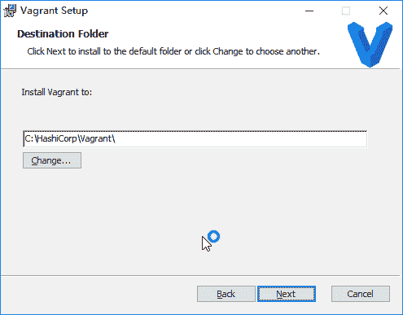
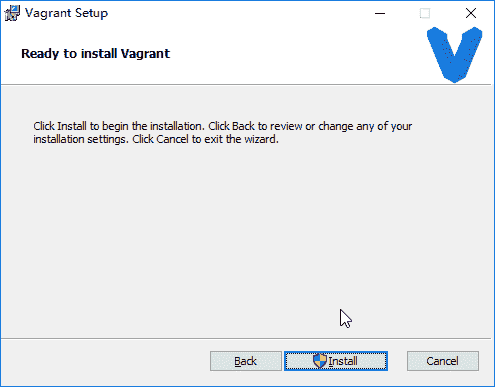
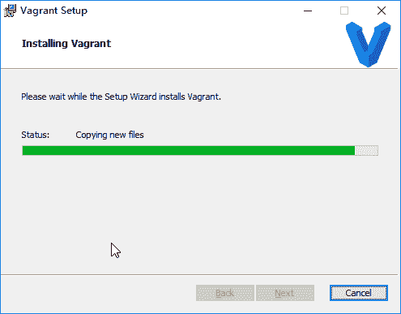
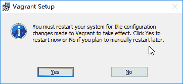

# 部分 XII. Virtualization

## 第 163 章 Docker

[`www.docker.com`](https://www.docker.com)

## 1. Installation

### 1.1. CentOS 6

```

yum install docker-io
service docker start
chkconfig docker on
docker pull centos:latest
docker images centos

```

test

```

docker run -i -t centos /bin/bash

```

### 1.2. CentOS 7 docker-ce

从官方网站获得最新社区版

```

yum install -y yum-utils
yum-config-manager --add-repo https://download.docker.com/linux/centos/docker-ce.repo
yum makecache fast
yum -y install docker-ce

systemctl start docker

```

测试安装是否成功

```

docker run hello-world

```

### 1.3. CentSO 8

```

[root@localhost ~]# dnf config-manager --add-repo=https://download.docker.com/linux/centos/docker-ce.repo
Adding repo from: https://download.docker.com/linux/centos/docker-ce.repo

[root@localhost ~]# dnf install -y docker-ce

[root@localhost ~]# systemctl enable docker
[root@localhost ~]# systemctl start docker

```

### 1.4. Ubuntu

Ubuntu 默认版本

```

$ sudo apt update
$ sudo apt install docker.io
$ sudo ln -sf /usr/bin/docker.io /usr/local/bin/docker
$ sudo sed -i '$acomplete -F _docker docker' /etc/bash_completion.d/docker.io

```

```

$ sudo docker run -i -t ubuntu /bin/bash

```

### 1.5. Ubuntu docker-ce

从官方网站获得最新社区版

```

#!/bin/bash

sudo apt remove docker docker-engine

sudo apt install \
    apt-transport-https \
    ca-certificates \
    curl \
    software-properties-common

curl -fsSL https://download.docker.com/linux/ubuntu/gpg | sudo apt-key add -
sudo apt-key fingerprint 0EBFCD88

sudo add-apt-repository \
   "deb [arch=amd64] https://download.docker.com/linux/ubuntu \
   $(lsb_release -cs) \
   stable"

sudo apt update
sudo apt install docker-ce

apt-cache madison docker-ce

```

启动参数配置 /etc/default/docker

```

neo@ubuntu:~$ cat /etc/default/docker
# Docker Upstart and SysVinit configuration file

#
# THIS FILE DOES NOT APPLY TO SYSTEMD
#
#   Please see the documentation for "systemd drop-ins":
#   https://docs.docker.com/engine/admin/systemd/
#

# Customize location of Docker binary (especially for development testing).
#DOCKERD="/usr/local/bin/dockerd"

# Use DOCKER_OPTS to modify the daemon startup options.
#DOCKER_OPTS="--dns 8.8.8.8 --dns 8.8.4.4"

# If you need Docker to use an HTTP proxy, it can also be specified here.
#export http_proxy="http://127.0.0.1:3128/"

# This is also a handy place to tweak where Docker's temporary files go.
#export DOCKER_TMPDIR="/mnt/bigdrive/docker-tmp"

```

启动脚本 /etc/init/docker.conf

```

neo@ubuntu:~$ sudo cat /etc/init/docker.conf
[sudo] password for neo: 
description "Docker daemon"

start on (filesystem and net-device-up IFACE!=lo)
stop on runlevel [!2345]

limit nofile 524288 1048576

# Having non-zero limits causes performance problems due to accounting overhead
# in the kernel. We recommend using cgroups to do container-local accounting.
limit nproc unlimited unlimited

respawn

kill timeout 20

pre-start script
	# see also https://github.com/tianon/cgroupfs-mount/blob/master/cgroupfs-mount
	if grep -v '^#' /etc/fstab | grep -q cgroup \
		|| [ ! -e /proc/cgroups ] \
		|| [ ! -d /sys/fs/cgroup ]; then
		exit 0
	fi
	if ! mountpoint -q /sys/fs/cgroup; then
		mount -t tmpfs -o uid=0,gid=0,mode=0755 cgroup /sys/fs/cgroup
	fi
	(
		cd /sys/fs/cgroup
		for sys in $(awk '!/^#/ { if ($4 == 1) print $1 }' /proc/cgroups); do
			mkdir -p $sys
			if ! mountpoint -q $sys; then
				if ! mount -n -t cgroup -o $sys cgroup $sys; then
					rmdir $sys || true
				fi
			fi
		done
	)
end script

script
	# modify these in /etc/default/$UPSTART_JOB (/etc/default/docker)
	DOCKERD=/usr/bin/dockerd
	DOCKER_OPTS=
	if [ -f /etc/default/$UPSTART_JOB ]; then
		. /etc/default/$UPSTART_JOB
	fi
	exec "$DOCKERD" $DOCKER_OPTS --raw-logs
end script

# Don't emit "started" event until docker.sock is ready.
# See https://github.com/docker/docker/issues/6647
post-start script
	DOCKER_OPTS=
	DOCKER_SOCKET=
	if [ -f /etc/default/$UPSTART_JOB ]; then
		. /etc/default/$UPSTART_JOB
	fi

	if ! printf "%s" "$DOCKER_OPTS" | grep -qE -e '-H|--host'; then
		DOCKER_SOCKET=/var/run/docker.sock
	else
		DOCKER_SOCKET=$(printf "%s" "$DOCKER_OPTS" | grep -oP -e '(-H|--host)\W*unix://\K(\S+)' | sed 1q)
	fi

	if [ -n "$DOCKER_SOCKET" ]; then
		while ! [ -e "$DOCKER_SOCKET" ]; do
			initctl status $UPSTART_JOB | grep -qE "(stop|respawn)/" && exit 1
			echo "Waiting for $DOCKER_SOCKET"
			sleep 0.1
		done
		echo "$DOCKER_SOCKET is up"
	fi
end script

```

### 1.6. 测试 Docker

```

neo@MacBook-Pro ~ % docker run hello-world
Unable to find image 'hello-world:latest' locally
latest: Pulling from library/hello-world
1b930d010525: Pull complete 
Digest: sha256:2557e3c07ed1e38f26e389462d03ed943586f744621577a99efb77324b0fe535
Status: Downloaded newer image for hello-world:latest

Hello from Docker!
This message shows that your installation appears to be working correctly.

To generate this message, Docker took the following steps:
 1\. The Docker client contacted the Docker daemon.
 2\. The Docker daemon pulled the "hello-world" image from the Docker Hub.
    (amd64)
 3\. The Docker daemon created a new container from that image which runs the
    executable that produces the output you are currently reading.
 4\. The Docker daemon streamed that output to the Docker client, which sent it
    to your terminal.

To try something more ambitious, you can run an Ubuntu container with:
 $ docker run -it ubuntu bash

Share images, automate workflows, and more with a free Docker ID:
 https://hub.docker.com/

For more examples and ideas, visit:
 https://docs.docker.com/get-started/

neo@MacBook-Pro ~ % docker image ls 
REPOSITORY                                 TAG                 IMAGE ID            CREATED             SIZE
hello-world                                latest              fce289e99eb9        2 months ago        1.84kB

neo@MacBook-Pro ~ % docker container ls --all
CONTAINER ID        IMAGE               COMMAND             CREATED              STATUS                          PORTS               NAMES
ea694b443e9e        hello-world         "/hello"            About a minute ago   Exited (0) About a minute ago                       dreamy_feistel

```

### 1.7. 切换仓库镜像

临时选择镜像, 您可以在 Docker 守护进程启动时传入 --registry-mirror 参数：

```

$ docker --registry-mirror=https://registry.docker-cn.com daemon

```

设置默认镜像，修改 /etc/docker/daemon.json 文件，并添加上 registry-mirrors 键值。

```

{
  "registry-mirrors": ["https://registry.docker-cn.com"]
}

```

### 1.8. 重置 Docker

```

docker stop $(docker ps -a -q)
docker rm -f $(docker ps -a -q)
docker rmi -f $(docker images -q)
docker volume rm $(docker volume ls -q)	

```

## 2. 配置 Docker

### 2.1. 开启远程访问

修改/etc/sysconfig/docker 文件，在最后增加一行 DOCKER_OPTS

vim /etc/sysconfig/docker

```

DOCKER_OPTS="-H unix:///var/run/docker.sock -H tcp://0.0.0.0:2375"

```

修改/usr/lib/systemd/system/docker.service 在[Service]的 ExexStart=下面增加一行$DOCKER_OPTS

```

[Unit]
Description=Docker Application Container Engine
Documentation=https://docs.docker.com
BindsTo=containerd.service
After=network-online.target firewalld.service
Wants=network-online.target
Requires=docker.socket

[Service]
Type=notify
# the default is not to use systemd for cgroups because the delegate issues still
# exists and systemd currently does not support the cgroup feature set required
# for containers run by docker
EnvironmentFile=-/etc/sysconfig/docker
ExecStart=/usr/bin/dockerd $DOCKER_OPTS
ExecReload=/bin/kill -s HUP $MAINPID
TimeoutSec=0
RestartSec=2
Restart=always

# Note that StartLimit* options were moved from "Service" to "Unit" in systemd 229.
# Both the old, and new location are accepted by systemd 229 and up, so using the old location
# to make them work for either version of systemd.
StartLimitBurst=3

# Note that StartLimitInterval was renamed to StartLimitIntervalSec in systemd 230.
# Both the old, and new name are accepted by systemd 230 and up, so using the old name to make
# this option work for either version of systemd.
StartLimitInterval=60s

# Having non-zero Limit*s causes performance problems due to accounting overhead
# in the kernel. We recommend using cgroups to do container-local accounting.
LimitNOFILE=infinity
LimitNPROC=infinity
LimitCORE=infinity

# Comment TasksMax if your systemd version does not supports it.
# Only systemd 226 and above support this option.
TasksMax=infinity

# set delegate yes so that systemd does not reset the cgroups of docker containers
Delegate=yes

# kill only the docker process, not all processes in the cgroup
KillMode=process

[Install]
WantedBy=multi-user.target

```

重启 docker

```

[root@localhost ~]# systemctl daemon-reload
[root@localhost ~]# systemctl restart docker			

```

查看端口

```

[root@localhost ~]# ss -lnt | grep 2375
LISTEN     0      1024        :::2375                    :::*  			

```

检查 docker 信息

```

[root@localhost ~]# curl -s http://localhost:2375/info
{"ID":"YNK5:OJTT:FELN:H4DQ:AG7H:W3RE:WGLD:TOOI:32CH:S6HR:AJ45:4VLZ","Containers":4,"ContainersRunning":0,"ContainersPaused":0,"ContainersStopped":4,"Images":10,"Driver":"btrfs","DriverStatus":[["Build Version","Btrfs v4.9.1"],["Library Version","102"]],"SystemStatus":null,"Plugins":{"Volume":["local"],"Network":["bridge","host","macvlan","null","overlay"],"Authorization":null,"Log":["awslogs","fluentd","gcplogs","gelf","journald","json-file","local","logentries","splunk","syslog"]},"MemoryLimit":true,"SwapLimit":true,"KernelMemory":true,"CpuCfsPeriod":true,"CpuCfsQuota":true,"CPUShares":true,"CPUSet":true,"IPv4Forwarding":true,"BridgeNfIptables":false,"BridgeNfIp6tables":false,"Debug":false,"NFd":23,"OomKillDisable":true,"NGoroutines":37,"SystemTime":"2019-01-24T23:30:56.230913047-05:00","LoggingDriver":"json-file","CgroupDriver":"cgroupfs","NEventsListener":0,"KernelVersion":"3.10.0-693.el7.x86_64","OperatingSystem":"CentOS Linux 7 (Core)","OSType":"linux","Architecture":"x86_64","IndexServerAddress":"https://index.docker.io/v1/","RegistryConfig":{"AllowNondistributableArtifactsCIDRs":[],"AllowNondistributableArtifactsHostnames":[],"InsecureRegistryCIDRs":["127.0.0.0/8"],"IndexConfigs":{"docker.io":{"Name":"docker.io","Mirrors":[],"Secure":true,"Official":true}},"Mirrors":[]},"NCPU":2,"MemTotal":1958645760,"GenericResources":null,"DockerRootDir":"/var/lib/docker","HttpProxy":"","HttpsProxy":"","NoProxy":"","Name":"localhost.localdomain","Labels":[],"ExperimentalBuild":false,"ServerVersion":"18.09.1","ClusterStore":"","ClusterAdvertise":"","Runtimes":{"runc":{"path":"runc"}},"DefaultRuntime":"runc","Swarm":{"NodeID":"","NodeAddr":"","LocalNodeState":"inactive","ControlAvailable":false,"Error":"","RemoteManagers":null},"LiveRestoreEnabled":false,"Isolation":"","InitBinary":"docker-init","ContainerdCommit":{"ID":"9754871865f7fe2f4e74d43e2fc7ccd237edcbce","Expected":"9754871865f7fe2f4e74d43e2fc7ccd237edcbce"},"RuncCommit":{"ID":"96ec2177ae841256168fcf76954f7177af9446eb","Expected":"96ec2177ae841256168fcf76954f7177af9446eb"},"InitCommit":{"ID":"fec3683","Expected":"fec3683"},"SecurityOptions":["name=seccomp,profile=default"],"ProductLicense":"Community Engine","Warnings":["WARNING: API is accessible on http://0.0.0.0:2375 without encryption.\n         Access to the remote API is equivalent to root access on the host. Refer\n         to the 'Docker daemon attack surface' section in the documentation for\n         more information: https://docs.docker.com/engine/security/security/#docker-daemon-attack-surface","WARNING: bridge-nf-call-iptables is disabled","WARNING: bridge-nf-call-ip6tables is disabled"]}			

```

## 3. 镜像

Docker 镜像地址 [`registry.hub.docker.com/`](https://registry.hub.docker.com/)

### 3.1. 搜索镜像

```

$ sudo docker search centos |more
NAME                                            DESCRIPTION                                     STARS     OFFICIAL   AUTOMATED
centos                                          The official build of CentOS.                   542       [OK]       
tianon/centos                                   CentOS 5 and 6, created using rinse instea...   28                   
ansible/centos7-ansible                         Ansible on Centos7                              13                   [OK]
saltstack/centos-6-minimal                                                                      7                    [OK]
blalor/centos                                   Bare-bones base CentOS 6.5 image                7                    [OK]
steeef/graphite-centos                          CentOS 6.x with Graphite and Carbon via ng...   6                    [OK]
ariya/centos6-teamcity-server                   TeamCity Server 8.1 on CentOS 6                 6                    [OK]
tutum/centos                                    Centos image with SSH access. For the root...   5                    [OK]
tutum/centos-6.4                                DEPRECATED. Use tutum/centos:6.4 instead. ...   5                    [OK]			

```

### 3.2. 获取镜像

可以使用 docker pull 命令来从官网仓库获取所需要的镜像。

```

$ sudo docker pull ubuntu:14.04

```

等同于

```

$ sudo docker pull registry.hub.docker.com/ubuntu:14.04

```

获得所有版本镜像

```

$ sudo docker pull ubuntu	

$ sudo docker images
REPOSITORY          TAG                 IMAGE ID            CREATED             VIRTUAL SIZE
ubuntu              utopic              277eb4304907        3 days ago          215.6 MB
ubuntu              14.10               277eb4304907        3 days ago          215.6 MB
ubuntu              14.04               5506de2b643b        3 days ago          197.8 MB
ubuntu              trusty              5506de2b643b        3 days ago          197.8 MB
ubuntu              latest              5506de2b643b        3 days ago          197.8 MB
ubuntu              14.04.1             5506de2b643b        3 days ago          197.8 MB
ubuntu              precise             0b310e6bf058        3 days ago          116.1 MB
ubuntu              12.04.5             0b310e6bf058        3 days ago          116.1 MB
ubuntu              12.04               0b310e6bf058        3 days ago          116.1 MB
ubuntu              12.10               c5881f11ded9        4 months ago        172.1 MB
ubuntu              quantal             c5881f11ded9        4 months ago        172.1 MB
ubuntu              13.04               463ff6be4238        4 months ago        169.4 MB
ubuntu              raring              463ff6be4238        4 months ago        169.4 MB
ubuntu              13.10               195eb90b5349        4 months ago        184.6 MB
ubuntu              saucy               195eb90b5349        4 months ago        184.6 MB
ubuntu              10.04               3db9c44f4520        6 months ago        183 MB
ubuntu              lucid               3db9c44f4520        6 months ago        183 MB		

```

从其他服务器获得镜像

```

$ sudo docker pull dl.dockerpool.com:5000/ubuntu:12.04

```

完成后，即可随时使用该镜像了，例如创建一个容器，让其中运行 bash 应用。

```

$ sudo docker run -t -i ubuntu:14.10 /bin/bash

```

### 3.3. 列出本地镜像

```

$ sudo docker images
REPOSITORY          TAG                 IMAGE ID            CREATED             VIRTUAL SIZE
ubuntu              14.10               277eb4304907        3 days ago          215.6 MB
ubuntu              latest              5506de2b643b        3 days ago          197.8 MB

```

### 3.4. 保存和载入镜像

保存镜像

```

$sudo docker save -o ubuntu_14.10.tar ubuntu:14.10			

```

载入镜像

```

$ sudo docker load --input ubuntu_14.10.tar
或
$ sudo docker load < ubuntu_14.10.tar

```

### 3.5. 删除本地镜像

```

$ sudo docker rmi ubuntu:12.04
Untagged: ubuntu:12.04

```

强制删除所有镜像

```

docker rmi -f $(docker images -q)			

```

### 3.6. 基于 Dockerfile 创建镜像

为什么要自己创建镜像呢？ 因为官方提供的镜像无法满足我们的需求，例如 nginx 镜像你会发现 ps, top 等等很多命令缺失。

#### 3.6.1. 创建 Dockerfile 文件

需求基于 centos7 镜像创建 nginx stable 最新版本镜像

```

############################################################
# Dockerfile to build Nginx container
# Based on centos7
############################################################

FROM centos:latest

MAINTAINER Netkiller <netkiller@msn.com>

# Install EPEL
RUN yum install -y epel-release && yum clean all

# Update RPM Packages
RUN yum -y update

# Install Nginx
RUN rpm -ivh http://nginx.org/packages/centos/7/noarch/RPMS/nginx-release-centos-7-0.el7.ngx.noarch.rpm
RUN yum install -y nginx
RUN yum clean all

# forward request and error logs to docker log collector
RUN ln -sf /dev/stdout /var/log/nginx/access.log
RUN ln -sf /dev/stderr /var/log/nginx/error.log

# be backwards compatible with pre-official images
#RUN ln -sf ../share/nginx /usr/local/nginx

# prepare container

# add startup script
#ADD startup.sh /startup.sh
#RUN chmod 755 /startup.sh

VOLUME ["/etc/nginx"]
VOLUME ["/usr/share/nginx/html"]
VOLUME ["/var/www"]

EXPOSE 80 443

CMD ["nginx", "-g", "daemon off;"]

```

#### 3.6.2. 创建镜像

```

		# docker build -t "centos:nginx" .
Sending build context to Docker daemon 3.072 kB
Step 1/14 : FROM centos:latest
 ---> 3bee3060bfc8
Step 2/14 : MAINTAINER Netkiller <netkiller@msn.com>
 ---> Using cache
 ---> 8f351964d568
Step 3/14 : RUN yum install -y epel-release && yum clean all
 ---> Using cache
 ---> bf86eff77ff3
Step 4/14 : RUN yum -y update
 ---> Using cache
 ---> 4915172ac4f3
Step 5/14 : RUN rpm -ivh http://nginx.org/packages/centos/7/noarch/RPMS/nginx-release-centos-7-0.el7.ngx.noarch.rpm
 ---> Using cache
 ---> 4a919bd141c9
Step 6/14 : RUN yum install -y nginx
 ---> Using cache
 ---> 2718221eab8c
Step 7/14 : RUN yum clean all
 ---> Using cache
 ---> 62231a5f1d76
Step 8/14 : RUN ln -sf /dev/stdout /var/log/nginx/access.log
 ---> Using cache
 ---> 38be8f0cc782
Step 9/14 : RUN ln -sf /dev/stderr /var/log/nginx/error.log
 ---> Using cache
 ---> bbf3a468d24f
Step 10/14 : VOLUME /etc/nginx
 ---> Using cache
 ---> 919292c7ce04
Step 11/14 : VOLUME /usr/share/nginx/html
 ---> Using cache
 ---> c2aeb8ed3c1c
Step 12/14 : VOLUME /var/www
 ---> Using cache
 ---> 31849cb8a9d0
Step 13/14 : EXPOSE 80 443
 ---> Using cache
 ---> 0e3d3b4a215b
Step 14/14 : CMD nginx -g daemon off;
 ---> Using cache
 ---> d5f21e409690
Successfully built d5f21e409690

```

查看镜像

```

# docker image ls                 
REPOSITORY          TAG                 IMAGE ID            CREATED             SIZE
centos              nginx               d5f21e409690        4 minutes ago       364 MB
centos              latest              3bee3060bfc8        2 days ago          193 MB
nginx               latest              958a7ae9e569        8 days ago          109 MB
redis               latest              a858478874d1        2 weeks ago         184 MB		

```

#### 3.6.3. 运行镜像

```

# docker run --name my-centos-nginx -d centos:nginx
ecf342ddd66d1d5f3d28c583ec852c05903ef4813fcb75295c907a6b578dea3d

# docker ps
CONTAINER ID        IMAGE               COMMAND                  CREATED             STATUS              PORTS                    NAMES
ecf342ddd66d        centos:nginx        "nginx -g 'daemon ..."   23 seconds ago      Up 23 seconds       80/tcp, 443/tcp          my-centos-nginx
0df3b275bb03        nginx               "nginx -g 'daemon ..."   6 hours ago         Up 6 hours          80/tcp                   my-nginx
1c4540d8617f        redis               "docker-entrypoint..."   2 days ago          Up 2 days           0.0.0.0:6379->6379/tcp   my-redis

```

#### 3.6.4. 测试 Nginx

```

[root@netkiller]~/docker/nginx# docker exec -it my-centos-nginx /bin/bash

[root@netkiller-docker /]# ps ax
  PID TTY      STAT   TIME COMMAND
    1 ?        Ss     0:00 nginx: master process nginx -g daemon off;
    7 ?        S      0:00 nginx: worker process
    8 ?        Ss     0:00 /bin/bash
   22 ?        R+     0:00 ps ax

[root@netkiller-docker /]# curl http://localhost
<!DOCTYPE html>
<html>
<head>
<title>Welcome to nginx!</title>
<style>
    body {
        width: 35em;
        margin: 0 auto;
        font-family: Tahoma, Verdana, Arial, sans-serif;
    }
</style>
</head>
<body>
<h1>Welcome to nginx!</h1>
<p>If you see this page, the nginx web server is successfully installed and
working. Further configuration is required.</p>

<p>For online documentation and support please refer to
<a href="http://nginx.org/">nginx.org</a>.<br/>
Commercial support is available at
<a href="http://nginx.com/">nginx.com</a>.</p>

<p><em>Thank you for using nginx.</em></p>
</body>
</html>

```

#### 3.6.5. 提交镜像

```

# docker commit my-centos-nginx netkiller/centos:nginx
sha256:9ea1851b1c9f04aa3168977f666337223d09e20983f7a2c2328e15132a03d224

```

```

# docker push netkiller/centos:nginx
The push refers to a repository [docker.io/netkiller/centos]
16916856eaaa: Pushed 
6172d61b45f1: Pushed 
db323af550f0: Pushed 
232df2cfd38f: Pushed 
c247a550215b: Pushed 
3b5451d7989c: Pushed 
e3a6f1af6a7a: Pushed 
9e3cea652b37: Pushed 
dc1e2dcdc7b6: Mounted from library/centos 
nginx: digest: sha256:ad9bd1ae3a3e17dac70f32afc14baf90932949d3eaa8bebbe907726aca3ea336 size: 2205

```

#### 3.6.6. Dockerfile 语法

##### 3.6.6.1. COPY

跨容器拷贝

```

FROM demo/test:latest as netkiller

MAINTAINER Netkiller <netkiller@msn.com>

RUN mkdir /www

COPY some/path/to/ /www/

FROM nginx:1.13-alpine

RUN rm -rf /usr/share/nginx/html/*
COPY --from=netkiller /www/ /usr/share/nginx/html/

```

## 4. 容器

### 4.1. 启动与终止容器

```

$ sudo docker run ubuntu:14.10 /bin/echo 'Hello world'
Hello world			

```

进入 BASH

```

$ sudo docker run -t -i ubuntu:14.10 /bin/bash
root@f8c7b2afff14:/# 			

```

start / stop / restart

```

sudo docker start silly_bohr
silly_bohr

$ sudo docker stop silly_bohr
silly_bohr

$ sudo docker restart silly_bohr
silly_bohr

```

守护进程运行

```

$ sudo docker run -d ubuntu:14.10 /bin/sh -c "while true; do echo hello world; sleep 1; done"
4cdbb75eeabf3f1ea87bec91accdf5211639d0895e94ab94ffa1d55fb7f62e2a

```

通过 docker ps 命令来查看容器信息

```

$ sudo docker ps
CONTAINER ID        IMAGE               COMMAND                CREATED             STATUS              PORTS               NAMES
4cdbb75eeabf        ubuntu:14.10        "/bin/sh -c 'while t   30 seconds ago      Up 28 seconds                           drunk_rosalind 

```

要获取容器的输出信息，可以通过 docker logs 命令。

```

$ sudo docker logs insane_babbage			

```

注意：守护进程在后台运行，所以无输出，只能通过 docker logs 命令查看

### 4.2. 进入容器

```

$ sudo docker run -idt ubuntu:14.10
793f9805620d7e10564e0778c388640cb73b6a1aec663bf468904d72a4f219f2

$ sudo docker ps 
CONTAINER ID        IMAGE               COMMAND             CREATED             STATUS              PORTS               NAMES
793f9805620d        ubuntu:14.10        "/bin/bash"         5 seconds ago       Up 4 seconds                            mad_elion           

$ sudo docker attach mad_elion 
root@793f9805620d:/# ls
bin  boot  dev  etc  home  lib  lib64  media  mnt  opt  proc  root  run  sbin  srv  sys  tmp  usr  var

```

### 4.3. 导出和导入容器

```

$ sudo docker export 7691a814370e > ubuntu.tar

```

```

			<![CDATA[
$ cat ubuntu.tar | sudo docker import - test/ubuntu:v1.0

```

指定 URL 或者某个目录来导入，例如

```

$sudo docker import http://example.com/exampleimage.tgz example/imagerepo			

```

### 4.4. kill

杀死所有正在运行的容器

```

docker kill $(docker ps -a -q)			

```

### 4.5. 删除容器

使用 docker rm 来删除一个处于终止状态的容器。

```

$ sudo docker ps -a
CONTAINER ID        IMAGE               COMMAND                CREATED             STATUS                      PORTS               NAMES
f8c7b2afff14        ubuntu:14.10        "/bin/bash"            14 minutes ago      Exited (0) 2 minutes ago                        agitated_fermat     
0abd2e5fc251        ubuntu:14.10        "/bin/echo 'Hello wo   15 minutes ago      Exited (0) 15 minutes ago                       clever_kowalevski 

$ sudo docker rm clever_kowalevski
clever_kowalevski

$ sudo docker ps -a
CONTAINER ID        IMAGE               COMMAND             CREATED             STATUS                     PORTS               NAMES
f8c7b2afff14        ubuntu:14.10        "/bin/bash"         16 minutes ago      Exited (0) 5 minutes ago                       agitated_fermat     			

```

```

$ docker rm 719f98391ecf1d6f1f153ffea1bbd84cd2dc9cf6d31d5a4f348c60d98392814c

```

删除所有已经停止的容器

```

docker rm $(docker ps -a -q)			

```

## 5. 仓库

### 5.1. 登陆仓库

登录

```

$ sudo docker login
Username: netkiller
Password: 
Email: netkiller@msn.com
Login Succeeded

```

### 5.2. 获取镜像

```

docker pull ubuntu:14.04

```

### 5.3. 上传镜像

```

docker tag friendlyhello username/repository:tag
docker push username/repository:tag

```

## 6. 卷管理

### 6.1. 列出卷

docker volume ls

```

# docker volume ls
DRIVER              VOLUME NAME
local               dbac41b6de88c75d2932d5949367b17f347f482977d508195375dbc71518ab27

```

### 6.2. 创建卷

```

# docker volume create --name WebVolume1
WebVolume1

```

```

# docker volume ls
DRIVER              VOLUME NAME
local               WebVolume1
local               dbac41b6de88c75d2932d5949367b17f347f482977d508195375dbc71518ab27			

```

### 6.3. 挂在镜像

```

# docker run -ti --rm -v WebVolume1:/www ubuntu
# docker run -ti --rm -v WebVolume1:/www docker.io/centos:7

```

查看卷的挂载情况

```

# df | grep /www
/dev/vda1       20510332 7943940  11501484  41% /www			

```

创建测试文件

```

# mkdir -p /www/netkiller.cn/www.netkiller.cn
# echo Helloworld > /www/netkiller.cn/www.netkiller.cn/index.html
# cat /www/netkiller.cn/www.netkiller.cn/index.html
Helloworld
# exit
exit

```

### 6.4. 检查卷

```

# docker volume inspect WebVolume1
[
    {
        "Driver": "local",
        "Labels": {},
        "Mountpoint": "/var/lib/docker/volumes/WebVolume1/_data",
        "Name": "WebVolume1",
        "Options": {},
        "Scope": "local"
    }
]

```

### 6.5. 删除卷

```

# docker volume create AppVolume1
# docker volume rm AppVolume1

```

### 6.6. 销毁所有未使用的卷

```

# docker volume prune
WARNING! This will remove all volumes not used by at least one container.
Are you sure you want to continue? [y/N] y
Deleted Volumes:
WebVolume1
3fd379f8c2cf8727d2e83e84e434ea1f122016957bd7cf78a0f05b6e5a69cf2b
app

Total reclaimed space: 11 B

```

### 6.7. 在多个容器间共享卷

容器一

```

# docker run -ti --name=Container1 -v DataVolume1:/opt/data ubuntu

```

容器二

```

# docker run -ti --name=Container2 --volumes-from Container1 ubuntu

```

进入容器一中查看数据

```

# docker start -ai Container1

```

容器三，挂在只读卷

```

# docker run -ti --name=Container3 --volumes-from Container2:ro ubuntu

```

删除上面三个测试容易和卷

```

# docker rm Container1 Container2 Container3
# docker volume rm DataVolume1

```

### 6.8. 容器绑定本地文件系统

#### Bind mount a volume (default [])

```

# docker run -it --name mycentos1 -v /www:/tmp/test docker.io/centos:7 /bin/bash
# docker run -d -v ~/logs:/var/log/nginx -p 80:80 -i nginx			

```

### 6.9. 只读权限

/etc/redis/redis.conf:/etc/redis/redis.conf:ro 表示只读权限

```

docker run \
-p 6379:6379 \
-v /var/lib/redis:/data \
-v /etc/redis/redis.conf:/etc/redis/redis.conf:ro \
--privileged=true \
--name redis \
-d docker.io/redis:latest redis-server /etc/redis/redis.conf			

```

## 7. Swarms

Swarm 是一组运行着 Docker 的机器。经过这些配置后，将节点加入到一个集群中，你仍然像之前那样运行 Docker 命令一样管理集群上的容器。这些命令由 swarm manager 在集群上执行。这些机器可以是真实的机器，也可以是虚拟机。机器加入到一个 swarm 后，可以称这些机器为节点(node)。

帮助命令

```

neo@MacBook-Pro ~ % docker-machine   
Usage: docker-machine [OPTIONS] COMMAND [arg...]

Create and manage machines running Docker.

Version: 0.16.1, build cce350d7

Author:
  Docker Machine Contributors - <https://github.com/docker/machine>

Options:
  --debug, -D						Enable debug mode
  --storage-path, -s "/Users/neo/.docker/machine"	Configures storage path [$MACHINE_STORAGE_PATH]
  --tls-ca-cert 					CA to verify remotes against [$MACHINE_TLS_CA_CERT]
  --tls-ca-key 						Private key to generate certificates [$MACHINE_TLS_CA_KEY]
  --tls-client-cert 					Client cert to use for TLS [$MACHINE_TLS_CLIENT_CERT]
  --tls-client-key 					Private key used in client TLS auth [$MACHINE_TLS_CLIENT_KEY]
  --github-api-token 					Token to use for requests to the Github API [$MACHINE_GITHUB_API_TOKEN]
  --native-ssh						Use the native (Go-based) SSH implementation. [$MACHINE_NATIVE_SSH]
  --bugsnag-api-token 					BugSnag API token for crash reporting [$MACHINE_BUGSNAG_API_TOKEN]
  --help, -h						show help
  --version, -v						print the version

Commands:
  active		Print which machine is active
  config		Print the connection config for machine
  create		Create a machine
  env			Display the commands to set up the environment for the Docker client
  inspect		Inspect information about a machine
  ip			Get the IP address of a machine
  kill			Kill a machine
  ls			List machines
  provision		Re-provision existing machines
  regenerate-certs	Regenerate TLS Certificates for a machine
  restart		Restart a machine
  rm			Remove a machine
  ssh			Log into or run a command on a machine with SSH.
  scp			Copy files between machines
  mount			Mount or unmount a directory from a machine with SSHFS.
  start			Start a machine
  status		Get the status of a machine
  stop			Stop a machine
  upgrade		Upgrade a machine to the latest version of Docker
  url			Get the URL of a machine
  version		Show the Docker Machine version or a machine docker version
  help			Shows a list of commands or help for one command

Run 'docker-machine COMMAND --help' for more information on a command.	

```

### 7.1. 查看 Swarms 版本

```

neo@MacBook-Pro ~ % docker-machine version
docker-machine version 0.16.1, build cce350d7		

```

### 7.2. 初始化 Swarms

```

neo@MacBook-Pro ~/workspace/docker/docker-compose % docker swarm init
Swarm initialized: current node (t8gqr7wfyeis9n8wuegy4j6gn) is now a manager.

To add a worker to this swarm, run the following command:

    docker swarm join --token SWMTKN-1-5w5joob510ug74m9vfn2j1a41nox3ddh6eiyrpgonm38zaoj5c-bo2q6tdem9ihd68gryue1b42x 192.168.65.3:2377

To add a manager to this swarm, run 'docker swarm join-token manager' and follow the instructions.		

```

### 7.3. 显示 join-token

```

neo@MacBook-Pro ~ % docker swarm join-token manager
To add a manager to this swarm, run the following command:

    docker swarm join --token SWMTKN-1-200v95u6lkow6wyxne1ll44rhhwy1zfvawnrqo39i44sqay8vp-1vltkdz94y79mgech56wtnj9n 192.168.65.3:2377		

```

### 7.4. 创建虚拟机

使用 VirtualBox 驱动，创建虚拟机：

```

neo@MacBook-Pro ~ % docker-machine create --driver virtualbox vm1
neo@MacBook-Pro ~ % docker-machine create --driver virtualbox vm2	

```

### 7.5. 显示虚拟机列表

```

$ docker-machine ls		

```

### 7.6. 设置管理节点

配置虚拟机作为 manager 节点，用以执行管理命令并准许其他 worker 加入到 swarm 中。

```

$ docker-machine ssh vm1 "docker swarm init --advertise-addr <ip_address>"		

```

加入到管理节点

```

$ docker-machine ssh vm2 "docker swarm join \
--token <token> \
<ip>:2377"		

```

查看节点列表

```

$ docker-machine ssh vm1 "docker node ls"		

```

### 7.7. 环境变量

```

$ docker-machine env vm1		

```

现在运行 docker-machine ls 来验证 vm1 就是当前的活跃机器，会有星号标识：

```

$ docker-machine ls		

```

### 7.8. 切换节点

```

eval $(docker-machine env vm1)		

```

重置 shell 环境

```

neo@MacBook-Pro ~ % docker-machine env -u
unset DOCKER_TLS_VERIFY
unset DOCKER_HOST
unset DOCKER_CERT_PATH
unset DOCKER_MACHINE_NAME
# Run this command to configure your shell: 
# eval $(docker-machine env -u)		

```

```

eval $(docker-machine env -u)		

```

### 7.9. 启动/停止节点

```

$ docker-machine start vm1

```

```

$ docker-machine stop vm1		

```

### 7.10. 离线

```

docker swarm leave --force		

```

## 8. Stack

stack 是一组相互关联的 services，这些 services 之间相互依赖，并能够一起进行编排和 scale。单个 stack 就能够定义和协调整个应用程序的功能.

创建 docker-compose.yml

```

version: "3"
services:
  web:
    # replace username/repo:tag with your name and image details
    image: nginx
    deploy:
      replicas: 5
      restart_policy:
        condition: on-failure
      resources:
        limits:
          cpus: "0.1"
          memory: 50M
    ports:
      - "80:80"
    networks:
      - webnet
  visualizer:
    image: dockersamples/visualizer:stable
    ports:
      - "8080:8080"
    volumes:
      - "/var/run/docker.sock:/var/run/docker.sock"
    deploy:
      placement:
        constraints: [node.role == manager]
    networks:
      - webnet
networks:
  webnet:    		

```

部署 docker-compose.yml

```

neo@MacBook-Pro ~ % docker stack deploy -c docker-compose.yml visualizer
Creating service visualizer_web
Creating service visualizer_visualizer	

```

查看部署

```

neo@MacBook-Pro ~ % docker stack ls
NAME                SERVICES            ORCHESTRATOR
visualizer          2                   Swarm	

```

```

neo@MacBook-Pro ~ % docker stack services visualizer
ID                  NAME                    MODE                REPLICAS            IMAGE                             PORTS
h6vpdk8wqr8w        visualizer_visualizer   replicated          1/1                 dockersamples/visualizer:stable   *:8080->8080/tcp
tm5rre8d4kni        visualizer_web          replicated          5/5                 nginx:latest                      *:80->80/tcp	

```

```

neo@MacBook-Pro ~ % docker stack ps visualizer
ID                  NAME                          IMAGE                             NODE                    DESIRED STATE       CURRENT STATE             ERROR                              PORTS
rnkgapj5oozr        visualizer_visualizer.1       dockersamples/visualizer:stable   linuxkit-025000000001   Running             Running 24 minutes ago                                       
msstp0uavxpf         \_ visualizer_visualizer.1   dockersamples/visualizer:stable   linuxkit-025000000001   Shutdown            Rejected 31 minutes ago   "No such image: dockersamples/…"   
1jmhrzmlsy0j         \_ visualizer_visualizer.1   dockersamples/visualizer:stable   linuxkit-025000000001   Shutdown            Rejected 31 minutes ago   "No such image: dockersamples/…"   
p7iyq0147oh0         \_ visualizer_visualizer.1   dockersamples/visualizer:stable   linuxkit-025000000001   Shutdown            Rejected 31 minutes ago   "No such image: dockersamples/…"   
jdc7cx00a994         \_ visualizer_visualizer.1   dockersamples/visualizer:stable   linuxkit-025000000001   Shutdown            Rejected 32 minutes ago   "No such image: dockersamples/…"   
pttqpa4z21id        visualizer_web.1              nginx:latest                      linuxkit-025000000001   Running             Running 30 minutes ago                                       
rappf97c8dtb        visualizer_web.2              nginx:latest                      linuxkit-025000000001   Running             Running 30 minutes ago                                       
t3dcjqf0fsly        visualizer_web.3              nginx:latest                      linuxkit-025000000001   Running             Running 30 minutes ago                                       
jtztvsqccb5d        visualizer_web.4              nginx:latest                      linuxkit-025000000001   Running             Running 30 minutes ago                                       
ldb92uky85oc        visualizer_web.5              nginx:latest                      linuxkit-025000000001   Running             Running 30 minutes ago   	

```

```

neo@MacBook-Pro ~ % docker node ls
ID                            HOSTNAME                STATUS              AVAILABILITY        MANAGER STATUS      ENGINE VERSION
t8gqr7wfyeis9n8wuegy4j6gn *   linuxkit-025000000001   Ready               Active              Leader              18.09.2	

```

```

neo@MacBook-Pro ~ % docker service ls
ID                  NAME                    MODE                REPLICAS            IMAGE                             PORTS
h6vpdk8wqr8w        visualizer_visualizer   replicated          1/1                 dockersamples/visualizer:stable   *:8080->8080/tcp
tm5rre8d4kni        visualizer_web          replicated          5/5                 nginx:latest                      *:80->80/tcp

```

```

neo@MacBook-Pro ~ % docker stack rm visualizer   
Removing service visualizer_visualizer
Removing service visualizer_web
Removing network visualizer_webnet	

```

## 9. 操作系统

### 9.1. /etc/hosts 配置

```

# docker run --add-host=docker:10.180.0.1 --rm -it debian

```

### 9.2. sysctl

```

$ docker run --sysctl net.ipv4.ip_forward=1 someimage		

```

### 9.3. ulimits

查看 ulimit 设置

```

$ docker run --ulimit nofile=1024:1024 --rm debian sh -c "ulimit -n"

```

```

$ docker run -it --ulimit as=1024 fedora /bin/bash
$ docker run -d -u daemon --ulimit nproc=3 busybox top

```

## 10. docker 命令

### 10.1. 查看 docker 信息

```

neo@MacBook-Pro ~ % docker info
Containers: 9
 Running: 8
 Paused: 0
 Stopped: 1
Images: 5
Server Version: 18.09.2
Storage Driver: overlay2
 Backing Filesystem: extfs
 Supports d_type: true
 Native Overlay Diff: true
Logging Driver: json-file
Cgroup Driver: cgroupfs
Plugins:
 Volume: local
 Network: bridge host macvlan null overlay
 Log: awslogs fluentd gcplogs gelf journald json-file local logentries splunk syslog
Swarm: inactive
Runtimes: runc
Default Runtime: runc
Init Binary: docker-init
containerd version: 9754871865f7fe2f4e74d43e2fc7ccd237edcbce
runc version: 09c8266bf2fcf9519a651b04ae54c967b9ab86ec
init version: fec3683
Security Options:
 seccomp
  Profile: default
Kernel Version: 4.9.125-linuxkit
Operating System: Docker for Mac
OSType: linux
Architecture: x86_64
CPUs: 4
Total Memory: 1.952GiB
Name: linuxkit-025000000001
ID: IT7A:OHXM:XG4E:HX53:ZMA3:GIRA:CYMP:6IJF:QKZ5:MQI4:6LU2:ZD7Z
Docker Root Dir: /var/lib/docker
Debug Mode (client): false
Debug Mode (server): true
 File Descriptors: 70
 Goroutines: 88
 System Time: 2019-03-31T04:23:51.43837431Z
 EventsListeners: 2
HTTP Proxy: gateway.docker.internal:3128
HTTPS Proxy: gateway.docker.internal:3129
Registry: https://index.docker.io/v1/
Labels:
Experimental: false
Insecure Registries:
 127.0.0.0/8
Live Restore Enabled: false
Product License: Community Engine		

```

### 10.2. run

run

```
			$ sudo docker run ubuntu:14.04 /bin/echo 'Hello world'
			Hello world

```

### 10.3. start / stop / restart

```
			sudo docker start silly_bohr
			silly_bohr

			$ sudo docker stop silly_bohr
			silly_bohr

			$ sudo docker restart silly_bohr
			silly_bohr

```

### 10.4. ps

```

OPTIONS 说明：
-a :显示所有的容器，包括未运行的。
-f :根据条件过滤显示的内容。
--format :指定返回值的模板文件。
-l :显示最近创建的容器。
-n :列出最近创建的 n 个容器。
--no-trunc :不截断输出。
-q :静默模式，只显示容器编号。
-s :显示总的文件大小。			

```

```
			sudo docker ps

```

```
			$ sudo docker ps -l
			CONTAINER ID IMAGE COMMAND CREATED STATUS PORTS NAMES
			84391d1de0fc ubuntu:14.04 /bin/echo Hello worl 31 minutes ago Exit 0 romantic_ritchie

```

### 10.5. top

```
			$ sudo docker ps
			CONTAINER ID IMAGE COMMAND CREATED STATUS PORTS NAMES
			13b2a4a31455 ubuntu:14.04 /bin/bash 3 hours ago Up 3 hours silly_bohr

			$ sudo docker top silly_bohr
			UID PID PPID C STIME TTY TIME CMD
			root 23225 22908 0 12:17 pts/14 00:00:00 /bin/bash

```

### 10.6. inspect

```

$ sudo docker inspect silly_bohr
[{
    "ID": "13b2a4a3145528d087c9d1580fa78aaa52e8a9bb973c9da923bceb9f9b9e7e5a",
    "Created": "2014-07-17T04:17:45.262480632Z",
    "Path": "/bin/bash",
    "Args": [],
    "Config": {
        "Hostname": "13b2a4a31455",
        "Domainname": "",
        "User": "",
        "Memory": 0,
        "MemorySwap": 0,
        "CpuShares": 0,
        "AttachStdin": true,
        "AttachStdout": true,
        "AttachStderr": true,
        "PortSpecs": null,
        "ExposedPorts": null,
        "Tty": true,
        "OpenStdin": true,
        "StdinOnce": true,
        "Env": [
            "HOME=/",
            "PATH=/usr/local/sbin:/usr/local/bin:/usr/sbin:/usr/bin:/sbin:/bin"
        ],
        "Cmd": [
            "/bin/bash"
        ],
        "Dns": [
            "8.8.8.8",
            "8.8.4.4"
        ],
        "Image": "ubuntu",
        "Volumes": null,
        "VolumesFrom": "",
        "WorkingDir": "",
        "Entrypoint": null,
        "NetworkDisabled": false,
        "OnBuild": null
    },
    "State": {
        "Running": true,
        "Pid": 23225,
        "ExitCode": 0,
        "StartedAt": "2014-07-17T04:17:45.672269614Z",
        "FinishedAt": "0001-01-01T00:00:00Z",
        "Ghost": false
    },
    "Image": "e54ca5efa2e962582a223ca9810f7f1b62ea9b5c3975d14a5da79d3bf6020f37",
    "NetworkSettings": {
        "IPAddress": "172.17.0.2",
        "IPPrefixLen": 16,
        "Gateway": "172.17.42.1",
        "Bridge": "docker0",
        "PortMapping": null,
        "Ports": {}
    },
    "ResolvConfPath": "/var/lib/docker/containers/13b2a4a3145528d087c9d1580fa78aaa52e8a9bb973c9da923bceb9f9b9e7e5a/resolv.conf",
    "HostnamePath": "/var/lib/docker/containers/13b2a4a3145528d087c9d1580fa78aaa52e8a9bb973c9da923bceb9f9b9e7e5a/hostname",
    "HostsPath": "/var/lib/docker/containers/13b2a4a3145528d087c9d1580fa78aaa52e8a9bb973c9da923bceb9f9b9e7e5a/hosts",
    "Name": "/silly_bohr",
    "Driver": "aufs",
    "ExecDriver": "native-0.1",
    "Volumes": {},
    "VolumesRW": {},
    "HostConfig": {
        "Binds": null,
        "ContainerIDFile": "",
        "LxcConf": [],
        "Privileged": false,
        "PortBindings": {},
        "Links": null,
        "PublishAllPorts": false
    }
}]

```

#### 10.6.1. 获取容器名称

```

neo@MacBook-Pro ~ % docker inspect --format='{{.Name}}' $(docker ps -aq)
/redis-cli
/cluster_redisslave3_1
/cluster_redismaster3_1
/cluster_redismaster2_1
/cluster_redisslave2_1
/cluster_redismaster1_1
/cluster_redisslave1_1
/cluster_redis-image_1
/devel_eureka_1
/devel_config_1
/quizzical_heisenberg

neo@MacBook-Pro ~ % docker inspect --format='{{.Name}}' $(docker ps -aq)|cut -d"/" -f2
redis-cli
cluster_redisslave3_1
cluster_redismaster3_1
cluster_redismaster2_1
cluster_redisslave2_1
cluster_redismaster1_1
cluster_redisslave1_1
cluster_redis-image_1
devel_eureka_1
devel_config_1
quizzical_heisenberg

```

#### 10.6.2. 容器镜像名称

```

neo@MacBook-Pro ~ % docker inspect --format='{{.Config.Image}}' `docker ps -a -q`
netkiller/redis:latest
netkiller/redis
netkiller/redis
netkiller/redis
netkiller/redis
netkiller/redis
netkiller/redis
netkiller/redis:latest
netkiller/eureka:latest
netkiller/config:latest
netkiller/eureka			

```

#### 10.6.3. 获取容器主机名 Hostname

```

neo@MacBook-Pro ~ % docker inspect --format '{{ .Config.Hostname }}' $(docker ps -q)
dbea51159085
79126b58e92a
5d1fff33a3e1
42a58cb957d9
68904b82d071
70a20dd0396d
742313f2af46			

```

#### 10.6.4. 查询 IP 地址

```

$ sudo docker inspect -f '{{ .NetworkSettings.IPAddress }}' silly_bohr

```

```

neo@MacBook-Pro ~ % docker inspect --format='{{range .NetworkSettings.Networks}}{{.IPAddress}}{{end}}' $(docker ps -q)

172.24.0.7
172.24.0.6
172.24.0.5
172.24.0.4
172.24.0.3
172.24.0.2			

```

获取容器的 MAC 地址

```

neo@MacBook-Pro ~ % docker inspect --format='{{range .NetworkSettings.Networks}}{{.MacAddress}}{{end}}' $(docker ps -a -q)

02:42:ac:18:00:07
02:42:ac:18:00:06
02:42:ac:18:00:05
02:42:ac:18:00:04
02:42:ac:18:00:03
02:42:ac:18:00:02			

```

#### 10.6.5. 容器日志

```

neo@MacBook-Pro ~ % docker inspect --format='{{.LogPath}}' `docker ps -a -q`
/var/lib/docker/containers/dbea511590859fee80565d1c047da2443d62f72f79627c7a97fd891b3ae41168/dbea511590859fee80565d1c047da2443d62f72f79627c7a97fd891b3ae41168-json.log
/var/lib/docker/containers/79126b58e92adbe933d8e39966af1e19cd867afe509deca2689fd27e5d25dce7/79126b58e92adbe933d8e39966af1e19cd867afe509deca2689fd27e5d25dce7-json.log
/var/lib/docker/containers/5d1fff33a3e14d409e2ef675820d68af0fdd6d512a7db06540b02b612eb889cc/5d1fff33a3e14d409e2ef675820d68af0fdd6d512a7db06540b02b612eb889cc-json.log
/var/lib/docker/containers/42a58cb957d965d5ac0aa5d329c6b68aa7f62cae096f974df99281f50c4819ab/42a58cb957d965d5ac0aa5d329c6b68aa7f62cae096f974df99281f50c4819ab-json.log
/var/lib/docker/containers/68904b82d071b956757a54c50d95122210e84012542ec3cbe354b72601bf62ba/68904b82d071b956757a54c50d95122210e84012542ec3cbe354b72601bf62ba-json.log
/var/lib/docker/containers/70a20dd0396d4b48314bfe119d71fc810fe17fcb174d0bfb116bb8da53bff677/70a20dd0396d4b48314bfe119d71fc810fe17fcb174d0bfb116bb8da53bff677-json.log
/var/lib/docker/containers/742313f2af466b7b932f8562e0dc75a228c7f815b4eb5a35dd1618d94c88bf7e/742313f2af466b7b932f8562e0dc75a228c7f815b4eb5a35dd1618d94c88bf7e-json.log
/var/lib/docker/containers/d60dcf49c5d4c78904c442f8fb09e5d3d57a9a2d21f6abaae7ee2d36bcc3e4a2/d60dcf49c5d4c78904c442f8fb09e5d3d57a9a2d21f6abaae7ee2d36bcc3e4a2-json.log
/var/lib/docker/containers/44c7ea7593838db1cea824862ee9708c77143d0e07d12cae0116cd8231eb2d1c/44c7ea7593838db1cea824862ee9708c77143d0e07d12cae0116cd8231eb2d1c-json.log
/var/lib/docker/containers/ae3c930f6eca854c9dc1c2ae84b7c870d63f3731290d347dc27fcf85c36821e5/ae3c930f6eca854c9dc1c2ae84b7c870d63f3731290d347dc27fcf85c36821e5-json.log
/var/lib/docker/containers/9beae3d5f5132e5f733e044d634b1e8b2650c30151db1a8468109bbf891be674/9beae3d5f5132e5f733e044d634b1e8b2650c30151db1a8468109bbf891be674-json.log			

```

#### 10.6.6. 获取 json 配置

```

neo@MacBook-Pro ~ % docker inspect --format='{{json .Config}}' dbea51159085 | jq
{
  "Hostname": "dbea51159085",
  "Domainname": "",
  "User": "",
  "AttachStdin": false,
  "AttachStdout": false,
  "AttachStderr": false,
  "ExposedPorts": {
    "6379/tcp": {}
  },
  "Tty": false,
  "OpenStdin": false,
  "StdinOnce": false,
  "Env": [
    "PATH=/usr/local/sbin:/usr/local/bin:/usr/sbin:/usr/bin:/sbin:/bin",
    "GOSU_VERSION=1.10",
    "REDIS_VERSION=5.0.4",
    "REDIS_DOWNLOAD_URL=http://download.redis.io/releases/redis-5.0.4.tar.gz",
    "REDIS_DOWNLOAD_SHA=3ce9ceff5a23f60913e1573f6dfcd4aa53b42d4a2789e28fa53ec2bd28c987dd",
    "REDIS_PORT=6379"
  ],
  "Cmd": [
    "redis-cli"
  ],
  "Image": "netkiller/redis:latest",
  "Volumes": {
    "/data": {}
  },
  "WorkingDir": "/data",
  "Entrypoint": [
    "/docker-entrypoint.sh"
  ],
  "OnBuild": null,
  "Labels": {
    "com.docker.compose.config-hash": "f2e8434ec82c796bceac48461d71d487ff3fb53f711220a1efb976c59bd4d68c",
    "com.docker.compose.container-number": "1",
    "com.docker.compose.oneoff": "False",
    "com.docker.compose.project": "cluster",
    "com.docker.compose.service": "redis-cli",
    "com.docker.compose.version": "1.23.2"
  }
}

```

#### 10.6.7. 函数

拆分和组合

```

neo@MacBook-Pro ~ % docker inspect --format '{{join .Config.Entrypoint " , "}}' dbea51159085
/docker-entrypoint.sh	

neo@MacBook-Pro ~ % docker inspect --format '{{.HostsPath}}' dbea51159085 
/var/lib/docker/containers/dbea511590859fee80565d1c047da2443d62f72f79627c7a97fd891b3ae41168/hosts
neo@MacBook-Pro ~ % docker inspect --format '{{split .HostsPath "/"}}' dbea51159085
[ var lib docker containers dbea511590859fee80565d1c047da2443d62f72f79627c7a97fd891b3ae41168 hosts]		

```

大小写转换

```

neo@MacBook-Pro ~ % docker inspect --format "{{lower .Name}}"  dbea51159085                 
/redis-cli
neo@MacBook-Pro ~ % docker inspect --format "{{upper .Name}}" dbea51159085
/REDIS-CLI			

```

首字母大写

```

neo@MacBook-Pro ~ % docker inspect --format "{{title .State.Status}}" dbea51159085
Restarting			

```

长度计算

```

neo@MacBook-Pro ~ % docker inspect --format '{{len .Name}}' dbea51159085
10			

```

打印字符串

```

neo@MacBook-Pro ~ % INSTANCE_ID=42a58cb957d9                                                

neo@MacBook-Pro ~ % docker inspect --format '{{.State.Pid}}{{.State.ExitCode}}' $INSTANCE_ID   
745770

neo@MacBook-Pro ~ % docker inspect --format '{{print .State.Pid .State.ExitCode}}' $INSTANCE_ID
74577 0

neo@MacBook-Pro ~ % docker inspect --format '{{printf "Pid:%d ExitCode:%d" .State.Pid .State.ExitCode}}' $INSTANCE_ID
Pid:74577 ExitCode:0

neo@MacBook-Pro ~ % docker inspect --format '{{.State.Pid}}{{print "|"}}{{.State.ExitCode}}' $INSTANCE_ID 
74577|0

```

#### 10.6.8. 综合查询

```

neo@MacBook-Pro ~ % docker inspect --format 'Hostname:{{ .Config.Hostname }}  Name:{{.Name}} IP:{{range .NetworkSettings.Networks}}{{.IPAddress}}{{end}}' $(docker ps -q)
Hostname:dbea51159085  Name:/redis-cli IP:
Hostname:79126b58e92a  Name:/cluster_redisslave3_1 IP:172.24.0.7
Hostname:5d1fff33a3e1  Name:/cluster_redismaster3_1 IP:172.24.0.6
Hostname:42a58cb957d9  Name:/cluster_redismaster2_1 IP:172.24.0.5
Hostname:68904b82d071  Name:/cluster_redisslave2_1 IP:172.24.0.4
Hostname:70a20dd0396d  Name:/cluster_redismaster1_1 IP:172.24.0.3
Hostname:742313f2af46  Name:/cluster_redisslave1_1 IP:172.24.0.2			

```

### 10.7. images

```

$ sudo docker images
REPOSITORY TAG IMAGE ID CREATED VIRTUAL SIZE
ubuntu 14.10 58faa899733f 2 weeks ago 196 MB
ubuntu utopic 58faa899733f 2 weeks ago 196 MB
ubuntu precise ea7d6801c538 3 weeks ago 127.5 MB
ubuntu 12.04 ea7d6801c538 3 weeks ago 127.5 MB
ubuntu 12.10 c5881f11ded9 4 weeks ago 172.2 MB
ubuntu quantal c5881f11ded9 4 weeks ago 172.2 MB
ubuntu 13.04 463ff6be4238 4 weeks ago 169.4 MB
ubuntu raring 463ff6be4238 4 weeks ago 169.4 MB
ubuntu 13.10 195eb90b5349 4 weeks ago 184.7 MB
ubuntu saucy
195eb90b5349 4 weeks ago 184.7 MB
ubuntu 14.04 e54ca5efa2e9 4 weeks ago 276.5 MB
ubuntu latest e54ca5efa2e9 4 weeks ago 276.5 MB
ubuntu trusty e54ca5efa2e9 4 weeks ago 276.5 MB
ubuntu 10.04 3db9c44f4520 12 weeks ago 183 MB
ubuntu lucid 3db9c44f4520 12 weeks ago 183 MB

```

#### 10.7.1. Getting a new image

```

$ sudo docker pull centos
Pulling repository centos
b7de3133ff98: Pulling dependent layers
5cc9e91966f7: Pulling fs layer
511136ea3c5a: Download complete
ef52fb1fe610: Download complete

```

### 10.8. logs

显示容器运行日志，用于排查异常情况

例如下面是 nginx 容易启动出错日志

```

[root@netkiller]# docker logs my-nginx-container
nginx: [emerg] invalid server name or wildcard "www.*.com" on 0.0.0.0:80
nginx: [emerg] invalid server name or wildcard "www.*.com" on 0.0.0.0:80
nginx: [emerg] invalid server name or wildcard "www.*.com" on 0.0.0.0:80
nginx: [emerg] invalid server name or wildcard "www.*.com" on 0.0.0.0:80
nginx: [emerg] invalid server name or wildcard "www.*.com" on 0.0.0.0:80
nginx: [emerg] invalid server name or wildcard "www.*.com" on 0.0.0.0:80

```

### 10.9. history 镜像历史纪录

镜像历史纪录

```

# docker history centos:tomcat
IMAGE               CREATED             CREATED BY                                      SIZE                COMMENT
2faf9a2d2bdc        22 hours ago        /bin/sh -c #(nop)  CMD ["catalina.sh" "run"]    0 B                 
8e12c1e8fd89        22 hours ago        /bin/sh -c #(nop)  EXPOSE 8080/tcp              0 B                 
35158d8231c5        22 hours ago        /bin/sh -c #(nop)  VOLUME [/srv/tomcat/temp]    0 B                 
4302c5c13241        22 hours ago        /bin/sh -c #(nop)  VOLUME [/srv/tomcat/work]    0 B                 
53537696aa19        22 hours ago        /bin/sh -c #(nop) ADD file:ac42f23f37092b9...   298 B               
be04ba27a9ae        23 hours ago        /bin/sh -c set -x   && wget -O tomcat.tar....   8.75 MB             
847be662a35f        5 days ago          /bin/sh -c #(nop)  ENV TOMCAT_ASC_URL=http...   0 B                 
ac6550346558        5 days ago          /bin/sh -c #(nop)  ENV TOMCAT_TGZ_URL=http...   0 B                 
50c12be7ca48        5 days ago          /bin/sh -c #(nop)  ENV TOMCAT_VERSION=8.5.15    0 B                 
89c44758e4ae        5 days ago          /bin/sh -c #(nop)  ENV TOMCAT_MAJOR=8           0 B                 
560ad98c1b23        5 days ago          /bin/sh -c yum install -y java-1.8.0-openj...   236 MB              
befeedbb7dc7        5 days ago          /bin/sh -c #(nop) WORKDIR /srv/tomcat           0 B                 
c85cf394faf8        5 days ago          /bin/sh -c mkdir -p "$CATALINA_HOME"            0 B                 
debf78012b2c        5 days ago          /bin/sh -c #(nop)  ENV PATH=/srv/tomcat/bi...   0 B                 
ccc27f4f3bcf        5 days ago          /bin/sh -c #(nop)  ENV CATALINA_HOME=/srv/...   0 B                 
8f351964d568        6 days ago          /bin/sh -c #(nop)  MAINTAINER Netkiller <n...   0 B                 
3bee3060bfc8        9 days ago          /bin/sh -c #(nop)  CMD ["/bin/bash"]            0 B                 
<missing>           9 days ago          /bin/sh -c #(nop)  LABEL name=CentOS Base ...   0 B                 
<missing>           9 days ago          /bin/sh -c #(nop) ADD file:d22a9c627d1d1f3...   193 MB		

```

```

docker history docker.io/mysql:5.7
docker history --no-trunc docker.io/mysql:5.7		

```

### 10.10. 重置 Docker

```

docker ps -aq | xargs docker rm -f
docker images -aq | xargs docker rmi -f	

```

### 10.11. 仓库操作

[`docs.docker.com/engine/reference/commandline/login/`](https://docs.docker.com/engine/reference/commandline/login/)

登陆到一个 Docker 镜像仓库，如果未指定镜像仓库地址，默认为官方仓库 Docker Hub

#### 10.11.1. 登陆

```

docker login -u 用户名 -p 密码			

```

登陆到私有仓库

```

$ docker login localhost:8080			

```

从标准输出传递密码

```

$ cat ~/my_password.txt | docker login --username foo --password-stdin			

```

#### 10.11.2. 注销

```

docker logout			

```

### 10.12. build

```

$ docker build -f /path/to/a/Dockerfile .

```

### 10.13. 网络管理

```

docker network create -d bridge --subnet 172.25.0.0/16 private_network

docker run -d -v /usr/local/etc/redis/redis.conf:/usr/local/etc/redis/redis.conf -p 6379:6379 --network=private_network --name redis redis redis-server /usr/local/etc/redis/redis.conf

```

## 11. docker-compose - Define and run multi-container applications with Docker.

### Docker Compose v3

### 11.1. 安装 docker-compose

#### 11.1.1. 使用 pip 安装

```

yum install -y python-pip
pip install docker-compose

```

#### 11.1.2. OSCM 安装

```

curl -s https://raw.githubusercontent.com/oscm/shell/master/virtualization/docker/docker-compose.sh | bash

```

### 11.2. 快速入门

```

[root@localhost tmp]# cat app.py 
import time

import redis
from flask import Flask

app = Flask(__name__)
cache = redis.Redis(host='redis', port=6379)

def get_hit_count():
    retries = 5
    while True:
        try:
            return cache.incr('hits')
        except redis.exceptions.ConnectionError as exc:
            if retries == 0:
                raise exc
            retries -= 1
            time.sleep(0.5)

@app.route('/')
def hello():
    count = get_hit_count()
    return 'Hello World! I have been seen {} times.\n'.format(count)

if __name__ == "__main__":
    app.run(host="0.0.0.0", debug=True)

```

```

[root@localhost tmp]# cat requirements.txt 
flask
redis		

```

```

[root@localhost tmp]# cat Dockerfile 
FROM python:3.4-alpine
ADD . /code
WORKDIR /code
RUN pip install -r requirements.txt
CMD ["python", "app.py"]

```

```

[root@localhost tmp]# cat docker-compose.yml 
version: '2'
services:
  web:
    build: .
    ports:
     - "5000:5000"
  redis:
    image: "redis:alpine"

```

### 11.3. 启动/停止

#### 11.3.1. 启动

docker-compose up

```

[root@localhost docker]# docker-compose up

```

守护进程

```

docker-compose up -d			

```

#### 11.3.2. 停止

docker-compose down

```

[root@localhost docker]# docker-compose down
Removing docker_membersrvc_1 ... done		

```

### 11.4. 查看进程

docker-compose ps

```

[root@localhost docker]# docker-compose ps 
      Name                     Command               State                                   Ports                                  
-----------------------------------------------------------------------------------------------------------------------------------
test_membersrvc_1   membersrvc                       Up      0.0.0.0:7054->7054/tcp                                                 
test_vp0_1          sh -c sleep 5; peer node s ...   Up      0.0.0.0:7050->7050/tcp, 0.0.0.0:7051->7051/tcp, 0.0.0.0:7053->7053/tcp			

```

### 11.5. 查看日志

```

docker-compose logs -f vp0		

```

### 11.6. 执行命令

```

docker-compose exec vp0 bash		

```

### 11.7. docker-compose.yml

本章节介绍如何定义 docker-compose.yml 文件

首先创建项目目录

```

mkdir docker
cd docker
vim 	docker-compose.yml

```

#### 11.7.1. 版本号

```

version: '3'	

```

#### 11.7.2. 镜像

image: mysql:5.7 表示使用 mysql:5.7 镜像, image: mysql:latest 表示 mysql 最新版

```

services:
   db:
     image: mysql:5.7
     volumes:
       - db_data:/var/lib/mysql
     restart: always
     environment:
       MYSQL_ROOT_PASSWORD: somewordpress
       MYSQL_DATABASE: wordpress
       MYSQL_USER: wordpress
       MYSQL_PASSWORD: wordpress			

```

##### 11.7.2.1. 挂在卷

```

     volumes:
       - db_data:/var/lib/mysql

```

#### 11.7.3. 映射端口的标签

将容器中的端口暴漏给宿主主机。

```

ports:
 - "3000"
 - "80:80"
 - "22:22"
 - "127.0.0.1:8000:8000"

```

默认 "端口:端口" 将监听 127.0.0.1 主机。如果需要将端口暴漏出去，格式是"IP:PORT:PORT"，IP 地址是宿主主机的网络适配器 IP 地址。

#### 11.7.4. 添加 hosts 文件

往/etc/hosts 文件中添加主机名，与 Docker client 的--add-host 类似：

```

	extra_hosts:
		- "orderer.example.com:10.130.116.8"
		- "peer0.org1.example.com:10.130.116.9"
		- "peer1.org1.example.com:10.130.116.10"
		- "peer0.org2.example.com:10.130.116.25"
		- "peer1.org2.example.com:10.130.116.27"

```

#### 11.7.5. 设置环境变量

environment 实现容器中环境变量的定义

```

version: '3'

networks:
  basic:

services:
  tools:
    container_name: tools 
    image: hyperledger/fabric-tools
    tty: true
    environment:
      - GOPATH=/opt/gopath
      - CORE_VM_ENDPOINT=unix:///host/var/run/docker.sock
      - CORE_LOGGING_LEVEL=DEBUG
      - CORE_PEER_ID=cli
      - CORE_PEER_ADDRESS=peer0.org1.example.com:7051
      - CORE_PEER_LOCALMSPID=Org1MSP
      - CORE_PEER_MSPCONFIGPATH=/opt/gopath/src/github.com/hyperledger/fabric/peer/crypto/peerOrganizations/org1.example.com/users/Admin@org1.example.com/msp
      - CORE_CHAINCODE_KEEPALIVE=10
    # working_dir: /opt/gopath/src/github.com/hyperledger/fabric/peer
    working_dir: /root/netkiller
    command: /bin/bash
    volumes:
        - /var/run/:/host/var/run/
        - ~/netkiller:/root/netkiller
        - ./chaincode/:/opt/gopath/src/github.com/
        - ./crypto:/opt/gopath/src/github.com/hyperledger/fabric/peer/crypto/
    networks:
        - basic

```

#### 11.7.6. 临时文件系统

挂载临时目录到容器：

```

tmpfs: /run
tmpfs:
  - /run
  - /tmp			

```

#### 11.7.7. 编译 Dockerfile

编译当前目录下的 Dockerfile 使用 build: .

```

version: '3'
services:
  web:
    build: .
    ports:
     - "5000:5000"			

```

指定镜像名称

```

version: "3.7"
services:
  redis-image:
    build:
      context: .
      dockerfile: Dockerfile
      args:
        - node=master
    image: netkiller/redis:latest
    container_name: redis
    restart: always
    ports:
      - "6379:6379"
    networks:
      - redis
    privileged: true
    sysctls:
      net.core.somaxconn: '511'
    ulimits:
      nproc: 65535
      nofile:
        soft: 65535
        hard: 65535			

```

docker-compose build redis-image 构建镜像

```

neo@MacBook-Pro ~/workspace/docker/docker-compose/redis/cluster % docker-compose build redis-image
Building redis-image
Step 1/12 : FROM redis:latest
 ---> a55fbf438dfd
Step 2/12 : ARG node
 ---> Using cache
 ---> 4deb8fc1e1df
Step 3/12 : ENV REDIS_PORT 6379
 ---> Using cache
 ---> 5723ff2fe55c
Step 4/12 : COPY redis.conf /etc/redis/redis.conf
 ---> Using cache
 ---> daf496f8c342
Step 5/12 : COPY docker-entrypoint.sh /usr/local/bin/
 ---> Using cache
 ---> 600ae3b0c059
Step 6/12 : RUN ln -sf /usr/share/zoneinfo/Asia/Shanghai /etc/localtime
 ---> Using cache
 ---> 630e3813bc8f
Step 7/12 : RUN echo 'Asia/Shanghai' >/etc/timezone
 ---> Using cache
 ---> 7d48350d6621
Step 8/12 : RUN echo 'echo never > /sys/kernel/mm/transparent_hugepage/enabled' > /etc/rc.local
 ---> Using cache
 ---> c096dc75da72
Step 9/12 : RUN chmod +rw /etc/redis/redis.conf
 ---> Using cache
 ---> 25d8b0ac8893
Step 10/12 : EXPOSE $REDIS_PORT
 ---> Using cache
 ---> 99f31a88d2ff
Step 11/12 : ENTRYPOINT ["/usr/local/bin/docker-entrypoint.sh"]
 ---> Using cache
 ---> ef98f89610ae
Step 12/12 : CMD [ "redis-server", "/etc/redis/redis.conf" ]
 ---> Using cache
 ---> 095823650068

Successfully built 095823650068
Successfully tagged netkiller/redis:latest

neo@MacBook-Pro ~/workspace/docker/docker-compose/redis/cluster % docker images | grep netkiller/redis
netkiller/redis                            latest              095823650068        8 minutes ago       95MB

```

#### 11.7.8. resources 硬件资源分配

```

resources:
  limits:
    cpus: '0.001'
    memory: 50M
  reservations:
    cpus: '0.0001'
    memory: 20M			

```

## 12. 私有仓库

### 12.1. 搭建私有仓库

搭建私有仓库只需两步

```

docker pull registry
docker run -d -p 5000:5000 -v /opt/registry:/var/lib/registry --name registry registry

```

操作演示

```

neo@ubuntu:~$ docker pull registry
Using default tag: latest
latest: Pulling from library/registry
169185f82c45: Pull complete 
046e2d030894: Pull complete 
188836fddeeb: Pull complete 
832744537747: Pull complete 
7ceea07e80be: Pull complete 
Digest: sha256:870474507964d8e7d8c3b53bcfa738e3356d2747a42adad26d0d81ef4479eb1b
Status: Downloaded newer image for registry:latest		

neo@ubuntu:~$ docker run -d -p 5000:5000 -v /opt/registry:/tmp/registry registry 
38a6d3b5e18e378b7765fa00374426db3a06c64f4b9219a1f85dc42a6a66ef28

neo@ubuntu:~$ docker ps | grep registry
38a6d3b5e18e        registry              "/entrypoint.sh /etc…"   35 seconds ago      Up 33 seconds       0.0.0.0:5000->5000/tcp

```

设置允许 http 协议访问，有两种方式，一种是修改 /etc/docker/daemon.json 并添加 “insecure-registries” 项

```

{
    "registry-mirrors": ["https://registry.docker-cn.com"],
    "insecure-registries": ["127.0.0.1:5000"]
}

```

另一种方式是修改 /etc/default/docker 中加入下面内容

```

neo@ubuntu:~$ sudo vim /etc/default/docker

DOCKER_OPTS="--insecure-registry 0.0.0.0:5000"

```

修改 /lib/systemd/system/docker.service

```

# 加入		
EnvironmentFile=/etc/default/docker
# 尾部加入 $DOCKER_OPTS
ExecStart=/usr/bin/dockerd -H fd:// -H unix:///var/run/docker.sock -H tcp://0.0.0.0:2375 $DOCKER_OPTS		

```

完整的例子

```

neo@ubuntu:~$ sudo vim /lib/systemd/system/docker.service

[Unit]
Description=Docker Application Container Engine
Documentation=https://docs.docker.com
After=network-online.target docker.socket firewalld.service
Wants=network-online.target
Requires=docker.socket

[Service]
Type=notify
# the default is not to use systemd for cgroups because the delegate issues still
# exists and systemd currently does not support the cgroup feature set required
EnvironmentFile=/etc/default/docker
# for containers run by docker
ExecStart=/usr/bin/dockerd -H fd:// -H unix:///var/run/docker.sock -H tcp://0.0.0.0:2375 $DOCKER_OPTS
ExecReload=/bin/kill -s HUP $MAINPID
LimitNOFILE=1048576
# Having non-zero Limit*s causes performance problems due to accounting overhead
# in the kernel. We recommend using cgroups to do container-local accounting.
LimitNPROC=infinity
LimitCORE=infinity
# Uncomment TasksMax if your systemd version supports it.
# Only systemd 226 and above support this version.
TasksMax=infinity
TimeoutStartSec=0
# set delegate yes so that systemd does not reset the cgroups of docker containers
Delegate=yes
# kill only the docker process, not all processes in the cgroup
KillMode=process
# restart the docker process if it exits prematurely
Restart=on-failure
StartLimitBurst=3
StartLimitInterval=60s

[Install]
WantedBy=multi-user.target

```

重启 Docker

```

neo@ubuntu:~$ sudo systemctl daemon-reload
neo@ubuntu:~$ sudo systemctl restart docker	

neo@ubuntu:~$ ps ax | grep docker
19548 ?        Ssl    0:00 /usr/bin/dockerd -H fd:// -H unix:///var/run/docker.sock -H tcp://0.0.0.0:2375 --insecure-registry 0.0.0.0:5000

```

验证 5000 端口可以访问

```

neo@ubuntu:~$ curl -XGET http://localhost:5000/v2/_catalog
{"repositories":[]}		

```

### 12.2. 推送镜像到私有仓库

本地镜像推送到远程私有仓库

```

docker pull busybox
docker tag busybox docker.netkiller.cn:5000/busybox
docker push docker.netkiller.cn:5000/busybox

```

操作演示

```

[root@localhost ~]# docker pull busybox
Using default tag: latest
latest: Pulling from library/busybox
697743189b6d: Pull complete 
Digest: sha256:061ca9704a714ee3e8b80523ec720c64f6209ad3f97c0ff7cb9ec7d19f15149f
Status: Downloaded newer image for busybox:latest

[root@localhost ~]# docker tag busybox docker.netkiller.cn:5000/busybox

[root@localhost ~]# docker push docker.netkiller.cn:5000/busybox
The push refers to repository [docker.netkiller.cn:5000/busybox]
adab5d09ba79: Pushed 
latest: digest: sha256:4415a904b1aca178c2450fd54928ab362825e863c0ad5452fd020e92f7a6a47e size: 527

```

查看远程私有仓库

```

[root@localhost ~]# curl -XGET http://docker.netkiller.cn:5000/v2/_catalog
{"repositories":["busybox"]}

[root@localhost ~]# curl -XGET http://docker.netkiller.cn:5000/v2/busybox/tags/list
{"name":"busybox","tags":["latest"]}

```

从私有仓库拉镜像

```

docker pull docker.netkiller.cn:5000/busybox

```

### 12.3. 查询镜像

[`seleniumhq.org/download/`](http://seleniumhq.org/download/)

如果我们想要查询私有仓库中的所有镜像，使用 docker search 命令：

```

docker search registry_ipaddr:5000/	

```

如果要查询仓库中指定账户下的镜像，则使用如下命令：

```

docker search registry_ipaddr:5000/account/

```

操作演示

```

[root@localhost ~]# curl -XGET http://docker.netkiller.cn:5000/v2/_catalog
{"repositories":["busybox"]}

[root@localhost ~]# curl -XGET http://docker.netkiller.cn:5000/v2/busybox/tags/list
{"name":"busybox","tags":["latest"]}		

```

### 12.4. registry 镜像高级配置

/etc/docker/registry/config.yml

```

cat config.yml

version: 0.1
log:
  fields:
    service: registry
storage:
  delete:
    enabled: true
  cache:
    blobdescriptor: inmemory
  filesystem:
    rootdirectory: /var/lib/registry
http:
  addr: :5000
  headers:
    X-Content-Type-Options: [nosniff]
health:
  storagedriver:
    enabled: true
    interval: 10s
    threshold: 3

```

#### 12.4.1. 私有仓库认证

创建密码文件

```

docker run --entrypoint htpasswd registry -Bbn testuser testpassword > auth/htpasswd

```

启动 docker

```

docker run -d -p 5000:5000 --restart=always --name docker-hub \
  -v /opt/registry:/var/lib/registry \
  -v /opt/auth:/auth \
  -e "REGISTRY_AUTH=htpasswd" \
  -e "REGISTRY_AUTH_HTPASSWD_REALM=Registry Realm" \
  -e REGISTRY_AUTH_HTPASSWD_PATH=/auth/htpasswd \
  registry

```

登录

```

docker login -u testuser -p testpassword docker.netkiller.cn:5000

```

退出

```

docker logout docker.netkiller.cn:5000			

```

### 12.5. registry 接口

查看仓库 [`registry:5000/v2/_catalog`](http://registry:5000/v2/_catalog)

```

curl -XGET http://registry:5000/v2/_catalog

```

查看镜像

```

curl -XGET http://registry:5000/v2/image_name/tags/list

```

删除镜像

```

DELETE /v2/<name>/manifests/<reference>		
name:镜像名称
reference: 镜像对应 sha256 值

```

处理器测试

```

curl -I -X DELETE http://registry:5000/v2/netkiller/manifests/sha256:6a67ba482a8dd4f8143ac96b1dcffa5e45af95b8d3e37aeba72401a5afd7ab8e		

```

### 12.6. Harbor

Harbor 是 Vmware 公司开源的 企业级的 Docker Registry 管理项目，它提供 Dcoker Registry 管理 WebUI，可基于角色访问控制, AD/LDAP 集成，日志审核等功能，完全的支持中文。

开源项目地址[`github.com/vmware/harbor`](https://github.com/vmware/harbor)

#### 12.6.1. 

## 13. Docker Example

### 13.1. Example Java - Spring boot with Docker

#### 13.1.1. 获取 CentOS 7 镜像

docker pull centos:7

```

# docker pull centos:7
7: Pulling from library/centos
343b09361036: Pull complete 
Digest: sha256:bba1de7c9d900a898e3cadbae040dfe8a633c06bc104a0df76ae24483e03c077
Status: Downloaded newer image for centos:7

```

基于 CentOS 7 运行一个容器

docker run -it --name mycentos docker.io/centos:7 /bin/bash

```

# docker run -it --name mycentos docker.io/centos:7 /bin/bash

```

运行后直接进入了容器的 shell 控制台默认是 bash

#### 13.1.2. 安装 openjdk

```

# yum install -y java-1.8.0-openjdk

# cat >> /etc/profile.d/java.sh <<'EOF'
export JAVA_HOME=/usr/java/default
export JAVA_OPTS="-server -Xms2048m -Xmx4096m -Djava.io.tmpdir=/tmp -Djava.security.egd=file:/dev/./urandom -Dfile.encoding=UTF8 -Duser.timezone=GMT+08"
export CLASSPATH=$JAVA_HOME/lib:$JAVA_HOME/jre/lib:.
export PATH=$PATH:$JAVA_HOME/bin:$JAVA_HOME/jre/bin:
EOF

# source /etc/profile.d/java.sh

```

检查 Java 是否安装成功

```

# whereis java
java: /usr/bin/java /usr/lib/java /etc/java /usr/share/java /usr/share/man/man1/java.1.gz

# java -version
openjdk version "1.8.0_131"
OpenJDK Runtime Environment (build 1.8.0_131-b11)
OpenJDK 64-Bit Server VM (build 25.131-b11, mixed mode)

```

创建应用程序目录

```
# mkdir -p /www/netkiller.cn/www.netkiller.cn/		

```

推出当前容器

```
# exit

```

#### 13.1.3. Spring boot 包

复制 jar 文件到 Docker 容器

```

docker cp /www/netkiller.cn/www.netkiller.cn/www.netkiller.cn-0.0.1.war mycentos:/usr/local/libexec

```

#### 13.1.4. 启动 Spring boot 项目

启动容器

```

# docker start mycentos
mycentos		

```

进入容器

```

# docker exec -it mycentos /bin/bash

```

如果仅仅是测试可以手动启动 Srping boot 项目

```

# cat >> /root/run.sh <<EOF
java -server -Xms2048m -Xmx8192m -jar /usr/local/libexec/www.netkiller.cn-0.0.1.war
EOF

chmod u+x /root/run.sh

```

生产环境请使用启动脚本

```

# curl -s https://raw.githubusercontent.com/oscm/build/master/Application/Spring/service/springbootd -o /etc/init.d/springbootd
# chmod +x /etc/init.d/springbootd

```

编辑启动脚本 /etc/init.d/springbootd 修改下面配置项

```

##############################################
BASEDIR="/www/netkiller.cn/api.netkiller.cn"
JAVA_HOME=/srv/java
JAVA_OPTS="-server -Xms2048m -Xmx8192m -Djava.security.egd=file:/dev/./urandom"
PACKAGE="api.netkiller.cn-0.0.2-release.jar"
CONFIG="--spring.config.location=$BASEDIR/application.properties"
USER=www
##############################################
NAME=springbootd
PROG="$JAVA_HOME/bin/java $JAVA_OPTS -jar $BASEDIR/$PACKAGE $CONFIG"
LOGFILE=/var/tmp/$NAME.log
PIDFILE=/var/tmp/$NAME.pid
ACCESS_LOG=/var/tmp/$NAME.access.log
##############################################

```

你也可以使用 systemd 启动脚本，详见《Netkiller Java 手札》

#### 13.1.5. 基于 CentOS 7 制作 spring 镜像

docker commit mycentos springboot:1

```

# docker commit mycentos springboot:1
sha256:757d92d642d1b5a7b244f6ddf89f24a8d463d154438651c83ba51a644b401782		

```

启动 spring boot 容器

```

# docker run -d --name springboot -p 80:8080 springboot:1 /root/run.sh

```

```

-d: 以守护进程方式启动 
--name：指定容器的名称 
-p：映射容器 8080 端口到宿主机的 80 端口 
springboot:1 ：上一步制作好的 springboot 镜像,版本号为 1	

```

启动容器

```

# docker start springboot		

```

停止容器

```

# docker stop springboot		

```

### 13.2. Redis

http://download.redis.io/redis-stable/redis.conf

http://download.redis.io/redis-stable/sentinel.conf

#### 13.2.1. Docker 命令

##### 13.2.1.1. 获取 Redis 镜像

docker pull redis

```

# docker pull redis  
Using default tag: latest
latest: Pulling from library/redis
10a267c67f42: Pull complete 
5b690bc4eaa6: Pull complete 
4cdd94354d2a: Pull complete 
71c1f30d820f: Pull complete 
c54584150374: Pull complete 
d1f9221193a6: Pull complete 
d45bc46b48e4: Pull complete 
Digest: sha256:548a75066f3f280eb017a6ccda34c561ccf4f25459ef8e36d6ea582b6af1decf
Status: Downloaded newer image for redis:latest

```

##### 13.2.1.2. 启动一个 Redis 实例

```
				# docker run --name my-redis -d redis
				10207174e18f61290f9c869e6437fa787e459e07b076b82cedf800a8c37c515d

```

查看启动情况

```

# docker ps 
CONTAINER ID        IMAGE               COMMAND                  CREATED             STATUS              PORTS               NAMES
10207174e18f        redis               "docker-entrypoint..."   8 minutes ago       Up 8 minutes        6379/tcp            my-redis

```

##### 13.2.1.3. 进入 Redis

```

# docker run -it --link my-redis:redis --rm redis redis-cli -h redis -p 6379
redis:6379> set name neo
OK
redis:6379> get name
"neo"
redis:6379> exit

```

##### 13.2.1.4. 启动一个 Redis 实例并映射 6379 端口

```

# docker stop my-redis
my-redis		

# docker rm my-redis
my-redis

# docker run --name my-redis -d -p 6379:6379 redis
10207174e18f61290f9c869e6437fa787e459e07b076b82cedf800a8c37c515d

# docker ps -a                                    
CONTAINER ID        IMAGE               COMMAND                  CREATED             STATUS              PORTS                    NAMES
1c4540d8617f        redis               "docker-entrypoint..."   2 seconds ago       Up 1 second         0.0.0.0:6379->6379/tcp   my-redis

```

检查端口

```

# ss -lnt | grep 6379
LISTEN     0      128         :::6379                    :::*  

```

##### 13.2.1.5. 维护容器

使用下面命令进入容器维护 Redis

```

# docker exec -it my-redis /bin/bash
root@1c4540d8617f:/data#

root@1c4540d8617f:/data# redis-server -v
Redis server v=3.2.9 sha=00000000:0 malloc=jemalloc-4.0.3 bits=64 build=a30533b464d1689b

```

#### 13.2.2. Docker compose

```

version: "3.7"
services:
  redis:
    image: redis:latest
    container_name: redis
    ports:
      - "6379:6379"
    volumes:
      - redis_data:/var/lib/redis
    restart: always
    networks:
      - dev

networks:
  dev:
    driver: bridge

volumes:
  redis_data:

```

### 13.3. Nginx

本例子使用 alpine 版本

#### 13.3.1. nginx:latest

过程 163.1. 

1.  ```
    [root@iZj6ciilv2rcpgauqg2uuwZ]~# docker pull nginx
    Using default tag: latest
    latest: Pulling from library/nginx
    Digest: sha256:41ad9967ea448d7c2b203c699b429abe1ed5af331cd92533900c6d77490e0268
    Status: Image is up to date for nginx:latest

    ```

2.  启动容器

    ```
    docker run --name my-nginx-container -p 80:80 -d nginx

    ```

    上面不能满足生产环境的需求，通常不会将数据放在容器中，我的做法如下。

    ```
    docker rm my-nginx-container -f
    docker run --name my-nginx-container \
    	-v /srv/nginx/nginx.conf:/etc/nginx/nginx.conf:ro \
    	-v /srv/nginx/conf.d:/etc/nginx/conf.d:ro \
    	-v /var/log/nginx:/var/log/nginx:rw \
    	-v /www:/www:ro \
    	-p 80:80 -d nginx
    docker ps

    ```

#### 13.3.2. 安装 Docker Nginx alpine

过程 163.2. Docker nginx

1.  获取镜像

    ```
    # docker pull nginx:alpine

    ```

2.  运行容器

    ```

    docker run --name my-nginx-container -v /srv/nginx:/etc/nginx:ro -v /www:/www:ro -p 80:80 -d nginx:alpine

    ```

3.  ```
    docker exec -it my-nginx-container /bin/bash

    ```

## 14. Docker FAQ

### 14.1. 检查 Docker 是否可用

```

docker -v
docker run ubuntu /bin/echo hello world
docker stop $(docker ps -a -q)
docker rm $(docker ps -a -q)
docker rmi $(docker images -q)		

```

### 14.2. Bitnami

[`github.com/bitnami`](https://github.com/bitnami)

### 14.3. 删除 <none> 镜像

```

neo@MacBook-Pro ~/git/springcloud/webflux % docker images | grep none | cut -f2
<none>                                     <none>              0fe48d3d68c6        About an hour ago   487MB
<none>                                     <none>              8372211e8f27        About an hour ago   487MB
<none>                                     <none>              10e486f8b7e0        About an hour ago   487MB
<none>                                     <none>              4e741a99e2f7        About an hour ago   487MB
<none>                                     <none>              ecb48c238139        About an hour ago   487MB
<none>                                     <none>              5fb2543fe938        About an hour ago   487MB
<none>                                     <none>              2638e33e8168        About an hour ago   487MB
<none>                                     <none>              447651629be0        About an hour ago   470MB
<none>                                     <none>              f66e1450b24b        About an hour ago   487MB
<none>                                     <none>              90e5e4ccedb1        2 hours ago         486MB
<none>                                     <none>              4de93b767f79        3 hours ago         486MB
<none>                                     <none>              746b7846eb74        3 hours ago         470MB
<none>                                     <none>              cb45a33c957a        3 hours ago         470MB
<none>                                     <none>              7a1e07e37dc6        3 hours ago         105MB

neo@MacBook-Pro ~/git/springcloud/webflux % docker rmi -f $(docker images | grep none | awk '{print $3}')
Deleted: sha256:0fe48d3d68c6e6784b6080a14a0f06eec55a29f2593b601579ffa3e34e0de6fe
Deleted: sha256:14a1b072ff90eeccd14530b60576fe488917df6bf4e1e369dfc841adf8827e72
Deleted: sha256:08f9d5b08dca78932767195c9188f6c32fccf6a8394ce0955ae280ca785187c2
Deleted: sha256:8372211e8f27dd23093b151a157b990b2d96feec2d3dd9ab38acbd6645c423c9
Deleted: sha256:d47c4aec3dec6beae787a1e1ab0245e69ca0e0aeaca76db2decaee3c5be13c5c
Deleted: sha256:e791fe1e86eeb86c4195d3558bb67025deaee36c5430fb83c60ab8c188774667
Deleted: sha256:10e486f8b7e000f5deb920cdd7db4d56fceab689747eda8ba365419d7abb7461
Deleted: sha256:eaccd2521fab18511d5aa1e51184f25442c3e717e29e85ff255c1f4f031ea572
Deleted: sha256:3af7330310b481636cdf756208cac87de4704612f95af2d309aa327b5d1fd30b
Deleted: sha256:4e741a99e2f707b6957be436d384d087200ebd11c8673b2c0c1e8baef304fbfb

```

## 第 164 章 Kubernetes

## 1. Minikube

### 1.1. 安装

#### 1.1.1. BIOS 设置

执行下面命令检查服务器是否开启虚拟化技术

```

egrep --color 'vmx|svm' /proc/cpuinfo			

```

如果没有任何输出，请重启服务器进入 BIOS 启用 VT-X 或 AMD-v

#### 1.1.2. CentOS

```

curl -Lo kubectl https://storage.googleapis.com/kubernetes-release/release/v1.13.2/bin/linux/amd64/kubectl && chmod +x kubectl && sudo cp kubectl /usr/local/bin/ && rm kubectl			

```

```

curl -LO https://storage.googleapis.com/minikube/releases/latest/minikube-linux-amd64 \
  && install minikube-linux-amd64 /usr/local/bin/minikube			

```

尝试运行 minikube 如果输出帮助信息表示安装成功

```

minikube version
minikube version: v0.33.1			

```

```

echo "1" > /proc/sys/net/bridge/bridge-nf-call-iptables			

```

#### 1.1.3. Mac OS

```

$ brew cask install virtualbox
$ brew cask install minikube
$ brew install kubectl
$ brew install kubernetes-helm

```

```

$ minikube start —vm-driver=virtualbox
$ minikube dashboard			

```

### 1.2. Quickstart

启动

```

minikube start

```

运行一个 echoserver 镜像

```

kubectl run hello-minikube --image=k8s.gcr.io/echoserver:1.4 --port=8080
kubectl expose deployment hello-minikube --type=NodePort
minikube service hello-minikube

```

查询 echoserver 访问地址

```

minikube service hello-minikube --url		

```

在浏览器中访问查询到的网址

停止并删除镜像

```

minikube stop
minikube delete		

```

例 164.1. minikube 操作演示

快速开始使用 minikube 运行一个镜像

```

[root@localhost ~]# kubectl run hello-minikube --image=k8s.gcr.io/echoserver:1.4 --port=8080
kubectl run --generator=deployment/apps.v1 is DEPRECATED and will be removed in a future version. Use kubectl run --generator=run-pod/v1 or kubectl create instead.
deployment.apps/hello-minikube created

[root@localhost ~]# kubectl expose deployment hello-minikube --type=NodePort
service/hello-minikube exposed

[root@localhost ~]# minikube service hello-minikube
Opening kubernetes service default/hello-minikube in default browser...		

[root@localhost ~]# kubectl get pod
NAME                              READY   STATUS    RESTARTS   AGE
hello-minikube-5c856cbf98-6vfvp   1/1     Running   0          6m59s

[root@localhost ~]# minikube service hello-minikube --url
http://172.16.0.121:30436

[root@localhost ~]# curl http://172.16.0.121:30436
CLIENT VALUES:
client_address=172.17.0.1
command=GET
real path=/
query=nil
request_version=1.1
request_uri=http://172.16.0.121:8080/

SERVER VALUES:
server_version=nginx: 1.10.0 - lua: 10001

HEADERS RECEIVED:
accept=*/*
host=172.16.0.121:30436
user-agent=curl/7.29.0
BODY:
-no body in request-

```

### 1.3. minikube 命令

```

[root@localhost ~]# minikube
Minikube is a CLI tool that provisions and manages single-node Kubernetes clusters optimized for development workflows.

Usage:
  minikube [command]

Available Commands:
  addons         Modify minikube's kubernetes addons
  cache          Add or delete an image from the local cache.
  completion     Outputs minikube shell completion for the given shell (bash or zsh)
  config         Modify minikube config
  dashboard      Access the kubernetes dashboard running within the minikube cluster
  delete         Deletes a local kubernetes cluster
  docker-env     Sets up docker env variables; similar to '$(docker-machine env)'
  help           Help about any command
  ip             Retrieves the IP address of the running cluster
  logs           Gets the logs of the running instance, used for debugging minikube, not user code
  mount          Mounts the specified directory into minikube
  profile        Profile sets the current minikube profile
  service        Gets the kubernetes URL(s) for the specified service in your local cluster
  ssh            Log into or run a command on a machine with SSH; similar to 'docker-machine ssh'
  ssh-key        Retrieve the ssh identity key path of the specified cluster
  start          Starts a local kubernetes cluster
  status         Gets the status of a local kubernetes cluster
  stop           Stops a running local kubernetes cluster
  tunnel         tunnel makes services of type LoadBalancer accessible on localhost
  update-check   Print current and latest version number
  update-context Verify the IP address of the running cluster in kubeconfig.
  version        Print the version of minikube

Flags:
      --alsologtostderr                  log to standard error as well as files
  -b, --bootstrapper string              The name of the cluster bootstrapper that will set up the kubernetes cluster. (default "kubeadm")
  -h, --help                             help for minikube
      --log_backtrace_at traceLocation   when logging hits line file:N, emit a stack trace (default :0)
      --log_dir string                   If non-empty, write log files in this directory
      --logtostderr                      log to standard error instead of files
  -p, --profile string                   The name of the minikube VM being used.  
                                         	This can be modified to allow for multiple minikube instances to be run independently (default "minikube")
      --stderrthreshold severity         logs at or above this threshold go to stderr (default 2)
  -v, --v Level                          log level for V logs
      --vmodule moduleSpec               comma-separated list of pattern=N settings for file-filtered logging

Use "minikube [command] --help" for more information about a command.			

```

#### 1.3.1. 启动 minikube

##### 1.3.1.1. 虚拟机驱动

--vm-driver=none

```

minikube start --vm-driver=none

```

##### 1.3.1.2. 指定 registry-mirror 镜像

```

minikube start --registry-mirror=https://registry.docker-cn.com

```

##### 1.3.1.3. 开启 GPU

```

minikube start --vm-driver kvm2 --gpu				

```

##### 1.3.1.4. 日志输出级别

指定日志输出级别

```

minikube start --v=7			

```

##### 1.3.1.5. CPU 和 内存分配

```

minikube start --memory 8000 --cpus 2			

```

##### 1.3.1.6. 指定 kubernetes 版本

```

minikube start --memory 8000 --cpus 2 --kubernetes-version v1.6.0					

```

##### 1.3.1.7. 配置启动项

```

minikube start --extra-config=apiserver.v=10 --extra-config=kubelet.max-pods=100				

```

#### 1.3.2. 停止 minikube

```

[root@localhost ~]# minikube stop
Stopping local Kubernetes cluster...
Machine stopped.			

```

#### 1.3.3. 缓存镜像

```

# cache a image into $HOME/.minikube/cache/images

$ minikube cache add ubuntu:16.04
$ minikube cache add redis:3

# list cached images
$ minikube cache list
redis:3
ubuntu:16.04

# delete cached images
$ minikube cache delete ubuntu:16.04
$ minikube cache delete $(minikube cache list)

```

#### 1.3.4. 清理 minikube

```

minikube delete
rm ~/.minikube 
minikube start

```

#### 1.3.5. Kubernetes 控制面板

Dashboard 是基于 Web 的 Kubernetes 管理界面。使用下面的命令启动：

```

minikube dashboard

```

查询控制面板访问地址

```

$ minikube dashboard --url
http://192.168.3.14:30000			

```

#### 1.3.6. service

```

[root@localhost ~]# minikube service hello-minikube --url
http://172.16.0.121:30436			

```

#### 1.3.7. 查看日志

```

minikube logs -v10			

```

#### 1.3.8. 查看 Docker 环境变量

```

minikube docker-env

```

#### 1.3.9. addons

##### 1.3.9.1. 启用 addons

```

minikube addons enable heapster
minikube addons enable ingress		

```

启用 WebUI

```

[root@localhost ~]# minikube addons enable dashboard
dashboard was successfully enabled
[root@localhost ~]# minikube addons list | grep dashboard
- dashboard: enabled				

```

##### 1.3.9.2. 查看 addons 列表

```

[root@localhost ~]# minikube addons list
- addon-manager: enabled
- dashboard: enabled
- default-storageclass: enabled
- efk: disabled
- freshpod: disabled
- gvisor: disabled
- heapster: disabled
- ingress: disabled
- kube-dns: disabled
- metrics-server: disabled
- nvidia-driver-installer: disabled
- nvidia-gpu-device-plugin: disabled
- registry: disabled
- registry-creds: disabled
- storage-provisioner: enabled
- storage-provisioner-gluster: disabled			

```

#### 1.3.10. SSH

--vm-driver=none 不支持 ssh

```

[root@localhost ~]# minikube ssh
'none' driver does not support 'minikube ssh' command			

```

#### 1.3.11. 查看 IP 地址

```

[root@localhost ~]# minikube ip
172.16.0.121			

```

### 1.4. FAQ

#### 1.4.1. This computer doesn't have VT-X/AMD-v enabled. Enabling it in the BIOS is mandatory

检查一下 BIOS 是否开启 VT-X/AMD-v

如果在虚拟机安装 Minikube 也会遇到这个问题。 可以使用 --vm-driver=none 参数启动。

```

neo@ubuntu:~$ sudo minikube start --vm-driver=none

```

#### 1.4.2. ERROR FileContent--proc-sys-net-bridge-bridge-nf-call-iptables

解决方法

```

echo "1" > /proc/sys/net/bridge/bridge-nf-call-iptables

```

然后在 minikube start

#### 1.4.3. ERROR ImagePull

[ERROR ImagePull]: failed to pull image k8s.gcr.io/pause:3.1: output: 3.1: Pulling from pause Get https://k8s.gcr.io/v2/pause/manifests/sha256:59eec8837a4d942cc19a52b8c09ea75121acc38114a2c68b98983ce9356b8610: net/http: TLS handshake timeout

更换镜像再重试

```

[root@localhost ~]# minikube start --vm-driver=none --registry-mirror=https://registry.docker-cn.com			

```

#### 1.4.4. 证书已存在错误

启动提示如下错误，一般出现这种错误是因为 minikube stop, minikube delete 后再重启 minikube start

```

error execution phase kubeconfig/admin: a kubeconfig file "/etc/kubernetes/admin.conf" exists already but has got the wrong CA cert	
error execution phase kubeconfig/kubelet: a kubeconfig file "/etc/kubernetes/kubelet.conf" exists already but has got the wrong CA cert
error execution phase kubeconfig/controller-manager: a kubeconfig file "/etc/kubernetes/controller-manager.conf" exists already but has got the wrong CA cert
error execution phase kubeconfig/scheduler: a kubeconfig file "/etc/kubernetes/scheduler.conf" exists already but has got the wrong CA cert

```

解决方法

```

[root@localhost ~]# mv /etc/kubernetes/admin.conf /etc/kubernetes/admin.conf.backup
[root@localhost ~]# mv /etc/kubernetes/kubelet.conf /etc/kubernetes/kubelet.conf.backup
[root@localhost ~]# mv /etc/kubernetes/controller-manager.conf /etc/kubernetes/controller-manager.conf.backup
[root@localhost ~]# mv /etc/kubernetes/scheduler.conf /etc/kubernetes/scheduler.conf.backup

```

现在启动 minikube start 不会再出错

```

[root@localhost ~]# minikube start --vm-driver=none
Starting local Kubernetes v1.13.2 cluster...
Starting VM...
Getting VM IP address...
Moving files into cluster...
Setting up certs...
Connecting to cluster...
Setting up kubeconfig...
Stopping extra container runtimes...
Starting cluster components...
Verifying kubelet health ...
Verifying apiserver health ...
Kubectl is now configured to use the cluster.
===================
WARNING: IT IS RECOMMENDED NOT TO RUN THE NONE DRIVER ON PERSONAL WORKSTATIONS
	The 'none' driver will run an insecure kubernetes apiserver as root that may leave the host vulnerable to CSRF attacks

When using the none driver, the kubectl config and credentials generated will be root owned and will appear in the root home directory.
You will need to move the files to the appropriate location and then set the correct permissions.  An example of this is below:

	sudo mv /root/.kube $HOME/.kube # this will write over any previous configuration
	sudo chown -R $USER $HOME/.kube
	sudo chgrp -R $USER $HOME/.kube

	sudo mv /root/.minikube $HOME/.minikube # this will write over any previous configuration
	sudo chown -R $USER $HOME/.minikube
	sudo chgrp -R $USER $HOME/.minikube

This can also be done automatically by setting the env var CHANGE_MINIKUBE_NONE_USER=true
Loading cached images from config file.

Everything looks great. Please enjoy minikube!

```

## 2. microk8s

https://microk8s.io

更多配置参考官网 https://github.com/ubuntu/microk8s

### 2.1. 安装 microk8s

```

snap install kubectl --classic			
snap install microk8s --channel=1.14/beta --classic	

```

安装 VirtualBox

```

neo@ubuntu:~$ sudo apt install -y virtualbox			

```

启用或禁用 microk8s

```

snap disable microk8s   # 禁用
snap enable microk8s    # 启用

```

卸载

```

microk8s.reset
snap remove microk8s

```

### 2.2. kubectl

为了不和已经安装的 kubectl 产生冲突，microk8s 有自己的 microk8s.kubectl 命令

```

microk8s.kubectl get services			

```

如果本地没有 kubectl 命令可以增加一个别名

```

snap alias microk8s.kubectl kubectl

```

取消别名

```

snap unalias kubectl

```

API 服务监听 8080 端口

```

microk8s.kubectl config view

```

### 2.3. Kubernetes Addons

microk8s 只是最精简的安装，所以只有 api-server, controller-manager, scheduler, kubelet, cni, kube-proxy 被安装运行。额外的服务比如 kube-dns, dashboard 可以通过 microk8s.enable 启动

可用的扩展

```

dns
dashboard
storage
ingress
gpu
istio
registry
metrics-server		

```

#### 2.3.1. dashboard

```

microk8s.enable dns dashboard
禁用
microk8s.disable dns dashboard

```

## 3. kubectl - controls the Kubernetes cluster manager.

kubectl 是 Kubernetes 的命令行管理工具

```

kubectl controls the Kubernetes cluster manager. 

Find more information at: https://kubernetes.io/docs/reference/kubectl/overview/

Basic Commands (Beginner):
  create         Create a resource from a file or from stdin.
  expose         Take a replication controller, service, deployment or pod and expose it as a new Kubernetes Service
  run            Run a particular image on the cluster
  set            Set specific features on objects

Basic Commands (Intermediate):
  explain        Documentation of resources
  get            Display one or many resources
  edit           Edit a resource on the server
  delete         Delete resources by filenames, stdin, resources and names, or by resources and label selector

Deploy Commands:
  rollout        Manage the rollout of a resource
  scale          Set a new size for a Deployment, ReplicaSet, Replication Controller, or Job
  autoscale      Auto-scale a Deployment, ReplicaSet, or ReplicationController

Cluster Management Commands:
  certificate    Modify certificate resources.
  cluster-info   Display cluster info
  top            Display Resource (CPU/Memory/Storage) usage.
  cordon         Mark node as unschedulable
  uncordon       Mark node as schedulable
  drain          Drain node in preparation for maintenance
  taint          Update the taints on one or more nodes

Troubleshooting and Debugging Commands:
  describe       Show details of a specific resource or group of resources
  logs           Print the logs for a container in a pod
  attach         Attach to a running container
  exec           Execute a command in a container
  port-forward   Forward one or more local ports to a pod
  proxy          Run a proxy to the Kubernetes API server
  cp             Copy files and directories to and from containers.
  auth           Inspect authorization

Advanced Commands:
  diff           Diff live version against would-be applied version
  apply          Apply a configuration to a resource by filename or stdin
  patch          Update field(s) of a resource using strategic merge patch
  replace        Replace a resource by filename or stdin
  wait           Experimental: Wait for a specific condition on one or many resources.
  convert        Convert config files between different API versions

Settings Commands:
  label          Update the labels on a resource
  annotate       Update the annotations on a resource
  completion     Output shell completion code for the specified shell (bash or zsh)

Other Commands:
  api-resources  Print the supported API resources on the server
  api-versions   Print the supported API versions on the server, in the form of "group/version"
  config         Modify kubeconfig files
  plugin         Provides utilities for interacting with plugins.
  version        Print the client and server version information

Usage:
  kubectl [flags] [options]

Use "kubectl <command> --help" for more information about a given command.
Use "kubectl options" for a list of global command-line options (applies to all commands).	

```

### 3.1. 如何从 docker 过渡到 kubectl 命令

docker run 命令

```

$ docker run -d --restart=always -e DOMAIN=cluster --name nginx -p 80:80 nginx		

```

kubectl 命令

```

$ kubectl run --image=nginx nginx-app --port=80 --env="DOMAIN=cluster"
$ kubectl expose deployment nginx-app --port=80 --name=nginx-http	

```

docker exec 命令

```

$ docker run -t -i ubuntu:14.10 /bin/bash

```

kubectl 命令

```

$ kubectl exec -ti nginx-app-5jyvm -- /bin/sh	

```

docker ps 命令

```

$ docker ps

```

kubectl 命令

```

$ kubectl get pods
NAME                        READY   STATUS    RESTARTS   AGE
mongodba-6d5d6ddf64-jw4fv   1/1     Running   0          16h

# kubectl exec -it mongodba-6d5d6ddf64-jw4fv bash		

```

### 3.2. 节点

```

[root@localhost ~]# kubectl get nodes
NAME       STATUS   ROLES    AGE   VERSION
minikube   Ready    master   23m   v1.13.2		

```

### 3.3. pod

```

[root@localhost ~]# kubectl get pod
NAME                              READY   STATUS    RESTARTS   AGE
hello-minikube-5c856cbf98-6vfvp   1/1     Running   0          6m59s

```

指定命名空间

```

[root@localhost ~]# kubectl get pod --namespace=kube-system
NAME                                   READY   STATUS    RESTARTS   AGE
coredns-86c58d9df4-2rfqf               1/1     Running   0          40m
coredns-86c58d9df4-wkb7l               1/1     Running   0          40m
etcd-minikube                          1/1     Running   0          40m
kube-addon-manager-minikube            1/1     Running   0          41m
kube-apiserver-minikube                1/1     Running   2          40m
kube-controller-manager-minikube       1/1     Running   6          40m
kube-proxy-brrdd                       1/1     Running   0          40m
kube-scheduler-minikube                1/1     Running   5          41m
kubernetes-dashboard-ccc79bfc9-dxcq2   1/1     Running   5          16m
storage-provisioner                    1/1     Running   0          39m		

```

### 3.4. pods

```

kubectl get pod <pod-name> -o wide		
kubectl get pods --all-namespaces

```

```

[root@localhost ~]# kubectl get pods --all-namespaces
NAMESPACE     NAME                                   READY   STATUS    RESTARTS   AGE
default       hello-minikube-5c856cbf98-6vfvp        1/1     Running   1          4d18h
kube-system   coredns-86c58d9df4-2rfqf               1/1     Running   51         4d18h
kube-system   coredns-86c58d9df4-wkb7l               1/1     Running   49         4d18h
kube-system   etcd-minikube                          1/1     Running   12         4d18h
kube-system   kube-addon-manager-minikube            1/1     Running   11         4d18h
kube-system   kube-apiserver-minikube                1/1     Running   74         4d18h
kube-system   kube-controller-manager-minikube       1/1     Running   31         4d18h
kube-system   kube-proxy-brrdd                       1/1     Running   1          4d18h
kube-system   kube-scheduler-minikube                1/1     Running   31         4d18h
kube-system   kubernetes-dashboard-ccc79bfc9-dxcq2   1/1     Running   7          4d17h
kube-system   storage-provisioner                    1/1     Running   2          4d18h		

```

### 3.5. 查询集群状态

```

[root@localhost ~]# kubectl get cs
NAME                 STATUS    MESSAGE              ERROR
controller-manager   Healthy   ok                   
scheduler            Healthy   ok                   
etcd-0               Healthy   {"health": "true"}   		

```

### 3.6. cluster-info

```

[root@localhost ~]# kubectl cluster-info
Kubernetes master is running at https://172.16.0.121:8443
KubeDNS is running at https://172.16.0.121:8443/api/v1/namespaces/kube-system/services/kube-dns:dns/proxy

To further debug and diagnose cluster problems, use 'kubectl cluster-info dump'.		

```

### 3.7. create

```

kubectl create -f https://raw.githubusercontent.com/kubernetes/dashboard/master/src/deploy/recommended/kubernetes-dashboard.yaml
kubectl get pods --namespace=kube-system		

```

#### 3.7.1. 创建命名空间

创建 jenkins-namespace.yaml

```

apiVersion: v1
kind: Namespace
metadata:
  name: jenkins-project

```

```

$ kubectl create -f jenkins-namespace.yaml
namespace ”jenkins-project“ created			

```

### 3.8. edit

```

kubectl edit --namespace=kube-system rc kubernetes-dashboard		

```

### 3.9. config

```

[root@localhost ~]# kubectl config view
apiVersion: v1
clusters:
- cluster:
    certificate-authority: /root/.minikube/ca.crt
    server: https://172.16.0.121:8443
  name: minikube
contexts:
- context:
    cluster: minikube
    user: minikube
  name: minikube
current-context: minikube
kind: Config
preferences: {}
users:
- name: minikube
  user:
    client-certificate: /root/.minikube/client.crt
    client-key: /root/.minikube/client.key		

```

#### 3.9.1. use-context

如果之前用其他方式运行 Kubernetes，如 minikube, mircok8s 等等，可以使用下面命令切换。

```

$ kubectl config use-context docker-for-desktop		

```

### 3.10. nodes

```

[root@localhost ~]# kubectl get nodes
NAME       STATUS   ROLES    AGE    VERSION
minikube   Ready    master   119m   v1.13.2		

```

### 3.11. service

#### 3.11.1. 列出服务

```

[root@localhost ~]# kubectl get service
NAME             TYPE        CLUSTER-IP     EXTERNAL-IP   PORT(S)          AGE
hello-minikube   NodePort    10.109.33.86   <none>        8080:30436/TCP   134m
kubernetes       ClusterIP   10.96.0.1      <none>        443/TCP          147m		

```

#### 3.11.2. 删除服务

```

kubectl delete service hello-minikube			

```

#### 3.11.3. 删除 pod

```

kubectl delete deployment hello-minikube			

```

### 3.12. 查看 pod 日志

```

kubectl logs <pod-name>
kubectl logs --previous <pod-name>		

```

### 3.13. 查看 Pod 的事件

```

kubectl describe pod <pod-name> 		

```

### 3.14. 执行 Shell

进入容器内部.

```

$ kubectl get pods
NAME                        READY   STATUS    RESTARTS   AGE
mongodba-6d5d6ddf64-jw4fv   1/1     Running   0          16h

$ kubectl exec -it mongodba-6d5d6ddf64-jw4fv bash		

```

## 4. Rancher - Multi-Cluster Kubernetes Management

### Rancher is open-source software for delivering Kubernetes-as-a-Service.

### 4.1. 安装

如果只是学习，可以安装最新版

```

docker run -d --restart=unless-stopped -p 80:80 -p 443:443 --name=rancher rancher/rancher:latest

```

稳定版

```

docker run -d --restart=unless-stopped -p 80:80 -p 443:443 -v /var/lib/rancher/:/var/lib/rancher/ --name=rancher rancher/rancher:stable

```

审计日志

```

docker run -d --restart=unless-stopped -p 80:80 -p 443:443 -v /var/lib/rancher/:/var/lib/rancher/ -v /var/log/auditlog:/var/log/auditlog --name=rancher rancher/rancher:stable		

```

安装完，浏览器输入 https://your-ip-address 即可进入 WebUI

防火墙放行 etcd

```

iptables -I INPUT -s 172.16.0.0/0 -p tcp --dport 2379 -j ACCEPT
iptables -I INPUT -s 172.16.0.0/0 -p tcp --dport 2380 -j ACCEPT		

```

```

systemctl restart firewalld
systemctl enable firewalld

iptables -A INPUT -p tcp --dport 6443 -j ACCEPT
iptables -A INPUT -p tcp --dport 2379 -j ACCEPT
iptables -A INPUT -p tcp --dport 2380 -j ACCEPT
iptables -A INPUT -p tcp --dport 10250 -j ACCEPT

firewall-cmd --zone=public --add-port=6443/tcp --permanent
firewall-cmd --zone=public --add-port=2379/tcp --permanent
firewall-cmd --zone=public --add-port=2380/tcp --permanent
firewall-cmd --zone=public --add-port=10250/tcp --permanent
firewall-cmd --reload

```

```

hostnamectl set-hostname m-1d41c853af58

```

#### 4.1.1. Ubuntu

```

$ sudo ufw disable			

```

#### 4.1.2. SSL 证书

第一种方式

```

docker run -d -p 8443:443 -v /srv/rancher/cacerts.pem:/etc/rancher/ssl/cacerts.pem -v /srv/rancher/key.pem:/etc/rancher/ssl/key.pem -v /srv/rancher/cert.crt:/etc/rancher/ssl/cert.pem rancher/rancher:latest

```

第二种方式

```

docker run -d --name rancher-server rancher/rancher:latest			
docker run -d --name=nginx --restart=unless-stopped -p 80:80 -p 443:443 -v /your_certificates:/your_certificates -v /etc/nginx.conf:/etc/nginx/conf.d/default.conf --link=rancher-server nginx:1.11			

```

#### 4.1.3. 进入容器

```

$ docker exec -it rancher /bin/bash 			

```

#### 4.1.4. Rancher CLI

```

cd /tmp
wget https://github.com/rancher/cli/releases/download/v2.2.0-rc16/rancher-linux-amd64-v2.2.0-rc16.tar.xz
tar Jxvf rancher-linux-amd64-v2.2.0-rc16.tar.xz
mv ./rancher-v2.2.0-rc16/rancher /usr/local/bin/
cd

```

#### 4.1.5. rancher-compose

Rancher Compose 是一个多主机版本的 Docker Compose

下载地址： [`github.com/rancher/rancher-compose/releases`](https://github.com/rancher/rancher-compose/releases)

```

cd /tmp

wget https://github.com/rancher/rancher-compose/releases/download/v0.12.5/rancher-compose-linux-amd64-v0.12.5.tar.xz
tar Jxvf rancher-compose-linux-amd64-v0.12.5.tar.xz
mv ./rancher-compose-v0.12.5/rancher-compose /usr/local/bin/

cd

```

### 4.2. 快速入门

[`www.cnrancher.com/docs/rancher/v2.x/cn/overview/quick-start-guide/`](https://www.cnrancher.com/docs/rancher/v2.x/cn/overview/quick-start-guide/)

|  |

|  |

|  |

#### 4.2.1. API

|  |

|  |

|  |

|  |

|  |

### 4.3. Rancher CLI

```

[root@localhost ~]# rancher
Rancher CLI, managing containers one UTF-8 character at a time

Usage: rancher [OPTIONS] COMMAND [arg...]

Version: v2.2.0-rc16

Options:
  --debug        Debug logging
  --help, -h     show help
  --version, -v  print the version

Commands:
  apps, [app]                                       Operations with apps
  catalog                                           Operations with catalogs
  clusters, [cluster]                               Operations on clusters
  context                                           Operations for the context
  globaldns                                         Operations on global DNS providers and entries
  inspect                                           View details of resources
  kubectl                                           Run kubectl commands
  login, [l]                                        Login to a Rancher server
  multiclusterapps, [multiclusterapp mcapps mcapp]  Operations with multi-cluster apps
  namespaces, [namespace]                           Operations on namespaces
  nodes, [node]                                     Operations on nodes
  projects, [project]                               Operations on projects
  ps                                                Show workloads in a project
  settings, [setting]                               Show settings for the current server
  ssh                                               SSH into a node
  up                                                apply compose config
  wait                                              Wait for resources cluster, app, project
  help, [h]                                         Shows a list of commands or help for one command

Run 'rancher COMMAND --help' for more information on a command.		

```

#### 4.3.1. 登陆 Rancher

链接到 Rancher

```

$ rancher login https://<SERVER_URL> --token <BEARER_TOKEN>			

```

登陆演示

```

[root@localhost ~]# rancher login https://192.168.0.157/v3 --token token-ljjbw:6flrltb5fw7j7rnjlzvx574p9jckr74bkl2l9jcxn55wpk8drwzpkj
The authenticity of server 'https://192.168.0.157' can't be established.
Cert chain is : [Certificate:
    Data:
        Version: 3 (0x2)
        Serial Number: 3365063357028956089 (0x2eb31b4b5a64f7b9)
    Signature Algorithm: SHA256-RSA
        Issuer: O=the-ranch,CN=cattle-ca
        Validity
            Not Before: Mar 19 08:51:53 2019 UTC
            Not After : Mar 18 08:53:05 2020 UTC
        Subject: O=the-ranch,CN=cattle
        Subject Public Key Info:
            Public Key Algorithm: RSA
                Public-Key: (2048 bit)
                Modulus:
                    c1:33:e9:64:5d:a6:23:a8:4e:c1:3c:2f:97:1b:2c:
                    ad:27:17:1c:e4:bf:a9:e0:45:96:ae:e6:2e:96:28:
                    f9:f5:dd:aa:97:12:1c:14:84:6b:15:df:f3:56:33:
                    27:5b:70:fe:5a:be:65:6d:25:df:92:55:17:82:97:
                    a4:2e:07:d4:56:de:48:3c:21:c9:ae:f4:66:5d:30:
                    8e:7a:a6:89:b6:41:b9:27:15:44:4d:37:64:84:3d:
                    e3:70:85:b5:aa:74:83:71:c9:81:e3:2c:c9:1f:5b:
                    3b:13:1d:3a:37:cf:be:be:45:da:b7:36:2d:71:29:
                    86:fc:ba:91:10:44:f2:b0:0d:97:dc:9b:5f:55:7f:
                    7e:fa:85:d4:b0:61:b0:63:68:e7:8c:75:83:0c:1e:
                    21:a4:0d:78:ff:97:53:ca:f4:92:cb:a0:02:8b:f1:
                    04:7c:63:2a:e9:d8:da:fe:77:61:c9:d0:d8:6a:f5:
                    11:b2:bf:cb:46:fa:9a:59:f0:24:97:39:58:eb:ce:
                    21:53:b4:b4:5e:c6:f3:d7:1e:8f:e8:54:b4:86:5a:
                    62:e3:0c:5a:9f:24:ca:02:2b:ad:76:a4:f8:8f:87:
                    f4:fe:06:38:31:e8:13:6f:07:26:6e:74:08:eb:4c:
                    a4:34:1e:ff:99:f1:c6:c2:c7:e9:7f:df:cc:66:1b:
                    29
                Exponent: 65537 (0x10001)
        X509v3 extensions:
            X509v3 Key Usage: critical
                Digital Signature, Key Encipherment
            X509v3 Extended Key Usage:
                TLS Web Server Authentication
            X509v3 Subject Alternative Name:
                DNS:
                IP Address:192.168.0.157

    Signature Algorithm: SHA256-RSA
         74:6a:32:54:e2:89:35:94:e1:22:35:4e:58:d9:74:dc:6c:9b:
         83:03:99:b5:0d:99:09:64:95:75:93:4c:c9:eb:b1:ab:5a:4a:
         c3:b7:b6:78:34:16:ad:5d:2f:a5:5c:c3:0b:15:10:a1:d4:de:
         22:ee:df:18:36:96:0c:ed:c4:ad:28:15:d7:1e:40:5b:7c:d1:
         1c:53:d3:57:0b:47:4b:ae:b7:e8:e0:7c:29:3b:6d:63:b4:29:
         cc:0a:bd:58:c3:a4:bf:5d:55:83:ec:96:0f:f3:af:dd:c6:fe:
         90:b4:7a:71:d1:48:2f:5d:ac:59:8d:98:c2:d8:bd:81:92:63:
         5d:75:bf:cc:25:01:c2:40:d8:8d:a5:de:59:b3:8d:59:e1:10:
         d0:0d:29:ec:a4:97:7b:65:3a:00:d0:2a:13:1a:06:8f:aa:a1:
         98:88:0d:87:fe:4b:83:4e:d2:bc:8c:33:fd:6c:f6:65:49:ec:
         a1:fc:e7:d3:46:59:eb:af:fe:b8:e7:66:3c:83:10:be:d1:1d:
         97:55:72:aa:34:2d:6b:d0:3b:dc:92:f9:18:d5:6c:25:bb:30:
         c2:81:06:d5:12:b0:50:3d:a0:be:de:fa:42:2c:f6:ca:6b:3c:
         af:89:1e:42:a1:8a:93:2b:06:fc:52:35:c1:c8:f4:41:96:c9:
         51:3f:4d:d6
] 
Do you want to continue connecting (yes/no)? yes
INFO[0004] Saving config to /root/.rancher/cli2.json    			

```

#### 4.3.2. 查看集群

```

[root@localhost ~]# rancher clusters
CURRENT   ID        STATE     NAME      PROVIDER                    NODES     CPU       RAM             PODS
*         c-b554b   active    test      Rancher Kubernetes Engine   1         0.54/8    0.14/15.57 GB   9/110			

```

#### 4.3.3. 查看节点

```

[root@localhost ~]# rancher node
ID                       NAME      STATE         POOL      DESCRIPTION
c-b554b:m-6353a97eb992   ubuntu    unavailable      			

```

#### 4.3.4. catalog

```

[root@localhost ~]# rancher catalog
ID        NAME      URL                                                 BRANCH    KIND
helm      helm      https://kubernetes-charts.storage.googleapis.com/   master    helm
library   library   https://git.rancher.io/charts                       master    helm			

```

#### 4.3.5. 查看设置

```

[root@localhost ~]# rancher settings
ID               NAME             VALUE
agent-image      agent-image      rancher/rancher-agent:v2.1.6
api-ui-version   api-ui-version   1.1.6
cacerts          cacerts          -----BEGIN CERTIFICATE-----
MIIC7jCCAdagAwIBAgIBADANBgkqhkiG9w0BAQsFADAoMRIwEAYDVQQKEwl0aGUt
cmFuY2gxEjAQBgNVBAMTCWNhdHRsZS1jYTAeFw0xOTAzMTkwODUxNTNaFw0yOTAz
MTYwODUxNTNaMCgxEjAQBgNVBAoTCXRoZS1yYW5jaDESMBAGA1UEAxMJY2F0dGxl
LWNhMIIBIjANBgkqhkiG9w0BAQEFAAOCAQ8AMIIBCgKCAQEA2j/x0F+VpdPHv6ce
zKYAcGeGDjHfv8YL4Q6NpO4m6N3z3WwC9e9qNq062TGWml3q3xIu0ll229vTXYZG
YaW7hdIYdNcgE4d2DSFiM0rV2CCiBheAidcvGWTmVuRqDaH7+ofxUeuz940osjcY
GKYkugUnPA9n6cXRF8KF9a6d6t2Kcwqyd3A5c5ld+lPsu2u6lbJhJArdGWmi8Iiq
CpkgmPyabCJhpF/YRtLfZ6+mQ0SpcapAuVvXiSGyHjnXykxywthSnTHgSJp48SV7
XCYJx5skU4rqKOWRgwfgQLWnLdV6kWLTH7EE+aiBwt2lygZUR3Ekpr3rXe7Q+dHh
ygOYVwIDAQABoyMwITAOBgNVHQ8BAf8EBAMCAqQwDwYDVR0TAQH/BAUwAwEB/zAN
BgkqhkiG9w0BAQsFAAOCAQEAMfDWlobAEGKvhLW380JA93IcafbQGgTLyhBglqwF
B4SBj56ZTki2mZrccUZXYKzIPTRwY39cnBakjkkczm4Hkci3Ag+4hz9g5mJWAa/H
mYrxNEdUJNiih7RNwBne0MaLSHH1MjBfmCSExCJkqlXuD4XXY7dJ05ZQ6urWB2ZI
lC7oqwGUxnvDSEMONHLTNQy+5yA+jSae9holJ5kpvEq6vE9A1PoUg4/leHZXsI5L
h+gDJX+WbAn5rdyDB0F4XJxn/glQPGxFNib8EUGt4b58re4x9A8ZaVbzL+KEKrS1
7QO13jU95Cy5+FA5GKO3YILrkvCFIoEaRe83jlbiQZSSaw==
-----END CERTIFICATE-----
cli-url-darwin            cli-url-darwin            https://releases.rancher.com/cli2/v2.0.6/rancher-darwin-amd64-v2.0.6.tar.gz
cli-url-linux             cli-url-linux             https://releases.rancher.com/cli2/v2.0.6/rancher-linux-amd64-v2.0.6.tar.gz
cli-url-windows           cli-url-windows           https://releases.rancher.com/cli2/v2.0.6/rancher-windows-386-v2.0.6.zip
engine-install-url        engine-install-url        https://releases.rancher.com/install-docker/17.03.sh
engine-iso-url            engine-iso-url            https://releases.rancher.com/os/latest/rancheros-vmware.iso
engine-newest-version     engine-newest-version     v17.12.0
engine-supported-range    engine-supported-range    ~v1.11.2 || ~v1.12.0 || ~v1.13.0 || ~v17.03.0
first-login               first-login               false
helm-version              helm-version              v2.10.0-rancher5
ingress-ip-domain         ingress-ip-domain         xip.io
install-uuid              install-uuid              6002fd6a-f4ae-454b-a17b-f90c64aafa2a
k8s-version               k8s-version               v1.11.6-rancher1-1
k8s-version-to-images     k8s-version-to-images     {"v1.10.12-rancher1-1":null,"v1.11.6-rancher1-1":null,"v1.12.4-rancher1-1":null,"v1.9.7-rancher2-2":null}
machine-version           machine-version           v0.15.0-rancher1-1
namespace                 namespace                 
peer-service              peer-service              
rdns-base-url             rdns-base-url             https://api.lb.rancher.cloud/v1
rke-version               rke-version               v0.1.15
server-image              server-image              rancher/rancher
server-url                server-url                https://192.168.0.157
server-version            server-version            v2.1.6
system-default-registry   system-default-registry   
system-namespaces         system-namespaces         kube-system,kube-public,cattle-system,cattle-alerting,cattle-logging,cattle-pipeline,ingress-nginx
telemetry-opt             telemetry-opt             in
telemetry-uid             telemetry-uid             bf1dd7d1-e0ed-475e-9dfe-e9af2d71f9b3
ui-feedback-form          ui-feedback-form          
ui-index                  ui-index                  https://releases.rancher.com/ui/latest2/index.html
ui-path                   ui-path                   /usr/share/rancher/ui
ui-pl                     ui-pl                     rancher
whitelist-domain          whitelist-domain          forums.rancher.com
windows-agent-image       windows-agent-image       rancher/rancher-agent:v2.1.6-nanoserver-1803

```

### 4.4. Rancher Compose

Rancher Compose 工具的工作方式是跟 Docker Compose 的工作方式是相似的，Docker Compose 不能远程部署，Rancher Compose 可以部署到指定 URL 的 Rancher 上。

```

[root@localhost ~]# rancher-compose 
Usage: rancher-compose [OPTIONS] COMMAND [arg...]

Docker-compose to Rancher

Version: v0.12.5

Author:
  Rancher Labs, Inc.

Options:
  --verbose, --debug               
  --file value, -f value           Specify one or more alternate compose files (default: docker-compose.yml) [$COMPOSE_FILE]
  --project-name value, -p value   Specify an alternate project name (default: directory name) [$COMPOSE_PROJECT_NAME]
  --url value                      Specify the Rancher API endpoint URL [$RANCHER_URL]
  --access-key value               Specify Rancher API access key [$RANCHER_ACCESS_KEY]
  --secret-key value               Specify Rancher API secret key [$RANCHER_SECRET_KEY]
  --rancher-file value, -r value   Specify an alternate Rancher compose file (default: rancher-compose.yml)
  --env-file value, -e value       Specify a file from which to read environment variables
  --bindings-file value, -b value  Specify a file from which to read bindings
  --help, -h                       show help
  --version, -v                    print the version

Commands:
  create      Create all services but do not start
  up          Bring all services up
  start       Start services
  logs        Get service logs
  restart     Restart services
  stop, down  Stop services
  scale       Scale services
  rm          Delete services
  pull        Pulls images for services
  upgrade     Perform rolling upgrade between services
  help        Shows a list of commands or help for one command

Run 'rancher-compose COMMAND --help' for more information on a command.

```

#### 4.4.1. Rancher Compose 命令

### 提示

Rancher Compose 目前不支持 V3 版的 Docker Compose

为 RANCHER COMPOSE 设置 RANCHER SERVER

```

# Set the url that Rancher is on
$ export RANCHER_URL=http://server_ip/
# Set the access key, i.e. username
$ export RANCHER_ACCESS_KEY=<username_of_environment_api_key>
# Set the secret key, i.e. password
$ export RANCHER_SECRET_KEY=<password_of_environment_api_key>				

```

如果你不想设置环境变量，那么你需要在 Rancher Compose 命令中手动送入这些变量:

```

$ rancher-compose --url http://server_ip --access-key <username_of_environment_api_key> --secret-key <password_of_environment_api_key> up		

```

Rancher Compose 支持所有 Docker Compose 支持的命令

```

Name		Description
create		创建所有服务但不启动
up		启动所有服务
start		启动服务
logs		输出服务日志
restart		重启服务
stop, down	停止服务
scale		缩放服务
rm		删除服务
pull		拉取所有服务的镜像
upgrade		服务之间进行滚动升级
help, h		输出命令列表或者指定命令的帮助列表

```

RANCHER COMPOSE 选项

```

无论何时你使用 Rancher Compose 命令，这些不同的选项你都可以使用

Name	Description
--verbose, --debug	 
--file, -f [–file option –file option]	指定一个 compose 文件 (默认: docker-compose.yml) [$COMPOSE_FILE]
--project-name, -p	指定一个项目名称 (默认: directory name)
--url				执行 Rancher API 接口 URL [$RANCHER_URL]
--access-key		指定 Rancher API access key [$RANCHER_ACCESS_KEY]
--secret-key		指定 Rancher API secret key [$RANCHER_SECRET_KEY]
--rancher-file, -r	指定一个 Rancher Compose 文件 (默认: rancher-compose.yml)
--env-file, -e		指定一个环境变量配置文件
--help, -h			输出帮助文本
--version, -v		输出 Rancher Compose 版本	

```

#### 4.4.2. 操作演示

API

|  |

准备 docker-compose.yml 文件

```

rancher-compose --url https://rancher.netkiller.cn/v3 --access-key token-pk9n2 --secret-key p2twn42xps9nmh74qm5k5fhfn8rxqhlwv7q9hzcvbvqk5tsqwdh4tc up

```

### 4.5. Rancher Kubernetes Engine (RKE)

[`github.com/rancher/rke/releases`](https://github.com/rancher/rke/releases)

https://rancher.com/an-introduction-to-rke/

```

[root@localhost ~]# wget https://github.com/rancher/rke/releases/download/v0.1.17/rke
[root@localhost ~]# chmod +x rke 
[root@localhost ~]# ./rke --version
rke version v0.1.17		

```

### 4.6. Rancher CLI

```

rancher export project && cd project &&  rancher up -p --force-upgrade --batch-size 99 -u -c -d && cd .. && rm -rf project

```

### 4.7. 调试

```

neo@ubuntu:~$ docker logs -f rancher		

```

```

$ curl -L http://127.0.0.1:2379/health

{"health": "true"}

```

### 4.8. FAQ

#### 4.8.1.  [network] Host [rancher.netkiller.cn] is not able to connect to the following ports: [rancher.netkiller.cn:2379]. Please check network policies and firewall rules

提示错误

[network] Host [rancher.netkiller.cn] is not able to connect to the following ports: [rancher.netkiller.cn:2379]. Please check network policies and firewall rules

排查

```

$ docker logs -f share-mnt

Error response from daemon: {"message":"No such container: kubelet"}
Error: failed to start containers: kubelet

```

```

neo@m-1d41c853af58:~$ snap list
Name      Version         Rev    Tracking   Publisher   Notes
core      16-2.37.4       6531   stable     canonical✓  core
go        1.12            3318   stable     mwhudson    classic
kubectl   1.13.4          780    stable     canonical✓  classic
lxd       3.11            10343  stable/…   canonical✓  -
microk8s  v1.14.0-beta.1  442    1.14/beta  canonical✓  classic

neo@m-1d41c853af58:~$ snap remove microk8s kubectl lxd
error: access denied (try with sudo)

neo@m-1d41c853af58:~$ sudo snap remove microk8s kubectl lxd
sudo: unable to resolve host m-1d41c853af58: Invalid argument
microk8s removed
kubectl removed
lxd removed

```

## 5. Helm - The package manager for Kubernetes

https://helm.sh

### 5.1. 安装 Helm

#### 5.1.1. Ubuntu

```

snap install helm --classic		

```

#### 5.1.2. Mac

homebrew 安装 Helm

```

brew install kubernetes-helm		

```

```

$ brew install kubernetes-helm			

```

### 5.2. 快速开始

```

# 初始化本地，并将 Tiller 安装到 Kubernetes cluster
$ helm init

# 更新本地 charts repo
$ helm repo update

# 安装 mysql chart
$ helm install --name my-mysql stable/mysql

# 删除 mysql
$ helm delete my-mysql

# 删除 mysql 并释放该名字以便后续使用
$ helm delete --purge my-mysql

```

### 5.3. Helm 命令

#### 5.3.1. 初始化 Helm

```

neo@MacBook-Pro ~ % helm init   
Creating /Users/neo/.helm 
Creating /Users/neo/.helm/repository 
Creating /Users/neo/.helm/repository/cache 
Creating /Users/neo/.helm/repository/local 
Creating /Users/neo/.helm/plugins 
Creating /Users/neo/.helm/starters 
Creating /Users/neo/.helm/cache/archive 
Creating /Users/neo/.helm/repository/repositories.yaml 
Adding stable repo with URL: https://kubernetes-charts.storage.googleapis.com 
Adding local repo with URL: http://127.0.0.1:8879/charts 
$HELM_HOME has been configured at /Users/neo/.helm.
Warning: Tiller is already installed in the cluster.
(Use --client-only to suppress this message, or --upgrade to upgrade Tiller to the current version.)
Happy Helming!			

```

#### 5.3.2. 查看仓库列表

查看当前的 Charts 包仓库

```

neo@MacBook-Pro ~ % helm repo list
NAME  	URL                                             
stable	https://kubernetes-charts.storage.googleapis.com
local 	http://127.0.0.1:8879/charts			

```

更新仓库

```

neo@MacBook-Pro ~ % helm repo update
Hang tight while we grab the latest from your chart repositories...
...Skip local chart repository
...Unable to get an update from the "stable" chart repository (https://kubernetes-charts.storage.googleapis.com):
	unexpected EOF
Update Complete. ⎈ Happy Helming!⎈			

```

#### 5.3.3. 搜索

在 stable 仓库搜索 redis 应用

```

neo@MacBook-Pro ~ % helm search stable/redis
NAME           	CHART VERSION	APP VERSION	DESCRIPTION                                                 
stable/redis   	6.4.3        	4.0.14     	Open source, advanced key-value store. It is often referr...
stable/redis-ha	3.3.3        	5.0.3      	Highly available Kubernetes implementation of Redis 			

```

#### 5.3.4. 查看包信息

查看包详细信息与帮助手册

```

neo@MacBook-Pro ~ % helm inspect stable/redis			

```

#### 5.3.5. 安装

```

$ helm install stable/redis
$ helm install --name=redis stable/redis

```

```

neo@MacBook-Pro ~ % helm install stable/redis
NAME:   vested-termite
LAST DEPLOYED: Sun Mar 31 17:46:02 2019
NAMESPACE: default
STATUS: DEPLOYED

RESOURCES:
==> v1/ConfigMap
NAME                         DATA  AGE
vested-termite-redis         3     0s
vested-termite-redis-health  3     0s

==> v1/Pod(related)
NAME                                        READY  STATUS             RESTARTS  AGE
vested-termite-redis-master-0               0/1    Pending            0         0s
vested-termite-redis-slave-57584f877-8njkc  0/1    ContainerCreating  0         0s

==> v1/Secret
NAME                  TYPE    DATA  AGE
vested-termite-redis  Opaque  1     0s

==> v1/Service
NAME                         TYPE       CLUSTER-IP     EXTERNAL-IP  PORT(S)   AGE
vested-termite-redis-master  ClusterIP  10.98.194.187  <none>       6379/TCP  0s
vested-termite-redis-slave   ClusterIP  10.111.85.208  <none>       6379/TCP  0s

==> v1beta1/Deployment
NAME                        READY  UP-TO-DATE  AVAILABLE  AGE
vested-termite-redis-slave  0/1    1           0          0s

==> v1beta2/StatefulSet
NAME                         READY  AGE
vested-termite-redis-master  0/1    0s

NOTES:
** Please be patient while the chart is being deployed **
Redis can be accessed via port 6379 on the following DNS names from within your cluster:

vested-termite-redis-master.default.svc.cluster.local for read/write operations
vested-termite-redis-slave.default.svc.cluster.local for read-only operations

To get your password run:

    export REDIS_PASSWORD=$(kubectl get secret --namespace default vested-termite-redis -o jsonpath="{.data.redis-password}" | base64 --decode)

To connect to your Redis server:

1\. Run a Redis pod that you can use as a client:

   kubectl run --namespace default vested-termite-redis-client --rm --tty -i --restart='Never' \
    --env REDIS_PASSWORD=$REDIS_PASSWORD \
   --image docker.io/bitnami/redis:4.0.14 -- bash

2\. Connect using the Redis CLI:
   redis-cli -h vested-termite-redis-master -a $REDIS_PASSWORD
   redis-cli -h vested-termite-redis-slave -a $REDIS_PASSWORD

To connect to your database from outside the cluster execute the following commands:

    kubectl port-forward --namespace default svc/vested-termite-redis 6379:6379 &
    redis-cli -h 127.0.0.1 -p 6379 -a $REDIS_PASSWORD

```

#### 5.3.6. 列表

```

neo@MacBook-Pro ~ % helm list
NAME          	REVISION	UPDATED                 	STATUS  	CHART      	APP VERSION	NAMESPACE
vested-termite	1       	Sun Mar 31 17:46:02 2019	DEPLOYED	redis-6.4.3	4.0.14     	default 			

```

#### 5.3.7. 删除

```

helm ls --all
helm delete --purge redis	

```

#### 5.3.8. 升级

```

helm upgrade -f redis-ha-values-upgrade.yaml redis-ha stable/redis-ha			

```

#### 5.3.9. 回滚

```

helm rollback redis-ha 1			

```

#### 5.3.10. 查看状态

```

neo@MacBook-Pro ~ % helm list               
NAME          	REVISION	UPDATED                 	STATUS  	CHART      	APP VERSION	NAMESPACE
vested-termite	1       	Sun Mar 31 17:46:02 2019	DEPLOYED	redis-6.4.3	4.0.14     	default  

neo@MacBook-Pro ~ % helm status vested-termite
LAST DEPLOYED: Sun Mar 31 17:46:02 2019
NAMESPACE: default
STATUS: DEPLOYED

RESOURCES:
==> v1/ConfigMap
NAME                         DATA  AGE
vested-termite-redis         3     111m
vested-termite-redis-health  3     111m

==> v1/Pod(related)
NAME                                        READY  STATUS   RESTARTS  AGE
vested-termite-redis-master-0               1/1    Running  0         111m
vested-termite-redis-slave-57584f877-8njkc  1/1    Running  0         111m

==> v1/Secret
NAME                  TYPE    DATA  AGE
vested-termite-redis  Opaque  1     111m

==> v1/Service
NAME                         TYPE       CLUSTER-IP     EXTERNAL-IP  PORT(S)   AGE
vested-termite-redis-master  ClusterIP  10.98.194.187  <none>       6379/TCP  111m
vested-termite-redis-slave   ClusterIP  10.111.85.208  <none>       6379/TCP  111m

==> v1beta1/Deployment
NAME                        READY  UP-TO-DATE  AVAILABLE  AGE
vested-termite-redis-slave  1/1    1           1          111m

==> v1beta2/StatefulSet
NAME                         READY  AGE
vested-termite-redis-master  1/1    111m

NOTES:
** Please be patient while the chart is being deployed **
Redis can be accessed via port 6379 on the following DNS names from within your cluster:

vested-termite-redis-master.default.svc.cluster.local for read/write operations
vested-termite-redis-slave.default.svc.cluster.local for read-only operations

To get your password run:

    export REDIS_PASSWORD=$(kubectl get secret --namespace default vested-termite-redis -o jsonpath="{.data.redis-password}" | base64 --decode)

To connect to your Redis server:

1\. Run a Redis pod that you can use as a client:

   kubectl run --namespace default vested-termite-redis-client --rm --tty -i --restart='Never' \
    --env REDIS_PASSWORD=$REDIS_PASSWORD \
   --image docker.io/bitnami/redis:4.0.14 -- bash

2\. Connect using the Redis CLI:
   redis-cli -h vested-termite-redis-master -a $REDIS_PASSWORD
   redis-cli -h vested-termite-redis-slave -a $REDIS_PASSWORD

To connect to your database from outside the cluster execute the following commands:

    kubectl port-forward --namespace default svc/vested-termite-redis 6379:6379 &
    redis-cli -h 127.0.0.1 -p 6379 -a $REDIS_PASSWORD			

```

### 5.4. Helm Faq

## 6. Kubeapps

Kubeapps is a web-based UI for deploying and managing applications in Kubernetes clusters

[`kubeapps.com`](https://kubeapps.com)

## 第 165 章 Kernel-based Virtual Machine(KVM)

http://wiki.centos.org/HowTos/KVM

## 1. kvm install usage yum

确认处理器是否支持 KVM

```
egrep 'vmx|svm' /proc/cpuinfo

```

对当前系统做一个全面升级

```
sudo yum update
sudo yum upgrade

```

Installing

如果你不想安装 Virtualization 组，想单独安装需要的软件，可是使用下面命令

```
# yum install qemu-kvm libvirt virt-install bridge-utils

```

确认 kvm 已经安装

**lsmod | grep kvm**

```
# lsmod | grep kvm 
kvm_intel             138567  0 
kvm                   441119  1 kvm_intel

```

Create the disk image

**qemu-img create -f qcow2 disk.img 5G**

or

**dd if=/dev/zero of=disk.img bs=1G count=5**

```
# qemu-img create -f qcow2 disk.img 5G
Formatting 'disk.img', fmt=qcow2, size=5242880 kB

# dd if=/dev/zero of=disk.img bs=1G count=5
5+0 records in
5+0 records out
5368709120 bytes (5.4 GB) copied, 61.0353 seconds, 88.0 MB/s

```

Creating a virtual machine

```
/usr/libexec/qemu-kvm -hda disk.img -cdrom archlinux-2009.08-core-x86_64.iso -m 512 -boot d

```

如果你不在 localhost 上安装 OS,你需要指定 vnc,这样你可以远程连接到 kvm

```
[root@scientific ~]# /usr/libexec/qemu-kvm disk.img -cdrom rhel-server-5.6-x86_64-dvd.iso -m 8000 -boot d -vnc :1

```

```
[root@scientific ~]# yum install -y virt-manager virt-top virt-v2v virt-viewer
or
[root@scientific ~]# yum groupinstall 'Virtualization'

```

### 1.1. brctl / tunctl

```
[root@scientific ~]# yum install -y tunctl

```

DHCP

```
brctl addbr br0
ifconfig eth0 0.0.0.0
brctl addif br0 eth0
dhclient br0
tunctl -b -u root
ifconfig tap0 up
brctl addif br0 tap0

```

STATIC IP Address

```
brctl addbr br0
ifconfig eth0 0.0.0.0
brctl addif br0 eth0
ifconfig br0 up
tunctl -b -u root
ifconfig tap0 up
brctl addif br0 tap0

ifconfig br0 192.168.1.120 netmask 255.255.255.0 up
ip route add default via 192.168.3.1 dev br0

```

```
[root@scientific ~]# ip route
192.168.3.0/24 dev br0  proto kernel  scope link  src 192.168.3.43
192.168.3.0/24 dev tap0  proto kernel  scope link  src 192.168.3.21

default via 192.168.3.1 dev br0
[root@scientific ~]# brctl show
bridge name     bridge id               STP enabled     interfaces
br0             8000.4ea7e4cf4633       no              eth0
                                                        tap0
br06499         8000.000000000000       no

```

启动 KVM

**指定网络参数 -net nic -net tap,ifname=tap0,script=no**

```
/usr/libexec/qemu-kvm -hda disk.img -m 8000 -net nic -net tap,ifname=tap0,script=no -vnc :1

/usr/libexec/qemu-kvm -hda disk.img -m 8000 -net nic -net tap,ifname=tap0,script=no -nographic -daemonize

```

### 1.2. virt-install

```
yum install -y libvirt python-virtinst virt-manager

```

命令行安装

```
sudo virt-install --connect qemu:///system -n Ubuntu32 -r 512 --vcpus=1 -f /dev/sda3 -s 9 -c Desktop/ubuntu-10.10-desktop-i386.iso --vnc --noautoconsole --os-type linux --os-variant generic26 --accelerate --network=bridge:virbr0 --hvm
sudo virt-install --connect qemu:///system -n Ubuntu32 -r 512 --vcpus=1 -f ~/ubuntu32.qcow2 -s 12 -c esktop/ubuntu-10.10-desktop-i386.iso --vnc --noautoconsole --os-type linux --os-variant generic26 --accelerate --network=bridge:br0 --hvm

```

进入 GUI 工具

```
virsh -c qemu:///system list
sudo virt-manager

```

## 2. Ubuntu

确认你的 CPU 是否支持 KVM

```
egrep '(vmx|svm)' –color=always /proc/cpuinfo

```

```
sudo apt-get install kvm libvirt-bin ubuntu-vm-builder  bridge-utils kvm-pxe uml-utilities

```

kvm gui

```
sudo apt-get install ubuntu-virt-server ubuntu-virt-mgmt ubuntu-vm-builder python-vm-builder kvm-pxe

```

## 3. CentOS 6.2

```
# yum groupinstall Virtualization
# yum groupinstall "Virtualization Client"
# yum groupinstall "Virtualization Platform"

# /etc/init.d/libvirtd start
Starting libvirtd daemon:                                  [  OK  ]

```

## 4. Scientific Linux Virtualization

```
[root@scientific ~]# yum groupinstall 'Virtualization' 'Virtualization Client' 'Virtualization Platform' 'Virtualization Tools'

```

## 5. libvirt

### 5.1. virsh

```
$ sudo virsh -c qemu:///system list
 Id Name                 State
----------------------------------
  1 Ubuntu               running
  2 Ubuntu-Server        running

# virsh list
 Id    Name                           State
----------------------------------------------------
 1     Ubuntu                         running
 2     CentOS6.4                      running

```

```
# virsh

显示虚拟机列表：
virsh # list --all

启动虚拟机：
virsh # start [name]

关闭虚拟机：
virsh # shutdown [name]

重启虚拟机：
virsh # reboot [name]

指定虚拟机开机自动启动：
virsh # autostart [name]

```

例 165.1. virsh

```
virsh # list --all
 Id    Name                           State
----------------------------------------------------
 -     CentOS6.4                      shut off
 -     FreeBSD                        shut off
 -     Test                           shut off
 -     Ubuntu                         shut off
 -     www                            shut off

virsh # start Ubuntu
Domain Ubuntu started

virsh # list --all
 Id    Name                           State
----------------------------------------------------
 1     Ubuntu                         running
 -     CentOS6.4                      shut off
 -     FreeBSD                        shut off
 -     Test                           shut off
 -     www                            shut off

virsh # quit

```

#### 5.1.1. console

```

# virsh list
 Id    Name                           State
----------------------------------------------------
 2     monitor                        running

# virsh console monitor
Connected to domain monitor
Escape character is ^]

```

Ctrl + ] 推出 console

#### 5.1.2. dumpxml

dump 虚拟机配置文件

```
virsh dumpxml Test

```

### 5.2. Virtual Machine Manager

## 6. FAQ

### 6.1. No hypervisor options were found for this connection

Error: No hypervisor options were found for this connection

```
[root@r910 etc]# grep kvm /var/log/messages
Jun 21 15:28:05 r910 udevd[803]: specified group 'kvm' unknown
Jun 21 15:28:05 r910 udevd[803]: specified group 'kvm' unknown
Jun 21 15:28:07 r910 kernel: kvm: disabled by bios
Jun 21 15:28:07 r910 yum: Installed: 2:qemu-kvm-0.12.1.2-2.1 13.el6_0.8.x86_64
Jun 21 15:58:27 r910 kernel: kvm: disabled by bios
Jun 21 16:48:08 r910 kernel: kvm: disabled by bios
Jun 21 17:15:42 r910 yum: Erased: qemu-kvm
Jun 21 17:20:00 r910 kernel: kvm: disabled by bios
Jun 21 17:20:00 r910 yum: Installed: 2:qemu-kvm-0.12.1.2-2.1 13.el6_0.8.x86_64

```

进入 BIOS 启用虚拟化

### 6.2. 如何判断当前服务器是实体机还是虚拟机

```
# lspci
00:00.0 Host bridge: Intel Corporation 440BX/ZX/DX - 82443BX/ZX/DX Host bridge (rev 01)
00:01.0 PCI bridge: Intel Corporation 440BX/ZX/DX - 82443BX/ZX/DX AGP bridge (rev 01)
00:07.0 ISA bridge: Intel Corporation 82371AB/EB/MB PIIX4 ISA (rev 08)
00:07.1 IDE interface: Intel Corporation 82371AB/EB/MB PIIX4 IDE (rev 01)
00:07.3 Bridge: Intel Corporation 82371AB/EB/MB PIIX4 ACPI (rev 08)
00:07.7 System peripheral: VMware Virtual Machine Communication Interface (rev 10)
00:0f.0 VGA compatible controller: VMware SVGA II Adapter
00:10.0 SCSI storage controller: LSI Logic / Symbios Logic 53c1030 PCI-X Fusion-MPT Dual Ultra320 SCSI (rev 01)
00:11.0 PCI bridge: VMware PCI bridge (rev 02)
00:15.0 PCI bridge: VMware PCI Express Root Port (rev 01)
00:15.1 PCI bridge: VMware PCI Express Root Port (rev 01)
00:15.2 PCI bridge: VMware PCI Express Root Port (rev 01)
00:15.3 PCI bridge: VMware PCI Express Root Port (rev 01)
00:15.4 PCI bridge: VMware PCI Express Root Port (rev 01)
00:15.5 PCI bridge: VMware PCI Express Root Port (rev 01)
00:15.6 PCI bridge: VMware PCI Express Root Port (rev 01)
00:15.7 PCI bridge: VMware PCI Express Root Port (rev 01)
00:16.0 PCI bridge: VMware PCI Express Root Port (rev 01)
00:16.1 PCI bridge: VMware PCI Express Root Port (rev 01)
00:16.2 PCI bridge: VMware PCI Express Root Port (rev 01)
00:16.3 PCI bridge: VMware PCI Express Root Port (rev 01)
00:16.4 PCI bridge: VMware PCI Express Root Port (rev 01)
00:16.5 PCI bridge: VMware PCI Express Root Port (rev 01)
00:16.6 PCI bridge: VMware PCI Express Root Port (rev 01)
00:16.7 PCI bridge: VMware PCI Express Root Port (rev 01)
00:17.0 PCI bridge: VMware PCI Express Root Port (rev 01)
00:17.1 PCI bridge: VMware PCI Express Root Port (rev 01)
00:17.2 PCI bridge: VMware PCI Express Root Port (rev 01)
00:17.3 PCI bridge: VMware PCI Express Root Port (rev 01)
00:17.4 PCI bridge: VMware PCI Express Root Port (rev 01)
00:17.5 PCI bridge: VMware PCI Express Root Port (rev 01)
00:17.6 PCI bridge: VMware PCI Express Root Port (rev 01)
00:17.7 PCI bridge: VMware PCI Express Root Port (rev 01)
00:18.0 PCI bridge: VMware PCI Express Root Port (rev 01)
00:18.1 PCI bridge: VMware PCI Express Root Port (rev 01)
00:18.2 PCI bridge: VMware PCI Express Root Port (rev 01)
00:18.3 PCI bridge: VMware PCI Express Root Port (rev 01)
00:18.4 PCI bridge: VMware PCI Express Root Port (rev 01)
00:18.5 PCI bridge: VMware PCI Express Root Port (rev 01)
00:18.6 PCI bridge: VMware PCI Express Root Port (rev 01)
00:18.7 PCI bridge: VMware PCI Express Root Port (rev 01)
03:00.0 Ethernet controller: VMware VMXNET3 Ethernet Controller (rev 01)

```

```
# dmesg | grep vm
kvm-clock: Using msrs 4b564d01 and 4b564d00
kvm-clock: cpu 0, msr 0:1c28841, boot clock
kvm-clock: cpu 0, msr 0:2216841, primary cpu clock
kvm-stealtime: cpu 0, msr 220e880
kvm-clock: cpu 1, msr 0:2316841, secondary cpu clock
kvm-stealtime: cpu 1, msr 230e880
sizeof(vma)=200 bytes
Switching to clocksource kvm-clock

```

## 第 166 章 Xen

## 1. install

```
[root@development ~]# xm list
Name                                      ID Mem(MiB) VCPUs State   Time(s)
Domain-0                                   0     1735     2 r-----   1194.1

```

create a virtual harddisk

```
[root@development ~]# mkdir /srv/vm/
[root@development ~]# dd if=/dev/zero of=/srv/vm/centos.img bs=1M count=4096
4096+0 records in
4096+0 records out
4294967296 bytes (4.3 GB) copied, 49.2547 seconds, 87.2 MB/s

```

ubuntu

```
[root@development ~]# virt-install -n centos -r 256 -f /srv/vm/centos.img --nographics -l ftp://192.168.3.9/pub/

```

## 2. Manager

list

```
[root@development ~]# xm list
Name                                      ID Mem(MiB) VCPUs State   Time(s)
Domain-0                                   0     1726     2 r-----   5686.6
centos                                     6      127     1 -b----     74.3

```

start

```
[root@development ~]# virsh  start centos
Domain centos started

```

reboot

```
[root@development ~]# xm reboot centos

```

shutdown

```
[root@development ~]# xm shutdown centos

```

console

```
[root@development ~]# xm console centos

```

config

```
[root@development ~]# cat /etc/xen/centos
name = "centos"
uuid = "a6a3f200-bcbb-cdbd-c06e-9e71f739310f"
maxmem = 128
memory = 128
vcpus = 1
bootloader = "/usr/bin/pygrub"
on_poweroff = "destroy"
on_reboot = "restart"
on_crash = "restart"
disk = [ "tap:aio:/srv/vm/centos.img,xvda,w" ]
vif = [ "mac=00:16:36:5d:41:d0,bridge=xenbr0,script=vif-bridge" ]

```

Automatically starting domains

```
[root@development ~]# mv /etc/xen/centos /etc/xen/auto

```

## 第 167 章 OpenVZ

## 1. 安装 OpenVZ

过程 167.1. OpenVZ 安装步骤

1.  获得 OpenVZ yum 安装源

    ```
    # cd /etc/yum.repos.d
    # wget http://download.openvz.org/openvz.repo
    # rpm --import  http://download.openvz.org/RPM-GPG-Key-OpenVZ

    ```

2.  安装 OpenVZ 核心以及头文件

    ```
    # yum install ovzkernel[-flavor]

    ```

3.  修改启动所使用的内核为 OpenVZ 内核，使 OpenVZ 内核为默认启动内核

    ```
    # vim /etc/grub.conf

    ```

    将类似下面的内容

    ```
    title Fedora Core (2.6.8-022stab029.1)
           root (hd0,0)
           kernel /vmlinuz-2.6.8-022stab029.1 ro root=/dev/sda5 quiet rhgb vga=0x31B
           initrd /initrd-2.6.8-022stab029.1.img

    ```

    修改为类似这样

    ```
    title OpenVZ (2.6.8-022stab029.1)
            root (hd0,0)
            kernel /vmlinuz-2.6.8-022stab029.1 ro root=/dev/sda5
            initrd /initrd-2.6.8-022stab029.1.img

    ```

    或直接在里面寻找类似开头为

    ```
    title CentOS (2.6.18-194.3.1.el5.028stab069.6)

    ```

    的项目，并且把 default 改为他的下标，下标从 0 开始

4.  修改 LINUX 网络配置文件

    ```
    /etc/sysctl.conf
    # On Hardware Node we generally need
    # packet forwarding enabled and proxy arp disabled
    net.ipv4.ip_forward = 1 #修改

    net.ipv6.conf.default.forwarding = 1 #添加
    net.ipv6.conf.all.forwarding = 1 #添加
    net.ipv4.conf.default.proxy_arp = 0 #添加

    # Enables source route verification
    net.ipv4.conf.all.rp_filter = 1 #修改

    # Enables the magic-sysrq key
    kernel.sysrq = 1 #修改

    # We do not want all our interfaces to send redirects
    net.ipv4.conf.default.send_redirects = 1 #添加
    net.ipv4.conf.all.send_redirects = 0 #添加

    ```

5.  关闭 SELinux

    ```
    # lokkit --selinux=disabled

    ```

    ```
    SELINUX=disabled

    ```

6.  重启 LINUX

    ```
    # reboot

    ```

7.  安装 OpenVZ 管理工具

    ```
    # yum install vzctl
    # yum install vzquota
    # yum install vzyum

    ```

    用到什么工具就安装什么工具，具体可以使用# yum search vz*搜索一下

8.  启动 OpenVZ 服务

    ```
    # /sbin/service vz start

    ```

## 2. 使用 OpenVZ & 建立 VPS

由于 VZ 是半虚拟化的，所以 VZ 和 VM 不同的是 VZ 需要系统模板，而不是 VM 那样只需要一个 ISO 文件就可以安装

### 2.1. 安装操作系统模板

1.  搜索系统模板

    ```
    # yum search vztmpl

    ```

2.  在搜索出来的结果中选用你想安装的操作系统

    ```
    # yum install vztmpl-centos-4 -y

    ```

3.  为操作系统模板建立缓存

    在我装的最小化 CENTOS 中，此步要下载很多包，需要很长时间完成

    ```
    # vzpkgcache

    ```

    该命令将建立 centos-4-i386-minimal.tar.gz 和 centos-4-i386-default.tar.gz 文件 或

    ```
    # vzpkgcache centos-4-i386-minimal

    ```

    建立 centos-4-i386-minimal.tar.gz

    ```
    # vzpkgcache centos-4-i386-default

    ```

    建立 centos-4-i386-default.tar.gz

    出现 Cache file centos-4-i386-default.tar.gz [120M] created.表示创建成功

    ### 注意：本次步骤可能会出现如下错误

    ```
    cp: cannot stat `/etc/sysconfig/vz-scripts//ve-vps.basic.conf-sample': No such file or directory
    ERROR: Can't copy VPS config

    ```

    解决方法：进入/etc/sysconfig/vz-scripts/目录，将 ve.basic.conf-sample 拷贝一份重命名为 ve-vps.basic.conf-sample

    查看系统中已经存在的操作系统缓存

    ```
    # vzpkgls

    ```

### 2.2. 创建 OpenVZ 操作系统节点（VPS）

1.  准备配置文件

    平分主机系统资源（当然，如果你对配置文件的修改很熟悉也可以自己定制）

    ```
    cd /etc/sysconfig/vz-scripts/
    vzsplit -n 3 -f vps.zenw.org

    ```

    这样，系统资源就被平均分成了 3 分，并且产生了一个配置文件示例

2.  验证配置文件有效性

    ```
    vzcfgvalidate ve-vps.zenw.org.conf-sample

    ```

3.  创建 VPS 节点

    ```
    vzctl create 100 --ostemplate centos-4-i386-minimal --config vps.zenw.org

    ```

    其中 100 是该节点的编号，可以自己定义

4.  配置该 VPS

    ```
    设置 VPS 的 hostname
    vzctl set 100 --hostname zenw.org --save
    设置 VPS 的 ip
    vzctl set 100 --ipadd 192.168.xxx.xxx --save
    设置 VPS 的管理员帐号和密码
    vzctl set 100 --userpasswd root:xxxxxxxxx
    设置 VPS 的 DNS 服务器
    vzctl set 100 --nameserver 8.8.8.8 --save
    设置 VPS 自启动
    vzctl set 100 --onboot yes --save
    启动 VPS 节点
    vzctl start 100
    执行 VPS 内部的命令（这里是开启 VPS 的 ssh 服务）
    vzctl exec 100 service sshd start
    加入 VPS 节点
    vzctl enter 100
    停止 VPS 节点
    vzctl stop 100

    ```

## 3. 设置 VPS 参数

1.  修改 VPS 节点的配置文件

    ```
    vim /etc/sysconfig/vz-scripts/100.conf
    在文件中添加或修改 DISK_QUOTA=no

    重启 VPS 节点
    vzctl restart 100
    查看当前磁盘大小
    vzctl exec 100 df
    设置磁盘大小
    vzctl set 100 --diskinodes 75000000:79000000 --save
    vzctl set 100 --quotatime 600 --save
    查看修改后的磁盘大小
    vzctl exec 100 df
    vzctl exec 100 stat -f /

    vzctl set 100 --quotaugidlimit 100 --save
    vzctl restart 100

    vzctl exec 100 rpm -q quota

    vzyum 100 install quota

    vzquota stat 100 -t

    ```

2.  为 VPS 节点安装 yum 工具或其他工具

    ```

    vzyum 100 install <软件名称>
    vzyum 100 install yum

    ```

另外,如果 vzctl enter 进入节点时出现错误，或无法 ssh 节点，需要运行以下命令： vzctl exec 112 "cd /dev; /sbin/MAKEDEV pty; /sbin/MAKEDEV tty; /sbin/MAKEDEV generic"

## 第 168 章 vagrant - Tool for building and distributing virtualized development environments

https://www.vagrantup.com/downloads.html

## 1. vagrant for windows

|  |

下一步

|  |

下一步

|  |

下一步

|  |

安装

|  |

下一步

|  |

完成

|  |

重启

## 第 169 章 虚拟机界面

## 1. OpenStack

## 2. CloudStack

## 3. OpenNode

## 4. OpenNEbula

## 5. Proxmox - Open-source virtualization management platform Proxmox VE