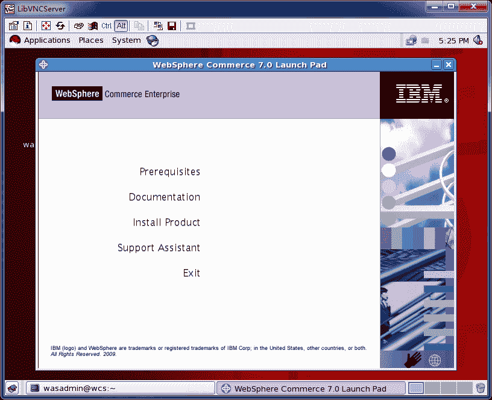
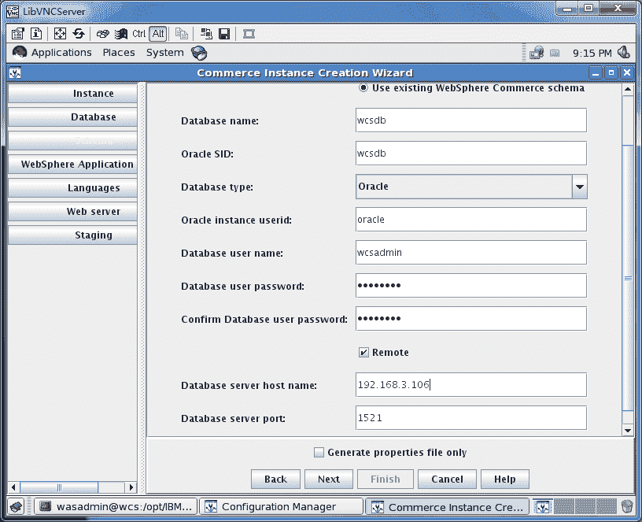

# 第 184 章 IBM WebSphere

## 1. WebSphere Commerce Engerprise 7.0

设置语言

```
# locale
LANG=en_US.UTF-8
LC_CTYPE="en_US.UTF-8"
LC_NUMERIC="en_US.UTF-8"
LC_TIME="en_US.UTF-8"
LC_COLLATE="en_US.UTF-8"
LC_MONETARY="en_US.UTF-8"
LC_MESSAGES="en_US.UTF-8"
LC_PAPER="en_US.UTF-8"
LC_NAME="en_US.UTF-8"
LC_ADDRESS="en_US.UTF-8"
LC_TELEPHONE="en_US.UTF-8"
LC_MEASUREMENT="en_US.UTF-8"
LC_IDENTIFICATION="en_US.UTF-8"
LC_ALL=

```

我使用英文 UTF-8,如需更改使用下面命令

```

LANG=xx_XX
export LANG

LC_ALL=xx_XX
export LC_ALL

echo $LANG

```

/etc/profile

```

export TMP=/tmp
export TMPDIR=/tmp
export ORACLE_BASE=/opt/oracle
export ORACLE_HOME=$ORACLE_BASE/product/11.2.0.1/client
export PATH=$ORACLE_HOME/bin:$PATH

export JAVA_HOME=/opt/IBM/WebSphere/AppServer/java
export CLASSPATH=$JAVA_HOME/lib:$JAVA_HOME/jre/lib:$CLASSPATH
export PATH=$PATH:$JAVA_HOME/bin:$JAVA_HOME/jre/bin:$HOMR/bin

```

/etc/hosts

```

echo "127.0.0.1    wcs.example.com" >> /etc/hosts

hostname wcs.example.com

# grep HOSTNAME  /etc/sysconfig/network
HOSTNAME=wcs.example.com

```

创建一个非 root 用户

```

adduser wcuser
echo "wcuser:passw0rd" | chpasswd

```

```

yum install -y compat-db libXp rpm-build elfutils elfutils-libs
./setup.sh

```

|  |

|  |

|  |

|  |

|  |

|  |

|  |

安装依赖软件，后 Back 在 Next 一次

```

rpm -ivh libXp-1.0.0-8.1.el5.i386.rpm libXp-1.0.0-8.1.el5.x86_64.rpm
# rpm -ivh compat-db*
Preparing...                ########################################### [100%]
   1:compat-db              ########################################### [ 50%]
   2:compat-db              ########################################### [100%]

```

|  |

|  |

|  |

|  |

忽略提示下一步

|  |

|  |

|  |

|  |

|  |

|  |

|  |

|  |

|  |

## 2. UpdateInstaller (AppServer, Plugins, IBMIHS)

```

# tar zxvf 7.0.0.11-ws-updi-linuxamd64.tar.gz
# UpdateInstaller/install

# cp *.pak /opt/IBM/WebSphere/UpdateInstaller/maintenance/

```

|  |

|  |

|  |

|  |

|  |

|  |

|  |

### 2.1. WAS

```

/opt/IBM/WebSphere/UpdateInstaller/update.sh

```

|  |

|  |

|  |

|  |

|  |

|  |

|  |

|  |

|  |

```
# grep Finish /opt/IBM/WebSphere/AppServer/logs/update/install/updatelog.txt
# /opt/IBM/WebSphere/AppServer/java/bin/java -version
java version "1.6.0"
Java(TM) SE Runtime Environment (build pxa6460sr7ifix-20100629_01(SR7+IZ69890+IZ70326+IZ68882))
IBM J9 VM (build 2.4, JRE 1.6.0 IBM J9 2.4 Linux amd64-64 jvmxa6460sr7-20100219_54097 (JIT enabled, AOT enabled)
J9VM - 20100219_054097
JIT  - r9_20091123_13891
GC   - 20100216_AA)
JCL  - 20091202_01

```

### 2.2. Plugins

```

/opt/IBM/WebSphere/UpdateInstaller/update.sh

```

|  |

|  |

|  |

|  |

|  |

|  |

|  |

### 2.3. IHS

```

/opt/IBM/WebSphere/UpdateInstaller/update.sh

```

|  |

|  |

|  |

|  |

|  |

|  |

|  |

### 2.4. backup

```
su - root
cp -i -r IBM IBM.pack
cp -i -r IBMIHS IBMIHS.pack

```

## 3. UpdateInstaller (CommerceServer70)

```
# unzip download.updii.7002.linux.amd64.zip
# UpdateInstaller/install
# cp 7.0.0-WS-WCServer-FP002.pak /opt/IBM/WebSphere/UpdateInstaller1/maintenance/

```

|  |

|  |

|  |

|  |

|  |

|  |

|  |

|  |

```

# /opt/IBM/WebSphere/CommerceServer70/bin/versionInfo.sh

```

## 4. WebSphere Commerce Engerprise 7.0 Feature Pack 2.iso

```
# unzip download.updii.7002.linux.amd64.zip
# UpdateInstaller/install
# cp 7.0.0-WS-WCServer-FP002.pak /opt/IBM/WebSphere/UpdateInstaller1/maintenance/

```

|  |

|  |

|  |

|  |

|  |

|  |

|  |

```

# /opt/IBM/WebSphere/CommerceServer70/bin/versionInfo.sh

```

## 5. creating a WebSphere Commerce instance

```

su - wcuser
./config_server.sh
./config_client.sh -protocol SSL&

```

|  |

|  |

|  |

|  |

|  |

|  |

|  |

|  |

|  |

|  |

|  |

备份操作

```

su - root
cp -i -r IBM IBM.instance
cp -i -r IBMIHS IBMIHS.instance

```

```
ls /opt/IBM/WebSphere/AppServer/profiles/demo/installedApps/WC_demo_cell/WC_demo.ear/xml/config/wc-server.xml

# ls /opt/IBM/WebSphere/CommerceServer70/instances/demo/httplogs/ | wc -l
0
# cat /opt/IBM/WebSphere/CommerceServer70/instances/demo/logs/createInstanceANT.err.log |wc -c
0
# grep error /opt/IBM/WebSphere/CommerceServer70/instances/demo/logs/trace.txt
# grep error /opt/IBM/WebSphere/CommerceServer70/instances/demo/logs/messages.txt
# cat /opt/IBM/WebSphere/CommerceServer70/logs/WCSconfig.log |wc -l

# su - oracle
exp wcuser/passw0rd@wcsdb file=/home/oracle/wcuser.dmp

```

Oracle 部分

```

create tablespace tablespaceName datafile 'dataFilePath'
   size 100M reuse autoextend on next 2M maxsize unlimited;
create user oracleUser identified by oraclePassword default tablespace tablespaceName;
grant create procedure, create session, create synonym, create table, create
   trigger, create view, create materialized view to oracleUser;
ALTER USER oracleUser QUOTA UNLIMITED ON tablespaceName;

```

```

cat >> /opt/oracle/product/11.2.0.1/client/network/admin/tnsnames.ora <<EOF
WCSDB =
  (DESCRIPTION =
    (ADDRESS_LIST =
      (ADDRESS = (PROTOCOL = TCP)(HOST = 192.168.3.50)(PORT = 1521))
    )
    (CONNECT_DATA =
      (SERVICE_NAME = wcsdb)
    )
  )
EOF

```

测试 tnsnames.ora

```
# sqlplus /nolog
SQL> conn wcuser/password@wcsdb
SQL> select * from site;

```

## 6. enableFeature

```
[root@wcs ~]# /opt/IBMIHS/bin/apachectl -k start -f /opt/IBM/WebSphere/CommerceServer70/instances/demo/httpconf/httpd.conf
[root@wcs ~]# su - wcuser
[wcuser@wcs bin]$ pwd
/opt/IBM/WebSphere/AppServer/profiles/demo/bin

[wcuser@wcs bin]$ ./startServer.sh server1
$ grep error /opt/IBM/WebSphere/AppServer/profiles/demo/logs/server1/startServer.log | wc -l
0

```

确认端口都工作正常

```
# netstat -nlp | grep "0 0.0.0.0:"
# netstat -nlp | egrep "httpd|java"
[root@wcs ~]# netstat -nlp | egrep "httpd|java" | egrep "0 192.168.3.198:|0 0.0.0.0:"

```

https://wcs.example.com:8002/adminconsole

|  |

https://wcs.example.com:8004/orgadminconsole

|  |

IBM Bug Oracle 默认端口是 50000，更改 oralce 端口密码 1521

```
# vim /opt/IBM/WebSphere/CommerceServer70/instances/demo/xml/demo.xml
# vim /opt/IBM/WebSphere/CommerceServer70/instances/demo/xml/demo.xml.bak

```

### 6.1. foundation

```

[root@wcs ~]# su - wcuser
[wcuser@wcs ~]$ cd /opt/IBM/WebSphere/CommerceServer70/bin/
[wcuser@wcs bin]$ ./config_ant.sh -buildfile /opt/IBM/WebSphere/CommerceServer70/components/common/xml/enableFeature.xml -DinstanceName=demo -DfeatureName=foundation -DdbUserPassword=passw0rd

[wcuser@wcs bin]$ egrep "error|Error|exception|Exception" ../instances/demo/logs/enablefoundation_2011.05.31_15.05.32.871.log

```

### 6.2. management-center

```

./config_ant.sh -buildfile /opt/IBM/WebSphere/CommerceServer70/components/common/xml/enableFeature.xml -DinstanceName=demo -DfeatureName=management-center -DdbUserPassword=passw0rd

egrep "error|Error|exception|Exception" ../instances/demo/logs/enablemanagement-center_2011.05.31_15.49.35.040.log
https://wcs.example.com:8000/lobtools

```

### 6.3. store-enhancements

```

./config_ant.sh -buildfile /opt/IBM/WebSphere/CommerceServer70/components/common/xml/enableFeature.xml -DinstanceName=demo -DfeatureName=store-enhancements -DdbUserPassword=passw0rd
[wcuser@wcs bin]$ egrep "error|Error|exception|Exception" ../instances/demo/logs/enablestore-enhancements_2011.05.31_16.28.23.659.log

```

### 6.4. checkEnablementStatus

```

[wcuser@wcs bin]$ ./checkEnablementStatus.sh -DinstanceName=demo -DdbUserPassword=passw0rd

```

### 6.5. check version

所有版本都应该是 7.0.0.11

```
/opt/IBM/WebSphere/AppServer/bin/versionInfo.sh
/opt/IBM/WebSphere/Plugins/bin/versionInfo.sh
/opt/IBMIHS/bin/versionInfo.sh

```

## 7. Start IBMIHS and AppServer

### 7.1. IBMIHS

Start IBMIHS

```
[root@wcs bin]$ /opt/IBMIHS/bin/apachectl -k start -f /opt/IBM/WebSphere/CommerceServer70/instances/demo/httpconf/httpd.conf

```

IHS 管理控制台

```
[root@wcs bin]$ /opt/IBMIHS/bin/adminctl start / stop

```

### 7.2. AppServer

Start AppServer

```

[wcuser@wcs bin]$ ./startServer.sh server1
ADMU0116I: Tool information is being logged in file
           /opt/IBM/WebSphere/AppServer/profiles/demo/logs/server1/startServer.log
ADMU0128I: Starting tool with the demo profile
ADMU3100I: Reading configuration for server: server1
ADMU3200I: Server launched. Waiting for initialization status.
ADMU3000I: Server server1 open for e-business; process id is 7869

[wcuser@wcs bin]$ ./stopServer.sh server1
ADMU0116I: Tool information is being logged in file
           /opt/IBM/WebSphere/AppServer/profiles/demo/logs/server1/stopServer.log
ADMU0128I: Starting tool with the demo profile
ADMU3100I: Reading configuration for server: server1
Realm/Cell Name: <default>
Username: configadmin
Password:
ADMU3201I: Server stop request issued. Waiting for stop status.
ADMU4000I: Server server1 stop completed.

```

### 7.3. Starting and stopping the WebSphere Commerce Information Center

To start the WebSphere Commerce Information Center, issue one of the following commands:

/opt/IBM/WebSphere/CommerceServer70/bin/startHelp.sh

```
[root@wcs ~]# su - wasadmin
[wasadmin@wcs ~]$ cd /opt/IBM/WebSphere/CommerceServer70/bin/
[wasadmin@wcs bin]$ ./startHelp.sh

```

To stop the WebSphere Commerce Information Center, issue one of the following commands:

```
[wasadmin@wcs bin]$ ./stopHelp.sh

```

http://wcs.example.com:8001/help/index.jsp

### 7.4. 管理入口

```
https://wcs.example.com:8000/lobtools
https://wcs.example.com:8000/accelerator
https://wcs.example.com:8002/adminconsole
https://wcs.example.com:8004/orgadminconsole
https://wcs.example.com:9063/ibm/console/logon.jsp (configadmin)

```

## 8. Initialization store

ExtendedSites-FEP.sar

|  |

|  |

|  |

|  |

|  |

|  |

|  |

MadisonsEnhancements.sar

|  |

|  |

|  |

|  |