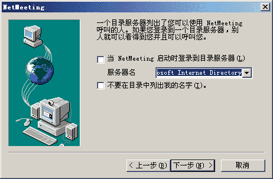
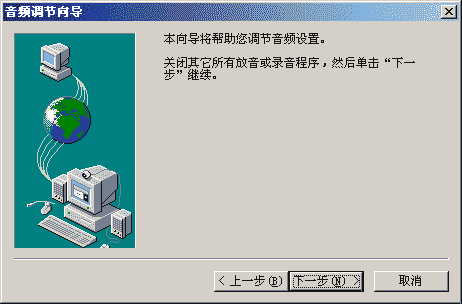
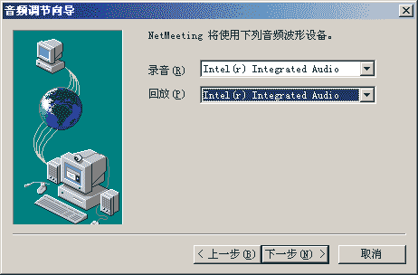
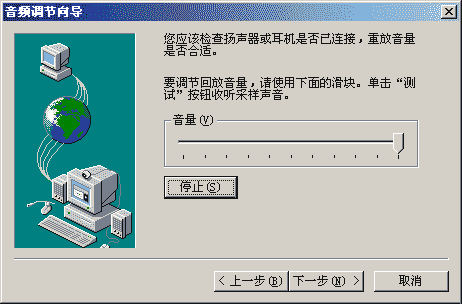
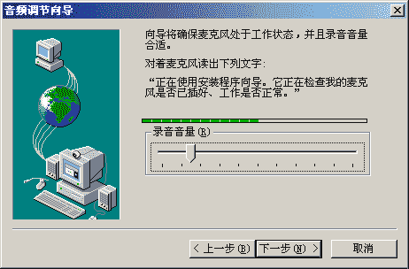
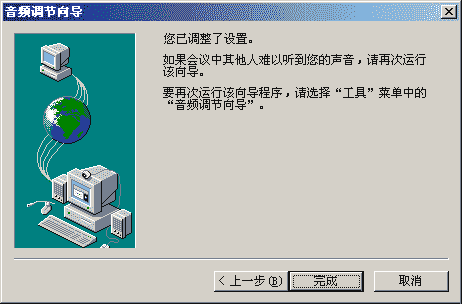
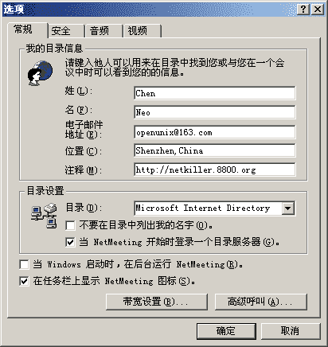
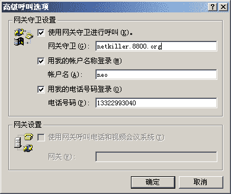

# 部分 XVI. Voice over IP

安装环境 ubuntu 13.10

## 第 193 章 Gnu Gatekeeper

http://www.gnugk.org/

## 1. Gnu Gatekeeper Install

```
sudo apt-get install gnugk
sudo apt-get install ohphone

```

start|stop|restart|force-reload

```
netkiller@shenzhen:~$ sudo /etc/init.d/gnugk
Usage: /etc/init.d/gnugk {start|stop|restart|force-reload}

```

Start

```
netkiller@shenzhen:~$ sudo /etc/init.d/gnugk start
Starting H.323 gatekeeper: gnugk.
netkiller@shenzhen:~$

netkiller@shenzhen:~$ sudo /etc/init.d/gnugk stop
Stopping H.323 gatekeeper: gnugk.
netkiller@shenzhen:~$

```

## 2. Gnu Gatekeeper Configure

gatekeeper.ini

```
[Gatekeeper::Main]
Fourtytwo=42
[GkStatus::Auth]
rule=allow

```

## 3. Gnu Gatekeeper Test

How do I test Gatekeeper

first, telnet tools

```
netkiller@shenzhen:~$ telnet 127.0.0.1 7000
Trying 127.0.0.1...
Connected to 127.0.0.1.
Escape character is '^]'.
Version:
Gatekeeper(GNU) Version(2.2.5) Ext(pthreads=1,radius=1,mysql=1,pgsql=1,firebird=1,large_fdset=0,crypto/ssl=1) Build(Feb  2 2007, 21:39:07) Sys(Linux i686 2.6.20-15-server)
GkStatus: Version(2.0) Ext()
Toolkit: Version(1.0) Ext(basic)
Startup: Fri, 09 Nov 2007 17:26:23 -0500   Running: 0 days 00:08:34
;

```

### 3.1. Part I - Microsoft Windows NetMeeting

Windows XP

Start NetMeeting

Start->Run->conf



Tools -> Option -> Advence



网关守卫设置



### 3.2. Part II - ohphone

For example:

netkiller

```
neo@machine1:~$ ohphone -l -a -u neo

```

neo

```
netkiller@machine2:~$ ohphone -u netkiller neo

```

## 第 194 章 OpenSIPS

### *OpenSER SIP Server 已经更名为 OpenSIPS*

OpenSER SIP Server 已经更名为 OpenSIPS

http://www.openser.org/ 域名将跳转至 [`www.opensips.org/`](http://www.opensips.org/)

## 1. 安装 OpenSIPS

### 1.1. centos 6.5 默认安装

centos 6.5 环境默认 opensips 包含如下软件包版本为 1.7

# yum search opensips

```
opensips-jabber.x86_64 : Gateway between OpenSIPS and a jabber server
opensips-mysql.x86_64 : MySQL Storage Support for the OpenSIPS
opensips-perl.x86_64 : Helps implement your own OpenSIPS extensions in Perl
opensips-postgresql.x86_64 : PostgreSQL Storage Support for the OpenSIPS
opensips-snmpstats.x86_64 : SNMP management interface for the OpenSIPS
opensips-tlsops.x86_64 : TLS-relating functions for the OpenSIPS
opensips-unixodbc.x86_64 : OpenSIPS unixODBC Storage support
opensips-xmpp.x86_64 : Gateway between OpenSIPS and a jabber server
opensips.x86_64 : Open Source SIP Server
opensips-aaa_radius.x86_64 : RADIUS backend for AAA api
opensips-acc.x86_64 : Accounts transactions information to different backends
opensips-auth_aaa.x86_64 : Performs authentication using an AAA server
opensips-auth_diameter.x86_64 : Performs authentication using a Diameter server
opensips-b2bua.x86_64 : Back-2-Back User Agent
opensips-carrierroute.x86_64 : Routing extension suitable for carriers
opensips-cpl-c.x86_64 : Call Processing Language interpreter
opensips-db_berkeley.x86_64 : Berkley DB backend support
opensips-db_http.x86_64 : HTTP DB backend support
opensips-event_datagram.x86_64 : Event datagram module
opensips-h350.x86_64 : H350 implementation
opensips-ldap.x86_64 : LDAP connector
opensips-mmgeoip.x86_64 : Wrapper for the MaxMind GeoIP API
opensips-peering.x86_64 : Radius peering
opensips-perlvdb.x86_64 : Perl virtual database engine
opensips-presence.x86_64 : Presence server
opensips-presence_callinfo.x86_64 : SIMPLE Presence extension
opensips-presence_dialoginfo.x86_64 : Extension to Presence server for Dialog-Info
opensips-presence_mwi.x86_64 : Extension to Presence server for Message Waiting Indication
opensips-presence_xcapdiff.x86_64 : Extension to Presence server for XCAP-DIFF event
opensips-presence_xml.x86_64 : SIMPLE Presence extension
opensips-pua.x86_64 : Offer the functionality of a presence user agent client
opensips-pua_bla.x86_64 : BLA extension for PUA
opensips-pua_dialoginfo.x86_64 : Dialog-Info extension for PUA
opensips-pua_mi.x86_64 : Connector between usrloc and MI interface
opensips-pua_usrloc.x86_64 : Connector between usrloc and pua modules
opensips-pua_xmpp.x86_64 : SIMPLE-XMPP Presence gateway
opensips-python.x86_64 : Python scripting support
opensips-regex.x86_64 : RegExp via PCRE library
opensips-rls.x86_64 : Resource List Server
opensips-seas.x86_64 : Transfers the execution logic control to a given external entity
opensips-sms.x86_64 : Gateway between SIP and GSM networks via sms
opensips-xcap_client.x86_64 : XCAP client

```

Version : 1.7.2

```
# yum info opensips
Loaded plugins: fastestmirror, presto, refresh-packagekit
Loading mirror speeds from cached hostfile
 * base: mirrors.hust.edu.cn
 * epel: mirrors.vinahost.vn
 * extras: mirrors.neusoft.edu.cn
 * updates: mirrors.tuna.tsinghua.edu.cn
Installed Packages
Name        : opensips
Arch        : x86_64
Version     : 1.7.2
Release     : 2.el6
Size        : 5.1 M
Repo        : installed
From repo   : epel
Summary     : Open Source SIP Server
URL         : http://opensips.org
License     : GPLv2+
Description : OpenSIPS or Open SIP Server is a very fast and flexible SIP (RFC3261)
            : proxy server. Written entirely in C, opensips can handle thousands calls
            : per second even on low-budget hardware. A C Shell like scripting language
            : provides full control over the server's behaviour. It's modular
            : architecture allows only required functionality to be loaded.
            : Currently the following modules are available: digest authentication,
            : CPL scripts, instant messaging, MySQL and UNIXODBC support, a presence agent,
            : radius authentication, record routing, an SMS gateway, a jabber gateway, a
            : transaction and dialog module, OSP module, statistics support,
            : registrar and user location.

```

安装 opensips

```
# yum install opensips

```

启动 opensips

```
# /etc/init.d/opensips start

```

### 1.2. 使用 yum.opensips.org 源安装

安装 yum.opensips.org 源

```
# rpm -ivh http://yum.opensips.org/1.10/releases/el/6/x86_64/opensips-yum-releases-1.10-1.el6.noarch.rpm
Retrieving http://yum.opensips.org/1.10/releases/el/6/x86_64/opensips-yum-releases-1.10-1.el6.noarch.rpm
warning: /var/tmp/rpm-tmp.M3Govv: Header V4 DSA/SHA1 Signature, key ID 5f2fbb7c: NOKEY
Preparing...                ########################################### [100%]
   1:opensips-yum-releases  ########################################### [100%]

```

查看版本，正确应该是 Version : 1.10.0

```
# yum info opensips
Loaded plugins: fastestmirror, presto, refresh-packagekit
Loading mirror speeds from cached hostfile
 * base: mirrors.hust.edu.cn
 * epel: mirrors.vinahost.vn
 * extras: mirrors.neusoft.edu.cn
 * updates: mirrors.tuna.tsinghua.edu.cn
Available Packages
Name        : opensips
Arch        : x86_64
Version     : 1.10.0
Release     : 1.el6
Size        : 5.5 M
Repo        : opensips
Summary     : Open Source SIP Server
URL         : http://opensips.org
License     : GPLv2+
Description : OpenSIPS or Open SIP Server is a very fast and flexible SIP (RFC3261)
            : proxy server. Written entirely in C, opensips can handle thousands calls
            : per second even on low-budget hardware. A C Shell like scripting language
            : provides full control over the server's behaviour. It's modular
            : architecture allows only required functionality to be loaded.
            : Currently the following modules are available: digest authentication,
            : CPL scripts, instant messaging, MySQL and UNIXODBC support, a presence agent,
            : radius authentication, record routing, an SMS gateway, a jabber gateway, a
            : transaction and dialog module, OSP module, statistics support,
            : registrar and user location.

```

该版本有如下软件包

```
opensips-jabber.x86_64 : Gateway between OpenSIPS and a jabber server
opensips-mysql.x86_64 : MySQL Storage Support for the OpenSIPS
opensips-perl.x86_64 : Helps implement your own OpenSIPS extensions in Perl
opensips-postgresql.x86_64 : PostgreSQL Storage Support for the OpenSIPS
opensips-snmpstats.x86_64 : SNMP management interface for the OpenSIPS
opensips-tlsops.x86_64 : TLS-relating functions for the OpenSIPS
opensips-unixodbc.x86_64 : OpenSIPS unixODBC Storage support
opensips-xmpp.x86_64 : Gateway between OpenSIPS and a jabber server
opensips-yum-releases.noarch : OpenSIPS 1.10 RPMs for el6 - Yum Repository Configuration
opensips.x86_64 : Open Source SIP Server
opensips-aaa_radius.x86_64 : RADIUS backend for AAA api
opensips-acc.x86_64 : Accounts transactions information to different backends
opensips-auth_aaa.x86_64 : Performs authentication using an AAA server
opensips-auth_diameter.x86_64 : Performs authentication using a Diameter server
opensips-b2bua.x86_64 : Back-2-Back User Agent
opensips-carrierroute.x86_64 : Routing extension suitable for carriers
opensips-cpl-c.x86_64 : Call Processing Language interpreter
opensips-db_berkeley.x86_64 : Berkley DB backend support
opensips-db_http.x86_64 : HTTP DB backend support
opensips-db_perlvdb.x86_64 : Perl virtual database engine
opensips-event_datagram.x86_64 : Event datagram module
opensips-event_rabbitmq.x86_64 : Event RabbitMQ module
opensips-event_route.x86_64 : Route triggering based on events
opensips-event_xmlrpc.x86_64 : Event XMLRPC client module
opensips-h350.x86_64 : H350 implementation
opensips-httpd.x86_64 : HTTP transport layer implementation
opensips-json.x86_64 : A JSON variables within the script
opensips-ldap.x86_64 : LDAP connector
opensips-memcached.x86_64 : Memcached connector
opensips-mmgeoip.x86_64 : Wrapper for the MaxMind GeoIP API
opensips-peering.x86_64 : Radius peering
opensips-perlvdb.x86_64 : Perl virtual database engine
opensips-pi_http.x86_64 : Provisioning Interface module
opensips-presence.x86_64 : Presence server
opensips-presence_callinfo.x86_64 : SIMPLE Presence extension
opensips-presence_dialoginfo.x86_64 : Extension to Presence server for Dialog-Info
opensips-presence_mwi.x86_64 : Extension to Presence server for Message Waiting Indication
opensips-presence_xcapdiff.x86_64 : Extension to Presence server for XCAP-DIFF event
opensips-presence_xml.x86_64 : SIMPLE Presence extension
opensips-pua.x86_64 : Offer the functionality of a presence user agent client
opensips-pua_bla.x86_64 : BLA extension for PUA
opensips-pua_dialoginfo.x86_64 : Dialog-Info extension for PUA
opensips-pua_mi.x86_64 : Connector between usrloc and MI interface
opensips-pua_usrloc.x86_64 : Connector between usrloc and pua modules
opensips-pua_xmpp.x86_64 : SIMPLE-XMPP Presence gateway
opensips-python.x86_64 : Python scripting support
opensips-redis.x86_64 : Redis connector
opensips-regex.x86_64 : RegExp via PCRE library
opensips-rest_client.x86_64 : Implementation of an HTTP client
opensips-rls.x86_64 : Resource List Server
opensips-seas.x86_64 : Transfers the execution logic control to a given external entity
opensips-sms.x86_64 : Gateway between SIP and GSM networks via sms
opensips-xcap.x86_64 : XCAP API provider
opensips-xcap_client.x86_64 : XCAP client
opensips-xmlrpc.x86_64 : A xmlrpc server

```

安装 opensips

```
yum install opensips

```

安装认证数据库,选择其中一种

```
yum install opensips-mysql
yum install opensips-postgresql
yum install opensips-db_berkeley

```

配置监听地址

```
# vim opensips.cfg
#listen=udp:127.0.0.1:5060   # CUSTOMIZE ME
listen=udp:192.168.6.9:5060   # 注释上面一行，新增一行

```

启动 opensips

```
service opensips start

```

查看 UDP 端口

```
# netstat -lnu | grep 5060
udp        0      0 192.168.6.9:5060            0.0.0.0:*

```

### 1.3. 编译安装

centos 环境

```
# cd /usr/local/src
# wget http://opensips.org/pub/opensips/1.10.0/src/opensips-1.10_src.tar.gz
# tar zxf opensips-1.10_src.tar.gz

```

## 2. 数据库部署

你只能选择其中一种作为 opensips 的数据库

### 2.1. DBTEXT

配置数据库

```

# vim /etc/opensips/opensipsctlrc
DBENGINE=DBTEXT
DB_PATH="/etc/opensips/dbtext"
ETCDIR="/etc/opensips"

```

创建数据库

```
# opensipsdbctl create
INFO: creating DBTEXT tables at: /etc/opensips/dbtext ...
Install presence related tables? (y/n): y
INFO: creating DBTEXT presence tables at: /etc/opensips/dbtext ...
Install tables for imc cpl siptrace domainpolicy carrierroute userblacklist? (y/n): y
INFO: creating DBTEXT extra tables at: /etc/opensips/dbtext ...

```

### 2.2. MySQL

# vim /etc/opensips/opensipsctlrc

```
SIP_DOMAIN=opensips.org
DBENGINE=MYSQL
DBHOST=localhost
DBNAME=opensips
DBRWUSER=opensips
DBRWPW="opensipsrw"
USERCOL="username"
ETCDIR="/etc/opensips"

```

创建数据库

```
# opensipsdbctl create
MySQL password for root:
INFO: test server charset
WARNING: Your current default mysql characters set cannot be used to create DB. Please choice another one from the following list:
big5
dec8
cp850
hp8
koi8r
latin1
latin2
swe7
ascii
ujis
sjis
hebrew
tis620
euckr
koi8u
gb2312
greek
cp1250
gbk
latin5
armscii8
cp866
keybcs2
macce
macroman
cp852
latin7
cp1251
utf16
cp1256
cp1257
utf32
binary
geostd8
cp932
eucjpms
Enter character set name:
latin1
INFO: creating database opensips ...
INFO: Core OpenSIPS tables succesfully created.
Install presence related tables? (y/n): y
INFO: creating presence tables into opensips ...
INFO: Presence tables succesfully created.
Install tables for imc cpl siptrace domainpolicy carrierroute userblacklist registrant? (y/n): y
INFO: creating extra tables into opensips ...
INFO: Extra tables succesfully created.

```

提示 Enter character set name: 时输入 latin1 其余选项输入‘y’

测试创建用户

```
# opensipsctl add 1001 123456
new user '1001' added

```

### 2.3. PGSQL

# vim /etc/opensips/opensipsctlrc

```
SIP_DOMAIN=opensips.org
DBENGINE=PGSQL
DBHOST=localhost
DBNAME=opensips
DBRWUSER=opensips
DBRWPW="opensipsrw"
USERCOL="username"
ETCDIR="/etc/opensips"

```

### 2.4. Berkeley DB

```
# grep -v ^# opensipsctlrc | grep -v ^$
SIP_DOMAIN=opensips.org
DBENGINE=DB_BERKELEY
DB_PATH="/etc/opensips/bdb"
USERCOL="username"
ETCDIR="/etc/opensips"

```

```
# opensipsdbctl create
which: no db4.4_dump in (/usr/local/sbin:/usr/local/bin:/sbin:/bin:/usr/sbin:/usr/bin:/root/bin:/usr/sbin//:/usr/sbin//:/usr/sbin/:/usr/local/BerkeleyDB.4.6/bin)
which: no db4.5_dump in (/usr/local/sbin:/usr/local/bin:/sbin:/bin:/usr/sbin:/usr/bin:/root/bin:/usr/sbin//:/usr/sbin//:/usr/sbin/:/usr/local/BerkeleyDB.4.6/bin)
which: no db4.6_dump in (/usr/local/sbin:/usr/local/bin:/sbin:/bin:/usr/sbin:/usr/bin:/root/bin:/usr/sbin//:/usr/sbin//:/usr/sbin/:/usr/local/BerkeleyDB.4.6/bin)
which: no db4.7_dump in (/usr/local/sbin:/usr/local/bin:/sbin:/bin:/usr/sbin:/usr/bin:/root/bin:/usr/sbin//:/usr/sbin//:/usr/sbin/:/usr/local/BerkeleyDB.4.6/bin)
which: no db4.8_dump in (/usr/local/sbin:/usr/local/bin:/sbin:/bin:/usr/sbin:/usr/bin:/root/bin:/usr/sbin//:/usr/sbin//:/usr/sbin/:/usr/local/BerkeleyDB.4.6/bin)
which: no db4.4_load in (/usr/local/sbin:/usr/local/bin:/sbin:/bin:/usr/sbin:/usr/bin:/root/bin:/usr/sbin//:/usr/sbin//:/usr/sbin/:/usr/local/BerkeleyDB.4.6/bin)
which: no db4.5_load in (/usr/local/sbin:/usr/local/bin:/sbin:/bin:/usr/sbin:/usr/bin:/root/bin:/usr/sbin//:/usr/sbin//:/usr/sbin/:/usr/local/BerkeleyDB.4.6/bin)
which: no db4.6_load in (/usr/local/sbin:/usr/local/bin:/sbin:/bin:/usr/sbin:/usr/bin:/root/bin:/usr/sbin//:/usr/sbin//:/usr/sbin/:/usr/local/BerkeleyDB.4.6/bin)
which: no db4.7_load in (/usr/local/sbin:/usr/local/bin:/sbin:/bin:/usr/sbin:/usr/bin:/root/bin:/usr/sbin//:/usr/sbin//:/usr/sbin/:/usr/local/BerkeleyDB.4.6/bin)
which: no db4.8_load in (/usr/local/sbin:/usr/local/bin:/sbin:/bin:/usr/sbin:/usr/bin:/root/bin:/usr/sbin//:/usr/sbin//:/usr/sbin/:/usr/local/BerkeleyDB.4.6/bin)
INFO: creating Berkeley DB database at: [/etc/opensips/bdb]
Install presence related tables? (y/n): y
Install tables for imc cpl siptrace domainpolicy carrierroute userblacklist registrant? (y/n): y

```

```
opensipsctl start

```

## 3. 测试 opensips

首先创建一些账号

```
# opensipsctl add 1002 123456
new user '1002' added

# opensipsctl add 1003 123456
new user '1003' added

# opensipsctl add 1004 123456
new user '1004' added

# opensipsctl add 1005 123456
new user '1005' added

```

下载 Linphone [`www.linphone.org/eng/download/packages/linphone-3.7.0.html`](http://www.linphone.org/eng/download/packages/linphone-3.7.0.html)登陆 Opensips

服务器端查看登陆情况

```
# opensipsctl online
1001
1002

```

## 第 195 章 PBX

## 1. Asterisk (OpenSource Linux PBX that supports both SIP and H.323)

http://www.asteriskpbx.com/

```
netkiller@shenzhen:~$ apt-cache search Asterisk
asterisk-app-dtmftotext - Text entry application for Asterisk
asterisk-app-fax - Softfax application for Asterisk
asterisk-app-misdn-v110 - V.110 protocol handler for Asterisk
asterisk-chan-capi - Common ISDN API 2.0 implementation for Asterisk
asterisk-chan-misdn - mISDN support for Asterisk
asterisk-oh323 - oh323 channel driver for Asterisk
asterisk-prompt-de - German voice prompts for the Asterisk PBX
asterisk-prompt-es-co - Colombian Spanish voice prompts for Asterisk
asterisk-prompt-fr - French voice prompts for Asterisk
asterisk-prompt-it - Italian voice prompts for the Asterisk PBX
asterisk-prompt-se - Swedish voice prompts for Asterisk
asterisk-rate-engine - Asterisk least cost routing module
asterisk-sounds-extra - Additional sound files for the Asterisk PBX
destar - management interface for the Asterisk PBX
gastman - GUI tool for Asterisk administration and monitoring
iaxmodem - software modem with IAX2 connectivity
kiax - IAX VoIP softphone
libiax-dev - implementation of the Inter-Asterisk eXchange protocol (devel)
libiax0 - implementation of the Inter-Asterisk eXchange protocol
op-panel - switchboard type application for the Asterisk PBX
asterisk-prompt-es - Spanish prompts for the Asterisk PBX
asterisk - Open Source Private Branch Exchange (PBX)
asterisk-bristuff - Open Source Private Branch Exchange (PBX) - BRIstuff-enabled version
asterisk-classic - Open Source Private Branch Exchange (PBX) - original Digium version
asterisk-config - config files for asterisk
asterisk-dev - development files for asterisk
asterisk-doc - documentation for asterisk
asterisk-h323 - asterisk H.323 VoIP channel
asterisk-sounds-main - sound files for asterisk
asterisk-web-vmail - Web-based (CGI) voice mail interface for Asterisk
netkiller@shenzhen:~$

```

## 2. FreeSWITCH

[`www.freeswitch.org/`](https://www.freeswitch.org/)

## 3. Yate - Yet Another Telephony Engine (includes SIP to H.323 translation)

http://yate.null.ro/pmwiki/

## 第 196 章 VOCAL (includes a SIP to H.323 translator)

http://www.vovida.org/

## 第 197 章 SIP/H.323 客户端

## 1. linphone

http://www.linphone.org

## 2. Yate Client

http://yateclient.yate.ro/