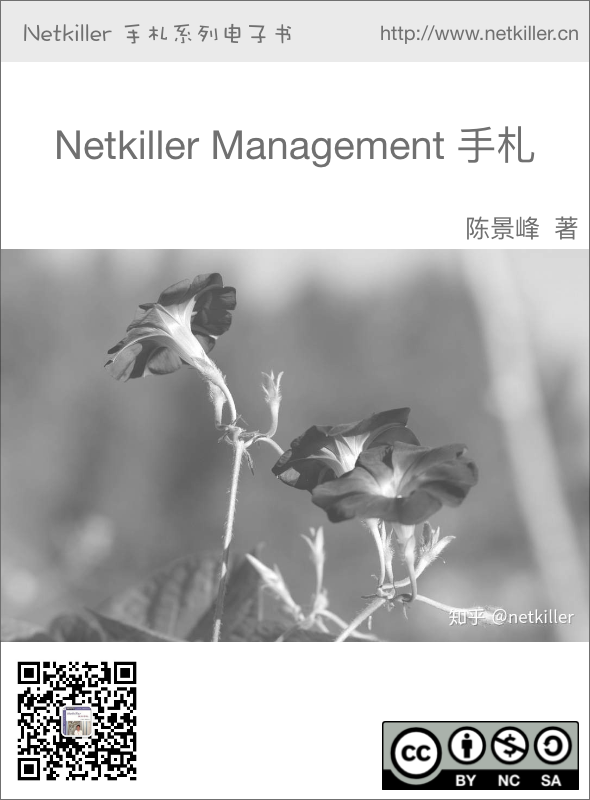

# 自述

|  |

目前技术书籍的价格一路飙升，动则￥80，￥100，少则￥50，￥60\. 技术书籍有时效性，随着技术的革新或淘汰，大批书记成为废纸垃圾。并且这些书技术内容雷同，相互抄袭，质量越来越差，甚至里面给出的例子错误百出，只能购买影印版，或者翻译的版本。

在这种背景下我便萌生了自己写书的想法，资料主要来源是我的笔记与例子。我并不想出版，只为分享，所有我制作了基于 CC License 发行的系列电子书。

本书注重例子，少理论（捞干货），只要你对着例子一步一步操作，就会成功，会让你有成就感并能坚持学下去，因为很多人遇到障碍就会放弃，其实我就是这种人，只要让他看到希望，就能坚持下去。

## 1. 写给读者

*为什么写这篇文章*

有很多想法,工作中也用不到所以未能实现，所以想写出来,和大家分享.有一点写一点,写得也不好,只要能看懂就行,就当学习笔记了.

开始零零碎碎写过一些文档，也向维基百科供过稿，但维基经常被 ZF 封锁，后来发现 sf.net 可以提供主机存放文档，便做了迁移。并开始了我的写作生涯。

这篇文档是作者 20 年来对工作的总结,是作者一点一滴的积累起来的，有些笔记已经丢失，所以并不完整。

因为工作太忙整理比较缓慢。目前的工作涉及面比较窄所以新文档比较少。

我现在花在技术上的时间越来越少，兴趣转向摄影，无线电。也想写写摄影方面的心得体会。

*写作动力:*

曾经在网上看到外国开源界对中国的评价，中国人对开源索取无度，但贡献却微乎其微.这句话一直记在我心中，发誓要为中国开源事业做我仅有的一点微薄贡献

另外写文档也是知识积累，还可以增加在圈内的影响力.

人跟动物的不同,就是人类可以把自己学习的经验教给下一代人.下一代在上一代的基础上再创新,不断积累才有今天.

所以我把自己的经验写出来,可以让经验传承

*没有内容的章节:*

目前我自己一人维护所有文档，写作时间有限，当我发现一个好主题就会加入到文档中，待我有时间再完善章节，所以你会发现很多章节是空无内容的.

文档目前几乎是流水帐试的写作，维护量很大，先将就着看吧.

| 我想到哪写到哪,你会发现文章没一个中心,今天这里写点,明天跳过本章写其它的. |
| 文中例子绝对多,对喜欢复制然后粘贴朋友很有用,不用动手写,也省时间. |
| 理论的东西,网上大把,我这里就不写了,需要可以去网上查. |
| 我爱写错别字,还有一些是打错的,如果发现请指正. |
| 文中大部分试验是在 Debian/Ubuntu/Redhat AS 上完成. |

写给读者

| 至读者： |
| 我不知道什么时候，我不再更新文档或者退出 IT 行业去从事其他工作，我必须给这些文档找一个归宿，让他能持续更新下去。 |
| 我想捐赠给某些基金会继续运转，或者建立一个团队维护它。 |
| 我用了 20 年时间坚持不停地写作，持续更新，才有今天你看到的《Netkiller 手扎》系列文档，在中国能坚持 20 年，同时没有任何收益的技术类文档，是非常不容易的。 |
| 有很多时候想放弃，看到外国读者的支持与国内社区的影响，我坚持了下来。 |
| 中国开源事业需要各位参与，不要成为局外人，不要让外国人说：中国对开源索取无度，贡献却微乎其微。 |
| 我们参与内核的开发还比较遥远，但是进个人能力，写一些文档还是可能的。 |

系列文档

下面是我多年积累下来的经验总结，整理成文档供大家参考:

| Netkiller Architect 手札 |
| Netkiller Developer 手札 |
| Netkiller PHP 手札 |
| Netkiller Python 手札 |
| Netkiller Testing 手札 |
| Netkiller Cryptography 手札 |
| Netkiller Linux 手札 |
| Netkiller FreeBSD 手札 |
| Netkiller Shell 手札 |
| Netkiller Security 手札 |
| Netkiller Web 手札 |
| Netkiller Monitoring 手札 |
| Netkiller Storage 手札 |
| Netkiller Mail 手札 |
| Netkiller Docbook 手札 |
| Netkiller Version 手札 |
| Netkiller Database 手札 |
| Netkiller PostgreSQL 手札 |
| Netkiller MySQL 手札 |
| Netkiller NoSQL 手札 |
| Netkiller LDAP 手札 |
| Netkiller Network 手札 |
| Netkiller Cisco IOS 手札 |
| Netkiller H3C 手札 |
| Netkiller Multimedia 手札 |
| Netkiller Management 手札 |
| Netkiller Spring 手札 |
| Netkiller Perl 手札 |
| Netkiller Amateur Radio 手札 |

## 2. 作者简介

陈景峯 ([ㄔㄣ ㄐ丨ㄥ ㄈㄥ](http://zh.wikipedia.org/wiki/%E6%B3%A8%E9%9F%B3%E7%AC%A6%E8%99%9F))

Nickname：netkiller | English name: Neo chen | Nippon name: ちんけいほう (音訳) | Korean name: 천징봉 | Thailand name: ภูมิภาพภูเขา | Vietnam: Trần Cảnh Phong

Callsign: [BG7NYT](http://www.qrz.com/db/BG7NYT) | QTH: ZONE CQ24 ITU44 ShenZhen, China

程序猿，攻城狮，挨踢民工, Full Stack Developer, UNIX like Evangelist, 业余无线电爱好者（呼号：BG7NYT）,户外运动，山地骑行以及摄影爱好者。

《Netkiller 系列 手札》的作者

成长阶段

1981 年 1 月 19 日(庚申年腊月十四)出生于黑龙江省青冈县建设乡双富大队第一小队

1989 年 9 岁随父母迁居至黑龙江省伊春市，悲剧的天朝教育，不知道那门子归定，转学必须降一级，我本应该上一年级，但体制让我上学前班，那年多都 10 岁了

1995 年小学毕业，体制规定借读要交 3000 两银子(我曾想过不升初中)，亲戚单位分楼告别平房，楼里没有地方放东西，把 2 麻袋书送给我，无意中发现一本电脑书 BASIC 语言，我竟然看懂了，对于电脑知识追求一发而不可收，后面顶零花钱，压岁钱主要用来买电脑书《MSDOS 6.22》《新编 Unix 实用大全》《跟我学 Foxbase》。。。。。。

1996 年第一次接触 UNIX 操作系统，BSD UNIX, Microsoft Xinux(盖茨亲自写的微软 Unix，知道的人不多)

1997 年自学 Turbo C 语言，苦于没有电脑，后来学校建了微机室才第一次使用 QBASIC(DOS 6.22 自带命令)，那个年代只能通过软盘拷贝转播，Trubo C 编译器始终没有搞到，

1997 年第一次上 Internet 网速只有 9600Bps, 当时全国兴起各种信息港域名格式是 www.xxxx.info.net, 访问的第一个网站是 NASA 下载了很多火星探路者拍回的照片，还有“淞沪”sohu 的前身

1998~2000 年在哈尔滨学习计算机，充足的上机时间，但老师让我们练打字（明伦五笔/WT）打字不超过 80 个/每分钟还要强化训练，不过这个给我的键盘功夫打了好底。

1999 年学校的电脑终于安装了光驱，在一张工具盘上终于找到了 Turbo C, Borland C++与 Quick Basic 编译器，当时对 VGA 图形编程非常感兴趣，通过 INT33 中断控制鼠标，使用绘图函数模仿 windows 界面。还有操作 UCDOS 中文字库，绘制矢量与点阵字体。

2000 年沉迷于 Windows NT 与 Back Office 各种技术，神马主域控制器，DHCP，WINS，IIS，域名服务器，Exchange 邮件服务器，MS Proxy, NetMeeting...以及 ASP+MS SQL 开发；用 56K 猫下载了一张 LINUX。ISO 镜像，安装后我兴奋的 24 小时没有睡觉。

职业生涯

2001 年来深圳进城打工,成为一名外来务工者. 在一个 4 人公司做 PHP 开发，当时 PHP 的版本是 2.0, 开始使用 Linux Redhat 6.2.当时很多门户网站都是用 FreeBSD,但很难搞到安装盘，在网易社区认识了一个网友,从广州给我寄了一张光盘，FreeBSD 3.2

2002 年我发现不能埋头苦干,还要学会"做人".后辗转广州工作了半年，考了一个 Cisco CCNA 认证。回到深圳重新开始，在车公庙找到一家工作做 Java 开发

2003 年这年最惨,公司拖欠工资 16000 元,打过两次官司 2005 才付清.

2004 年开始加入[分布式计算](http://www.equn.com/)团队,目前成绩，工作仍然是 Java 开发并且开始使用 PostgreSQL 数据库。

2004-10 月开始玩户外和摄影

2005-6 月成为中国无线电运动协会会员,呼号 BG7NYT,进了一部 Yaesu FT-60R 手台。公司的需要转回 PHP 与 MySQL，相隔几年发现 PHP 进步很大。在前台展现方面无人能敌，于是便前台使用 PHP，后台采用 Java 开发。

2006 年单身生活了这么多年,终于找到归宿. 工作更多是研究 PHP 各种框架原理

2007 物价上涨,金融危机，休息了 4 个月（其实是找不到工作）,关外很难上 439.460 中继，搞了一台 Yaesu FT-7800.

2008 终于找到英文学习方法， 《Netkiller Developer 手札》，《Netkiller Document 手札》

2008-8-8 08:08:08 结婚,后全家迁居湖南省常德市

2009《Netkiller Database 手札》,2009-6-13 学车，年底拿到 C1 驾照

2010 对电子打击乐产生兴趣，计划学习爵士鼓。由于我对 Linux 热爱，我轻松的接管了公司的运维部，然后开发运维两把抓。我印象最深刻的是公司一次上架 10 个机柜，我们用买服务器纸箱的钱改善伙食。我将 40 多台服务器安装 BOINC 做压力测试，获得了中国第二的名次。

2011 平凡的一年，户外运动停止，电台很少开，中继很少上，摄影主要是拍女儿与家人，年末买了一辆山地车

2012 对油笔画产生了兴趣，活动基本是骑行银湖山绿道，

2013 开始学习民谣吉他，同时对电吉他也极有兴趣；最终都放弃了。这一年深圳开始推数字中继 2013-7-6 日入手 Motorola MOTOTRBO XIR P8668，Netkiller 系列手札从 Sourceforge 向 Github 迁移；年底对 MYSQL UDF，Engine 与 PHP 扩展开发产生很浓的兴趣，拾起遗忘 10+年的 C，写了几个 mysql 扩展（图片处理，fifo 管道与 ZeroMQ），10 月份入 Toyota Rezi 2.5V 并写了一篇《攻城狮的苦逼选车经历》

2014-9-8 在淘宝上买了一架电钢琴 Casio Privia PX-5S pro 开始陪女儿学习钢琴，由于这家钢琴是合成器电钢，里面有打击乐，我有对键盘鼓产生了兴趣。

2014-10-2 号罗浮山两日游，对中国道教文化与音乐产生了兴趣，10 月 5 号用了半天时间学会了简谱。10 月 8 号入 Canon 5D Mark III + Canon Speedlite 600EX-RT 香港过关被查。

2014-12-20 号对乐谱制作产生兴趣（https://github.com/SheetMusic/Piano），给女儿做了几首钢琴伴奏曲，MuseScore 制谱然后生成 MIDI 与 WAV 文件。

2015-09-01 晚饭后拿起爵士鼓基础教程尝试在 Casio Privia PX-5S pro 演练，经过反复琢磨加上之前学钢琴的乐理知识，终于在 02 号晚上，打出了简单的基本节奏，迈出了第一步。

2016 对弓箭（复合弓）产生兴趣，无奈兲朝法律法规不让玩。每周游泳轻松 1500 米无压力，年底入 xbox one s 和 Yaesu FT-2DR, 同时开始关注功放音响这块

2017 7 月 9 号入 Yamaha RX-V581 功放一台，连接 Xbox 打游戏爽翻了，入 Kindle 电子书，计划学习蝶泳，果断放弃运维和开发知识体系转攻区块链。

2018 从溪山美地搬到半岛城邦，丢弃了多年攒下的家底。11 月开始玩 MMDVM，使用 Yaesu FT-7800 发射，连接 MMDVM 中继板，树莓派，覆盖深圳湾，散步骑车通联两不误。

2019 卖了常德的房子，住了 5 次院，哮喘反复发作，决定停止电子书更新，兴趣转到知乎，B 站

2020 准备找工作

职业生涯路上继续打怪升级

## 3. 如何获得文档

下载 Netkiller 手札 (epub,kindle,chm,pdf)

| [Netkiller 手札 2020 版](https://github.com/netkiller/netkiller.github.io/tree/master/download/2020) |
| [Netkiller 手札 2019 版](https://github.com/netkiller/netkiller.github.io/tree/master/download/2019) |
| [Netkiller 手札 2018 版](https://github.com/netkiller/netkiller.github.io/tree/master/download/2018) |
| [Netkiller 手札 2017 版](https://github.com/netkiller/netkiller.github.io/tree/master/download/2017) |
| [Netkiller 手札 2017 版](http://www.netkiller.cn/download/2017/) |

通过 GIT 镜像整个网站

[`github.com/netkiller/netkiller.github.com.git`](https://github.com/netkiller/netkiller.github.com.git)

$ git clone https://github.com/netkiller/netkiller.github.com.git

镜像下载

整站下载

```

wget -m http://www.netkiller.cn/index.html			

```

指定下载

```

wget -m wget -m http://www.netkiller.cn/linux/index.html			

```

Yum 下载文档

获得光盘介质，RPM 包，DEB 包，如有特别需要，请联系我

YUM 在线安装电子书

[`netkiller.sourceforge.net/pub/repo/`](http://netkiller.sourceforge.net/pub/repo/)

```

# cat >> /etc/yum.repos.d/netkiller.repo <<EOF
[netkiller]
name=Netkiller Free Books
baseurl=http://netkiller.sourceforge.net/pub/repo/
enabled=1
gpgcheck=0
gpgkey=
EOF

```

查找包

```

# yum search netkiller

netkiller-centos.x86_64 : Netkiller centos Cookbook
netkiller-cryptography.x86_64 : Netkiller cryptography Cookbook
netkiller-docbook.x86_64 : Netkiller docbook Cookbook
netkiller-linux.x86_64 : Netkiller linux Cookbook
netkiller-mysql.x86_64 : Netkiller mysql Cookbook
netkiller-php.x86_64 : Netkiller php Cookbook
netkiller-postgresql.x86_64 : Netkiller postgresql Cookbook
netkiller-python.x86_64 : Netkiller python Cookbook
netkiller-version.x86_64 : Netkiller version Cookbook	

```

安装包

```

yum install netkiller-docbook

```

## 4. 打赏（Donations）

If you like this documents, please make a donation to support the authors' efforts. Thank you!

您可以通过微信，支付宝，贝宝给作者打赏。

银行(Bank)

招商银行(China Merchants Bank)

开户名：陈景峰

账号：9555500000007459

微信（Wechat）

|  |

支付宝（Alipay）

|  |

PayPal Donations

[`www.paypal.me/netkiller`](https://www.paypal.me/netkiller)

## 5. 联系方式

主站 [`www.netkiller.cn/`](http://www.netkiller.cn/)

备用 [`netkiller.github.io/`](http://netkiller.github.io/)

繁体网站 [`netkiller.sourceforge.net/`](http://netkiller.sourceforge.net/)

联系作者

Mobile: +86 13113668890

Email: netkiller@msn.com

QQ 群: 128659835 请注明“读者”

QQ: 13721218

ICQ: 101888222

注：请不要问我安装问题！

博客 Blogger

知乎专栏 [`zhuanlan.zhihu.com/netkiller`](https://zhuanlan.zhihu.com/netkiller)

LinkedIn: [`cn.linkedin.com/in/netkiller`](http://cn.linkedin.com/in/netkiller)

OSChina: [`my.oschina.net/neochen/`](http://my.oschina.net/neochen/)

Facebook: [`www.facebook.com/bg7nyt`](https://www.facebook.com/bg7nyt)

Flickr: [`www.flickr.com/photos/bg7nyt/`](http://www.flickr.com/photos/bg7nyt/)

Disqus: [`disqus.com/netkiller/`](http://disqus.com/netkiller/)

solidot: [`solidot.org/~netkiller/`](http://solidot.org/~netkiller/)

SegmentFault: [`segmentfault.com/u/netkiller`](https://segmentfault.com/u/netkiller)

Reddit: [`www.reddit.com/user/netkiller/`](https://www.reddit.com/user/netkiller/)

Digg: [`www.digg.com/netkiller`](http://www.digg.com/netkiller)

Twitter: [`twitter.com/bg7nyt`](http://twitter.com/bg7nyt)

weibo: [`weibo.com/bg7nyt`](http://weibo.com/bg7nyt)

Xbox club

我的 xbox 上的 ID 是 netkiller xbox，我创建了一个俱乐部 netkiller 欢迎加入。

Radio

CQ CQ CQ DE BG7NYT:

如果这篇文章对你有所帮助,请寄给我一张 QSL 卡片, [qrz.cn](http://www.qrz.cn/call/?callsign=bg7nyt) or [qrz.com](http://www.qrz.com/callsign?callsign=bg7nyt) or [hamcall.net](http://hamcall.net/call?callsign=bg7nyt)

Personal Amateur Radiostations of P.R.China

ZONE CQ24 ITU44 ShenZhen, China

Best Regards, VY 73! OP. BG7NYT

守听频率 DMR 438.460 -8 Color 12 Slot 2 Group 46001

守听频率 C4FM 439.360 -5 DN/VW

MMDVM Hotspot:

Callsign: BG7NYT QTH: Shenzhen, China

YSF: YSF80337 - CN China 1 - W24166/TG46001

DMR: BM_China_46001 - DMR Radio ID: 4600441