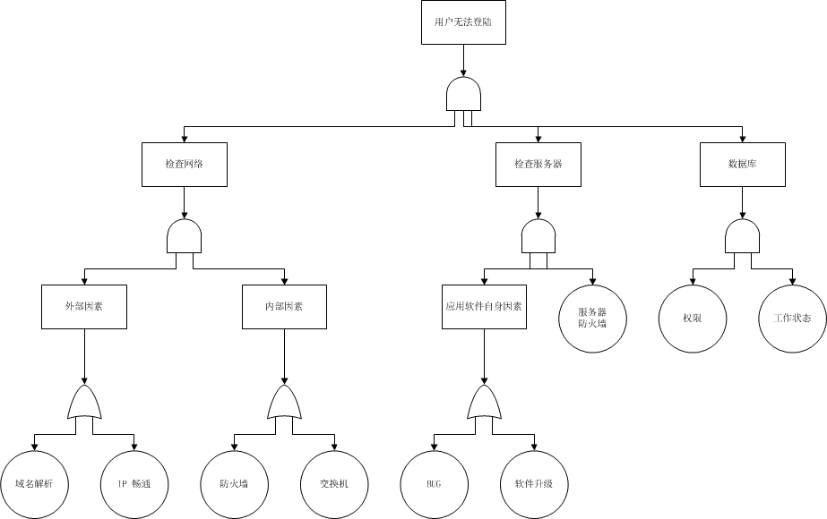
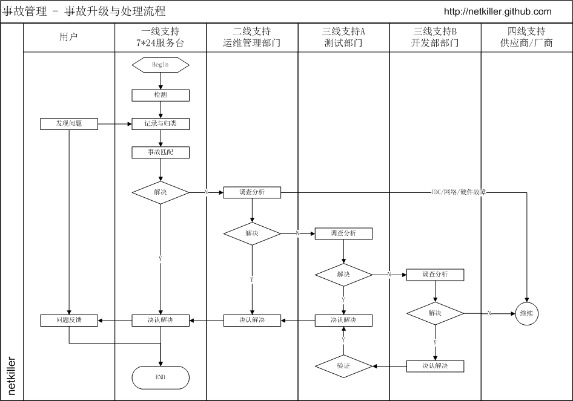

# 部分 I. 软件项目管理篇

这里讲述项目管理的基本知识与方法，软件项目管理与传统行业项目管理最大的区别可能是知识型人才的管理。所谓管理大可分为两类，一类是着重考察项目过程本身，一类是主要考察项目的参与者，前者着重于时间管理，后者倾向于绩效考核。

学习管理你千万不能陷入到管理学领域，很多管理者陷入一个误区，试图寻找一种管理工具(非软件，这里指的是管理方法)，通过工具解决项目管理问题。

管理软件开发团队，你只需要 20%的管理学知识，更多的是对技术的掌握。

## 1. 敏捷开发

项目管理：项目管理从管理角度出发，通常根据软件工程方法实施，通常是告诉领导我们在做什么，但常常无法安照计划进行。 敏捷开发：从开发角度出发，告诉领导我们今天做完了什么！

我认为项目管理模式的软件开发团队，不理利于创新，会降低员工的积极性，员工没有参与感，将员工视为工时，一个部件，一个资源，任凭项目经理的调度，使用。员工的想法无法得到重视，仅仅是执行命令。 这种模式会浪费每个人 20%的时间用来维护时间表。

我更喜欢敏捷开发团队，我更喜欢全栈开发人员，让开发人员参与的软件开发周期的每个环节中，人力资源利用率高，让开发工作成为有趣的事，从被动接收任务分配，到主动参与其中。

软件工程当下已经显得落后。尤其是快速变化的互联网行业。

## 第 1 章 范围管理

为了实现项目的目标，对项目的工作内容进行控制的管理过程。它包括范围的界定，范围的规划，范围的调整等。

我们将技术部划分为三个子部门，这是为了实现 DEVOPS 而制定。

1.  软件开发部

2.  软件测试部

3.  运维部

很多中国企业组织架构五花八门，这样会造成职责不清晰。例如运维挂在开发部下面，测试挂在开发部下面

### 1. 宏观管理

#### 技术人员的大局观

我们从小的教育就是如何拆分问题、解决问题，这样做显然会使复杂的问题变得更容易些。但是这带来一个新问题，我们丧失了如何从宏观角度看问题，分析问题，解决问题，对更大的整体的内在领悟能力。这导致了我们对现有问题提出的解决方案，但无法预计实施该方案后产生的各种后果，为此我们付出了巨大代价。

而我们试考虑大局的时候，总要在脑子里重新排序，组合哪些拆分出来问题，给它们编组列单。 习惯性认为解决了所有微观领域的问题，那么宏观上问题就得到了解决。然而，这种做法是徒劳无益的，就好比试图通过重新拼起来的碎镜子来观察真实的影像。

所以在一段时间后，我们便干脆完全放弃了对整体的关注。

当今的社会，几乎所有的企业情况都是岗位职责清晰，分工明确，员工是企业机器上的一颗螺丝钉，我们在招聘下属的时候也仅仅是用他的一技之长。项目一旦立项，我们就根据项目需求针对性性的招聘，短短半年团队就会膨胀数倍，但效率并不是成正比增长。另一个问题是这个庞大的团队合作起来并不尽人意。结果是 80% 协调的时间，20% 实际工作时间。

很多技术人员埋头在自己的专业领域，更擅长解决自己专业范畴的问题，这样是不对的，技术人员应该培养广泛的兴趣，不仅仅要成为技术全栈，还要涉略艺术等领域。

### 2. 你清楚你的工作职责吗？

对于基层员工来说，员工很清楚自己的工作职责。

你是否意识到很多管理层不清楚自己的工作职责呢？或者身为管理层的自己，也不知道自己的工作职责是什么？

常有老板跟员工抢工作，经理跟下属抢工作，这种情况在当下中国很常见，甚至可以说每个公司都有这种情况。

工作职责清楚，界限模糊，这也导致了中国企业人管而非制度管理的模式。如果某个管理层能力比较强，公司可能让他跨界负责多个部门。

为什么出现这种情况呢？我们逐条分析，大家看看是否解答这个疑问？

1.  刷存在感

2.  权力不下放，对其他人不信，不相信别人能干好，凡事都亲历亲为

3.  在中国企业管理采用的是人管，而非制度管理

4.  专业的人做专业的事

#### 2.1. 制度管理

中国的企业是人管，而非制度管理。我 2001 年的时候从事 OA(办公自动化软件)软件的开发，时隔 17 年，再次关注 OA，发现没有任何进步。 中国 OA 软件死在工作流上，没有一款 OA 能够适应企业的工作流程，几乎任何企业实施 OA 都需要定制开发，按照改企业的管理流程重新定义工作流，流程通常不是岗位流程，而是具体负责人， 当改企业有人士变动后整个流程将无法在使用，这就是中国特色的企业。

从 Lotus Notes 到 SAP 都遇到过这种问题，这些国际软件在中国的本地化，都是血泪史。

#### 2.2. 权力下放

权力下放对中国企业的老板来说是非常难的一件事，凡事都亲历亲为，尤其是涉及到钱的事情上：）

#### 2.3. 专业的人做专业的事

理论上专业的人做专业的事，但往往是非专业的人管专业的事，很多企业老板喜欢认用自己的熟人，亲戚，朋友等等，造成了非专业的人管理专业的事。 这些非专业人士非常想做点事，也必须做点事给上面看。他根本不知道团队在干什么事，于是让专业人士干不专业的事，例如写工作报告。

非专业管理层的在专业的团队中，无所事事，不帮倒忙已经是阿弥陀佛了。

一段子这样说的：利用人才，任用奴才，不用蠢才。

#### 2.4. 总结

我们需要自我审视，我们的工作职责究竟是什么? 做好自己的本质工作，相互彼此信任，相信老板，相信员工，相信同事。

### 3. 怎样防止踢皮球

踢皮球，让我想起儿时的一首童谣： 小皮球架脚踢，马莲开花二十一，二五六、二五七、二八二九三十一，三五六、三五七、三八三九、四十一、四五**五七 四八四九 五十一 五五六 五五七 五八五九六十一 六五六 六五七 六八六九七十一 七五六 七五七 七八七九八十一 八五六 八五七 八八八九九十一 九五六 九五七 九八九九一百一

这首童谣与本文没有任何关系。

#### 3.1. 进入正题

你是否思考过办公室内踢皮球的问题？风气是怎样形成的？问题根源在哪里？怎样解决？

踢皮球在中国企业是一个严重的问题，很多管理者都束手无策。本可以顺利解决的问题会被拖延，变得严重或无法解决；事情也会在推诿中陷入无休止的恶性循环之中。

#### 3.2. 踢皮球几大害处

1.  踢皮球让一个积极团队走向消极

2.  踢皮球让大家失去信任感

3.  踢皮球让员工失去团队合作

4.  踢皮球不能解决问题

5.  踢皮球削弱了团队的执行力、战斗力，导致整个团队都失去竞争力。

“踢皮球”大到会阻碍企业的发展，小到影响到员工的利益。

#### 3.3. 场景一

一个 SQL 导致性能低下，DBA 看到了，但不知道怎么解决，他不知道业务的需求与逻辑。而开发人员说这也业务逻辑必须这样用。需求人员说：XXX 都能实现，为什么我们做不了。

运维部说程序不稳定，导致服务器经常崩溃，开发部说程序没有问题， 开发部说测试部能力不行，测不出 bug，导致将有问题的代码部署到生产环境，导致系统不稳定， 测试部说程序性能太低，酌开发部优化，开发部说数据库配置优化有问题，运维部的 DBA 说没有问题, DBA 说问题出在 SQL 语句与数据库操作上。 开发部推给运维部，运维部只能增加 IT 成本，加服务器，最后硬件升级到无法再生，程序依然有问题，仍然没有日救火。

面对这个问题你有怎么看？ 如果你身在其中怎么处理？上面的故事我认为这不算是踢皮球，仅仅是矛盾的开始阶段，如果不加以遏制，就会向踢皮球方向发展，后果十分严重，踢皮球风气一旦形成，再难改变。

问题出在哪里？这是因为开发人员不懂运维，运维不懂开发，测试不懂开发，也不懂运维。都只能从自己的角度与范畴，看问题，其实他们提出的问题都没有问题，都是合理的。

好了我已经告诉你问题出在哪里了， 你现在能想出解决方案吗？

#### 3.4. 场景二

产品部写了一个需求文档给开发部，开发部按照需求文档开发，测试部测试通过，产品上线。产品部说这不是我要产品，向上投诉。 开发部说你文档就是这么写的，我就按照需求文档开发，你说的功能文档中没有提到，测试也通过了，测试部说我们只负责功能测试不负责产品正确与否，运维一边偷笑（还好不关我的事）。 产品部说这么简单的功能，需求文档仅仅描述我们需要什么，不可能系到每个细节。

面对这个问题你有怎么看？问题出在哪里？如果你身在其中怎么处理？

场景二中的例子没有场景一中的复杂。很多管理层会将其归为沟通存在问题，沟通的确有问题，但不是主要原因，我认为还有另一个原因，但很多公司将产品独立出技术，这就变成了外部矛盾，内部矛盾还好解决，开发/测试/运维还好都是技术范畴，我们可能通过 DevOps 解决开发/测试/运维面临的问题，但 DevOps 没有涵盖产品这一环节，这是问题的根源。

好了我已经告诉你问题出在哪里了， 你现在能想出解决方案吗？

#### 3.5. 踢皮球的风气是怎样形成的？

##### 3.5.1. 责任不明确

很多管理层认为踢皮球是责任不明确造成的，如果实行责任制并且赏罚分明就可以彻底解决踢皮球的问题。

我引用一段文字：

> 要从根本上医治“踢皮球”的顽疾，必须强化责任意识。 习惯于“踢皮球”的人最根本的是责任意识淡薄，畏难情绪严重。要强化其责任意识，首先要充分授权，面对不同的任务给予适当的人力物力财力支持； 其次要明确工作内容和范围，限定完成任务的时间，不留回旋的余地；第三要实时跟踪，加强督查，及时帮助解决遇到的困难； 第四要赏罚分明，不给踢皮球者藏身之地。强化了责任意识，团队的凝聚力、执行力、竞争力就会得到加强，问题就会迎刃而解。

我不这么认为，我认为恰恰是因为责任太明确，造成了踢皮球的风气。

责任制后员工，团队或部门，只要做好自己的工作，不出问题就能交工，但其他部门的问题呢？ 这个与我无关。慢慢团队合作与沟通越来越少，为踢皮球埋下伏笔。

如果出现耦合问题是难以分清责任，谁都不想承担责任，都认为是对方问题，这就是踢皮球的开始。

如果管理层没有处理好，让一方收了委屈，他一定会找机会把面子找回来。甚至不惜给对方挖坑。

##### 3.5.2. 缺乏沟通

很多管理层认为是沟通出了问题，沟通是十分重要，大家都意识到这个问题。企业也反复强调，加强沟通，然而没什么效果。 我一直观察发现，中国人，两个中国人，尤其是两个中国男人在一起喜欢争来争去，不知不觉在装逼，看别人都是傻逼，其实都是二逼。 两个中国在一起，很难接受对方的思想，不会倾听对方讲话。谁嘴快，嗓门高谁占上风，占上风者强加自己的思想给对方。 嘴拙嗓门低的人下次就不会在跟你沟通了，他的游戏规则是制定一个流程规范，下次找我办事别跟我“说”，也无需见面，按我的游戏规则走流程，发邮件或书面形式。 一个中国人是龙，两个中国人是虫。中国企业难做大，就是因为合伙人之争，两个人意见不一致，导致另一个合伙人撤出，比比皆是。 外国人呢，有句英文 “What can I do for you?” 我能为你做什么。外国人更多考虑对方的感受，倾听对方然后都做出让步，最终议题达成一致。

##### 3.5.3. 背黑锅

很多企业遇到问题，非打破砂锅纹到底，找个倒霉的背黑锅。出现问题应该全力以赴解决问题，而不是找问题的原因，谁的责任。 适可而止，大家心里都明白就可以了，没有拙破这层窗户纸，都会心里感激你。员工或团队的愧疚感会让他们更敬业。

##### 3.5.4. 员工问题

问题在管理层，企业必须反省，不能将问题归罪于员工，什么样的企业文化，产生什么样的团队。

#### 3.6. 怎样根治踢皮球

一旦风气形成定局，笔者也没有好的方案能够快速见效，扭转局面成本极高。通过新鲜血液慢慢稀释一种方法。

我们应该用尽各种手段，不让团队朝这个方向发展。一但团队朝良性发展，走上正轨，就会压倒那些不好的风气。

裁判工作非常重要，做好裁判工作不能让员工或团队受委屈。

##### 3.6.1. 调整组织架构

很多问题源于组织架构不合理。

企业初期人少，组织架构没有那么复杂，很多人身兼数值，效率非常高。随着企业成长壮大，开始重新规划组织架构，分工明确，组织开始膨胀，慢慢产生内耗，指令难以下达与贯彻，这个时期的特点是，

上层有很多决策需要实施，下面的回答永远是需要加人。 不停的加人，人力永远不够，很快办公室就无法容纳过多的员工。当膨胀的一定程度时，企业已经无法承受，领导一个命令“裁员”。

裁员是有指标的，每个部门多少人，部门管理者根据自己的喜好裁量，很多优秀的人才在这个环节流失，N+1 赔偿也是不小开支，对于企业来说长痛不如短痛。

组织膨胀，分工明确带来的问题就是岗位的工资不会很高，两个人干一个人的工作，同时带来沟通成本，你真的认为员工能 100%饱和工作吗？，实际上员工平均每天真正意义的工作不到 4 个小时。所以我主张的是一个人干一个半甚至两个人的工作，支付 1.5 倍薪水。

这样对于企业节省办公资源，人力成本，沟通成本等等，对于员工来说 1.5 倍的行业薪水有足够的竞争力，员工的敬业度也会提升。

第一步精简组织架构，通常不要超过四层的组织架构，三层最佳，当然这要看企业的规模。

第二部是层次调整，组织架构不合理还表现在很多顶级平行部门，这些平行同级别部门沟通成本最高，沟通至少需要经过两个领导。内部沟通效率远比外部沟通快捷。例如上面的场景二的故事中，就是因为产品与技术是平级部门的关系造成的。

##### 3.6.2. 禁止追查问题源头

出现问题应该全力以赴解决问题，而不是找问题的原因，谁的责任。

问题永远是团队的而不是个人的，点到为止，任何人试图找出真凶，必须阻止。黑锅团队背。

##### 3.6.3. 不懂技术的管理

任用不懂技术的管理层，是很多技术人员吐槽的，不懂技术就不能做好裁判工作。

##### 3.6.4. 统一目标，价值观。

每个部门/事业部都有自己的目标，应该说是符合部门利益的目标，这个目标汇总起来并不是企业的目标。目标不一致，协调起来就有问题。

##### 3.6.5. 防止问题扩大

在团队当中总有这样一些人，他们可能跟高层走的比较近，或者表现自己，总喜欢将邮件抄送给高层。 一个小小的问题，分分钟内部就可以处理完成，被有些人 CC 给高层，本不是什么大问题，但 CC 给高层关注后，高层不明真相，风波来了。

我们要反思的远不止这些，限于篇幅先写到这里，后面可能会更新，请关注我的博客。

### 4. 企业内部外包与悬赏

目前大型集团企业都会划分很多部门或更大的组织架构事业部，者带来一个问题，膨胀与内耗。

导致很多岗位工作量不饱和，另一些事业部某些岗位可能人手不足。于是我想出了内部外包与悬赏这个馊主意。

内部外包一般分为两个层级: 部门级的内部外包，员工级的内部外包；

部门级的内部外包，比较容易实施，即Ａ部门在领导协调下，将一部分工作量交给Ｂ部门去做，然后由领导和双方确认即可。

员工级的内部外包，主要是 A 部门将员工外包给 B 部门一段时间，与借调不同，外包需要支付该员工薪资费用给 B 部门。

这里我们需要一个平台，用于发布工作包。平台可以部门对部门，部门对个人，个人对个人可能性不大。

可能整体打包，也可以采用单一任务方式，可以一次性合作，短期合作，长期合作。

平台的作用：

1.  事业部将本部工作外包给另一个事业部，整体打包，长时间合作。

2.  将本部工作外包给其他事业部员工，短期合作。

3.  本部无法解决得问题，在平台上悬赏解决，一次性合作。

4.  顾问咨询服务，动嘴不动手的工作，一次性合作。

这样可以最大化利用人力资源，调动员工的积极性，员工可以选择自己感兴趣的工作包。

内部外包对于企业来说仅仅是内部资金分配问题。

而悬赏对于快速解决紧急问题十分有效。我们也见过内部悬赏，都是危机时刻，例如前不久的携程时间，就曾内部悬赏。

对于每个事业部，不可能全能的，总有不擅长的领域，通过平台很好的解决了取长补短的问题，甚至可能 A/B 两个部门对调项目。

那么内部外包与悬赏也并非完美，可能会出现一些问题：

1.  员工做外单，可能比在本部门赚的还多。从而影响本质工作。

2.  做外单的同时，突出接到本部的工作。

3.  工作难易度与费用定价问题，这个问题不是问题，遵循市场定价理论即可，定价低没有人接单，定价高会疯抢。

4.  本门员工一直在做另一个部门的工作，员工是否调岗更合适呢？

5.  有些员工可能认为将自己解决不了的问题发布到平台上悬赏，有损面子，或者担心公司怀疑自己的能力有问题。这里要做好员工的工作，悬赏是为了快速解决问题，自己摸索解决难题是需要时间成本的。

6.  本来是相互协作的问题却演变成了互相竞争问题

补充：

1.  虽然叫做内部外包，并非只能通过资金结算，也可以通过其他形式体现，请其他事业部吃饭，旅游......。

2.  注意事项，放多企业一旦财务和绩效考核介入，会牵扯出很多问题，导致这个方案无法实施。

### 5. 企业膨胀的原因分析

随着企业的成长与发展，扩张是必须的，有些扩张是合理。有时企业并没有扩张，但内部开始膨胀。

企业膨胀有很多原因，有外在原因，也有内在原因。大而空泛的原因这里不谈，我仅仅从各部门角度谈起。

加速膨胀的表象是，人手永远不够，增加人手后，但产出却不成正比。

#### 5.1. 人才管理

##### 5.1.1. 先从员工个人谈起

企业需要员工创造最大化价值，那么员工掌握的技能越多，能胜任的岗位越多，对企业越有利。 专一领域技能越熟练，产生次品率越低，员工越优秀。

那么对于员工而言呢？对于大多数人来说，学习新技能，只是满足兴趣，对技术的热忱。

多掌握一种技能或者将工作做好，薪水不会有什么太大变化。最终很多员工放弃学习，随大流，随大流才是主流。

有些员工还会可以藏匿自己的技能，多一事不如少一事，很多时候员工同事负责两个项目，干好了没有奖励，干杂了还需承担责任。

##### 5.1.2. 技能管理

管理层不知道员工技能情况，当企业需要人才的时候，首先想到的是招聘，而不是从内部获得。

#### 5.2. 再说说部门

##### 5.2.1. 部门膨胀

公司现在需要一向新技术，内部学习是可能掌握该技术的。

首先管理年纪偏大，已经过了学习期，能做到管理层位置上靠的是更多是办公室政治手段，好不容易爬到管理层，该享福了。

对于管理层来说，学习新技能是痛苦的，不如招聘一个岗位更省事。例如设置副手岗位，让副手专项负责该项目，或干脆独立出一个部门。

#### 5.3. 精细化管理带来的膨胀

很多企业迷信精细化管理，认为每个人一个岗位，做好自己岗位上的工作，整体就是最好。 于是编制定各种岗位规范，工作流程，后果是什么呢？组织臃肿，流程繁琐，应变能力差。 当企业开始意识到精细化管理代理的问题后，就会进入下一步“裁员”。

## 第 2 章 时间管理

为了确保项目最终的按时完成的一系列管理过程。它包括具体活动的界定，如：活动排序、时间估计、进度安排及时间控制等项工作。

时间管理站项目管理 40%的内容，很多人对项目管理的理解就是时间管理，其次就是质量管理。

时间是公司最稀缺资源，但多数时间并没有得到高效合理利用。若想让你的员工达到最高工作效率，必须珍视他们时间，制定规章合理分配时间，并投入精力尽可能为公司创造最大价值。

### 1. 时间管理的误区

时间管理强调怎样高效利用时间，例如，日程管理，任务排序，四象限分析，等等。

如果采用这样的管理方法，累死为止也无法完成工作。

我所理解的时间管理完全不同。

#### 1.1. 优化组织架构，精简机构

从企业管理者到一线员工之间的层级越多，信息流动和决策速度就越慢，时间成本就越高。

一家公司若增添一名管理者，平均会衍生出相当于 1.5 名全职员工所负担的新工作量，也就是说除了管理者本人自己负担的工作外，还要占用另一名员工 50％的工作；每增添一名副总裁，则衍生出 2.6 名全职员工的工作量。雇用新的管理者或高级管理者，可能还需要接着雇用助理或办公室主任，带来一连串资源消耗，会进一步增加工作量和成本。随着工作越积越多，时间也变得更加短缺。

#### 1.2. 命令决策一元化

很多企业采用矩阵式结构经营，但决策权和问责制度模糊不清。因此，花在协调各职能和业务单元之间的时间急剧增多，成本随之增加。

另一种模式是分布式模式，它与矩阵模式的区别就在于，分布式的每个节点都能独立运作，而矩阵式看似每个节点独立，但离开中央却完全无法运行。

企业要么采用一元化决策，要么采用分布式决策。

### 2. 项目管理中工时计算的问题

#### 2.1. 背景

1.  为什么项目总是不能按时结项？

2.  为什么工期一再延误？

3.  员工不够努力吗？

4.  时间去了哪里？

#### 2.2. 面临的问题

普遍问题是，我们至今对知识型工作者的做事效率，仍采用工业时代的评价模式。若工作者每小时的效率产出基本一致，那关注他们的工作时长便行之有理。 对于重复性劳动，这种评价模式可能确实管用，但对知识型工作者就不太适用。

#### 2.3. 工时去了哪里？

据统计一个典型的美国办公室工作者，每个工作日只能完成 90 分钟真正有意义的工作。

当天剩余的大部分时间，都被浪费在各种分心事务上，比如阅读新闻、网上冲浪、同事社交、吃零食、喝咖啡、翻看报纸、处理无关邮件、不必要的拖延行为、玩游戏、做白日梦等。 多说一句，美国办公室工作者在世界范围内还算最高效的人群。在其他很多国家，人们每天完成的实质工作甚至更少。

##### 2.3.1. 洗手间，茶水间，吸烟

*   洗手间，先不分男女性别差异以及大小号，平均下来 10~15 分钟一次没有意见吧？那么一天至少两次吧？

*   茶水间，洗杯子，泡茶，清理茶叶残渣，遇到同时还需要寒暄几句。需要 10 分钟吧？ 一天至少 2~4 次吧？

*   吸烟，我不吸烟不太清楚，但是看到公司的烟友抽的爽，了得欢。20 分钟要吧？

##### 2.3.2. 看邮件，写邮件

我最讨厌邮件群发，或将不相关的邮件也 CC 给我。阅读这些不相关的邮件是非常浪费时间的，你不清楚那封邮件中会与你有关，只能逐一阅读。 写邮件更浪费时间，给领导写邮件浪费时间乘以二，既要要注意措辞，还要注意语气。 阅读邮件至少需要 30 分钟时间，写邮件需要 1 个小时

##### 2.3.3. 沟通

很多企业组织架构层级导致沟通不顺畅，增加沟通成本，工时内耗。企业应该为员工提供开放的沟通，而不是层层转达。

##### 2.3.4. 查资料

查资料并没有浪费工时，磨刀不误砍柴工。但资料查了，问题没有解决工时就被消耗了。

##### 2.3.5. 无关的会议

中国是开会就是你一句我一句出主意，大都无法落实。很多无关会议把你拉去旁听。一般会议时间都在 2 个小时左右。

##### 2.3.6. 不必要的拖延行为

员工拖延时间有很多原因，不一定都是员工的问题，多是企业的问题造成的，所以企业自身要找原因，不要归罪为员工问题。

##### 2.3.7. 私人时间

*   看手机短信，接听乱七八糟的电话（买保险的，贷款的，卖房的，头自理财的，诈骗的）

*   微信，朋友圈

*   看新闻，玩游戏

以上仅仅粗略列出几项影响工时的因素，但实际过程中远不止这些，会有更多因素会占用工时。

#### 2.4. 怎样改善面临的问题

死扣工时的时代已经过去了，我们应该更多关注员工产出成果。

欧美企业尽可能的为员工提供最好的工作，弹性工作时间甚至可以 SOHO 办公，不是让员工享受，而是让员工最大化产出。

目标管理，价值管理都胜过时间管理。

我认为项目管理应该改叫项目服务，项目服务能更描述项目人员的角色。

员工每天真正投入工作的时间越长，产出就越多，做有真正有意义的工作才是王道。

#### 2.5. 怎样计算项目工时？

项目管理中通常是采用 8 小时/每天，一周 40 小时来计算工时。

项目延期主要问题就是工时计算不合理，项目工时不能与 8 小时工作制挂钩。

8 小时工作制，仅仅是规定员工在 8 小时之内要工作岗位上。

员工不是机器人，不可能 8 小时内，一刻不停的工作。

所以减去上洗手间，茶水间，吸烟，处理工作邮件，回复工作即时消息，开无用的会议等等时间，员工剩下多少真正有意义的工作时间？

所以我认为保守计算，项目工时应该按 6 小时计算，甚至一些特殊情况按 4 小时计算。

### 3. 项目延期

项目延期不一定是团队不够努力，导致拖延的原因有很多种，有些是管理者的责任，还有以下是团队成员的责任:

1.  工时计算本身有问题。

2.  追求完美。

3.  认为分配违背员工意愿。

4.  害怕犯错误，承担责任或受到批评。

### 4. 当日事当日毕

很多读者询问我是怎样学习的，他们无论如何也想象不出我是如何掌握如此多的跨界知识，且在每个领域都能达到一定深度。

休息时安心休息，工作时一心一意

我的学习原则是：

1.  只在公司学习
2.  不占用业余时间
3.  工作用到的技术才会学习

周围了解我的朋友都知道我爱好非常多。我从不把技术带回家，所以极少在家中学习技术，或者在家中完成未完成的工作。偶尔写作写的也是非技术文章。 在我看来每天在公司的 8 小时已经足够了，所以你需要充分的利用好这 8 个小时，至少不要浪费。很多同事在工作时间忙里偷闲看看新闻，刷刷朋友圈，而此时我在学习新的技术。

回家家里与技术完全切断，家中没有开通有线电视，已有十几年没有这看过电视，偶尔使用安卓盒子或 App 看看 CCTV9、CCTV10 主要看纪录片和动物世界居多，只看美剧，从不看国产电视剧。业余时间全部用在业余爱好上，无线电，自行车，汽车，户外运动，等等

#### 4.1. 我的时间规划

我通常 8:00 左右到公司，首先我会浏览一下开发软件资讯，包括业界比较热门的技术，看看那些软件升级了，关注一下 Release Note 文档，这样便可以了解了软件的版本间发生了那些变化。 几十年不间断地关注主流软件的 Release Note 才能对每个版本的变化了如指掌，这样在软件升级时才能从容不迫，我一向是喜欢追逐并尝试新版本的。

```

上午工作安排

8:50 ～ 9:00 处理邮件，回顾昨天的工作，以及安排好当日的工作，无论是自己的工作，还是团队的工作都做到 当日事,当日毕。

9:00  ~ 11:30 开始专心工作

11:30 ~ 12:00 稍作休息，放松一下，想一想之前的方案是周全，还有那些需要补充，处理一些杂事，例如回复电邮。 将一些经验，总结等等写入《Netkiller 手札》对应的章节。

《Netkiller 系列 手札》既是我的电子书，也是我的笔记，从 2000 年至今更新从未中断过。工作中需要用到什么知识，只需找到索引章节，拿来即用。手札内容涵盖了从开发，测试到运维所涉及的所有知识和工具。

下午工作安排

13:00 ~ 15:30 专心工作

15:30 ~ 16:00 稍作休息，放松一下，处理一些杂事。 将一些经验，总结等等写入《Netkiller 手札》对应的章节。

16:00 ~ 17:30 专心工作

17:30 ~ 18:00 提交 Issue/ Ticket，检查团队的当日工作。 将一些经验，总结等等写入《Netkiller 手札》对应的章节。

工作安排大致如此，实际情况时间点稍有出入，大致上：

专心工作（无打扰）—> 休息，思考，总结 —> 继续工作 —> 再思考，总结

```

#### 4.2. 遇到工作被打断的情况

处理原则是：

1.  告知：“我手头上有事，正在忙”
2.  协商：“XXX 帮你处理，行吗？”
3.  计划：未来 XXX 时间处理
4.  答复：按照承诺的时间回电或答复

会议是十分浪费时间的，但又不得不开会，减少会议浪费工作时间非常重要，请阅读《Nekiller Management 手札》·沟通管理章节。

## 第 3 章 沟通管理（Communication Management）

为了确保项目的信息的合理收集和传输所需要实施的一系列措施，它包括沟通规划，信息传输和进度报告等。

我的要求就是单向精准，消息漏斗化。单向是有别于广播的。

很多企业喜欢使用广播试沟通，典型的例子是将电子邮件 CC 抄送给所有人，有关无关均抄送。这带来一个问题，员工每日面对一屏幕的电子邮件，找出与自己有关的邮件，既浪费时间也容易出错。所以电邮需要精准投递，不要发给无关的人。

消息漏斗化是指消息到达最终接收者，中间经过的环节不断过滤，消息量越来越少。举例，10 个需求，5 个评审通过，3 个实现不了，1 个开发实现不了，最终只有 1 个需求安排给开发者。

### 1. 表达方式

职场生存就不免不了与人打交道，高大上的说法叫“沟通”。不像生活中的沟通有天人的信任和默契，哪怕是不那么注意谈话方式，也不会产生误解。

职场上则不同，我们经常需要面对陌生人，需要更多技巧和规则。

#### 1.1. 拒绝反问句

职场沟通应该尽量使用陈述句和祈使句，措辞需非常谨慎，以免产生歧义，甚至伤害对方的情绪而诱发矛盾。

当今的职场 90、95 后为主力，这一代独生子女内心比较脆弱，管理层稍有措辞不当，就会伤害到他们的情绪，后果是撂挑子就走。

无论是谁被反问的时候，都难免产生被冒犯的情绪。

XXXX 难道你们之前没有人对 XXX 进行测试验证吗？
我已经跟你们说我无数次，为什么还犯这种低级错误？
这个 XXX 问题，大概一个月前就提出来了，为什么还没处理好?

换一种说法

XXX 看来是测试不足，您看我们采用 XXX 方看是否可行？
目前的问题是 XXX，我们应该讨论一下怎么彻底解决，不再发生同样的事情。
是什么影响了进度，让我们一起分析一下。

职场中，善用反问的同事是令人生厌的。换做官场，对上级或者平级采用反问的方式，仕途就此终结。

#### 1.2. 宽以律己，严以待人

中国人常常说“严以律己，宽以待人”，但你会发现现实中多数人是：“宽以律己，严以待人”.

中国的管理层都喜欢使用和珅这样的奴才，总是希望下属能揣摩出自己的意思。

对他人要求极高，例如：

这个你应该能想到

这么简单的问题你怎么就没想到？

这个产品做的真差劲

这是谁写的代码？

任何设计或编码都是团队辛苦努力的结果。面对这种情况，如果提示质疑者没有给出解决方案，这件事必须严肃处理，要对说话负责。

#### 1.3. 任务分配

一旦时间点确定，接下来就是分配任务倒指定开发人，任务的分配十分讲究，分配任务要精确描述，不能使用模糊语言，那样会造成误解。我的分配原则是 5W2H 方法：

- What：做什么事？
- Why：为什么做这件事？有什么意义？目的是什么？有必要吗？
- When：什么时候做，完成的时间是否适当？
- Where：在什么地方做，在什么范围内完成？
- Who：由谁负责做？由谁负责执行？谁更合适？熟练程度低的人能做吗？
- How：怎样做
- How much: 成本 （不是所有岗位都会涉及成本）

举例，运维任务

- What：为 api 服务器做负载均衡，多增加一个节点，负载均衡算法采用最小连接数。
- Why：目前 api 服务器只有一台，如果出现故障将影响倒所有业务运行，顾该服务器存在单点故障，需要增加节点。
- When：本周内完成，周末上线。（此处可以写日期）
- Where：在 A 机柜，低 2 机位处，连接倒交换机第三个端口。
- Who：XXX 负责网络配置，XXX 负责上架，XXX 负责验收测试
- How：增加/etc/hosts 设置如下
  - api.example.com   127.0.0.1
  - api1.example.com  192.168.2.5
  - api2.example.com  192.168.2.6

举例，开发任务

- What：增加图片验证码。
- Why：目前用户注册登陆以及发帖无验证吗，某些用户通过机器人软件批量开户/发广告帖，给我门管理带来很大困扰。
- When：2014-06-15 开始开发，2014-06-20 12:00 上线。
- Where：用户注册，登陆与发帖处增加该功能，。
- Who：张三负责验证码生成类的开发，李四负责用户注册，登陆 UI 修改，王五负责发帖 UI 的修改。
- How：具体怎么操作的细节，此处省略 200 字...

举例，测试任务

- What：测出 XXX 软件并发性能。
- Why：目前 XXX 软件在线任务达到 200 后，用户反映速度慢，经常掉线。
- When：故障时间点 10：00AM，需要周二完成测试，周五完成优化，月底上线。（此处可以写日期）
- Where：在 AAA 分支检出代码，编译后部署到 BBB 环境。
- Who：XXX 负责网络配置，XXX 负责软件部署，XXX 负责测试
- How：具体怎么操作的细节，此处省略 200 字...

举例，促销任务

- What：XXX 产品促销。
- Why：目前 XXX 产品在 XXX 市场占有率 XXX 用户反映 XXX。
- When：促销起始时间 XXX 结束时间 XXX
- Where：AAA 细分市场，BBB 区域。
- Who：XXX 负责 XX，XXX 负责 XX，XXX 负责 XX
- How：具体怎么操作的细节，此处省略 200 字...
- How much: 成本 XXX

#### 1.4. 任务确认

当接受分配的任务后，最好能够在沟通完毕后确认一下对方的意思，例如：

“XXX 总, 我没理解错误的话，您的意思是要求我：第一，......; 第二，......; 第三, ......; 是这样吗？ 没有问题的话我就按这个去执行了。”

### 2. 越级和跨部门沟通

谨慎处理越级和跨部门沟通，无论是对上还是对下的越级，都是职场中的忌讳。

对上越级沟通，会让自己的上次暗生不满。

对下的越级沟通，会损害直接下属的权威。

两者都会打乱其部门内部的权利结构和工作部署，形象整个组织架构管理。

### 3. 会议管理

#### 3.1. 会议的时间成本

会议不仅占用管理层的时间，更占用员工的时间，所以要严控会议用时。

开会就要有解决方案，成熟的方案，否则不要开会，开了没有意义，浪费时间。

#### 3.2. 三个臭皮匠，还是臭皮匠

三个臭皮匠，还是臭皮匠，永远不会成为诸葛亮，如果三个臭皮匠能成为诸葛亮，就不会出现三足鼎立的情况，集思广益纯属扯淡。

大部分的会议就浪费在听取广大群众的发言。

通常我们看到的会议就是针对 XXXXX 问题你们看看怎么做，你们大家商量一下，然后你一言，我一嘴，各个提建议，到头什么都没有解决，一份会议记录发给所有人，几乎没有人看。

提意见都很踊跃，具体到谁负责都开始低头，会议内容落实 5%不到。

#### 3.3. 下一个饭局

会议出现交叉，追尾，就是如同赶饭局。

多任务处理和预约冲突使会议效率变低，公司不得不安排更多会议完成工作。

#### 3.4. 会议必须有结论

会开了，问题仍然没有解决，这种议而不决非常普遍。

会议不能议而不决，会议的目的是针对方案细节依次敲定，然后进入到 Ticket 对应具体负责人。

#### 3.5. 会议记录

我从来不看，没有必要写。

#### 3.6. 会议地点

会议地点可以随时随地，桌面讨论也是会议，不一定非要定会议室。

#### 3.7. 与会人员

与会议议题无关的的人员不应该参加会议。

#### 3.8. 怎样管理会议的时间呢？

取消一定数量的会议或者刻意压缩会议时间并不现实，因为促进合作和作出重大决定都需要开会研究。

我认为可以这样管理，首先规定一个部门或者管理层，一周或者一个月的会议时长。每组织一次会议，便扣除会议时长，并告知剩余时长。

同时制定下面六条规定，可以让许多公司大幅提高会议质量。

1.  会议审批，议题论证，组织会议人员资格，会议时间、与会人员都要严格审查

2.  议程目标明确。比如通知 A 事项，讨论 B 事项和决定 C 事项。会议过程也和会议目标一样简明扼要，与会者专注于完成具体目标。

3.  提前准备。所有周商业计划回顾都必须提前发出，让与会者能在会议前查阅。这一举措大大减少会上分享信息时间。

4.  按时开始。时长一小时会议如果晚 5 分钟开始，就会浪费 8%的会议时间，但很多管理团队在任何其他职责领域都不会允许 8%的浪费发生。

5.  敲定事项，会议的目的是针对方案细节依次敲定，什么是应具体负责人，什么时间完成。

6.  尽早结束，尤其是在会议无法得出明确结果的情况下。当公司内部会议效率下降，或与会者准备不充分时，乔布斯会马上“紧急叫停”。有人觉得这样做唐突无礼，但当会议不太可能得出理想结果时，该做法有效制止了时间和金钱浪费。

### 4. 工作报告

不要让员工为了写工作报告而写工作报告。

我从不要求团队写工作报告，因为项目管理中 Ticket/Issue 一幕了然，任务出口是由经我这里确认后发出，对整个项目了如执掌，所以不需要工作报告。

工作报告并不能判断员工的工作量以及是否工作饱和，所以工作报告是不准确的，可以虚构，不实的，而员工为了写报告而写报告，造成时间成本浪费。

### 5. 负面信息处理

任何公司内部都会时不时传出一些负面信息，例如，公司投资项目失败，高层政治斗争，销售业绩受挫，绯闻谣言。

怎样处理这些负面信息呢？答：欺上瞒下。

对下属，听而不说。

对平级，不听不说。

对上级，过滤后说。

## 第 4 章 变更管理(Change Management)

### 1. 什么是变更管理

项目变更管理是指项目组织为适应项目运行过程中与项目相关的各种因素的变化，保证项目目标的实现而对项目计划进行相应的部分变更或全部变更，并按变更后的要求组织项目实施的过程。

### 2. 需求变更

#### 2.1. 为什么会变更

为什么会出现变更呢？常规变更我们先不提（正常的变更例如部署的变化，软件的升级等等），软件开发中存在的变更更多是需求上的变化，为什么会出现需求变更呢？很多开发人员非常困惑。

我们再逐一分析:

1.  岗位的变化

2.  专业的问题

3.  缺乏详细设计文档

岗位的变化，早期软件开发是没有产品这一岗位，那时的需求分析是由系统分析员完成的，同时还要做一个详细设计文档，前者需要一定的技术背景，后者更资深，那时的变更反倒很少。

进入互联网时代，出现了产品这个岗位，这个岗位总体上参差不齐，年龄偏低，经验少，常常工作 3~5 年，产品这个岗位再大学里并没有这个专业，也就没有一个标准，所以这个行业的人来自五花八门的专业。任何一个岗位都需要时间来积累经验，一个经验不足的产品人员给出的需求往往存在很多问题，甚至不合理，另一方面企业更注重产品部门，导致产品比较强势，开发只能配合，常常是做到一般才发现需求不合理，接下来就是变更了......

这导致了一个问题，非常有经验的开发人员不再指出产品的不合理之处，按照需求开发，出现问题走变更流程，产品害怕需求变更承担责任，即使需求是错误的也要求开发完成，坚持需求没有问题。有很多功能就不了了之

缺乏详细设计文档，互联网快速变化，导致一个问题没有时间做详细设计文档，软件的生命周期也短，大家都不愿意为了这么短周期的开发去写设计文档，通常是按照需求直接开发，这也是需求变更频繁的一个原因。

### 3. 拥抱变更

软件开发界唯一永恒不变的主题就是------变化。

工作中我们常常遇到老板或者产品同事来了，告诉我们这个项目不用做了，你做的所有工作都白忙了。

更不能让我们无法接受的是能力不足的产品同事提供的需求，反复修改。

学会接受变更非常重要，你要从公司的角度思考，而非个人的情绪。

人们通常误解是，认定变化不会带来好处，其代价就是成本暴增。基于这一理由，我们必须要事先认真计划，以避免后期的大幅修改，但事与愿违，计划永远赶不上变化快。实际上即使变化发生，所增加的成本通常也可以借助良好的对策来加以抵消 严格控制我们必须完成的内容，并经常性地重新评估，从长期和短期角度问自己：“完成什么才是最重要的”？。

从员工的角度讲，企业支付薪水，是契约关系，让你做什么你就做什么，过多的抱怨也无法变化需求变更的事实。长此以往老板并不会责怪产品能力不行（有可能需求变更就是老板的意思），而是你的工作态度有问题，不配合其他同事的工作。

另一方面我们也需要建立需求提供方的问责制度。将需求变更与绩效考核挂钩。

## 第 5 章 集成管理

是指为确保项目各项工作能够有机地协调和配合所展开的综合性和全局性的项目管理工作和过程。它包括项目集成计划的制定，项目集成计划的实施，项目变动的总体控制等。

我习惯于将配置管理划为集成管理，我认为配置管理是软件集成的一个环节，你别较真，管理学本就没有规范而言，你的模式成功，你就可以著书立说，你就是权威，你就是标准。

### 1. 配置管理

是通过技术或行政手段对软件产品及其开发过程和生命周期进行控制、规范的一系列措施。配置管理的目标是记录软件产品的演化过程，确保软件开发者在软件生命周期中各个阶段都能得到精确的产品配置。

配置管理很多企业将其理解为应用软件的配置文件，这是错误的。所有影响软件正常安装，运行的配置项，都要纳入配置管理。

配置管理范围涵盖软硬件，包括：

1.  硬件：路由器，交换机，防火墙，负载均衡器，服务器......

2.  系统软件：操作系统，应用服务器，数据库，缓存，消息队列......

3.  应用软件配置文件：日志，接口，数据库连接池......

任何项目应该有三套以上配置库，分别是开发，测试，生产

开发配置文件所涉及资源与权限仅限于开发环境，测试配置文件所涉及资源与权限也仅限于测试环境，生产环境也一样，应用程序部署到那个环境，就应该使用那套配置文件

### 2. 为什么持续集成难以普及

90% 的企业实施持续集成最终都失败告终，仅仅流于形式，对工作有个交代。

为什么每个部门都反应持续集成不好用？原因在于这些持续集成是个跨界应用，还有团队内各势力的理解不同，然后不一定配合。我之前的一篇文章谈过的企业多维度架构与多维度管理的问题(有兴趣可以在我的公众号 netkiller-ebook 中寻找《多维度架构》)。 开发者不懂测试与运维，测试不懂开发与运维，运维不懂开发与测试。开发，测试和运维成为三个孤立领域。实施持续集成需要跨界思维，跨界知识，否则就会出现：

*   开发说：你这个部署有问题，怎么在我本地运行好好的.

*   测试说：测试环境有问题？测试没有问题升级到生产就出问题？我现在还没有测试完，你的那边怎么升级了？

*   运维说：你这种开发不符合规范，无法实现部署。这种部署跟我们的不一样。

开发说：这不是我要的。测试说：这不是我要的。运维说：这不是我要的。

总之，对于不熟悉的领域心里没底，不知道他的内部结构，不知道出现问题怎么解决。持续集成只会给大家制造麻烦。

## 第 6 章 质量管理

### *SQA (Software Quality Assurance)*

是为了确保项目达到客户所规定的质量要求所实施的一系列管理过程。它包括质量规划，质量控制和质量保证等。

### 1. 无缺点管理

#### zero defects management

由于周末经常外出自驾游，途中会经过东莞、惠州、观澜、大鹏等工业区，哪里的工厂给过一个很深的印象，每个工厂楼顶会有一个巨大的牌匾“已通过 ISO 9001”。这让我开始思考以往的质量管理。

我认为质量管理方法可以分为两类：

1.  考察过程

2.  检验结果

传统劳动密集型产业可以采用考察过程（例如 ISO9001），制定产生规范，产生预期结果。这种方法对于资本密集型产业或知识密集型产业并不适合。所以另一种检验结果的质量管理办法孕育而生。

简单的说，这种质量管理办法是：

1.  首先制定预期结果，

2.  项目完成后与期望结果对比

3.  输出验收报告

4.  根据验收报告做出处理

这种管理的方法存在很多弊端，工作中你会遇到下面这些问题：

考察结果的质量管理存在的弊端：

1.  无论如何你都不可能把所有预期结果都能考虑到

2.  所做的工作仅仅为了满足预期结果的验收

3.  对已知缺陷视而不见

4.  而对于验收人员，验收报告以外的缺陷，心照不宣

5.  无法预见缺陷，发现缺陷为时已晚,已经到了项目尾声。

举一个例子，国家检验奶粉有一个标准，一些不法企业在奶粉中添加三聚氰胺，可以通过检测，最终酿成惨剧。

无论是考察过程的质量管理还是检验结果的质量管理，这两种管理方式仅仅能做出合格的产品，无法做出精品。

丰田公司的一位高级管理人员说：“我们不应使用全面质量管理，因为这种管理充其量只能让缺点减至 10%。如果我们生产 400 万辆汽车的话，便会有 40 万人购得一辆带毛病的车，这是生产与用户之间的最大危机，而推行无缺点管理则会消除这种现象。”现在，领先的日本公司逐渐由全面质量管理转向无缺点管理。

无缺点管理的范围已经超出了产品质量范畴

1.  计划缺陷

2.  设计缺陷

3.  产品缺陷

4.  研发缺陷

5.  开发缺陷

6.  工艺缺陷

7.  材料缺陷

8.  流程缺陷

9.  设备缺陷

10.  人的缺陷

11.  生产缺陷

12.  服务缺陷

13.  市场缺陷

### 2. 为什么自动化测试难以推广

2005 第一次接触自动化测试，十年已经过去了，着眼身边的企业，真正实施自动化测试的企业非常少。 大部分企业，测试仍然处在，点鼠标阶段。测试人员通常是验收交付，而没有参与整个软件开发周期。

#### 2.1. 为什么自动化测试难以实施

为什么自动化测试难以实施，我想有几个问题，阻碍了自动测试普及。 其实懂得自动化测试工具的人还是很多的，自动化测试难以实施，并不是缺乏技术人才。Load Runner, QTP 等等很多测试人员都会使用，为什么他们放弃这些工具，改用手动测试呢？

1.  90%测试仍然处在功能测试
2.  很多测试人员没有开发背景
3.  测试角色，没有贯穿整个软件开发周期
4.  各种问题阻碍了自动化脚本
5.  在中国测试人员人力成本太低

随着技术发展，软件的多样性，已经不局限于基于 CS 结构的 GUI, 基于 BS 浏览器 WEB UI。例如目前的安卓系统，苹果 IOS 系统，微软的 Windows Mobile 系统等等。 还有一些非人机交互界面，各种协议/接口，例如 json,bson,xml-rpc,soap,mq(message queue)我认为这些都应该纳入自动化测试范畴。 这就需要测试人员具有一定的开发能力，且测试上述内容速要广泛的技术知识支撑。

我认为高级测试工程师，需要具备以下能力

1.  嗅探器使用
2.  gdb 使用
3.  了解各种协议族
4.  渗透于注入
5.  HTML/CSS/Javascript
6.  数据库 等等

就 WEB 测试而言，涉及的内容就太广泛了，从浏览器->WEB 服务器->APP 服务器->缓存->数据库，中间会经过各种代理，负载均衡，分布式文件系统等等。

配置这样一个测试环境都已经非常不容易，幸好我们可以采用自动化运维干这件事。

#### 2.2. 是什么阻碍了自动化测试

1.  各种 UI 特效
2.  验证码
3.  浏览器支持
4.  第三方插件(Flash,ActiveX...)
5.  技术封闭

互联网的快速发展 Load Runner, QTP 等等软件，我认为已经跟不互联网的快速了，他们仍然按照传统周期发布软件更新。 而互联网需要的是快速变化，互联网应用程序开发者，需要体验更多的创新功能，软件软件发布周期至少一年一个版本。真的太慢了。

互联网不断加入的新技术成为了自动化测试障碍，传统软件无法支持这些新技术，甚至向微软这样的企业技术跟进都显得不给力。

Windows Automation 3.0 是非常高大上玩意，但是你在 Microsoft 官网能找到的资料，少之甚少，我不知道微软的目的何在。

只有 Load Runner, QTP 这些功能与微软又合作，才能拿到 Windows Automation API。

#### 2.3. 中国测试人员的人力成本

测试人员的薪水在开发团队中应该是处于中下等的。与高级程序员，软件架构师是有很大差距的。这也造成了自动化测试难以实施的原因。

我们需要从高级程序员，软件架构师转测试的高级测试人员。

我们需要黑客级的测试人员！！！

### 3. 压力测试中存在的问题

#### 3.1. (What) 什么是压力测试

软件压力测试是一种基本的质量保证行为，它是每个重要软件测试工作的一部分。软件压力测试的基本思路很简单： 不是在常规条件下运行手动或自动测试，而是在计算机数量较少或系统资源匮乏的条件下运行测试。 通常要进行软件压力测试的资源包括内部内存、CPU 可用性、磁盘空间和网络带宽。

压力测试涵盖，性能测试，负载测试，并发测试等等，这些测试点常常交织耦合在一起。

##### 3.1.1. 压力测试存在那些问题

我归纳一下又几点：

1.  操作系统默认安装，在未做任何优化的情况下实施压力测试

2.  未考虑磁盘 IO 对软件的影响

3.  未考虑网络带宽对软件的影响

4.  网络软件测试，没有考虑到 TCP 特点

5.  各种超时参数优化

6.  测试客户端未优化

7.  并发理解有误

8.  WEB 服务器，数据库，等等服务器未优化

如果上面几项没有做优化，压力测试数据基本没有任何参考价值，任何一项没有优化，都会导致你的压力测试数据出现偏差。 下面我来逐条说明：

1.  操作系统问题 操作系统是大众化软件，出厂优化都是面向大众，不可能为某个领域做单独优化。所以我们第一步需要优化操作系统。 Linux 系统优化内核参数，Windows 系统优化注册表等等。

2.  磁盘 IO 这是最容易出现瓶颈的地方，常常是 CPU 还没有达到极限，磁盘已经不堪重负。

3.  网络 IO 与磁盘 IO 相同

4.  TCP 连接 几乎所有 B/S, C/S 软件都是采用多线程，或者多进程技术。这种技术有个特点，开发者将程序设计为线程可自动伸缩模式，开启进程后会启动少量线程，当连接不断提高后，线程数逐渐增加，随着线程运行结束后，线程逐渐减少。 这样的设计会更有效地利用硬件资源，在程序空闲时将硬件资源让给其他进程。少有软件设计为开启服务独占资源。 这样测试软件做压力测试，不能一次并发很多请求，而是要采用逐渐增加的方式，否则第一次测试会有一部们并发不能及时响应，导致测试数据偏差。另外也你可以多做几次压力请求（让多线程工作起来），从第三次开始记录测试数据，忽律前面两次的测试数据。

提示：另一个问题是 TCP 连接复用，这也是一个重要配置项。如果这项没有配置，我想测试出的数据也会有偏差

1.  超时参数 超时参数在压力测试中是非常重要的参数，例如从 WEB 到数据库连接超时是 60 秒，如果有一个 SQL 查询超过 300 秒，那么后面的请求会持续排队等待，当连接数达到数据库的最大连接时，接下来的所有请求都是失败的。 通常我们的 WEB 服务器超时不会超过 30 秒，有时我设置为 10 秒，一旦出现超时，宁可让该连接 Timeout，不要让他影响整体服务。

2.  客户端 很多网络软件需要从客户端发出压力测试请求，所以客户端的优化也是必须的，否则客户端压力出不去，服务端压力进不来。

3.  并发 很多人认为并发，就是同一时间内的最大连接数，这是错误的。如果你写过多线程程序，就会发现多线程运行时又规律的。是顺序排队运行的，根本不是同时运行的。 所以并发是指，相对时间内能完成的连接总和，例如，每秒并发，每分钟并发等等，通常我们已秒为单位。 我们目前使用的操作系统叫分时操作系统，这种系统的特点就是可能实现多用户，多任务。操作系统将进程排队（优先级）轮询运行，只不过这个操作太快了，使你认为多个进程在同时运行。

4.  服务器优化 主要 B/S 软件压力测试，WEB，缓存，数据库等等服务器，都需要逐一优化到最佳状态

#### 3.2. (Why) 为什么做压力测试

如果在软件设计阶段都将这些问题元素都考虑进去，同时开发阶段严格执行。那么开发出些软件几乎不用做这个劳人伤神的压力测试。

所以在软件设计阶段就要考虑，灵活性，扩展性，可靠性与性能，还要考虑高可用与负载均衡。

同时软件优化伴随开发，持续集成，持续测试，持续部署。

#### 3.3. (Where) 在哪里做压力测试

有些软件需要封闭的环境测试，不能在共享资源的环境中做测试。所以你有必要做 Vlan 隔离，甚至独立的路由器与交换机在封闭网络中测试。

#### 3.4. (When) 什么时间做压力测试

任何时间都可能做压力测试，为什么我将“时间”重点提出呢？目前受地球自转影响，经常闰秒，你不的不考虑这个问题。

#### 3.5. (Who) 压力测试过程参与人员

1.  运维部门

2.  开发部门

3.  测试部门

#### 3.6. (How) 如何做压力测试

下面我们举一些例子，讲述压力测试方法，限于篇幅不可能面面俱到，我仅仅是给你提供思路。

测试前你需要一些监控工具，事实监控服务器的资源变化。

例如 Web 服务器压力测试，测试场景是 nginx ：

```

    worker_processes  8;            处理器数
    worker_rlimit_nofile 65530;     允许最多打开文件数
    worker_connections  4096;       最大连接数数为
    keepalive_timeout  65;          开启复用连接
    gzip  on;                       压缩传输数据

```

怎么测试呢？你要活得最大化性能吗？还是相对性能？我们通常需要的是满足需求就好的相对性能，而不是最大化性能。为什么呢？因为要活得最大化性能是要做出很多配置牺牲的，例如关闭日志，禁止访问时间等等。

按照上面的配置你的测试用例应该是，每次并发 4000 请求 8000~10000 次， 你不能并发 8000 请求 4000 这样测试。很是很多人常常犯的错误，所以测试者需要连接系统的配置参数，不能盲目使用数字实验。

上面我说过线程的开启时随着请求，逐渐增加的，所以首次发起测试数据是不准确的，通过 pstree 命令可以看到线程数量。等第三次以后线程逐渐增加到 4096 个，并且之前开启的 TCP 可以复用，这时测试的结果比较有说服力。

延伸阅读《Netkiller Web 手札》《Netkiller Testing 手札》《Netkiller Linux 手札》

### 4. 打破软件自动化测试的格局

#### 4.1. 自动化测试的误区

自动化测试仅仅被认为是替代人工，所以我们看到很多企业实施自动化测试仅仅是将现有的 Test Case 转换成自动化脚本。

这样做既没有提高测试整体水平，也没有改善测试结果。结果是通过手工能测试出来的问题自动化测试可以测试出来，手工测试不出来的问题自动化测试也没有测试出来。

因为测试的观念仍停留在已有 Test Case 阶段，而 Test Case 停留在业务流程测试的阶段。

最终自动化测试仅仅是按照测试用例走一边业务流程，完成业务流程的检验。

#### 4.2. 分层与部署带来的问题

随着技术发展，软件的多样性，测试已经不局限于基于 CS 结构的 GUI 测试, 基于 BS 浏览器 WEB UI 测试。例如目前的安卓系统，苹果 IOS 系统，微软的 Windows Mobile 系统等等也加入到自动化测试领域。

应用软件也越来越复杂，例如：

1.  分层的变化：界面层，接口曾，业务逻辑曾，实体模型层

2.  部署的变化：从单机运行到双机热备份再到负载均衡，最近进化到分布式系统。

3.  存储的变化：关系型数据库，非关系型数据库，缓存数据库，搜索引擎数据库

从下面的金字塔架构可以看出软件展示给用户的只有 UI 界面层

```

            /\
           /  \
          / UI \
         /------\
        /   API  \
       /----------\
      /   Service  \     
     /--------------\
    /    Component   \
   /------------------\  
  /      Database      \
 /______________________\

```

上面是软件的分层，一个软件经过部署后结构将会更复杂。

```

            /\
           /  \
          /CDN \
         /------\
        / WEB SER\
       /----------\
      / APP Server \     
     /--------------\
    / Message Queue  \
   /------------------\  
  / Cache|SearchEngine \
 /   Database| NoSQL    \ 
/________________________\

```

就 WEB 应用测试而言，涉及的内容就太广泛了，从浏览器->WEB 服务器->APP 服务器->缓存->数据库，中间会经过各种代理，负载均衡，分布式文件系统等等。

我们测试要涵盖：

1.  CDN 测试，域名解析测试，

2.  WEB UI 测试，包括 HTML,Ajax

3.  API 服务器测试，api 是非人机交互界面，它是通过特定协议与 API 服务器交互通信。

4.  代码单元测试

5.  配置测试，配置管理过程中配置变更后的测试，含系统与应用

6.  安全测试，接口安全，认证，权限

7.  注入测试，JS 注入，SQL 注入，Shell 注入

8.  缓存测试，命中率测试，包括 CDN，WEB 服务器，缓存服务器，搜索引擎

9.  压力测试，健壮性测试

10.  扩展性测试，水平扩展测试，垂直扩展测试

11.  高可用测试，集群测试

#### 4.3. 压力测试存在的问题

请参考我的另一篇文章《压力测试中存在的问题》

这里我要再单独强调压力测试，很多人的测试方法是有问题的。

压力测试不是准备一台机器安装压力测试软件就可以开始测试的。 压力测试的环境非常重要，很多工作多年的测试人员都没有意识到这个问题。

压力测试有两个重点，一是压力测试环境的建设，二是压力测试顺序。

##### 4.3.1. 压力测试环境

压力测试无论是单机还是网络，都需要一个好的压力测试环境，例如网络好比高速公路，如果公路成为瓶颈，你能测试出准确的数据吗？

首先准备测试环境，如单机测试要考虑 CPU 速度，磁盘 IO 速度，RAID 卡的速度，RAID 卡缓存大小，内存速度，PCI—E 总线速度，甚至会涉及多对称 CPU 相关配置，内存与 CPU 通道的问题......等等

如果是测试分布式系统，除了上述单节点的注意事项，还要考虑到路由器/防火墙的包转发与连接数限制，交换机的背板带宽以及吞吐能力，负载均衡器的转发能力。

操作系统要考虑内核参数优化，TCP/IP 栈优化，各种服务器的配置。

##### 4.3.2. 测试顺序

压力测试顺序的切入点非常重要，测试顺序上多数人是从 UI（人机界面）切入，即由 UI 驱动业务逻辑，这种测试顺序是错误的，例如用户->浏览器->WEB 服务器->APP 服务器->缓存->数据库等等，这就带来很多问题。

```

\------------------/
 \    Web server  /
  \   App Server /
   \ Cache / MQ /
    \ Database /
     \ Disk IO/
      \      /

```

软件的性能平静通常是沙漏型的，最大的瓶颈莫过于数据库，其他服务器的瓶颈我们都能从架构的角度去解决性能问题。

所有我们应该先从数据库测试，首先确认数据库的配置优化是否能达到我们预期值。然后是缓存，消息队列，搜索引擎等等.....

至此我们已经知道数据库，缓存，消息队列，搜索引擎不会成为我们压力测试中的瓶颈。接下就可以测试应用服务器和应用软件了。

如果你的测试格局能够放大一点要考虑的远不止上述那些。 你还需考虑硬件，网络，操作内核参数优化，TCP/IP 栈优化，验证运维配置是否能满足我们需求等等.....。

##### 4.3.3. 瓶颈分析

我们需要有一套监控解决方案，能够监控到硬件的性能，软件的性能。

测试目的不是为了得出一个结果，告诉开发人员你的软件能支撑 XXX 并发，而是在我们测试中监控每项操作，计算出每个功能所用的时间，分析出性能的平静，指导开发人员改进软件。

监控分为外部监控与内部监控。

外部监控是最容易实现的，有成熟的工具以及解决方案，CPU,内存，磁盘 IO，网络流量等等。

内部监控是指软件运行加载到内存中之后的变化状态，例如内存地址，变量，函数调用，动态链接库载入，打开文件句柄，Socket 地址和数据包等等。

##### 4.3.4. 指导开发

通过数据，图表，快速定位软件存在的问题点，指导开发完成软件的改进

#### 4.4. 持续集成形同虚设

持续集成，自动化构建几乎么个测试团队都会实施，但实际境况并不理想，仅仅停留在工具配置的阶段。几乎没有人在生产环境上使用自动化构建。

为什么持续集成无法应用到生产环境？

（待续，敬请关注作者微信公众号，现在已经是早上 6 点中了，要去睡觉了）

#### 4.5. 测试的终极目标

我认为测试不仅仅是完成按照测试用例完成软件验收，如果仅仅测试用户可见的 UI(人机接口)是不能满足现代软件的测试需求的。

测试者应该站在更高的角度看问题，测试者是有能力指导开发人员，改善软件的性能，健壮性，安全性，以及影响软件架构的设计。 测试者需要有广泛的跨界知识支撑，要不断学习提高，打破现有格局。

2016-12-03 06:30 AM

## 第 7 章 风险管理

涉及项目可能遇到各种不确定因素。它包括风险识别，风险量化，制订对策和风险控制等。

### 1. 开发，测试与运维的关系

开发，测试，运维不是三个独立部门，他们相互紧密联系，但又相互制约：

开发只负责写程序，将运行无误的程序提交至版本库中

开发不能私自将程序交给运维部署，也不能将编译好的程序给运维测试。

测试部只能从版本库提取代码，然后编译，打包，运行，测试

不允许测试部将代码交给运维部部署

避免代码没有经过版本库流入生产环境，线下与线上代码不一致

运维部负责部署应用程序，配置管理，只接受测试部确认无误的版本，部署代码只能从版本库中提取

开发 -> 测试 -> 运维 贯穿始终。

### 2. 技术规范的误区

几乎所有的技术企业都会重视技术规范，为此制定各种规范，并要求员工严格执行。同时员工会想出各种对策，就这样形成了潜规则。

这些规范就好比“请保持室内卫生，不准乱团垃圾，禁止随地吐痰，不要闯红灯” 一样没起到的实质作用。

管理层擅长制定乌托邦式的流程与规范，随便拿出一条都堪称完美，无懈可击，但没有考虑到执行结果，流程规范在执行过程中每个环节都会出现问题。任何一个环节出现问题就如同多米诺骨牌，造成连锁反应，最终无法控制。

我 19 年的职业生涯中在不同的公司任职过，几乎每到一家公司都会遇到各种规范，随着职业发展最后我也成为了规范的制定者，也曾经主持制定过开发规范，运维规范，测试规范等等。

我做过很多规范，文档无数，技术人员根本不会去看，通过开会向下传达，开会的人根本没有心思理会你的规范，规范执行阻力是很大的，效果也差。

终于有一天我意识问题的存在，开始反思，是否需要制定这些规范？制订流程规范的目的是什么？

有些强制的规范可以通过一些技术手段，避免出现。不会出现也就无需规范！

#### 2.1. 故事一

例如下面一个小故事，公司某部因为将开发数月的代码丢失了，导致测试无法进行，领导大发雷霆，某管理层制定了下面的规范，大意为。

1. 定期备份机制
2. 代码注释要求
3. 代码访问需要更高层的批准
4. 详细的部署文档
等等

我认为源码管理主要有两种手段，技术手段与管理手段。

我先谈谈管理手段：例如通常通过规章制度，责任追究等等手段，要求员工达到规范标准，但通常执行力都会打折，无法达到预期，人的不稳定性因素太多。往往发现员工没有按照规范操作为时已晚，将该员工辞退也无法挽回公司的损失。

就如公司规章制度写的清清楚楚，要求员工提交代码到版本库，但各种原因没有被执行，当代码丢失，从上至下追究责任，公司的损失无法挽回。

所以我主张技术手段：例如源码如果发布到线上，必须经过版本库，只能使用自动部署，不允许程序员私自将代码交给运维手工部署。另外发布代码的同事，可以不提供生产服务器登陆权限，他只能通过工具发布代码。

部署流程如下：

源码(程序员) 提交到 development 分支 UAT 阶段 ----> 合并到 testing 分支 Beta 阶段（主管合并，程序员没有权限）------> master 分支(主管合并) -----> 自动部署系统(运维) ----> 生产服务器。

这样通过技术手段防止了代码因员工离职，硬盘损坏等等原因，导致代码丢失的可能。

代码发布者也无需对照部署文档，手动登陆服务器逐条按照部署说明书操作，防止了人员误操作，也提高了部署效率，节省了人力成本，通常在 5 分钟之内可以完成所有部署。

#### 2.2. 故事二

我再来举另外一个例子，就是开发中的编码规范，很多软件企业都有是不是？

例如要求程序员：
if
(){}
要写成
if ()
{
...
}
等等要求不一一列举，甚至组织代码评审解决编码规范问题。

我的建议为什么不在 IDE 上设置自动格式化，或者在 svn/git 提交的时候通过 hook 调用格式化程序。甚至可以做到，在提交的时候编译，编译不通过，就提交不上去。

#### 2.3. 故事三

管理层要求运维每天发送服务器状态报告，运维人员需要登录每个服务器或者从 cacti 等工具中获得服务器运行状态数据，然后制作一个报告文档，每天给各位发送一次。

运维需要一个专职人员做这个报告，这种报告几乎没有人看，就像“人民日报” 人民从来不看。

当运维事故该出现的时候还是会出现，老板一个一个骂，扣工资，扣奖金，运维觉得委屈，公司受到损失。平日里的这些工作并不能避免运维事故，也不能改善运维工作。

#### 2.4. 故事四

在举一个例子，运维工作要求备份数据，制定规范，A 员工负责备份，B 员工负责检查 A 员工的备份。这个流程没有任何问题。

结果两年以后出事了，需要恢复数据，发现 A 没有备份，而 B 在一年前就再没有检查 A 的工作。

起初前一年还是按流程备份，后来 A 发现 B 不再严格检查工作，备份工作逐渐减少，最后停止了备份，一直相安无事，直到事发。

#### 2.5. 故事五

我曾经遇到过一个兢兢业业的管理者，他制定规范，要求值班的同事 7*24 小时，每间隔一定的时间做一次操作，验证系统正常运行，以便能够第一时间通知运维处理故障。

值班的同事而偶偷懒，他就半夜起来监控他们工作。一个打工者能做到如此，真让人佩服。

但是故障的频率依然没有改观，运维仍是每天疲于奔命的救火。

但是我们有更好的方法，真的不必如此操劳且效率低下。

#### 2.6. 总结

上面的几个故事是一个无休止的死循环

```

出问题 -> 领导发火 -> 行政处分 -> 制定规范 -> 执行规范 -> 慢慢淡忘 -> 后续无人跟进 -> 石沉大海 -> 继续出问题。

```

流程与规范的制定需要需要满足几个条件：简单，易掌握，易执行，可重复执行

员工考虑的是尽快完成工作，规范不应成为完成工作的负担。

只有机器人才能 100%执行流程，任何由人执行的流程规范都不可能做到 100%执行，在军队中即使是严格训练过的士兵也常常犯错。

很多管理者将其归咎为 “执行力” 弱，我并不这么认为。有些犯错并不是执行力问题，也不是敬业度问题，可能需要从心理学角度解释。这是我在阅读几本心理学著作后发现的。

我觉得很多规范是形式主义。我一向主张实用主义。

通过技术手段可能避免很多没有意义规范，开发自动化，测试自动化，运维自动化，这是趋势也是我的努力的目标。

### 3. 故障树分析(Fault Tree Analysis，FTA)



### 4. 因果图在运维工作中的应用

#### 4.1. 什么是因果图

鱼骨图，又名因果图，是一种发现问题“根本原因”的分析方法，我们将影响问题的因素与特性，按相互关联性整理而成的层次分明、条理清楚，并标出重要因素的图形就叫特性要因图、特性原因图。因其形状如鱼骨，所以又叫鱼骨图（以下称鱼骨图），它是一种透过现象看本质的分析方法。鱼骨图由日本管理大师石川馨先生所发明，故又名石川图。鱼骨图是一种发现问题“根本原因”的方法，它也可以称之为“Ishikawa”或者“因果图”。其特点是简捷实用，深入直观。它看上去有些像鱼骨，问题或缺陷（即后果）标在“鱼头”外。在鱼骨上长出鱼刺，上面按出现机会多寡列出产生问题的可能原因，有助于说明各个原因之间是如何相互影响的。

#### 4.2. 为什么使用因果图

在运维工作中，我们经常使用 过程中“故障树分析”，它主要用于出现故障时找到问题的源头。而因果图则是保证 7*24 运维有哪些影响因素。我认为将“故障树分析”与“因果图”互补使用更能解决运维中遇到的各种问题。

“因果图”能未雨绸缪，“故障树分析”可以亡羊补牢。

#### 4.3. 何时使用因果图

我认为任何环节都能使用因果图帮我们我们改善 IT 运维工作。

#### 4.4. 何处使用因果图

例如项目的部署先，部署中，部署后等等每个环节。部署前拿出因果图由为重要。

#### 4.5. 谁来负责制作因果图

问题总是受到一些因素的影响，我们通过头脑风暴法找出这些因素，并将它们与影响因素的特性值，整理，分类，层次化。

### 注意

我不喜欢开茶话会（中国式会议），参与人员应该每个人在会议前找出问题因素，会议中拿出问题的因素提交给会议主持者，会议目的是将每个人寻找出的影响问题的因素整理成为鱼骨图，而不是在会议上讨论找问题因素。

#### 4.6. 怎样使用因果图

下面我们提供一个鱼骨图分析案例

|  |

上图我们看到保障系统 7*24 小时运行有哪些因素印象，网站分为几个部分组成

网站

1.  www.exampel.com 网站入口，主要是静态内容，或者已经将动态静态化。

2.  img.exampel.com 图片服务器

3.  acc.example.com, api.example.com 动态服务器

4.  cch.exampel.com 缓存服务器， db.example.com 数据库服务器

5.  mq.example.com 消息服务器

我通常给每个服务器指定一个主机名，有些事 DNS 解析的，有些事 hosts 文件设置例如 cch.example.com, db.example.com 不需要 DNS 解析。

现在我们分别解释每个节点与问题的影响因素，这里仅仅给出的一个简单的例子，也只能让你对因果图有个入门了解。

##### 4.6.1. www.example.com, img.example.com

影响的因素主要是 web 服务器，IP 地址，80 端口，防火墙设置，DNS 解析等等

##### 4.6.2. acc.example.com, api.example.com

除了 web 服务器，IP 地址，80 端口，防火墙设置，DNS 解析。他的影响因素包括

PHP 版本，PHP 扩展，PHP 配置文件

##### 4.6.3. cch.exampel.com, mq.exampe.com, db.example.com

影响的因素是防火墙，端口，数据库同步等等...

### 5. Incident Management(突发事件管理)

#### 5.1. 突发事件处理流程



#### 5.2. 事件处理方式

很多人顺着简单而直接的“事件 > 反应 > 结果” 连锁行为来反应。

遇有状况发生，第一时间不加思索地反映，造成的结果不但于事无补甚至造成二次故障。

这种不由自主或未经过思考的反映有时会导致灾难性的后果。

更好的选自是：

```

事件 -> 结果 -> 反应

```

说白了就是，遇事想清楚在动手不迟。

### 6. 监控的艺术

#### 6.1. 背景

每个企业都意识到监控工作的重要性，但 80%企业的监控工作仍然处在监控的初级阶段。

什么是初级阶段呢？

1.  被动监控，故障发生运维人员永远不是第一个发现故障的人
2.  监控 IP 地址与 TCP 端口，很多时候 HTTP 80 端口正常接受请求，但 WEB 服务器不能正常工作。
3.  人肉监控（人肉运维），采用人海战术，桌面摆放很多显示器，甚至投影仪，要求监控者盯着各种仪表板界面，制定各种工作流程以及 KPI 考核监控人员。
4.  人肉测试，要求监控人员每间隔几分钟人工操作一次，以确认系统正常工作，例如（没 15 分钟登陆一次，下一笔顶单，做一次支付等等）。
5.  万能的重启，定其重启所有的服务器。

什么是中级阶段呢？

1.  报警：手机短信更靠谱，因为手机随身携带（邮件不算，邮件到达速度慢，各种因素不稳定）
2.  监控服务：探测服务的可用性，而不是仅仅监控端口，注意我是指私有协议的监控（HTTP，SMTP,FTP,MySQL 不算在内）
3.  故障分析：通过日志与调试工具分析软件 BUG，指导开发人员改善软件质量，使其故障不会再次发生，达到不用 restart 重启方式解决故障
4.  半自动化测试

什么是高级阶段呢？

1.  我认为高级阶段是监控与灾备系统打通融合一体。
2.  除此之外监控与开发密切相关，在开发阶段需要为监控数据采集做铺垫，每开发一个新功能就要想到未来这个功能是否需要监控，怎样监控。
3.  数据前期采集与数据挖掘非常重要，监控不仅能做软件与硬件的性能分析，还能提供决策支持，这里又涉及了 BI。
4.  除了监控，另一个息息相关的是自动故障转移，有兴趣可以看看我的其他文章 [`netkiller.github.io/journal/`](http://netkiller.github.io/journal/)

监控从初级向中继再到高级，是转被动到主动，从人工到自动化。

监控不应该局限在硬件与服务，还应该延伸到业务领域。

#### 6.2. 概述

你在百度上搜索监控多半是一些开源或商业软件的安装配置指南。这些文章中会告诉你怎样监控 CPU、内存、硬盘空间以及网络 IP 地址与端口号码。

开源软件无非是 Nagios, Cacti, Mrtg, Zibbix ..... 这些软件在我的电子出书[《Netkiller Monitoring 手札》](http://netkiller.github.io/monitoring/index.html)中都有详细说明安装与配置方法。

商业软件也有很多如 SolarWinds， Whit's Up，PRTG ......

所有的服务器，网络设备，监控你都做了，那么按照我上面的监控分级，你处于监控的那个阶段？

#### 6.3. 怎样监控

监控都有哪些手段跟方式呢？

##### 6.3.1. 卫星监测

中心卫星站为中心站点向外放射，通常是通过 IP 地址访问远程主机，实施监控，常用方法是 SNMP,SSH,以及各种 Agent(代理)，方式是请求然后接收返回结果，通过结果判断主机状态。

```

      Monitor Server
            |
-------------------------------
  |         |           |
[Web]    [Mail]    [Database]

```

以监控服务器为中心，星型散射连接其他监控节点，没有什么优点，缺点是 Web 跟 Mail 节点的通信没有监控

##### 6.3.2. 逐级诊断

一级一级的向下探测，寻找故障点，需要在各个节点埋探针。

```

      Monitor Server
              |
-------------------------------      
  |           |             |
  V           V             V
  |           |             |
[Web] ---> [Cache] ---> [Database]
  \                         ^
   `------------------------|			

```

首先监控服务器跟星型拓扑一样监控，再让 Web 节点去访问 Cache 节点然后返回监控结果，以此类推，让 Cache 节点访问 Database, 让 Web 访问 Database 节点。

将所有业务逻辑都逐一模拟一次，任何一个环节出现问题，立即发出警告。

##### 6.3.3. 模拟人工

这里主要监控服务是否可用，可以检查软件的工作情况，涉及测试环节。

通过自动化测试工具辅助监控，例如模拟鼠标点击，键盘输入，可以监控图形界面程序与网页程序。

Windows 监控可以通过 Windows Automation API 实现，通过程序控制，能够模拟人工操作软件，实现操作匹配返回结果实现自动化监控

Web 页面监控的方案就太多了，比较经典的是 Webdriver 衍生出的各种工具 Selenium - Web Browser Automation 最为出名。我通过这个工具模拟用户操作，例如用户注册，登陆，发帖，下单等等，然后匹配返回结果实现自动化监控与报警

##### 6.3.4. 数据分析

通过数据分析，将故障消灭在故障发生前。举一个例子，开发人员忘记设置 redis 时间，虽然程序一直完好工作，但 redis 内存不断增长，总一天会出现故障。

我们通过采集 redis 状态信息，分析一段时间内数据变化发现了这个问题。

##### 6.3.5. 监控与开发

谈到监控很多人认为这是运维的事情，实则不然，不懂运维的测试不是好开发。

开发过程中需要考虑到监控，例如 Nginx 的 status 模块， MySQL 的 show status 命令, Redis 的 info 命令，都是为监控预留的。那么你开发的程序是否考虑到了监控这块呢？

你可以通过日志形式或者管道，再或者 Socket 将程序的运行状态提供给监控采集程序。

#### 6.4. 总结

好的监控的能让你对系统了如指掌，做到心里有数。有数据才好说话。

## 第 8 章 成本管理

为了保证完成项目的实际成本、费用不超过预算成本、费用的管理过程。它包括资源的配置，成本、费用的预算以及费用的控制等项工作。

### 1. 警惕 IT 黑洞

#### 1.1. 什么是 IT 黑洞

IT 黑洞是指企业在利用信息技术进行经营管理时，巨额的软硬件或软件投资并不能给企业带来预期的管理效率，企业在这方面的投资好像陷入一个“黑洞”的现象。

产生 IT 黑洞原因是，运维管理层没有能力解决生产中遇到的问题，害怕承担责任，从而将风险转嫁给第三方。试图说服企业，上了这些硬件就能保证生产安全稳定。

如此一来 IT 预算成倍增长，企业几乎将所有的技术都应用的生产环境中。

使用最新的防火墙，转发能力最强的路由器，吞吐最强的交换机，昂贵的负载均衡，高大上的 SAN 区域存储，去重复压缩备份，实时备份与恢复，主流的服务器甚至小型机。

我曾经写过一个段子调侃一下 IT 黑洞：

```

要是咱做首席架构师
一定要的选 Java
选最好的五星级机房
万兆骨干以太网直接接入
至少百十来个机柜吧
什么防火墙，路由器，交换机，负载均衡呀
能给他接的全给他接上
楼上有健身房，楼内有游戏室
一进门儿，甭管有事儿没事儿都得跟人家说
may i help you sir？
一口地道的英国伦敦腔儿
倍儿有面子
什么 hibernate, struts, spring,ActiveMQ, kafka, spark 全都给我装上
别说代码多少行,光 xml 配置文件就 100M 多兆
一个 EMC 存储放那儿, 干啥, 存储 Log4J 的日志
一年服务费就得几万美金
这样一个系统, 你猜得多少码农开发, 得, 光累死的就 10 好几个
这样的系统能用吗? 当然不能
你还得找个外包公司, 一打 Application Server 管理员, 18M 认证的那种 , 24*365
在招聘几十个运维的，二十四小时候着
系统光启动就得好几天
周围的公司不是 Hadoop 就是 BigTable
你要是用 PHP, MySQL 都不好意思跟人家打招呼
就是一个字儿---“贵”
一天的网络流量得花个万八千的
你说这样的开发，码畜一天的多少钱
我觉得怎么着也得四千美金吧
四千美金？！那是成本
八千美金起
你别嫌贵，还不打折
你得研究老板的心理
愿意掏几千美金租五星级机房的企业
根本不在乎再多掏两千
什么叫土豪企业你知道吗？
土豪企业就是
买什么东西都买最贵的，不买最好的
所以，我们做项目的口号就是
不求最好，但求最贵．

```

设备该上的都上了，事故该来的仍然会来，使用第三方企业提供的解决方案未必靠谱，昂贵的硬件与软件投资并没有为创造出应有的价值。

起初 IBM,EMC,VMware,Oracle,Microsoft,SAP 等等企业针对不同行业提出很多解决方案，例如 ERP,CRM,零售业，航空业解决方案等等。 传统行业经过半个世纪发展，提炼，已经有一个完整、完善、科学的管理方法，流程明确，如制造业有 ISO 标准，这些软件企业经过漫长需求收集整理最终针对不同行业开发出完善的产品与行业解决方案。 这些方案在传统企业是成功的，我们可以看到 IBM,SAP,Oracle 在各种传统行业取得了辉煌的成就。

然而，进入 90 年代，这种传统企业管理模式越来越跟不上时代的步伐，新经济时代的到来致使企业所处的时代背景和竞争环境发生了根本性的变化。 软件供应商的传统解决方案也不适合当下的企业，日益显露出其弊端。传统软件开发方式，一年过半年发布一个版本已经不能适应互联网时代，我们需要一周甚至每天一个版本。尤其在当前中国互联网大环境下，每天可能频繁更新数个版本到生产环境。

1.  技术创新持续进行、速度不断加快，企业竞争优势主要来自创新。随着科技的日新月异，人们的生活节奏越来越快以及对个性的追求，产品的生命周期不断缩短。 与工业经济时代不同，创新(Innovation)成为知识经济时代的首要目标。人们通过有计划的、连续不断的创新来赢得市场的竞争优势。 也就是说在知识经济时代创新不再具有一定的阶段性，产品变化不再具有相对稳定性的特点，从而企业通过将产品生产分解再分解，使生产的每一步骤规范化和简单化，并通过规模化大生产降低生产成本，获得市场竞争优势的历史成为过去。

2.  顾客需求瞬息万变，产品周期不断缩短。在知识经济时代，那种”生产什么就卖什么”的时代已经一去不复返了。如今的”买方市场”使顾客的选择范围大大拓宽，也使得他们对产品的期望值在不断提高，他们不再满足于合理的价格，而且还要追求产品的个性化，企业往往要根据顾客的需求”量体裁衣”。同时，市场竞争加剧，大量的替代产品使得任何一家企业都无法垄断市场，而贸易壁垒的取消还意味着顾客不仅仅可以从本国产品还能从外国产品中寻求其最佳利益，于是顾客不再有耐心为某一种产品而长时间地等待了。 企业如果不能即时对市场需求变化做出快速响应，不能在短时间内开发、生产并销售出其产品，企业就会被淘汰出局。

3.  竞争空间不断扩大，激烈程度不断加剧。随着全球经济一体化，企业竞争将不再受地域限制，任何企业都要承受来自国际化企业发展的竞争压力。另一方面，中小企业如雨后春笋，进行专业化灵活多便的生产或服务，并以其低成本运营对规模化企业高成本运营直接产生竞争威胁。

#### 1.2. IT 黑洞产生的原因分析

##### 1.2.1. 人的因素

1.  企业重管理，轻技术。趋向于管理层把人管好，而不是充分授权技术人员，重视技术研发。

2.  管理层没有能力解决生产中遇到的问题

3.  害怕承担责任，如果在生产环境使用 MySQL 出了问题怎么办，谁能承担责任？不如使用 Oracle，出现问题厂家上门解决，将责任转嫁给厂商。

4.  求稳心态，不做事就不会出事，不要在我任上出事，评价下属工作的标准是办事的准确度如何，任何冒险与创新的行为都是不受欢迎的。 因此极大地抑制了成员自我决策的积极性与创造性。导致员工技能单一，适应性差，员工缺乏积极性、主动性、责任感差，致使工作和服务质量下降。

##### 1.2.2. 来自组织架构的问题

传统的企业组织理论告诉我们，当组织规模扩大到一定程度，必须通过增加管理层次来保证有效领导。在企业规模一定的情况下，管理幅度与管理层次成反比。当企业发展到一定规模后，这种管理体制的弊端就突显出来。

组织层次过多，各部门按专业职能划分，组织机构臃肿，助长官僚作风 这些都是出现 IT 黑洞的主要原因。各部门只关心本部门的工作，并以达到上级部门满意为准，缺乏合作与服务意识。 各部门往往会从自己局部的利益出发，精心构思自己的行为，使自己的目标凌驾于整个组织的目标之上。这种分散主义和利益分歧，或许能够实现局部利益的提高，但却弱化了整个组织的功效。

延伸阅读《Netkiller 系列 手札》

## 第 9 章 人力资源管理

### *Human Resources*

是为了保证所有项目关系人的能力和积极性都得到最有效地发挥和利用所做的一系列管理措施。它包括组织的规划、团队的建设、人员的选聘和项目团队建设等一系列工作。

更多请参考“人力资源管理” 相关章节。

### 1. 性格分类

团队中人员的性能有以下几种分类：

1.  追求新事物

2.  追求完美

3.  拒绝改变。

4.  害怕犯错误，承担责任或受到批评。

### 2. 面试目的

关于面试题目

面试题目重点是对问题解决能力，和思路，方法，并没有正确答案。

解决问题的能力更重要。

### 3. 网络工程师面试题

#### 3.1. Junior

```

WAN/LAN：
- ADSL: PPPoE
- WiFi Router
- Cisco Switch 29xx, 35xx, 75xx; Router 28xx; VLAN
- IP Address A/B/C and netmask; Mac Address
- Route table
- Gateway / Proxy
- DHCP Wins DNS
- Firewall

Hardware:
- DDR I,II,III
- PCI-E
- USB / 1394
- IDE 版本，支持多少个设备，带宽
- STAT 版本，支持多少个设备，带宽
- Scsi 版本，支持多少个设备，带宽
- RAID Adapter 版载与实体卡的不同，引导过程，什么是 hotswap，故障排除，怎样创建 RAID 0,1,5,10,50 它们之间不同
- BIOS,SCSI,RAID 固件升级

Operation System:
- Window
* 远程桌面链接数限制
* IIS 服务器
* Exchange 配置
- Linux

Network Application：
- Active Directory
-
HTTP/HTTPS，FTP，SMTP，POP，IMAP，NNTP
- SNMP 协议
- DNS 配置
- DHCP 配置

Security
- System Security
- Network Security

Phone System
- Call Center
- 座席

机房管理
- 规范
- 流程

模拟题：
- 校园网的组建
- IP 冲突解决方案

```

#### 3.2. Senior Network Engineer 高级网络工程师

Route

> OSPF,RIP
> 
> NAT

FirewallSwitch

> VLAN

链路负载均衡

> 一台 Linux 服务器上 4 个网卡，3 个网口分别链接了四条线路，剩下的一个链接局域网。
> 
> 怎样配置这个服务器
> 
> 怎样使内网用户访问外放能够负载均衡 3 条线路
> 
> 怎样指派某一个 IP 段或者某一组 IP 访问互联网通过指定的线路
> 
> 防火墙/路由器怎样实现高可用
> 
> 交换机的高可用

### 4. 运维工程师面试题

#### 4.1. Junior

情景模拟题

Linux 基础

> ```
> 						
> Directory & File
> - cp,mv,rm,cat
> - vim, emacs
> 
> Monitor
> - top, ps, vmstat, free
> 
> Permission
> - User and Group Adminstrator
> - Owner and Access permissions
> 
> Partition & File System
> - EXT3,EXT4, XFS,ZFS,JFS,Btrfs
> - label,format,repair, fdisk
> - mount, umount
> 
> Network
> - interface, ip address, netmask, gateway
> - ifconfig, ip, route, netstat, ping, nslookup, dig, tcpdump
> - iptables, tc
> 
> Service
> - inetd, xinetd
> - init level rc.local, rc.d, rcX.d
> 
> Application
> - Apache, PHP, MySQL, Resin, Tomcat, Jboss
> - Samba, Vsftpd, proftpd, pureftpd
> - openvpn, openssl, openssh
> 
> Shell
> - awk, sed, grep, find,
> - Bash,Tcsh,Ksh,Zsh
> - Lists of Commands
>   * ;, &, &&, ||
> - Pipelines
>   * | , |&
> - Redirections Standard Input/Output and Standard Error
>   * >, >>, <, <<, 2>&1
> - Special Parameters  * @ # ? - $ ! 0 -
> 
> Python or Perl
> - argv,argc,
> - threading, fork
> - analyze access.log
> 			  			
> 					
> ```

服务器与硬件设备

> raid 原理
> 
> ```
> 						- 简述 RAID 0，1，5，6，10，50？
> 						- RAID 0，1，5，6 允许损害几块硬盘？
> 						- RAID 10，50 允许损害几块硬盘？
> 						- 什么 Hotspare 盘？
> 						- 怎么更换损坏的硬盘？
> 					
> ```
> 
> 重点是 RAID10 允许允许损坏几块硬盘？

操作系统

> Linux 基本知识
> 
> ```
> 						- Linux 在什么情况下需要重新启动，什么情况不需要重新启动？
> 						修改 IP 地址需要重启服务器吗？
> 						修改 DNS 地址需要重启服务器吗？
> 						安装了新软件或者更改了配置文件需要重启服务器吗？
> 						怎样不重新启动系统，并且使配置文件生效？
> 						- HUP 信号的作用是什么？
> 					
> ```

服务器

> FTP Server 基本知识
> 
> ```
> 							- 当使用系统帐号作为登录用户时，怎样将用户限制在指定的文件夹中，作为根目录？
> 							- 虚拟用户的原理？
> 							- 什么是 chroot?
> 						
> ```
> 
> WEB Server 基本知识
> 
> ```
> 						- 如何查看占用 80 端口的进程 lsof -i:80
> 						- prefork 与 worker 原理和区别是什么？
> 						- 虚拟主机原理？
> 						- HTTP 状态码 2xx, 3xx, 4xx, 5xx ,404，301
> 					
> ```

#### 4.2. 高级运维工程师

Linux 优化

> Linux 默认同时能打开多少个文件？
> 
> Linux 默认同时能开启多少个 TCP 链接？
> 
> 配置超过 10000 个链接数的服务器，Linux 怎样优化？

RAID 磁盘阵列

> 简述 RAID？
> 
> RAID 0 5 6 10 50 都适用于那些场景？
> 
> 数据库适用那种 RAID？
> 
> RAID 10 磁盘结构是怎样的，RAID 10 可以允许损坏那几块硬盘，请指出那就几块可以损坏，那几块不能损坏？
> 
> 什么是逻辑卷，适合那些场景？
> 
> 磁盘阵列
> 
> ```
> 				
> +------+------+------+
> | HDD1 | HDD3 | HDD5 |
> +------+------+------+
> | HDD2 | HDD4 | HDD6 |
> +------+------+------+
> 				
> 					
> ```

存储

> 谈谈 iSCSI 与 SAN
> 
> 两个电脑挂载同一个 iSCSI 设备，是否可行？

磁盘 IO

> 服务器 IO 瓶颈都在那些地方？

Fibre Channel vs FCoE

> 请比较 Fibre 与 FCoE 有缺点，以及适合场景

网络

> 由于网卡损坏，或者水晶头接触不良导致断线，有没有解决方案？
> 
> 当网卡 1G 已经不能满足通信要求，你怎么样应对，你的解决方案是什么？

DNS

> 简述如何将 DNS 服务从万网迁移至 DnsPod，需要注意哪些事项？
> 
> 什么是 A 记录，CNAME 记录，TXT 记录，MX 记录，NS 记录？
> 
> 怎样查看域名的过期时间？
> 
> 怎样配置 SPF，DKIM？

Linux 操作系统

> 一个全新的 Linux 服务器，你会做哪些初始化操作？
> 
> RPM 安装 与 编译安装有什么区别，是否编译安装性能会更好？

文件系统

> 简述 fdisk 与 gpt
> 
> 文件系统怎样做快照，怎样快速恢复快照
> 
> 文件系统损坏怎么修复
> 
> 怎样查看磁盘的 UUID

进程管理

> 怎么样查看某一个文件正在被那个程序访问?

Web 服务器

> Apache/Nginx 默认链接数是多少？
> 
> 怎样修改默认链接数？
> 
> 怎样实现防盗链？
> 
> 如果你的网站上面的数据内容，被别人抓取。怎样屏蔽爬虫？怎样快速找到抓取的 IP 地址？ 还应该做那些处理能避免再次发生？
> 
> 怎样防止注入攻击？
> 
> 注入都有哪些手段？
> 
> WEB 服务器安全配置都有哪些？
> 
> 怎样保证 WEB 服务目录/文件的安全?
> 
> 怎样防止文件被修改？
> 
> 怎样第一时间发现文件被撰改？并提前拦截？

Rewrite

> 源地址： http://www.netkiller.cn/index.html?id=100
> 
> Rewrite 后： http://www.netkiller.cn/article/100.html
> 
> 请问如何实现

Nginx location 基础知识？

> 当前 document root 是 /www/example.com/www.example.com URL 为 http://www.example.com
> 
> 现在需要实现 http://www.example.com/inc
> 
> 将 inc 定为到 /www/example.com/inc.example.com
> 
> 请问如何实现

应用服务器

> 谈谈 Tomcat 优化
> 
> Nginx 通过代理服务器访问 Tomcat ， Java 应用输出页面含有 SSI 标签，Nginx 怎样处理 java 输出的 SSI 标签

Mail 服务器

> 什么事别名
> 
> 什么是虚拟域
> 
> 怎样防垃圾邮件
> 
> 怎么实现 SMTP 认证，SMTP 加密算法有那几种
> 
> 怎样配置 SSL SMTP/POP/IMAP
> 
> 自建 EDM（电子邮件推广）服务器需要哪些条件？注意事项？怎样避免被封锁。
> 
> 邮件怎样转寄
> 
> 怎样配置邮件列表服务器
> 
> 怎样配置 SPF，DKIM？

攻击防守

> 如果被挂马怎么除了？
> 
> 被植入代码有哪些特点，怎样快速找到被植入的木马。
> 
> 怎样监控恶意代码入住或修改
> 
> 什么是 UDP 流量攻击，怎样防止 UDP 流量攻击？

服务器监控

> 服务器监控都有哪些手段？
> 
> 网络设备都有哪些监控手段？
> 
> 监控除了 SNMP 还有那些协议？
> 
> 怎样监控硬件，例如硬盘损坏？服务器风扇停转？

数据库

> 出现锁表情况怎么处理？

### 5. 软件工程师面试题

#### 5.1. Junior Software Engineer

HTML 与 Javascript

> 怎样实现表单数据保存？
> 
> 例如：开发一个用户注册程序，当用户进入你的网站注册用户，填写了一部分用户信息，之后因各种原因用户没有进行下去，或离开注册页面，或关闭浏览器。甚至关闭电脑 。
> 
> 需求：无论何时用户再次打开你的网站，再次进入注册页面后，应该将之前用户填写的资料显示在表单内，用户只需要做没有完成的那部分工作即可。

编程语言

> Ajax 如何跨域请求？
> 
> 什么是 SSO? Cookie 如何跨域请求？
> 
> HTTP 协议面试题,请介绍下面 HTTP 头作用.
> 
> ```
> 						- location
> 						- smaxage / max-age
> 						- ETAG
> 					
> ```

SSI 服务器端包含应用

#### 5.2. Senior Software Engineer

设计一个分类功能?

> 该功用于行政区域划分，商品分类，等等 例如中国->广东-深圳 .....
> 
> 要求：
> 
> ```
> 				
> 无限极分类，层次深度不限
> 快速检索，不能使用递归
> 只能使用一个数据库表实现
> 可以生成树形目录
> 				
> 					
> ```
> 
> 这是 一个简单的 OOP 面试题，在做多年的面试经验中，发现很多人不知道怎样实现上面的问题

开发框架

> ```
> 				
> 简述 MVC 原理以及实现
> 怎样实现 URL 路由
> 怎样实现类，方法访问权限控制
> 请问下面代码怎么实现？
> 
> 用你最熟悉的语言实现。
> 				
> 					
> ```

进程与多线程

> 什么是阻塞，什么是非阻塞？
> 
> 什么是同步，什么是异步？
> 
> 什么情况下使用线程锁？
> 
> 进程与线程的区别?
> 
> 进程间通信有那几种，线程通信有那几种，以及各自的优势？

消息队列

> 消息有哪些瓶颈？

序列化

> 什么是序列化?
> 
> 常用序列化方式都有哪些?

用户注册的功能需求

> ```
> 				
> 场景模拟： 用户开户注册时常常填写了一部分资料，就离开了，有几种情况
> 
> 用户放弃注册
> 网络连接失败
> 提交出错
> 其他链接吸引了用户点击
> 等等原因......
> 
> 需求：
> 
> 要求记录用户填写资料，再次回来（数日/数月后）点击注册的时候，用户不用重新填写所有资料，只需完成未完成的部分即可。
> 重要资料例如手机，电邮，即时通讯号码等等需要记录到数据库，已被公司回访客户。
> 在用户成功注册后应该删除之前保留在数据库中的手机，电邮，即时通讯等等。
> 请问如何实现？资料怎样保存？							
> 				
> 					
> ```

事务处理相关

> ```
> 							
> 
> 简述什么是事务处理？
> 
> 在不能使用数据库的事务处理以及锁（表锁/行级锁）时，怎么保持数据一致性？怎么解决数据库并发操作？
> 
> 怎样解决避免多个用户读读取同一条数据记录？
> 怎样避免多个用户更新同一条数据
> 					
> 							
> 					
> ```

面向对象试题?

> 编写一个求和程序
> 
> ```
> 				
> s = new Sum();
> s.add(10).add(5).add(6)
> 				
> 
> 					
> ```
> 
> s.add(10).add(5).add(6)......add(3) 可以无限的写下去
> 
> ```
> 				
> obj = new Object()
> obj.a()
> obj.b()
> obj.c()
> ...
> ...
> obj.z()
> 
> obj.a().b().c() ... z()
> 				
> 					
> ```
> 
> 与上面类似
> 
> 这是 一个简单的 OOP 面试题，在做多年的面试经验中，发现很多人不知道怎样实现上面的问题

编写一个文件 copy 的程序?

> 要求复制一个文件，或者一个目录，目录下面可能包含文件和目录，目录深度未知。你所写的程序要考虑程序的，通用型，健壮性，稳定性，性能等等
> 
> 这里没有准确的答案，这个问题主要考虑应聘者，对于这样一个简单的程序，他能考虑的深度与广度.
> 
> 1.  复制文件或目录是否保留原有的权限与日期等信息
>     
>     
> 2.  目的目录或文件如果存在怎么处理，是覆盖还是增量复制，分别怎么实现
>     
>     
> 3.  怎样保证复制后，两边 100%正确，没有丢失文件或者文件不一致
>     
>     
> 4.  复制过程中如果原文件被改动怎么办
>     
>     
> 5.  如果权限不足怎么处理
>     
>     
> 6.  对于大文件怎么处理，对于 GB/TB/PB 级别怎么处理

写一个读 TXT 文件显示其内容程序你会考虑哪些细节?

> 这个问题与上一个问题类似, 如果应聘者立即给出这样的答案，他根本不合格。
> 
> ```
> 						f = open(path/filename)
> 						while s = f.read() {
> 						print s
> 						}
> 						f.close()
> 					
> ```
> 
> 如果他考虑问题的能涉及下面列出的几个选项，他写出的程序你绝对可以放心。
> 
> ```
> 
> 						考虑过目录不存怎么处理吗?
> 						考虑过目录权限不够吗?
> 						考虑过文件不存怎么处理吗?
> 						考虑过文件权限不够吗?
> 						考虑过目录深度吗?
> 						考虑过目录,文件中存在特殊字符吗?
> 						考虑过文档大小 1M, 100M , 500M , 1G , 10G 远远超过你的内存空间,怎么处理吗?
> 						考虑 TXT 文件换行符(LF,CR,CRLF)吗?
> 						考虑编码问题吗?
> 					
> ```

SNS 社交网络，怎样解决朋友关系？

> 例如：你有一个朋友，他有他的朋友，你可能认识他的朋友，他朋友的朋友可能认识你。
> 
> 1.  怎样查询出你朋友的朋友
>     
>     
> 2.  怎样显示你是怎么认识，你朋友的朋友, 例如： 我 - 小王 - 小李 - 小张
>     
>     
> 3.  显示朋友关系图

设计一个电商的商品数据库？

> 一个商品有很多属性，例如尺寸，颜色这些属性有固定的值，而另一些属性如重量，体积是需要填写具体数值的，并且还有对应的单位。
> 
> 1.  商品分类，可以无限层次，可能瞬间查出某一个品类下的所有商品
>     
>     
> 2.  每个品类的商品都有不同的产品属性，且很多属性可能公用，例如：颜色，重量
>     
>     
> 3.  要求可以检索商品，可以通过属性，分类，价格等等搜索
>     
>     
> 
> ```
> 							
> 要求：
> 
> 商品分类（上一个问题中已经实现）
> 商品属性，有多个属性，且数目不确定，所以需要设计成可以无限添加
> 商品属性即可下拉选择，也可以填写具体数值
> 问题:
> 
> 商品搜索怎么解决，包含商品名称，属性，属性值，描述的搜索
> 商品的库存怎么设计
> 分类搜索，怎样列出所有子分类以及子分类下的所有分类（无限深度）							
> 							
> 					
> ```

谈谈对缓存的认识？

> 从用户打开浏览器到返回数据都会经过那些缓存，怎么控制这些缓存
> 
> CDN 缓存的原理？CDN 都可能缓存那些内容？
> 
> 网站首页 90%的内容是静态的，但是用户登录状态，消息状态是动态的怎么解决？
> 
> JSON 可能缓存吗？
> 
> 浏览器缓存与 CDN 缓存的关系，怎样实现用户浏览器与 CDN 同时缓存？
> 
> 这个问题主要是网站性能优化方面所用到的技术

### 6. 架构师面试题

软件架构

> 插件的实现原理？
> 
> 插件有几部分组成
> 如何实现插件安装，卸载，启用，禁用？
> 安装，卸载，启用，禁用怎样实现不停机，不关闭服务的情况进行？
> 
> 如何设计一个 MVC 框架
> 
> 怎样实现 URL 路由
> 怎样实现控制器
> 怎样实现视图
> 怎样实现模型
> 
> 如何设计一个 SOA 框架？
> 
> 框架分为几个部分？
> 采用什么协议与框架通信？
> 如果考虑到性能使用二进制协议你怎样实现？
> 如何解决并发冲突?
> 如何支持事务?
> 你怎样与消息队列集成或者通信？
> 
> 设计一个分布式计划任务系统？
> 
> 背景：计划任务即周期或定时运行的程序，我们要解决单点故障问题与负载均衡的问题，在一个分布式系统中单节点是不允许的。
> 
> 设计要求：能够实现高可用，负载均衡，横向扩展
> 
> 怎样处理同时运行产生的冲突问题？
> 怎样排队运行？
> 任务如何持久化？
> 一个节点宕机，另一个节点怎么接管没有完成的任务？
> 如何横向扩展？
> 扩展，收缩，维护如果能做到不停机，不影响业务？

瓶颈分析

> 请分析一下，下面图中可能出现的瓶颈并提出优化方案
> 
> User --> Wan -> Firewall -> Switch -> SLB -> Web Server -> Application Server --> Cache -> Database

设计一个 10G 交换的网络

### 7. 数据库管理员

数据库安全性

> 通过 WEB 入住或者上传脚本使用 WEB 服务器上的数据库账号进行数据撰改
> 
> 怎样将损失降到最低？
> 怎样记录修改痕迹？
> 你怎么样防止合法用户撰改表数据？
> 你怎么样防止合法用户撰改数据表中的一行数据？
> 你怎么样防止合法用户撰改数据表中的一列数据？

手机码号，电子邮箱，银行资料等等安全问题

> 你怎样改密这些数据？
> 加密后怎么样解决查询与性能问题。？
> 如何解决索引问题？

数据库设计

> 设计商品分类表
> 
> 分类层次与深度做多无限极分类
> 怎样做索引
> 设计在线用户表

索引

> 临时表需要建索引吗？
> 在什么情况下将使用索引
> 在什么情况下将使用不索引
> 在什么情况查询结果能被缓存
> 在什么情况查询结果不能被缓存

### 8. 测试工程师

高级测试工程师

压力测试

> 压力测试注意事项有哪些？

自动化测试

> 怎样解决图片验证吗输入的问题
> 
> 怎会解决手机验证码输入问题

注入测试

> POST 注入测试
> 
> GET 注入测试
> 
> SQL 注入测试
> 
> TCP 注入测试

数据库测试

> 数据库结构测试
> 
> 存储过程测试
> 
> 函数测试
> 
> 防撰改测试

Web 服务器压力测试

> 需求：开发人员已经完成开发工作，现在需要对他的代码做一次压力测试 问题：你将怎样做这次压力测试？请描述出工作中的重点。 你现在有一个空的测试服务器，没有安装操作系统，这是起点。

Restfull 测试

> GET 请求测试
> 
> POST 提交测试

## 第 10 章 采购管理

为了从项目实施组织之外获得所需资源或服务所采取的一系列管理措施。它包括采购计划，采购与征购，资源的选择以及合同的管理等项目工作。

采购管理这块运维涉及比较多，机房选型，机柜，路由器，交换机，防火墙，负载均衡，服务器，存储......