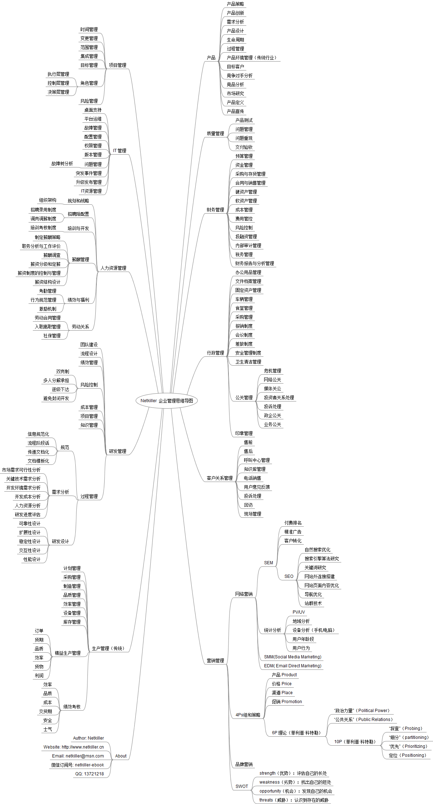

# 部分 III. Business Administration

|  |

## 第 17 章 什么是管理

管理即对一定范围的人员及事务进行安排和处理。

管理模式只能借鉴不能模仿。

## 1. 管理层的职责

管理人员的职责是什么呢？ 不同级别的管理层职责是不同的，一般分为三层，即高层，中层，和基层。他们的侧重点也不同。

早期

*   高层管理：计划，组织, 决策。

*   中层管理：指挥，协调，控制。

*   基层管理：执行，检查，改进。

现今

*   高层管理：策划，组织, 决策。

*   中层管理：计划，协调，控制。

*   基层管理：执行，检查，改进。

但中国很多企业有所不同，中层策划，高层决策。

## 2. 成为管理者

本文讲述项目经理的成长历程以及遇到的各种问题如何解决

### 2.1. 从零开始

假设你有转管理的意愿或者突然被任命为经理，目前就你一个人，公司对你很信任，权限充分授权，那麽你应该做些什么呢？

首先管理管理者是无法通过读书实现的，如果你希望成为管理者，那么你就需要有一个平台和锻炼机会，怎么获得机会呢？

可以通过部门轮职或者跨部门项目合作获得这个机会，抓住一切机会积累经验。

### 2.2. 从技术转管理

从技术转管理是最好的过度，因为一直伴随项目成长，对项目非常熟悉，所以能掌控项目，这个优势是其他管理人员所不具备的，同时风险可控。但这个脚色转换也需要时日，并非一朝一夕。

好的企业都会培养一些有潜力技术人员，使之能够承上启下平稳过渡。

#### 2.2.1. 从专才到通才

要想具备领导整个企业的能力，就需要从专才变成通才，即要对各个职能部门都有足够的了解，这样才能解决相互冲突的问题。

作为“一把手”，领导者要了解财务、营销、运营、人力和研发这些部门解决业务问题的不同方式，每个部门使用的管理工具（贴现现金流、顾客细分、工艺流程、接替计划、门径管理等）也是五花八门。领导者要通晓各个部门的思维模式和语言，并在必要时为他们翻译。

#### 2.2.2. 从分析者到整合者

光有分析能力远远不够，他们还要知道如何做取舍，就自己的决定给出合理解释。公司领导者的职责是管理和统筹职能部门中的各种知识，解决重要的组织问题。

#### 2.2.3. 从战术家到战略家

从局部战术向全局战略转型

### 2.3. 从空降开始

#### 当你空降到一个团队你应该做什么?

假设你被任命为软件开发项目经理，目前有一个团队需要你负责，公司对你很信任，权限充分授权，那麽你应该做些什么呢？

空降过去，你是去救火，基本没有好事等着你，本文讲述一个项目经理空降以后遇到的各种问题如何解决

#### 2.3.1. 注意事项

你刚刚就任，根本不了解细节，还有这个的很多禁忌，无论现在的项目有多少问题，你要做的事倾听各抒己见，不要盲目说 no, 虽然现在的项目有各种各样的问题存在，都也是很多人心血，有他存在意义。当你解了后，就可以大刀阔斧的干了。

另外你不要想着急于做出成绩，也不要做得最好，否则你立了一个很高的标杆，公司会期望你做的更好，你自己也无法超越自己。

## 3. 领导力，专业力，管理力

一个团队也好，一个企业也好，一个领导也好，有三种必须的力，领导力、管理力、专业力。专业力支撑创新、管理力推动发展、领导力打造辉煌。造就卓越的企业，这三种力缺一不可。

这三种力是有排列顺序的，我的排列顺序是： 领导力>专业力>管理力，这种排序适合科技企业，其他企业也允许有其他组合。

不同时期不同岗位的排列顺序也是可以灵活调整的例如：

高层管理者：管理力 > 领导力 > 专业力 
中层管理者：领导力 > 专业力 > 管理力
基层管理者：专业力 > 领导力 > 管理力

### 3.1. 领导力

领导力权力不等于，你有权利，未必有领导力，岗位赋予的管理权力不是领导力。

什么是领导力？

领导力是一种让别人追随你的能力，即使别人只是出于好奇。------ 美国前国务卿科林·鲍威尔。

简单来说，就是让大家自愿地信任，佩服，让人愿意追随，跟着领导者往前冲的能力。不需要通过太多花哨的学术去理解，你只要看过“抗日神剧”就能理解，领导力有具有风卷残云的能力。

对我影响比较深的一部电影《U571》

当船长告诉副船长泰莱这些话的时候“作为一个船长，你不能犹豫，你要采取行动，不果然行动，就危及全体船员，往往没有先例可遵循，资料不足，要当机立断”，“你出错，就要承担后果”，“假如你犹豫不决，不能当机立断，就不适合当潜艇队长”，泰莱开始反思。

当大幅告诉船长泰莱，“指挥官有无限威严，是可敬可畏的人，他无所不知，无所不能”泰莱就已经担当起了船长的角色。

大多数的技术人员是被“管理”的，而不是被“领导”的，而技术人员更喜欢被领导，而不是被管理。

同样面对项目的一些问题，作为技术管理层你必须拿出方案，而不能将这些问题推给下属：你们看看怎么做，你们大家商量一下给我一个方案...等等

我平时对下属说：你们这么做，应该这样做.....，而不是：你们看看怎么做，你们讨论一下看看有没有好的方案....（然后告诉我，我在跟上面说），管理层不是传话筒，上传下达的工作，秘书助理更适合。

领导力强，管理可以稍松散一点；领导力弱，用管理与流程补充。领导力不可复制，只能被另一种替代，管理可以克隆。

我更擅长领导，而不是管理，我认为领导力占 80%，管理力站 20%较为合理。

### 3.2. 管理力

#### What is the differences between leadership and management?

领导力与管理力有什么不同？

领导力是艺术，管理力是科学。

管理力是可以后天学习，可以通过正规课程培训，也可以自学，说白了是人就能干。

### 3.3. 专业力

专业力实际上就是指“专家型通才”或者说是“T 型人才”

管理力可以通过学习掌握，领导力是一种魅力，这两种类型是可以相互转换的，专业力是门槛最高的，很难后天通过学习掌握，只能是专业人员从技术岗位转向管理岗位达成。

专业力是创新的来源，所以具备专业力的管理层最具优势，这种人才永远都是紧俏的。

专业力能制造神话，领导力创造奇迹，管理力可持续发展，企业可以从领导型走向管理型，但从管理型过度到领导型阻力重重。

创造硅谷神话的不是领导力和管理力，而是专业力。比尔盖茨，乔布斯，拉里·佩奇，扎克伯格... 都是专业力报表的人。

### 3.4. 总结

西方企业：专业力 > 领导力 > 管理力
中国企业：管理力 > 领导力 > 专业力

你会发现一个奇怪的现象，对比我开头提到的排列顺序，比尔盖茨在中国只配做个基层管理者。就像西方学者评价毛主席，在西方只能做一名图书馆管理员一样：），在这篇神奇的土地上，什么奇迹都能发生。

专业力类型的领导在中国逊于其他两种类型的领导，其主要原因是在中国职场中，要处理很多琐碎事物，还要应付除工作之外的很多事情，如官场，政治等等。

这几种力中只有管理力门槛最低，可以通过后天学习弥补，所以中国人更热衷于 MBA。进入 21 世纪科技快速发展，仅仅依靠管理力和领导力已经无法满足当代企业管理，需要重新洗牌，专业力将站绝对优势。

对于专业力型领导，需要给他配个助理，助理来处理日常繁杂的事物，这样他才能集中精力投入到更重要的工作上。

## 4. 执行力还需方向正确目标明确

### 4.1. 什么是执行力

所谓执行力，指的是贯彻战略意图，完成预定目标的操作能力。它是企业竞争力的核心，是把企业战略、规划转化成为效益、成果的关键。

执行力包含完成任务的意愿，完成任务的能力，完成任务的程度。对个人而言执行力就是办事能力；对团队而言执行力就是战斗力；对企业而言执行力就是经营能力。

简单来说就是行动力。

### 4.2. 执行力问题出在哪里

说到执行力，任何组织的执行力都无法与军队相比。军队也有执行力不灵的时候，问题出在哪里？

我最近看中国近代历史，得到一些启发，在战争中由于战略错误，指挥失误等等原因，使前线士兵成为炮灰。这种战场可能站战役 2/3 甚至更多。

打仗是一个靠经验积累的技术活，是无法从课本中学到的，课本上总结的前人的经验，实际中需要随机应变，仍需要你反复实践，总结。

实践课的成本是极高的， ————— 一将功成万骨枯。

如果你不能快速低成本掌握这项技术，———— 一将无能累死千军。

商场如战场，在商战中，由于你的战略失误，将团队累死或失去团队对你的信任，甚至质疑你，执行力将无法贯彻下去。

### 4.3. 执行力与 SMART 原则

这里有一个概念，既 SMART 原则。所谓 SMART 原则,即是：

1.  目标必须是具体的(Specific)；

2.  目标必须是可以衡量的(Measurable)；

3.  目标必须是可以达到的(Attainable)；

4.  目标必须和其他目标具有相关性(Relevant)；

5.  目标必须具有明确的截止期限(Time-based)。

## 5. 管理黑洞

### 5.1. 活在竞争对手的阴影下

做企业的本质还是为用户创造价值，不能把打败对手当成使命和目的。企业的眼光要看用户，不要看对手，像 110 米跨栏一样，你必须盯着阶段性目标，跨越你的障碍，过程中一定会有竞争对手，你只能用余光瞄他，如果你去对打，你也到不了终点。

### 5.2. 无法流程化，标准化，不可重复

### 5.3. 石沉大海，不了了之

### 5.4. 到处救火

发现问题，指定规范，无人检查

## 6. 企业管理是制度化好，还是驭人术好呢？

### 6.1. 驭人术起源

驭人之术是封建社会时代出现的一种管理方式，这种管理方式上到朝廷下至百姓到，延续了几千年。

驭人术的核心有三点，分别是：识人，用人，驭人。

举例一，古代帝王的驭人之术：

帝王之术的核心：知人善用，为政之本。用人之道，首在鉴人，次在用人，终在聚人，赏罚分明。扬善于公庭，规过于私室。用人之所长避其短，即集众人之长为自己所用。加之以威，使之以利，晓之以理，动之以情，结之以义。 帝王的驭人之术：自树威信、偷梁换柱、下诏罪己、情感诱惑、收买人心、丢卒保车、互相监督、以他排他、分职弱权。

举例二，古代商人的驭人之术：

例如历史上的晋商，徽商，潮商。这种管理方式是适合当时的历史背景的。另外驭人术之并不是单纯的主子和奴才，东家和掌柜的关系，而是围绕并依靠强大的宗族势力和血源来维系的。 我们在潮汕人身上还能看到这样的影子。宗族和血源的优势是，员工绝对的忠诚，能够快速决策，执行力强等等。

### 6.2. 驭人之术有也非常多的弊端

首先驭人术很消耗管理者的精力，其次管理者容易被架空。创业可以采用“驭人术”管理企业，守业必须依靠制度。对于家族企业，你无法保证你的后台也能熟练掌握驭人之术。 驭人之术无法长久管理一个国家或一个企业，系数各朝各代没有一个超过 300 年的，古代的商帮晋商，徽商，潮商也是昙花一现。

进入现代社会，传统文化丢失，宗族分崩离析，血缘淡化，人心不古，礼崩乐坏，各怀鬼胎，不懂感恩，不懂知遇之恩，信任危机，互害型社会。驭人术的管理模式就此终结并退出历史舞台。

### 6.3. 驭人术适用于 90 后员工吗？

驭人术用在 90 后身上如何？90 后生时已经改革开放，生活和成长的环境，以及受到的教育都与传统文化格格不入。同时西方的管理学也逐渐出现在大学的课程中，雇佣关系也在发生变化，即从人情化到契约话，所以驭人术用在 90 后身上只能让 90 后员工更加反感这种企业文化，他们向往和追求的是西方的企业文化。

反观世界五百强企业，没有一个采用驭人术来管理的。

现在企业必须通过制度和契约来管理，同时制度也不是万能的，不是一成不变的，必须与时俱进，不断修改完善。

### 6.4. “以人为本”而是“以钱为本”

有的公司考核目的不是“以人为本”而是“以钱为本”：美国华盛顿大学（University of Washington）福斯特商学院终身教授陈晓萍女士在其《幸福的决定因素》第二章“管理的悖论”中说：

“以人为本”的管理强调善待员工，关心照顾员工工作、生活的各个方面，无论是健康保险还是休闲设施，无论是带薪休假还是托儿服务，无论是免费饮品还是弹性工作时间，无论是技术培训还是学费报销计划……都体现出企业管理层对员工成长发自内心的关怀，并希望员工因此更加热爱工作，敬业守职，从而提高工作效率和工作绩效，对工作有更多的创意和思考，为企业的发展创造价值。

“以钱为本”的经营理念导致的行为则是对员工各方面待遇的极度克扣：工资往底线上靠，加班常常不付加班费；上班打卡，迟到一分钟也要扣钱；完不成任务要扣奖金。培训很少，一旦轮到，则要签署合同：若在培训后数月内离职，就得如数上缴培训费用，一分不得拖欠。如果在合同期满内提出辞职，也得上交罚款。总而言之，通过各种手段减少人工开支，节约成本，从而达到企业效益最大化的目的。然而，企业管理层如此苛刻的举措，只会使员工产生强烈的反感，而在内心深处拉开与企业的距离，清楚地认识自己与企业的关系只是简单的雇佣关系。要处于如此心态的员工尽心尽力为企业工作，充满激情地为企业创造价值，那简直就是白日做梦，完全不可能实现。

左拉（Emile Zola）曾在 1868 年的作品中指出：“工作需要有休闲。如果钱不够多，未来又无可展望，人就会把握眼前能得到的快感”。

## 7. 谈用人

3 年前就遇到了职业瓶颈，一直没有找到突破方法。今天跟朋友聊天才大彻大悟。

你是否想过，你的上司，能力没有你强，贡献没有你大，似乎他能坐在那个位置上是个奇迹，你想不通老板为什么会用这样一个人。 他是怎么坐稳位置的？他的没有危机感吗？没有压力吗？这个人除了上传下达一无是处，除了开会没有其他手段。 他的口头语就是，你们看看怎么做，然后发给我，我整理一下回报上去。

事实上，作为中层管理的你，你也在用这样的人，不是吗？下面的员工看着你任用的基层领导他们也不明，你怎么会用这样一个人？

为什么会出现这种情况，因为大家都想用一个听话的人，听话才好用。所以上次最喜欢的下属往往不是能力最强的，而是省心的。 如果你能力很强，你仅仅需要一个听话的人帮你执行贯彻，而不需要他又太多的思想。只要他能 100%的执行你的任务并反馈结果就够了。

同样，你老板的能力很强，他也只需要一个执行人，不需要他又太多的思想。

如果他有太多的思想，能力又很强可能会出现下面的情况：

1.  意见出现分歧，导致不能 100%执行

2.  影响你战略规划，很多企业核心战略规划只有少数人才能接触。下面的管层也知之甚少，战略规划一旦拟定只需要执行。但下面很多不明真相/知之片面的人会出现各种言论。

3.  挑战你的权威包括老板的权威

4.  越级上访

5.  带队出走

网上有个内涵段子，任用奴才，利用人才，不用蠢才。

我的职业瓶颈是因为，我能力太强，坚持原则，不妥协。能力太强并不好，公司不想依赖我的技术，将技术压在我一个人身上，风险会很大。

公司对我这样的人就是利用法则，用废为止，绝不会任用。

## 第 18 章 战略管理

### *Enterprise Strategic Management*

## 1. 战略是什么

德鲁克提出，战略就是通过最有效的管理，用最小的资源达到最大回报的过程。战略的根本是一种增长方式，我们用什么样的方式、什么样的路径达成企业的增长。

## 第 19 章 商业模式

当今企业之间的竞争，不是产品之间的竞争，而是商业模式之间的竞争 ------德鲁克

商业模式就是企业家为实现企业价值最大化，把能使企业运行的内外各要素整合真起来，形成一个完整的高效的具有独特核心竞争力的运作系统，并通过最优实现形式满足客户需求、实现客户价值，同时使系统达到持续盈利目标的整合解决方案。

简单地说，商业模式就是企业赚钱的方式方法。

## 1. 商业法则

“在其他人都投了资的地方去投资，你是不会发财的” ------ 巴菲特

商业上有这样的说法

同样一桩生意

*   第一个做是天才

*   第二个做是庸才

*   第三个做是蠢材

*   第四个做是破产

一项新鲜事物，在 10 个人当中，有一两个人赞成就可以开始着手做了；有 5 个人赞成时，就已经迟了一步；如果有七八个人赞成时，那就太晚了。

很多企业在做决策时，以为地考虑多数人的意见，忽略少数人的意见，这样不仅不利于企业发展，还打击了员工创新的积极性。

企业一定要具有一种强烈的忧患意识、时不我待的紧迫感和危机感，及时把握创新机会。

要想在市场上获得成功，你必须成为一个独立思考者，因为共识通常都是错误的。你必须要有与众不同的观点和视角。

## 2. 商业与大数据

### 2.1. 大数据的误区

什么是大数据，大数据一定是非结构化，来自互联网用户，多渠道，多维度，而非企业运营产生的结构化数据，例如订单、财务数据等等，这属于 OLAP 的范畴。

抓取、存储并对海量人机数据进行分析，然后据此进行预测的能力，这就是所谓的大数据。

大数据这一概念描述的是一种技术生态系统，它使大量非结构化的、不均匀分布的数据能够被捕捉、存储和分析。大数据与之前基于数据库仓库的商业智能 BI（Business Intelligence)技术有着划时代的差异。

大数据的概念远远超越了简单的销售点（POS 终端）数据以及客户关系管理（CRM）中包含的线层数据，甚至企业资源规划(Enterprise Resource Planning)。他所涵盖的数据包罗万象有着丰富多样的来源，例如图片、文本、网页、社交媒体，还有传统的结构化交易数据。

大数据一词已经被用烂了，Hadoop 更像是一个超级大的网络硬盘。例如某公司将系统日志存放到 Hbase 中也称为大数据，这是不正确的。仅仅用到大数据概念中的存储环节，这些数据并不能进行分析，预测，为企业提供决策支撑。

在中国 95%的大数据实际仍停留在报表阶段，仅仅是换一种技术做报表。实际上使用 Excel 轻松可以应付这种需求，而不需要一个技术团队用各种大数据软件（Hadoop/Hbase/Hive...）堆叠起一个大数据平台。

### 2.2. 数据驱动商业

在信息有限、消息闭塞、且没有数字化的时代，通常是让身居高位的人凭借经验和直觉来做出重大决策，这也是情有可原的。因为他们有用多年积累的经验，这些人描绘的未来蓝图----会发生什么事情、事情该怎样解决、因此该如何规划等等，全部基于他们的个人观点。

今天的整个商业世界中，应该让数据做主。首先，要养成习惯问：“数据怎么说”、“这些数据从那来的”、“这些数据能特出什么分析”、“我们对结果有大多信心”。

决策让数据做主

## 3. 创新

企业要想发展，就要不断创新，不断淘汰自己过时的产品。每一个产品的出现，都是适应时代发展的，如果产品长时间不更新，就会出现与时代脱节的现象，随时时间的推移，就会慢慢被消费者忽略。

技术创新是企业持续、稳定发展的基础。企业要勇于淘汰自己的产品，这是企业自信、实例雄厚的表现，为了企业的长久发展，企业应该有革自己命的勇气和魄力。

### 3.1. 创新掌握在少数人手里

### 3.2. 持续创新

## 第 20 章 出现问题为什么会相互推诿

一旦出现问题，很可能同事反目成仇，背后给你一枪，将责任推给其他人。有时可能是部门相互推卸责任。这种做法会像瘟疫一样传染，影响更多的人或部门效仿。

如果不加以控制，后果很严重，波及面广，一旦成为定势，你再想翻盘非常困难。不管你是否愿意或承认，这将会成为企业文化的一部分。

你想改变，很难！你会发现新入职的员工很快学会并适应这种推诿的企业文化，新鲜血液总是少量输入的，就像得了癌症一样不可控制。

出现这样事情问题出在哪里？

我们对待这个世界的态度会议这样一种方式反馈到自己身上：你怎么对待别人，被人就怎么对待你。

*   管理者不懂技术

*   组织架构不合理，部门与部门是平级关系，平级部门最容易推卸责任。

*   对自身定位，有些管理层认为是权利部门，我们更需要的是服务部门。

*   背黑锅文化

## 1. 我来详细分析

首先是“管理者不懂技术”，如果管理者不懂技术，什么都想管，又管不好，当出现问题后，这位裁判只能听各部门负责人报告，那个部门的口才好，嗓门高..... 那个部门就有优势，无法做好裁判工作。败下阵来的部门背黑锅，他们也不是孬的，骑驴看账本，走着瞧，挖坑埋地雷也要找回面子。

“组织架构不合理”。平级部门最爱干的就是制定各种流程，让其他部门按照我的流程走，这样每个部门都会如法炮制，流程很多做法是给上面看的。

“自身定位”，我认为每个人或部门都要有服务意识，我在外企工作多年，在外企 HR，财务等等部门都是服务部门，确切的说是“主动服务部门”，他们会主动上门服务，例如财务会问问你有没有什么要报销的.....。而在国内大部分部门都是等你去主动找他们，他会会告诉你流程是什么，流程怎么走，这件事我不负责，你应该去找谁。服务意识是需要强行推行，中国人还没有达到服务意识层次。

“背黑锅文化”除了问题急于找人背黑锅，揪出肇事者，责任全是他的，这在中国是惯用手法。我的经验是千万别找人被黑锅，不要单指某人，出现问题谁都有责任。

一旦企业出现这个推诿行为的苗头，必须要控制，不可蔓延。避免出现多个平级部门，必须有人能领导这些部门，做好裁判工作，使他们不敢推卸责任。

## 2. 中西方企业文化对比

中西职场观念的差异，中国同事总是把工作任务当做皮球一样踢来踢去，“我经常发现当一个人将工作交给另外一个人去完成时，他同时将跟进工作完成质量的任务一并交送出去。当我问他结果时，他会说：不知道，我已经将这件事交代给其他人了。” 罗夫希望自己的管理理念能改变现状，可发现这是一件很难的事。摘自：老外眼中的中国职场

## 3. 直接责任人（DRI）制度

苹果公司公司发明了这样一个管理概念：直接责任人（Directly Responsible Individual，简称 DRI）。DRI 遍布于公司各个层级。在苹果，谁负责什么，永远不会搞混。DRI 的名字经常出现在会议进程表上，每个人都知道谁是直接负责人。如此公开透明的责任制使得每一个员工没有互相推诿和偷懒的机会，一旦项目出现问题，很容易找到出现问题的环节予以纠正，并追究相关责任。而且，一个项目只能有一个 DRI，如果超过一个 DRI，那就等于没有直接责任人。DRI 能够有效加速决策流程，也可以减少很多不必要的会议。

## 第 21 章 为什么中国家族企业过不了三代?

中国企业不用说三代，两代都极其艰难，为什么呢？

首先中国企业创建的都是些什么人。中国第一代企业家，创业者多是的没有受过很好教育，学历不高的一代人，但他们是具有经商天赋的一代人。除了学历不高其余都高，他们具备了高智商，高情商，高财商，高胆商……

从 87 年改革开放到走具有中国特色的社会主义市场经济… 20 年中，就如三国群雄逐鹿，时势造英雄，第一代企业家崛起。

为什么第二代就不行了呢？

我认为主要也是教育问题，第一代人主要是靠天赋加上后天学习成就了他们辉煌的业绩。但没有一个企业家敢让自己的子女重走一次自己的路。

由于第一代企业家深知学习的重要性，他们为子女提供了最好的教育环境，但是他们是照打工者去教育的，而不是按照守业者去教育的。所以他们子女去企业打工没有任何问题，但是做接班人就不合格了，只有少数后知后觉的子女能发现自己的问题。

他们都犯了一个相同的错误，他们不知道学习跟学历关系，学历跟学识的关系，上学跟读书的关系。

上学不等于读书，知识的构成 20%来自院校，80%来自社会。读教科书不算读书。

学习不等于读书，学习的渠道多种多样，读书之一其中一种，且速度慢，也不一定适合所有人。除了读书之外网络和多媒体资源都是学习渠道。

学历不等于学识，博士等于窄士，高学历是是面向微观领域，解决特定领域，特定问题而存在的。而经营企业，管理一个企业则需要学识渊博，掌握各种领域的跨界知识。

学识不等于能力，实际操作的落地能力