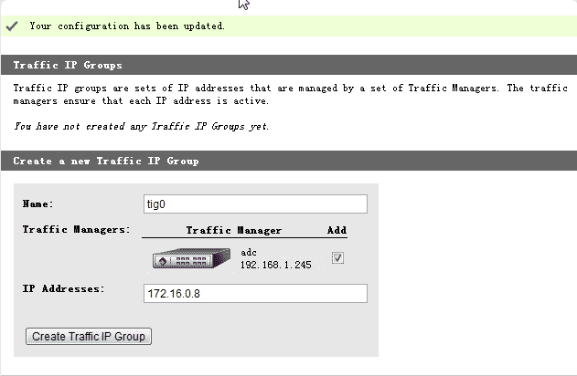
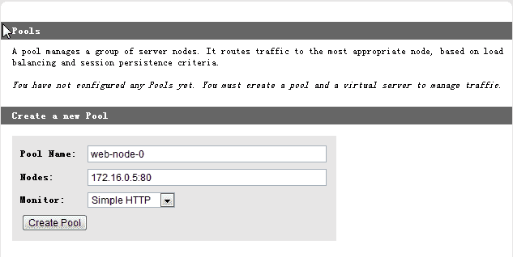
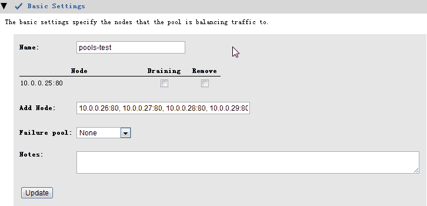
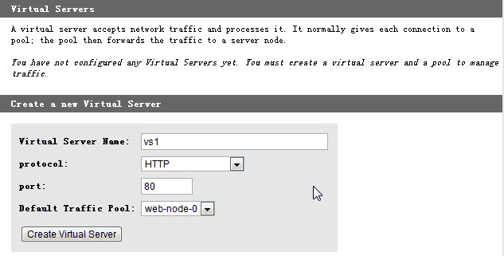
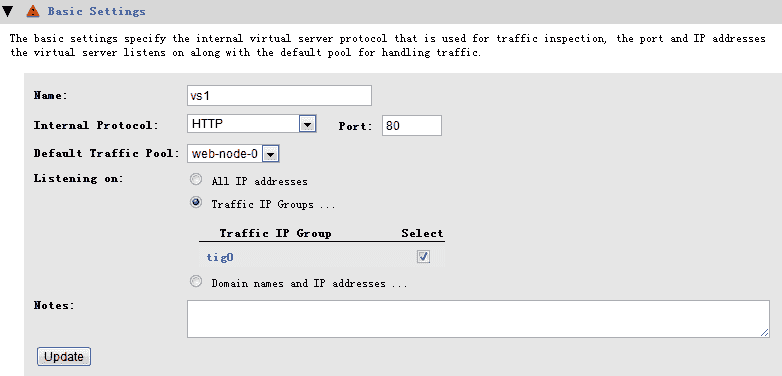

# 部分 IX. Banggoo - ADC 3000 (应用交付控制器)

## 第 38 章 Web UI

## user

ssh

user: root, passwd: default

web ui

https://your_ip_address:8080

user: admin, passwd: admin

## Services

### Traffic IP Groups

|  |

Name:

IP Addresses:

### Pools

|  |

Your configuration has been updated.

#### Edit

|  |

### Virtual Servers

|  |

Your configuration has been updated.

|  |

### Status

|  |

|  |

## 第 39 章 CentOS

## kernel

```
[root@LBbanggooADC01 ~]# uname -a
Linux LBbanggooADC01 2.6.35-001banggoo.el5 #1 SMP Wed Dec 8 18:54:33 CST 2010 x86_64 x86_64 x86_64 GNU/Linux
[root@LBbanggooADC01 ~]# cat /etc/issue

Banggoo ADC 5.1		

```

## cpu/mem

```
processor       : 3
vendor_id       : GenuineIntel
cpu family      : 6
model           : 15
model name      : Intel(R) Xeon(R) CPU            5130  @ 2.00GHz
stepping        : 6
cpu MHz         : 1995.004
cache size      : 4096 KB
physical id     : 3
siblings        : 2
core id         : 1
cpu cores       : 2
apicid          : 7
initial apicid  : 7
fpu             : yes
fpu_exception   : yes
cpuid level     : 10
wp              : yes
flags           : fpu vme de pse tsc msr pae mce cx8 apic sep mtrr pge mca cmov pat pse36 clflush dts acpi mmx fxsr sse sse2 ss ht tm pbe syscall nx lm constant_tsc arch_perfmon pebs bts rep_good aperfmperf pni dtes64 monitor ds_cpl vmx tm2 ssse3 cx16 xtpr pdcm dca lahf_lm tpr_shadow
bogomips        : 4050.40
clflush size    : 64
cache_alignment : 64
address sizes   : 36 bits physical, 48 bits virtual
power management:

[root@adc ~]# free -m
             total       used       free     shared    buffers     cached
Mem:          8001       1061       6939          0        126        133
-/+ buffers/cache:        801       7200
Swap:         5951          0       5951

```

## ulimit

```
[root@adc ~]# ulimit
unlimited
[root@adc ~]# ulimit -a
core file size          (blocks, -c) 0
data seg size           (kbytes, -d) unlimited
scheduling priority             (-e) 0
file size               (blocks, -f) unlimited
pending signals                 (-i) 63967
max locked memory       (kbytes, -l) 64
max memory size         (kbytes, -m) unlimited
open files                      (-n) 1000000
pipe size            (512 bytes, -p) 8
POSIX message queues     (bytes, -q) 819200
real-time priority              (-r) 0
stack size              (kbytes, -s) 8192
cpu time               (seconds, -t) unlimited
max user processes              (-u) 63967
virtual memory          (kbytes, -v) unlimited
file locks                      (-x) unlimited

```

## sysctl

```
[root@adc ~]# sysctl -p
net.ipv4.ip_forward = 0
net.ipv4.conf.default.rp_filter = 1
net.ipv4.conf.default.accept_source_route = 0
kernel.sysrq = 0
kernel.core_uses_pid = 1
fs.file-max = 2097152
net.core.rmem_default = 10000000
net.core.rmem_max = 10000000
net.core.wmem_default = 10000000
net.core.wmem_max = 10000000
net.core.optmem_max = 10000000
net.core.somaxconn = 1024
net.ipv4.tcp_max_orphans = 327680
net.ipv6.conf.default.dad_transmits = 0
net.ipv4.neigh.default.gc_thresh1 = 204800
net.ipv4.neigh.default.gc_thresh2 = 409600
net.ipv4.neigh.default.gc_thresh3 = 819200
net.ipv4.ip_local_port_range = 16384 65534
net.ipv4.tcp_max_syn_backlog = 8092
net.ipv4.tcp_max_tw_buckets = 1800000
net.ipv4.ip_forward = 1
error: "net.ipv4.netfilter.ip_conntrack_max" is an unknown key
error: "net.ipv4.netfilter.ip_conntrack_tcp_timeout_established" is an unknown key
net.ipv4.tcp_sack = 0
net.ipv4.tcp_syncookies = 0
net.ipv4.tcp_tw_reuse = 1
net.ipv4.tcp_tw_recycle = 1
net.ipv4.tcp_fin_timeout = 30

```

## process

```

[root@adc ~]# ps ax
  PID TTY      STAT   TIME COMMAND
    1 ?        Ss     0:03 init [3]
    2 ?        S      0:00 [kthreadd]
    3 ?        S      0:01 [ksoftirqd/0]
    4 ?        S      0:00 [migration/0]
    5 ?        S      0:00 [watchdog/0]
    6 ?        S      0:00 [migration/1]
    7 ?        S      0:05 [ksoftirqd/1]
    8 ?        S      0:00 [watchdog/1]
    9 ?        S      0:01 [migration/2]
   10 ?        S      0:00 [ksoftirqd/2]
   11 ?        S      0:00 [watchdog/2]
   12 ?        S      0:01 [migration/3]
   13 ?        S      0:02 [ksoftirqd/3]
   14 ?        S      0:00 [watchdog/3]
   15 ?        S      1:42 [events/0]
   16 ?        S      2:34 [events/1]
   17 ?        S      1:42 [events/2]
   18 ?        S      1:54 [events/3]
   19 ?        S      0:00 [khelper]
   87 ?        S      0:00 [async/mgr]
  164 ?        S      0:00 [sync_supers]
  166 ?        S      0:00 [bdi-default]
  167 ?        S      0:05 [kblockd/0]
  168 ?        S      0:05 [kblockd/1]
  169 ?        S      0:04 [kblockd/2]
  170 ?        S      0:03 [kblockd/3]
  178 ?        S      0:00 [khubd]
  181 ?        S      0:00 [kseriod]
  398 ?        S      0:00 [khungtaskd]
  399 ?        S      0:00 [kswapd0]
  447 ?        S      0:00 [aio/0]
  448 ?        S      0:00 [aio/1]
  449 ?        S      0:00 [aio/2]
  450 ?        S      0:00 [aio/3]
  456 ?        S      0:00 [crypto/0]
  457 ?        S      0:00 [crypto/1]
  458 ?        S      0:00 [crypto/2]
  459 ?        S      0:00 [crypto/3]
  569 ?        S      0:00 [kpsmoused]
  573 ?        S      0:00 [kstriped]
  602 ?        S      0:00 [usbhid_resumer]
  617 ?        S      0:00 [ata_aux]
  618 ?        S      0:00 [ata_sff/0]
  619 ?        S      0:00 [ata_sff/1]
  620 ?        S      0:00 [ata_sff/2]
  621 ?        S      0:00 [ata_sff/3]
  623 ?        S      0:00 [scsi_eh_0]
  624 ?        S      0:00 [scsi_eh_1]
  649 ?        S      0:00 [ksnapd]
  653 ?        S      0:00 [kdmflush]
  654 ?        S      0:00 [kdmflush]
  655 ?        S      0:07 [kjournald]
  706 ?        S<s    0:02 /sbin/udevd -d
  855 ?        S      0:03 [edac-poller]
 1694 ?        S      0:01 [flush-253:0]
 1946 ?        S      0:00 [kmpathd/0]
 1947 ?        S      0:00 [kmpathd/1]
 1948 ?        S      0:00 [kmpathd/2]
 1949 ?        S      0:00 [kmpathd/3]
 1950 ?        S      0:00 [kmpath_handlerd]
 1976 ?        S      0:00 [kjournald]
 2207 ?        S      0:00 [bond0]
 2214 ?        S      0:14 [bond1]
 3403 ?        Ss     0:00 syslogd -m 0
 3407 ?        Ss     0:00 klogd -x
 3416 ?        Ss     0:00 dbus-daemon --system
 3443 ?        Ss     0:00 hald
 3444 ?        S      0:00 hald-runner
 3479 ?        Ss     0:05 /usr/local/banggoo/admin/bin/zeus.admin
 3480 ?        S<     0:14 /usr/local/banggoo/admin/bin/zeus.admin
 3511 ?        Ss    21:59 /usr/local/banggoo/zxtm/bin/zeus.zxtm
 3513 ?        S      0:01 zeus.eventd
 3514 ?        S     25:26 /usr/local/banggoo/zxtm/bin/zeus.zxtm
 3515 ?        S     40:03 /usr/local/banggoo/zxtm/bin/zeus.zxtm
 3516 ?        S     29:12 /usr/local/banggoo/zxtm/bin/zeus.zxtm
 3517 ?        S     25:01 /usr/local/banggoo/zxtm/bin/zeus.zxtm
 3518 ?        S      1:23 zeus.flipper
 3519 ?        S      0:24 zeus.monitor
 3532 ?        Ss     0:00 /usr/sbin/sshd
 3541 ?        S      0:00 /usr/local/banggoo/admin/bin/bgd
 3542 ?        S      6:34 /usr/local/banggoo/zxtmadmin/bin/lcd 2000
 3544 ttyS0    Ss+    0:00 /sbin/agetty ttyS0 19200 vt100-nav
12653 ?        Ss     0:00 sshd: root@pts/0
12665 pts/0    Ss+    0:00 -bash
20479 ?        S<     0:01 /usr/local/banggoo/perl/miniperl -Twx /usr/local/banggoo/zxtmadmin/docroot/auth.fcgi
20639 ?        S<     0:02 /usr/local/banggoo/perl/miniperl -wx /usr/local/banggoo/admin/docroot/apps/zxtm/index.fcgi
20646 ?        S<     0:00 /usr/local/banggoo/perl/miniperl -wx /usr/local/banggoo/admin/docroot/apps/zxtm/logs.fcgi
20678 ?        S<     0:01 /usr/local/banggoo/perl/miniperl -wx /usr/local/banggoo/admin/docroot/apps/zxtm/zxtmstat.fcgi
20679 ?        S<     0:00 /usr/local/banggoo/perl/miniperl -wx /usr/local/banggoo/zxtmadmin/bin/zeus.collector
25176 ?        S<     0:00 /usr/local/banggoo/admin/bin/zconnect --ssl --sslid=/usr/local/banggoo/admin/internal/ssl-127.0.0.1:9080:1 127.0.0.1 9080
25177 ?        Ss     0:00 sshd: root@pts/1
25216 pts/1    Ss     0:00 -bash
26747 pts/1    R+     0:00 ps ax

```

## 硬盘情况

```
[root@LBbanggooADC01 ~]# df
Filesystem           1K-blocks      Used Available Use% Mounted on
/dev/mapper/VolGroup00-LogVol00
                     467080344   2102188 440869100   1% /
/dev/sda1               101086     13207     82660  14% /boot
tmpfs                  4096692         0   4096692   0% /dev/shm		

```

看上取只有一块硬盘，没有采用 CF 卡设计方式

## rpm

```

[root@adc ~]# rpm -qa |wc -l
248
[root@adc ~]# rpm -qa
termcap-5.5-1.20060701.1
setup-2.5.58-7.el5
basesystem-8.0-5.1.1.el5.centos
tzdata-2009k-1.el5
libgcc-4.1.2-46.el5
glibc-2.5-42
mktemp-1.5-23.2.2
libsysfs-2.0.0-6
ethtool-6-3.el5
checkpolicy-1.33.1-4.el5
libvolume_id-095-14.21.el5
lrzsz-0.12.20-22.1
setserial-2.17-19.2.2
vconfig-1.9-2.1
glibc-2.5-42
glib2-2.12.3-4.el5_3.1
expat-1.95.8-8.2.1
libgpg-error-1.4-2
bzip2-libs-1.0.3-4.el5_2
elfutils-libelf-0.137-3.el5
libtermcap-2.0.8-46.1
info-4.8-14.el5
ncurses-5.5-24.20060715
zlib-1.2.3-3
nspr-4.7.4-1.el5_3.1
sed-4.1.5-5.fc6
sqlite-3.3.6-5
db4-4.3.29-10.el5
libtiff-3.8.2-7.el5_3.4
libacl-2.2.39-3.el5
freetype-2.2.1-21.el5_3
atk-1.12.2-1.fc6
libgpg-error-1.4-2
keyutils-1.2-1.el5
diffutils-2.8.1-15.2.3.el5
libxml2-2.6.26-2.1.2.8
slang-2.0.6-4.el5
perl-5.8.8-27.el5
libXau-1.0.1-3.1
iptables-ipv6-1.3.5-5.3.el5
procps-3.2.7-11.1.el5
gzip-1.3.5-10.el5.centos
iputils-20020927-46.el5
libusb-0.1.12-5.1
grep-2.5.1-55.el5
libXdmcp-1.0.1-2.1
cyrus-sasl-lib-2.1.22-5.el5
ftp-0.17-35.el5
mgetty-1.1.33-9.fc6
file-4.17-15.el5_3.1
libhugetlbfs-1.3-3.el5
nspr-4.7.4-1.el5_3.1
hmaccalc-0.9.6-1.el5
keyutils-libs-1.2-1.el5
gnutls-1.4.1-3.el5_2.1
libtiff-3.8.2-7.el5_3.4
libXdmcp-1.0.1-2.1
libtermcap-2.0.8-46.1
xorg-x11-filesystem-7.1-2.fc6
libXrender-0.9.1-3.1
libXfixes-4.0.1-2.1
libXcursor-1.1.7-1.1
libXi-1.0.1-3.1
centos-release-5-4.el5.centos.1
redhat-logos-4.9.99-11.el5.centos
grub-0.97-13.5
libXext-1.0.1-2.1
libXcursor-1.1.7-1.1
libXi-1.0.1-3.1
libselinux-1.33.4-5.5.el5
device-mapper-1.02.32-1.el5
findutils-4.2.27-6.el5
fontconfig-2.4.1-7.el5
openssl-0.9.8e-12.el5
cairo-1.2.4-5.el5
cryptsetup-luks-1.0.3-5.el5
newt-0.52.2-12.el5
pam-0.99.6.2-6.el5
tar-1.15.1-23.0.1.el5
python-elementtree-1.2.6-5
yum-metadata-parser-1.1.2-3.el5.centos
m2crypto-0.16-6.el5.6
net-snmp-libs-5.3.2.2-7.el5
libuser-0.54.7-2.el5.5
libXft-2.1.10-1.1
lvm2-2.02.46-8.el5
udev-095-14.21.el5
logrotate-3.7.4-9
libselinux-utils-1.33.4-5.5.el5
rhpl-0.194.1-1
wget-1.11.4-2.el5
hicolor-icon-theme-0.9-2.1
python-urlgrabber-3.1.0-5.el5
ntp-4.2.2p1-9.el5.centos.2
libXft-2.1.10-1.1
pango-1.14.9-6.el5.centos
trousers-0.3.1-4.el5
initscripts-8.45.30-2.el5.centos
fipscheck-lib-1.2.0-1.el5
e2fsprogs-libs-1.39-23.el5
dbus-libs-1.1.2-12.el5
libselinux-1.33.4-5.5.el5
dbus-1.1.2-12.el5
dbus-glib-0.73-8.el5
fipscheck-1.2.0-1.el5
util-linux-2.13-0.52.el5
openssh-4.3p2-36.el5
passwd-0.73-1
openssl-0.9.8e-12.el5
cups-libs-1.3.7-11.el5
trousers-0.3.1-4.el5
authconfig-5.3.21-6.el5
openssh-server-4.3p2-36.el5
prelink-0.4.0-2.el5
ecryptfs-utils-75-5.el5
sysklogd-1.4.1-44.el5
selinux-policy-2.4.6-255.el5
selinux-policy-targeted-2.4.6-255.el5
module-init-tools-3.3-0.pre3.1.54.el5
pciutils-2.2.3-7.el5
yum-3.2.22-20.el5.centos
mkinitrd-5.1.19.6-54
kudzu-1.2.57.1.21-1.el5.centos
adc-2010.12.17-1
cracklib-dicts-2.8.9-3.3
nash-5.1.19.6-54
filesystem-2.4.0-2.el5.centos
centos-release-notes-5.4-4
libgcc-4.1.2-46.el5
glibc-common-2.5-42
chkconfig-1.3.30.1-2
popt-1.10.2.3-18.el5
dmidecode-2.9-1.el5
sgpio-1.2.0_10-2.el5
mingetty-1.07-5.2.2
bridge-utils-1.1-2
hdparm-6.6-2
traceroute-2.0.1-5.el5
rootfiles-8.1-1.1.1
zlib-1.2.3-3
audit-libs-1.7.13-2.el5
libpng-1.2.10-7.1.el5_3.2
libgcrypt-1.4.4-5.el5
libstdc++-4.1.2-46.el5
libcap-1.10-26
bash-3.2-24.el5
libsepol-1.15.2-2.el5
libsepol-1.15.2-2.el5
readline-5.1-3.el5
audit-libs-1.7.13-2.el5
freetype-2.2.1-21.el5_3
gawk-3.1.5-14.el5
libjpeg-6b-37
libattr-2.4.32-1.1
keyutils-libs-1.2-1.el5
glib2-2.12.3-4.el5_3.1
libpng-1.2.10-7.1.el5_3.2
libjpeg-6b-37
cpio-2.6-23.el5
iptables-1.3.5-5.3.el5
atk-1.12.2-1.fc6
gdbm-1.8.0-26.2.1
tcp_wrappers-7.6-40.7.el5
lm_sensors-2.10.7-4.el5
iproute-2.6.18-10.el5
less-394-6.el5
binutils-2.17.50.0.6-12.el5
tcl-8.4.13-4.el5
pcre-6.6-2.el5_1.7
gnutls-1.4.1-3.el5_2.1
wireless-tools-28-2.el5
udftools-1.0.0b3-0.1.el5
telnet-0.17-39.el5
ed-0.2-39.el5_2
sysfsutils-2.0.0-6
libgcrypt-1.4.4-5.el5
nss-3.12.3.99.3-1.el5.centos.2
libXau-1.0.1-3.1
nss-3.12.3.99.3-1.el5.centos.2
libstdc++-4.1.2-46.el5
expat-1.95.8-8.2.1
readline-5.1-3.el5
libhugetlbfs-1.3-3.el5
libX11-1.0.3-11.el5
libXext-1.0.1-2.1
bitstream-vera-fonts-1.10-7
libXrandr-1.1.1-3.1
libXinerama-1.0.1-2.1
crontabs-1.10-8
libX11-1.0.3-11.el5
libXrender-0.9.1-3.1
libXfixes-4.0.1-2.1
libXrandr-1.1.1-3.1
libXinerama-1.0.1-2.1
shadow-utils-4.0.17-14.el5
e2fsprogs-libs-1.39-23.el5
coreutils-5.97-23.el5
krb5-libs-1.6.1-36.el5
python-2.4.3-27.el5
kpartx-0.4.7-30.el5
device-mapper-multipath-0.4.7-30.el5
cracklib-2.8.9-3.3
libsemanage-1.9.1-4.4.el5
SysVinit-2.86-15.el5
libselinux-python-1.33.4-5.5.el5
python-sqlite-1.1.7-1.2.1
audit-libs-python-1.7.13-2.el5
openldap-2.3.43-3.el5
cups-libs-1.3.7-11.el5
device-mapper-event-1.02.32-1.el5
MAKEDEV-3.23-1.2
psmisc-22.2-7
net-tools-1.60-78.el5
system-config-securitylevel-tui-1.6.29.1-2.1.el5
tcpdump-3.9.4-14.el5
vim-minimal-7.0.109-6.el5
fontconfig-2.4.1-7.el5
python-iniparse-0.2.3-4.el5
cairo-1.2.4-5.el5
pango-1.14.9-6.el5.centos
gtk2-2.10.4-20.el5
cracklib-2.8.9-3.3
e2fsprogs-1.39-23.el5
rpm-4.4.2.3-18.el5
dmraid-1.0.0.rc13-53.el5
rpm-libs-4.4.2.3-18.el5
mcstrans-0.2.11-3.el5
rpm-python-4.4.2.3-18.el5
dmraid-events-1.0.0.rc13-53.el5
pam-0.99.6.2-6.el5
policycoreutils-1.33.12-14.6.el5
krb5-libs-1.6.1-36.el5
usermode-1.88-3.el5.2
kbd-1.12-21.el5
gtk2-2.10.4-20.el5
device-mapper-1.02.32-1.el5
openssh-clients-4.3p2-36.el5
setools-3.0-3.el5
net-snmp-5.3.2.2-7.el5
dhcpv6-client-1.0.10-17.el5
dhclient-3.0.5-21.el5
ecryptfs-utils-75-5.el5
mkinitrd-5.1.19.6-54
hwdata-0.213.16-1.el5
yum-fastestmirror-1.1.16-13.el5.centos
kernel-2.6.35-001banggoo.el5
hal-0.5.8.1-52.el5
pm-utils-0.99.3-10.el5.centos

```

```
[root@LBbanggooADC01 ~]# cat anaconda-ks.cfg 
# Kickstart file automatically generated by anaconda.

install
url --url http://192.168.3.243/.
lang en_US.UTF-8
network --device eth6 --bootproto dhcp --hostname adc
rootpw --iscrypted $1$hbIQjAdP$oTNIezw9IAtTAIjWWgiUv/
firewall --disabled
authconfig --useshadow  --enablemd5
selinux --disabled
timezone --utc Asia/Chongqing
bootloader --location=mbr --driveorder=sda,sdb --append="console=ttyS0,19200n8"
# The following is the partition information you requested
# Note that any partitions you deleted are not expressed
# here so unless you clear all partitions first, this is
# not guaranteed to work
#clearpart --linux --drives=sda
#part /boot --fstype ext3 --size=100 --ondisk=sda
#part pv.100000 --size=0 --grow --ondisk=sda
#volgroup VolGroup00 --pesize=32768 pv.100000
#logvol / --fstype ext3 --name=LogVol00 --vgname=VolGroup00 --size=1024 --grow
#logvol swap --fstype swap --name=LogVol01 --vgname=VolGroup00 --size=1000 --grow --maxsize=5952

%packages
@core
lrzsz
bridge-utils
tcpdump
traceroute
vconfig
wget
net-snmp
iptables
ntp
iptables-ipv6
device-mapper-multipath
mgetty
ftp
telnet

```

## b

```

[root@adc ~]# b
Usage: b COMMAND [ARGS]
Supported commands are:
	hostname  	[ <new hostname> | show]
	timezone  	[ <new timezone> | show]
	ntpserver 	[ <new ntpserver> | show]
	mgmt      	[(<ipaddr> netmask <netmask>) | show] ]
	vlan      	[ <name> | all] [show [all]]
			 | <name>  tag <tagnumber> [untagged|tagged]
			 | <name>  delete
			 | <name> interface <if name list> ]
	self      	[ show [all] | <ip addr> netmask <netmask> vlan <name> [none | secondary <subnum>]
			 | <ip addr> delete]
	route     	[ show | [<target> netmask <netmask> gw <gateway>] [add | delete]
			 | advanced [show]
			 | advanced <targetip> gw <gateway> rtname <route table> vlan <vlan name> [add]
			 | advanced rtname <route table> delete ]
	snat      	[ show | src <src ip addr> <src netmask> dst <dstfrom ip addr> <dstto ip addr> [add | delete]
	bond      	[ show | <bond name> mode <bond mode 0 or 1 or6> [add |delete] ]
	shutdown  	to shutdown the service

```

## Language

```

[root@LBbanggooADC01 ~]# perl -v

This is perl, v5.8.8 built for x86_64-linux-thread-multi

Copyright 1987-2006, Larry Wall

Perl may be copied only under the terms of either the Artistic License or the
GNU General Public License, which may be found in the Perl 5 source kit.

Complete documentation for Perl, including FAQ lists, should be found on
this system using "man perl" or "perldoc perl".  If you have access to the
Internet, point your browser at http://www.perl.org/, the Perl Home Page.	    

```

```

# python
Python 2.4.3 (#1, Sep  3 2009, 15:37:37) 
[GCC 4.1.2 20080704 (Red Hat 4.1.2-46)] on linux2
Type "help", "copyright", "credits" or "license" for more information.
>>> 

```

## iptables

```
[root@LBbanggooADC01 ~]# iptables -v
iptables v1.3.5: no command specified
Try `iptables -h' or 'iptables --help' for more information.
[root@LBbanggooADC01 ~]# 

[root@LBbanggooADC01 ~]# iptables -L
Chain INPUT (policy ACCEPT)
target     prot opt source               destination         

Chain FORWARD (policy ACCEPT)
target     prot opt source               destination         

Chain OUTPUT (policy ACCEPT)
target     prot opt source               destination		

```

## 第 40 章 TrafficScript

## X-Forwarded-For

```
if( !http.headerExists( "X-Forwarded-For" ) ) {
   http.setHeader("X-Forwarded-For",request.getRemoteIP());
}else{
 $current = http.getHeader("X-Forwarded-For");
   http.setHeader("X-Forwarded-For",$current . "," .  request.getRemoteIP());
}

```