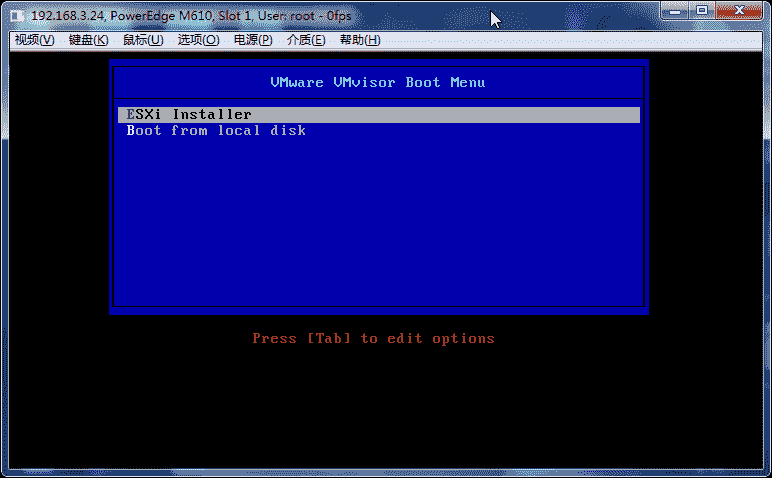

# 第 42 章 WMware

[`www.vmware.com/`](http://www.vmware.com/)

## WMware ESXi

|  |

|  |

|  |

|  |

|  |

|  |

|  |

|  |

|  |

ESXi 界面

|  |

F2 键进入

|  |

更改 root 密码

|  |

|  |

配置网络

|  |

|  |

|  |

|  |

|  |

## VMware vSphere Client

|  |

|  |

|  |

|  |

|  |

|  |

|  |

|  |

|  |

|  |

|  |

|  |

|  |

|  |

|  |

|  |

|  |

|  |

|  |