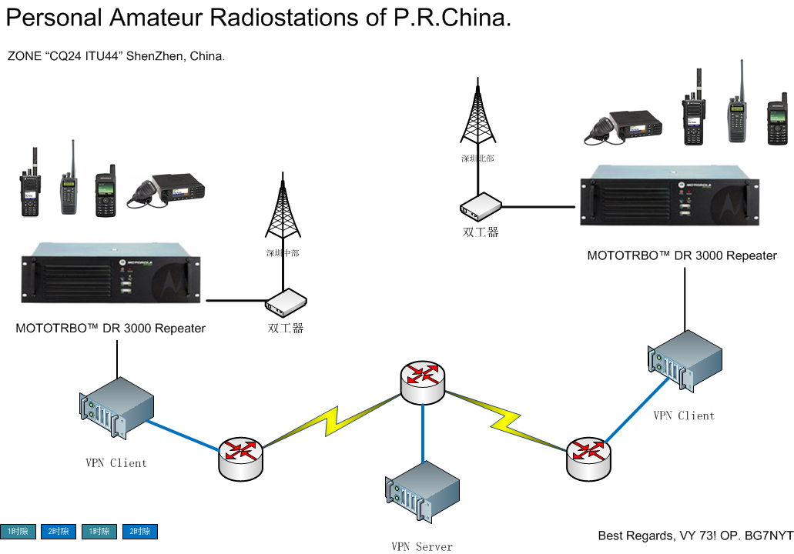

# 第 1 章 数字中继

## 数字中继 VPN 联网方案

设备列表

天线，馈线，双工器

MOTOTRBO™ DR 3000 Repeater

一台有公网 IP 的 VPN 服务器， 配置没有特别要求

两台 VPN 客户端，需要两个网口。不需要公网 IP

网线，水晶头，工具等等

需求描述

一期，迫切解决的问题：

1.  将目前已建成的两部数字中继通过 TCP/IP 互连

2.  实现手持机在中继网间漫游

3.  实现分组呼叫

同时要考虑到后面的扩容问题：

1.  与其他临近城市的互通问题。

2.  APRS

3.  YY 或 Echolink 接入问题

4.  与模拟网的互通问题

5.  与 Voip 协议 SIP 或 H.323 互通

6.  中继录音域 mp3 流服务器播放

背景

互连 DR-3000 中继需要公网 IP，无法使用动态 IP 技术。

通过 VPN 技术建立虚拟专用网实现两个中继相互通信，同时 VPN 服务器也可以采用动态 IP+域名的方案，定时将 IP 地址更新到域名服务器，然后 VPN 客户端通过域名与 VPN 服务器建立连接。实现两台中继的网络互通。

允许多个 VPN 客户端与服务器建立连接，这样就解决了扩容问题。

频率与时隙规划

采用异频同播模式

1 号中继：439.790 -5 12 1

2 号中继：439.200 -5 12 1

IP 地址规划

LAN IP: 172.16.0.0/24

VPN IP: 10.8.0.0/24

1 号中继：172.16.0.1/24

2 号中继：172.16.0.2/24

控制台：172.16.0.254/24

物理网络拓扑图

```

                                      .-----------------------------> tun0  [ VPN Server ] tun0 <-----------------------.
                                     /                                            |                                      \
                                    /                                          Switch                                     \
                                    |                                             |                                        \
                                    |                                          Router                                       |
                                    V                                             ^                                         V
                                   tun0                                           |                                        tun0
天线 ---> 双工器 ---> 中继台 ---> eth1 [VPN Client] eth0 ---> Switch ---> Router ---> ( WAN ) <--- Router <--- Switch <--- eth0 [VPN Client] eth1 <--- 中继台 <--- 双工器  <--- 天线

```

client tun0 与 server tun0 通过 tun0 虚拟接口 建立了一条虚拟链路，实际上仍然通过 eth0 物理链路与服务器连接。通过路由表的走向可以将 172.16.0.0/24 网络打通。

VPN 服务器与客户端

操作系统 [CentOS-6.5-x86_64-minimal.iso](http://www.centos.org/)

分区规划，适合 VPN 服务器与客户端:

*   / 分区 50G

*   Swap 分区 内存*2，如果大于 16G 内存，使用与内存相等即可

*   其他暂时保留

### VPN 服务器

请参考下面安装

[`netkiller.github.io/linux/network/vpn/index.html#openvpn`](http://netkiller.github.io/linux/network/vpn/index.html#openvpn)

[`netkiller.github.io/centos/network/openvpn.html`](http://netkiller.github.io/centos/network/openvpn.html)

#### 服务器端

启用 IP 转发

```

# vim /etc/sysctl.conf
# Controls IP packet forwarding
net.ipv4.ip_forward = 1

```

net.ipv4.ip_forward = 1 使 IP 转发生效

```

sysctl -w net.ipv4.ip_forward=1

```

安装 openvpn 按顺序运行即可

```

yum install openvpn easy-rsa -y
chkconfig openvpn on

cp /usr/share/doc/openvpn-2.3.2/sample/sample-config-files/server.conf /etc/openvpn/
cd /usr/share/easy-rsa/2.0

cat >> vars <<EOF
# Add by BG7NYT
export KEY_COUNTRY="CN"
export KEY_PROVINCE="GD"
export KEY_CITY="Shenzhen"
export KEY_ORG="Personal Amateur Radiostations of P.R.China"
export KEY_EMAIL="bg7nyt@163.com"
export KEY_CN=http://netkiller.github.io
export KEY_NAME=BG7NYT
export KEY_OU=Mototrbo
EOF

source ./vars
./clean-all
./build-ca
./build-key-server server
./build-dh
./build-key node1
./build-key node2

cp keys/ca.key keys/ca.crt keys/dh1024.pem keys/server.key keys/server.crt /etc/openvpn/

service openvpn start

iptables -A INPUT -p udp --dport 1194 -j ACCEPT

```

#### 中继节点端

启用 IP 转发

```

# vim /etc/sysctl.conf
# Controls IP packet forwarding
net.ipv4.ip_forward = 1

```

net.ipv4.ip_forward = 1 使 IP 转发生效

```

sysctl -w net.ipv4.ip_forward=1

```

安装 openvpn 客户端

```

yum install openvpn -y
chkconfig openvpn on
cp /usr/share/doc/openvpn-2.3.2/sample/sample-config-files/client.conf /etc/openvpn/

```

将 build-key 生成的节点证书复制到节点服务器/etc/openvpn/目录中

```

cp keys/ca.crt keys/node1.key keys/node1.crt /etc/openvpn/

```

启动 openvpn 客户端

```

service openvpn start

```

#### 测试 vpn 是否可用

3 台 linux 服务器运行 openvpn 服务后可以看到一个 tun0 网络适配器，我们相互 ping 对方的 tun0 上的 IP 地址即可，正常应该全部都通，不通请查看防火墙配置。

服务器 tun0 状态

```

# ifconfig tun0
tun0      Link encap:UNSPEC  HWaddr 00-00-00-00-00-00-00-00-00-00-00-00-00-00-00-00
          inet addr:10.8.0.1  P-t-P:10.8.0.2  Mask:255.255.255.255
          UP POINTOPOINT RUNNING NOARP MULTICAST  MTU:1500  Metric:1
          RX packets:4 errors:0 dropped:0 overruns:0 frame:0
          TX packets:0 errors:0 dropped:0 overruns:0 carrier:0
          collisions:0 txqueuelen:100
          RX bytes:240 (240.0 b)  TX bytes:0 (0.0 b)

```

节点 1 的 tun0

```

# ifconfig tun0
tun0      Link encap:UNSPEC  HWaddr 00-00-00-00-00-00-00-00-00-00-00-00-00-00-00-00
          inet addr:10.8.0.10  P-t-P:10.8.0.9  Mask:255.255.255.255
          UP POINTOPOINT RUNNING NOARP MULTICAST  MTU:1500  Metric:1
          RX packets:22 errors:0 dropped:0 overruns:0 frame:0
          TX packets:25 errors:0 dropped:0 overruns:0 carrier:0
          collisions:0 txqueuelen:100
          RX bytes:2257 (2.2 KiB)  TX bytes:3757 (3.6 KiB)

```

服务器到节点

```

# ping 10.8.0.6 -c3
PING 10.8.0.6 (10.8.0.6) 56(84) bytes of data.
64 bytes from 10.8.0.6: icmp_seq=1 ttl=128 time=20.9 ms
64 bytes from 10.8.0.6: icmp_seq=2 ttl=128 time=20.1 ms
64 bytes from 10.8.0.6: icmp_seq=3 ttl=128 time=20.1 ms

--- 10.8.0.6 ping statistics ---
3 packets transmitted, 3 received, 0% packet loss, time 2001ms
rtt min/avg/max/mdev = 20.118/20.414/20.939/0.389 ms

# ping 10.8.0.10 -c3
PING 10.8.0.10 (10.8.0.10) 56(84) bytes of data.
64 bytes from 10.8.0.10: icmp_seq=1 ttl=64 time=14.4 ms
64 bytes from 10.8.0.10: icmp_seq=2 ttl=64 time=17.0 ms
64 bytes from 10.8.0.10: icmp_seq=3 ttl=64 time=14.0 ms

--- 10.8.0.10 ping statistics ---
3 packets transmitted, 3 received, 0% packet loss, time 2000ms
rtt min/avg/max/mdev = 14.068/15.170/17.005/1.313 ms

```

节点到服务器

```

# ping 10.8.0.1 -c3
PING 10.8.0.1 (10.8.0.1) 56(84) bytes of data.
64 bytes from 10.8.0.1: icmp_seq=1 ttl=64 time=14.0 ms
64 bytes from 10.8.0.1: icmp_seq=2 ttl=64 time=14.0 ms
64 bytes from 10.8.0.1: icmp_seq=3 ttl=64 time=15.8 ms

--- 10.8.0.1 ping statistics ---
3 packets transmitted, 3 received, 0% packet loss, time 2018ms
rtt min/avg/max/mdev = 14.006/14.618/15.831/0.857 ms

```

节点到节点

```

# ping 10.8.0.6 -c3
PING 10.8.0.6 (10.8.0.6) 56(84) bytes of data.
64 bytes from 10.8.0.6: icmp_seq=1 ttl=128 time=34.1 ms
64 bytes from 10.8.0.6: icmp_seq=2 ttl=128 time=36.6 ms
64 bytes from 10.8.0.6: icmp_seq=3 ttl=128 time=33.0 ms

--- 10.8.0.6 ping statistics ---
3 packets transmitted, 3 received, 0% packet loss, time 2036ms
rtt min/avg/max/mdev = 33.047/34.605/36.654/1.520 ms

```

## 网线网桥数字链路


## Motorola XiR R8200 固件升级教程

首先安装附件文件，直接运行“MOTOTRBO_R023002_130005_Repeater.exe”即可

进入 CPS 去读中继配置


进入设备菜单，选择升级


可用的固件列表


选择固件


点击“OK”按钮，漫长的等待

注意：升级固件，不会清空你的配给配置

## Link Establishment(建立 IP 链路)

准备工作

主站点 IP 地址 192.168.6.1

节点点 IP 地址 192.168.6.2 一次类推

我们将中继的一时隙用作 IP 链路连接，二时隙用作本地通话，这样能做到两个时隙互不影响。

### Master(主站设置)

首先设置主站点名称与 Radio ID, Site ID


设置主站 IP 地址，注意 Master IP 为空，我们使用默认的 50000 端口，注意是 UDP 协议


设置频道，色吗 12, IP Site Connect 选择 1 时隙，如果你想让两个时隙都工作可以选择 Slot 1 and Slot 2。然后填写 RX 频率，Offset 是差频-5，然后点击“Copy”按钮


最后将配置写入中继

### Peer(从站设置)

设置从站点名称与 Radio ID, Site ID 每个 ID 都不能重复，需要你建站的时候规划好，依次加一即可


从站需要填写 Master IP, 然后设置从站的 IP 地址


从站是可以使用 DHCP 获取 IP 地址


设置频道


## Mototrbo 数字电台短信协议分析

### IP Address 与 Radio ID 相互转换

DMR 网络

Mototrbo DMR 实际上就是 TCP/IP 网络的延伸。我们可以理解为就是一个 TCP/IP 网络。

首先 Radio ID （八位数字）就是 IP 地址的后三位,色码就是 IP 地址的第一位。例如 12 色码对应 IP 地址就是 12.0.0.0

色码加上 RadioID 通过算法就能实现 Radio ID 与 IP 地址的相互转换,组呼可以理解为通过子网掩码控制广播域，在相同子网下的 IP 地址可以接收组播信息。

代码如下：

```

class Protocol():
	def __init__(self, buffer = None):
		self.buffer = buffer
	def header(self):
	   return(self.message)
	def message(self):
		return(self.message)
	def id2ip(self, cai, id):
		return (str(cai)+"."+str((id >> 16) & 0xff) +'.'+ str((id >> 8) & 0xff) + '.' + str(id & 0xff));
	def ip2id(self, ipaddr):
		a, b, c, d = ipaddr.split('.');
		return ((int(b) << 16) + (int(c) << 8 ) + int(d))		

```

id2ip 是 Radio ID 转 IP 地址，算法如下

```

(str(cai)+"."+str((id >> 16) & 0xff) +'.'+ str((id >> 8) & 0xff) + '.' + str(id & 0xff))

```

ip2id 是 IP 地址 转 Radio ID

```

a, b, c, d = ipaddr.split('.')
((int(b) << 16) + (int(c) << 8 ) + int(d))	

```

### 检查 Radio 状态

判断电台是否开机

数字电台使用的多了，就不想喊 CQ 了，直接进入通信录，找到朋友，检查状态。如果对方在线就会出现一个绿色的"对号",同时对方也会振铃。

其实我们判断电台是否开机很简单。每个电台都是一计算机终端，色码 + Radio ID 就能算出对方的 IP 地址，然后直接 ping 对方的 IP 地址就可以了。

```

工具程序地址： https://github.com/netkiller/Mototrbo/blob/master/Mototrbo.py

#直接 ping IP 地址             
os.system("ping %s" % self.options.ping) 

# ping radio id 需要做一次转换            
os.system("ping %s" % protocol.id2ip(int(self.options.cai), int(self.options.online)))

```

### TMS 短信协议分析

|  |

头部：0x00 开始，然后是短信内容的长度，0x0e 0x00 分割，然后是序号,最后是 0x04 结尾 内容：\r 回车符,0x00,换行符\n,信息内容，0x00 结束,短信的字符集是 utf-16

一条完整短信最终协议包如下：

```

b'\x00\x14\xe0\x00\x88\x04\r\x00\n\x00B\x00G\x007\x00N\x00Y\x00T\x00'			

```

上面短信的内容就是 BG7NYT

短信发送

```

class TMS(Protocol):
	def __init__(self, buffer = None):
		super().__init__(buffer)
		self.port = 4007
		if buffer :
			self.header = self.buffer[:6]
			self.message = self.buffer[6:]
	def encode(self, msg):
		return(msg.encode('utf-16').replace(b'\xff\xfe', b'\x00'))

	def decode(self, msg = None):
		if msg :
			return( msg.replace(b'\x00', b'\xff\xfe', 1).decode('utf-16') )
		else:
			return( self.message.decode('utf-16') )
	def sequence(self):
		return(self.header[4:5])
	def lenght(self):
		return (len(self.message))
	def sendtoip(self, ipaddr, sms):
		import socket
		sock = socket.socket(socket.AF_INET, socket.SOCK_DGRAM) # UDP
		message = self.encode(sms)
		length = len(message)+7
		#print(hex(length))
		protocol = b'\x00'+ bytes([length])+ b'\xe0\x00\x88\x04\r\x00\n' + message
		#print(protocol)		
		sock.sendto(protocol, (ipaddr, self.port))
	def sendtoid(self, cai, radioid, sms):
		ipaddr = self.id2ip(cai, radioid)
		self.sendtoip(ipaddr, sms)
	def debug(self):
		protocol = b'\x00\x14\xe0\x00\x88\x04\r\x00\n\x00B\x00G\x007\x00N\x00Y\x00T\x00'
		tms = TMS(protocol)

		#print(tms.id2ip(7558888))
		#print(tms.ip2id('12.115.86.232'))
		#print(tms.ip2id('12.115.86.12'))
		#print(tms.ip2id('12.115.52.56'))
		#print(tms.ip2id('192.168.11.1'))
		#print(tms.id2ip(11012865))
		print(tms.message)

		print(tms.lenght())

		print(tms.encode('BG7NYT'))
		print(tms.decode(tms.encode('BG7NYT')))

		tmp = TMS(b'\x00\x16\xe0\x00\x83\x04\r\x00\n\x00B\x00e\x00l\x00i\x00e\x00v\x00e\x00')
		print(tmp.decode())
		print('= Send')

		#.replace(b'\x00', b'')
		#header = protocol[:6]
		#message = protocol[9:]
		#print(tms.decode(message))				

```

编码和解码

因为我们目前计算机通常使用 UTF-8 字符集，所以短信需要编码为 UTF-16 才能发送，否则在终端上看到的是乱码。 同理计算机收到来自电台的短信也需要解码 UTF-16 才能阅读。代码如下

```

	def encode(self, msg):
		return(msg.encode('utf-16').replace(b'\xff\xfe', b'\x00'))

	def decode(self, msg = None):
		if msg :
			return( msg.replace(b'\x00', b'\xff\xfe', 1).decode('utf-16') )
		else:
			return( self.message.decode('utf-16') )			

```

短信的发送

发送短信很简单,通过色码 + Radio ID　计算出对方的 IP 地址。UDP 协议与对方 IP 地址建立连接，然后发送,代码如下：

```

	def sendtoip(self, ipaddr, sms):
		import socket
		sock = socket.socket(socket.AF_INET, socket.SOCK_DGRAM) # UDP
		message = self.encode(sms)
		length = len(message)+7
		#print(hex(length))
		protocol = b'\x00'+ bytes([length])+ b'\xe0\x00\x88\x04\r\x00\n' + message
		#print(protocol)		
		sock.sendto(protocol, (ipaddr, self.port))			

```

程序运行后对方的电台就会收到你的短信。

到此为止，我也曾经尝试分析 ARS，LRRP ......等等协议，很想实现 ARS 将 GPS 坐标抓出来，放到地图上，实现 aprs.is 那样的功能。 逆向工程太复杂，放弃了。

相关软件：https://github.com/netkiller/Mototrbo